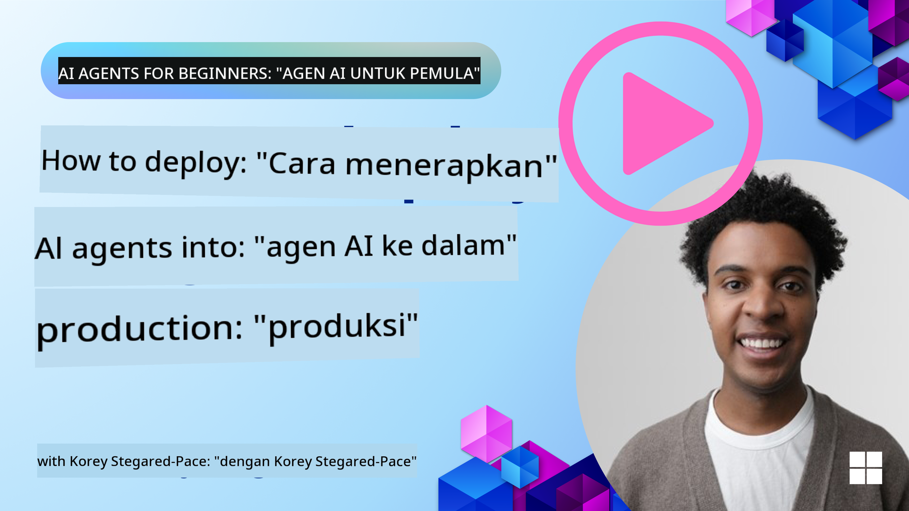

<!--
CO_OP_TRANSLATOR_METADATA:
{
  "original_hash": "cdfd0acc8592c1af14f8637833450375",
  "translation_date": "2025-08-29T18:02:33+00:00",
  "source_file": "10-ai-agents-production/README.md",
  "language_code": "id"
}
-->
# Agen AI di Produksi: Observabilitas & Evaluasi

[](https://youtu.be/l4TP6IyJxmQ?si=reGOyeqjxFevyDq9)

Saat agen AI beralih dari prototipe eksperimental ke aplikasi dunia nyata, kemampuan untuk memahami perilaku mereka, memantau kinerja mereka, dan mengevaluasi output mereka secara sistematis menjadi sangat penting.

## Tujuan Pembelajaran

Setelah menyelesaikan pelajaran ini, Anda akan mengetahui cara/memahami:
- Konsep inti observabilitas dan evaluasi agen
- Teknik untuk meningkatkan kinerja, biaya, dan efektivitas agen
- Apa dan bagaimana mengevaluasi agen AI Anda secara sistematis
- Cara mengontrol biaya saat menerapkan agen AI ke produksi
- Cara menginstrumentasi agen yang dibangun dengan AutoGen

Tujuannya adalah untuk membekali Anda dengan pengetahuan untuk mengubah agen "kotak hitam" Anda menjadi sistem yang transparan, dapat dikelola, dan dapat diandalkan.

_**Catatan:** Penting untuk menerapkan Agen AI yang aman dan dapat dipercaya. Lihat pelajaran [Membangun Agen AI yang Dapat Dipercaya](./06-building-trustworthy-agents/README.md) juga._

## Jejak dan Rentang

Alat observabilitas seperti [Langfuse](https://langfuse.com/) atau [Azure AI Foundry](https://learn.microsoft.com/en-us/azure/ai-foundry/what-is-azure-ai-foundry) biasanya merepresentasikan proses agen sebagai jejak dan rentang.

- **Jejak** merepresentasikan tugas agen lengkap dari awal hingga akhir (seperti menangani pertanyaan pengguna).
- **Rentang** adalah langkah-langkah individu dalam jejak (seperti memanggil model bahasa atau mengambil data).


Tanpa observabilitas, agen AI dapat terasa seperti "kotak hitam" - keadaan internal dan penalarannya tidak terlihat, sehingga sulit untuk mendiagnosis masalah atau mengoptimalkan kinerja. Dengan observabilitas, agen menjadi "kotak kaca," menawarkan transparansi yang penting untuk membangun kepercayaan dan memastikan mereka beroperasi sesuai yang diharapkan.

## Mengapa Observabilitas Penting di Lingkungan Produksi

Transisi agen AI ke lingkungan produksi memperkenalkan serangkaian tantangan dan kebutuhan baru. Observabilitas bukan lagi sekadar "tambahan yang bagus" tetapi menjadi kemampuan yang sangat penting:

*   **Debugging dan Analisis Penyebab Utama**: Ketika agen gagal atau menghasilkan output yang tidak terduga, alat observabilitas menyediakan jejak yang diperlukan untuk mengidentifikasi sumber kesalahan. Ini sangat penting dalam agen kompleks yang mungkin melibatkan banyak panggilan LLM, interaksi alat, dan logika bersyarat.
*   **Manajemen Latensi dan Biaya**: Agen AI sering mengandalkan LLM dan API eksternal yang dikenakan biaya per token atau per panggilan. Observabilitas memungkinkan pelacakan yang tepat terhadap panggilan ini, membantu mengidentifikasi operasi yang terlalu lambat atau mahal. Ini memungkinkan tim untuk mengoptimalkan prompt, memilih model yang lebih efisien, atau mendesain ulang alur kerja untuk mengelola biaya operasional dan memastikan pengalaman pengguna yang baik.
*   **Kepercayaan, Keamanan, dan Kepatuhan**: Dalam banyak aplikasi, penting untuk memastikan bahwa agen berperilaku aman dan etis. Observabilitas menyediakan jejak audit dari tindakan dan keputusan agen. Ini dapat digunakan untuk mendeteksi dan mengatasi masalah seperti injeksi prompt, pembuatan konten berbahaya, atau penanganan informasi pribadi yang tidak semestinya (PII). Misalnya, Anda dapat meninjau jejak untuk memahami mengapa agen memberikan respons tertentu atau menggunakan alat tertentu.
*   **Loop Peningkatan Berkelanjutan**: Data observabilitas adalah dasar dari proses pengembangan iteratif. Dengan memantau bagaimana agen bekerja di dunia nyata, tim dapat mengidentifikasi area untuk perbaikan, mengumpulkan data untuk penyempurnaan model, dan memvalidasi dampak perubahan. Ini menciptakan loop umpan balik di mana wawasan produksi dari evaluasi online menginformasikan eksperimen dan penyempurnaan offline, yang mengarah pada kinerja agen yang semakin baik.

## Metrik Utama yang Harus Dilacak

Untuk memantau dan memahami perilaku agen, berbagai metrik dan sinyal harus dilacak. Meskipun metrik spesifik mungkin berbeda berdasarkan tujuan agen, beberapa metrik bersifat universal.

Berikut adalah beberapa metrik paling umum yang dipantau oleh alat observabilitas:

**Latensi:** Seberapa cepat agen merespons? Waktu tunggu yang lama berdampak negatif pada pengalaman pengguna. Anda harus mengukur latensi untuk tugas dan langkah individu dengan melacak proses agen. Misalnya, agen yang membutuhkan waktu 20 detik untuk semua panggilan model dapat dipercepat dengan menggunakan model yang lebih cepat atau menjalankan panggilan model secara paralel.

**Biaya:** Berapa biaya per proses agen? Agen AI mengandalkan panggilan LLM yang dikenakan biaya per token atau API eksternal. Penggunaan alat yang sering atau banyak prompt dapat dengan cepat meningkatkan biaya. Misalnya, jika agen memanggil LLM lima kali untuk peningkatan kualitas yang marginal, Anda harus menilai apakah biaya tersebut sepadan atau apakah Anda dapat mengurangi jumlah panggilan atau menggunakan model yang lebih murah. Pemantauan real-time juga dapat membantu mengidentifikasi lonjakan yang tidak terduga (misalnya, bug yang menyebabkan loop API berlebihan).

**Kesalahan Permintaan:** Berapa banyak permintaan yang gagal dilakukan oleh agen? Ini dapat mencakup kesalahan API atau panggilan alat yang gagal. Untuk membuat agen Anda lebih tangguh terhadap hal ini di produksi, Anda dapat mengatur fallback atau retry. Misalnya, jika penyedia LLM A tidak aktif, Anda beralih ke penyedia LLM B sebagai cadangan.

**Umpan Balik Pengguna:** Implementasi evaluasi langsung dari pengguna memberikan wawasan berharga. Ini dapat mencakup penilaian eksplisit (👍thumbs-up/👎down, ⭐1-5 bintang) atau komentar teks. Umpan balik negatif yang konsisten harus menjadi peringatan karena ini adalah tanda bahwa agen tidak bekerja sebagaimana mestinya.

**Umpan Balik Pengguna Implisit:** Perilaku pengguna memberikan umpan balik tidak langsung bahkan tanpa penilaian eksplisit. Ini dapat mencakup pengulangan pertanyaan langsung, pertanyaan berulang, atau mengklik tombol retry. Misalnya, jika Anda melihat pengguna berulang kali mengajukan pertanyaan yang sama, ini adalah tanda bahwa agen tidak bekerja sebagaimana mestinya.

**Akurasi:** Seberapa sering agen menghasilkan output yang benar atau diinginkan? Definisi akurasi bervariasi (misalnya, kebenaran pemecahan masalah, akurasi pengambilan informasi, kepuasan pengguna). Langkah pertama adalah mendefinisikan apa yang dianggap sukses untuk agen Anda. Anda dapat melacak akurasi melalui pemeriksaan otomatis, skor evaluasi, atau label penyelesaian tugas. Misalnya, menandai jejak sebagai "berhasil" atau "gagal."

**Metrik Evaluasi Otomatis:** Anda juga dapat mengatur evaluasi otomatis. Misalnya, Anda dapat menggunakan LLM untuk menilai output agen, misalnya apakah itu membantu, akurat, atau tidak. Ada juga beberapa pustaka open source yang membantu Anda menilai berbagai aspek agen. Misalnya, [RAGAS](https://docs.ragas.io/) untuk agen RAG atau [LLM Guard](https://llm-guard.com/) untuk mendeteksi bahasa berbahaya atau injeksi prompt.

Dalam praktiknya, kombinasi metrik ini memberikan cakupan terbaik terhadap kesehatan agen AI. Dalam [notebook contoh](./code_samples/10_autogen_evaluation.ipynb) bab ini, kami akan menunjukkan bagaimana metrik ini terlihat dalam contoh nyata, tetapi pertama-tama, kami akan mempelajari bagaimana alur kerja evaluasi yang khas terlihat.

## Instrumentasi Agen Anda

Untuk mengumpulkan data jejak, Anda perlu menginstrumentasi kode Anda. Tujuannya adalah untuk menginstrumentasi kode agen agar menghasilkan jejak dan metrik yang dapat ditangkap, diproses, dan divisualisasikan oleh platform observabilitas.

**OpenTelemetry (OTel):** [OpenTelemetry](https://opentelemetry.io/) telah muncul sebagai standar industri untuk observabilitas LLM. Ini menyediakan serangkaian API, SDK, dan alat untuk menghasilkan, mengumpulkan, dan mengekspor data telemetri.

Ada banyak pustaka instrumentasi yang membungkus kerangka kerja agen yang ada dan mempermudah ekspor rentang OpenTelemetry ke alat observabilitas. Berikut adalah contoh instrumentasi agen AutoGen dengan pustaka instrumentasi [OpenLit](https://github.com/openlit/openlit):

```python
import openlit

openlit.init(tracer = langfuse._otel_tracer, disable_batch = True)
```

[Notebook contoh](./code_samples/10_autogen_evaluation.ipynb) dalam bab ini akan menunjukkan cara menginstrumentasi agen AutoGen Anda.

**Pembuatan Rentang Manual:** Meskipun pustaka instrumentasi menyediakan baseline yang baik, sering kali ada kasus di mana informasi yang lebih rinci atau khusus diperlukan. Anda dapat membuat rentang secara manual untuk menambahkan logika aplikasi khusus. Lebih penting lagi, mereka dapat memperkaya rentang yang dibuat secara otomatis atau manual dengan atribut khusus (juga dikenal sebagai tag atau metadata). Atribut ini dapat mencakup data spesifik bisnis, perhitungan antara, atau konteks apa pun yang mungkin berguna untuk debugging atau analisis, seperti `user_id`, `session_id`, atau `model_version`.

Contoh pembuatan jejak dan rentang secara manual dengan [Langfuse Python SDK](https://langfuse.com/docs/sdk/python/sdk-v3):

```python
from langfuse import get_client
 
langfuse = get_client()
 
span = langfuse.start_span(name="my-span")
 
span.end()
```

## Evaluasi Agen

Observabilitas memberikan metrik, tetapi evaluasi adalah proses menganalisis data tersebut (dan melakukan pengujian) untuk menentukan seberapa baik agen AI bekerja dan bagaimana ia dapat ditingkatkan. Dengan kata lain, setelah Anda memiliki jejak dan metrik tersebut, bagaimana Anda menggunakannya untuk menilai agen dan membuat keputusan?

Evaluasi rutin penting karena agen AI sering kali bersifat non-deterministik dan dapat berkembang (melalui pembaruan atau perubahan perilaku model) – tanpa evaluasi, Anda tidak akan tahu apakah "agen pintar" Anda benar-benar melakukan tugasnya dengan baik atau apakah ia mengalami kemunduran.

Ada dua kategori evaluasi untuk agen AI: **evaluasi online** dan **evaluasi offline**. Keduanya berharga, dan saling melengkapi. Biasanya, kami memulai dengan evaluasi offline, karena ini adalah langkah minimum yang diperlukan sebelum menerapkan agen apa pun.

### Evaluasi Offline


Ini melibatkan evaluasi agen dalam pengaturan yang terkendali, biasanya menggunakan dataset uji, bukan kueri pengguna langsung. Anda menggunakan dataset yang dikurasi di mana Anda tahu apa output yang diharapkan atau perilaku yang benar, lalu menjalankan agen Anda pada dataset tersebut.

Misalnya, jika Anda membangun agen soal cerita matematika, Anda mungkin memiliki [dataset uji](https://huggingface.co/datasets/gsm8k) berisi 100 soal dengan jawaban yang diketahui. Evaluasi offline sering dilakukan selama pengembangan (dan dapat menjadi bagian dari pipeline CI/CD) untuk memeriksa peningkatan atau melindungi dari kemunduran. Keuntungannya adalah bahwa ini **dapat diulang dan Anda dapat memperoleh metrik akurasi yang jelas karena Anda memiliki kebenaran dasar**. Anda juga dapat mensimulasikan kueri pengguna dan mengukur respons agen terhadap jawaban ideal atau menggunakan metrik otomatis seperti yang dijelaskan di atas.

Tantangan utama dengan evaluasi offline adalah memastikan dataset uji Anda komprehensif dan tetap relevan – agen mungkin bekerja dengan baik pada set uji tetap tetapi menghadapi kueri yang sangat berbeda di produksi. Oleh karena itu, Anda harus terus memperbarui set uji dengan kasus tepi baru dan contoh yang mencerminkan skenario dunia nyata​. Campuran kasus "uji asap" kecil dan set evaluasi yang lebih besar berguna: set kecil untuk pemeriksaan cepat dan yang lebih besar untuk metrik kinerja yang lebih luas​.

### Evaluasi Online


Ini merujuk pada evaluasi agen dalam lingkungan nyata, yaitu selama penggunaan aktual di produksi. Evaluasi online melibatkan pemantauan kinerja agen pada interaksi pengguna nyata dan menganalisis hasil secara terus-menerus.

Misalnya, Anda mungkin melacak tingkat keberhasilan, skor kepuasan pengguna, atau metrik lain pada lalu lintas langsung. Keuntungan dari evaluasi online adalah bahwa ini **menangkap hal-hal yang mungkin tidak Anda antisipasi dalam pengaturan laboratorium** – Anda dapat mengamati perubahan model dari waktu ke waktu (jika efektivitas agen menurun saat pola input bergeser) dan menangkap kueri atau situasi tak terduga yang tidak ada dalam data uji Anda​. Ini memberikan gambaran nyata tentang bagaimana agen berperilaku di lapangan.

Evaluasi online sering melibatkan pengumpulan umpan balik pengguna implisit dan eksplisit, seperti yang telah dibahas, dan mungkin menjalankan tes bayangan atau tes A/B (di mana versi baru agen berjalan paralel untuk dibandingkan dengan yang lama). Tantangannya adalah bahwa sulit untuk mendapatkan label atau skor yang dapat diandalkan untuk interaksi langsung – Anda mungkin mengandalkan umpan balik pengguna atau metrik hilir (seperti apakah pengguna mengklik hasil).

### Menggabungkan Keduanya

Evaluasi online dan offline tidak saling eksklusif; mereka sangat saling melengkapi. Wawasan dari pemantauan online (misalnya, jenis kueri pengguna baru di mana agen berkinerja buruk) dapat digunakan untuk menambah dan meningkatkan dataset uji offline. Sebaliknya, agen yang berkinerja baik dalam tes offline dapat lebih percaya diri diterapkan dan dipantau secara online.

Faktanya, banyak tim mengadopsi loop:

_evaluasi offline -> terapkan -> pantau online -> kumpulkan kasus kegagalan baru -> tambahkan ke dataset offline -> perbaiki agen -> ulangi_.

## Masalah Umum

Saat Anda menerapkan agen AI ke produksi, Anda mungkin menghadapi berbagai tantangan. Berikut adalah beberapa masalah umum dan solusi potensialnya:

| **Masalah**    | **Solusi Potensial**   |
| ------------- | ------------------ |
| Agen AI tidak konsisten dalam melakukan tugas | - Perbaiki prompt yang diberikan kepada Agen AI; jelaskan tujuan dengan jelas.<br>- Identifikasi di mana membagi tugas menjadi subtugas dan menanganinya oleh beberapa agen dapat membantu. |
| Agen AI mengalami loop terus-menerus  | - Pastikan Anda memiliki syarat dan ketentuan penghentian yang jelas sehingga Agen tahu kapan harus menghentikan proses. |

## Mengatasi Masalah Umum

Berikut adalah beberapa masalah umum yang mungkin Anda temui saat mengembangkan sistem agen AI, beserta strategi untuk mengatasinya:

| **Masalah**                                | **Strategi**                                                                 |
|--------------------------------------------|------------------------------------------------------------------------------|
| Model AI tidak memberikan hasil yang diharapkan | - Gunakan model yang lebih besar yang dirancang khusus untuk tugas yang membutuhkan penalaran kompleks. |
| Pemanggilan alat oleh agen AI tidak berjalan dengan baik | - Uji dan validasi output alat di luar sistem agen.<br>- Perbaiki parameter, prompt, dan penamaan alat yang telah ditentukan. |
| Sistem Multi-Agen tidak konsisten           | - Perbaiki prompt yang diberikan kepada setiap agen agar lebih spesifik dan berbeda satu sama lain.<br>- Bangun sistem hierarki menggunakan agen "routing" atau pengontrol untuk menentukan agen mana yang paling tepat. |

Banyak dari masalah ini dapat diidentifikasi lebih efektif dengan adanya observabilitas. Jejak dan metrik yang telah kita bahas sebelumnya membantu mengidentifikasi dengan tepat di mana masalah terjadi dalam alur kerja agen, sehingga proses debugging dan optimasi menjadi jauh lebih efisien.

## Mengelola Biaya

Berikut adalah beberapa strategi untuk mengelola biaya dalam menerapkan agen AI ke produksi:

**Menggunakan Model yang Lebih Kecil:** Small Language Models (SLMs) dapat bekerja dengan baik pada beberapa kasus penggunaan agen dan secara signifikan mengurangi biaya. Seperti yang disebutkan sebelumnya, membangun sistem evaluasi untuk menentukan dan membandingkan kinerja terhadap model yang lebih besar adalah cara terbaik untuk memahami seberapa baik SLM akan bekerja pada kasus penggunaan Anda. Pertimbangkan menggunakan SLM untuk tugas-tugas sederhana seperti klasifikasi intent atau ekstraksi parameter, sementara model yang lebih besar digunakan untuk penalaran kompleks.

**Menggunakan Model Router:** Strategi serupa adalah menggunakan beragam model dengan ukuran yang berbeda. Anda dapat menggunakan LLM/SLM atau fungsi serverless untuk mengarahkan permintaan berdasarkan kompleksitas ke model yang paling sesuai. Strategi ini juga membantu mengurangi biaya sambil memastikan kinerja pada tugas yang tepat. Misalnya, arahkan kueri sederhana ke model yang lebih kecil dan lebih cepat, dan hanya gunakan model besar yang mahal untuk tugas penalaran kompleks.

**Caching Respons:** Mengidentifikasi permintaan dan tugas yang umum serta menyediakan respons sebelum melalui sistem agen Anda adalah cara yang baik untuk mengurangi volume permintaan serupa. Anda bahkan dapat menerapkan alur untuk mengidentifikasi seberapa mirip suatu permintaan dengan permintaan yang telah di-cache menggunakan model AI yang lebih sederhana. Strategi ini dapat secara signifikan mengurangi biaya untuk pertanyaan yang sering diajukan atau alur kerja yang umum.

## Mari Lihat Bagaimana Ini Bekerja dalam Praktik

Dalam [notebook contoh pada bagian ini](./code_samples/10_autogen_evaluation.ipynb), kita akan melihat contoh bagaimana kita dapat menggunakan alat observabilitas untuk memantau dan mengevaluasi agen kita.

### Ada Pertanyaan Lebih Lanjut tentang Agen AI di Produksi?

Bergabunglah dengan [Azure AI Foundry Discord](https://aka.ms/ai-agents/discord) untuk bertemu dengan pelajar lainnya, menghadiri sesi tanya jawab, dan mendapatkan jawaban atas pertanyaan Anda tentang agen AI.

## Pelajaran Sebelumnya

[Metacognition Design Pattern](../09-metacognition/README.md)

## Pelajaran Selanjutnya

[Agentic Protocols](../11-agentic-protocols/README.md)

---

**Penafian**:  
Dokumen ini telah diterjemahkan menggunakan layanan penerjemahan AI [Co-op Translator](https://github.com/Azure/co-op-translator). Meskipun kami berusaha untuk memberikan hasil yang akurat, harap diingat bahwa terjemahan otomatis mungkin mengandung kesalahan atau ketidakakuratan. Dokumen asli dalam bahasa aslinya harus dianggap sebagai sumber yang otoritatif. Untuk informasi yang bersifat kritis, disarankan menggunakan jasa penerjemahan profesional oleh manusia. Kami tidak bertanggung jawab atas kesalahpahaman atau penafsiran yang keliru yang timbul dari penggunaan terjemahan ini.