<!--
CO_OP_TRANSLATOR_METADATA:
{
  "original_hash": "5cc6836626047aa055e8960c8484a7d0",
  "translation_date": "2025-08-29T18:31:40+00:00",
  "source_file": "11-agentic-protocols/code_samples/mcp-agents/README.md",
  "language_code": "id"
}
-->
# Membangun Sistem Komunikasi Antar-Agen dengan MCP

> TL;DR - Bisakah Anda Membangun Komunikasi Antar-Agen dengan MCP? Ya!

MCP telah berkembang jauh melampaui tujuan awalnya sebagai "penyedia konteks untuk LLMs". Dengan peningkatan terbaru seperti [resumable streams](https://modelcontextprotocol.io/docs/concepts/transports#resumability-and-redelivery), [elicitation](https://modelcontextprotocol.io/specification/2025-06-18/client/elicitation), [sampling](https://modelcontextprotocol.io/specification/2025-06-18/client/sampling), dan notifikasi ([progress](https://modelcontextprotocol.io/specification/2025-06-18/basic/utilities/progress) dan [resources](https://modelcontextprotocol.io/specification/2025-06-18/schema#resourceupdatednotification)), MCP kini menyediakan fondasi yang kuat untuk membangun sistem komunikasi antar-agen yang kompleks.

## Kesalahpahaman tentang Agen/Alat

Seiring semakin banyak pengembang yang mengeksplorasi alat dengan perilaku agen (berjalan dalam waktu lama, mungkin membutuhkan input tambahan di tengah eksekusi, dll.), muncul kesalahpahaman umum bahwa MCP tidak cocok, terutama karena contoh awal dari alat primitifnya berfokus pada pola permintaan-respons sederhana.

Pandangan ini sudah tidak relevan. Spesifikasi MCP telah ditingkatkan secara signifikan dalam beberapa bulan terakhir dengan kemampuan yang menutup celah untuk membangun perilaku agen yang berjalan lama:

- **Streaming & Hasil Parsial**: Pembaruan kemajuan secara real-time selama eksekusi
- **Resumability**: Klien dapat terhubung kembali dan melanjutkan setelah terputus
- **Durability**: Hasil tetap ada meskipun server restart (misalnya, melalui tautan sumber daya)
- **Multi-turn**: Input interaktif di tengah eksekusi melalui elicitation dan sampling

Fitur-fitur ini dapat dikombinasikan untuk memungkinkan aplikasi agenik dan multi-agen yang kompleks, semuanya diterapkan pada protokol MCP.

Sebagai referensi, kita akan merujuk pada agen sebagai "alat" yang tersedia di server MCP. Ini menyiratkan adanya aplikasi host yang mengimplementasikan klien MCP yang membangun sesi dengan server MCP dan dapat memanggil agen.

## Apa yang Membuat Alat MCP "Agenik"?

Sebelum masuk ke implementasi, mari kita tetapkan kemampuan infrastruktur apa yang diperlukan untuk mendukung agen yang berjalan lama.

> Kami akan mendefinisikan agen sebagai entitas yang dapat beroperasi secara otonom dalam jangka waktu yang lama, mampu menangani tugas-tugas kompleks yang mungkin memerlukan banyak interaksi atau penyesuaian berdasarkan umpan balik real-time.

### 1. Streaming & Hasil Parsial

Pola permintaan-respons tradisional tidak cocok untuk tugas yang berjalan lama. Agen perlu menyediakan:

- Pembaruan kemajuan secara real-time
- Hasil sementara

**Dukungan MCP**: Notifikasi pembaruan sumber daya memungkinkan streaming hasil parsial, meskipun ini memerlukan desain yang hati-hati untuk menghindari konflik dengan model permintaan/respons 1:1 JSON-RPC.

| Fitur                     | Kasus Penggunaan                                                                                                                                                                       | Dukungan MCP                                                                               |
| -------------------------- | ------------------------------------------------------------------------------------------------------------------------------------------------------------------------------------- | ------------------------------------------------------------------------------------------ |
| Pembaruan Kemajuan Real-time | Pengguna meminta tugas migrasi kode. Agen mengalirkan kemajuan: "10% - Menganalisis dependensi... 25% - Mengonversi file TypeScript... 50% - Memperbarui impor..."                   | ✅ Notifikasi kemajuan                                                                     |
| Hasil Parsial             | Tugas "Buat buku" mengalirkan hasil parsial, misalnya, 1) Garis besar alur cerita, 2) Daftar bab, 3) Setiap bab saat selesai. Host dapat memeriksa, membatalkan, atau mengarahkan ulang di setiap tahap. | ✅ Notifikasi dapat "diperluas" untuk menyertakan hasil parsial lihat proposal pada PR 383, 776 |

<div align="center" style="font-style: italic; font-size: 0.95em; margin-bottom: 0.5em;">
<strong>Gambar 1:</strong> Diagram ini menggambarkan bagaimana agen MCP mengalirkan pembaruan kemajuan real-time dan hasil parsial ke aplikasi host selama tugas yang berjalan lama, memungkinkan pengguna memantau eksekusi secara real-time.
</div>


### 2. Resumability

Agen harus menangani gangguan jaringan dengan baik:

- Terhubung kembali setelah (klien) terputus
- Melanjutkan dari tempat mereka berhenti (pengiriman ulang pesan)

**Dukungan MCP**: Transport StreamableHTTP MCP saat ini mendukung kelanjutan sesi dan pengiriman ulang pesan dengan ID sesi dan ID acara terakhir. Catatan penting di sini adalah bahwa server harus mengimplementasikan EventStore yang memungkinkan pemutaran ulang acara saat klien terhubung kembali.  
Perlu dicatat bahwa ada proposal komunitas (PR #975) yang mengeksplorasi streaming yang dapat dilanjutkan tanpa bergantung pada transport tertentu.

| Fitur         | Kasus Penggunaan                                                                                                                                                   | Dukungan MCP                                                                |
| ------------- | ------------------------------------------------------------------------------------------------------------------------------------------------------------------ | -------------------------------------------------------------------------- |
| Resumability  | Klien terputus selama tugas yang berjalan lama. Setelah terhubung kembali, sesi dilanjutkan dengan acara yang terlewat diputar ulang, melanjutkan dengan mulus dari tempat terakhir. | ✅ Transport StreamableHTTP dengan ID sesi, pemutaran ulang acara, dan EventStore |

```mermaid
sequenceDiagram
    participant User
    participant Host as Host App<br/>(MCP Client)
    participant Server as MCP Server<br/>(Agent Tool)
    participant Store as Event Store

    User->>Host: Start task
    Host->>Server: Call tool [session: abc123]
    Server->>Store: Save events

    Note over Host,Server: 💥 Connection lost

    Host->>Server: Reconnect [session: abc123]
    Store-->>Server: Replay events
    Server-->>Host: Catch up + continue
    Host-->>User: ✅ Complete
```

<div align="center" style="font-style: italic; font-size: 0.95em; margin-bottom: 0.5em;">
<strong>Gambar 2:</strong> Diagram ini menunjukkan bagaimana transport StreamableHTTP MCP dan event store memungkinkan kelanjutan sesi yang mulus: jika klien terputus, ia dapat terhubung kembali dan memutar ulang acara yang terlewat, melanjutkan tugas tanpa kehilangan kemajuan.
</div>



### 3. Durability

Agen yang berjalan lama membutuhkan status yang persisten:

- Hasil tetap ada meskipun server restart
- Status dapat diambil di luar sesi
- Pelacakan kemajuan lintas sesi

**Dukungan MCP**: MCP kini mendukung tipe pengembalian tautan sumber daya untuk panggilan alat. Saat ini, pola yang memungkinkan adalah merancang alat yang membuat sumber daya dan segera mengembalikan tautan sumber daya. Alat dapat terus menangani tugas di latar belakang dan memperbarui sumber daya. Sebaliknya, klien dapat memilih untuk memeriksa status sumber daya ini untuk mendapatkan hasil parsial atau penuh (berdasarkan pembaruan sumber daya yang disediakan server) atau berlangganan sumber daya untuk notifikasi pembaruan.

Satu keterbatasan di sini adalah bahwa polling sumber daya atau berlangganan pembaruan dapat mengonsumsi sumber daya dengan implikasi pada skala. Ada proposal komunitas terbuka (termasuk #992) yang mengeksplorasi kemungkinan menyertakan webhook atau pemicu yang dapat dipanggil server untuk memberi tahu klien/aplikasi host tentang pembaruan.

| Fitur       | Kasus Penggunaan                                                                                                                                        | Dukungan MCP                                                        |
| ----------- | ------------------------------------------------------------------------------------------------------------------------------------------------------- | ------------------------------------------------------------------ |
| Durability  | Server crash selama tugas migrasi data. Hasil dan kemajuan tetap ada setelah restart, klien dapat memeriksa status dan melanjutkan dari sumber daya yang persisten. | ✅ Tautan sumber daya dengan penyimpanan persisten dan notifikasi status |

Saat ini, pola umum adalah merancang alat yang membuat sumber daya dan segera mengembalikan tautan sumber daya. Alat dapat menangani tugas di latar belakang, mengeluarkan notifikasi sumber daya yang berfungsi sebagai pembaruan kemajuan atau menyertakan hasil parsial, dan memperbarui konten dalam sumber daya sesuai kebutuhan.

```mermaid
sequenceDiagram
    participant User
    participant Host as Host App<br/>(MCP Client)
    participant Server as MCP Server<br/>(Agent Tool)
    participant DB as Persistent Storage

    User->>Host: Start task
    Host->>Server: Call tool
    Server->>DB: Create resource + updates
    Server-->>Host: 🔗 Resource link

    Note over Server: 💥 Server restart

    User->>Host: Check status
    Host->>Server: Get resource
    Server->>DB: Load state
    Server-->>Host: Current progress
    Server->>DB: Complete + notify
    Host-->>User: ✅ Complete
```

<div align="center" style="font-style: italic; font-size: 0.95em; margin-bottom: 0.5em;">
<strong>Gambar 3:</strong> Diagram ini menunjukkan bagaimana agen MCP menggunakan sumber daya persisten dan notifikasi status untuk memastikan bahwa tugas yang berjalan lama tetap ada meskipun server restart, memungkinkan klien memeriksa kemajuan dan mengambil hasil bahkan setelah kegagalan.
</div>



### 4. Interaksi Multi-Turn

Agen sering membutuhkan input tambahan di tengah eksekusi:

- Klarifikasi atau persetujuan manusia
- Bantuan AI untuk keputusan kompleks
- Penyesuaian parameter dinamis

**Dukungan MCP**: Sepenuhnya didukung melalui sampling (untuk input AI) dan elicitation (untuk input manusia).

| Fitur                  | Kasus Penggunaan                                                                                                                                     | Dukungan MCP                                           |
| ---------------------- | ---------------------------------------------------------------------------------------------------------------------------------------------------- | ----------------------------------------------------- |
| Interaksi Multi-Turn   | Agen pemesanan perjalanan meminta konfirmasi harga dari pengguna, lalu meminta AI untuk merangkum data perjalanan sebelum menyelesaikan transaksi pemesanan. | ✅ Elicitation untuk input manusia, sampling untuk input AI |

```mermaid
sequenceDiagram
    participant User
    participant Host as Host App<br/>(MCP Client)
    participant Server as MCP Server<br/>(Agent Tool)

    User->>Host: Book flight
    Host->>Server: Call travel_agent

    Server->>Host: Elicitation: "Confirm $500?"
    Note over Host: Elicitation callback (if available)
    Host->>User: 💰 Confirm price?
    User->>Host: "Yes"
    Host->>Server: Confirmed

    Server->>Host: Sampling: "Summarize data"
    Note over Host: AI callback (if available)
    Host->>Server: Report summary

    Server->>Host: ✅ Flight booked
```

<div align="center" style="font-style: italic; font-size: 0.95em; margin-bottom: 0.5em;">
<strong>Gambar 4:</strong> Diagram ini menggambarkan bagaimana agen MCP dapat secara interaktif meminta input manusia atau bantuan AI di tengah eksekusi, mendukung alur kerja kompleks multi-turn seperti konfirmasi dan pengambilan keputusan dinamis.
</div>



## Implementasi Agen yang Berjalan Lama di MCP - Gambaran Kode

Sebagai bagian dari artikel ini, kami menyediakan [repositori kode](https://github.com/victordibia/ai-tutorials/tree/main/MCP%20Agents) yang berisi implementasi lengkap agen yang berjalan lama menggunakan MCP Python SDK dengan transport StreamableHTTP untuk kelanjutan sesi dan pengiriman ulang pesan. Implementasi ini menunjukkan bagaimana kemampuan MCP dapat dikombinasikan untuk memungkinkan perilaku seperti agen yang canggih.

Secara khusus, kami mengimplementasikan server dengan dua alat agen utama:

- **Travel Agent** - Mensimulasikan layanan pemesanan perjalanan dengan konfirmasi harga melalui elicitation
- **Research Agent** - Melakukan tugas penelitian dengan ringkasan yang dibantu AI melalui sampling

Kedua agen menunjukkan pembaruan kemajuan real-time, konfirmasi interaktif, dan kemampuan kelanjutan sesi penuh.

### Konsep Implementasi Utama

Bagian berikut menunjukkan implementasi agen di sisi server dan penanganan host di sisi klien untuk setiap kemampuan:

#### Streaming & Pembaruan Kemajuan - Status Tugas Real-time

Streaming memungkinkan agen memberikan pembaruan kemajuan real-time selama tugas yang berjalan lama, menjaga pengguna tetap terinformasi tentang status tugas dan hasil sementara.

**Implementasi Server (agen mengirim notifikasi kemajuan):**

```python
# From server/server.py - Travel agent sending progress updates
for i, step in enumerate(steps):
    await ctx.session.send_progress_notification(
        progress_token=ctx.request_id,
        progress=i * 25,
        total=100,
        message=step,
        related_request_id=str(ctx.request_id)
    )
    await anyio.sleep(2)  # Simulate work

# Alternative: Log messages for detailed step-by-step updates
await ctx.session.send_log_message(
    level="info",
    data=f"Processing step {current_step}/{steps} ({progress_percent}%)",
    logger="long_running_agent",
    related_request_id=ctx.request_id,
)
```

**Implementasi Klien (host menerima pembaruan kemajuan):**

```python
# From client/client.py - Client handling real-time notifications
async def message_handler(message) -> None:
    if isinstance(message, types.ServerNotification):
        if isinstance(message.root, types.LoggingMessageNotification):
            console.print(f"📡 [dim]{message.root.params.data}[/dim]")
        elif isinstance(message.root, types.ProgressNotification):
            progress = message.root.params
            console.print(f"🔄 [yellow]{progress.message} ({progress.progress}/{progress.total})[/yellow]")

# Register message handler when creating session
async with ClientSession(
    read_stream, write_stream,
    message_handler=message_handler
) as session:
```

#### Elicitation - Meminta Input Pengguna

Elicitation memungkinkan agen meminta input pengguna di tengah eksekusi. Ini penting untuk konfirmasi, klarifikasi, atau persetujuan selama tugas yang berjalan lama.

**Implementasi Server (agen meminta konfirmasi):**

```python
# From server/server.py - Travel agent requesting price confirmation
elicit_result = await ctx.session.elicit(
    message=f"Please confirm the estimated price of $1200 for your trip to {destination}",
    requestedSchema=PriceConfirmationSchema.model_json_schema(),
    related_request_id=ctx.request_id,
)

if elicit_result and elicit_result.action == "accept":
    # Continue with booking
    logger.info(f"User confirmed price: {elicit_result.content}")
elif elicit_result and elicit_result.action == "decline":
    # Cancel the booking
    booking_cancelled = True
```

**Implementasi Klien (host menyediakan callback elicitation):**

```python
# From client/client.py - Client handling elicitation requests
async def elicitation_callback(context, params):
    console.print(f"💬 Server is asking for confirmation:")
    console.print(f"   {params.message}")

    response = console.input("Do you accept? (y/n): ").strip().lower()

    if response in ['y', 'yes']:
        return types.ElicitResult(
            action="accept",
            content={"confirm": True, "notes": "Confirmed by user"}
        )
    else:
        return types.ElicitResult(
            action="decline",
            content={"confirm": False, "notes": "Declined by user"}
        )

# Register the callback when creating the session
async with ClientSession(
    read_stream, write_stream,
    elicitation_callback=elicitation_callback
) as session:
```

#### Sampling - Meminta Bantuan AI

Sampling memungkinkan agen meminta bantuan LLM untuk keputusan kompleks atau pembuatan konten selama eksekusi. Ini memungkinkan alur kerja hibrida manusia-AI.

**Implementasi Server (agen meminta bantuan AI):**

```python
# From server/server.py - Research agent requesting AI summary
sampling_result = await ctx.session.create_message(
    messages=[
        SamplingMessage(
            role="user",
            content=TextContent(type="text", text=f"Please summarize the key findings for research on: {topic}")
        )
    ],
    max_tokens=100,
    related_request_id=ctx.request_id,
)

if sampling_result and sampling_result.content:
    if sampling_result.content.type == "text":
        sampling_summary = sampling_result.content.text
        logger.info(f"Received sampling summary: {sampling_summary}")
```

**Implementasi Klien (host menyediakan callback sampling):**

```python
# From client/client.py - Client handling sampling requests
async def sampling_callback(context, params):
    message_text = params.messages[0].content.text if params.messages else 'No message'
    console.print(f"🧠 Server requested sampling: {message_text}")

    # In a real application, this could call an LLM API
    # For demo purposes, we provide a mock response
    mock_response = "Based on current research, MCP has evolved significantly..."

    return types.CreateMessageResult(
        role="assistant",
        content=types.TextContent(type="text", text=mock_response),
        model="interactive-client",
        stopReason="endTurn"
    )

# Register the callback when creating the session
async with ClientSession(
    read_stream, write_stream,
    sampling_callback=sampling_callback,
    elicitation_callback=elicitation_callback
) as session:
```

#### Resumability - Kelanjutan Sesi Setelah Terputus

Resumability memastikan bahwa tugas agen yang berjalan lama dapat bertahan dari gangguan klien dan melanjutkan dengan mulus setelah terhubung kembali. Ini diimplementasikan melalui event store dan token kelanjutan.

**Implementasi Event Store (server menyimpan status sesi):**

```python
# From server/event_store.py - Simple in-memory event store
class SimpleEventStore(EventStore):
    def __init__(self):
        self._events: list[tuple[StreamId, EventId, JSONRPCMessage]] = []
        self._event_id_counter = 0

    async def store_event(self, stream_id: StreamId, message: JSONRPCMessage) -> EventId:
        """Store an event and return its ID."""
        self._event_id_counter += 1
        event_id = str(self._event_id_counter)
        self._events.append((stream_id, event_id, message))
        return event_id

    async def replay_events_after(self, last_event_id: EventId, send_callback: EventCallback) -> StreamId | None:
        """Replay events after the specified ID for resumption."""
        # Find events after the last known event and replay them
        for _, event_id, message in self._events[start_index:]:
            await send_callback(EventMessage(message, event_id))

# From server/server.py - Passing event store to session manager
def create_server_app(event_store: Optional[EventStore] = None) -> Starlette:
    server = ResumableServer()

    # Create session manager with event store for resumption
    session_manager = StreamableHTTPSessionManager(
        app=server,
        event_store=event_store,  # Event store enables session resumption
        json_response=False,
        security_settings=security_settings,
    )

    return Starlette(routes=[Mount("/mcp", app=session_manager.handle_request)])

# Usage: Initialize with event store
event_store = SimpleEventStore()
app = create_server_app(event_store)
```

**Metadata Klien dengan Token Kelanjutan (klien terhubung kembali menggunakan status yang disimpan):**

```python
# From client/client.py - Client resumption with metadata
if existing_tokens and existing_tokens.get("resumption_token"):
    # Use existing resumption token to continue where we left off
    metadata = ClientMessageMetadata(
        resumption_token=existing_tokens["resumption_token"],
    )
else:
    # Create callback to save resumption token when received
    def enhanced_callback(token: str):
        protocol_version = getattr(session, 'protocol_version', None)
        token_manager.save_tokens(session_id, token, protocol_version, command, args)

    metadata = ClientMessageMetadata(
        on_resumption_token_update=enhanced_callback,
    )

# Send request with resumption metadata
result = await session.send_request(
    types.ClientRequest(
        types.CallToolRequest(
            method="tools/call",
            params=types.CallToolRequestParams(name=command, arguments=args)
        )
    ),
    types.CallToolResult,
    metadata=metadata,
)
```

Aplikasi host mempertahankan ID sesi dan token kelanjutan secara lokal, memungkinkan untuk terhubung kembali ke sesi yang ada tanpa kehilangan kemajuan atau status.

### Organisasi Kode

<div align="center" style="font-style: italic; font-size: 0.95em; margin-bottom: 0.5em;">
<strong>Gambar 5:</strong> Arsitektur sistem agen berbasis MCP
</div>


**File Utama:**

- **`server/server.py`** - Server MCP yang dapat dilanjutkan dengan agen perjalanan dan penelitian yang menunjukkan elicitation, sampling, dan pembaruan kemajuan
- **`client/client.py`** - Aplikasi host interaktif dengan dukungan kelanjutan, handler callback, dan manajemen token
- **`server/event_store.py`** - Implementasi event store yang memungkinkan kelanjutan sesi dan pengiriman ulang pesan

## Memperluas ke Komunikasi Multi-Agen di MCP

Implementasi di atas dapat diperluas ke sistem multi-agen dengan meningkatkan kecerdasan dan cakupan aplikasi host:

- **Dekomposisi Tugas Cerdas**: Host menganalisis permintaan pengguna yang kompleks dan memecahnya menjadi subtugas untuk agen khusus yang berbeda
- **Koordinasi Multi-Server**: Host mempertahankan koneksi ke beberapa server MCP, masing-masing mengekspos kemampuan agen yang berbeda
- **Manajemen Status Tugas**: Host melacak kemajuan di beberapa tugas agen yang berjalan bersamaan, menangani dependensi dan penjadwalan
- **Ketahanan & Pengulangan**: Host mengelola kegagalan, menerapkan logika pengulangan, dan mengarahkan ulang tugas saat agen tidak tersedia
- **Sintesis Hasil**: Host menggabungkan output dari beberapa agen menjadi hasil akhir yang koheren

Host berkembang dari klien sederhana menjadi orkestrator cerdas, mengoordinasikan kemampuan agen yang terdistribusi sambil mempertahankan fondasi protokol MCP yang sama.

## Kesimpulan

Kemampuan MCP yang ditingkatkan - notifikasi sumber daya, elicitation/sampling, streaming yang dapat dilanjutkan, dan sumber daya persisten - memungkinkan interaksi kompleks antar-agen sambil mempertahankan kesederhanaan protokol.

## Memulai

Siap membangun sistem agent2agent Anda sendiri? Ikuti langkah-langkah ini:

### 1. Jalankan Demo

```bash
# Start the server with event store for resumption
python -m server.server --port 8006

# In another terminal, run the interactive client
python -m client.client --url http://127.0.0.1:8006/mcp
```

**Perintah yang tersedia dalam mode interaktif:**

- `travel_agent` - Pesan perjalanan dengan konfirmasi harga melalui elicitation
- `research_agent` - Teliti topik dengan ringkasan yang dibantu AI melalui sampling
- `list` - Tampilkan semua alat yang tersedia
- `clean-tokens` - Hapus token kelanjutan
- `help` - Tampilkan bantuan perintah yang rinci
- `quit` - Keluar dari klien

### 2. Uji Kemampuan Kelanjutan

- Mulai agen yang berjalan lama (misalnya, `travel_agent`)
- Ganggu klien selama eksekusi (Ctrl+C)
- Restart klien - klien akan secara otomatis melanjutkan dari tempat terakhir

### 3. Eksplorasi dan Perluas

- **Eksplorasi contoh**: Lihat [mcp-agents](https://github.com/victordibia/ai-tutorials/tree/main/MCP%20Agents)
- **Bergabung dengan komunitas**: Ikuti diskusi MCP di GitHub
- **Bereksperimen**: Mulailah dengan tugas yang berjalan lama sederhana dan secara bertahap tambahkan streaming, kelanjutan, dan koordinasi multi-agen

Ini menunjukkan bagaimana MCP memungkinkan perilaku agen yang cerdas sambil mempertahankan kesederhanaan berbasis alat.

Secara keseluruhan, spesifikasi protokol MCP berkembang pesat; pembaca didorong untuk meninjau situs web dokumentasi resmi untuk pembaruan terbaru - https://modelcontextprotocol.io/introduction

---

**Penafian**:  
Dokumen ini telah diterjemahkan menggunakan layanan penerjemahan AI [Co-op Translator](https://github.com/Azure/co-op-translator). Meskipun kami berusaha untuk memberikan hasil yang akurat, harap diingat bahwa terjemahan otomatis mungkin mengandung kesalahan atau ketidakakuratan. Dokumen asli dalam bahasa aslinya harus dianggap sebagai sumber yang otoritatif. Untuk informasi yang bersifat kritis, disarankan menggunakan jasa penerjemahan profesional oleh manusia. Kami tidak bertanggung jawab atas kesalahpahaman atau penafsiran yang keliru yang timbul dari penggunaan terjemahan ini.