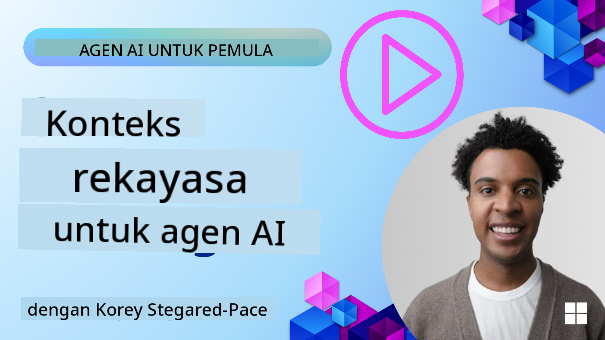
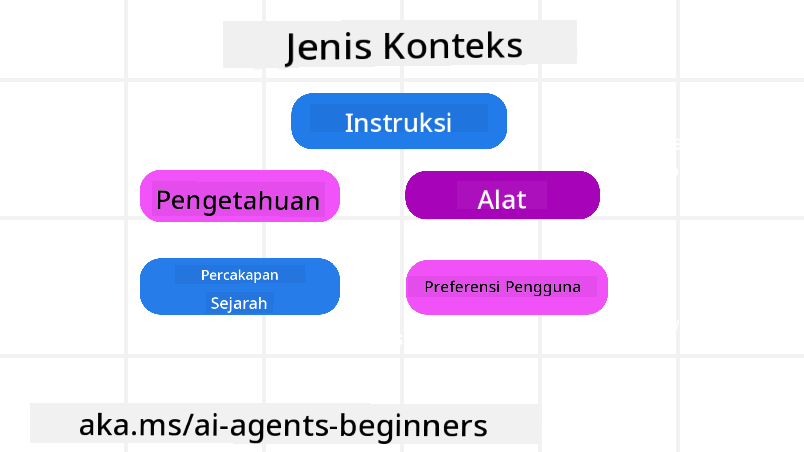
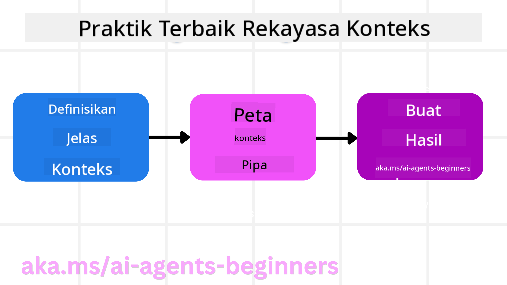

<!--
CO_OP_TRANSLATOR_METADATA:
{
  "original_hash": "cb7e50f471905ce6fdb92a30269a7a98",
  "translation_date": "2025-09-04T10:18:39+00:00",
  "source_file": "12-context-engineering/README.md",
  "language_code": "id"
}
-->
# Rekayasa Konteks untuk Agen AI

> _(Klik gambar di atas untuk menonton video pelajaran ini)_

Memahami kompleksitas aplikasi yang Anda bangun untuk agen AI sangat penting untuk membuatnya dapat diandalkan. Kita perlu membangun agen AI yang secara efektif mengelola informasi untuk memenuhi kebutuhan kompleks di luar rekayasa prompt.

Dalam pelajaran ini, kita akan membahas apa itu rekayasa konteks dan perannya dalam membangun agen AI.

## Pendahuluan

Pelajaran ini akan mencakup:

• **Apa itu Rekayasa Konteks** dan mengapa ini berbeda dari rekayasa prompt.

• **Strategi untuk Rekayasa Konteks yang Efektif**, termasuk cara menulis, memilih, mengompres, dan mengisolasi informasi.

• **Kegagalan Konteks Umum** yang dapat mengganggu agen AI Anda dan cara memperbaikinya.

## Tujuan Pembelajaran

Setelah menyelesaikan pelajaran ini, Anda akan memahami cara:

• **Mendefinisikan rekayasa konteks** dan membedakannya dari rekayasa prompt.

• **Mengidentifikasi komponen utama konteks** dalam aplikasi Model Bahasa Besar (LLM).

• **Menerapkan strategi untuk menulis, memilih, mengompres, dan mengisolasi konteks** guna meningkatkan kinerja agen.

• **Mengenali kegagalan konteks umum** seperti peracunan, gangguan, kebingungan, dan benturan, serta menerapkan teknik mitigasi.

## Apa itu Rekayasa Konteks?

Untuk agen AI, konteks adalah yang mendorong perencanaan agen AI untuk mengambil tindakan tertentu. Rekayasa Konteks adalah praktik memastikan agen AI memiliki informasi yang tepat untuk menyelesaikan langkah berikutnya dari tugas. Jendela konteks memiliki ukuran yang terbatas, sehingga sebagai pembangun agen, kita perlu membuat sistem dan proses untuk mengelola penambahan, penghapusan, dan pengurangan informasi dalam jendela konteks.

### Rekayasa Prompt vs Rekayasa Konteks

Rekayasa prompt berfokus pada satu set instruksi statis untuk secara efektif membimbing agen AI dengan seperangkat aturan. Rekayasa konteks adalah cara mengelola kumpulan informasi dinamis, termasuk prompt awal, untuk memastikan agen AI memiliki apa yang dibutuhkan seiring waktu. Ide utama dari rekayasa konteks adalah membuat proses ini dapat diulang dan dapat diandalkan.

### Jenis Konteks

Penting untuk diingat bahwa konteks bukan hanya satu hal. Informasi yang dibutuhkan agen AI dapat berasal dari berbagai sumber, dan tugas kita adalah memastikan agen memiliki akses ke sumber-sumber ini:

Jenis konteks yang mungkin perlu dikelola oleh agen AI meliputi:

• **Instruksi:** Ini seperti "aturan" agen – prompt, pesan sistem, contoh few-shot (menunjukkan kepada AI cara melakukan sesuatu), dan deskripsi alat yang dapat digunakan. Di sinilah fokus rekayasa prompt bergabung dengan rekayasa konteks.

• **Pengetahuan:** Ini mencakup fakta, informasi yang diambil dari basis data, atau memori jangka panjang yang telah dikumpulkan oleh agen. Ini termasuk integrasi sistem Retrieval Augmented Generation (RAG) jika agen membutuhkan akses ke berbagai penyimpanan pengetahuan dan basis data.

• **Alat:** Ini adalah definisi fungsi eksternal, API, dan server MCP yang dapat dipanggil oleh agen, bersama dengan umpan balik (hasil) yang diperoleh dari penggunaannya.

• **Riwayat Percakapan:** Dialog yang sedang berlangsung dengan pengguna. Seiring waktu, percakapan ini menjadi lebih panjang dan kompleks, yang berarti mereka memakan ruang dalam jendela konteks.

• **Preferensi Pengguna:** Informasi yang dipelajari tentang kesukaan atau ketidaksukaan pengguna dari waktu ke waktu. Informasi ini dapat disimpan dan digunakan saat membuat keputusan penting untuk membantu pengguna.

## Strategi untuk Rekayasa Konteks yang Efektif

### Strategi Perencanaan

Rekayasa konteks yang baik dimulai dengan perencanaan yang baik. Berikut adalah pendekatan yang akan membantu Anda mulai memikirkan cara menerapkan konsep rekayasa konteks:

1. **Tentukan Hasil yang Jelas** - Hasil dari tugas yang akan diberikan kepada agen AI harus didefinisikan dengan jelas. Jawab pertanyaan - "Bagaimana dunia akan terlihat ketika agen AI selesai dengan tugasnya?" Dengan kata lain, perubahan, informasi, atau respons apa yang harus dimiliki pengguna setelah berinteraksi dengan agen AI.

2. **Peta Konteks** - Setelah Anda mendefinisikan hasil dari agen AI, Anda perlu menjawab pertanyaan "Informasi apa yang dibutuhkan agen AI untuk menyelesaikan tugas ini?". Dengan cara ini, Anda dapat mulai memetakan konteks di mana informasi tersebut dapat ditemukan.

3. **Buat Jalur Konteks** - Sekarang setelah Anda tahu di mana informasi berada, Anda perlu menjawab pertanyaan "Bagaimana agen akan mendapatkan informasi ini?". Ini dapat dilakukan dengan berbagai cara termasuk RAG, penggunaan server MCP, dan alat lainnya.

### Strategi Praktis

Perencanaan itu penting, tetapi begitu informasi mulai mengalir ke jendela konteks agen, kita perlu memiliki strategi praktis untuk mengelolanya:

#### Mengelola Konteks

Meskipun beberapa informasi akan ditambahkan ke jendela konteks secara otomatis, rekayasa konteks adalah tentang mengambil peran yang lebih aktif terhadap informasi ini, yang dapat dilakukan dengan beberapa strategi:

1. **Scratchpad Agen**  
   Ini memungkinkan agen AI mencatat informasi relevan tentang tugas saat ini dan interaksi pengguna selama satu sesi. Catatan ini harus ada di luar jendela konteks dalam file atau objek runtime yang dapat diambil agen nanti selama sesi ini jika diperlukan.

2. **Memori**  
   Scratchpad bagus untuk mengelola informasi di luar jendela konteks satu sesi. Memori memungkinkan agen menyimpan dan mengambil informasi relevan di berbagai sesi. Ini dapat mencakup ringkasan, preferensi pengguna, dan umpan balik untuk perbaikan di masa depan.

3. **Mengompres Konteks**  
   Ketika jendela konteks tumbuh dan mendekati batasnya, teknik seperti peringkasan dan pemangkasan dapat digunakan. Ini termasuk hanya menyimpan informasi yang paling relevan atau menghapus pesan yang lebih lama.

4. **Sistem Multi-Agen**  
   Mengembangkan sistem multi-agen adalah bentuk rekayasa konteks karena setiap agen memiliki jendela konteksnya sendiri. Bagaimana konteks itu dibagikan dan diteruskan ke agen lain adalah hal lain yang perlu direncanakan saat membangun sistem ini.

5. **Lingkungan Sandbox**  
   Jika agen perlu menjalankan kode atau memproses sejumlah besar informasi dalam dokumen, ini dapat memakan banyak token untuk memproses hasilnya. Alih-alih menyimpan semuanya di jendela konteks, agen dapat menggunakan lingkungan sandbox yang mampu menjalankan kode ini dan hanya membaca hasil serta informasi relevan lainnya.

6. **Objek Status Runtime**  
   Ini dilakukan dengan membuat wadah informasi untuk mengelola situasi ketika agen perlu memiliki akses ke informasi tertentu. Untuk tugas yang kompleks, ini memungkinkan agen menyimpan hasil dari setiap langkah subtugas secara bertahap, menjaga konteks tetap terhubung hanya dengan subtugas tertentu.

### Contoh Rekayasa Konteks

Misalnya, kita ingin agen AI **"Pesankan saya perjalanan ke Paris."**

• Agen sederhana yang hanya menggunakan rekayasa prompt mungkin hanya merespons: **"Baik, kapan Anda ingin pergi ke Paris?"**. Agen ini hanya memproses pertanyaan langsung Anda pada saat itu.

• Agen yang menggunakan strategi rekayasa konteks yang dibahas akan melakukan lebih banyak. Sebelum merespons, sistemnya mungkin:

  ◦ **Memeriksa kalender Anda** untuk tanggal yang tersedia (mengambil data real-time).

 ◦ **Mengingat preferensi perjalanan sebelumnya** (dari memori jangka panjang) seperti maskapai favorit Anda, anggaran, atau apakah Anda lebih suka penerbangan langsung.

 ◦ **Mengidentifikasi alat yang tersedia** untuk pemesanan penerbangan dan hotel.

- Kemudian, respons contohnya bisa berupa: "Hai [Nama Anda]! Saya melihat Anda bebas minggu pertama Oktober. Apakah saya harus mencari penerbangan langsung ke Paris dengan [Maskapai Favorit] dalam anggaran biasa Anda sebesar [Anggaran]?" Respons yang lebih kaya dan sadar konteks ini menunjukkan kekuatan rekayasa konteks.

## Kegagalan Konteks Umum

### Peracunan Konteks

**Apa itu:** Ketika halusinasi (informasi palsu yang dihasilkan oleh LLM) atau kesalahan masuk ke konteks dan terus dirujuk, menyebabkan agen mengejar tujuan yang tidak mungkin atau mengembangkan strategi yang tidak masuk akal.

**Apa yang harus dilakukan:** Terapkan **validasi konteks** dan **karantina**. Validasi informasi sebelum ditambahkan ke memori jangka panjang. Jika potensi peracunan terdeteksi, mulai utas konteks baru untuk mencegah penyebaran informasi buruk.

**Contoh Pemesanan Perjalanan:** Agen Anda berhalusinasi tentang **penerbangan langsung dari bandara lokal kecil ke kota internasional yang jauh** yang sebenarnya tidak menawarkan penerbangan internasional. Detail penerbangan yang tidak ada ini disimpan ke dalam konteks. Kemudian, ketika Anda meminta agen untuk memesan, ia terus mencoba mencari tiket untuk rute yang tidak mungkin ini, menyebabkan kesalahan berulang.

**Solusi:** Terapkan langkah yang **memvalidasi keberadaan penerbangan dan rute dengan API real-time** _sebelum_ menambahkan detail penerbangan ke konteks kerja agen. Jika validasi gagal, informasi yang salah "dikarantina" dan tidak digunakan lebih lanjut.

### Gangguan Konteks

**Apa itu:** Ketika konteks menjadi terlalu besar sehingga model terlalu fokus pada riwayat yang terakumulasi daripada menggunakan apa yang dipelajari selama pelatihan, menyebabkan tindakan yang berulang atau tidak membantu. Model mungkin mulai membuat kesalahan bahkan sebelum jendela konteks penuh.

**Apa yang harus dilakukan:** Gunakan **peringkasan konteks**. Secara berkala kompres informasi yang terakumulasi menjadi ringkasan yang lebih pendek, menjaga detail penting sambil menghapus riwayat yang berlebihan. Ini membantu "mengatur ulang" fokus.

**Contoh Pemesanan Perjalanan:** Anda telah mendiskusikan berbagai destinasi impian untuk waktu yang lama, termasuk cerita rinci tentang perjalanan backpacking Anda dua tahun lalu. Ketika Anda akhirnya meminta **"cari saya penerbangan murah untuk bulan depan,"** agen terjebak dalam detail lama yang tidak relevan dan terus bertanya tentang perlengkapan backpacking atau rencana perjalanan sebelumnya, mengabaikan permintaan Anda saat ini.

**Solusi:** Setelah sejumlah giliran atau ketika konteks tumbuh terlalu besar, agen harus **meringkas bagian percakapan yang paling baru dan relevan** – berfokus pada tanggal perjalanan dan tujuan Anda saat ini – dan menggunakan ringkasan yang dikondensasi itu untuk panggilan LLM berikutnya, membuang obrolan historis yang kurang relevan.

### Kebingungan Konteks

**Apa itu:** Ketika konteks yang tidak perlu, sering kali dalam bentuk terlalu banyak alat yang tersedia, menyebabkan model menghasilkan respons buruk atau memanggil alat yang tidak relevan. Model yang lebih kecil sangat rentan terhadap hal ini.

**Apa yang harus dilakukan:** Terapkan **manajemen alat** menggunakan teknik RAG. Simpan deskripsi alat dalam basis data vektor dan pilih _hanya_ alat yang paling relevan untuk setiap tugas tertentu. Penelitian menunjukkan membatasi pilihan alat hingga kurang dari 30.

**Contoh Pemesanan Perjalanan:** Agen Anda memiliki akses ke puluhan alat: `book_flight`, `book_hotel`, `rent_car`, `find_tours`, `currency_converter`, `weather_forecast`, `restaurant_reservations`, dll. Anda bertanya, **"Apa cara terbaik untuk berkeliling Paris?"** Karena banyaknya alat, agen menjadi bingung dan mencoba memanggil `book_flight` _di dalam_ Paris, atau `rent_car` meskipun Anda lebih suka transportasi umum, karena deskripsi alat mungkin tumpang tindih atau agen tidak dapat membedakan yang terbaik.

**Solusi:** Gunakan **RAG pada deskripsi alat**. Ketika Anda bertanya tentang cara berkeliling Paris, sistem secara dinamis mengambil _hanya_ alat yang paling relevan seperti `rent_car` atau `public_transport_info` berdasarkan pertanyaan Anda, menyajikan "loadout" alat yang terfokus kepada LLM.

### Benturan Konteks

**Apa itu:** Ketika informasi yang bertentangan ada dalam konteks, menyebabkan penalaran yang tidak konsisten atau respons akhir yang buruk. Ini sering terjadi ketika informasi tiba secara bertahap, dan asumsi awal yang salah tetap ada dalam konteks.

**Apa yang harus dilakukan:** Gunakan **pemangkasan konteks** dan **offloading**. Pemangkasan berarti menghapus informasi yang usang atau bertentangan saat detail baru tiba. Offloading memberikan model ruang kerja "scratchpad" terpisah untuk memproses informasi tanpa mengacaukan konteks utama.

**Contoh Pemesanan Perjalanan:** Anda awalnya memberi tahu agen Anda, **"Saya ingin terbang kelas ekonomi."** Kemudian dalam percakapan, Anda berubah pikiran dan berkata, **"Sebenarnya, untuk perjalanan ini, mari pilih kelas bisnis."** Jika kedua instruksi tetap ada dalam konteks, agen mungkin menerima hasil pencarian yang bertentangan atau bingung tentang preferensi mana yang harus diprioritaskan.

**Solusi:** Terapkan **pemangkasan konteks**. Ketika instruksi baru bertentangan dengan yang lama, instruksi lama dihapus atau secara eksplisit digantikan dalam konteks. Alternatifnya, agen dapat menggunakan **scratchpad** untuk menyelesaikan preferensi yang bertentangan sebelum memutuskan, memastikan hanya instruksi akhir yang konsisten yang membimbing tindakannya.

## Punya Pertanyaan Lebih Lanjut Tentang Rekayasa Konteks?

Bergabunglah dengan [Azure AI Foundry Discord](https://aka.ms/ai-agents/discord) untuk bertemu dengan pelajar lainnya, menghadiri jam kantor, dan mendapatkan jawaban atas pertanyaan Anda tentang agen AI.

---

**Penafian**:  
Dokumen ini telah diterjemahkan menggunakan layanan penerjemahan AI [Co-op Translator](https://github.com/Azure/co-op-translator). Meskipun kami berusaha untuk memberikan hasil yang akurat, harap diingat bahwa terjemahan otomatis mungkin mengandung kesalahan atau ketidakakuratan. Dokumen asli dalam bahasa aslinya harus dianggap sebagai sumber yang otoritatif. Untuk informasi yang bersifat kritis, disarankan menggunakan jasa penerjemahan profesional oleh manusia. Kami tidak bertanggung jawab atas kesalahpahaman atau penafsiran yang keliru yang timbul dari penggunaan terjemahan ini.