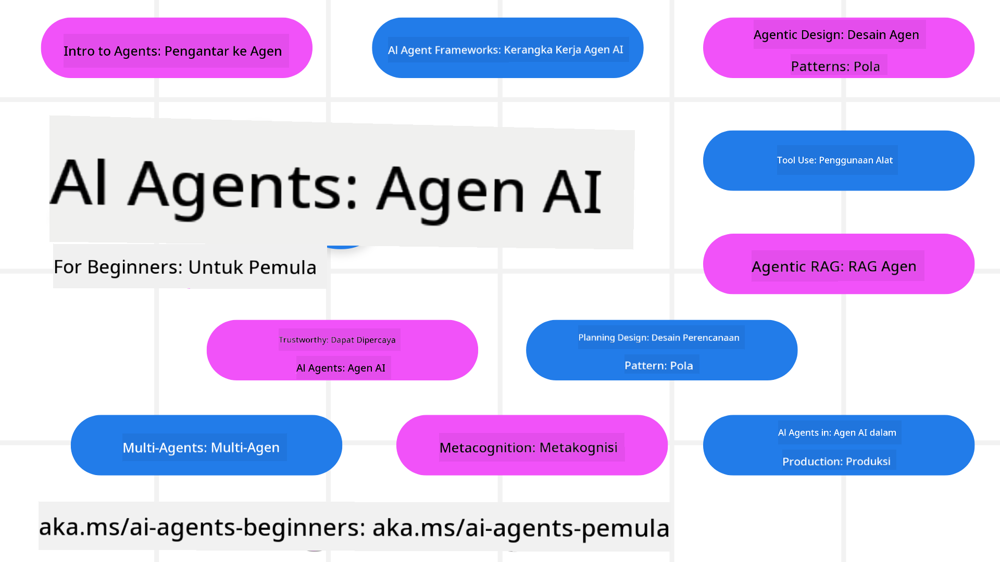

<!--
CO_OP_TRANSLATOR_METADATA:
{
  "original_hash": "6b07046397366e6f6f4524c9ddeba1e1",
  "translation_date": "2025-07-12T14:56:16+00:00",
  "source_file": "README.md",
  "language_code": "id"
}
-->
# AI Agents untuk Pemula - Sebuah Kursus

## 11 Pelajaran yang mengajarkan semua yang perlu Anda ketahui untuk mulai membangun AI Agents

  
  
  
  

### 🌐 Dukungan Multi-Bahasa

#### Didukung melalui GitHub Action (Otomatis & Selalu Terbaru)

[French](../fr/README.md) | [Spanish](../es/README.md) | [German](../de/README.md) | [Russian](../ru/README.md) | [Arabic](../ar/README.md) | [Persian (Farsi)](../fa/README.md) | [Urdu](../ur/README.md) | [Chinese (Simplified)](../zh/README.md) | [Chinese (Traditional, Macau)](../mo/README.md) | [Chinese (Traditional, Hong Kong)](../hk/README.md) | [Chinese (Traditional, Taiwan)](../tw/README.md) | [Japanese](../ja/README.md) | [Korean](../ko/README.md) | [Hindi](../hi/README.md) | [Bengali](../bn/README.md) | [Marathi](../mr/README.md) | [Nepali](../ne/README.md) | [Punjabi (Gurmukhi)](../pa/README.md) | [Portuguese (Portugal)](../pt/README.md) | [Portuguese (Brazil)](../br/README.md) | [Italian](../it/README.md) | [Polish](../pl/README.md) | [Turkish](../tr/README.md) | [Greek](../el/README.md) | [Thai](../th/README.md) | [Swedish](../sv/README.md) | [Danish](../da/README.md) | [Norwegian](../no/README.md) | [Finnish](../fi/README.md) | [Dutch](../nl/README.md) | [Hebrew](../he/README.md) | [Vietnamese](../vi/README.md) | [Indonesian](./README.md) | [Malay](../ms/README.md) | [Tagalog (Filipino)](../tl/README.md) | [Swahili](../sw/README.md) | [Hungarian](../hu/README.md) | [Czech](../cs/README.md) | [Slovak](../sk/README.md) | [Romanian](../ro/README.md) | [Bulgarian](../bg/README.md) | [Serbian (Cyrillic)](../sr/README.md) | [Croatian](../hr/README.md) | [Slovenian](../sl/README.md) | [Ukrainian](../uk/README.md) | [Burmese (Myanmar)](../my/README.md)

**Jika Anda ingin bahasa terjemahan tambahan, daftar bahasa yang didukung tersedia [di sini](https://github.com/Azure/co-op-translator/blob/main/getting_started/supported-languages.md)**

  
  

## 🌱 Memulai

Kursus ini memiliki 11 pelajaran yang membahas dasar-dasar membangun AI Agents. Setiap pelajaran membahas topik tersendiri, jadi mulai dari mana saja yang Anda suka!

Kursus ini juga mendukung multi-bahasa. Lihat [bahasa yang tersedia di sini](../..).

Jika ini adalah pertama kalinya Anda membangun dengan model Generative AI, cek kursus kami [Generative AI For Beginners](https://aka.ms/genai-beginners) yang mencakup 21 pelajaran tentang membangun dengan GenAI.

Jangan lupa untuk [beri bintang (🌟) pada repo ini](https://docs.github.com/en/get-started/exploring-projects-on-github/saving-repositories-with-stars?WT.mc_id=academic-105485-koreyst) dan [fork repo ini](https://github.com/microsoft/ai-agents-for-beginners/fork) untuk menjalankan kodenya.

### Apa yang Anda Butuhkan

Setiap pelajaran dalam kursus ini menyertakan contoh kode, yang dapat ditemukan di folder code_samples. Anda dapat [fork repo ini](https://github.com/microsoft/ai-agents-for-beginners/fork) untuk membuat salinan sendiri.

Contoh kode dalam latihan ini menggunakan Azure AI Foundry dan GitHub Model Catalogs untuk berinteraksi dengan Language Models:

- [Github Models](https://aka.ms/ai-agents-beginners/github-models) - Gratis / Terbatas  
- [Azure AI Foundry](https://aka.ms/ai-agents-beginners/ai-foundry) - Memerlukan Akun Azure

Kursus ini juga menggunakan framework dan layanan AI Agent dari Microsoft berikut:

- [Azure AI Agent Service](https://aka.ms/ai-agents-beginners/ai-agent-service)  
- [Semantic Kernel](https://aka.ms/ai-agents-beginners/semantic-kernel)  
- [AutoGen](https://aka.ms/ai-agents/autogen)

Untuk informasi lebih lanjut tentang menjalankan kode untuk kursus ini, kunjungi [Course Setup](./00-course-setup/README.md).

## 🙏 Ingin membantu?

Apakah Anda punya saran atau menemukan kesalahan ejaan atau kode? [Buat issue](https://github.com/microsoft/ai-agents-for-beginners/issues?WT.mc_id=academic-105485-koreyst) atau [Buat pull request](https://github.com/microsoft/ai-agents-for-beginners/pulls?WT.mc_id=academic-105485-koreyst)

Jika Anda mengalami kesulitan atau punya pertanyaan tentang membangun AI Agents, bergabunglah dengan [Azure AI Foundry Community Discord](https://discord.gg/kzRShWzttr)

Jika Anda memiliki masukan produk atau menemukan kesalahan saat membangun, kunjungi [Azure AI Foundry Developer Forum](https://aka.ms/azureaifoundry/forum)

## 📂 Setiap pelajaran mencakup

- Pelajaran tertulis yang ada di README dan video singkat  
- Contoh kode Python yang mendukung Azure AI Foundry dan Github Models (Gratis)  
- Tautan ke sumber tambahan untuk melanjutkan pembelajaran Anda

## 🗃️ Pelajaran

| **Pelajaran**                             | **Teks & Kode**                                    | **Video**                                                  | **Pembelajaran Tambahan**                                                             |
|------------------------------------------|----------------------------------------------------|------------------------------------------------------------|----------------------------------------------------------------------------------------|
| Intro ke AI Agents dan Kasus Penggunaan Agent | [Link](./01-intro-to-ai-agents/README.md)          | [Video](https://youtu.be/3zgm60bXmQk?si=z8QygFvYQv-9WtO1)  | [Link](https://aka.ms/ai-agents-beginners/collection?WT.mc_id=academic-105485-koreyst) |
| Menjelajahi Framework Agentik AI         | [Link](./02-explore-agentic-frameworks/README.md)  | [Video](https://youtu.be/ODwF-EZo_O8?si=Vawth4hzVaHv-u0H)  | [Link](https://aka.ms/ai-agents-beginners/collection?WT.mc_id=academic-105485-koreyst) |
| Memahami Pola Desain Agentik AI           | [Link](./03-agentic-design-patterns/README.md)     | [Video](https://youtu.be/m9lM8qqoOEA?si=BIzHwzstTPL8o9GF)  | [Link](https://aka.ms/ai-agents-beginners/collection?WT.mc_id=academic-105485-koreyst) |
| Pola Desain Penggunaan Alat               | [Link](./04-tool-use/README.md)                    | [Video](https://youtu.be/vieRiPRx-gI?si=2z6O2Xu2cu_Jz46N)  | [Link](https://aka.ms/ai-agents-beginners/collection?WT.mc_id=academic-105485-koreyst) |
| Agentik RAG                              | [Link](./05-agentic-rag/README.md)                 | [Video](https://youtu.be/WcjAARvdL7I?si=gKPWsQpKiIlDH9A3)  | [Link](https://aka.ms/ai-agents-beginners/collection?WT.mc_id=academic-105485-koreyst) |
| Membangun AI Agents yang Dapat Dipercaya | [Link](./06-building-trustworthy-agents/README.md) | [Video](https://youtu.be/iZKkMEGBCUQ?si=jZjpiMnGFOE9L8OK ) | [Link](https://aka.ms/ai-agents-beginners/collection?WT.mc_id=academic-105485-koreyst) |
| Pola Desain Perencanaan                   | [Link](./07-planning-design/README.md)             | [Video](https://youtu.be/kPfJ2BrBCMY?si=6SC_iv_E5-mzucnC)  | [Link](https://aka.ms/ai-agents-beginners/collection?WT.mc_id=academic-105485-koreyst) |
| Pola Desain Multi-Agent                   | [Link](./08-multi-agent/README.md)                 | [Video](https://youtu.be/V6HpE9hZEx0?si=rMgDhEu7wXo2uo6g)  | [Link](https://aka.ms/ai-agents-beginners/collection?WT.mc_id=academic-105485-koreyst) |
| Pola Desain Metakognisi                   | [Link](./09-metacognition/README.md)               | [Video](https://youtu.be/His9R6gw6Ec?si=8gck6vvdSNCt6OcF)  | [Link](https://aka.ms/ai-agents-beginners/collection?WT.mc_id=academic-105485-koreyst) |
| AI Agents dalam Produksi                   | [Link](./10-ai-agents-production/README.md)        | [Video](https://youtu.be/l4TP6IyJxmQ?si=31dnhexRo6yLRJDl)  | [Link](https://aka.ms/ai-agents-beginners/collection?WT.mc_id=academic-105485-koreyst) |
| AI Agents dengan MCP                      | [Link](./11-mcp/README.md)                         |                                                            | [Link](https://aka.ms/mcp-for-beginners)                                               |

## 🎒 Kursus Lainnya

Tim kami juga membuat kursus lain! Cek:
- [**BARU** Model Context Protocol (MCP) Untuk Pemula](https://github.com/microsoft/mcp-for-beginners?WT.mc_id=academic-105485-koreyst)
- [Generative AI untuk Pemula menggunakan .NET](https://github.com/microsoft/Generative-AI-for-beginners-dotnet?WT.mc_id=academic-105485-koreyst)
- [Generative AI untuk Pemula](https://github.com/microsoft/generative-ai-for-beginners?WT.mc_id=academic-105485-koreyst)
- [ML untuk Pemula](https://aka.ms/ml-beginners?WT.mc_id=academic-105485-koreyst)
- [Data Science untuk Pemula](https://aka.ms/datascience-beginners?WT.mc_id=academic-105485-koreyst)
- [AI untuk Pemula](https://aka.ms/ai-beginners?WT.mc_id=academic-105485-koreyst)
- [Cybersecurity untuk Pemula](https://github.com/microsoft/Security-101??WT.mc_id=academic-96948-sayoung)
- [Web Dev untuk Pemula](https://aka.ms/webdev-beginners?WT.mc_id=academic-105485-koreyst)
- [IoT untuk Pemula](https://aka.ms/iot-beginners?WT.mc_id=academic-105485-koreyst)
- [XR Development untuk Pemula](https://github.com/microsoft/xr-development-for-beginners?WT.mc_id=academic-105485-koreyst)
- [Menguasai GitHub Copilot untuk Pemrograman Berpasangan AI](https://aka.ms/GitHubCopilotAI?WT.mc_id=academic-105485-koreyst)
- [Menguasai GitHub Copilot untuk Pengembang C#/.NET](https://github.com/microsoft/mastering-github-copilot-for-dotnet-csharp-developers?WT.mc_id=academic-105485-koreyst)
- [Pilih Petualangan Copilot Anda Sendiri](https://github.com/microsoft/CopilotAdventures?WT.mc_id=academic-105485-koreyst)

## 🌟 Terima Kasih Komunitas

Terima kasih kepada [Shivam Goyal](https://www.linkedin.com/in/shivam2003/) atas kontribusinya dengan contoh kode penting yang menunjukkan Agentic RAG.

## Kontribusi

Proyek ini menyambut kontribusi dan saran. Sebagian besar kontribusi mengharuskan Anda menyetujui
Contributor License Agreement (CLA) yang menyatakan bahwa Anda memiliki hak, dan memang memberikan,
izin kepada kami untuk menggunakan kontribusi Anda. Untuk detail, kunjungi
<https://cla.opensource.microsoft.com>.

Saat Anda mengirimkan pull request, bot CLA akan secara otomatis menentukan apakah Anda perlu
menyediakan CLA dan menandai PR dengan tepat (misalnya, pemeriksaan status, komentar). Cukup ikuti
instruksi yang diberikan oleh bot. Anda hanya perlu melakukan ini sekali untuk semua repositori yang
menggunakan CLA kami.

Proyek ini telah mengadopsi [Microsoft Open Source Code of Conduct](https://opensource.microsoft.com/codeofconduct/).
Untuk informasi lebih lanjut, lihat [Code of Conduct FAQ](https://opensource.microsoft.com/codeofconduct/faq/) atau
hubungi [opencode@microsoft.com](mailto:opencode@microsoft.com) untuk pertanyaan atau komentar tambahan.

## Merek Dagang

Proyek ini mungkin berisi merek dagang atau logo untuk proyek, produk, atau layanan. Penggunaan resmi merek dagang atau logo Microsoft harus mematuhi dan mengikuti
[Microsoft's Trademark & Brand Guidelines](https://www.microsoft.com/legal/intellectualproperty/trademarks/usage/general).
Penggunaan merek dagang atau logo Microsoft dalam versi modifikasi dari proyek ini tidak boleh menimbulkan kebingungan atau menyiratkan dukungan dari Microsoft.
Setiap penggunaan merek dagang atau logo pihak ketiga tunduk pada kebijakan pihak ketiga tersebut.

**Penafian**:  
Dokumen ini telah diterjemahkan menggunakan layanan terjemahan AI [Co-op Translator](https://github.com/Azure/co-op-translator). Meskipun kami berupaya untuk akurasi, harap diperhatikan bahwa terjemahan otomatis mungkin mengandung kesalahan atau ketidakakuratan. Dokumen asli dalam bahasa aslinya harus dianggap sebagai sumber yang sahih. Untuk informasi penting, disarankan menggunakan terjemahan profesional oleh manusia. Kami tidak bertanggung jawab atas kesalahpahaman atau penafsiran yang keliru yang timbul dari penggunaan terjemahan ini.