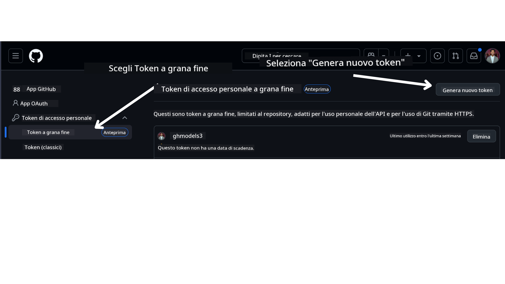

<!--
CO_OP_TRANSLATOR_METADATA:
{
  "original_hash": "76945069b52a49cd0432ae3e0b0ba22e",
  "translation_date": "2025-07-12T07:49:05+00:00",
  "source_file": "00-course-setup/README.md",
  "language_code": "it"
}
-->
Dovresti ora avere la tua versione forkata di questo corso al seguente link:


## Esecuzione del Codice

Questo corso offre una serie di Jupyter Notebooks che puoi eseguire per acquisire esperienza pratica nella creazione di AI Agents.

I campioni di codice utilizzano:

**Richiede Account GitHub - Gratuito**:

1) Semantic Kernel Agent Framework + GitHub Models Marketplace. Etichettato come (semantic-kernel.ipynb)  
2) AutoGen Framework + GitHub Models Marketplace. Etichettato come (autogen.ipynb)

**Richiede Sottoscrizione Azure**:  
3) Azure AI Foundry + Azure AI Agent Service. Etichettato come (azureaiagent.ipynb)

Ti incoraggiamo a provare tutti e tre i tipi di esempi per vedere quale funziona meglio per te.

Qualunque opzione tu scelga, determinerà quali passaggi di configurazione dovrai seguire di seguito:

## Requisiti

- Python 3.12+  
  - **NOTE**: Se non hai Python 3.12 installato, assicurati di installarlo. Poi crea il tuo ambiente virtuale usando python3.12 per garantire che vengano installate le versioni corrette dai pacchetti nel file requirements.txt.  
- Un Account GitHub - Per accedere al GitHub Models Marketplace  
- Sottoscrizione Azure - Per accedere ad Azure AI Foundry  
- Account Azure AI Foundry - Per accedere al servizio Azure AI Agent

Abbiamo incluso un file `requirements.txt` nella radice di questo repository che contiene tutti i pacchetti Python necessari per eseguire i campioni di codice.

Puoi installarli eseguendo il seguente comando nel terminale, nella cartella principale del repository:

```bash
pip install -r requirements.txt
```  
Consigliamo di creare un ambiente virtuale Python per evitare conflitti e problemi.

## Configurazione di VSCode  
Assicurati di utilizzare la versione corretta di Python in VSCode.


## Configurazione per i Campioni che Usano GitHub Models

### Passo 1: Recupera il tuo GitHub Personal Access Token (PAT)

Attualmente, questo corso utilizza il GitHub Models Marketplace per offrire accesso gratuito a Large Language Models (LLM) che saranno usati per creare AI Agents.

Per accedere a questo servizio, dovrai creare un GitHub Personal Access Token.

Questo può essere fatto andando nel tuo

nel tuo Account GitHub.

Seleziona l’opzione `Fine-grained tokens` sul lato sinistro dello schermo.

Poi seleziona `Generate new token`.



Ti verrà chiesto di inserire un nome per il token, selezionare la data di scadenza (Consigliato: 30 giorni) e selezionare gli ambiti per il token (Public Repositories).

È inoltre necessario modificare le autorizzazioni di questo token: Permissions -> Models -> Consente l’accesso ai GitHub Models

Copia il nuovo token che hai appena creato. Ora lo aggiungerai al file `.env` incluso in questo corso.

### Passo 2: Crea il tuo file `.env`

Per creare il file `.env` esegui il seguente comando nel terminale.

```bash
cp .env.example .env
```

Questo copierà il file di esempio e creerà un file `.env` nella tua directory, dove potrai inserire i valori per le variabili d’ambiente.

Con il token copiato, apri il file `.env` nel tuo editor di testo preferito e incolla il token nel campo `GITHUB_TOKEN`.

Ora dovresti essere in grado di eseguire i campioni di codice di questo corso.

## Configurazione per i Campioni che Usano Azure AI Foundry e Azure AI Agent Service

### Passo 1: Recupera l’Endpoint del tuo Progetto Azure

Segui i passaggi per creare un hub e un progetto in Azure AI Foundry qui: [Hub resources overview](https://learn.microsoft.com/en-us/azure/ai-foundry/concepts/ai-resources)

Una volta creato il progetto, dovrai recuperare la stringa di connessione per il progetto.

Questo può essere fatto andando alla pagina **Overview** del tuo progetto nel portale Azure AI Foundry.


### Passo 2: Crea il tuo file `.env`

Per creare il file `.env` esegui il seguente comando nel terminale.

```bash
cp .env.example .env
```

Questo copierà il file di esempio e creerà un file `.env` nella tua directory, dove potrai inserire i valori per le variabili d’ambiente.

Con la stringa di connessione copiata, apri il file `.env` nel tuo editor di testo preferito e incolla il valore nel campo `PROJECT_ENDPOINT`.

### Passo 3: Accedi ad Azure

Come buona pratica di sicurezza, useremo [l’autenticazione senza chiave](https://learn.microsoft.com/azure/developer/ai/keyless-connections?tabs=csharp%2Cazure-cli?WT.mc_id=academic-105485-koreyst) per autenticarsi ad Azure OpenAI con Microsoft Entra ID. Prima di poterlo fare, dovrai installare l’**Azure CLI** seguendo le [istruzioni di installazione](https://learn.microsoft.com/cli/azure/install-azure-cli?WT.mc_id=academic-105485-koreyst) per il tuo sistema operativo.

Successivamente, apri un terminale ed esegui `az login --use-device-code` per accedere al tuo account Azure.

Una volta effettuato l’accesso, seleziona la tua sottoscrizione nel terminale.

## Variabili d’Ambiente Aggiuntive - Azure Search e Azure OpenAI

Per la Lezione Agentic RAG - Lezione 5 - ci sono esempi che utilizzano Azure Search e Azure OpenAI.

Se vuoi eseguire questi esempi, dovrai aggiungere le seguenti variabili d’ambiente al tuo file `.env`:

### Pagina Overview (Progetto)

- `AZURE_SUBSCRIPTION_ID` - Controlla i **Dettagli del progetto** nella pagina **Overview** del tuo progetto.

- `AZURE_AI_PROJECT_NAME` - Guarda in alto nella pagina **Overview** del progetto.

- `AZURE_OPENAI_SERVICE` - Lo trovi nella scheda **Included capabilities** per **Azure OpenAI Service** nella pagina **Overview**.

### Management Center

- `AZURE_OPENAI_RESOURCE_GROUP` - Vai a **Proprietà del progetto** nella pagina **Overview** del **Management Center**.

- `GLOBAL_LLM_SERVICE` - Sotto **Connected resources**, trova il nome della connessione **Azure AI Services**. Se non è elencato, controlla nel **portale Azure** sotto il tuo gruppo di risorse per il nome della risorsa AI Services.

### Pagina Models + Endpoints

- `AZURE_OPENAI_EMBEDDING_DEPLOYMENT_NAME` - Seleziona il modello di embedding (es. `text-embedding-ada-002`) e annota il **Deployment name** dai dettagli del modello.

- `AZURE_OPENAI_CHAT_DEPLOYMENT_NAME` - Seleziona il modello chat (es. `gpt-4o-mini`) e annota il **Deployment name** dai dettagli del modello.

### Portale Azure

- `AZURE_OPENAI_ENDPOINT` - Cerca **Azure AI services**, cliccaci sopra, poi vai a **Resource Management**, **Keys and Endpoint**, scorri fino agli "Azure OpenAI endpoints" e copia quello che dice "Language APIs".

- `AZURE_OPENAI_API_KEY` - Dalla stessa schermata, copia KEY 1 o KEY 2.

- `AZURE_SEARCH_SERVICE_ENDPOINT` - Trova la tua risorsa **Azure AI Search**, cliccaci sopra e guarda la **Overview**.

- `AZURE_SEARCH_API_KEY` - Poi vai su **Settings** e poi su **Keys** per copiare la chiave amministratore primaria o secondaria.

### Pagina Web Esterna

- `AZURE_OPENAI_API_VERSION` - Visita la pagina [API version lifecycle](https://learn.microsoft.com/en-us/azure/ai-services/openai/api-version-deprecation#latest-ga-api-release) sotto **Latest GA API release**.

### Configura l’autenticazione senza chiave

Invece di inserire le credenziali direttamente nel codice, useremo una connessione senza chiave con Azure OpenAI. Per farlo, importeremo `DefaultAzureCredential` e successivamente chiameremo la funzione `DefaultAzureCredential` per ottenere la credenziale.

```python
from azure.identity import DefaultAzureCredential, InteractiveBrowserCredential
```

## Bloccato da qualche parte?

Se hai problemi con questa configurazione, entra nel nostro

o

.

## Lezione Successiva

Ora sei pronto per eseguire il codice di questo corso. Buono studio e buon approfondimento nel mondo degli AI Agents!

[Introduzione agli AI Agents e casi d’uso degli Agent](../01-intro-to-ai-agents/README.md)

**Disclaimer**:  
Questo documento è stato tradotto utilizzando il servizio di traduzione automatica [Co-op Translator](https://github.com/Azure/co-op-translator). Pur impegnandoci per garantire accuratezza, si prega di notare che le traduzioni automatiche possono contenere errori o imprecisioni. Il documento originale nella sua lingua nativa deve essere considerato la fonte autorevole. Per informazioni critiche, si raccomanda una traduzione professionale effettuata da un umano. Non ci assumiamo alcuna responsabilità per eventuali malintesi o interpretazioni errate derivanti dall’uso di questa traduzione.