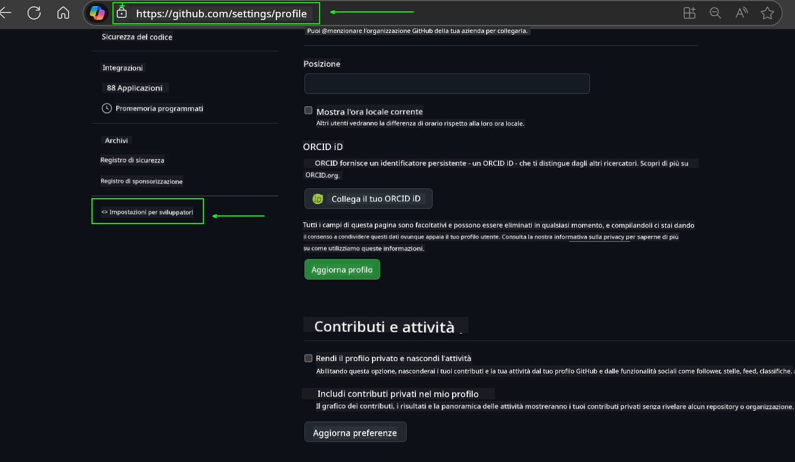
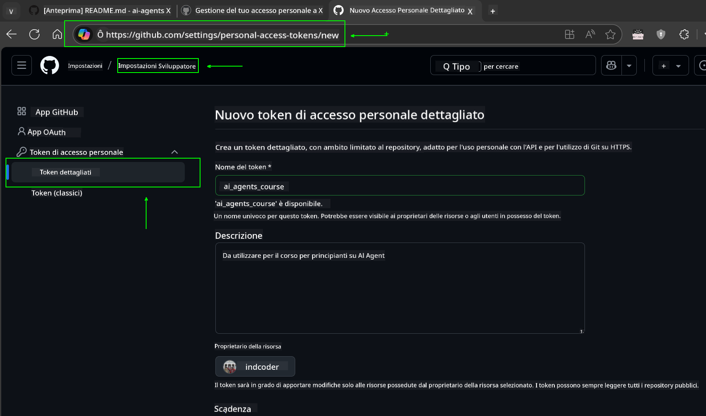
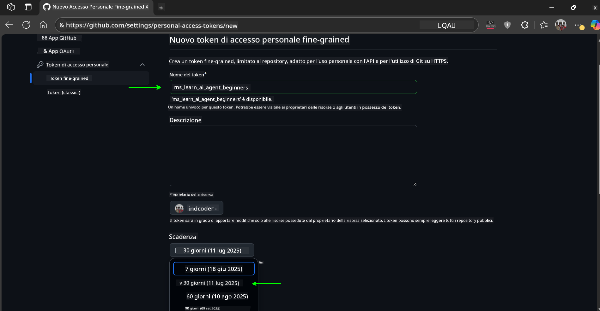
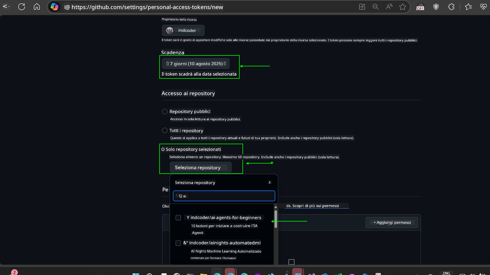
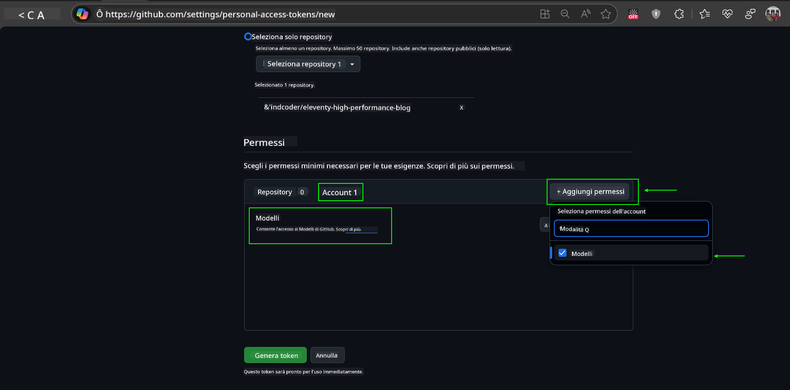
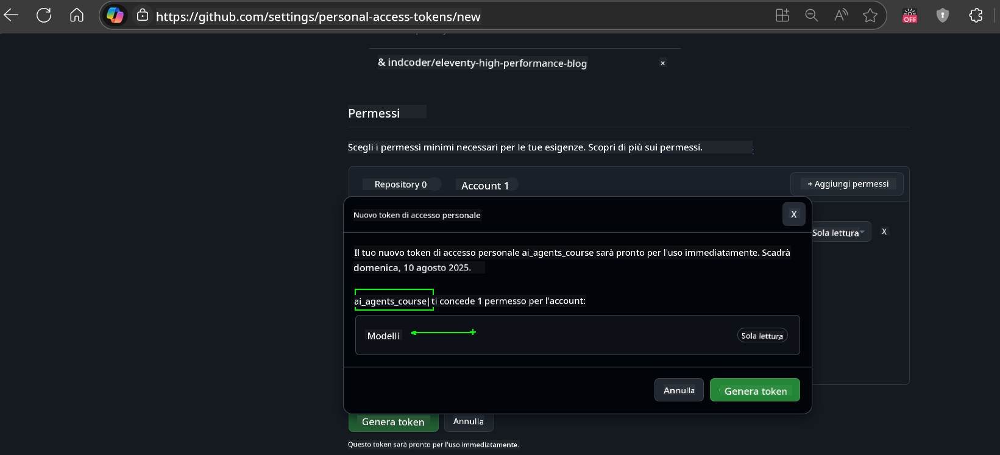
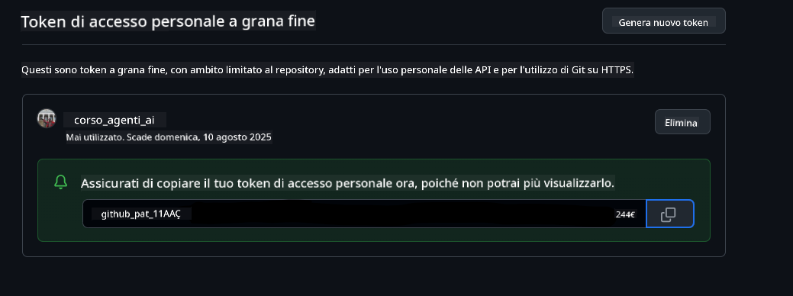
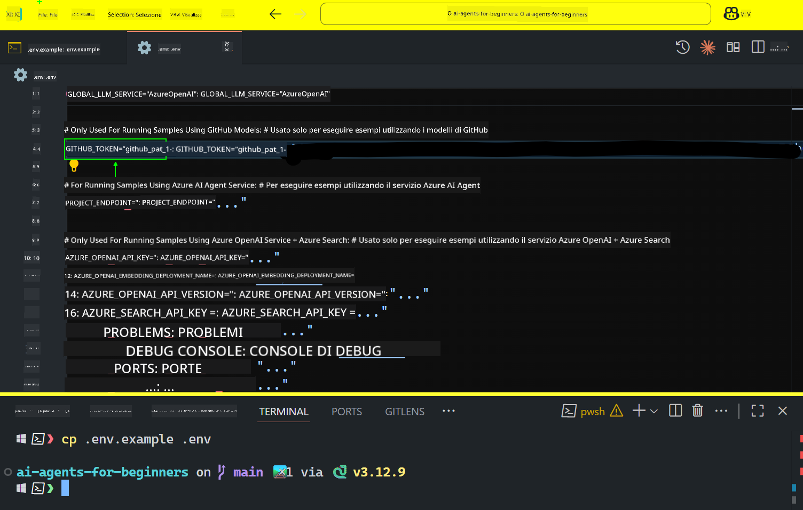
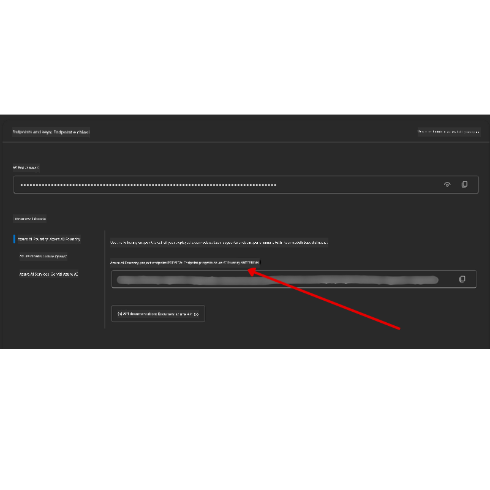

<!--
CO_OP_TRANSLATOR_METADATA:
{
  "original_hash": "c55b973b1562abf5aadf6a4028265ac5",
  "translation_date": "2025-08-29T12:59:50+00:00",
  "source_file": "00-course-setup/README.md",
  "language_code": "it"
}
-->
# Configurazione del Corso

## Introduzione

Questa lezione coprirà come eseguire gli esempi di codice di questo corso.

## Unisciti ad Altri Studenti e Ottieni Aiuto

Prima di iniziare a clonare il tuo repository, unisciti al [canale Discord AI Agents For Beginners](https://aka.ms/ai-agents/discord) per ricevere aiuto con la configurazione, per qualsiasi domanda sul corso o per connetterti con altri studenti.

## Clona o Fai il Fork di Questo Repository

Per iniziare, clona o fai il fork del repository GitHub. Questo ti permetterà di avere una tua versione del materiale del corso per eseguire, testare e modificare il codice!

Puoi farlo cliccando sul link per

Dovresti ora avere la tua versione forkata di questo corso al seguente link:


## Esecuzione del Codice

Questo corso offre una serie di Jupyter Notebook che puoi eseguire per ottenere esperienza pratica nella creazione di AI Agents.

Gli esempi di codice utilizzano:

**Richiede un Account GitHub - Gratuito**:

1) Semantic Kernel Agent Framework + GitHub Models Marketplace. Etichettato come (semantic-kernel.ipynb)
2) AutoGen Framework + GitHub Models Marketplace. Etichettato come (autogen.ipynb)

**Richiede un Abbonamento Azure**:
3) Azure AI Foundry + Azure AI Agent Service. Etichettato come (azureaiagent.ipynb)

Ti incoraggiamo a provare tutti e tre i tipi di esempi per vedere quale funziona meglio per te.

Qualunque opzione tu scelga, determinerà quali passaggi di configurazione dovrai seguire di seguito:

## Requisiti

- Python 3.12+
  - **NOTA**: Se non hai Python 3.12 installato, assicurati di installarlo. Poi crea il tuo ambiente virtuale usando python3.12 per garantire che le versioni corrette siano installate dal file requirements.txt.
- Un Account GitHub - Per accedere al GitHub Models Marketplace
- Abbonamento Azure - Per accedere ad Azure AI Foundry
- Account Azure AI Foundry - Per accedere al servizio Azure AI Agent

Abbiamo incluso un file `requirements.txt` nella radice di questo repository che contiene tutti i pacchetti Python richiesti per eseguire gli esempi di codice.

Puoi installarli eseguendo il seguente comando nel terminale alla radice del repository:

```bash
pip install -r requirements.txt
```
Consigliamo di creare un ambiente virtuale Python per evitare conflitti e problemi.

## Configurazione di VSCode
Assicurati di utilizzare la versione corretta di Python in VSCode.


## Configurazione per Esempi con Modelli GitHub 

### Passaggio 1: Recupera il tuo GitHub Personal Access Token (PAT)

Questo corso utilizza il GitHub Models Marketplace, che offre accesso gratuito a Large Language Models (LLMs) che utilizzerai per creare AI Agents.

Per utilizzare i modelli GitHub, dovrai creare un [GitHub Personal Access Token](https://docs.github.com/en/authentication/keeping-your-account-and-data-secure/managing-your-personal-access-tokens).

Puoi farlo accedendo al tuo account GitHub.

Segui il [Principio del Minimo Privilegio](https://docs.github.com/en/get-started/learning-to-code/storing-your-secrets-safely) quando crei il tuo token. Questo significa che dovresti assegnare al token solo le autorizzazioni necessarie per eseguire gli esempi di codice di questo corso.

1. Seleziona l'opzione `Fine-grained tokens` sul lato sinistro dello schermo accedendo a **Developer settings**
   

    Poi seleziona `Generate new token`.

    

2. Inserisci un nome descrittivo per il tuo token che rifletta il suo scopo, rendendolo facile da identificare in seguito.

    🔐 Raccomandazione sulla Durata del Token

    Durata raccomandata: 30 giorni  
    Per una maggiore sicurezza, puoi optare per un periodo più breve, come 7 giorni 🛡️  
    È un ottimo modo per fissare un obiettivo personale e completare il corso mentre il tuo slancio di apprendimento è alto 🚀.

    

3. Limita l'ambito del token al tuo fork di questo repository.

    

4. Restringi le autorizzazioni del token: Sotto **Permissions**, clicca sulla scheda **Account** e premi il pulsante "+ Add permissions". Apparirà un menu a tendina. Cerca **Models** e seleziona la casella corrispondente.
    

5. Verifica le autorizzazioni richieste prima di generare il token. 

6. Prima di generare il token, assicurati di essere pronto a conservarlo in un luogo sicuro come un gestore di password, poiché non sarà mostrato di nuovo dopo la sua creazione. 

Copia il nuovo token che hai appena creato. Ora lo aggiungerai al file `.env` incluso in questo corso.

### Passaggio 2: Crea il tuo File `.env`

Per creare il file `.env`, esegui il seguente comando nel terminale.

```bash
cp .env.example .env
```

Questo copierà il file di esempio e creerà un `.env` nella tua directory, dove potrai inserire i valori per le variabili di ambiente.

Con il tuo token copiato, apri il file `.env` nel tuo editor di testo preferito e incolla il token nel campo `GITHUB_TOKEN`.  


Ora dovresti essere in grado di eseguire gli esempi di codice di questo corso.

## Configurazione per Esempi con Azure AI Foundry e Azure AI Agent Service

### Passaggio 1: Recupera il tuo Endpoint del Progetto Azure

Segui i passaggi per creare un hub e un progetto in Azure AI Foundry qui: [Panoramica delle risorse Hub](https://learn.microsoft.com/en-us/azure/ai-foundry/concepts/ai-resources)

Una volta creato il tuo progetto, dovrai recuperare la stringa di connessione per il tuo progetto.

Puoi farlo accedendo alla pagina **Overview** del tuo progetto nel portale Azure AI Foundry.



### Passaggio 2: Crea il tuo File `.env`

Per creare il file `.env`, esegui il seguente comando nel terminale.

```bash
cp .env.example .env
```

Questo copierà il file di esempio e creerà un `.env` nella tua directory, dove potrai inserire i valori per le variabili di ambiente.

Con il tuo token copiato, apri il file `.env` nel tuo editor di testo preferito e incolla il token nel campo `PROJECT_ENDPOINT`.

### Passaggio 3: Accedi ad Azure

Come buona pratica di sicurezza, utilizzeremo [l'autenticazione senza chiavi](https://learn.microsoft.com/azure/developer/ai/keyless-connections?tabs=csharp%2Cazure-cli?WT.mc_id=academic-105485-koreyst) per autenticarti ad Azure OpenAI con Microsoft Entra ID.

Successivamente, apri un terminale ed esegui `az login --use-device-code` per accedere al tuo account Azure.

Una volta effettuato l'accesso, seleziona il tuo abbonamento nel terminale.

## Variabili di Ambiente Aggiuntive - Azure Search e Azure OpenAI 

Per la lezione Agentic RAG - Lezione 5 - ci sono esempi che utilizzano Azure Search e Azure OpenAI.

Se desideri eseguire questi esempi, dovrai aggiungere le seguenti variabili di ambiente al tuo file `.env`:

### Pagina Overview (Progetto)

- `AZURE_SUBSCRIPTION_ID` - Controlla **Project details** nella pagina **Overview** del tuo progetto.

- `AZURE_AI_PROJECT_NAME` - Guarda in alto nella pagina **Overview** del tuo progetto.

- `AZURE_OPENAI_SERVICE` - Trova questo nella scheda **Included capabilities** per **Azure OpenAI Service** nella pagina **Overview**.

### Centro di Gestione

- `AZURE_OPENAI_RESOURCE_GROUP` - Vai a **Project properties** nella pagina **Overview** del **Management Center**.

- `GLOBAL_LLM_SERVICE` - Sotto **Connected resources**, trova il nome della connessione **Azure AI Services**. Se non elencato, controlla il **portale Azure** sotto il tuo gruppo di risorse per il nome della risorsa AI Services.

### Pagina Modelli + Endpoint

- `AZURE_OPENAI_EMBEDDING_DEPLOYMENT_NAME` - Seleziona il tuo modello di embedding (es. `text-embedding-ada-002`) e annota il **Deployment name** dai dettagli del modello.

- `AZURE_OPENAI_CHAT_DEPLOYMENT_NAME` - Seleziona il tuo modello di chat (es. `gpt-4o-mini`) e annota il **Deployment name** dai dettagli del modello.

### Portale Azure

- `AZURE_OPENAI_ENDPOINT` - Cerca **Azure AI services**, clicca su di esso, poi vai a **Resource Management**, **Keys and Endpoint**, scorri verso il basso fino agli "Azure OpenAI endpoints" e copia quello che dice "Language APIs".

- `AZURE_OPENAI_API_KEY` - Dalla stessa schermata, copia KEY 1 o KEY 2.

- `AZURE_SEARCH_SERVICE_ENDPOINT` - Trova la tua risorsa **Azure AI Search**, cliccaci sopra e vedi **Overview**.

- `AZURE_SEARCH_API_KEY` - Poi vai su **Settings** e poi **Keys** per copiare la chiave primaria o secondaria dell'amministratore.

### Pagina Esterna

- `AZURE_OPENAI_API_VERSION` - Visita la pagina [API version lifecycle](https://learn.microsoft.com/en-us/azure/ai-services/openai/api-version-deprecation#latest-ga-api-release) sotto **Latest GA API release**.

### Configurazione dell'autenticazione senza chiavi

Piuttosto che codificare le tue credenziali, utilizzeremo una connessione senza chiavi con Azure OpenAI. Per farlo, importeremo `DefaultAzureCredential` e successivamente chiameremo la funzione `DefaultAzureCredential` per ottenere le credenziali.

```python
from azure.identity import DefaultAzureCredential, InteractiveBrowserCredential
```

## Bloccato da Qualche Parte?

Se hai problemi con questa configurazione, entra nel nostro

## Prossima Lezione

Ora sei pronto per eseguire il codice di questo corso. Buon apprendimento sul mondo degli AI Agents!  

[Introduzione agli AI Agents e ai Casi d'Uso degli Agent](../01-intro-to-ai-agents/README.md)

---

**Disclaimer**:  
Questo documento è stato tradotto utilizzando il servizio di traduzione automatica [Co-op Translator](https://github.com/Azure/co-op-translator). Sebbene ci impegniamo per garantire l'accuratezza, si prega di notare che le traduzioni automatiche potrebbero contenere errori o imprecisioni. Il documento originale nella sua lingua nativa dovrebbe essere considerato la fonte autorevole. Per informazioni critiche, si consiglia una traduzione professionale eseguita da un traduttore umano. Non siamo responsabili per eventuali fraintendimenti o interpretazioni errate derivanti dall'uso di questa traduzione.