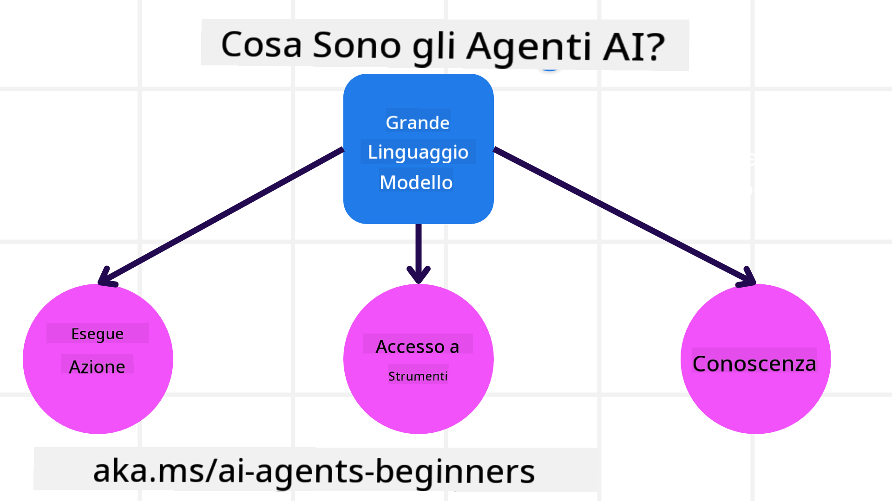
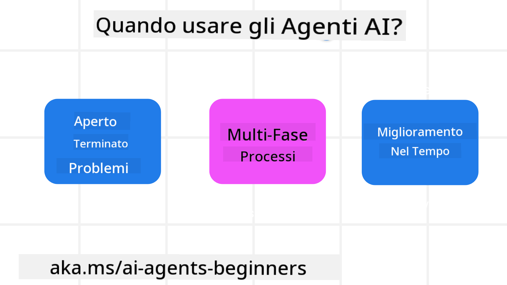

<!--
CO_OP_TRANSLATOR_METADATA:
{
  "original_hash": "d84943abc8f001ad4670418d32c2d899",
  "translation_date": "2025-07-12T08:06:07+00:00",
  "source_file": "01-intro-to-ai-agents/README.md",
  "language_code": "it"
}
-->
per incontrare altri studenti e costruttori di AI Agent e porre qualsiasi domanda riguardo a questo corso.

Per iniziare questo corso, cominciamo con una migliore comprensione di cosa sono gli AI Agent e come possiamo usarli nelle applicazioni e nei flussi di lavoro che sviluppiamo.

## Introduzione

Questa lezione copre:

- Cosa sono gli AI Agent e quali sono i diversi tipi di agenti?
- Quali casi d'uso sono più adatti agli AI Agent e come possono aiutarci?
- Quali sono alcuni dei blocchi fondamentali nella progettazione di soluzioni agentiche?

## Obiettivi di Apprendimento
Dopo aver completato questa lezione, dovresti essere in grado di:

- Comprendere i concetti di AI Agent e come si differenziano da altre soluzioni AI.
- Applicare gli AI Agent nel modo più efficiente.
- Progettare soluzioni agentiche in modo produttivo sia per utenti che per clienti.

## Definizione di AI Agent e Tipi di AI Agent

### Cosa sono gli AI Agent?

Gli AI Agent sono **sistemi** che permettono ai **Large Language Models (LLM)** di **eseguire azioni** estendendo le loro capacità, dando agli LLM **accesso a strumenti** e **conoscenze**.

Scomponiamo questa definizione in parti più piccole:

- **Sistema** - È importante pensare agli agenti non come a un singolo componente, ma come a un sistema composto da molti componenti. A livello base, i componenti di un AI Agent sono:
  - **Ambiente** - Lo spazio definito in cui l'AI Agent opera. Per esempio, se avessimo un AI Agent per prenotazioni di viaggi, l'ambiente potrebbe essere il sistema di prenotazione viaggi che l'AI Agent usa per completare i compiti.
  - **Sensori** - Gli ambienti contengono informazioni e forniscono feedback. Gli AI Agent usano i sensori per raccogliere e interpretare queste informazioni sullo stato attuale dell'ambiente. Nell'esempio dell'agente di prenotazione viaggi, il sistema di prenotazione può fornire informazioni come la disponibilità degli hotel o i prezzi dei voli.
  - **Attuatori** - Una volta che l'AI Agent riceve lo stato attuale dell'ambiente, per il compito corrente l'agente determina quale azione eseguire per modificare l'ambiente. Per l'agente di prenotazione viaggi, potrebbe essere prenotare una stanza disponibile per l'utente.

**Large Language Models** - Il concetto di agenti esisteva prima della creazione degli LLM. Il vantaggio di costruire AI Agent con LLM è la loro capacità di interpretare il linguaggio umano e i dati. Questa capacità permette agli LLM di interpretare le informazioni ambientali e definire un piano per modificare l'ambiente.

**Eseguire Azioni** - Al di fuori dei sistemi AI Agent, gli LLM sono limitati a situazioni in cui l'azione è generare contenuti o informazioni basate sul prompt dell'utente. All'interno dei sistemi AI Agent, gli LLM possono portare a termine compiti interpretando la richiesta dell'utente e usando gli strumenti disponibili nel loro ambiente.

**Accesso agli Strumenti** - Gli strumenti a cui l'LLM ha accesso sono definiti da 1) l'ambiente in cui opera e 2) dallo sviluppatore dell'AI Agent. Nel nostro esempio dell'agente di viaggio, gli strumenti dell'agente sono limitati dalle operazioni disponibili nel sistema di prenotazione, e/o lo sviluppatore può limitare l'accesso dell'agente agli strumenti relativi ai voli.

**Memoria+Conoscenza** - La memoria può essere a breve termine nel contesto della conversazione tra utente e agente. A lungo termine, al di fuori delle informazioni fornite dall'ambiente, gli AI Agent possono anche recuperare conoscenze da altri sistemi, servizi, strumenti e persino altri agenti. Nell'esempio dell'agente di viaggio, questa conoscenza potrebbe essere l'informazione sulle preferenze di viaggio dell'utente memorizzata in un database clienti.

### I diversi tipi di agenti

Ora che abbiamo una definizione generale di AI Agent, vediamo alcuni tipi specifici di agenti e come si applicherebbero a un AI Agent per prenotazioni di viaggio.

| **Tipo di Agente**            | **Descrizione**                                                                                                                      | **Esempio**                                                                                                                                                                                                                   |
| ----------------------------- | ----------------------------------------------------------------------------------------------------------------------------------- | ----------------------------------------------------------------------------------------------------------------------------------------------------------------------------------------------------------------------------- |
| **Simple Reflex Agents**       | Eseguono azioni immediate basate su regole predefinite.                                                                             | L'agente di viaggio interpreta il contesto di un'email e inoltra i reclami di viaggio al servizio clienti.                                                                                                                    |
| **Model-Based Reflex Agents**  | Eseguono azioni basate su un modello del mondo e sulle modifiche a quel modello.                                                    | L'agente di viaggio dà priorità a rotte con variazioni di prezzo significative basandosi su dati storici di prezzo.                                                                                                           |
| **Goal-Based Agents**          | Creano piani per raggiungere obiettivi specifici interpretando l'obiettivo e determinando le azioni per raggiungerlo.              | L'agente di viaggio prenota un viaggio determinando le necessarie disposizioni di viaggio (auto, trasporto pubblico, voli) dalla posizione attuale alla destinazione.                                                          |
| **Utility-Based Agents**       | Considerano preferenze e valutano compromessi numericamente per determinare come raggiungere gli obiettivi.                         | L'agente di viaggio massimizza l'utilità valutando comodità vs. costo nella prenotazione del viaggio.                                                                                                                        |
| **Learning Agents**            | Migliorano nel tempo rispondendo al feedback e adattando di conseguenza le azioni.                                                  | L'agente di viaggio migliora utilizzando il feedback dei clienti da sondaggi post-viaggio per apportare modifiche alle prenotazioni future.                                                                                   |
| **Hierarchical Agents**        | Presentano più agenti in un sistema a livelli, con agenti di livello superiore che suddividono i compiti in sotto-compiti per agenti di livello inferiore. | L'agente di viaggio annulla un viaggio suddividendo il compito in sotto-compiti (ad esempio, annullare prenotazioni specifiche) e facendo completare questi compiti agli agenti di livello inferiore, che riportano all'agente superiore. |
| **Multi-Agent Systems (MAS)**  | Gli agenti completano i compiti in modo indipendente, cooperando o competendo.                                                      | Cooperativo: più agenti prenotano servizi di viaggio specifici come hotel, voli e intrattenimento. Competitivo: più agenti gestiscono e competono su un calendario condiviso di prenotazioni hotel per assegnare clienti.         |

## Quando usare gli AI Agent

Nella sezione precedente, abbiamo usato il caso d'uso dell'agente di viaggio per spiegare come i diversi tipi di agenti possono essere usati in vari scenari di prenotazione viaggi. Continueremo a usare questa applicazione durante tutto il corso.

Vediamo i tipi di casi d'uso per cui gli AI Agent sono più indicati:

- **Problemi a risposta aperta** - permettere all'LLM di determinare i passaggi necessari per completare un compito perché non sempre possono essere codificati rigidamente in un flusso di lavoro.
- **Processi a più fasi** - compiti che richiedono un livello di complessità in cui l'AI Agent deve usare strumenti o informazioni su più passaggi invece di un singolo recupero.
- **Miglioramento nel tempo** - compiti in cui l'agente può migliorare nel tempo ricevendo feedback dall'ambiente o dagli utenti per fornire un'utilità migliore.

Affronteremo ulteriori considerazioni sull'uso degli AI Agent nella lezione "Building Trustworthy AI Agents".

## Nozioni di base sulle soluzioni agentiche

### Sviluppo degli agenti

Il primo passo nella progettazione di un sistema AI Agent è definire strumenti, azioni e comportamenti. In questo corso, ci concentriamo sull'uso del **Azure AI Agent Service** per definire i nostri agenti. Offre funzionalità come:

- Selezione di modelli aperti come OpenAI, Mistral e Llama
- Uso di dati con licenza tramite fornitori come Tripadvisor
- Uso di strumenti standardizzati OpenAPI 3.0

### Pattern agentici

La comunicazione con gli LLM avviene tramite prompt. Data la natura semi-autonoma degli AI Agent, non è sempre possibile o necessario ripromptare manualmente l'LLM dopo un cambiamento nell'ambiente. Usiamo **pattern agentici** che ci permettono di promptare l'LLM su più passaggi in modo più scalabile.

Questo corso è suddiviso in alcuni dei pattern agentici attualmente più popolari.

### Framework agentici

I framework agentici permettono agli sviluppatori di implementare pattern agentici tramite codice. Questi framework offrono template, plugin e strumenti per una migliore collaborazione tra AI Agent. Questi vantaggi forniscono capacità di migliore osservabilità e risoluzione dei problemi nei sistemi AI Agent.

In questo corso esploreremo il framework AutoGen, basato sulla ricerca, e il framework Agent, pronto per la produzione, di Semantic Kernel.

## Lezione precedente

[Course Setup](../00-course-setup/README.md)

## Lezione successiva

[Exploring Agentic Frameworks](../02-explore-agentic-frameworks/README.md)

**Disclaimer**:  
Questo documento è stato tradotto utilizzando il servizio di traduzione automatica [Co-op Translator](https://github.com/Azure/co-op-translator). Pur impegnandoci per garantire accuratezza, si prega di notare che le traduzioni automatiche possono contenere errori o imprecisioni. Il documento originale nella sua lingua nativa deve essere considerato la fonte autorevole. Per informazioni critiche, si raccomanda una traduzione professionale effettuata da un umano. Non ci assumiamo alcuna responsabilità per eventuali malintesi o interpretazioni errate derivanti dall’uso di questa traduzione.