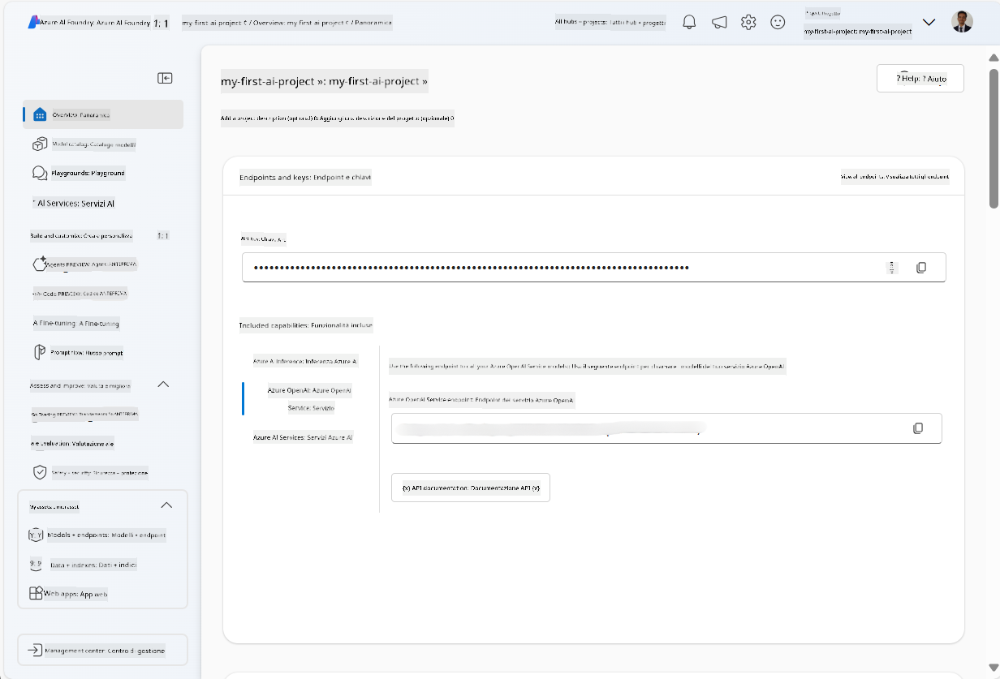
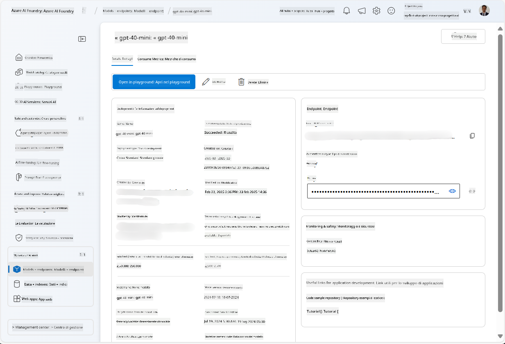
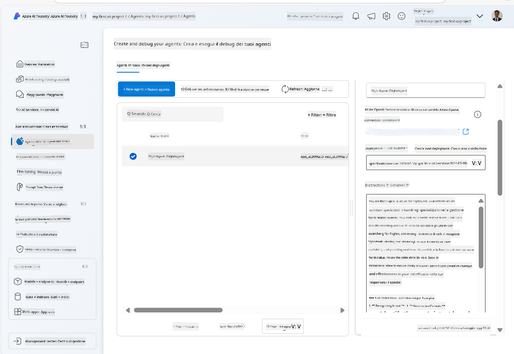
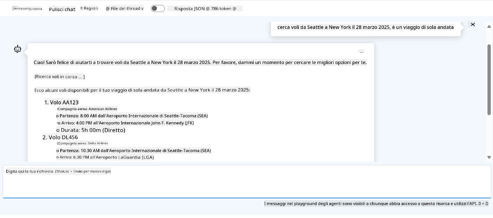

<!--
CO_OP_TRANSLATOR_METADATA:
{
  "original_hash": "7e92870dc0843e13d4dabc620c09d2d9",
  "translation_date": "2025-07-12T08:18:36+00:00",
  "source_file": "02-explore-agentic-frameworks/azure-ai-foundry-agent-creation.md",
  "language_code": "it"
}
-->
# Sviluppo del servizio Azure AI Agent

In questo esercizio, utilizzerai gli strumenti del servizio Azure AI Agent nel [portale Azure AI Foundry](https://ai.azure.com/?WT.mc_id=academic-105485-koreyst) per creare un agente per la prenotazione voli. L'agente sarà in grado di interagire con gli utenti e fornire informazioni sui voli.

## Prerequisiti

Per completare questo esercizio, ti servono i seguenti elementi:
1. Un account Azure con una sottoscrizione attiva. [Crea un account gratuitamente](https://azure.microsoft.com/free/?WT.mc_id=academic-105485-koreyst).
2. Devi avere i permessi per creare un hub Azure AI Foundry o averne uno già creato per te.
    - Se il tuo ruolo è Contributor o Owner, puoi seguire i passaggi di questo tutorial.

## Crea un hub Azure AI Foundry

> **Note:** Azure AI Foundry era precedentemente noto come Azure AI Studio.

1. Segui queste linee guida dal post del blog di [Azure AI Foundry](https://learn.microsoft.com/en-us/azure/ai-studio/?WT.mc_id=academic-105485-koreyst) per creare un hub Azure AI Foundry.
2. Quando il progetto è creato, chiudi eventuali suggerimenti visualizzati e dai un’occhiata alla pagina del progetto nel portale Azure AI Foundry, che dovrebbe apparire simile all’immagine seguente:

    

## Distribuisci un modello

1. Nel pannello a sinistra del tuo progetto, nella sezione **My assets**, seleziona la pagina **Models + endpoints**.
2. Nella pagina **Models + endpoints**, nella scheda **Model deployments**, nel menu **+ Deploy model**, seleziona **Deploy base model**.
3. Cerca il modello `gpt-4o-mini` nella lista, quindi selezionalo e conferma.

    > **Note**: Ridurre il TPM aiuta a evitare di superare la quota disponibile nella sottoscrizione che stai utilizzando.

    

## Crea un agente

Ora che hai distribuito un modello, puoi creare un agente. Un agente è un modello di AI conversazionale che può essere usato per interagire con gli utenti.

1. Nel pannello a sinistra del tuo progetto, nella sezione **Build & Customize**, seleziona la pagina **Agents**.
2. Clicca su **+ Create agent** per creare un nuovo agente. Nella finestra di dialogo **Agent Setup**:
    - Inserisci un nome per l’agente, ad esempio `FlightAgent`.
    - Assicurati che sia selezionata la distribuzione del modello `gpt-4o-mini` che hai creato in precedenza.
    - Imposta le **Instructions** secondo il prompt che vuoi far seguire all’agente. Ecco un esempio:
    ```
    You are FlightAgent, a virtual assistant specialized in handling flight-related queries. Your role includes assisting users with searching for flights, retrieving flight details, checking seat availability, and providing real-time flight status. Follow the instructions below to ensure clarity and effectiveness in your responses:

    ### Task Instructions:
    1. **Recognizing Intent**:
       - Identify the user's intent based on their request, focusing on one of the following categories:
         - Searching for flights
         - Retrieving flight details using a flight ID
         - Checking seat availability for a specified flight
         - Providing real-time flight status using a flight number
       - If the intent is unclear, politely ask users to clarify or provide more details.
        
    2. **Processing Requests**:
        - Depending on the identified intent, perform the required task:
        - For flight searches: Request details such as origin, destination, departure date, and optionally return date.
        - For flight details: Request a valid flight ID.
        - For seat availability: Request the flight ID and date and validate inputs.
        - For flight status: Request a valid flight number.
        - Perform validations on provided data (e.g., formats of dates, flight numbers, or IDs). If the information is incomplete or invalid, return a friendly request for clarification.

    3. **Generating Responses**:
    - Use a tone that is friendly, concise, and supportive.
    - Provide clear and actionable suggestions based on the output of each task.
    - If no data is found or an error occurs, explain it to the user gently and offer alternative actions (e.g., refine search, try another query).
    
    ```
> [!NOTE]
> Per un prompt dettagliato, puoi consultare [questo repository](https://github.com/ShivamGoyal03/RoamMind) per maggiori informazioni.
    
> Inoltre, puoi aggiungere una **Knowledge Base** e delle **Actions** per migliorare le capacità dell’agente di fornire informazioni e svolgere compiti automatici basati sulle richieste degli utenti. Per questo esercizio, puoi saltare questi passaggi.
    


3. Per creare un nuovo agente multi-AI, clicca semplicemente su **New Agent**. L’agente appena creato verrà mostrato nella pagina Agents.

## Testa l’agente

Dopo aver creato l’agente, puoi testarlo per vedere come risponde alle domande degli utenti nel playground del portale Azure AI Foundry.

1. In alto nel pannello **Setup** del tuo agente, seleziona **Try in playground**.
2. Nel pannello **Playground**, puoi interagire con l’agente scrivendo domande nella finestra di chat. Ad esempio, puoi chiedere all’agente di cercare voli da Seattle a New York per il 28.

    > **Note**: L’agente potrebbe non fornire risposte accurate, poiché in questo esercizio non vengono utilizzati dati in tempo reale. Lo scopo è testare la capacità dell’agente di comprendere e rispondere alle domande degli utenti basandosi sulle istruzioni fornite.

    

3. Dopo aver testato l’agente, puoi personalizzarlo ulteriormente aggiungendo più intenti, dati di addestramento e azioni per potenziarne le capacità.

## Pulizia delle risorse

Quando hai finito di testare l’agente, puoi eliminarlo per evitare costi aggiuntivi.
1. Apri il [portale Azure](https://portal.azure.com) e visualizza il contenuto del gruppo di risorse dove hai distribuito le risorse dell’hub usate in questo esercizio.
2. Nella barra degli strumenti, seleziona **Delete resource group**.
3. Inserisci il nome del gruppo di risorse e conferma di volerlo eliminare.

## Risorse

- [Documentazione Azure AI Foundry](https://learn.microsoft.com/en-us/azure/ai-studio/?WT.mc_id=academic-105485-koreyst)
- [Portale Azure AI Foundry](https://ai.azure.com/?WT.mc_id=academic-105485-koreyst)
- [Introduzione ad Azure AI Studio](https://techcommunity.microsoft.com/blog/educatordeveloperblog/getting-started-with-azure-ai-studio/4095602?WT.mc_id=academic-105485-koreyst)
- [Fondamenti degli agenti AI su Azure](https://learn.microsoft.com/en-us/training/modules/ai-agent-fundamentals/?WT.mc_id=academic-105485-koreyst)
- [Azure AI Discord](https://aka.ms/AzureAI/Discord)

**Disclaimer**:  
Questo documento è stato tradotto utilizzando il servizio di traduzione automatica [Co-op Translator](https://github.com/Azure/co-op-translator). Pur impegnandoci per garantire accuratezza, si prega di notare che le traduzioni automatiche possono contenere errori o imprecisioni. Il documento originale nella sua lingua nativa deve essere considerato la fonte autorevole. Per informazioni critiche, si raccomanda una traduzione professionale effettuata da un umano. Non siamo responsabili per eventuali malintesi o interpretazioni errate derivanti dall’uso di questa traduzione.