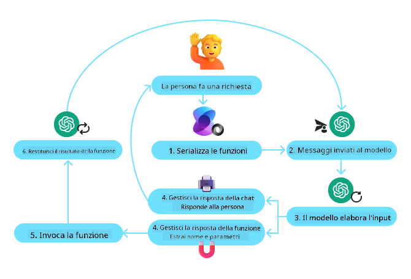
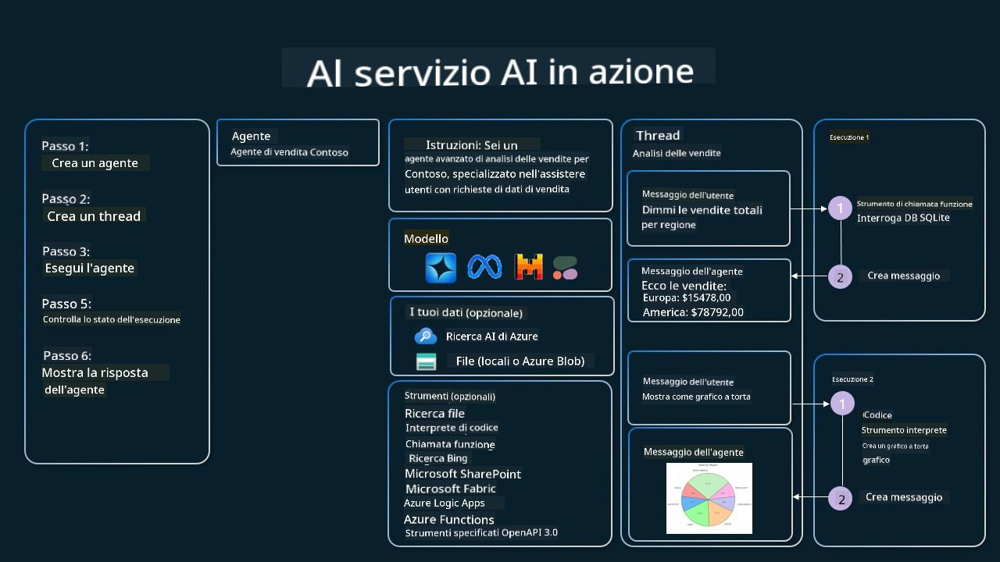

<!--
CO_OP_TRANSLATOR_METADATA:
{
  "original_hash": "88258b03f2893aa2e69eb8fb24baabbc",
  "translation_date": "2025-07-12T09:32:40+00:00",
  "source_file": "04-tool-use/README.md",
  "language_code": "it"
}
-->
[](https://youtu.be/vieRiPRx-gI?si=cEZ8ApnT6Sus9rhn)

> _(Clicca sull'immagine sopra per vedere il video di questa lezione)_

# Pattern di Progettazione per l'Uso degli Strumenti

Gli strumenti sono interessanti perché permettono agli agenti AI di avere una gamma più ampia di capacità. Invece di limitarsi a un insieme ristretto di azioni, aggiungendo uno strumento l’agente può ora eseguire una vasta gamma di operazioni. In questo capitolo, esamineremo il Pattern di Progettazione per l'Uso degli Strumenti, che descrive come gli agenti AI possano utilizzare strumenti specifici per raggiungere i propri obiettivi.

## Introduzione

In questa lezione cercheremo di rispondere alle seguenti domande:

- Cos’è il pattern di progettazione per l’uso degli strumenti?
- In quali casi d’uso può essere applicato?
- Quali sono gli elementi/blocchi costitutivi necessari per implementare questo pattern?
- Quali sono le considerazioni speciali per usare il Pattern di Progettazione per l'Uso degli Strumenti per costruire agenti AI affidabili?

## Obiettivi di Apprendimento

Al termine di questa lezione, sarai in grado di:

- Definire il Pattern di Progettazione per l'Uso degli Strumenti e il suo scopo.
- Identificare i casi d’uso in cui questo pattern è applicabile.
- Comprendere gli elementi chiave necessari per implementare il pattern.
- Riconoscere le considerazioni per garantire l’affidabilità degli agenti AI che utilizzano questo pattern.

## Cos’è il Pattern di Progettazione per l'Uso degli Strumenti?

Il **Pattern di Progettazione per l'Uso degli Strumenti** si concentra sul dare ai LLM la capacità di interagire con strumenti esterni per raggiungere obiettivi specifici. Gli strumenti sono codice eseguibile da un agente per compiere azioni. Uno strumento può essere una funzione semplice come una calcolatrice, oppure una chiamata API a un servizio di terze parti come la ricerca del prezzo di un’azione o la previsione del meteo. Nel contesto degli agenti AI, gli strumenti sono progettati per essere eseguiti dagli agenti in risposta a **chiamate di funzione generate dal modello**.

## In quali casi d’uso può essere applicato?

Gli agenti AI possono sfruttare gli strumenti per completare compiti complessi, recuperare informazioni o prendere decisioni. Il pattern di progettazione per l’uso degli strumenti è spesso utilizzato in scenari che richiedono un’interazione dinamica con sistemi esterni, come database, servizi web o interpreti di codice. Questa capacità è utile in diversi casi d’uso, tra cui:

- **Recupero Dinamico di Informazioni:** Gli agenti possono interrogare API esterne o database per ottenere dati aggiornati (es. interrogare un database SQLite per analisi dati, recuperare prezzi azionari o informazioni meteo).
- **Esecuzione e Interpretazione di Codice:** Gli agenti possono eseguire codice o script per risolvere problemi matematici, generare report o effettuare simulazioni.
- **Automazione di Flussi di Lavoro:** Automatizzare flussi di lavoro ripetitivi o multi-step integrando strumenti come scheduler di attività, servizi email o pipeline di dati.
- **Supporto Clienti:** Gli agenti possono interagire con sistemi CRM, piattaforme di ticketing o basi di conoscenza per risolvere richieste degli utenti.
- **Generazione e Modifica di Contenuti:** Gli agenti possono utilizzare strumenti come correttori grammaticali, sintetizzatori di testo o valutatori di sicurezza dei contenuti per assistere nella creazione di contenuti.

## Quali sono gli elementi/blocchi costitutivi necessari per implementare il pattern di uso degli strumenti?

Questi blocchi costitutivi permettono all’agente AI di svolgere una vasta gamma di compiti. Vediamo gli elementi chiave necessari per implementare il Pattern di Progettazione per l'Uso degli Strumenti:

- **Schemi di Funzioni/Strumenti**: Definizioni dettagliate degli strumenti disponibili, inclusi nome della funzione, scopo, parametri richiesti e output attesi. Questi schemi permettono al LLM di comprendere quali strumenti sono disponibili e come costruire richieste valide.

- **Logica di Esecuzione delle Funzioni**: Regola come e quando gli strumenti vengono invocati in base all’intento dell’utente e al contesto della conversazione. Può includere moduli di pianificazione, meccanismi di instradamento o flussi condizionali che determinano dinamicamente l’uso degli strumenti.

- **Sistema di Gestione dei Messaggi**: Componenti che gestiscono il flusso conversazionale tra input utente, risposte del LLM, chiamate agli strumenti e output degli strumenti.

- **Framework di Integrazione degli Strumenti**: Infrastruttura che collega l’agente ai vari strumenti, siano essi funzioni semplici o servizi esterni complessi.

- **Gestione degli Errori e Validazione**: Meccanismi per gestire fallimenti nell’esecuzione degli strumenti, validare i parametri e gestire risposte inattese.

- **Gestione dello Stato**: Tiene traccia del contesto della conversazione, delle interazioni precedenti con gli strumenti e dei dati persistenti per garantire coerenza nelle interazioni multi-turno.

Passiamo ora a esaminare più nel dettaglio la Chiamata di Funzione/Strumento.

### Chiamata di Funzione/Strumento

La chiamata di funzione è il modo principale con cui abilitiamo i Large Language Models (LLM) a interagire con gli strumenti. Spesso si usano i termini 'Funzione' e 'Strumento' in modo intercambiabile perché le 'funzioni' (blocchi di codice riutilizzabile) sono gli 'strumenti' che gli agenti usano per svolgere i compiti. Perché il codice di una funzione venga invocato, un LLM deve confrontare la richiesta dell’utente con la descrizione delle funzioni. A tal fine, uno schema contenente le descrizioni di tutte le funzioni disponibili viene inviato al LLM. Il LLM seleziona quindi la funzione più appropriata per il compito e restituisce il suo nome e gli argomenti. La funzione selezionata viene invocata, la sua risposta viene inviata al LLM, che usa queste informazioni per rispondere alla richiesta dell’utente.

Per gli sviluppatori che vogliono implementare la chiamata di funzione per agenti, sono necessari:

1. Un modello LLM che supporti la chiamata di funzione
2. Uno schema contenente le descrizioni delle funzioni
3. Il codice per ogni funzione descritta

Usiamo l’esempio di ottenere l’ora corrente in una città per illustrare:

1. **Inizializzare un LLM che supporti la chiamata di funzione:**

    Non tutti i modelli supportano la chiamata di funzione, quindi è importante verificare che il LLM che stai usando lo faccia. <a href="https://learn.microsoft.com/azure/ai-services/openai/how-to/function-calling" target="_blank">Azure OpenAI</a> supporta la chiamata di funzione. Possiamo iniziare creando il client Azure OpenAI.

    ```python
    # Initialize the Azure OpenAI client
    client = AzureOpenAI(
        azure_endpoint = os.getenv("AZURE_OPENAI_ENDPOINT"), 
        api_key=os.getenv("AZURE_OPENAI_API_KEY"),  
        api_version="2024-05-01-preview"
    )
    ```

1. **Creare uno Schema di Funzione**:

    Successivamente definiremo uno schema JSON che contiene il nome della funzione, la descrizione di cosa fa la funzione e i nomi e le descrizioni dei parametri della funzione. Passeremo poi questo schema al client creato in precedenza, insieme alla richiesta dell’utente per trovare l’ora a San Francisco. È importante notare che ciò che viene restituito è una **chiamata allo strumento**, **non** la risposta finale alla domanda. Come detto prima, il LLM restituisce il nome della funzione selezionata per il compito e gli argomenti che le saranno passati.

    ```python
    # Function description for the model to read
    tools = [
        {
            "type": "function",
            "function": {
                "name": "get_current_time",
                "description": "Get the current time in a given location",
                "parameters": {
                    "type": "object",
                    "properties": {
                        "location": {
                            "type": "string",
                            "description": "The city name, e.g. San Francisco",
                        },
                    },
                    "required": ["location"],
                },
            }
        }
    ]
    ```
   
    ```python
  
    # Initial user message
    messages = [{"role": "user", "content": "What's the current time in San Francisco"}] 
  
    # First API call: Ask the model to use the function
      response = client.chat.completions.create(
          model=deployment_name,
          messages=messages,
          tools=tools,
          tool_choice="auto",
      )
  
      # Process the model's response
      response_message = response.choices[0].message
      messages.append(response_message)
  
      print("Model's response:")  

      print(response_message)
  
    ```

    ```bash
    Model's response:
    ChatCompletionMessage(content=None, role='assistant', function_call=None, tool_calls=[ChatCompletionMessageToolCall(id='call_pOsKdUlqvdyttYB67MOj434b', function=Function(arguments='{"location":"San Francisco"}', name='get_current_time'), type='function')])
    ```
  
1. **Il codice della funzione necessario per eseguire il compito:**

    Ora che il LLM ha scelto quale funzione deve essere eseguita, il codice che svolge il compito deve essere implementato ed eseguito. Possiamo implementare il codice per ottenere l’ora corrente in Python. Dovremo anche scrivere il codice per estrarre il nome e gli argomenti dalla response_message per ottenere il risultato finale.

    ```python
      def get_current_time(location):
        """Get the current time for a given location"""
        print(f"get_current_time called with location: {location}")  
        location_lower = location.lower()
        
        for key, timezone in TIMEZONE_DATA.items():
            if key in location_lower:
                print(f"Timezone found for {key}")  
                current_time = datetime.now(ZoneInfo(timezone)).strftime("%I:%M %p")
                return json.dumps({
                    "location": location,
                    "current_time": current_time
                })
      
        print(f"No timezone data found for {location_lower}")  
        return json.dumps({"location": location, "current_time": "unknown"})
    ```

    ```python
     # Handle function calls
      if response_message.tool_calls:
          for tool_call in response_message.tool_calls:
              if tool_call.function.name == "get_current_time":
     
                  function_args = json.loads(tool_call.function.arguments)
     
                  time_response = get_current_time(
                      location=function_args.get("location")
                  )
     
                  messages.append({
                      "tool_call_id": tool_call.id,
                      "role": "tool",
                      "name": "get_current_time",
                      "content": time_response,
                  })
      else:
          print("No tool calls were made by the model.")  
  
      # Second API call: Get the final response from the model
      final_response = client.chat.completions.create(
          model=deployment_name,
          messages=messages,
      )
  
      return final_response.choices[0].message.content
     ```

    ```bash
      get_current_time called with location: San Francisco
      Timezone found for san francisco
      The current time in San Francisco is 09:24 AM.
     ```

La Chiamata di Funzione è al centro della maggior parte, se non di tutti, i design di uso degli strumenti per agenti, tuttavia implementarla da zero può essere a volte complesso. Come abbiamo visto in [Lezione 2](../../../02-explore-agentic-frameworks), i framework agentici ci forniscono blocchi pre-costruiti per implementare l’uso degli strumenti.

## Esempi di Uso degli Strumenti con Framework Agentici

Ecco alcuni esempi di come puoi implementare il Pattern di Progettazione per l'Uso degli Strumenti usando diversi framework agentici:

### Semantic Kernel

<a href="https://learn.microsoft.com/azure/ai-services/agents/overview" target="_blank">Semantic Kernel</a> è un framework AI open-source per sviluppatori .NET, Python e Java che lavorano con Large Language Models (LLM). Semplifica il processo di uso della chiamata di funzione descrivendo automaticamente le tue funzioni e i loro parametri al modello tramite un processo chiamato <a href="https://learn.microsoft.com/semantic-kernel/concepts/ai-services/chat-completion/function-calling/?pivots=programming-language-python#1-serializing-the-functions" target="_blank">serializzazione</a>. Gestisce anche la comunicazione bidirezionale tra il modello e il tuo codice. Un altro vantaggio di usare un framework agentico come Semantic Kernel è che ti permette di accedere a strumenti pre-costruiti come <a href="https://github.com/microsoft/semantic-kernel/blob/main/python/samples/getting_started_with_agents/openai_assistant/step4_assistant_tool_file_search.py" target="_blank">File Search</a> e <a href="https://github.com/microsoft/semantic-kernel/blob/main/python/samples/getting_started_with_agents/openai_assistant/step3_assistant_tool_code_interpreter.py" target="_blank">Code Interpreter</a>.

Il diagramma seguente illustra il processo di chiamata di funzione con Semantic Kernel:



In Semantic Kernel le funzioni/strumenti sono chiamati <a href="https://learn.microsoft.com/semantic-kernel/concepts/plugins/?pivots=programming-language-python" target="_blank">Plugin</a>. Possiamo convertire la funzione `get_current_time` vista prima in un plugin trasformandola in una classe che la contiene. Possiamo anche importare il decoratore `kernel_function`, che prende in input la descrizione della funzione. Quando crei un kernel con GetCurrentTimePlugin, il kernel serializza automaticamente la funzione e i suoi parametri, creando lo schema da inviare al LLM nel processo.

```python
from semantic_kernel.functions import kernel_function

class GetCurrentTimePlugin:
    async def __init__(self, location):
        self.location = location

    @kernel_function(
        description="Get the current time for a given location"
    )
    def get_current_time(location: str = ""):
        ...

```

```python 
from semantic_kernel import Kernel

# Create the kernel
kernel = Kernel()

# Create the plugin
get_current_time_plugin = GetCurrentTimePlugin(location)

# Add the plugin to the kernel
kernel.add_plugin(get_current_time_plugin)
```
  
### Azure AI Agent Service

<a href="https://learn.microsoft.com/azure/ai-services/agents/overview" target="_blank">Azure AI Agent Service</a> è un framework agentico più recente progettato per permettere agli sviluppatori di costruire, distribuire e scalare agenti AI di alta qualità e estensibili in modo sicuro, senza dover gestire direttamente le risorse di calcolo e storage sottostanti. È particolarmente utile per applicazioni enterprise, essendo un servizio completamente gestito con sicurezza di livello enterprise.

Rispetto allo sviluppo diretto con l’API LLM, Azure AI Agent Service offre alcuni vantaggi, tra cui:

- Chiamata automatica degli strumenti – non è necessario analizzare una chiamata a uno strumento, invocare lo strumento e gestire la risposta; tutto questo viene ora gestito lato server
- Gestione sicura dei dati – invece di gestire lo stato della conversazione autonomamente, puoi affidarti ai thread per memorizzare tutte le informazioni necessarie
- Strumenti pronti all’uso – strumenti per interagire con le tue fonti dati, come Bing, Azure AI Search e Azure Functions.

Gli strumenti disponibili in Azure AI Agent Service si dividono in due categorie:

1. Strumenti di Conoscenza:
    - <a href="https://learn.microsoft.com/azure/ai-services/agents/how-to/tools/bing-grounding?tabs=python&pivots=overview" target="_blank">Grounding con Bing Search</a>
    - <a href="https://learn.microsoft.com/azure/ai-services/agents/how-to/tools/file-search?tabs=python&pivots=overview" target="_blank">File Search</a>
    - <a href="https://learn.microsoft.com/azure/ai-services/agents/how-to/tools/azure-ai-search?tabs=azurecli%2Cpython&pivots=overview-azure-ai-search" target="_blank">Azure AI Search</a>

2. Strumenti di Azione:
    - <a href="https://learn.microsoft.com/azure/ai-services/agents/how-to/tools/function-calling?tabs=python&pivots=overview" target="_blank">Function Calling</a>
    - <a href="https://learn.microsoft.com/azure/ai-services/agents/how-to/tools/code-interpreter?tabs=python&pivots=overview" target="_blank">Code Interpreter</a>
    - <a href="https://learn.microsoft.com/azure/ai-services/agents/how-to/tools/openapi-spec?tabs=python&pivots=overview" target="_blank">Strumenti definiti da OpenAI</a>
    - <a href="https://learn.microsoft.com/azure/ai-services/agents/how-to/tools/azure-functions?pivots=overview" target="_blank">Azure Functions</a>

L’Agent Service ci permette di usare questi strumenti insieme come un `toolset`. Utilizza anche i `threads` che tengono traccia della cronologia dei messaggi di una particolare conversazione.

Immagina di essere un agente di vendita in un’azienda chiamata Contoso. Vuoi sviluppare un agente conversazionale che possa rispondere a domande sui dati di vendita.

L’immagine seguente illustra come potresti usare Azure AI Agent Service per analizzare i tuoi dati di vendita:



Per usare uno qualsiasi di questi strumenti con il servizio possiamo creare un client e definire uno strumento o un toolset. Per implementarlo praticamente possiamo usare il seguente codice Python. Il LLM sarà in grado di guardare il toolset e decidere se usare la funzione creata dall’utente, `fetch_sales_data_using_sqlite_query`, o il Code Interpreter pre-costruito a seconda della richiesta dell’utente.

```python 
import os
from azure.ai.projects import AIProjectClient
from azure.identity import DefaultAzureCredential
from fecth_sales_data_functions import fetch_sales_data_using_sqlite_query # fetch_sales_data_using_sqlite_query function which can be found in a fetch_sales_data_functions.py file.
from azure.ai.projects.models import ToolSet, FunctionTool, CodeInterpreterTool

project_client = AIProjectClient.from_connection_string(
    credential=DefaultAzureCredential(),
    conn_str=os.environ["PROJECT_CONNECTION_STRING"],
)

# Initialize function calling agent with the fetch_sales_data_using_sqlite_query function and adding it to the toolset
fetch_data_function = FunctionTool(fetch_sales_data_using_sqlite_query)
toolset = ToolSet()
toolset.add(fetch_data_function)

# Initialize Code Interpreter tool and adding it to the toolset. 
code_interpreter = code_interpreter = CodeInterpreterTool()
toolset = ToolSet()
toolset.add(code_interpreter)

agent = project_client.agents.create_agent(
    model="gpt-4o-mini", name="my-agent", instructions="You are helpful agent", 
    toolset=toolset
)
```

## Quali sono le considerazioni speciali per usare il Pattern di Progettazione per l'Uso degli Strumenti per costruire agenti AI affidabili?

Una preoccupazione comune con SQL generato dinamicamente dai LLM è la sicurezza, in particolare il rischio di SQL injection o azioni dannose, come la cancellazione o la manomissione del database. Sebbene queste preoccupazioni siano valide, possono essere efficacemente mitigate configurando correttamente i permessi di accesso al database. Per la maggior parte dei database questo comporta la configurazione in sola lettura. Per servizi di database come PostgreSQL o Azure SQL, l’app dovrebbe essere assegnata a un ruolo di sola lettura (SELECT).

Eseguire l’app in un ambiente sicuro aumenta ulteriormente la protezione. In scenari enterprise, i dati vengono tipicamente estratti e trasformati da sistemi operativi in un database o data warehouse in sola lettura con uno schema user-friendly. Questo approccio garantisce che i dati siano sicuri, ottimizzati per prestazioni e accessibilità, e che l’app abbia accesso limitato e in sola lettura.

## Risorse Aggiuntive

-

Azure AI Agents Service Workshop</a>
- <a href="https://github.com/Azure-Samples/contoso-creative-writer/tree/main/docs/workshop" target="_blank">Contoso Creative Writer Multi-Agent Workshop</a>
- <a href="https://learn.microsoft.com/semantic-kernel/concepts/ai-services/chat-completion/function-calling/?pivots=programming-language-python#1-serializing-the-functions" target="_blank">Tutorial sulla Chiamata di Funzioni in Semantic Kernel</a>
- <a href="https://github.com/microsoft/semantic-kernel/blob/main/python/samples/getting_started_with_agents/openai_assistant/step3_assistant_tool_code_interpreter.py" target="_blank">Semantic Kernel Code Interpreter</a>
- <a href="https://microsoft.github.io/autogen/dev/user-guide/core-user-guide/components/tools.html" target="_blank">Strumenti Autogen</a>

## Lezione Precedente

[Comprendere i Pattern di Design Agentici](../03-agentic-design-patterns/README.md)

## Lezione Successiva

[Agentic RAG](../05-agentic-rag/README.md)

**Disclaimer**:  
Questo documento è stato tradotto utilizzando il servizio di traduzione automatica [Co-op Translator](https://github.com/Azure/co-op-translator). Pur impegnandoci per garantire l’accuratezza, si prega di notare che le traduzioni automatiche possono contenere errori o imprecisioni. Il documento originale nella sua lingua nativa deve essere considerato la fonte autorevole. Per informazioni critiche, si raccomanda una traduzione professionale effettuata da un umano. Non ci assumiamo alcuna responsabilità per eventuali malintesi o interpretazioni errate derivanti dall’uso di questa traduzione.