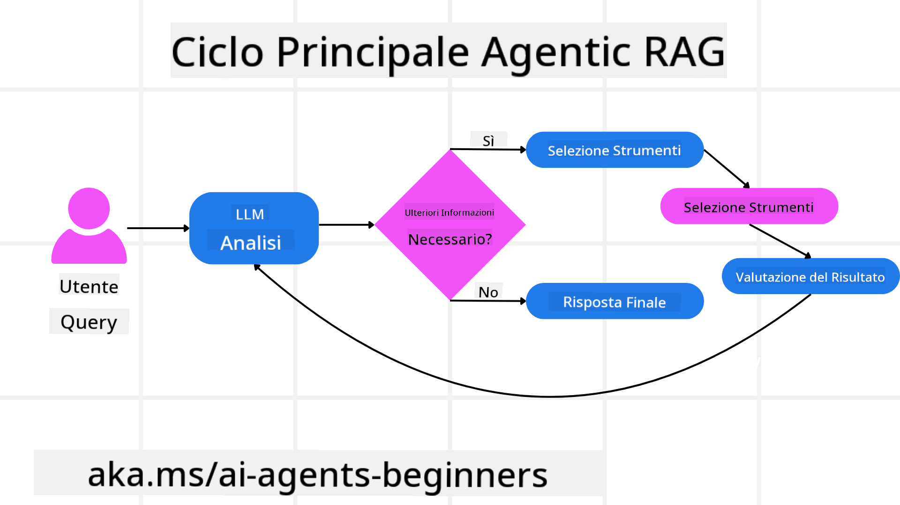
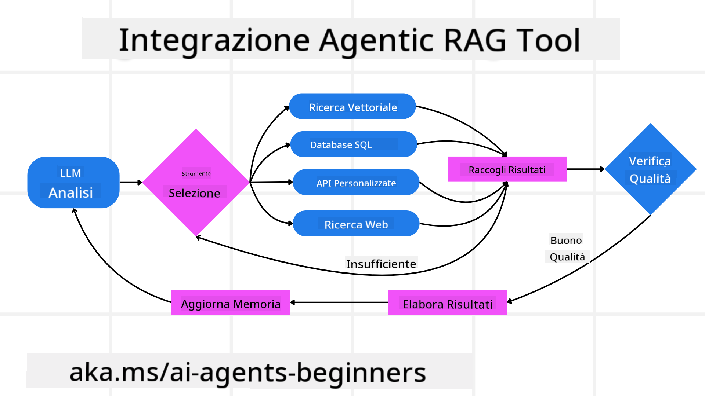
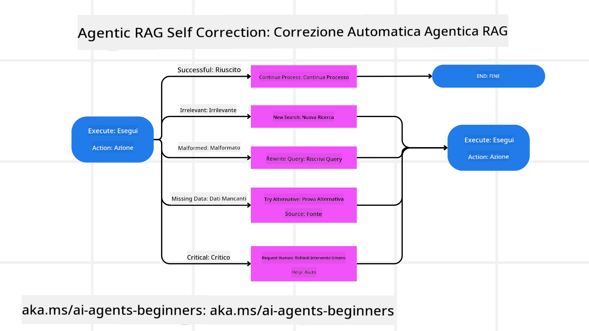
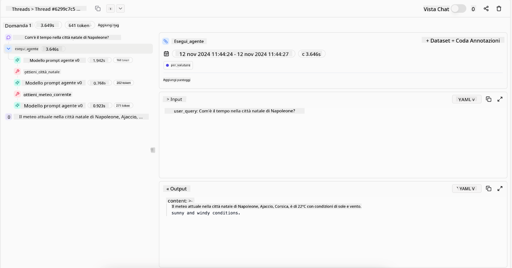
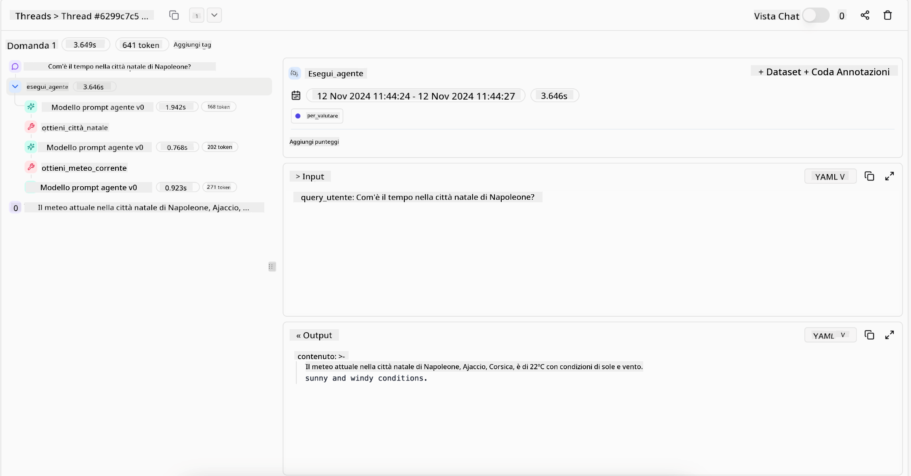

<!--
CO_OP_TRANSLATOR_METADATA:
{
  "original_hash": "7622aa72f9e676e593339f5f694ecd7d",
  "translation_date": "2025-07-12T10:00:48+00:00",
  "source_file": "05-agentic-rag/README.md",
  "language_code": "it"
}
-->

> _(Clicca sull'immagine sopra per vedere il video di questa lezione)_

# Agentic RAG

Questa lezione offre una panoramica completa su Agentic Retrieval-Augmented Generation (Agentic RAG), un paradigma emergente nell’IA in cui i grandi modelli di linguaggio (LLM) pianificano autonomamente i loro prossimi passi mentre estraggono informazioni da fonti esterne. A differenza dei modelli statici di recupero-then-read, Agentic RAG prevede chiamate iterative al LLM, intervallate da chiamate a strumenti o funzioni e output strutturati. Il sistema valuta i risultati, affina le query, invoca strumenti aggiuntivi se necessario e continua questo ciclo fino a raggiungere una soluzione soddisfacente.

## Introduzione

In questa lezione tratteremo

- **Comprendere Agentic RAG:** Scoprire il paradigma emergente nell’IA in cui i grandi modelli di linguaggio (LLM) pianificano autonomamente i loro prossimi passi mentre estraggono informazioni da fonti dati esterne.
- **Affrontare lo stile iterativo Maker-Checker:** Comprendere il ciclo di chiamate iterative al LLM, intervallate da chiamate a strumenti o funzioni e output strutturati, progettato per migliorare la correttezza e gestire query malformate.
- **Esplorare applicazioni pratiche:** Identificare scenari in cui Agentic RAG eccelle, come ambienti incentrati sulla correttezza, interazioni complesse con database e flussi di lavoro estesi.

## Obiettivi di apprendimento

Al termine di questa lezione, saprai come/capirai:

- **Comprendere Agentic RAG:** Conoscere il paradigma emergente nell’IA in cui i grandi modelli di linguaggio (LLM) pianificano autonomamente i loro prossimi passi mentre estraggono informazioni da fonti dati esterne.
- **Stile iterativo Maker-Checker:** Affrontare il concetto di ciclo di chiamate iterative al LLM, intervallate da chiamate a strumenti o funzioni e output strutturati, progettato per migliorare la correttezza e gestire query malformate.
- **Gestire il processo di ragionamento:** Comprendere la capacità del sistema di gestire autonomamente il proprio processo di ragionamento, prendendo decisioni su come affrontare i problemi senza affidarsi a percorsi predefiniti.
- **Flusso di lavoro:** Capire come un modello agentico decida autonomamente di recuperare report sulle tendenze di mercato, identificare dati dei concorrenti, correlare metriche di vendita interne, sintetizzare i risultati e valutare la strategia.
- **Cicli iterativi, integrazione di strumenti e memoria:** Apprendere il modello di interazione a ciclo continuo, mantenendo stato e memoria tra i passaggi per evitare ripetizioni e prendere decisioni più informate.
- **Gestione dei fallimenti e autocorrezione:** Esplorare i meccanismi robusti di autocorrezione del sistema, inclusi iterazioni e nuove query, uso di strumenti diagnostici e ricorso alla supervisione umana.
- **Limiti dell’agenzia:** Comprendere i limiti di Agentic RAG, focalizzandosi sull’autonomia specifica del dominio, la dipendenza dall’infrastruttura e il rispetto delle regole di sicurezza.
- **Casi d’uso pratici e valore:** Identificare scenari in cui Agentic RAG si distingue, come ambienti incentrati sulla correttezza, interazioni complesse con database e flussi di lavoro estesi.
- **Governance, trasparenza e fiducia:** Conoscere l’importanza della governance e della trasparenza, inclusi ragionamenti spiegabili, controllo dei bias e supervisione umana.

## Cos’è Agentic RAG?

Agentic Retrieval-Augmented Generation (Agentic RAG) è un paradigma emergente nell’IA in cui i grandi modelli di linguaggio (LLM) pianificano autonomamente i loro prossimi passi mentre estraggono informazioni da fonti esterne. A differenza dei modelli statici di recupero-then-read, Agentic RAG prevede chiamate iterative al LLM, intervallate da chiamate a strumenti o funzioni e output strutturati. Il sistema valuta i risultati, affina le query, invoca strumenti aggiuntivi se necessario e continua questo ciclo fino a raggiungere una soluzione soddisfacente. Questo stile iterativo “maker-checker” migliora la correttezza, gestisce query malformate e garantisce risultati di alta qualità.

Il sistema gestisce attivamente il proprio processo di ragionamento, riscrivendo query fallite, scegliendo metodi di recupero diversi e integrando più strumenti—come la ricerca vettoriale in Azure AI Search, database SQL o API personalizzate—prima di finalizzare la risposta. La caratteristica distintiva di un sistema agentico è la sua capacità di gestire autonomamente il proprio processo di ragionamento. Le implementazioni tradizionali di RAG si basano su percorsi predefiniti, mentre un sistema agentico determina autonomamente la sequenza di passi in base alla qualità delle informazioni trovate.

## Definizione di Agentic Retrieval-Augmented Generation (Agentic RAG)

Agentic Retrieval-Augmented Generation (Agentic RAG) è un paradigma emergente nello sviluppo dell’IA in cui i LLM non solo estraggono informazioni da fonti dati esterne, ma pianificano autonomamente i loro prossimi passi. A differenza dei modelli statici di recupero-then-read o delle sequenze di prompt accuratamente scritte, Agentic RAG prevede un ciclo di chiamate iterative al LLM, intervallate da chiamate a strumenti o funzioni e output strutturati. Ad ogni passaggio, il sistema valuta i risultati ottenuti, decide se affinare le query, invoca strumenti aggiuntivi se necessario e continua questo ciclo fino a raggiungere una soluzione soddisfacente.

Questo stile iterativo “maker-checker” è progettato per migliorare la correttezza, gestire query malformate verso database strutturati (es. NL2SQL) e garantire risultati equilibrati e di alta qualità. Piuttosto che affidarsi esclusivamente a catene di prompt ingegnerizzate, il sistema gestisce attivamente il proprio processo di ragionamento. Può riscrivere query fallite, scegliere metodi di recupero diversi e integrare più strumenti—come la ricerca vettoriale in Azure AI Search, database SQL o API personalizzate—prima di finalizzare la risposta. Questo elimina la necessità di framework di orchestrazione troppo complessi. Invece, un ciclo relativamente semplice di “chiamata LLM → uso strumento → chiamata LLM → …” può produrre output sofisticati e ben fondati.

## Gestire il processo di ragionamento

La qualità distintiva che rende un sistema “agentico” è la sua capacità di gestire autonomamente il proprio processo di ragionamento. Le implementazioni tradizionali di RAG spesso dipendono da percorsi predefiniti dagli umani: una catena di pensiero che indica cosa recuperare e quando.  
Ma quando un sistema è veramente agentico, decide internamente come affrontare il problema. Non esegue semplicemente uno script; determina autonomamente la sequenza di passi in base alla qualità delle informazioni trovate.  
Ad esempio, se gli viene chiesto di creare una strategia di lancio prodotto, non si affida solo a un prompt che descrive l’intero flusso di ricerca e decisione. Invece, il modello agentico decide autonomamente di:

1. Recuperare report sulle tendenze di mercato attuali usando Bing Web Grounding  
2. Identificare dati rilevanti dei concorrenti tramite Azure AI Search  
3. Correlare metriche storiche di vendita interne usando Azure SQL Database  
4. Sintetizzare i risultati in una strategia coerente orchestrata tramite Azure OpenAI Service  
5. Valutare la strategia per individuare lacune o incoerenze, avviando un nuovo ciclo di recupero se necessario  

Tutti questi passaggi—affinare query, scegliere fonti, iterare fino a essere “soddisfatti” della risposta—sono decisi dal modello, non pre-scritti da un umano.

## Cicli iterativi, integrazione di strumenti e memoria

Un sistema agentico si basa su un modello di interazione a ciclo continuo:

- **Chiamata iniziale:** L’obiettivo dell’utente (cioè il prompt) viene presentato al LLM.  
- **Invocazione dello strumento:** Se il modello identifica informazioni mancanti o istruzioni ambigue, seleziona uno strumento o un metodo di recupero—come una query a un database vettoriale (es. Azure AI Search Hybrid su dati privati) o una chiamata SQL strutturata—per raccogliere più contesto.  
- **Valutazione e affinamento:** Dopo aver esaminato i dati restituiti, il modello decide se le informazioni sono sufficienti. In caso contrario, affina la query, prova uno strumento diverso o modifica l’approccio.  
- **Ripetizione fino a soddisfazione:** Questo ciclo continua finché il modello non ritiene di avere chiarezza e prove sufficienti per fornire una risposta finale ben ragionata.  
- **Memoria e stato:** Poiché il sistema mantiene stato e memoria tra i passaggi, può ricordare tentativi precedenti e i loro risultati, evitando cicli ripetitivi e prendendo decisioni più informate durante il processo.

Col tempo, questo crea una sensazione di comprensione evolutiva, permettendo al modello di affrontare compiti complessi e multi-step senza richiedere un intervento umano costante o la riformulazione del prompt.

## Gestione dei fallimenti e autocorrezione

L’autonomia di Agentic RAG include anche meccanismi robusti di autocorrezione. Quando il sistema si trova in situazioni di stallo—come il recupero di documenti irrilevanti o query malformate—può:

- **Iterare e rifare le query:** Invece di restituire risposte di scarso valore, il modello tenta nuove strategie di ricerca, riscrive query al database o esplora set di dati alternativi.  
- **Usare strumenti diagnostici:** Il sistema può invocare funzioni aggiuntive progettate per aiutarlo a debugare i passaggi di ragionamento o confermare la correttezza dei dati recuperati. Strumenti come Azure AI Tracing saranno fondamentali per garantire osservabilità e monitoraggio robusti.  
- **Ricorrere alla supervisione umana:** Per scenari ad alto rischio o con fallimenti ripetuti, il modello può segnalare incertezza e richiedere guida umana. Una volta ricevuto un feedback correttivo, il modello può incorporare quella lezione per il futuro.

Questo approccio iterativo e dinamico permette al modello di migliorare continuamente, assicurando che non sia un sistema “one-shot” ma uno che apprende dai propri errori durante una sessione.

## Limiti dell’agenzia

Nonostante la sua autonomia all’interno di un compito, Agentic RAG non è paragonabile all’Intelligenza Artificiale Generale. Le sue capacità “agentiche” sono limitate agli strumenti, alle fonti dati e alle politiche fornite dagli sviluppatori umani. Non può inventare i propri strumenti né uscire dai confini del dominio stabiliti. Piuttosto, eccelle nell’orchestrare dinamicamente le risorse a disposizione.  
Le differenze chiave rispetto a forme di IA più avanzate includono:

1. **Autonomia specifica del dominio:** I sistemi Agentic RAG si concentrano sul raggiungimento di obiettivi definiti dall’utente all’interno di un dominio noto, impiegando strategie come la riscrittura delle query o la selezione degli strumenti per migliorare i risultati.  
2. **Dipendenza dall’infrastruttura:** Le capacità del sistema dipendono dagli strumenti e dai dati integrati dagli sviluppatori. Non può superare questi limiti senza intervento umano.  
3. **Rispetto delle regole di sicurezza:** Linee guida etiche, norme di conformità e politiche aziendali rimangono fondamentali. La libertà dell’agente è sempre vincolata da misure di sicurezza e meccanismi di supervisione (si spera).

## Casi d’uso pratici e valore

Agentic RAG si distingue in scenari che richiedono raffinamento iterativo e precisione:

1. **Ambientazioni incentrate sulla correttezza:** In controlli di conformità, analisi regolatorie o ricerche legali, il modello agentico può verificare ripetutamente i fatti, consultare più fonti e riscrivere query finché non produce una risposta accuratamente verificata.  
2. **Interazioni complesse con database:** Quando si lavora con dati strutturati dove le query possono spesso fallire o necessitare di aggiustamenti, il sistema può affinare autonomamente le query usando Azure SQL o Microsoft Fabric OneLake, assicurando che il recupero finale rispecchi l’intento dell’utente.  
3. **Flussi di lavoro estesi:** Sessioni di lunga durata possono evolvere man mano che emergono nuove informazioni. Agentic RAG può incorporare continuamente nuovi dati, modificando strategie mentre apprende di più sul problema.

## Governance, trasparenza e fiducia

Man mano che questi sistemi diventano più autonomi nel ragionamento, governance e trasparenza sono fondamentali:

- **Ragionamento spiegabile:** Il modello può fornire una traccia di audit delle query effettuate, delle fonti consultate e dei passaggi di ragionamento seguiti per arrivare alla conclusione. Strumenti come Azure AI Content Safety e Azure AI Tracing / GenAIOps aiutano a mantenere trasparenza e mitigare i rischi.  
- **Controllo dei bias e recupero bilanciato:** Gli sviluppatori possono regolare le strategie di recupero per garantire che vengano considerate fonti dati equilibrate e rappresentative, e auditare regolarmente gli output per rilevare bias o pattern distorti usando modelli personalizzati per organizzazioni avanzate di data science con Azure Machine Learning.  
- **Supervisione umana e conformità:** Per compiti sensibili, la revisione umana rimane essenziale. Agentic RAG non sostituisce il giudizio umano in decisioni critiche, ma lo integra offrendo opzioni più accuratamente verificate.

Avere strumenti che forniscano un chiaro registro delle azioni è essenziale. Senza di essi, il debug di un processo multi-step può essere molto difficile. Vedi l’esempio seguente da Literal AI (azienda dietro Chainlit) per una sessione Agent:

## Conclusione

Agentic RAG rappresenta un’evoluzione naturale nel modo in cui i sistemi IA gestiscono compiti complessi e intensivi di dati. Adottando un modello di interazione a ciclo continuo, selezionando autonomamente gli strumenti e affinando le query fino a ottenere un risultato di alta qualità, il sistema supera il semplice seguire prompt statici per diventare un decisore più adattivo e consapevole del contesto. Pur rimanendo vincolato da infrastrutture e linee guida etiche definite dall’uomo, queste capacità agentiche permettono interazioni IA più ricche, dinamiche e, in definitiva, più utili sia per le aziende che per gli utenti finali.

## Risorse aggiuntive

- <a href="https://learn.microsoft.com/training/modules/use-own-data-azure-openai" target="_blank">Implementare Retrieval Augmented Generation (RAG) con Azure OpenAI Service: Impara come usare i tuoi dati con Azure OpenAI Service. Questo modulo Microsoft Learn offre una guida completa sull’implementazione di RAG</a>

- <a href="https://learn.microsoft.com/azure/ai-studio/concepts/evaluation-approach-gen-ai" target="_blank">Valutazione delle applicazioni di intelligenza artificiale generativa con Azure AI Foundry: Questo articolo tratta la valutazione e il confronto dei modelli su dataset pubblici, incluse le applicazioni Agentic AI e le architetture RAG</a>
- <a href="https://weaviate.io/blog/what-is-agentic-rag" target="_blank">Cos’è Agentic RAG | Weaviate</a>
- <a href="https://ragaboutit.com/agentic-rag-a-complete-guide-to-agent-based-retrieval-augmented-generation/" target="_blank">Agentic RAG: Guida completa alla generazione aumentata basata su agenti – Novità da generation RAG</a>
- <a href="https://huggingface.co/learn/cookbook/agent_rag" target="_blank">Agentic RAG: potenzia il tuo RAG con la riformulazione delle query e l’auto-query! Hugging Face Open-Source AI Cookbook</a>
- <a href="https://youtu.be/aQ4yQXeB1Ss?si=2HUqBzHoeB5tR04U" target="_blank">Aggiungere livelli Agentic a RAG</a>
- <a href="https://www.youtube.com/watch?v=zeAyuLc_f3Q&t=244s" target="_blank">Il futuro degli assistenti alla conoscenza: Jerry Liu</a>
- <a href="https://www.youtube.com/watch?v=AOSjiXP1jmQ" target="_blank">Come costruire sistemi Agentic RAG</a>
- <a href="https://ignite.microsoft.com/sessions/BRK102?source=sessions" target="_blank">Usare Azure AI Foundry Agent Service per scalare i tuoi agenti AI</a>

### Articoli Accademici

- <a href="https://arxiv.org/abs/2303.17651" target="_blank">2303.17651 Self-Refine: Raffinamento iterativo con auto-feedback</a>
- <a href="https://arxiv.org/abs/2303.11366" target="_blank">2303.11366 Reflexion: Agenti linguistici con apprendimento per rinforzo verbale</a>
- <a href="https://arxiv.org/abs/2305.11738" target="_blank">2305.11738 CRITIC: I grandi modelli linguistici possono autocorreggersi con critiche interattive tramite strumenti</a>
- <a href="https://arxiv.org/abs/2501.09136" target="_blank">2501.09136 Agentic Retrieval-Augmented Generation: Una panoramica su Agentic RAG</a>

## Lezione precedente

[Tool Use Design Pattern](../04-tool-use/README.md)

## Lezione successiva

[Building Trustworthy AI Agents](../06-building-trustworthy-agents/README.md)

**Disclaimer**:  
Questo documento è stato tradotto utilizzando il servizio di traduzione automatica [Co-op Translator](https://github.com/Azure/co-op-translator). Pur impegnandoci per garantire l’accuratezza, si prega di notare che le traduzioni automatiche possono contenere errori o imprecisioni. Il documento originale nella sua lingua nativa deve essere considerato la fonte autorevole. Per informazioni critiche, si raccomanda una traduzione professionale effettuata da un umano. Non ci assumiamo alcuna responsabilità per eventuali malintesi o interpretazioni errate derivanti dall’uso di questa traduzione.