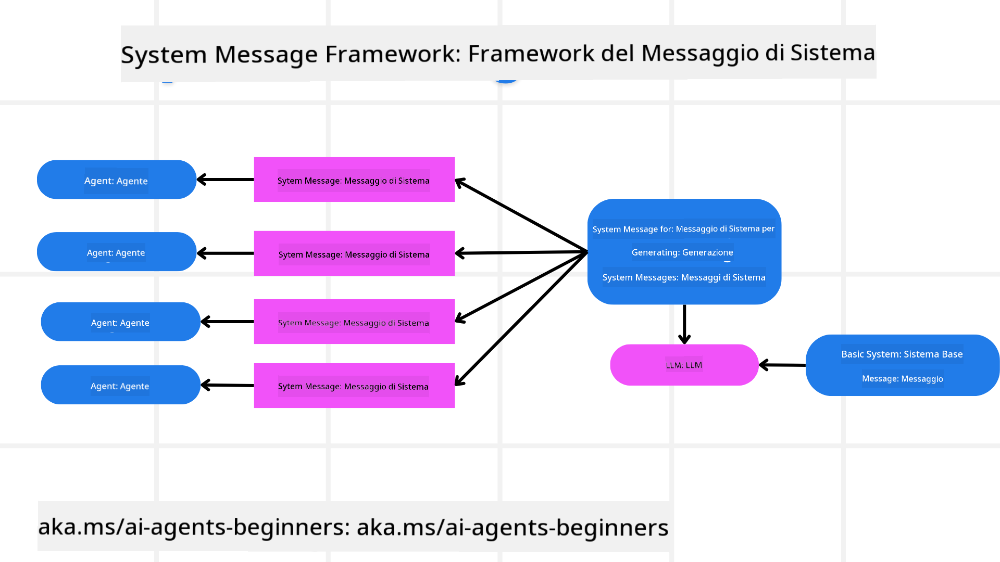
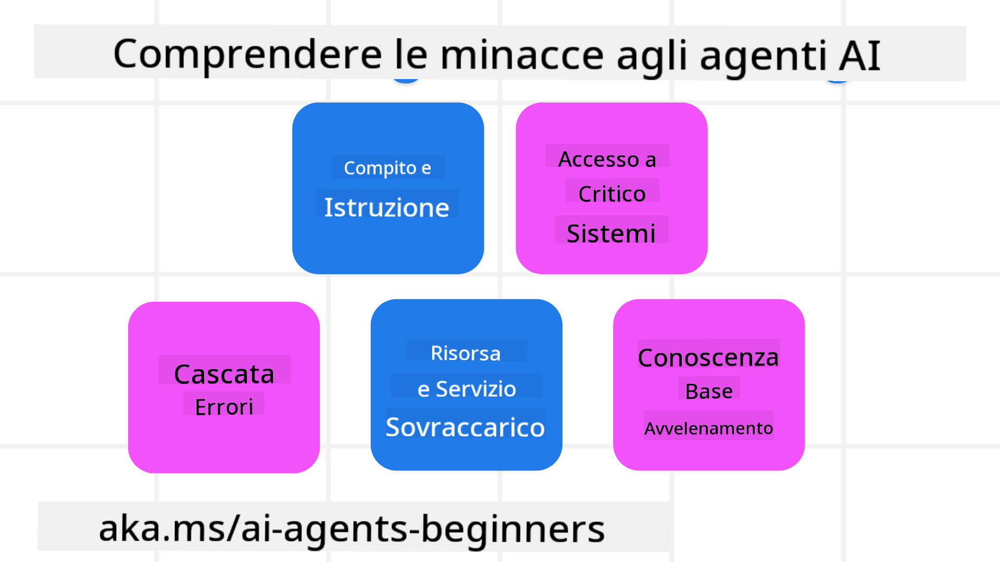
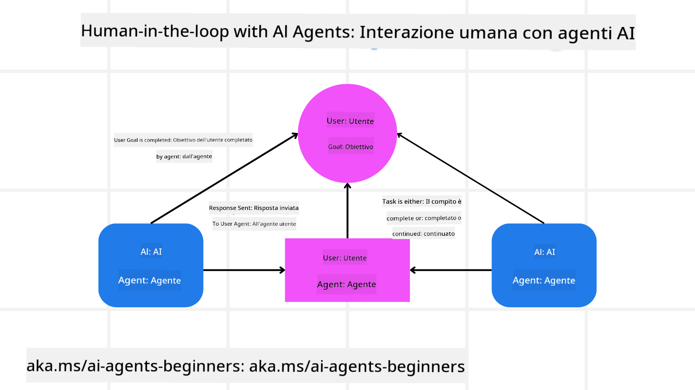

<!--
CO_OP_TRANSLATOR_METADATA:
{
  "original_hash": "f57852cac3a86c4a5ef47f793cc12178",
  "translation_date": "2025-07-12T10:26:29+00:00",
  "source_file": "06-building-trustworthy-agents/README.md",
  "language_code": "it"
}
-->
[](https://youtu.be/iZKkMEGBCUQ?si=Q-kEbcyHUMPoHp8L)

> _(Clicca sull'immagine sopra per vedere il video di questa lezione)_

# Costruire Agenti AI Affidabili

## Introduzione

In questa lezione vedremo:

- Come costruire e distribuire Agenti AI sicuri ed efficaci
- Considerazioni importanti sulla sicurezza nello sviluppo di Agenti AI
- Come mantenere la privacy dei dati e degli utenti durante lo sviluppo di Agenti AI

## Obiettivi di Apprendimento

Al termine di questa lezione, saprai come:

- Identificare e mitigare i rischi nella creazione di Agenti AI
- Implementare misure di sicurezza per garantire una corretta gestione di dati e accessi
- Creare Agenti AI che tutelano la privacy dei dati e offrono un’esperienza utente di qualità

## Sicurezza

Iniziamo con la costruzione di applicazioni agentiche sicure. Sicurezza significa che l’agente AI si comporta come previsto. Come sviluppatori di applicazioni agentiche, disponiamo di metodi e strumenti per massimizzare la sicurezza:

### Costruire un Framework per i Messaggi di Sistema

Se hai mai creato un’applicazione AI usando Large Language Models (LLM), conosci l’importanza di progettare un prompt di sistema solido o un messaggio di sistema. Questi prompt stabiliscono le regole meta, le istruzioni e le linee guida su come l’LLM interagirà con l’utente e i dati.

Per gli Agenti AI, il prompt di sistema è ancora più importante, poiché gli agenti necessitano di istruzioni molto specifiche per completare i compiti che abbiamo progettato per loro.

Per creare prompt di sistema scalabili, possiamo usare un framework di messaggi di sistema per costruire uno o più agenti nella nostra applicazione:



#### Passo 1: Creare un Meta Messaggio di Sistema

Il meta prompt sarà usato da un LLM per generare i prompt di sistema per gli agenti che creiamo. Lo progettiamo come un modello in modo da poter creare più agenti in modo efficiente, se necessario.

Ecco un esempio di meta messaggio di sistema che forniremmo all’LLM:

```plaintext
You are an expert at creating AI agent assistants. 
You will be provided a company name, role, responsibilities and other
information that you will use to provide a system prompt for.
To create the system prompt, be descriptive as possible and provide a structure that a system using an LLM can better understand the role and responsibilities of the AI assistant. 
```

#### Passo 2: Creare un prompt di base

Il passo successivo è creare un prompt di base per descrivere l’Agente AI. Dovresti includere il ruolo dell’agente, i compiti che dovrà svolgere e qualsiasi altra responsabilità.

Ecco un esempio:

```plaintext
You are a travel agent for Contoso Travel that is great at booking flights for customers. To help customers you can perform the following tasks: lookup available flights, book flights, ask for preferences in seating and times for flights, cancel any previously booked flights and alert customers on any delays or cancellations of flights.  
```

#### Passo 3: Fornire il Messaggio di Sistema di Base all’LLM

Ora possiamo ottimizzare questo messaggio di sistema fornendo il meta messaggio di sistema come messaggio di sistema insieme al nostro messaggio di sistema di base.

Questo produrrà un messaggio di sistema meglio progettato per guidare i nostri Agenti AI:

```markdown
**Company Name:** Contoso Travel  
**Role:** Travel Agent Assistant

**Objective:**  
You are an AI-powered travel agent assistant for Contoso Travel, specializing in booking flights and providing exceptional customer service. Your main goal is to assist customers in finding, booking, and managing their flights, all while ensuring that their preferences and needs are met efficiently.

**Key Responsibilities:**

1. **Flight Lookup:**
    
    - Assist customers in searching for available flights based on their specified destination, dates, and any other relevant preferences.
    - Provide a list of options, including flight times, airlines, layovers, and pricing.
2. **Flight Booking:**
    
    - Facilitate the booking of flights for customers, ensuring that all details are correctly entered into the system.
    - Confirm bookings and provide customers with their itinerary, including confirmation numbers and any other pertinent information.
3. **Customer Preference Inquiry:**
    
    - Actively ask customers for their preferences regarding seating (e.g., aisle, window, extra legroom) and preferred times for flights (e.g., morning, afternoon, evening).
    - Record these preferences for future reference and tailor suggestions accordingly.
4. **Flight Cancellation:**
    
    - Assist customers in canceling previously booked flights if needed, following company policies and procedures.
    - Notify customers of any necessary refunds or additional steps that may be required for cancellations.
5. **Flight Monitoring:**
    
    - Monitor the status of booked flights and alert customers in real-time about any delays, cancellations, or changes to their flight schedule.
    - Provide updates through preferred communication channels (e.g., email, SMS) as needed.

**Tone and Style:**

- Maintain a friendly, professional, and approachable demeanor in all interactions with customers.
- Ensure that all communication is clear, informative, and tailored to the customer's specific needs and inquiries.

**User Interaction Instructions:**

- Respond to customer queries promptly and accurately.
- Use a conversational style while ensuring professionalism.
- Prioritize customer satisfaction by being attentive, empathetic, and proactive in all assistance provided.

**Additional Notes:**

- Stay updated on any changes to airline policies, travel restrictions, and other relevant information that could impact flight bookings and customer experience.
- Use clear and concise language to explain options and processes, avoiding jargon where possible for better customer understanding.

This AI assistant is designed to streamline the flight booking process for customers of Contoso Travel, ensuring that all their travel needs are met efficiently and effectively.

```

#### Passo 4: Iterare e Migliorare

Il valore di questo framework per i messaggi di sistema è la possibilità di scalare la creazione di messaggi di sistema per più agenti e migliorare i messaggi nel tempo. È raro che un messaggio di sistema funzioni perfettamente al primo tentativo per il tuo caso d’uso completo. Essere in grado di apportare piccole modifiche e miglioramenti cambiando il messaggio di sistema di base e testandolo nel sistema ti permetterà di confrontare e valutare i risultati.

## Comprendere le Minacce

Per costruire agenti AI affidabili, è importante comprendere e mitigare i rischi e le minacce per il tuo agente AI. Vediamo alcune delle diverse minacce agli agenti AI e come puoi pianificare e prepararti al meglio.



### Compito e Istruzioni

**Descrizione:** Gli attaccanti cercano di modificare le istruzioni o gli obiettivi dell’agente AI tramite prompting o manipolazione degli input.

**Mitigazione:** Esegui controlli di validazione e filtri sugli input per rilevare prompt potenzialmente pericolosi prima che vengano elaborati dall’Agente AI. Poiché questi attacchi richiedono tipicamente interazioni frequenti con l’agente, limitare il numero di turni in una conversazione è un altro modo per prevenire questo tipo di attacchi.

### Accesso a Sistemi Critici

**Descrizione:** Se un agente AI ha accesso a sistemi e servizi che conservano dati sensibili, gli attaccanti possono compromettere la comunicazione tra l’agente e questi servizi. Questi possono essere attacchi diretti o tentativi indiretti di ottenere informazioni su questi sistemi tramite l’agente.

**Mitigazione:** Gli agenti AI dovrebbero avere accesso ai sistemi solo quando necessario per prevenire questo tipo di attacchi. La comunicazione tra agente e sistema deve essere sicura. Implementare autenticazione e controllo degli accessi è un altro modo per proteggere queste informazioni.

### Sovraccarico di Risorse e Servizi

**Descrizione:** Gli agenti AI possono accedere a diversi strumenti e servizi per completare i compiti. Gli attaccanti possono sfruttare questa capacità per attaccare questi servizi inviando un alto volume di richieste tramite l’agente AI, causando malfunzionamenti o costi elevati.

**Mitigazione:** Implementa politiche per limitare il numero di richieste che un agente AI può fare a un servizio. Limitare il numero di turni di conversazione e richieste al tuo agente AI è un altro modo per prevenire questo tipo di attacchi.

### Avvelenamento della Base di Conoscenza

**Descrizione:** Questo tipo di attacco non prende di mira direttamente l’agente AI, ma la base di conoscenza e altri servizi che l’agente utilizza. Potrebbe consistere nel corrompere i dati o le informazioni che l’agente userà per completare un compito, portando a risposte distorte o non intenzionali all’utente.

**Mitigazione:** Effettua verifiche regolari sui dati che l’agente AI utilizza nei suoi flussi di lavoro. Assicurati che l’accesso a questi dati sia sicuro e che possano essere modificati solo da persone di fiducia per evitare questo tipo di attacco.

### Errori a Catena

**Descrizione:** Gli agenti AI accedono a vari strumenti e servizi per completare i compiti. Errori causati da attaccanti possono provocare malfunzionamenti in altri sistemi collegati all’agente, rendendo l’attacco più diffuso e difficile da risolvere.

**Mitigazione:** Un metodo per evitare questo è far operare l’agente AI in un ambiente limitato, come eseguire i compiti in un container Docker, per prevenire attacchi diretti al sistema. Creare meccanismi di fallback e logiche di ritentativo quando certi sistemi rispondono con un errore è un altro modo per prevenire guasti più estesi.

## Human-in-the-Loop

Un altro modo efficace per costruire sistemi di Agenti AI affidabili è utilizzare un Human-in-the-loop. Questo crea un flusso in cui gli utenti possono fornire feedback agli agenti durante l’esecuzione. Gli utenti agiscono essenzialmente come agenti in un sistema multi-agente, fornendo approvazione o terminando il processo in corso.



Ecco un frammento di codice che usa AutoGen per mostrare come viene implementato questo concetto:

```python

# Create the agents.
model_client = OpenAIChatCompletionClient(model="gpt-4o-mini")
assistant = AssistantAgent("assistant", model_client=model_client)
user_proxy = UserProxyAgent("user_proxy", input_func=input)  # Use input() to get user input from console.

# Create the termination condition which will end the conversation when the user says "APPROVE".
termination = TextMentionTermination("APPROVE")

# Create the team.
team = RoundRobinGroupChat([assistant, user_proxy], termination_condition=termination)

# Run the conversation and stream to the console.
stream = team.run_stream(task="Write a 4-line poem about the ocean.")
# Use asyncio.run(...) when running in a script.
await Console(stream)

```

## Conclusione

Costruire agenti AI affidabili richiede un design attento, misure di sicurezza robuste e iterazioni continue. Implementando sistemi strutturati di meta prompting, comprendendo le minacce potenziali e applicando strategie di mitigazione, gli sviluppatori possono creare agenti AI sicuri ed efficaci. Inoltre, incorporare un approccio human-in-the-loop garantisce che gli agenti AI rimangano allineati alle esigenze degli utenti minimizzando i rischi. Con l’evoluzione dell’AI, mantenere un atteggiamento proattivo su sicurezza, privacy e considerazioni etiche sarà fondamentale per favorire fiducia e affidabilità nei sistemi basati su AI.

## Risorse Aggiuntive

- <a href="https://learn.microsoft.com/azure/ai-studio/responsible-use-of-ai-overview" target="_blank">Panoramica su Responsible AI</a>
- <a href="https://learn.microsoft.com/azure/ai-studio/concepts/evaluation-approach-gen-ai" target="_blank">Valutazione di modelli AI generativi e applicazioni AI</a>
- <a href="https://learn.microsoft.com/azure/ai-services/openai/concepts/system-message?context=%2Fazure%2Fai-studio%2Fcontext%2Fcontext&tabs=top-techniques" target="_blank">Messaggi di sistema per la sicurezza</a>
- <a href="https://blogs.microsoft.com/wp-content/uploads/prod/sites/5/2022/06/Microsoft-RAI-Impact-Assessment-Template.pdf?culture=en-us&country=us" target="_blank">Template per la Valutazione del Rischio</a>

## Lezione Precedente

[Agentic RAG](../05-agentic-rag/README.md)

## Lezione Successiva

[Planning Design Pattern](../07-planning-design/README.md)

**Disclaimer**:  
Questo documento è stato tradotto utilizzando il servizio di traduzione automatica [Co-op Translator](https://github.com/Azure/co-op-translator). Pur impegnandoci per garantire accuratezza, si prega di notare che le traduzioni automatiche possono contenere errori o imprecisioni. Il documento originale nella sua lingua nativa deve essere considerato la fonte autorevole. Per informazioni critiche, si raccomanda una traduzione professionale effettuata da un umano. Non ci assumiamo alcuna responsabilità per eventuali malintesi o interpretazioni errate derivanti dall’uso di questa traduzione.