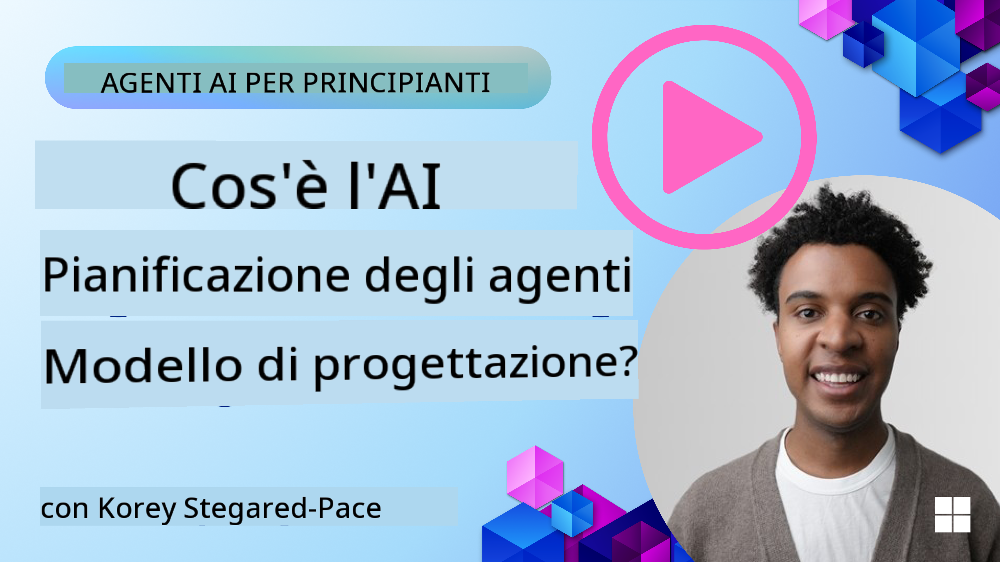
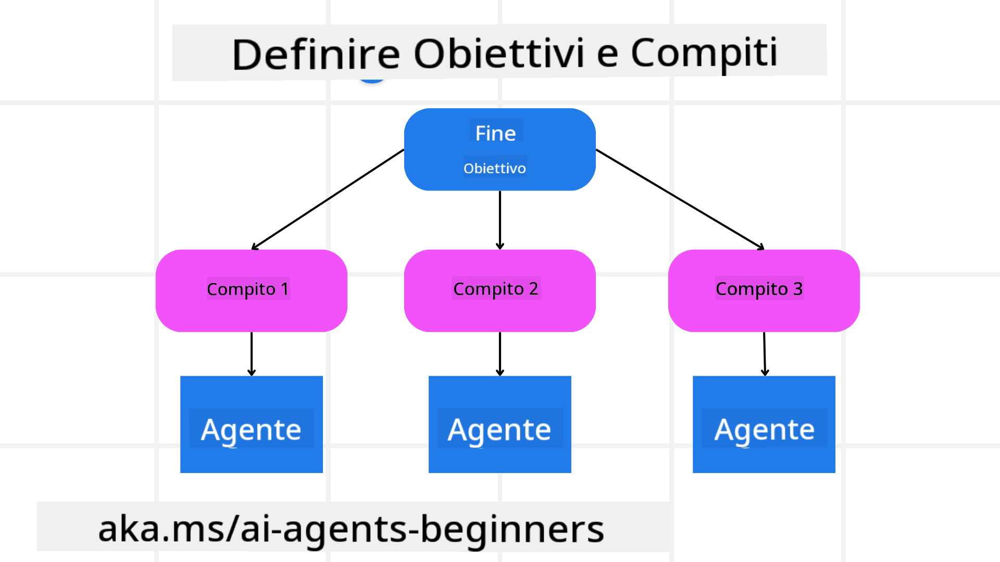

<!--
CO_OP_TRANSLATOR_METADATA:
{
  "original_hash": "a28d30590704ea13b6a08d4793cf9c2b",
  "translation_date": "2025-08-29T13:04:42+00:00",
  "source_file": "07-planning-design/README.md",
  "language_code": "it"
}
-->
[](https://youtu.be/kPfJ2BrBCMY?si=9pYpPXp0sSbK91Dr)

> _(Clicca sull'immagine sopra per vedere il video di questa lezione)_

# Pianificazione del Design

## Introduzione

Questa lezione coprirà:

* Definire un obiettivo generale chiaro e suddividere un compito complesso in attività gestibili.
* Utilizzare output strutturati per risposte più affidabili e leggibili dalle macchine.
* Applicare un approccio basato sugli eventi per gestire attività dinamiche e input imprevisti.

## Obiettivi di Apprendimento

Dopo aver completato questa lezione, avrai una comprensione di:

* Identificare e impostare un obiettivo generale per un agente AI, assicurandosi che sappia chiaramente cosa deve essere raggiunto.
* Scomporre un compito complesso in sotto-attività gestibili e organizzarle in una sequenza logica.
* Dotare gli agenti degli strumenti giusti (ad esempio, strumenti di ricerca o di analisi dei dati), decidere quando e come utilizzarli e gestire situazioni impreviste.
* Valutare i risultati delle sotto-attività, misurare le prestazioni e iterare sulle azioni per migliorare il risultato finale.

## Definire l'Obiettivo Generale e Suddividere un Compito



La maggior parte dei compiti del mondo reale è troppo complessa per essere affrontata in un unico passaggio. Un agente AI ha bisogno di un obiettivo conciso per guidare la sua pianificazione e le sue azioni. Ad esempio, considera l'obiettivo:

    "Generare un itinerario di viaggio di 3 giorni."

Sebbene sia semplice da enunciare, necessita comunque di essere affinato. Più chiaro è l'obiettivo, meglio l'agente (e qualsiasi collaboratore umano) può concentrarsi sul raggiungimento del risultato corretto, come creare un itinerario completo con opzioni di volo, raccomandazioni per hotel e suggerimenti per attività.

### Scomposizione del Compito

I compiti grandi o intricati diventano più gestibili quando vengono suddivisi in sotto-attività orientate agli obiettivi. 
Per l'esempio dell'itinerario di viaggio, potresti scomporre l'obiettivo in:

* Prenotazione Voli
* Prenotazione Hotel
* Noleggio Auto
* Personalizzazione

Ogni sotto-attività può essere affrontata da agenti o processi dedicati. Un agente potrebbe specializzarsi nella ricerca delle migliori offerte sui voli, un altro concentrarsi sulle prenotazioni di hotel, e così via. Un agente coordinatore o "a valle" può quindi compilare questi risultati in un unico itinerario coeso per l'utente finale.

Questo approccio modulare consente anche miglioramenti incrementali. Ad esempio, potresti aggiungere agenti specializzati per raccomandazioni culinarie o suggerimenti per attività locali e affinare l'itinerario nel tempo.

### Output Strutturato

I modelli di linguaggio di grandi dimensioni (LLM) possono generare output strutturati (ad esempio JSON) che sono più facili da analizzare e processare per agenti o servizi a valle. Questo è particolarmente utile in un contesto multi-agente, dove possiamo agire su questi compiti dopo che l'output della pianificazione è stato ricevuto. Per una panoramica rapida, consulta il seguente snippet di codice Python che dimostra un semplice agente di pianificazione che scompone un obiettivo in sotto-attività e genera un piano strutturato:

```python
from pydantic import BaseModel
from enum import Enum
from typing import List, Optional, Union
import json
import os
from typing import Optional
from pprint import pprint
from autogen_core.models import UserMessage, SystemMessage, AssistantMessage
from autogen_ext.models.azure import AzureAIChatCompletionClient
from azure.core.credentials import AzureKeyCredential

class AgentEnum(str, Enum):
    FlightBooking = "flight_booking"
    HotelBooking = "hotel_booking"
    CarRental = "car_rental"
    ActivitiesBooking = "activities_booking"
    DestinationInfo = "destination_info"
    DefaultAgent = "default_agent"
    GroupChatManager = "group_chat_manager"

# Travel SubTask Model
class TravelSubTask(BaseModel):
    task_details: str
    assigned_agent: AgentEnum  # we want to assign the task to the agent

class TravelPlan(BaseModel):
    main_task: str
    subtasks: List[TravelSubTask]
    is_greeting: bool

client = AzureAIChatCompletionClient(
    model="gpt-4o-mini",
    endpoint="https://models.inference.ai.azure.com",
    # To authenticate with the model you will need to generate a personal access token (PAT) in your GitHub settings.
    # Create your PAT token by following instructions here: https://docs.github.com/en/authentication/keeping-your-account-and-data-secure/managing-your-personal-access-tokens
    credential=AzureKeyCredential(os.environ["GITHUB_TOKEN"]),
    model_info={
        "json_output": False,
        "function_calling": True,
        "vision": True,
        "family": "unknown",
    },
)

# Define the user message
messages = [
    SystemMessage(content="""You are an planner agent.
    Your job is to decide which agents to run based on the user's request.
                      Provide your response in JSON format with the following structure:
{'main_task': 'Plan a family trip from Singapore to Melbourne.',
 'subtasks': [{'assigned_agent': 'flight_booking',
               'task_details': 'Book round-trip flights from Singapore to '
                               'Melbourne.'}
    Below are the available agents specialised in different tasks:
    - FlightBooking: For booking flights and providing flight information
    - HotelBooking: For booking hotels and providing hotel information
    - CarRental: For booking cars and providing car rental information
    - ActivitiesBooking: For booking activities and providing activity information
    - DestinationInfo: For providing information about destinations
    - DefaultAgent: For handling general requests""", source="system"),
    UserMessage(
        content="Create a travel plan for a family of 2 kids from Singapore to Melboune", source="user"),
]

response = await client.create(messages=messages, extra_create_args={"response_format": 'json_object'})

response_content: Optional[str] = response.content if isinstance(
    response.content, str) else None
if response_content is None:
    raise ValueError("Response content is not a valid JSON string" )

pprint(json.loads(response_content))

# # Ensure the response content is a valid JSON string before loading it
# response_content: Optional[str] = response.content if isinstance(
#     response.content, str) else None
# if response_content is None:
#     raise ValueError("Response content is not a valid JSON string")

# # Print the response content after loading it as JSON
# pprint(json.loads(response_content))

# Validate the response content with the MathReasoning model
# TravelPlan.model_validate(json.loads(response_content))
```

### Agente di Pianificazione con Orchestrazione Multi-Agente

In questo esempio, un Semantic Router Agent riceve una richiesta dell'utente (ad esempio, "Ho bisogno di un piano per un hotel per il mio viaggio.").

Il pianificatore quindi:

* Riceve il Piano Hotel: Il pianificatore prende il messaggio dell'utente e, basandosi su un prompt di sistema (inclusi i dettagli degli agenti disponibili), genera un piano di viaggio strutturato.
* Elenca gli Agenti e i loro Strumenti: Il registro degli agenti contiene un elenco di agenti (ad esempio, per voli, hotel, noleggio auto e attività) insieme alle funzioni o agli strumenti che offrono.
* Instrada il Piano agli Agenti Rispettivi: A seconda del numero di sotto-attività, il pianificatore invia il messaggio direttamente a un agente dedicato (per scenari a singolo compito) o coordina tramite un gestore di chat di gruppo per la collaborazione multi-agente.
* Riassume il Risultato: Infine, il pianificatore riassume il piano generato per chiarezza.

Il seguente esempio di codice Python illustra questi passaggi:

```python

from pydantic import BaseModel

from enum import Enum
from typing import List, Optional, Union

class AgentEnum(str, Enum):
    FlightBooking = "flight_booking"
    HotelBooking = "hotel_booking"
    CarRental = "car_rental"
    ActivitiesBooking = "activities_booking"
    DestinationInfo = "destination_info"
    DefaultAgent = "default_agent"
    GroupChatManager = "group_chat_manager"

# Travel SubTask Model

class TravelSubTask(BaseModel):
    task_details: str
    assigned_agent: AgentEnum # we want to assign the task to the agent

class TravelPlan(BaseModel):
    main_task: str
    subtasks: List[TravelSubTask]
    is_greeting: bool
import json
import os
from typing import Optional

from autogen_core.models import UserMessage, SystemMessage, AssistantMessage
from autogen_ext.models.openai import AzureOpenAIChatCompletionClient

# Create the client with type-checked environment variables

client = AzureOpenAIChatCompletionClient(
    azure_deployment=os.getenv("AZURE_OPENAI_DEPLOYMENT_NAME"),
    model=os.getenv("AZURE_OPENAI_DEPLOYMENT_NAME"),
    api_version=os.getenv("AZURE_OPENAI_API_VERSION"),
    azure_endpoint=os.getenv("AZURE_OPENAI_ENDPOINT"),
    api_key=os.getenv("AZURE_OPENAI_API_KEY"),
)

from pprint import pprint

# Define the user message

messages = [
    SystemMessage(content="""You are an planner agent.
    Your job is to decide which agents to run based on the user's request.
    Below are the available agents specialized in different tasks:
    - FlightBooking: For booking flights and providing flight information
    - HotelBooking: For booking hotels and providing hotel information
    - CarRental: For booking cars and providing car rental information
    - ActivitiesBooking: For booking activities and providing activity information
    - DestinationInfo: For providing information about destinations
    - DefaultAgent: For handling general requests""", source="system"),
    UserMessage(content="Create a travel plan for a family of 2 kids from Singapore to Melbourne", source="user"),
]

response = await client.create(messages=messages, extra_create_args={"response_format": TravelPlan})

# Ensure the response content is a valid JSON string before loading it

response_content: Optional[str] = response.content if isinstance(response.content, str) else None
if response_content is None:
    raise ValueError("Response content is not a valid JSON string")

# Print the response content after loading it as JSON

pprint(json.loads(response_content))
```

Segue l'output del codice precedente e puoi quindi utilizzare questo output strutturato per instradare a `assigned_agent` e riassumere il piano di viaggio per l'utente finale.

```json
{
    "is_greeting": "False",
    "main_task": "Plan a family trip from Singapore to Melbourne.",
    "subtasks": [
        {
            "assigned_agent": "flight_booking",
            "task_details": "Book round-trip flights from Singapore to Melbourne."
        },
        {
            "assigned_agent": "hotel_booking",
            "task_details": "Find family-friendly hotels in Melbourne."
        },
        {
            "assigned_agent": "car_rental",
            "task_details": "Arrange a car rental suitable for a family of four in Melbourne."
        },
        {
            "assigned_agent": "activities_booking",
            "task_details": "List family-friendly activities in Melbourne."
        },
        {
            "assigned_agent": "destination_info",
            "task_details": "Provide information about Melbourne as a travel destination."
        }
    ]
}
```

Un notebook di esempio con il codice precedente è disponibile [qui](07-autogen.ipynb).

### Pianificazione Iterativa

Alcuni compiti richiedono un processo iterativo o di ripianificazione, dove il risultato di una sotto-attività influenza la successiva. Ad esempio, se l'agente scopre un formato di dati imprevisto durante la prenotazione dei voli, potrebbe dover adattare la sua strategia prima di passare alle prenotazioni degli hotel.

Inoltre, il feedback dell'utente (ad esempio, un umano che decide di preferire un volo anticipato) può innescare una ripianificazione parziale. Questo approccio dinamico e iterativo garantisce che la soluzione finale sia in linea con i vincoli del mondo reale e le preferenze in evoluzione dell'utente.

Ad esempio, codice di esempio:

```python
from autogen_core.models import UserMessage, SystemMessage, AssistantMessage
#.. same as previous code and pass on the user history, current plan
messages = [
    SystemMessage(content="""You are a planner agent to optimize the
    Your job is to decide which agents to run based on the user's request.
    Below are the available agents specialized in different tasks:
    - FlightBooking: For booking flights and providing flight information
    - HotelBooking: For booking hotels and providing hotel information
    - CarRental: For booking cars and providing car rental information
    - ActivitiesBooking: For booking activities and providing activity information
    - DestinationInfo: For providing information about destinations
    - DefaultAgent: For handling general requests""", source="system"),
    UserMessage(content="Create a travel plan for a family of 2 kids from Singapore to Melbourne", source="user"),
    AssistantMessage(content=f"Previous travel plan - {TravelPlan}", source="assistant")
]
# .. re-plan and send the tasks to respective agents
```

Per una pianificazione più completa, consulta Magnetic One per risolvere compiti complessi.

## Riepilogo

In questo articolo abbiamo esaminato un esempio di come possiamo creare un pianificatore che selezioni dinamicamente gli agenti disponibili definiti. L'output del Pianificatore scompone i compiti e assegna gli agenti affinché possano essere eseguiti. Si presume che gli agenti abbiano accesso alle funzioni/strumenti necessari per svolgere il compito. Oltre agli agenti, puoi includere altri pattern come riflessione, riassunto e chat round robin per personalizzare ulteriormente.

## Risorse Aggiuntive

* AutoGen Magnetic One - Un sistema multi-agente generalista per risolvere compiti complessi che ha ottenuto risultati impressionanti su molteplici benchmark agentici impegnativi. Riferimento: . In questa implementazione l'orchestratore crea un piano specifico per il compito e delega questi compiti agli agenti disponibili. Oltre alla pianificazione, l'orchestratore impiega anche un meccanismo di monitoraggio per controllare il progresso del compito e ripianificare se necessario.

### Hai altre domande sul Design Pattern di Pianificazione?

Unisciti al [Discord di Azure AI Foundry](https://aka.ms/ai-agents/discord) per incontrare altri studenti, partecipare a ore di ufficio e ottenere risposte alle tue domande sugli AI Agents.

## Lezione Precedente

[Costruire Agenti AI Affidabili](../06-building-trustworthy-agents/README.md)

## Prossima Lezione

[Design Pattern Multi-Agente](../08-multi-agent/README.md)

---

**Disclaimer**:  
Questo documento è stato tradotto utilizzando il servizio di traduzione automatica [Co-op Translator](https://github.com/Azure/co-op-translator). Sebbene ci impegniamo per garantire l'accuratezza, si prega di notare che le traduzioni automatiche possono contenere errori o imprecisioni. Il documento originale nella sua lingua nativa deve essere considerato la fonte autorevole. Per informazioni critiche, si consiglia una traduzione professionale eseguita da un traduttore umano. Non siamo responsabili per eventuali fraintendimenti o interpretazioni errate derivanti dall'uso di questa traduzione.