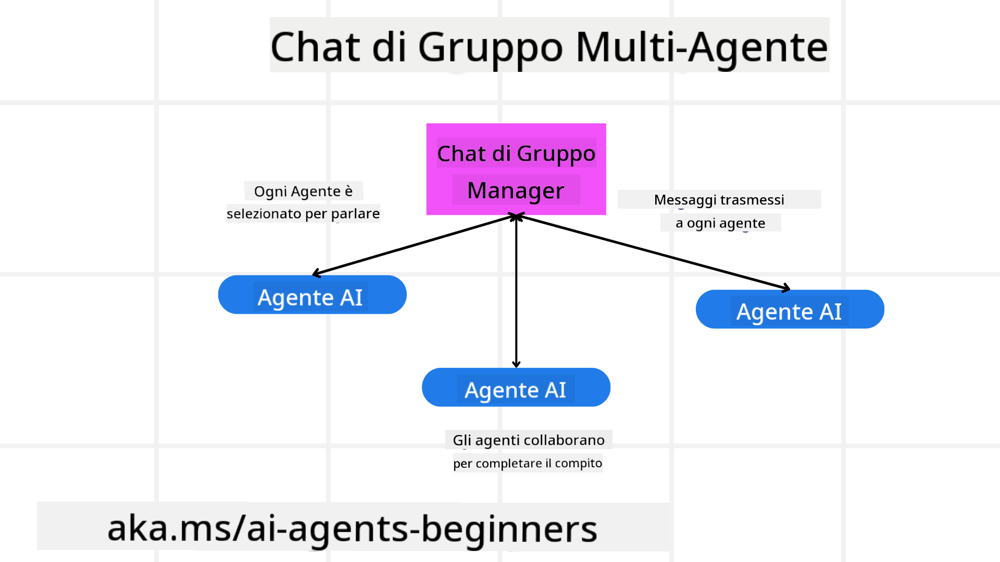
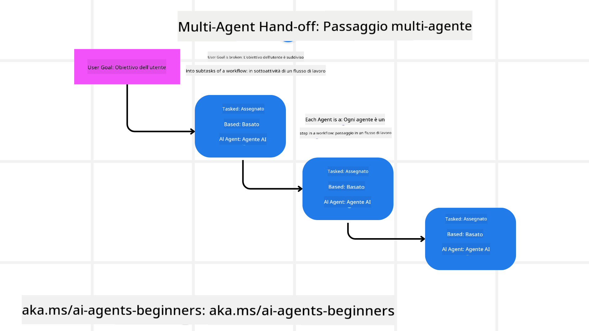
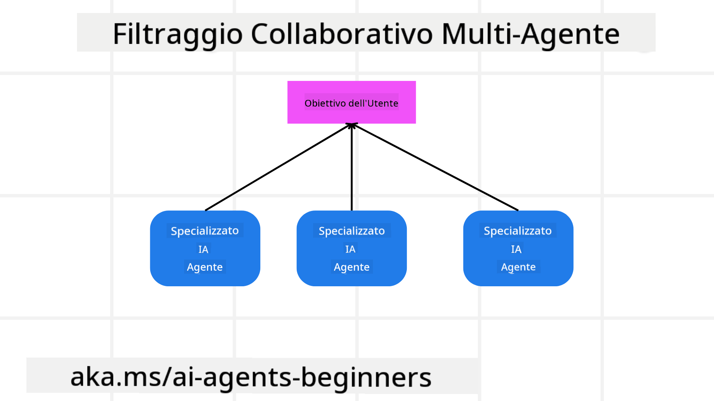

<!--
CO_OP_TRANSLATOR_METADATA:
{
  "original_hash": "c692a8975d7d5b99575a553de1c5e8a7",
  "translation_date": "2025-07-12T11:07:45+00:00",
  "source_file": "08-multi-agent/README.md",
  "language_code": "it"
}
-->

> _(Clicca sull'immagine sopra per vedere il video di questa lezione)_

# Pattern di progettazione multi-agente

Non appena inizi a lavorare a un progetto che coinvolge più agenti, dovrai considerare il pattern di progettazione multi-agente. Tuttavia, potrebbe non essere subito chiaro quando passare a un sistema multi-agente e quali siano i vantaggi.

## Introduzione

In questa lezione cercheremo di rispondere alle seguenti domande:

- In quali scenari è applicabile l’uso di più agenti?
- Quali sono i vantaggi di usare più agenti rispetto a un singolo agente che svolge più compiti?
- Quali sono i componenti fondamentali per implementare il pattern di progettazione multi-agente?
- Come possiamo avere visibilità su come i vari agenti interagiscono tra loro?

## Obiettivi di apprendimento

Al termine di questa lezione dovresti essere in grado di:

- Identificare gli scenari in cui è opportuno usare più agenti
- Riconoscere i vantaggi dell’uso di più agenti rispetto a un agente singolo
- Comprendere i componenti fondamentali per implementare il pattern di progettazione multi-agente

Qual è il quadro generale?

*I multi-agenti sono un pattern di progettazione che permette a più agenti di lavorare insieme per raggiungere un obiettivo comune*.

Questo pattern è ampiamente utilizzato in diversi ambiti, tra cui robotica, sistemi autonomi e calcolo distribuito.

## Scenari in cui i multi-agenti sono applicabili

Quali sono quindi gli scenari in cui è utile usare più agenti? La risposta è che ci sono molti casi in cui impiegare più agenti è vantaggioso, specialmente nei seguenti casi:

- **Carichi di lavoro elevati**: I carichi di lavoro grandi possono essere suddivisi in compiti più piccoli e assegnati a diversi agenti, permettendo l’elaborazione parallela e un completamento più rapido. Un esempio è un grande compito di elaborazione dati.
- **Compiti complessi**: Come per i carichi di lavoro elevati, i compiti complessi possono essere suddivisi in sotto-compiti assegnati a diversi agenti, ognuno specializzato in un aspetto specifico. Un buon esempio è nei veicoli autonomi, dove agenti diversi gestiscono la navigazione, il rilevamento degli ostacoli e la comunicazione con altri veicoli.
- **Competenze diverse**: Agenti diversi possono avere competenze differenti, permettendo loro di gestire aspetti diversi di un compito in modo più efficace rispetto a un singolo agente. Un esempio è nel settore sanitario, dove agenti possono occuparsi di diagnostica, piani di trattamento e monitoraggio del paziente.

## Vantaggi dell’uso di più agenti rispetto a un agente singolo

Un sistema con un solo agente può funzionare bene per compiti semplici, ma per compiti più complessi l’uso di più agenti offre diversi vantaggi:

- **Specializzazione**: Ogni agente può essere specializzato in un compito specifico. La mancanza di specializzazione in un singolo agente significa avere un agente che può fare tutto ma che potrebbe confondersi di fronte a compiti complessi, magari svolgendo un compito per cui non è il più adatto.
- **Scalabilità**: È più facile scalare un sistema aggiungendo agenti piuttosto che sovraccaricare un singolo agente.
- **Tolleranza ai guasti**: Se un agente fallisce, gli altri possono continuare a funzionare, garantendo l’affidabilità del sistema.

Facciamo un esempio: prenotiamo un viaggio per un utente. Un sistema con un solo agente dovrebbe gestire tutti gli aspetti della prenotazione, dalla ricerca dei voli alla prenotazione di hotel e auto a noleggio. Per farlo, l’agente dovrebbe avere strumenti per gestire tutti questi compiti, portando a un sistema complesso e monolitico, difficile da mantenere e scalare. Un sistema multi-agente, invece, potrebbe avere agenti diversi specializzati nella ricerca voli, nella prenotazione hotel e auto a noleggio. Questo renderebbe il sistema più modulare, facile da mantenere e scalabile.

Confronta questo con un’agenzia di viaggi gestita da una piccola impresa familiare rispetto a una gestita come franchising. La piccola impresa avrebbe un solo agente che gestisce tutti gli aspetti della prenotazione, mentre il franchising avrebbe agenti diversi per ogni aspetto.

## Componenti fondamentali per implementare il pattern di progettazione multi-agente

Prima di poter implementare il pattern multi-agente, devi comprendere i componenti che lo costituiscono.

Rendiamo il tutto più concreto riprendendo l’esempio della prenotazione di un viaggio per un utente. In questo caso, i componenti fondamentali includono:

- **Comunicazione tra agenti**: Gli agenti per la ricerca voli, la prenotazione hotel e auto a noleggio devono comunicare e condividere informazioni sulle preferenze e vincoli dell’utente. Devi decidere i protocolli e i metodi per questa comunicazione. In pratica, l’agente per la ricerca voli deve comunicare con quello per la prenotazione hotel per assicurarsi che l’hotel sia prenotato per le stesse date del volo. Ciò significa che gli agenti devono condividere informazioni sulle date di viaggio dell’utente, quindi devi decidere *quali agenti condividono informazioni e come lo fanno*.
- **Meccanismi di coordinamento**: Gli agenti devono coordinare le loro azioni per rispettare le preferenze e i vincoli dell’utente. Ad esempio, una preferenza potrebbe essere un hotel vicino all’aeroporto, mentre un vincolo potrebbe essere che le auto a noleggio sono disponibili solo in aeroporto. L’agente per la prenotazione hotel deve coordinarsi con quello per la prenotazione auto per rispettare queste condizioni. Devi quindi decidere *come gli agenti coordinano le loro azioni*.
- **Architettura degli agenti**: Gli agenti devono avere una struttura interna che permetta loro di prendere decisioni e imparare dalle interazioni con l’utente. Ad esempio, l’agente per la ricerca voli deve poter decidere quali voli consigliare all’utente. Devi decidere *come gli agenti prendono decisioni e apprendono dalle interazioni con l’utente*. Un esempio potrebbe essere che l’agente per la ricerca voli utilizzi un modello di machine learning per consigliare voli basandosi sulle preferenze passate dell’utente.
- **Visibilità sulle interazioni multi-agente**: Devi avere visibilità su come i vari agenti interagiscono tra loro. Ciò richiede strumenti e tecniche per tracciare le attività e le interazioni degli agenti, come strumenti di logging e monitoraggio, visualizzazioni e metriche di performance.
- **Pattern multi-agente**: Esistono diversi pattern per implementare sistemi multi-agente, come architetture centralizzate, decentralizzate e ibride. Devi scegliere il pattern più adatto al tuo caso d’uso.
- **Intervento umano**: Nella maggior parte dei casi, ci sarà un intervento umano e devi istruire gli agenti su quando richiedere l’intervento umano. Ad esempio, un utente potrebbe chiedere un hotel o un volo specifico non raccomandato dagli agenti, o chiedere una conferma prima di prenotare.

## Visibilità sulle interazioni multi-agente

È importante avere visibilità su come i vari agenti interagiscono tra loro. Questa visibilità è essenziale per il debug, l’ottimizzazione e per garantire l’efficacia complessiva del sistema. Per ottenerla, servono strumenti e tecniche per tracciare le attività e le interazioni degli agenti, come strumenti di logging e monitoraggio, visualizzazioni e metriche di performance.

Ad esempio, nel caso della prenotazione di un viaggio, potresti avere una dashboard che mostra lo stato di ogni agente, le preferenze e i vincoli dell’utente e le interazioni tra agenti. Questa dashboard potrebbe mostrare le date di viaggio dell’utente, i voli consigliati dall’agente voli, gli hotel consigliati dall’agente hotel e le auto a noleggio consigliate dall’agente auto. Questo ti darebbe una visione chiara di come gli agenti interagiscono e se le preferenze e i vincoli dell’utente sono rispettati.

Vediamo più nel dettaglio questi aspetti.

- **Strumenti di logging e monitoraggio**: Vuoi registrare ogni azione compiuta da un agente. Una voce di log potrebbe contenere informazioni sull’agente che ha compiuto l’azione, l’azione stessa, l’ora in cui è stata compiuta e il risultato. Queste informazioni possono essere usate per il debug, l’ottimizzazione e altro.
- **Strumenti di visualizzazione**: Gli strumenti di visualizzazione aiutano a vedere le interazioni tra agenti in modo più intuitivo. Ad esempio, potresti avere un grafo che mostra il flusso di informazioni tra agenti. Questo può aiutarti a identificare colli di bottiglia, inefficienze e altri problemi nel sistema.
- **Metriche di performance**: Le metriche di performance aiutano a monitorare l’efficacia del sistema multi-agente. Ad esempio, potresti misurare il tempo necessario per completare un compito, il numero di compiti completati per unità di tempo e l’accuratezza delle raccomandazioni fatte dagli agenti. Queste informazioni aiutano a individuare aree di miglioramento e ottimizzare il sistema.

## Pattern multi-agente

Esploriamo alcuni pattern concreti che possiamo usare per creare applicazioni multi-agente. Ecco alcuni pattern interessanti da considerare:

### Chat di gruppo

Questo pattern è utile quando vuoi creare un’applicazione di chat di gruppo in cui più agenti possono comunicare tra loro. Gli usi tipici includono collaborazione di team, supporto clienti e social networking.

In questo pattern, ogni agente rappresenta un utente nella chat di gruppo e i messaggi vengono scambiati tra agenti usando un protocollo di messaggistica. Gli agenti possono inviare messaggi al gruppo, ricevere messaggi dal gruppo e rispondere ai messaggi degli altri agenti.

Questo pattern può essere implementato con un’architettura centralizzata, dove tutti i messaggi passano attraverso un server centrale, oppure con un’architettura decentralizzata, dove i messaggi vengono scambiati direttamente.

### Passaggio di consegne (Hand-off)

Questo pattern è utile quando vuoi creare un’applicazione in cui più agenti possono passarsi compiti a vicenda.

Gli usi tipici includono supporto clienti, gestione dei compiti e automazione dei flussi di lavoro.

In questo pattern, ogni agente rappresenta un compito o una fase di un flusso di lavoro, e gli agenti possono passarsi i compiti ad altri agenti in base a regole predefinite.

### Filtraggio collaborativo

Questo pattern è utile quando vuoi creare un’applicazione in cui più agenti collaborano per fare raccomandazioni agli utenti.

Il motivo per cui più agenti collaborano è che ognuno può avere competenze diverse e contribuire al processo di raccomandazione in modi differenti.

Facciamo un esempio: un utente vuole una raccomandazione sul miglior titolo azionario da comprare.

- **Esperto di settore**: Un agente potrebbe essere esperto in un settore specifico.
- **Analisi tecnica**: Un altro agente potrebbe essere esperto in analisi tecnica.
- **Analisi fondamentale**: Un altro ancora potrebbe essere esperto in analisi fondamentale. Collaborando, questi agenti possono fornire una raccomandazione più completa all’utente.

## Scenario: processo di rimborso

Considera uno scenario in cui un cliente cerca di ottenere un rimborso per un prodotto; possono essere coinvolti diversi agenti, ma dividiamoli tra agenti specifici per questo processo e agenti generali utilizzabili in altri processi.

**Agenti specifici per il processo di rimborso**:

Ecco alcuni agenti che potrebbero essere coinvolti nel processo di rimborso:

- **Agente cliente**: Rappresenta il cliente ed è responsabile di avviare il processo di rimborso.
- **Agente venditore**: Rappresenta il venditore ed è responsabile di gestire il rimborso.
- **Agente pagamento**: Rappresenta il processo di pagamento ed è responsabile di rimborsare il pagamento al cliente.
- **Agente risoluzione**: Rappresenta il processo di risoluzione e si occupa di risolvere eventuali problemi che sorgono durante il rimborso.
- **Agente conformità**: Rappresenta il processo di conformità e garantisce che il processo di rimborso rispetti regolamenti e politiche.

**Agenti generali**:

Questi agenti possono essere usati in altre parti del tuo business.

- **Agente spedizione**: Rappresenta il processo di spedizione ed è responsabile di spedire il prodotto indietro al venditore. Può essere usato sia per il rimborso che per la spedizione generale di un prodotto acquistato.
- **Agente feedback**: Rappresenta il processo di raccolta feedback dal cliente. Il feedback può essere raccolto in qualsiasi momento, non solo durante il rimborso.
- **Agente escalation**: Rappresenta il processo di escalation e si occupa di portare i problemi a un livello superiore di supporto. Puoi usare questo agente per qualsiasi processo che richieda un’escalation.
- **Agente notifiche**: Rappresenta il processo di invio notifiche al cliente nelle varie fasi del rimborso.
- **Agente analisi**: Rappresenta il processo di analisi dei dati relativi al rimborso.
- **Agente audit**: Rappresenta il processo di verifica per assicurare che il rimborso venga eseguito correttamente.
- **Agente report**: Rappresenta il processo di generazione di report sul processo di rimborso.
- **Agente conoscenza**: Rappresenta il processo di gestione di una base di conoscenza relativa al rimborso. Questo agente potrebbe essere esperto sia di rimborsi che di altre aree del business.
- **Agente sicurezza**: Rappresenta il processo di sicurezza e garantisce la sicurezza del processo di rimborso.
- **Agente qualità**: Rappresenta il processo di controllo qualità e garantisce la qualità del processo di rimborso.

Ci sono molti agenti elencati, sia specifici per il processo di rimborso che generali utilizzabili in altre parti del business. Speriamo che questo ti dia un’idea di come decidere quali agenti usare nel tuo sistema multi-agente.

## Compito
## Lezione precedente

[Progettazione della pianificazione](../07-planning-design/README.md)

## Lezione successiva

[Metacognizione negli agenti AI](../09-metacognition/README.md)

**Disclaimer**:  
Questo documento è stato tradotto utilizzando il servizio di traduzione automatica [Co-op Translator](https://github.com/Azure/co-op-translator). Pur impegnandoci per garantire l’accuratezza, si prega di notare che le traduzioni automatiche possono contenere errori o imprecisioni. Il documento originale nella sua lingua nativa deve essere considerato la fonte autorevole. Per informazioni critiche, si raccomanda una traduzione professionale effettuata da un umano. Non ci assumiamo alcuna responsabilità per eventuali malintesi o interpretazioni errate derivanti dall’uso di questa traduzione.