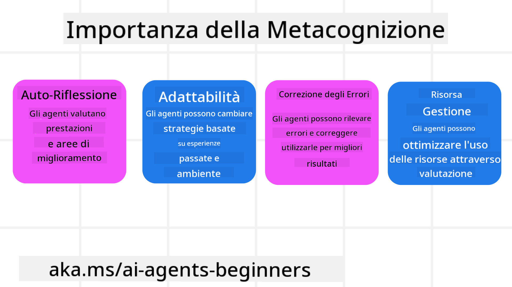
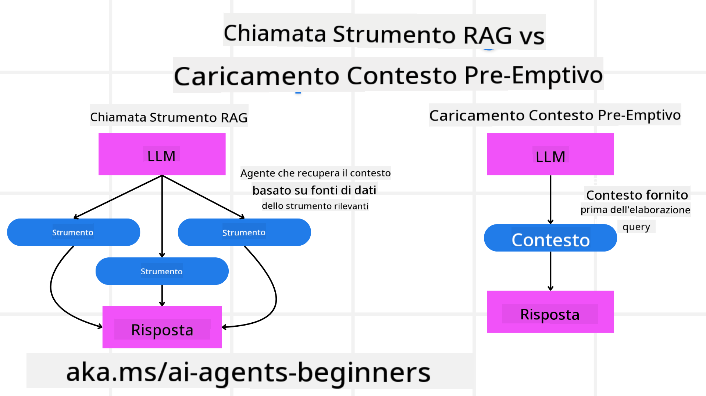

<!--
CO_OP_TRANSLATOR_METADATA:
{
  "original_hash": "8cbf460468c802c7994aa62e0e0779c9",
  "translation_date": "2025-07-12T12:29:56+00:00",
  "source_file": "09-metacognition/README.md",
  "language_code": "it"
}
-->
[](https://youtu.be/His9R6gw6Ec?si=3_RMb8VprNvdLRhX)

> _(Clicca sull'immagine sopra per vedere il video di questa lezione)_
# Metacognizione negli Agenti AI

## Introduzione

Benvenuto alla lezione sulla metacognizione negli agenti AI! Questo capitolo è pensato per principianti curiosi di capire come gli agenti AI possano riflettere sui propri processi di pensiero. Alla fine di questa lezione, comprenderai i concetti chiave e avrai esempi pratici per applicare la metacognizione nella progettazione di agenti AI.

## Obiettivi di Apprendimento

Al termine di questa lezione, sarai in grado di:

1. Comprendere le implicazioni dei cicli di ragionamento nelle definizioni degli agenti.
2. Utilizzare tecniche di pianificazione e valutazione per aiutare agenti auto-correggenti.
3. Creare i tuoi agenti capaci di manipolare codice per portare a termine compiti.

## Introduzione alla Metacognizione

La metacognizione si riferisce ai processi cognitivi di ordine superiore che implicano il pensare al proprio pensiero. Per gli agenti AI, significa essere in grado di valutare e adattare le proprie azioni basandosi sulla consapevolezza di sé e sulle esperienze passate. La metacognizione, o "pensare al pensare", è un concetto importante nello sviluppo di sistemi AI agentici. Coinvolge sistemi AI consapevoli dei propri processi interni e capaci di monitorare, regolare e adattare il proprio comportamento di conseguenza. Proprio come facciamo noi quando "leggiamo la stanza" o analizziamo un problema. Questa consapevolezza di sé può aiutare i sistemi AI a prendere decisioni migliori, identificare errori e migliorare le prestazioni nel tempo — tornando al test di Turing e al dibattito su se l’AI prenderà il sopravvento.

Nel contesto dei sistemi AI agentici, la metacognizione può aiutare a risolvere diverse sfide, come:
- Trasparenza: Garantire che i sistemi AI possano spiegare il loro ragionamento e le decisioni.
- Ragionamento: Migliorare la capacità dei sistemi AI di sintetizzare informazioni e prendere decisioni solide.
- Adattamento: Permettere ai sistemi AI di adeguarsi a nuovi ambienti e condizioni mutevoli.
- Percezione: Migliorare l’accuratezza dei sistemi AI nel riconoscere e interpretare i dati dall’ambiente.

### Cos’è la Metacognizione?

La metacognizione, o "pensare al pensare", è un processo cognitivo di ordine superiore che implica consapevolezza e autoregolazione dei propri processi cognitivi. Nel campo dell’AI, la metacognizione permette agli agenti di valutare e adattare le proprie strategie e azioni, portando a migliori capacità di problem solving e decision making. Comprendendo la metacognizione, puoi progettare agenti AI non solo più intelligenti, ma anche più adattabili ed efficienti. In una vera metacognizione, vedresti l’AI ragionare esplicitamente sul proprio ragionamento.

Esempio: “Ho dato priorità ai voli più economici perché… potrei perdere i voli diretti, quindi ricontrollo.”  
Tenere traccia di come o perché ha scelto un certo percorso.  
- Notare di aver commesso errori perché si è affidata troppo alle preferenze dell’utente dell’ultima volta, quindi modifica la strategia decisionale e non solo la raccomandazione finale.  
- Diagnosticare schemi come: “Ogni volta che vedo l’utente menzionare ‘troppo affollato’, non dovrei solo rimuovere certe attrazioni, ma anche riflettere che il mio metodo di selezione delle ‘attrazioni principali’ è sbagliato se ordino sempre per popolarità.”

### Importanza della Metacognizione negli Agenti AI

La metacognizione gioca un ruolo cruciale nella progettazione degli agenti AI per diversi motivi:



- Autoriflessione: Gli agenti possono valutare le proprie prestazioni e individuare aree di miglioramento.
- Adattabilità: Gli agenti possono modificare le proprie strategie basandosi su esperienze passate e ambienti in evoluzione.
- Correzione degli errori: Gli agenti possono rilevare e correggere autonomamente gli errori, ottenendo risultati più precisi.
- Gestione delle risorse: Gli agenti possono ottimizzare l’uso delle risorse, come tempo e potenza computazionale, pianificando e valutando le proprie azioni.

## Componenti di un Agente AI

Prima di addentrarci nei processi metacognitivi, è essenziale comprendere i componenti base di un agente AI. Un agente AI tipicamente è composto da:

- Persona: La personalità e le caratteristiche dell’agente, che definiscono come interagisce con gli utenti.
- Strumenti: Le capacità e le funzioni che l’agente può svolgere.
- Competenze: La conoscenza e l’esperienza che l’agente possiede.

Questi componenti lavorano insieme per creare un’"unità di competenza" in grado di svolgere compiti specifici.

**Esempio**:  
Considera un agente di viaggio, un servizio che non solo pianifica la tua vacanza ma adatta il percorso basandosi su dati in tempo reale e sulle esperienze di viaggio passate dei clienti.

### Esempio: Metacognizione in un Servizio di Agenzia di Viaggi

Immagina di progettare un servizio di agenzia di viaggi alimentato da AI. Questo agente, "Travel Agent", aiuta gli utenti a pianificare le loro vacanze. Per incorporare la metacognizione, Travel Agent deve valutare e adattare le proprie azioni basandosi sulla consapevolezza di sé e sulle esperienze passate. Ecco come la metacognizione potrebbe intervenire:

#### Compito Attuale

Il compito attuale è aiutare un utente a pianificare un viaggio a Parigi.

#### Passi per Completare il Compito

1. **Raccogliere le Preferenze dell’Utente**: Chiedere all’utente le date di viaggio, il budget, gli interessi (es. musei, cucina, shopping) e eventuali esigenze specifiche.
2. **Recuperare Informazioni**: Cercare opzioni di voli, alloggi, attrazioni e ristoranti che corrispondano alle preferenze dell’utente.
3. **Generare Raccomandazioni**: Fornire un itinerario personalizzato con dettagli su voli, prenotazioni alberghiere e attività suggerite.
4. **Adattare in Base al Feedback**: Chiedere all’utente un riscontro sulle raccomandazioni e apportare le modifiche necessarie.

#### Risorse Necessarie

- Accesso a database di voli e prenotazioni alberghiere.
- Informazioni su attrazioni e ristoranti parigini.
- Dati di feedback degli utenti da interazioni precedenti.

#### Esperienza e Autoriflessione

Travel Agent usa la metacognizione per valutare le proprie prestazioni e imparare dalle esperienze passate. Per esempio:

1. **Analisi del Feedback Utente**: Travel Agent esamina il feedback per capire quali raccomandazioni sono state apprezzate e quali no, adattando le proposte future di conseguenza.
2. **Adattabilità**: Se un utente ha espresso in passato una preferenza per evitare luoghi affollati, Travel Agent eviterà di consigliare attrazioni turistiche molto frequentate nelle ore di punta.
3. **Correzione degli Errori**: Se Travel Agent ha commesso un errore in una prenotazione precedente, come suggerire un hotel già al completo, impara a controllare la disponibilità con maggiore rigore prima di fare raccomandazioni.

#### Esempio Pratico per Sviluppatori

Ecco un esempio semplificato di come potrebbe apparire il codice di Travel Agent integrando la metacognizione:

```python
class Travel_Agent:
    def __init__(self):
        self.user_preferences = {}
        self.experience_data = []

    def gather_preferences(self, preferences):
        self.user_preferences = preferences

    def retrieve_information(self):
        # Search for flights, hotels, and attractions based on preferences
        flights = search_flights(self.user_preferences)
        hotels = search_hotels(self.user_preferences)
        attractions = search_attractions(self.user_preferences)
        return flights, hotels, attractions

    def generate_recommendations(self):
        flights, hotels, attractions = self.retrieve_information()
        itinerary = create_itinerary(flights, hotels, attractions)
        return itinerary

    def adjust_based_on_feedback(self, feedback):
        self.experience_data.append(feedback)
        # Analyze feedback and adjust future recommendations
        self.user_preferences = adjust_preferences(self.user_preferences, feedback)

# Example usage
travel_agent = Travel_Agent()
preferences = {
    "destination": "Paris",
    "dates": "2025-04-01 to 2025-04-10",
    "budget": "moderate",
    "interests": ["museums", "cuisine"]
}
travel_agent.gather_preferences(preferences)
itinerary = travel_agent.generate_recommendations()
print("Suggested Itinerary:", itinerary)
feedback = {"liked": ["Louvre Museum"], "disliked": ["Eiffel Tower (too crowded)"]}
travel_agent.adjust_based_on_feedback(feedback)
```

#### Perché la Metacognizione è Importante

- **Autoriflessione**: Gli agenti possono analizzare le proprie prestazioni e individuare aree di miglioramento.
- **Adattabilità**: Gli agenti possono modificare le strategie basandosi su feedback e condizioni mutevoli.
- **Correzione degli Errori**: Gli agenti possono rilevare e correggere autonomamente gli errori.
- **Gestione delle Risorse**: Gli agenti possono ottimizzare l’uso delle risorse, come tempo e potenza computazionale.

Incorporando la metacognizione, Travel Agent può offrire raccomandazioni di viaggio più personalizzate e precise, migliorando l’esperienza complessiva dell’utente.

---

## 2. Pianificazione negli Agenti

La pianificazione è un componente fondamentale del comportamento di un agente AI. Consiste nel definire i passaggi necessari per raggiungere un obiettivo, considerando lo stato attuale, le risorse e gli ostacoli possibili.

### Elementi della Pianificazione

- **Compito Attuale**: Definire chiaramente il compito.
- **Passi per Completare il Compito**: Suddividere il compito in passaggi gestibili.
- **Risorse Necessarie**: Identificare le risorse necessarie.
- **Esperienza**: Utilizzare esperienze passate per informare la pianificazione.

**Esempio**:  
Ecco i passaggi che Travel Agent deve seguire per assistere efficacemente un utente nella pianificazione del viaggio:

### Passi per Travel Agent

1. **Raccogliere le Preferenze dell’Utente**  
   - Chiedere all’utente dettagli su date di viaggio, budget, interessi ed eventuali esigenze specifiche.  
   - Esempi: "Quando prevedi di viaggiare?" "Qual è il tuo budget?" "Quali attività ti piacciono in vacanza?"

2. **Recuperare Informazioni**  
   - Cercare opzioni di viaggio rilevanti basate sulle preferenze dell’utente.  
   - **Voli**: Cercare voli disponibili entro il budget e le date preferite.  
   - **Alloggi**: Trovare hotel o appartamenti che corrispondano a preferenze di posizione, prezzo e servizi.  
   - **Attrazioni e Ristoranti**: Identificare attrazioni, attività e ristoranti popolari in linea con gli interessi dell’utente.

3. **Generare Raccomandazioni**  
   - Compilare le informazioni raccolte in un itinerario personalizzato.  
   - Fornire dettagli come opzioni di volo, prenotazioni alberghiere e attività suggerite, adattando le raccomandazioni alle preferenze dell’utente.

4. **Presentare l’Itinerario all’Utente**  
   - Condividere l’itinerario proposto per la revisione.  
   - Esempio: "Ecco un itinerario suggerito per il tuo viaggio a Parigi. Include dettagli sui voli, prenotazioni alberghiere e una lista di attività e ristoranti consigliati. Fammi sapere cosa ne pensi!"

5. **Raccogliere Feedback**  
   - Chiedere all’utente un riscontro sull’itinerario proposto.  
   - Esempi: "Ti piacciono le opzioni di volo?" "L’hotel è adatto alle tue esigenze?" "Ci sono attività che vorresti aggiungere o rimuovere?"

6. **Adattare in Base al Feedback**  
   - Modificare l’itinerario in base al feedback dell’utente.  
   - Apportare cambiamenti a voli, alloggi e attività per meglio rispecchiare le preferenze.

7. **Conferma Finale**  
   - Presentare l’itinerario aggiornato per la conferma definitiva.  
   - Esempio: "Ho fatto le modifiche in base al tuo feedback. Ecco l’itinerario aggiornato. Va tutto bene?"

8. **Prenotare e Confermare le Prenotazioni**  
   - Una volta approvato, procedere con la prenotazione di voli, alloggi e attività pianificate.  
   - Inviare i dettagli di conferma all’utente.

9. **Fornire Supporto Continuo**  
   - Rimanere disponibili per assistere l’utente con eventuali cambiamenti o richieste aggiuntive prima e durante il viaggio.  
   - Esempio: "Se hai bisogno di assistenza durante il viaggio, contattami in qualsiasi momento!"

### Esempio di Interazione

```python
class Travel_Agent:
    def __init__(self):
        self.user_preferences = {}
        self.experience_data = []

    def gather_preferences(self, preferences):
        self.user_preferences = preferences

    def retrieve_information(self):
        flights = search_flights(self.user_preferences)
        hotels = search_hotels(self.user_preferences)
        attractions = search_attractions(self.user_preferences)
        return flights, hotels, attractions

    def generate_recommendations(self):
        flights, hotels, attractions = self.retrieve_information()
        itinerary = create_itinerary(flights, hotels, attractions)
        return itinerary

    def adjust_based_on_feedback(self, feedback):
        self.experience_data.append(feedback)
        self.user_preferences = adjust_preferences(self.user_preferences, feedback)

# Example usage within a booing request
travel_agent = Travel_Agent()
preferences = {
    "destination": "Paris",
    "dates": "2025-04-01 to 2025-04-10",
    "budget": "moderate",
    "interests": ["museums", "cuisine"]
}
travel_agent.gather_preferences(preferences)
itinerary = travel_agent.generate_recommendations()
print("Suggested Itinerary:", itinerary)
feedback = {"liked": ["Louvre Museum"], "disliked": ["Eiffel Tower (too crowded)"]}
travel_agent.adjust_based_on_feedback(feedback)
```

## 3. Sistema RAG Correttivo

Iniziamo comprendendo la differenza tra RAG Tool e Pre-emptive Context Load



### Retrieval-Augmented Generation (RAG)

RAG combina un sistema di recupero con un modello generativo. Quando viene fatta una richiesta, il sistema di recupero estrae documenti o dati rilevanti da una fonte esterna, e queste informazioni vengono usate per arricchire l’input al modello generativo. Questo aiuta il modello a generare risposte più accurate e contestualmente pertinenti.

In un sistema RAG, l’agente recupera informazioni rilevanti da una base di conoscenza e le usa per generare risposte o azioni appropriate.

### Approccio RAG Correttivo

L’approccio RAG Correttivo si concentra sull’uso delle tecniche RAG per correggere errori e migliorare l’accuratezza degli agenti AI. Questo comporta:

1. **Tecnica di Prompting**: Usare prompt specifici per guidare l’agente nel recupero di informazioni rilevanti.
2. **Strumento**: Implementare algoritmi e meccanismi che permettono all’agente di valutare la pertinenza delle informazioni recuperate e generare risposte accurate.
3. **Valutazione**: Valutare continuamente le prestazioni dell’agente e apportare aggiustamenti per migliorarne accuratezza ed efficienza.

#### Esempio: RAG Correttivo in un Agente di Ricerca

Considera un agente di ricerca che recupera informazioni dal web per rispondere a domande degli utenti. L’approccio RAG Correttivo potrebbe includere:

1. **Tecnica di Prompting**: Formulare query di ricerca basate sull’input dell’utente.
2. **Strumento**: Usare elaborazione del linguaggio naturale e algoritmi di machine learning per classificare e filtrare i risultati.
3. **Valutazione**: Analizzare il feedback degli utenti per identificare e correggere inesattezze nelle informazioni recuperate.

### RAG Correttivo in Travel Agent

Il RAG Correttivo (Retrieval-Augmented Generation) migliora la capacità di un’AI di recuperare e generare informazioni correggendo eventuali inesattezze. Vediamo come Travel Agent può usare l’approccio RAG Correttivo per fornire raccomandazioni di viaggio più accurate e pertinenti.

Questo comporta:

- **Tecnica di Prompting:** Usare prompt specifici per guidare l’agente nel recupero di informazioni rilevanti.
- **Strumento:** Implementare algoritmi e meccanismi che permettono all’agente di valutare la pertinenza delle informazioni recuperate e generare risposte accurate.
- **Valutazione:** Valutare continuamente le prestazioni dell’agente e apportare aggiustamenti per migliorarne accuratezza ed efficienza.

#### Passi per Implementare il RAG Correttivo in Travel Agent

1. **Interazione Iniziale con l’Utente**  
   - Travel Agent raccoglie le preferenze iniziali dell’utente, come destinazione, date di viaggio, budget e interessi.  
   - Esempio:

     ```python
     preferences = {
         "destination": "Paris",
         "dates": "2025-04-01 to 2025-04-10",
         "budget": "moderate",
         "interests": ["museums", "cuisine"]
     }
     ```

2. **Recupero delle Informazioni**  
   - Travel Agent recupera informazioni su voli, alloggi, attrazioni e ristoranti basandosi sulle preferenze dell’utente.  
   - Esempio:

     ```python
     flights = search_flights(preferences)
     hotels = search_hotels(preferences)
     attractions = search_attractions(preferences)
     ```

3. **Generazione delle Raccomandazioni Iniziali**  
   - Travel Agent usa le informazioni recuperate per creare un itinerario personalizzato.  
   - Esempio:

     ```python
     itinerary = create_itinerary(flights, hotels, attractions)
     print("Suggested Itinerary:", itinerary)
     ```

4. **Raccolta del Feedback Utente**  
   - Travel Agent chiede all’utente un riscontro sulle raccomandazioni iniziali.  
   - Esempio:

     ```python
     feedback = {
         "liked": ["Louvre Museum"],
         "disliked": ["Eiffel Tower (too crowded)"]
     }
     ```

5. **Processo RAG Correttivo**  
   - **Tecnica di Prompting**: Travel Agent formula nuove query di ricerca basate sul feedback dell’utente.  
     - Esempio:

       ```python
       if "disliked" in feedback:
           preferences["avoid"] = feedback["disliked"]
       ```

   - **Strumento**: Travel Agent usa algoritmi per classificare e filtrare i nuovi risultati di ricerca, enfatizzando la pertinenza in base al feedback.  
     - Esempio:

       ```python
       new_attractions = search_attractions(preferences)
       new_itinerary = create_itinerary(flights, hotels, new_attractions)
       print("Updated Itinerary:", new_itinerary)
       ```

   - **Valutazione**: Travel Agent valuta continuamente la pertinenza e l’accuratezza delle raccomandazioni analizzando il feedback e apportando le modifiche necessarie.  
     - Esempio:

       ```python
       def adjust_preferences(preferences, feedback):
           if "liked" in feedback:
               preferences["favorites"] = feedback["liked"]
           if "disliked" in feedback:
               preferences["avoid"] = feedback["disliked"]
           return preferences

       preferences = adjust_preferences(preferences, feedback)
       ```

#### Esempio Pratico

Ecco un esempio semplificato di codice Python che incorpora l’approccio RAG Correttivo in Travel Agent:
### Caricamento Pre-emptive del Contesto

Il caricamento pre-emptive del contesto consiste nel caricare informazioni rilevanti o di background nel modello prima di elaborare una query. Questo significa che il modello ha accesso a queste informazioni fin dall’inizio, il che può aiutarlo a generare risposte più informate senza dover recuperare dati aggiuntivi durante il processo.

Ecco un esempio semplificato di come potrebbe apparire un caricamento pre-emptive del contesto per un’applicazione di agenzia viaggi in Python:

```python
class TravelAgent:
    def __init__(self):
        # Pre-load popular destinations and their information
        self.context = {
            "Paris": {"country": "France", "currency": "Euro", "language": "French", "attractions": ["Eiffel Tower", "Louvre Museum"]},
            "Tokyo": {"country": "Japan", "currency": "Yen", "language": "Japanese", "attractions": ["Tokyo Tower", "Shibuya Crossing"]},
            "New York": {"country": "USA", "currency": "Dollar", "language": "English", "attractions": ["Statue of Liberty", "Times Square"]},
            "Sydney": {"country": "Australia", "currency": "Dollar", "language": "English", "attractions": ["Sydney Opera House", "Bondi Beach"]}
        }

    def get_destination_info(self, destination):
        # Fetch destination information from pre-loaded context
        info = self.context.get(destination)
        if info:
            return f"{destination}:\nCountry: {info['country']}\nCurrency: {info['currency']}\nLanguage: {info['language']}\nAttractions: {', '.join(info['attractions'])}"
        else:
            return f"Sorry, we don't have information on {destination}."

# Example usage
travel_agent = TravelAgent()
print(travel_agent.get_destination_info("Paris"))
print(travel_agent.get_destination_info("Tokyo"))
```

#### Spiegazione

1. **Inizializzazione (metodo `__init__`)**: La classe `TravelAgent` pre-carica un dizionario contenente informazioni su destinazioni popolari come Parigi, Tokyo, New York e Sydney. Questo dizionario include dettagli come paese, valuta, lingua e principali attrazioni per ogni destinazione.

2. **Recupero Informazioni (metodo `get_destination_info`)**: Quando un utente chiede informazioni su una destinazione specifica, il metodo `get_destination_info` recupera le informazioni rilevanti dal dizionario pre-caricato.

Pre-caricando il contesto, l’applicazione dell’agenzia viaggi può rispondere rapidamente alle richieste degli utenti senza dover recuperare queste informazioni da una fonte esterna in tempo reale. Questo rende l’applicazione più efficiente e reattiva.

### Avvio del Piano con un Obiettivo Prima di Iterare

Avviare un piano con un obiettivo significa partire con un obiettivo chiaro o un risultato desiderato in mente. Definendo questo obiettivo fin dall’inizio, il modello può usarlo come principio guida durante il processo iterativo. Questo aiuta a garantire che ogni iterazione si avvicini al raggiungimento del risultato desiderato, rendendo il processo più efficiente e focalizzato.

Ecco un esempio di come si potrebbe avviare un piano di viaggio con un obiettivo prima di iterare per un’agenzia viaggi in Python:

### Scenario

Un’agenzia viaggi vuole pianificare una vacanza personalizzata per un cliente. L’obiettivo è creare un itinerario di viaggio che massimizzi la soddisfazione del cliente in base alle sue preferenze e al budget.

### Passaggi

1. Definire le preferenze e il budget del cliente.
2. Avviare il piano iniziale basandosi su queste preferenze.
3. Iterare per perfezionare il piano, ottimizzando la soddisfazione del cliente.

#### Codice Python

```python
class TravelAgent:
    def __init__(self, destinations):
        self.destinations = destinations

    def bootstrap_plan(self, preferences, budget):
        plan = []
        total_cost = 0

        for destination in self.destinations:
            if total_cost + destination['cost'] <= budget and self.match_preferences(destination, preferences):
                plan.append(destination)
                total_cost += destination['cost']

        return plan

    def match_preferences(self, destination, preferences):
        for key, value in preferences.items():
            if destination.get(key) != value:
                return False
        return True

    def iterate_plan(self, plan, preferences, budget):
        for i in range(len(plan)):
            for destination in self.destinations:
                if destination not in plan and self.match_preferences(destination, preferences) and self.calculate_cost(plan, destination) <= budget:
                    plan[i] = destination
                    break
        return plan

    def calculate_cost(self, plan, new_destination):
        return sum(destination['cost'] for destination in plan) + new_destination['cost']

# Example usage
destinations = [
    {"name": "Paris", "cost": 1000, "activity": "sightseeing"},
    {"name": "Tokyo", "cost": 1200, "activity": "shopping"},
    {"name": "New York", "cost": 900, "activity": "sightseeing"},
    {"name": "Sydney", "cost": 1100, "activity": "beach"},
]

preferences = {"activity": "sightseeing"}
budget = 2000

travel_agent = TravelAgent(destinations)
initial_plan = travel_agent.bootstrap_plan(preferences, budget)
print("Initial Plan:", initial_plan)

refined_plan = travel_agent.iterate_plan(initial_plan, preferences, budget)
print("Refined Plan:", refined_plan)
```

#### Spiegazione del Codice

1. **Inizializzazione (metodo `__init__`)**: La classe `TravelAgent` viene inizializzata con una lista di possibili destinazioni, ognuna con attributi come nome, costo e tipo di attività.

2. **Avvio del Piano (metodo `bootstrap_plan`)**: Questo metodo crea un piano di viaggio iniziale basato sulle preferenze e sul budget del cliente. Scorre la lista delle destinazioni e le aggiunge al piano se corrispondono alle preferenze del cliente e rientrano nel budget.

3. **Corrispondenza delle Preferenze (metodo `match_preferences`)**: Questo metodo verifica se una destinazione corrisponde alle preferenze del cliente.

4. **Iterazione del Piano (metodo `iterate_plan`)**: Questo metodo perfeziona il piano iniziale cercando di sostituire ogni destinazione con una corrispondenza migliore, considerando le preferenze del cliente e i vincoli di budget.

5. **Calcolo del Costo (metodo `calculate_cost`)**: Questo metodo calcola il costo totale del piano attuale, includendo una possibile nuova destinazione.

#### Esempio di Utilizzo

- **Piano Iniziale**: L’agenzia viaggi crea un piano iniziale basato sulle preferenze del cliente per visite turistiche e un budget di 2000$.
- **Piano Perfezionato**: L’agenzia itera il piano, ottimizzandolo in base alle preferenze e al budget del cliente.

Avviando il piano con un obiettivo chiaro (ad esempio, massimizzare la soddisfazione del cliente) e iterando per perfezionarlo, l’agenzia viaggi può creare un itinerario personalizzato e ottimizzato per il cliente. Questo approccio garantisce che il piano di viaggio sia allineato fin dall’inizio con le preferenze e il budget del cliente e migliori ad ogni iterazione.

### Sfruttare i LLM per il Re-ranking e la Valutazione

I Large Language Models (LLM) possono essere utilizzati per il re-ranking e la valutazione assegnando punteggi alla rilevanza e qualità dei documenti recuperati o delle risposte generate. Ecco come funziona:

**Recupero:** Il primo passo recupera un insieme di documenti o risposte candidate basate sulla query.

**Re-ranking:** L’LLM valuta questi candidati e li riordina in base alla loro rilevanza e qualità. Questo passaggio assicura che le informazioni più pertinenti e di alta qualità vengano presentate per prime.

**Valutazione:** L’LLM assegna punteggi a ciascun candidato, riflettendo la loro rilevanza e qualità. Questo aiuta a selezionare la migliore risposta o documento per l’utente.

Sfruttando gli LLM per il re-ranking e la valutazione, il sistema può fornire informazioni più accurate e contestualmente rilevanti, migliorando l’esperienza complessiva dell’utente.

Ecco un esempio di come un’agenzia viaggi potrebbe usare un Large Language Model (LLM) per il re-ranking e la valutazione delle destinazioni di viaggio in base alle preferenze dell’utente in Python:

#### Scenario - Viaggio basato sulle Preferenze

Un’agenzia viaggi vuole raccomandare le migliori destinazioni di viaggio a un cliente in base alle sue preferenze. L’LLM aiuterà a riordinare e valutare le destinazioni per garantire che vengano presentate le opzioni più rilevanti.

#### Passaggi:

1. Raccogliere le preferenze dell’utente.
2. Recuperare una lista di possibili destinazioni di viaggio.
3. Usare l’LLM per riordinare e valutare le destinazioni in base alle preferenze dell’utente.

Ecco come aggiornare l’esempio precedente per usare Azure OpenAI Services:

#### Requisiti

1. È necessario avere un abbonamento Azure.
2. Creare una risorsa Azure OpenAI e ottenere la chiave API.

#### Esempio di Codice Python

```python
import requests
import json

class TravelAgent:
    def __init__(self, destinations):
        self.destinations = destinations

    def get_recommendations(self, preferences, api_key, endpoint):
        # Generate a prompt for the Azure OpenAI
        prompt = self.generate_prompt(preferences)
        
        # Define headers and payload for the request
        headers = {
            'Content-Type': 'application/json',
            'Authorization': f'Bearer {api_key}'
        }
        payload = {
            "prompt": prompt,
            "max_tokens": 150,
            "temperature": 0.7
        }
        
        # Call the Azure OpenAI API to get the re-ranked and scored destinations
        response = requests.post(endpoint, headers=headers, json=payload)
        response_data = response.json()
        
        # Extract and return the recommendations
        recommendations = response_data['choices'][0]['text'].strip().split('\n')
        return recommendations

    def generate_prompt(self, preferences):
        prompt = "Here are the travel destinations ranked and scored based on the following user preferences:\n"
        for key, value in preferences.items():
            prompt += f"{key}: {value}\n"
        prompt += "\nDestinations:\n"
        for destination in self.destinations:
            prompt += f"- {destination['name']}: {destination['description']}\n"
        return prompt

# Example usage
destinations = [
    {"name": "Paris", "description": "City of lights, known for its art, fashion, and culture."},
    {"name": "Tokyo", "description": "Vibrant city, famous for its modernity and traditional temples."},
    {"name": "New York", "description": "The city that never sleeps, with iconic landmarks and diverse culture."},
    {"name": "Sydney", "description": "Beautiful harbour city, known for its opera house and stunning beaches."},
]

preferences = {"activity": "sightseeing", "culture": "diverse"}
api_key = 'your_azure_openai_api_key'
endpoint = 'https://your-endpoint.com/openai/deployments/your-deployment-name/completions?api-version=2022-12-01'

travel_agent = TravelAgent(destinations)
recommendations = travel_agent.get_recommendations(preferences, api_key, endpoint)
print("Recommended Destinations:")
for rec in recommendations:
    print(rec)
```

#### Spiegazione del Codice - Preference Booker

1. **Inizializzazione**: La classe `TravelAgent` viene inizializzata con una lista di possibili destinazioni di viaggio, ognuna con attributi come nome e descrizione.

2. **Ottenere Raccomandazioni (metodo `get_recommendations`)**: Questo metodo genera un prompt per il servizio Azure OpenAI basato sulle preferenze dell’utente e invia una richiesta HTTP POST all’API Azure OpenAI per ottenere destinazioni riordinate e valutate.

3. **Generazione del Prompt (metodo `generate_prompt`)**: Questo metodo costruisce un prompt per Azure OpenAI, includendo le preferenze dell’utente e la lista delle destinazioni. Il prompt guida il modello a riordinare e valutare le destinazioni in base alle preferenze fornite.

4. **Chiamata API**: La libreria `requests` viene usata per effettuare una richiesta HTTP POST all’endpoint API di Azure OpenAI. La risposta contiene le destinazioni riordinate e valutate.

5. **Esempio di Utilizzo**: L’agenzia viaggi raccoglie le preferenze dell’utente (ad esempio, interesse per visite turistiche e cultura diversificata) e usa il servizio Azure OpenAI per ottenere raccomandazioni riordinate e valutate per le destinazioni di viaggio.

Assicurati di sostituire `your_azure_openai_api_key` con la tua chiave API Azure OpenAI reale e `https://your-endpoint.com/...` con l’URL effettivo dell’endpoint della tua distribuzione Azure OpenAI.

Sfruttando l’LLM per il re-ranking e la valutazione, l’agenzia viaggi può fornire raccomandazioni di viaggio più personalizzate e rilevanti ai clienti, migliorando la loro esperienza complessiva.

### RAG: Tecnica di Prompting vs Strumento

Retrieval-Augmented Generation (RAG) può essere sia una tecnica di prompting che uno strumento nello sviluppo di agenti AI. Comprendere la differenza tra i due può aiutarti a sfruttare RAG in modo più efficace nei tuoi progetti.

#### RAG come Tecnica di Prompting

**Cos’è?**

- Come tecnica di prompting, RAG consiste nel formulare query o prompt specifici per guidare il recupero di informazioni rilevanti da un grande corpus o database. Queste informazioni vengono poi usate per generare risposte o azioni.

**Come funziona:**

1. **Formulare Prompt**: Creare prompt o query ben strutturati basati sul compito o sull’input dell’utente.
2. **Recuperare Informazioni**: Usare i prompt per cercare dati rilevanti da una base di conoscenza o dataset preesistente.
3. **Generare Risposta**: Combinare le informazioni recuperate con modelli di AI generativa per produrre una risposta completa e coerente.

**Esempio in Agenzia Viaggi**:

- Input Utente: "Voglio visitare musei a Parigi."
- Prompt: "Trova i migliori musei a Parigi."
- Informazioni Recuperate: Dettagli sul Louvre, Musée d’Orsay, ecc.
- Risposta Generata: "Ecco alcuni dei migliori musei a Parigi: Louvre, Musée d’Orsay e Centre Pompidou."

#### RAG come Strumento

**Cos’è?**

- Come strumento, RAG è un sistema integrato che automatizza il processo di recupero e generazione, facilitando agli sviluppatori l’implementazione di funzionalità AI complesse senza dover creare manualmente prompt per ogni query.

**Come funziona:**

1. **Integrazione**: Integrare RAG nell’architettura dell’agente AI, permettendogli di gestire automaticamente il recupero e la generazione.
2. **Automazione**: Lo strumento gestisce l’intero processo, dalla ricezione dell’input utente alla generazione della risposta finale, senza richiedere prompt espliciti per ogni passaggio.
3. **Efficienza**: Migliora le prestazioni dell’agente semplificando il processo di recupero e generazione, permettendo risposte più rapide e accurate.

**Esempio in Agenzia Viaggi**:

- Input Utente: "Voglio visitare musei a Parigi."
- Strumento RAG: Recupera automaticamente informazioni sui musei e genera una risposta.
- Risposta Generata: "Ecco alcuni dei migliori musei a Parigi: Louvre, Musée d’Orsay e Centre Pompidou."

### Confronto

| Aspetto                | Tecnica di Prompting                                      | Strumento                                              |
|------------------------|-----------------------------------------------------------|-------------------------------------------------------|
| **Manuale vs Automatico** | Formulazione manuale dei prompt per ogni query.           | Processo automatizzato per recupero e generazione.    |
| **Controllo**           | Offre maggiore controllo sul processo di recupero.        | Semplifica e automatizza recupero e generazione.      |
| **Flessibilità**        | Permette prompt personalizzati in base alle esigenze.     | Più efficiente per implementazioni su larga scala.    |
| **Complessità**         | Richiede creazione e ottimizzazione dei prompt.           | Più facile da integrare nell’architettura di un agente AI. |

### Esempi Pratici

**Esempio Tecnica di Prompting:**

```python
def search_museums_in_paris():
    prompt = "Find top museums in Paris"
    search_results = search_web(prompt)
    return search_results

museums = search_museums_in_paris()
print("Top Museums in Paris:", museums)
```

**Esempio Strumento:**

```python
class Travel_Agent:
    def __init__(self):
        self.rag_tool = RAGTool()

    def get_museums_in_paris(self):
        user_input = "I want to visit museums in Paris."
        response = self.rag_tool.retrieve_and_generate(user_input)
        return response

travel_agent = Travel_Agent()
museums = travel_agent.get_museums_in_paris()
print("Top Museums in Paris:", museums)
```

### Valutazione della Rilevanza

Valutare la rilevanza è un aspetto cruciale delle prestazioni di un agente AI. Garantisce che le informazioni recuperate e generate dall’agente siano appropriate, accurate e utili per l’utente. Vediamo come valutare la rilevanza negli agenti AI, con esempi pratici e tecniche.

#### Concetti Chiave nella Valutazione della Rilevanza

1. **Consapevolezza del Contesto**:
   - L’agente deve comprendere il contesto della query dell’utente per recuperare e generare informazioni rilevanti.
   - Esempio: Se un utente chiede "migliori ristoranti a Parigi", l’agente dovrebbe considerare le preferenze dell’utente, come tipo di cucina e budget.

2. **Accuratezza**:
   - Le informazioni fornite dall’agente devono essere corrette e aggiornate.
   - Esempio: Raccomandare ristoranti attualmente aperti con buone recensioni, non opzioni obsolete o chiuse.

3. **Intenzione dell’Utente**:
   - L’agente dovrebbe dedurre l’intento dell’utente dietro la query per fornire le informazioni più rilevanti.
   - Esempio: Se un utente chiede "hotel economici", l’agente dovrebbe dare priorità a opzioni accessibili.

4. **Ciclo di Feedback**:
   - Raccogliere e analizzare continuamente il feedback degli utenti aiuta l’agente a migliorare il processo di valutazione della rilevanza.
   - Esempio: Integrare valutazioni e feedback degli utenti sulle raccomandazioni precedenti per migliorare le risposte future.

#### Tecniche Pratiche per Valutare la Rilevanza

1. **Punteggio di Rilevanza**:
   - Assegnare un punteggio di rilevanza a ogni elemento recuperato in base a quanto corrisponde alla query e alle preferenze dell’utente.
   - Esempio:

     ```python
     def relevance_score(item, query):
         score = 0
         if item['category'] in query['interests']:
             score += 1
         if item['price'] <= query['budget']:
             score += 1
         if item['location'] == query['destination']:
             score += 1
         return score
     ```

2. **Filtraggio e Ordinamento**:
   - Filtrare gli elementi irrilevanti e ordinare quelli rimanenti in base ai punteggi di rilevanza.
   - Esempio:

     ```python
     def filter_and_rank(items, query):
         ranked_items = sorted(items, key=lambda item: relevance_score(item, query), reverse=True)
         return ranked_items[:10]  # Return top 10 relevant items
     ```

3. **Elaborazione del Linguaggio Naturale (NLP)**:
   - Usare tecniche NLP per comprendere la query dell’utente e recuperare informazioni rilevanti.
   - Esempio:

     ```python
     def process_query(query):
         # Use NLP to extract key information from the user's query
         processed_query = nlp(query)
         return processed_query
     ```

4. **Integrazione del Feedback Utente**:
   - Raccogliere feedback sulle raccomandazioni fornite e usarlo per aggiustare le valutazioni di rilevanza future.
   - Esempio:

     ```python
     def adjust_based_on_feedback(feedback, items):
         for item in items:
             if item['name'] in feedback['liked']:
                 item['relevance'] += 1
             if item['name'] in feedback['disliked']:
                 item['relevance'] -= 1
         return items
     ```

#### Esempio: Valutazione della Rilevanza in Agenzia Viaggi

Ecco un esempio pratico di come Travel Agent può valutare la rilevanza delle raccomandazioni di viaggio:

```python
class Travel_Agent:
    def __init__(self):
        self.user_preferences = {}
        self.experience_data = []

    def gather_preferences(self, preferences):
        self.user_preferences = preferences

    def retrieve_information(self):
        flights = search_flights(self.user_preferences)
        hotels = search_hotels(self.user_preferences)
        attractions = search_attractions(self.user_preferences)
        return flights, hotels, attractions

    def generate_recommendations(self):
        flights, hotels, attractions = self.retrieve_information()
        ranked_hotels = self.filter_and_rank(hotels, self.user_preferences)
        itinerary = create_itinerary(flights, ranked_hotels, attractions)
        return itinerary

    def filter_and_rank(self, items, query):
        ranked_items = sorted(items, key=lambda item: self.relevance_score(item, query), reverse=True)
        return ranked_items[:10]  # Return top 10 relevant items

    def relevance_score(self, item, query):
        score = 0
        if item['category'] in query['interests']:
            score += 1
        if item['price'] <= query['budget']:
            score += 1
        if item['location'] == query['destination']:
            score += 1
        return score

    def adjust_based_on_feedback(self, feedback, items):
        for item in items:
            if item['name'] in feedback['liked']:
                item['relevance'] += 1
            if item['name'] in feedback['disliked']:
                item['relevance'] -= 1
        return items

# Example usage
travel_agent = Travel_Agent()
preferences = {
    "destination": "Paris",
    "dates": "2025-04-01 to 2025-04-10",
    "budget": "moderate",
    "interests": ["museums", "cuisine"]
}
travel_agent.gather_preferences(preferences)
itinerary = travel_agent.generate_recommendations()
print("Suggested Itinerary:", itinerary)
feedback = {"liked": ["Louvre Museum"], "disliked": ["Eiffel Tower (too crowded)"]}
updated_items = travel_agent.adjust_based_on_feedback(feedback, itinerary['hotels'])
print("Updated Itinerary with Feedback:", updated_items)
```

### Ricerca con Intento

La ricerca con intento consiste nel comprendere e interpretare lo scopo o l’obiettivo sottostante alla query di un utente per recuperare e generare le informazioni più rilevanti e utili. Questo approccio va oltre la semplice corrispondenza di parole chiave e si concentra sulla comprensione delle reali esigenze e del contesto dell’utente.

#### Concetti Chiave nella Ricerca con Intento

1. **Comprendere l’Intento dell’Utente**:
   - L’intento dell’utente può essere suddiviso in tre tipi principali: informativo, navigazionale e transazionale.
     - **Intento Informativo**: L’utente cerca informazioni su un argomento (es. "Quali sono i migliori musei a Parigi?").
     - **Intento Navigazionale**: L’utente vuole navigare verso un sito o una pagina specifica (es. "Sito ufficiale del Museo del Louvre").
     - **Intento Transazionale**: L’utente mira a compiere una transazione, come prenotare un volo o fare un acquisto (es. "Prenota un volo per Parigi").

2. **Consapevolezza del Contesto**:
   - Analizzare il contesto della query dell’utente aiuta a identificare con precisione il suo intento. Questo include considerare interazioni precedenti, preferenze dell’utente e dettagli specifici della query attuale.

3. **Elaborazione del Linguaggio Naturale (NLP)**:
   - Le tecniche NLP vengono impiegate per comprendere e interpretare le query in linguaggio naturale fornite dagli utenti. Questo include attività come il riconoscimento di entità, l’analisi del sentiment e il parsing della query.

4. **Personalizzazione**:
   - Personalizzare i risultati della ricerca in base alla storia, alle preferenze e al feedback dell’utente migliora la rilevanza delle informazioni recuperate.
#### Esempio Pratico: Ricerca con Intento in Travel Agent

Prendiamo Travel Agent come esempio per vedere come implementare la ricerca con intento.

1. **Raccolta delle Preferenze dell’Utente**

   ```python
   class Travel_Agent:
       def __init__(self):
           self.user_preferences = {}

       def gather_preferences(self, preferences):
           self.user_preferences = preferences
   ```

2. **Comprensione dell’Intento dell’Utente**

   ```python
   def identify_intent(query):
       if "book" in query or "purchase" in query:
           return "transactional"
       elif "website" in query or "official" in query:
           return "navigational"
       else:
           return "informational"
   ```

3. **Consapevolezza del Contesto**

   ```python
   def analyze_context(query, user_history):
       # Combine current query with user history to understand context
       context = {
           "current_query": query,
           "user_history": user_history
       }
       return context
   ```

4. **Ricerca e Personalizzazione dei Risultati**

   ```python
   def search_with_intent(query, preferences, user_history):
       intent = identify_intent(query)
       context = analyze_context(query, user_history)
       if intent == "informational":
           search_results = search_information(query, preferences)
       elif intent == "navigational":
           search_results = search_navigation(query)
       elif intent == "transactional":
           search_results = search_transaction(query, preferences)
       personalized_results = personalize_results(search_results, user_history)
       return personalized_results

   def search_information(query, preferences):
       # Example search logic for informational intent
       results = search_web(f"best {preferences['interests']} in {preferences['destination']}")
       return results

   def search_navigation(query):
       # Example search logic for navigational intent
       results = search_web(query)
       return results

   def search_transaction(query, preferences):
       # Example search logic for transactional intent
       results = search_web(f"book {query} to {preferences['destination']}")
       return results

   def personalize_results(results, user_history):
       # Example personalization logic
       personalized = [result for result in results if result not in user_history]
       return personalized[:10]  # Return top 10 personalized results
   ```

5. **Esempio di Utilizzo**

   ```python
   travel_agent = Travel_Agent()
   preferences = {
       "destination": "Paris",
       "interests": ["museums", "cuisine"]
   }
   travel_agent.gather_preferences(preferences)
   user_history = ["Louvre Museum website", "Book flight to Paris"]
   query = "best museums in Paris"
   results = search_with_intent(query, preferences, user_history)
   print("Search Results:", results)
   ```

---

## 4. Generazione di Codice come Strumento

Gli agenti generativi di codice utilizzano modelli AI per scrivere ed eseguire codice, risolvendo problemi complessi e automatizzando compiti.

### Agenti Generativi di Codice

Gli agenti generativi di codice si avvalgono di modelli AI generativi per scrivere ed eseguire codice. Questi agenti possono risolvere problemi complessi, automatizzare attività e fornire preziose intuizioni generando ed eseguendo codice in diversi linguaggi di programmazione.

#### Applicazioni Pratiche

1. **Generazione Automatica di Codice**: Creare snippet di codice per compiti specifici, come analisi dati, web scraping o machine learning.
2. **SQL come RAG**: Utilizzare query SQL per recuperare e manipolare dati da database.
3. **Risoluzione di Problemi**: Creare ed eseguire codice per risolvere problemi specifici, come ottimizzare algoritmi o analizzare dati.

#### Esempio: Agente Generativo di Codice per Analisi Dati

Immagina di progettare un agente generativo di codice. Ecco come potrebbe funzionare:

1. **Compito**: Analizzare un dataset per identificare tendenze e modelli.
2. **Passaggi**:
   - Caricare il dataset in uno strumento di analisi dati.
   - Generare query SQL per filtrare e aggregare i dati.
   - Eseguire le query e recuperare i risultati.
   - Utilizzare i risultati per creare visualizzazioni e insight.
3. **Risorse Necessarie**: Accesso al dataset, strumenti di analisi dati e capacità SQL.
4. **Esperienza**: Usare risultati di analisi passate per migliorare accuratezza e rilevanza delle analisi future.

### Esempio: Agente Generativo di Codice per Travel Agent

In questo esempio, progetteremo un agente generativo di codice, Travel Agent, per assistere gli utenti nella pianificazione del viaggio generando ed eseguendo codice. Questo agente può gestire compiti come recuperare opzioni di viaggio, filtrare risultati e compilare un itinerario usando AI generativa.

#### Panoramica dell’Agente Generativo di Codice

1. **Raccolta delle Preferenze dell’Utente**: Raccoglie input come destinazione, date di viaggio, budget e interessi.
2. **Generazione di Codice per Recuperare Dati**: Crea snippet di codice per ottenere informazioni su voli, hotel e attrazioni.
3. **Esecuzione del Codice Generato**: Esegue il codice per recuperare informazioni in tempo reale.
4. **Generazione dell’Itinerario**: Compila i dati raccolti in un piano di viaggio personalizzato.
5. **Adattamento in Base al Feedback**: Riceve feedback dall’utente e rigenera il codice se necessario per affinare i risultati.

#### Implementazione Passo-Passo

1. **Raccolta delle Preferenze dell’Utente**

   ```python
   class Travel_Agent:
       def __init__(self):
           self.user_preferences = {}

       def gather_preferences(self, preferences):
           self.user_preferences = preferences
   ```

2. **Generazione di Codice per Recuperare Dati**

   ```python
   def generate_code_to_fetch_data(preferences):
       # Example: Generate code to search for flights based on user preferences
       code = f"""
       def search_flights():
           import requests
           response = requests.get('https://api.example.com/flights', params={preferences})
           return response.json()
       """
       return code

   def generate_code_to_fetch_hotels(preferences):
       # Example: Generate code to search for hotels
       code = f"""
       def search_hotels():
           import requests
           response = requests.get('https://api.example.com/hotels', params={preferences})
           return response.json()
       """
       return code
   ```

3. **Esecuzione del Codice Generato**

   ```python
   def execute_code(code):
       # Execute the generated code using exec
       exec(code)
       result = locals()
       return result

   travel_agent = Travel_Agent()
   preferences = {
       "destination": "Paris",
       "dates": "2025-04-01 to 2025-04-10",
       "budget": "moderate",
       "interests": ["museums", "cuisine"]
   }
   travel_agent.gather_preferences(preferences)
   
   flight_code = generate_code_to_fetch_data(preferences)
   hotel_code = generate_code_to_fetch_hotels(preferences)
   
   flights = execute_code(flight_code)
   hotels = execute_code(hotel_code)

   print("Flight Options:", flights)
   print("Hotel Options:", hotels)
   ```

4. **Generazione dell’Itinerario**

   ```python
   def generate_itinerary(flights, hotels, attractions):
       itinerary = {
           "flights": flights,
           "hotels": hotels,
           "attractions": attractions
       }
       return itinerary

   attractions = search_attractions(preferences)
   itinerary = generate_itinerary(flights, hotels, attractions)
   print("Suggested Itinerary:", itinerary)
   ```

5. **Adattamento in Base al Feedback**

   ```python
   def adjust_based_on_feedback(feedback, preferences):
       # Adjust preferences based on user feedback
       if "liked" in feedback:
           preferences["favorites"] = feedback["liked"]
       if "disliked" in feedback:
           preferences["avoid"] = feedback["disliked"]
       return preferences

   feedback = {"liked": ["Louvre Museum"], "disliked": ["Eiffel Tower (too crowded)"]}
   updated_preferences = adjust_based_on_feedback(feedback, preferences)
   
   # Regenerate and execute code with updated preferences
   updated_flight_code = generate_code_to_fetch_data(updated_preferences)
   updated_hotel_code = generate_code_to_fetch_hotels(updated_preferences)
   
   updated_flights = execute_code(updated_flight_code)
   updated_hotels = execute_code(updated_hotel_code)
   
   updated_itinerary = generate_itinerary(updated_flights, updated_hotels, attractions)
   print("Updated Itinerary:", updated_itinerary)
   ```

### Sfruttare la consapevolezza ambientale e il ragionamento

Basarsi sullo schema della tabella può migliorare il processo di generazione delle query sfruttando la consapevolezza ambientale e il ragionamento.

Ecco un esempio di come farlo:

1. **Comprensione dello Schema**: Il sistema comprende lo schema della tabella e usa queste informazioni per ancorare la generazione delle query.
2. **Adattamento in Base al Feedback**: Il sistema modifica le preferenze dell’utente in base al feedback e ragiona su quali campi dello schema devono essere aggiornati.
3. **Generazione ed Esecuzione delle Query**: Il sistema genera ed esegue query per recuperare dati aggiornati su voli e hotel in base alle nuove preferenze.

Ecco un esempio aggiornato di codice Python che incorpora questi concetti:

```python
def adjust_based_on_feedback(feedback, preferences, schema):
    # Adjust preferences based on user feedback
    if "liked" in feedback:
        preferences["favorites"] = feedback["liked"]
    if "disliked" in feedback:
        preferences["avoid"] = feedback["disliked"]
    # Reasoning based on schema to adjust other related preferences
    for field in schema:
        if field in preferences:
            preferences[field] = adjust_based_on_environment(feedback, field, schema)
    return preferences

def adjust_based_on_environment(feedback, field, schema):
    # Custom logic to adjust preferences based on schema and feedback
    if field in feedback["liked"]:
        return schema[field]["positive_adjustment"]
    elif field in feedback["disliked"]:
        return schema[field]["negative_adjustment"]
    return schema[field]["default"]

def generate_code_to_fetch_data(preferences):
    # Generate code to fetch flight data based on updated preferences
    return f"fetch_flights(preferences={preferences})"

def generate_code_to_fetch_hotels(preferences):
    # Generate code to fetch hotel data based on updated preferences
    return f"fetch_hotels(preferences={preferences})"

def execute_code(code):
    # Simulate execution of code and return mock data
    return {"data": f"Executed: {code}"}

def generate_itinerary(flights, hotels, attractions):
    # Generate itinerary based on flights, hotels, and attractions
    return {"flights": flights, "hotels": hotels, "attractions": attractions}

# Example schema
schema = {
    "favorites": {"positive_adjustment": "increase", "negative_adjustment": "decrease", "default": "neutral"},
    "avoid": {"positive_adjustment": "decrease", "negative_adjustment": "increase", "default": "neutral"}
}

# Example usage
preferences = {"favorites": "sightseeing", "avoid": "crowded places"}
feedback = {"liked": ["Louvre Museum"], "disliked": ["Eiffel Tower (too crowded)"]}
updated_preferences = adjust_based_on_feedback(feedback, preferences, schema)

# Regenerate and execute code with updated preferences
updated_flight_code = generate_code_to_fetch_data(updated_preferences)
updated_hotel_code = generate_code_to_fetch_hotels(updated_preferences)

updated_flights = execute_code(updated_flight_code)
updated_hotels = execute_code(updated_hotel_code)

updated_itinerary = generate_itinerary(updated_flights, updated_hotels, feedback["liked"])
print("Updated Itinerary:", updated_itinerary)
```

#### Spiegazione - Prenotazione Basata sul Feedback

1. **Consapevolezza dello Schema**: Il dizionario `schema` definisce come le preferenze devono essere modificate in base al feedback. Include campi come `favorites` e `avoid`, con le relative modifiche.
2. **Adattamento delle Preferenze (metodo `adjust_based_on_feedback`)**: Questo metodo modifica le preferenze in base al feedback dell’utente e allo schema.
3. **Modifiche Basate sull’Ambiente (metodo `adjust_based_on_environment`)**: Questo metodo personalizza le modifiche basandosi sullo schema e sul feedback.
4. **Generazione ed Esecuzione delle Query**: Il sistema genera codice per recuperare dati aggiornati su voli e hotel in base alle preferenze modificate e simula l’esecuzione di queste query.
5. **Generazione dell’Itinerario**: Il sistema crea un itinerario aggiornato basato sui nuovi dati di voli, hotel e attrazioni.

Rendendo il sistema consapevole dell’ambiente e ragionando sullo schema, si possono generare query più accurate e rilevanti, portando a raccomandazioni di viaggio migliori e a un’esperienza utente più personalizzata.

### Usare SQL come Tecnica di Retrieval-Augmented Generation (RAG)

SQL (Structured Query Language) è uno strumento potente per interagire con i database. Quando usato come parte di un approccio Retrieval-Augmented Generation (RAG), SQL può recuperare dati rilevanti dai database per informare e generare risposte o azioni negli agenti AI. Vediamo come SQL può essere usato come tecnica RAG nel contesto di Travel Agent.

#### Concetti Chiave

1. **Interazione con il Database**:
   - SQL viene usato per interrogare database, recuperare informazioni rilevanti e manipolare dati.
   - Esempio: Recuperare dettagli su voli, hotel e attrazioni da un database di viaggi.

2. **Integrazione con RAG**:
   - Le query SQL sono generate in base all’input e alle preferenze dell’utente.
   - I dati recuperati vengono poi usati per generare raccomandazioni o azioni personalizzate.

3. **Generazione Dinamica delle Query**:
   - L’agente AI genera query SQL dinamiche basate sul contesto e sulle esigenze dell’utente.
   - Esempio: Personalizzare le query SQL per filtrare risultati in base a budget, date e interessi.

#### Applicazioni

- **Generazione Automatica di Codice**: Creare snippet di codice per compiti specifici.
- **SQL come RAG**: Usare query SQL per manipolare dati.
- **Risoluzione di Problemi**: Creare ed eseguire codice per risolvere problemi.

**Esempio**:  
Un agente di analisi dati:

1. **Compito**: Analizzare un dataset per trovare tendenze.  
2. **Passaggi**:  
   - Caricare il dataset.  
   - Generare query SQL per filtrare i dati.  
   - Eseguire le query e recuperare i risultati.  
   - Generare visualizzazioni e insight.  
3. **Risorse**: Accesso al dataset, capacità SQL.  
4. **Esperienza**: Usare risultati passati per migliorare analisi future.

#### Esempio Pratico: Uso di SQL in Travel Agent

1. **Raccolta delle Preferenze dell’Utente**

   ```python
   class Travel_Agent:
       def __init__(self):
           self.user_preferences = {}

       def gather_preferences(self, preferences):
           self.user_preferences = preferences
   ```

2. **Generazione di Query SQL**

   ```python
   def generate_sql_query(table, preferences):
       query = f"SELECT * FROM {table} WHERE "
       conditions = []
       for key, value in preferences.items():
           conditions.append(f"{key}='{value}'")
       query += " AND ".join(conditions)
       return query
   ```

3. **Esecuzione delle Query SQL**

   ```python
   import sqlite3

   def execute_sql_query(query, database="travel.db"):
       connection = sqlite3.connect(database)
       cursor = connection.cursor()
       cursor.execute(query)
       results = cursor.fetchall()
       connection.close()
       return results
   ```

4. **Generazione delle Raccomandazioni**

   ```python
   def generate_recommendations(preferences):
       flight_query = generate_sql_query("flights", preferences)
       hotel_query = generate_sql_query("hotels", preferences)
       attraction_query = generate_sql_query("attractions", preferences)
       
       flights = execute_sql_query(flight_query)
       hotels = execute_sql_query(hotel_query)
       attractions = execute_sql_query(attraction_query)
       
       itinerary = {
           "flights": flights,
           "hotels": hotels,
           "attractions": attractions
       }
       return itinerary

   travel_agent = Travel_Agent()
   preferences = {
       "destination": "Paris",
       "dates": "2025-04-01 to 2025-04-10",
       "budget": "moderate",
       "interests": ["museums", "cuisine"]
   }
   travel_agent.gather_preferences(preferences)
   itinerary = generate_recommendations(preferences)
   print("Suggested Itinerary:", itinerary)
   ```

#### Esempi di Query SQL

1. **Query per i Voli**

   ```sql
   SELECT * FROM flights WHERE destination='Paris' AND dates='2025-04-01 to 2025-04-10' AND budget='moderate';
   ```

2. **Query per gli Hotel**

   ```sql
   SELECT * FROM hotels WHERE destination='Paris' AND budget='moderate';
   ```

3. **Query per le Attrazioni**

   ```sql
   SELECT * FROM attractions WHERE destination='Paris' AND interests='museums, cuisine';
   ```

Sfruttando SQL come parte della tecnica Retrieval-Augmented Generation (RAG), agenti AI come Travel Agent possono recuperare dinamicamente dati rilevanti e usarli per fornire raccomandazioni accurate e personalizzate.

### Esempio di Metacognizione

Per dimostrare un’implementazione di metacognizione, creiamo un agente semplice che *riflette sul proprio processo decisionale* mentre risolve un problema. In questo esempio, costruiremo un sistema in cui un agente cerca di ottimizzare la scelta di un hotel, ma poi valuta il proprio ragionamento e adatta la strategia quando commette errori o fa scelte subottimali.

Simuleremo questo con un esempio base in cui l’agente seleziona hotel basandosi su una combinazione di prezzo e qualità, ma “riflette” sulle sue decisioni e si adatta di conseguenza.

#### Come questo illustra la metacognizione:

1. **Decisione Iniziale**: L’agente sceglie l’hotel più economico, senza considerare l’impatto della qualità.
2. **Riflessione e Valutazione**: Dopo la scelta iniziale, l’agente verifica se l’hotel è stata una “cattiva” scelta usando il feedback dell’utente. Se scopre che la qualità era troppo bassa, riflette sul proprio ragionamento.
3. **Adattamento della Strategia**: L’agente modifica la strategia basandosi sulla riflessione, passando da “più economico” a “massima qualità”, migliorando così il processo decisionale nelle iterazioni future.

Ecco un esempio:

```python
class HotelRecommendationAgent:
    def __init__(self):
        self.previous_choices = []  # Stores the hotels chosen previously
        self.corrected_choices = []  # Stores the corrected choices
        self.recommendation_strategies = ['cheapest', 'highest_quality']  # Available strategies

    def recommend_hotel(self, hotels, strategy):
        """
        Recommend a hotel based on the chosen strategy.
        The strategy can either be 'cheapest' or 'highest_quality'.
        """
        if strategy == 'cheapest':
            recommended = min(hotels, key=lambda x: x['price'])
        elif strategy == 'highest_quality':
            recommended = max(hotels, key=lambda x: x['quality'])
        else:
            recommended = None
        self.previous_choices.append((strategy, recommended))
        return recommended

    def reflect_on_choice(self):
        """
        Reflect on the last choice made and decide if the agent should adjust its strategy.
        The agent considers if the previous choice led to a poor outcome.
        """
        if not self.previous_choices:
            return "No choices made yet."

        last_choice_strategy, last_choice = self.previous_choices[-1]
        # Let's assume we have some user feedback that tells us whether the last choice was good or not
        user_feedback = self.get_user_feedback(last_choice)

        if user_feedback == "bad":
            # Adjust strategy if the previous choice was unsatisfactory
            new_strategy = 'highest_quality' if last_choice_strategy == 'cheapest' else 'cheapest'
            self.corrected_choices.append((new_strategy, last_choice))
            return f"Reflecting on choice. Adjusting strategy to {new_strategy}."
        else:
            return "The choice was good. No need to adjust."

    def get_user_feedback(self, hotel):
        """
        Simulate user feedback based on hotel attributes.
        For simplicity, assume if the hotel is too cheap, the feedback is "bad".
        If the hotel has quality less than 7, feedback is "bad".
        """
        if hotel['price'] < 100 or hotel['quality'] < 7:
            return "bad"
        return "good"

# Simulate a list of hotels (price and quality)
hotels = [
    {'name': 'Budget Inn', 'price': 80, 'quality': 6},
    {'name': 'Comfort Suites', 'price': 120, 'quality': 8},
    {'name': 'Luxury Stay', 'price': 200, 'quality': 9}
]

# Create an agent
agent = HotelRecommendationAgent()

# Step 1: The agent recommends a hotel using the "cheapest" strategy
recommended_hotel = agent.recommend_hotel(hotels, 'cheapest')
print(f"Recommended hotel (cheapest): {recommended_hotel['name']}")

# Step 2: The agent reflects on the choice and adjusts strategy if necessary
reflection_result = agent.reflect_on_choice()
print(reflection_result)

# Step 3: The agent recommends again, this time using the adjusted strategy
adjusted_recommendation = agent.recommend_hotel(hotels, 'highest_quality')
print(f"Adjusted hotel recommendation (highest_quality): {adjusted_recommendation['name']}")
```

#### Capacità Metacognitive degli Agenti

L’aspetto chiave è la capacità dell’agente di:  
- Valutare le scelte e il processo decisionale precedenti.  
- Adattare la strategia basandosi su quella riflessione, cioè metacognizione in azione.

Questa è una forma semplice di metacognizione in cui il sistema è in grado di modificare il proprio processo di ragionamento basandosi su feedback interno.

### Conclusione

La metacognizione è uno strumento potente che può migliorare significativamente le capacità degli agenti AI. Incorporando processi metacognitivi, puoi progettare agenti più intelligenti, adattabili ed efficienti. Usa le risorse aggiuntive per esplorare ulteriormente il mondo affascinante della metacognizione negli agenti AI.

## Lezione Precedente

[Multi-Agent Design Pattern](../08-multi-agent/README.md)

## Lezione Successiva

[AI Agents in Production](../10-ai-agents-production/README.md)

**Disclaimer**:  
Questo documento è stato tradotto utilizzando il servizio di traduzione automatica [Co-op Translator](https://github.com/Azure/co-op-translator). Pur impegnandoci per garantire l’accuratezza, si prega di notare che le traduzioni automatiche possono contenere errori o imprecisioni. Il documento originale nella sua lingua nativa deve essere considerato la fonte autorevole. Per informazioni critiche, si raccomanda una traduzione professionale effettuata da un umano. Non ci assumiamo alcuna responsabilità per eventuali malintesi o interpretazioni errate derivanti dall’uso di questa traduzione.