<!--
CO_OP_TRANSLATOR_METADATA:
{
  "original_hash": "5cc6836626047aa055e8960c8484a7d0",
  "translation_date": "2025-08-29T13:28:22+00:00",
  "source_file": "11-agentic-protocols/code_samples/mcp-agents/README.md",
  "language_code": "it"
}
-->
# Costruire Sistemi di Comunicazione Agente-Agente con MCP

> TL;DR - È possibile costruire una comunicazione Agente2Agente su MCP? Sì!

MCP si è evoluto significativamente oltre il suo obiettivo originale di "fornire contesto agli LLM". Con i recenti miglioramenti, tra cui [streaming riprendibili](https://modelcontextprotocol.io/docs/concepts/transports#resumability-and-redelivery), [elicitazione](https://modelcontextprotocol.io/specification/2025-06-18/client/elicitation), [campionamento](https://modelcontextprotocol.io/specification/2025-06-18/client/sampling) e notifiche ([progresso](https://modelcontextprotocol.io/specification/2025-06-18/basic/utilities/progress) e [risorse](https://modelcontextprotocol.io/specification/2025-06-18/schema#resourceupdatednotification)), MCP ora offre una solida base per costruire sistemi complessi di comunicazione agente-agente.

## L'Equivoco Agente/Strumento

Man mano che sempre più sviluppatori esplorano strumenti con comportamenti agentici (esecuzione prolungata, necessità di input aggiuntivi durante l'esecuzione, ecc.), un equivoco comune è che MCP sia inadatto, principalmente perché i primi esempi del suo primitivo "tools" si concentravano su semplici modelli di richiesta-risposta.

Questa percezione è superata. La specifica MCP è stata significativamente migliorata negli ultimi mesi con funzionalità che colmano il divario per costruire comportamenti agentici a lungo termine:

- **Streaming e Risultati Parziali**: Aggiornamenti in tempo reale durante l'esecuzione
- **Riprendibilità**: I client possono riconnettersi e continuare dopo una disconnessione
- **Durabilità**: I risultati sopravvivono ai riavvii del server (ad esempio, tramite link alle risorse)
- **Multi-turn**: Input interattivo durante l'esecuzione tramite elicitazione e campionamento

Queste funzionalità possono essere combinate per abilitare applicazioni agentiche e multi-agente complesse, tutte distribuite sul protocollo MCP.

Per riferimento, ci riferiremo a un agente come a uno "strumento" disponibile su un server MCP. Questo implica l'esistenza di un'applicazione host che implementa un client MCP, stabilisce una sessione con il server MCP e può chiamare l'agente.

## Cosa Rende uno Strumento MCP "Agentico"?

Prima di approfondire l'implementazione, definiamo quali capacità infrastrutturali sono necessarie per supportare agenti a lungo termine.

> Definiremo un agente come un'entità in grado di operare autonomamente per periodi prolungati, capace di gestire compiti complessi che possono richiedere interazioni multiple o aggiustamenti basati su feedback in tempo reale.

### 1. Streaming e Risultati Parziali

I modelli tradizionali di richiesta-risposta non funzionano per compiti a lungo termine. Gli agenti devono fornire:

- Aggiornamenti in tempo reale sul progresso
- Risultati intermedi

**Supporto MCP**: Le notifiche di aggiornamento delle risorse consentono lo streaming di risultati parziali, anche se ciò richiede un design attento per evitare conflitti con il modello 1:1 di richiesta/risposta di JSON-RPC.

| Funzionalità               | Caso d'Uso                                                                                                                                                                       | Supporto MCP                                                                                |
| -------------------------- | ------------------------------------------------------------------------------------------------------------------------------------------------------------------------------ | ------------------------------------------------------------------------------------------ |
| Aggiornamenti in Tempo Reale | L'utente richiede un'attività di migrazione del codice. L'agente trasmette il progresso: "10% - Analisi delle dipendenze... 25% - Conversione dei file TypeScript... 50% - Aggiornamento degli import..." | ✅ Notifiche di progresso                                                                  |
| Risultati Parziali         | Un'attività "Genera un libro" trasmette risultati parziali, ad esempio: 1) Schema della trama, 2) Elenco dei capitoli, 3) Ogni capitolo completato. L'host può ispezionare, annullare o reindirizzare in qualsiasi fase. | ✅ Le notifiche possono essere "estese" per includere risultati parziali, vedi proposte su PR 383, 776 |

```mermaid
sequenceDiagram
    participant User
    participant Host as Host App<br/>(MCP Client)
    participant Server as MCP Server<br/>(Agent Tool)

    User->>Host: Start long task
    Host->>Server: Call agent_tool()

    loop Progress Updates
        Server-->>Host: Progress + partial results
        Host-->>User: Stream updates
    end

    Server-->>Host: ✅ Final result
    Host-->>User: Complete
```

<div align="center" style="font-style: italic; font-size: 0.95em; margin-bottom: 0.5em;">
<strong>Figura 1:</strong> Questo diagramma illustra come un agente MCP trasmette aggiornamenti in tempo reale e risultati parziali all'applicazione host durante un'attività a lungo termine, consentendo all'utente di monitorare l'esecuzione in tempo reale.
</div>



### 2. Riprendibilità

Gli agenti devono gestire le interruzioni di rete in modo fluido:

- Riconnettersi dopo una disconnessione (del client)
- Continuare da dove si erano interrotti (ridistribuzione dei messaggi)

**Supporto MCP**: Il trasporto StreamableHTTP di MCP supporta oggi la ripresa delle sessioni e la ridistribuzione dei messaggi con ID di sessione e ID dell'ultimo evento. Nota importante: il server deve implementare un EventStore che consenta la riproduzione degli eventi alla riconnessione del client.  
Nota che c'è una proposta della comunità (PR #975) che esplora stream riprendibili indipendenti dal trasporto.

| Funzionalità  | Caso d'Uso                                                                                                                                                   | Supporto MCP                                                                |
| ------------- | ---------------------------------------------------------------------------------------------------------------------------------------------------------- | -------------------------------------------------------------------------- |
| Riprendibilità | Il client si disconnette durante un'attività a lungo termine. Alla riconnessione, la sessione riprende con gli eventi mancanti riprodotti, continuando senza interruzioni. | ✅ Trasporto StreamableHTTP con ID di sessione, riproduzione eventi e EventStore |

```mermaid
sequenceDiagram
    participant User
    participant Host as Host App<br/>(MCP Client)
    participant Server as MCP Server<br/>(Agent Tool)
    participant Store as Event Store

    User->>Host: Start task
    Host->>Server: Call tool [session: abc123]
    Server->>Store: Save events

    Note over Host,Server: 💥 Connection lost

    Host->>Server: Reconnect [session: abc123]
    Store-->>Server: Replay events
    Server-->>Host: Catch up + continue
    Host-->>User: ✅ Complete
```

<div align="center" style="font-style: italic; font-size: 0.95em; margin-bottom: 0.5em;">
<strong>Figura 2:</strong> Questo diagramma mostra come il trasporto StreamableHTTP di MCP e l'EventStore consentano una ripresa fluida della sessione: se il client si disconnette, può riconnettersi e riprodurre gli eventi mancanti, continuando l'attività senza perdita di progresso.
</div>



### 3. Durabilità

Gli agenti a lungo termine necessitano di uno stato persistente:

- I risultati sopravvivono ai riavvii del server
- Lo stato può essere recuperato fuori banda
- Tracciamento del progresso tra sessioni

**Supporto MCP**: MCP ora supporta un tipo di ritorno Resource link per le chiamate agli strumenti. Oggi, un possibile schema è progettare uno strumento che crei una risorsa e restituisca immediatamente un link alla risorsa. Lo strumento può continuare a gestire il compito in background e aggiornare la risorsa. A sua volta, il client può scegliere di interrogare lo stato di questa risorsa per ottenere risultati parziali o completi (in base agli aggiornamenti delle risorse forniti dal server) o iscriversi alla risorsa per ricevere notifiche di aggiornamento.

Una limitazione qui è che interrogare le risorse o iscriversi agli aggiornamenti può consumare risorse con implicazioni su larga scala. Esiste una proposta della comunità aperta (inclusa #992) che esplora la possibilità di includere webhook o trigger che il server può chiamare per notificare aggiornamenti al client/applicazione host.

| Funzionalità | Caso d'Uso                                                                                                                                        | Supporto MCP                                                        |
| ------------ | ----------------------------------------------------------------------------------------------------------------------------------------------- | ------------------------------------------------------------------ |
| Durabilità   | Il server si arresta durante un'attività di migrazione dei dati. I risultati e il progresso sopravvivono al riavvio, il client può controllare lo stato e continuare dalla risorsa persistente. | ✅ Link alle risorse con archiviazione persistente e notifiche di stato |

Oggi, uno schema comune è progettare uno strumento che crei una risorsa e restituisca immediatamente un link alla risorsa. Lo strumento può gestire il compito in background, emettere notifiche di risorse che fungono da aggiornamenti di progresso o includere risultati parziali e aggiornare il contenuto nella risorsa secondo necessità.

<div align="center" style="font-style: italic; font-size: 0.95em; margin-bottom: 0.5em;">
<strong>Figura 3:</strong> Questo diagramma dimostra come gli agenti MCP utilizzino risorse persistenti e notifiche di stato per garantire che i compiti a lungo termine sopravvivano ai riavvii del server, consentendo ai client di controllare il progresso e recuperare i risultati anche dopo guasti.
</div>


### 4. Interazioni Multi-Turn

Gli agenti spesso necessitano di input aggiuntivi durante l'esecuzione:

- Chiarimenti o approvazioni umane
- Assistenza AI per decisioni complesse
- Regolazione dinamica dei parametri

**Supporto MCP**: Completamente supportato tramite campionamento (per input AI) ed elicitazione (per input umano).

| Funzionalità              | Caso d'Uso                                                                                                                                     | Supporto MCP                                           |
| ------------------------- | -------------------------------------------------------------------------------------------------------------------------------------------- | ----------------------------------------------------- |
| Interazioni Multi-Turn    | Un agente di prenotazione viaggi richiede conferma del prezzo dall'utente, quindi chiede all'AI di riassumere i dati di viaggio prima di completare la transazione. | ✅ Elicitazione per input umano, campionamento per input AI |

```mermaid
sequenceDiagram
    participant User
    participant Host as Host App<br/>(MCP Client)
    participant Server as MCP Server<br/>(Agent Tool)

    User->>Host: Book flight
    Host->>Server: Call travel_agent

    Server->>Host: Elicitation: "Confirm $500?"
    Note over Host: Elicitation callback (if available)
    Host->>User: 💰 Confirm price?
    User->>Host: "Yes"
    Host->>Server: Confirmed

    Server->>Host: Sampling: "Summarize data"
    Note over Host: AI callback (if available)
    Host->>Server: Report summary

    Server->>Host: ✅ Flight booked
```

<div align="center" style="font-style: italic; font-size: 0.95em; margin-bottom: 0.5em;">
<strong>Figura 4:</strong> Questo diagramma illustra come gli agenti MCP possano richiedere interattivamente input umani o assistenza AI durante l'esecuzione, supportando flussi di lavoro complessi e multi-turn come conferme e decisioni dinamiche.
</div>



## Implementazione di Agenti a Lungo Termine su MCP - Panoramica del Codice

Come parte di questo articolo, forniamo un [repository di codice](https://github.com/victordibia/ai-tutorials/tree/main/MCP%20Agents) che contiene un'implementazione completa di agenti a lungo termine utilizzando l'SDK Python di MCP con trasporto StreamableHTTP per la ripresa delle sessioni e la ridistribuzione dei messaggi. L'implementazione dimostra come le capacità di MCP possano essere combinate per abilitare comportamenti sofisticati simili a quelli degli agenti.

In particolare, implementiamo un server con due strumenti agenti principali:

- **Agente di Viaggio** - Simula un servizio di prenotazione viaggi con conferma del prezzo tramite elicitazione
- **Agente di Ricerca** - Esegue compiti di ricerca con riassunti assistiti da AI tramite campionamento

Entrambi gli agenti dimostrano aggiornamenti in tempo reale, conferme interattive e capacità complete di ripresa della sessione.

### Concetti Chiave di Implementazione

Le sezioni seguenti mostrano l'implementazione lato server degli agenti e la gestione lato client dell'host per ciascuna capacità:

#### Streaming e Aggiornamenti di Progresso - Stato del Compito in Tempo Reale

Lo streaming consente agli agenti di fornire aggiornamenti in tempo reale durante compiti a lungo termine, mantenendo gli utenti informati sullo stato del compito e sui risultati intermedi.

**Implementazione Server (l'agente invia notifiche di progresso):**

```python
# From server/server.py - Travel agent sending progress updates
for i, step in enumerate(steps):
    await ctx.session.send_progress_notification(
        progress_token=ctx.request_id,
        progress=i * 25,
        total=100,
        message=step,
        related_request_id=str(ctx.request_id)
    )
    await anyio.sleep(2)  # Simulate work

# Alternative: Log messages for detailed step-by-step updates
await ctx.session.send_log_message(
    level="info",
    data=f"Processing step {current_step}/{steps} ({progress_percent}%)",
    logger="long_running_agent",
    related_request_id=ctx.request_id,
)
```

**Implementazione Client (l'host riceve aggiornamenti di progresso):**

```python
# From client/client.py - Client handling real-time notifications
async def message_handler(message) -> None:
    if isinstance(message, types.ServerNotification):
        if isinstance(message.root, types.LoggingMessageNotification):
            console.print(f"📡 [dim]{message.root.params.data}[/dim]")
        elif isinstance(message.root, types.ProgressNotification):
            progress = message.root.params
            console.print(f"🔄 [yellow]{progress.message} ({progress.progress}/{progress.total})[/yellow]")

# Register message handler when creating session
async with ClientSession(
    read_stream, write_stream,
    message_handler=message_handler
) as session:
```

#### Elicitazione - Richiesta di Input Utente

L'elicitazione consente agli agenti di richiedere input utente durante l'esecuzione. Questo è essenziale per conferme, chiarimenti o approvazioni durante compiti a lungo termine.

**Implementazione Server (l'agente richiede conferma):**

```python
# From server/server.py - Travel agent requesting price confirmation
elicit_result = await ctx.session.elicit(
    message=f"Please confirm the estimated price of $1200 for your trip to {destination}",
    requestedSchema=PriceConfirmationSchema.model_json_schema(),
    related_request_id=ctx.request_id,
)

if elicit_result and elicit_result.action == "accept":
    # Continue with booking
    logger.info(f"User confirmed price: {elicit_result.content}")
elif elicit_result and elicit_result.action == "decline":
    # Cancel the booking
    booking_cancelled = True
```

**Implementazione Client (l'host fornisce callback per l'elicitazione):**

```python
# From client/client.py - Client handling elicitation requests
async def elicitation_callback(context, params):
    console.print(f"💬 Server is asking for confirmation:")
    console.print(f"   {params.message}")

    response = console.input("Do you accept? (y/n): ").strip().lower()

    if response in ['y', 'yes']:
        return types.ElicitResult(
            action="accept",
            content={"confirm": True, "notes": "Confirmed by user"}
        )
    else:
        return types.ElicitResult(
            action="decline",
            content={"confirm": False, "notes": "Declined by user"}
        )

# Register the callback when creating the session
async with ClientSession(
    read_stream, write_stream,
    elicitation_callback=elicitation_callback
) as session:
```

#### Campionamento - Richiesta di Assistenza AI

Il campionamento consente agli agenti di richiedere assistenza LLM per decisioni complesse o generazione di contenuti durante l'esecuzione. Questo abilita flussi di lavoro ibridi umano-AI.

**Implementazione Server (l'agente richiede assistenza AI):**

```python
# From server/server.py - Research agent requesting AI summary
sampling_result = await ctx.session.create_message(
    messages=[
        SamplingMessage(
            role="user",
            content=TextContent(type="text", text=f"Please summarize the key findings for research on: {topic}")
        )
    ],
    max_tokens=100,
    related_request_id=ctx.request_id,
)

if sampling_result and sampling_result.content:
    if sampling_result.content.type == "text":
        sampling_summary = sampling_result.content.text
        logger.info(f"Received sampling summary: {sampling_summary}")
```

**Implementazione Client (l'host fornisce callback per il campionamento):**

```python
# From client/client.py - Client handling sampling requests
async def sampling_callback(context, params):
    message_text = params.messages[0].content.text if params.messages else 'No message'
    console.print(f"🧠 Server requested sampling: {message_text}")

    # In a real application, this could call an LLM API
    # For demo purposes, we provide a mock response
    mock_response = "Based on current research, MCP has evolved significantly..."

    return types.CreateMessageResult(
        role="assistant",
        content=types.TextContent(type="text", text=mock_response),
        model="interactive-client",
        stopReason="endTurn"
    )

# Register the callback when creating the session
async with ClientSession(
    read_stream, write_stream,
    sampling_callback=sampling_callback,
    elicitation_callback=elicitation_callback
) as session:
```

#### Riprendibilità - Continuità della Sessione tra Disconnessioni

La riprendibilità garantisce che i compiti a lungo termine degli agenti possano sopravvivere alle disconnessioni del client e continuare senza interruzioni alla riconnessione. Questo è implementato tramite archivi di eventi e token di ripresa.

**Implementazione Event Store (il server mantiene lo stato della sessione):**

```python
# From server/event_store.py - Simple in-memory event store
class SimpleEventStore(EventStore):
    def __init__(self):
        self._events: list[tuple[StreamId, EventId, JSONRPCMessage]] = []
        self._event_id_counter = 0

    async def store_event(self, stream_id: StreamId, message: JSONRPCMessage) -> EventId:
        """Store an event and return its ID."""
        self._event_id_counter += 1
        event_id = str(self._event_id_counter)
        self._events.append((stream_id, event_id, message))
        return event_id

    async def replay_events_after(self, last_event_id: EventId, send_callback: EventCallback) -> StreamId | None:
        """Replay events after the specified ID for resumption."""
        # Find events after the last known event and replay them
        for _, event_id, message in self._events[start_index:]:
            await send_callback(EventMessage(message, event_id))

# From server/server.py - Passing event store to session manager
def create_server_app(event_store: Optional[EventStore] = None) -> Starlette:
    server = ResumableServer()

    # Create session manager with event store for resumption
    session_manager = StreamableHTTPSessionManager(
        app=server,
        event_store=event_store,  # Event store enables session resumption
        json_response=False,
        security_settings=security_settings,
    )

    return Starlette(routes=[Mount("/mcp", app=session_manager.handle_request)])

# Usage: Initialize with event store
event_store = SimpleEventStore()
app = create_server_app(event_store)
```

**Metadati Client con Token di Ripresa (il client si riconnette utilizzando lo stato memorizzato):**

```python
# From client/client.py - Client resumption with metadata
if existing_tokens and existing_tokens.get("resumption_token"):
    # Use existing resumption token to continue where we left off
    metadata = ClientMessageMetadata(
        resumption_token=existing_tokens["resumption_token"],
    )
else:
    # Create callback to save resumption token when received
    def enhanced_callback(token: str):
        protocol_version = getattr(session, 'protocol_version', None)
        token_manager.save_tokens(session_id, token, protocol_version, command, args)

    metadata = ClientMessageMetadata(
        on_resumption_token_update=enhanced_callback,
    )

# Send request with resumption metadata
result = await session.send_request(
    types.ClientRequest(
        types.CallToolRequest(
            method="tools/call",
            params=types.CallToolRequestParams(name=command, arguments=args)
        )
    ),
    types.CallToolResult,
    metadata=metadata,
)
```

L'applicazione host mantiene localmente ID di sessione e token di ripresa, consentendole di riconnettersi a sessioni esistenti senza perdere progresso o stato.

### Organizzazione del Codice

<div align="center" style="font-style: italic; font-size: 0.95em; margin-bottom: 0.5em;">
<strong>Figura 5:</strong> Architettura del sistema basato su agenti MCP
</div>


**File Chiave:**

- **`server/server.py`** - Server MCP riprendibile con agenti di viaggio e ricerca che dimostrano elicitazione, campionamento e aggiornamenti di progresso
- **`client/client.py`** - Applicazione host interattiva con supporto per la ripresa, gestori di callback e gestione dei token
- **`server/event_store.py`** - Implementazione dell'archivio eventi che abilita la ripresa della sessione e la ridistribuzione dei messaggi

## Estensione alla Comunicazione Multi-Agente su MCP

L'implementazione sopra può essere estesa a sistemi multi-agente migliorando l'intelligenza e la portata dell'applicazione host:

- **Decomposizione Intelligente dei Compiti**: L'host analizza richieste complesse degli utenti e le suddivide in sotto-compiti per diversi agenti specializzati
- **Coordinamento Multi-Server**: L'host mantiene connessioni a più server MCP, ciascuno con diverse capacità agentiche
- **Gestione dello Stato dei Compiti**: L'host traccia il progresso tra più compiti agentici concorrenti, gestendo dipendenze e sequenze
- **Resilienza e Ritentativi**: L'host gestisce i fallimenti, implementa logiche di ritentativo e reindirizza i compiti quando gli agenti diventano non disponibili
- **Sintesi dei Risultati**: L'host combina gli output di più agenti in risultati finali coerenti

L'host evolve da un semplice client a un orchestratore intelligente, coordinando capacità agentiche distribuite mantenendo la stessa base del protocollo MCP.

## Conclusione

Le capacità migliorate di MCP - notifiche di risorse, elicitazione/campionamento, stream riprendibili e risorse persistenti - abilitano interazioni complesse agente-agente mantenendo la semplicità del protocollo.

## Iniziare

Pronto a costruire il tuo sistema agente2agente? Segui questi passaggi:

### 1. Esegui la Demo

```bash
# Start the server with event store for resumption
python -m server.server --port 8006

# In another terminal, run the interactive client
python -m client.client --url http://127.0.0.1:8006/mcp
```

**Comandi disponibili in modalità interattiva:**

- `travel_agent` - Prenota viaggi con conferma del prezzo tramite elicitazione
- `research_agent` - Ricerca argomenti con riassunti assistiti da AI tramite campionamento
- `list` - Mostra tutti gli strumenti disponibili
- `clean-tokens` - Cancella i token di ripresa
- `help` - Mostra aiuto dettagliato sui comandi
- `quit` - Esci dal client

### 2. Testa le Capacità di Ripresa

- Avvia un agente a lungo termine (ad esempio, `travel_agent`)
- Interrompi il client durante l'esecuzione (Ctrl+C)
- Riavvia il client - riprenderà automaticamente da dove si era interrotto

### 3. Esplora ed Estendi

- **Esplora gli esempi**: Dai un'occhiata a questo [mcp-agents](https://github.com/victordibia/ai-tutorials/tree/main/MCP%20Agents)
- **Unisciti alla comunità**: Partecipa alle discussioni su MCP su GitHub
- **Sperimenta**: Inizia con un semplice compito a lungo termine e aggiungi gradualmente streaming, riprendibilità e coordinamento multi-agente

Questo dimostra come MCP abiliti comportamenti intelligenti degli agenti mantenendo la semplicità basata sugli strumenti.

Nel complesso, la specifica del protocollo MCP si sta evolvendo rapidamente; si consiglia al lettore di consultare il sito ufficiale della documentazione per gli aggiornamenti più recenti - https://modelcontextprotocol.io/introduction

---

**Disclaimer**:  
Questo documento è stato tradotto utilizzando il servizio di traduzione automatica [Co-op Translator](https://github.com/Azure/co-op-translator). Sebbene ci impegniamo per garantire l'accuratezza, si prega di notare che le traduzioni automatiche possono contenere errori o imprecisioni. Il documento originale nella sua lingua nativa dovrebbe essere considerato la fonte autorevole. Per informazioni critiche, si consiglia una traduzione professionale eseguita da un traduttore umano. Non siamo responsabili per eventuali fraintendimenti o interpretazioni errate derivanti dall'uso di questa traduzione.