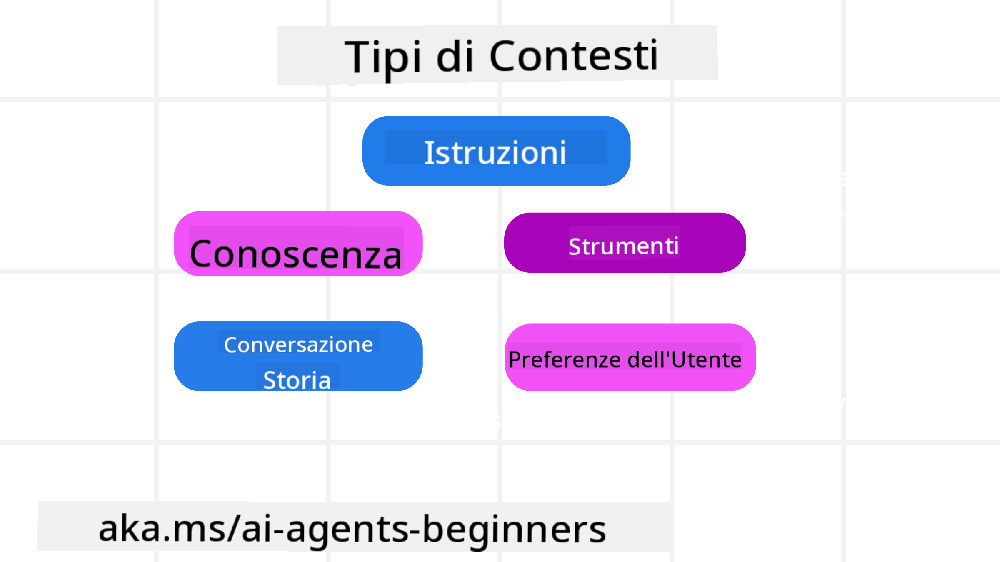

<!--
CO_OP_TRANSLATOR_METADATA:
{
  "original_hash": "cb7e50f471905ce6fdb92a30269a7a98",
  "translation_date": "2025-09-04T10:02:30+00:00",
  "source_file": "12-context-engineering/README.md",
  "language_code": "it"
}
-->
# Ingegneria del Contesto per Agenti AI

> _(Clicca sull'immagine sopra per guardare il video di questa lezione)_

Comprendere la complessità dell'applicazione per cui stai costruendo un agente AI è fondamentale per renderlo affidabile. Dobbiamo creare agenti AI che gestiscano efficacemente le informazioni per affrontare esigenze complesse, andando oltre la semplice ingegneria dei prompt.

In questa lezione, esamineremo cos'è l'ingegneria del contesto e il suo ruolo nella costruzione di agenti AI.

## Introduzione

Questa lezione coprirà:

• **Cos'è l'ingegneria del contesto** e perché è diversa dall'ingegneria dei prompt.

• **Strategie per un'efficace ingegneria del contesto**, inclusi come scrivere, selezionare, comprimere e isolare le informazioni.

• **Errori comuni nel contesto** che possono compromettere il tuo agente AI e come risolverli.

## Obiettivi di Apprendimento

Dopo aver completato questa lezione, sarai in grado di:

• **Definire l'ingegneria del contesto** e differenziarla dall'ingegneria dei prompt.

• **Identificare i componenti chiave del contesto** nelle applicazioni con modelli di linguaggio di grandi dimensioni (LLM).

• **Applicare strategie per scrivere, selezionare, comprimere e isolare il contesto** per migliorare le prestazioni dell'agente.

• **Riconoscere errori comuni nel contesto** come avvelenamento, distrazione, confusione e conflitti, e implementare tecniche di mitigazione.

## Cos'è l'Ingegneria del Contesto?

Per gli agenti AI, il contesto è ciò che guida la pianificazione di un agente AI per intraprendere determinate azioni. L'ingegneria del contesto è la pratica di garantire che l'agente AI abbia le informazioni giuste per completare il prossimo passo del compito. La finestra di contesto è limitata in dimensioni, quindi, come costruttori di agenti, dobbiamo creare sistemi e processi per gestire l'aggiunta, la rimozione e la compressione delle informazioni nella finestra di contesto.

### Ingegneria dei Prompt vs Ingegneria del Contesto

L'ingegneria dei prompt si concentra su un unico set di istruzioni statiche per guidare efficacemente gli agenti AI con un insieme di regole. L'ingegneria del contesto riguarda la gestione di un set dinamico di informazioni, incluso il prompt iniziale, per garantire che l'agente AI abbia ciò di cui ha bisogno nel tempo. L'idea principale dell'ingegneria del contesto è rendere questo processo ripetibile e affidabile.

### Tipi di Contesto

È importante ricordare che il contesto non è un'unica cosa. Le informazioni di cui l'agente AI ha bisogno possono provenire da una varietà di fonti diverse, e spetta a noi garantire che l'agente abbia accesso a queste fonti:

I tipi di contesto che un agente AI potrebbe dover gestire includono:

• **Istruzioni:** Sono come le "regole" dell'agente – prompt, messaggi di sistema, esempi few-shot (che mostrano all'AI come fare qualcosa) e descrizioni degli strumenti che può utilizzare. Qui si combina il focus dell'ingegneria dei prompt con l'ingegneria del contesto.

• **Conoscenza:** Include fatti, informazioni recuperate da database o memorie a lungo termine accumulate dall'agente. Questo include l'integrazione di un sistema di Generazione Arricchita dal Recupero (RAG) se un agente ha bisogno di accedere a diversi archivi di conoscenza e database.

• **Strumenti:** Definizioni di funzioni esterne, API e server MCP che l'agente può chiamare, insieme ai feedback (risultati) che ottiene utilizzandoli.

• **Cronologia delle Conversazioni:** Il dialogo in corso con un utente. Col passare del tempo, queste conversazioni diventano più lunghe e complesse, occupando spazio nella finestra di contesto.

• **Preferenze dell'Utente:** Informazioni apprese sulle preferenze di un utente nel tempo. Queste possono essere memorizzate e richiamate per prendere decisioni chiave che aiutino l'utente.

## Strategie per un'Efficace Ingegneria del Contesto

### Strategie di Pianificazione

Una buona ingegneria del contesto inizia con una buona pianificazione. Ecco un approccio che ti aiuterà a iniziare a pensare a come applicare il concetto di ingegneria del contesto:

1. **Definire Risultati Chiari** - I risultati dei compiti assegnati agli agenti AI dovrebbero essere chiaramente definiti. Rispondi alla domanda: "Come sarà il mondo quando l'agente AI avrà completato il suo compito?" In altre parole, quale cambiamento, informazione o risposta dovrebbe avere l'utente dopo aver interagito con l'agente AI.

2. **Mappare il Contesto** - Una volta definiti i risultati dell'agente AI, devi rispondere alla domanda: "Quali informazioni servono all'agente AI per completare questo compito?". In questo modo puoi iniziare a mappare il contesto di dove si trovano queste informazioni.

3. **Creare Pipeline di Contesto** - Ora che sai dove si trovano le informazioni, devi rispondere alla domanda: "Come otterrà queste informazioni l'agente?". Questo può essere fatto in vari modi, inclusi RAG, l'uso di server MCP e altri strumenti.

### Strategie Pratiche

La pianificazione è importante, ma una volta che le informazioni iniziano a fluire nella finestra di contesto del nostro agente, dobbiamo avere strategie pratiche per gestirle:

#### Gestione del Contesto

Mentre alcune informazioni verranno aggiunte automaticamente alla finestra di contesto, l'ingegneria del contesto implica un ruolo più attivo nella gestione di queste informazioni, che può essere fatto con alcune strategie:

1. **Taccuino dell'Agente**  
   Permette a un agente AI di prendere appunti sulle informazioni rilevanti riguardanti i compiti attuali e le interazioni con l'utente durante una singola sessione. Questo dovrebbe esistere al di fuori della finestra di contesto in un file o oggetto runtime che l'agente può recuperare successivamente durante questa sessione, se necessario.

2. **Memorie**  
   I taccuini sono utili per gestire informazioni al di fuori della finestra di contesto di una singola sessione. Le memorie consentono agli agenti di memorizzare e recuperare informazioni rilevanti attraverso più sessioni. Questo potrebbe includere riassunti, preferenze dell'utente e feedback per miglioramenti futuri.

3. **Compressione del Contesto**  
   Quando la finestra di contesto cresce e si avvicina al limite, possono essere utilizzate tecniche come la sintesi e il taglio. Questo include mantenere solo le informazioni più rilevanti o rimuovere messaggi più vecchi.

4. **Sistemi Multi-Agente**  
   Sviluppare un sistema multi-agente è una forma di ingegneria del contesto perché ogni agente ha la propria finestra di contesto. Come quel contesto viene condiviso e passato a diversi agenti è un altro aspetto da pianificare quando si costruiscono questi sistemi.

5. **Ambienti Sandbox**  
   Se un agente deve eseguire del codice o elaborare grandi quantità di informazioni in un documento, questo può richiedere un grande numero di token per elaborare i risultati. Invece di memorizzare tutto nella finestra di contesto, l'agente può utilizzare un ambiente sandbox che esegue il codice e legge solo i risultati e altre informazioni rilevanti.

6. **Oggetti di Stato Runtime**  
   Questo viene fatto creando contenitori di informazioni per gestire situazioni in cui l'agente deve avere accesso a determinate informazioni. Per un compito complesso, ciò consentirebbe a un agente di memorizzare i risultati di ogni sottocompito passo dopo passo, mantenendo il contesto collegato solo a quel sottocompito specifico.

### Esempio di Ingegneria del Contesto

Supponiamo di voler che un agente AI **"Prenoti un viaggio a Parigi."**

• Un semplice agente che utilizza solo l'ingegneria dei prompt potrebbe rispondere: **"Ok, quando vuoi andare a Parigi?"**. Ha elaborato solo la tua domanda diretta al momento in cui l'hai posta.

• Un agente che utilizza le strategie di ingegneria del contesto trattate farebbe molto di più. Prima ancora di rispondere, il suo sistema potrebbe:

  ◦ **Controllare il tuo calendario** per date disponibili (recuperando dati in tempo reale).  
  ◦ **Richiamare preferenze di viaggio passate** (dalla memoria a lungo termine) come la tua compagnia aerea preferita, il budget o se preferisci voli diretti.  
  ◦ **Identificare strumenti disponibili** per la prenotazione di voli e hotel.  

- Poi, una risposta esempio potrebbe essere: "Ciao [Tuo Nome]! Vedo che sei libero la prima settimana di ottobre. Vuoi che cerchi voli diretti per Parigi con [Compagnia Aerea Preferita] entro il tuo solito budget di [Budget]?" Questa risposta più ricca e consapevole del contesto dimostra la potenza dell'ingegneria del contesto.

## Errori Comuni nel Contesto

### Avvelenamento del Contesto

**Cos'è:** Quando un'allucinazione (informazione falsa generata dall'LLM) o un errore entra nel contesto e viene ripetutamente richiamato, causando all'agente di perseguire obiettivi impossibili o sviluppare strategie insensate.

**Cosa fare:** Implementare **validazione del contesto** e **quarantena**. Validare le informazioni prima che vengano aggiunte alla memoria a lungo termine. Se viene rilevato un potenziale avvelenamento, avviare nuovi thread di contesto per impedire la diffusione delle informazioni errate.

**Esempio di Prenotazione Viaggio:** Il tuo agente allucina un **volo diretto da un piccolo aeroporto locale a una città internazionale lontana** che in realtà non offre voli internazionali. Questo dettaglio inesistente viene salvato nel contesto. Più tardi, quando chiedi all'agente di prenotare, continua a cercare biglietti per questa rotta impossibile, portando a errori ripetuti.

**Soluzione:** Implementare un passaggio che **validi l'esistenza e le rotte dei voli con un'API in tempo reale** _prima_ di aggiungere il dettaglio del volo al contesto di lavoro dell'agente. Se la validazione fallisce, l'informazione errata viene "messa in quarantena" e non utilizzata ulteriormente.

### Distrazione del Contesto

**Cos'è:** Quando il contesto diventa così grande che il modello si concentra troppo sulla cronologia accumulata invece di utilizzare ciò che ha appreso durante l'addestramento, portando ad azioni ripetitive o inutili. I modelli possono iniziare a commettere errori anche prima che la finestra di contesto sia piena.

**Cosa fare:** Utilizzare **sintesi del contesto**. Periodicamente comprimere le informazioni accumulate in riassunti più brevi, mantenendo i dettagli importanti e rimuovendo la cronologia ridondante. Questo aiuta a "resettare" il focus.

**Esempio di Prenotazione Viaggio:** Hai discusso a lungo di varie destinazioni da sogno, inclusi dettagli sul tuo viaggio in zaino di due anni fa. Quando finalmente chiedi di **"trovare un volo economico per il prossimo mese"**, l'agente si perde nei vecchi dettagli irrilevanti e continua a chiedere del tuo equipaggiamento da zaino o degli itinerari passati, trascurando la tua richiesta attuale.

**Soluzione:** Dopo un certo numero di turni o quando il contesto diventa troppo grande, l'agente dovrebbe **riassumere le parti più recenti e rilevanti della conversazione** – concentrandosi sulle tue date di viaggio e destinazione attuali – e utilizzare quel riassunto condensato per la prossima chiamata all'LLM, scartando la cronologia meno rilevante.

### Confusione del Contesto

**Cos'è:** Quando un contesto non necessario, spesso sotto forma di troppi strumenti disponibili, causa al modello di generare risposte errate o chiamare strumenti irrilevanti. I modelli più piccoli sono particolarmente inclini a questo.

**Cosa fare:** Implementare **gestione del carico degli strumenti** utilizzando tecniche RAG. Memorizzare le descrizioni degli strumenti in un database vettoriale e selezionare _solo_ gli strumenti più rilevanti per ogni compito specifico. La ricerca mostra che limitare le selezioni degli strumenti a meno di 30 è efficace.

**Esempio di Prenotazione Viaggio:** Il tuo agente ha accesso a dozzine di strumenti: `prenota_volo`, `prenota_hotel`, `noleggia_auto`, `trova_tour`, `convertitore_valuta`, `previsioni_meteo`, `prenotazioni_ristoranti`, ecc. Chiedi, **"Qual è il modo migliore per spostarsi a Parigi?"** A causa del numero elevato di strumenti, l'agente si confonde e tenta di chiamare `prenota_volo` _all'interno_ di Parigi, o `noleggia_auto` anche se preferisci i trasporti pubblici, perché le descrizioni degli strumenti potrebbero sovrapporsi o semplicemente non riesce a discernere il migliore.

**Soluzione:** Utilizzare **RAG sulle descrizioni degli strumenti**. Quando chiedi come spostarti a Parigi, il sistema recupera dinamicamente _solo_ gli strumenti più rilevanti come `noleggia_auto` o `info_trasporti_pubblici` in base alla tua richiesta, presentando un "carico" di strumenti focalizzato all'LLM.

### Conflitto del Contesto

**Cos'è:** Quando informazioni contrastanti esistono all'interno del contesto, portando a ragionamenti incoerenti o risposte finali errate. Questo accade spesso quando le informazioni arrivano in fasi e le prime ipotesi errate rimangono nel contesto.

**Cosa fare:** Utilizzare **potatura del contesto** e **scarico**. La potatura significa rimuovere informazioni obsolete o contrastanti man mano che arrivano nuovi dettagli. Lo scarico fornisce al modello uno spazio di lavoro separato per elaborare le informazioni senza ingombrare il contesto principale.

**Esempio di Prenotazione Viaggio:** Inizialmente dici al tuo agente, **"Voglio volare in classe economica."** Più tardi nella conversazione, cambi idea e dici, **"In realtà, per questo viaggio, andiamo in classe business."** Se entrambe le istruzioni rimangono nel contesto, l'agente potrebbe ricevere risultati di ricerca contrastanti o confondersi su quale preferenza dare priorità.

**Soluzione:** Implementare **potatura del contesto**. Quando una nuova istruzione contraddice una vecchia, l'istruzione più vecchia viene rimossa o esplicitamente sovrascritta nel contesto. In alternativa, l'agente può utilizzare un **taccuino** per riconciliare preferenze contrastanti prima di decidere, garantendo che solo l'istruzione finale e coerente guidi le sue azioni.

## Hai Altre Domande sull'Ingegneria del Contesto?

Unisciti al [Discord di Azure AI Foundry](https://aka.ms/ai-agents/discord) per incontrare altri studenti, partecipare a sessioni di domande e risposte e ottenere risposte alle tue domande sugli agenti AI.

---

**Disclaimer**:  
Questo documento è stato tradotto utilizzando il servizio di traduzione automatica [Co-op Translator](https://github.com/Azure/co-op-translator). Sebbene ci impegniamo per garantire l'accuratezza, si prega di notare che le traduzioni automatiche possono contenere errori o imprecisioni. Il documento originale nella sua lingua nativa dovrebbe essere considerato la fonte autorevole. Per informazioni critiche, si raccomanda una traduzione professionale effettuata da un traduttore umano. Non siamo responsabili per eventuali fraintendimenti o interpretazioni errate derivanti dall'uso di questa traduzione.