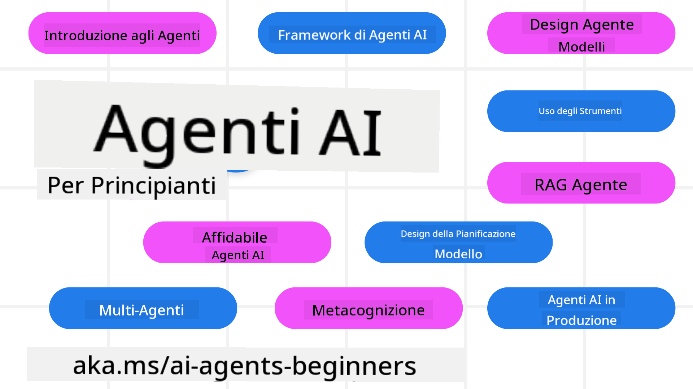

<!--
CO_OP_TRANSLATOR_METADATA:
{
  "original_hash": "6b07046397366e6f6f4524c9ddeba1e1",
  "translation_date": "2025-07-12T14:49:47+00:00",
  "source_file": "README.md",
  "language_code": "it"
}
-->
# Agenti AI per Principianti - Un Corso

## 11 Lezioni che insegnano tutto ciò che devi sapere per iniziare a costruire Agenti AI

  
  
  
  

### 🌐 Supporto Multilingue

#### Supportato tramite GitHub Action (Automatizzato e Sempre Aggiornato)

[Francese](../fr/README.md) | [Spagnolo](../es/README.md) | [Tedesco](../de/README.md) | [Russo](../ru/README.md) | [Arabo](../ar/README.md) | [Persiano (Farsi)](../fa/README.md) | [Urdu](../ur/README.md) | [Cinese (Semplificato)](../zh/README.md) | [Cinese (Tradizionale, Macao)](../mo/README.md) | [Cinese (Tradizionale, Hong Kong)](../hk/README.md) | [Cinese (Tradizionale, Taiwan)](../tw/README.md) | [Giapponese](../ja/README.md) | [Coreano](../ko/README.md) | [Hindi](../hi/README.md) | [Bengalese](../bn/README.md) | [Marathi](../mr/README.md) | [Nepalese](../ne/README.md) | [Punjabi (Gurmukhi)](../pa/README.md) | [Portoghese (Portogallo)](../pt/README.md) | [Portoghese (Brasile)](../br/README.md) | [Italiano](./README.md) | [Polacco](../pl/README.md) | [Turco](../tr/README.md) | [Greco](../el/README.md) | [Thailandese](../th/README.md) | [Svedese](../sv/README.md) | [Danese](../da/README.md) | [Norvegese](../no/README.md) | [Finlandese](../fi/README.md) | [Olandese](../nl/README.md) | [Ebraico](../he/README.md) | [Vietnamita](../vi/README.md) | [Indonesiano](../id/README.md) | [Malese](../ms/README.md) | [Tagalog (Filippino)](../tl/README.md) | [Swahili](../sw/README.md) | [Ungherese](../hu/README.md) | [Ceco](../cs/README.md) | [Slovacco](../sk/README.md) | [Rumeno](../ro/README.md) | [Bulgaro](../bg/README.md) | [Serbo (Cirillico)](../sr/README.md) | [Croato](../hr/README.md) | [Sloveno](../sl/README.md) | [Ucraino](../uk/README.md) | [Birmano (Myanmar)](../my/README.md)

**Se desideri che vengano supportate altre lingue di traduzione, sono elencate [qui](https://github.com/Azure/co-op-translator/blob/main/getting_started/supported-languages.md)**

  
  

## 🌱 Per Iniziare

Questo corso comprende 11 lezioni che coprono le basi per costruire Agenti AI. Ogni lezione tratta un argomento specifico, quindi puoi iniziare da quella che preferisci!

Il corso supporta più lingue. Consulta le [lingue disponibili qui](../..).

Se è la prima volta che lavori con modelli di Generative AI, dai un’occhiata al nostro corso [Generative AI For Beginners](https://aka.ms/genai-beginners), che include 21 lezioni su come costruire con GenAI.

Non dimenticare di [mettere una stella (🌟) a questo repo](https://docs.github.com/en/get-started/exploring-projects-on-github/saving-repositories-with-stars?WT.mc_id=academic-105485-koreyst) e di [fare il fork di questo repo](https://github.com/microsoft/ai-agents-for-beginners/fork) per eseguire il codice.

### Cosa Ti Serve

Ogni lezione di questo corso include esempi di codice, che puoi trovare nella cartella code_samples. Puoi [fare il fork di questo repo](https://github.com/microsoft/ai-agents-for-beginners/fork) per creare la tua copia.

Gli esempi di codice in questi esercizi utilizzano Azure AI Foundry e GitHub Model Catalogs per interagire con i Language Models:

- [Github Models](https://aka.ms/ai-agents-beginners/github-models) - Gratis / Limitato  
- [Azure AI Foundry](https://aka.ms/ai-agents-beginners/ai-foundry) - Richiede un account Azure

Questo corso utilizza anche i seguenti framework e servizi per Agenti AI di Microsoft:

- [Azure AI Agent Service](https://aka.ms/ai-agents-beginners/ai-agent-service)  
- [Semantic Kernel](https://aka.ms/ai-agents-beginners/semantic-kernel)  
- [AutoGen](https://aka.ms/ai-agents/autogen)

Per maggiori informazioni su come eseguire il codice di questo corso, consulta la sezione [Course Setup](./00-course-setup/README.md).

## 🙏 Vuoi Aiutare?

Hai suggerimenti o hai trovato errori di ortografia o nel codice? [Apri un issue](https://github.com/microsoft/ai-agents-for-beginners/issues?WT.mc_id=academic-105485-koreyst) o [crea una pull request](https://github.com/microsoft/ai-agents-for-beginners/pulls?WT.mc_id=academic-105485-koreyst).

Se ti blocchi o hai domande sulla costruzione di Agenti AI, unisciti al nostro [Azure AI Foundry Community Discord](https://discord.gg/kzRShWzttr).

Se hai feedback sul prodotto o riscontri errori durante lo sviluppo, visita il nostro [Azure AI Foundry Developer Forum](https://aka.ms/azureaifoundry/forum).

## 📂 Ogni lezione include

- Una lezione scritta nel README e un breve video  
- Esempi di codice Python che supportano Azure AI Foundry e Github Models (Gratis)  
- Link a risorse extra per continuare ad imparare

## 🗃️ Lezioni

| **Lezione**                              | **Testo & Codice**                                  | **Video**                                                  | **Risorse Extra**                                                                     |
|------------------------------------------|----------------------------------------------------|------------------------------------------------------------|----------------------------------------------------------------------------------------|
| Introduzione agli Agenti AI e Casi d’Uso | [Link](./01-intro-to-ai-agents/README.md)          | [Video](https://youtu.be/3zgm60bXmQk?si=z8QygFvYQv-9WtO1)  | [Link](https://aka.ms/ai-agents-beginners/collection?WT.mc_id=academic-105485-koreyst) |
| Esplorare Framework Agentici              | [Link](./02-explore-agentic-frameworks/README.md)  | [Video](https://youtu.be/ODwF-EZo_O8?si=Vawth4hzVaHv-u0H)  | [Link](https://aka.ms/ai-agents-beginners/collection?WT.mc_id=academic-105485-koreyst) |
| Comprendere i Design Pattern Agentici     | [Link](./03-agentic-design-patterns/README.md)     | [Video](https://youtu.be/m9lM8qqoOEA?si=BIzHwzstTPL8o9GF)  | [Link](https://aka.ms/ai-agents-beginners/collection?WT.mc_id=academic-105485-koreyst) |
| Design Pattern per l’Uso di Strumenti     | [Link](./04-tool-use/README.md)                    | [Video](https://youtu.be/vieRiPRx-gI?si=2z6O2Xu2cu_Jz46N)  | [Link](https://aka.ms/ai-agents-beginners/collection?WT.mc_id=academic-105485-koreyst) |
| Agentic RAG                              | [Link](./05-agentic-rag/README.md)                 | [Video](https://youtu.be/WcjAARvdL7I?si=gKPWsQpKiIlDH9A3)  | [Link](https://aka.ms/ai-agents-beginners/collection?WT.mc_id=academic-105485-koreyst) |
| Costruire Agenti AI Affidabili            | [Link](./06-building-trustworthy-agents/README.md) | [Video](https://youtu.be/iZKkMEGBCUQ?si=jZjpiMnGFOE9L8OK ) | [Link](https://aka.ms/ai-agents-beginners/collection?WT.mc_id=academic-105485-koreyst) |
| Design Pattern per la Pianificazione      | [Link](./07-planning-design/README.md)             | [Video](https://youtu.be/kPfJ2BrBCMY?si=6SC_iv_E5-mzucnC)  | [Link](https://aka.ms/ai-agents-beginners/collection?WT.mc_id=academic-105485-koreyst) |
| Design Pattern Multi-Agente                | [Link](./08-multi-agent/README.md)                 | [Video](https://youtu.be/V6HpE9hZEx0?si=rMgDhEu7wXo2uo6g)  | [Link](https://aka.ms/ai-agents-beginners/collection?WT.mc_id=academic-105485-koreyst) |
| Design Pattern per la Metacognizione       | [Link](./09-metacognition/README.md)               | [Video](https://youtu.be/His9R6gw6Ec?si=8gck6vvdSNCt6OcF)  | [Link](https://aka.ms/ai-agents-beginners/collection?WT.mc_id=academic-105485-koreyst) |
| Agenti AI in Produzione                    | [Link](./10-ai-agents-production/README.md)        | [Video](https://youtu.be/l4TP6IyJxmQ?si=31dnhexRo6yLRJDl)  | [Link](https://aka.ms/ai-agents-beginners/collection?WT.mc_id=academic-105485-koreyst) |
| Agenti AI con MCP                         | [Link](./11-mcp/README.md)                         |                                                            | [Link](https://aka.ms/mcp-for-beginners)                                               |

## 🎒 Altri Corsi

Il nostro team produce altri corsi! Dai un’occhiata a:
- [**NUOVO** Model Context Protocol (MCP) per Principianti](https://github.com/microsoft/mcp-for-beginners?WT.mc_id=academic-105485-koreyst)
- [Generative AI per Principianti con .NET](https://github.com/microsoft/Generative-AI-for-beginners-dotnet?WT.mc_id=academic-105485-koreyst)
- [Generative AI per Principianti](https://github.com/microsoft/generative-ai-for-beginners?WT.mc_id=academic-105485-koreyst)
- [ML per Principianti](https://aka.ms/ml-beginners?WT.mc_id=academic-105485-koreyst)
- [Data Science per Principianti](https://aka.ms/datascience-beginners?WT.mc_id=academic-105485-koreyst)
- [AI per Principianti](https://aka.ms/ai-beginners?WT.mc_id=academic-105485-koreyst)
- [Cybersecurity per Principianti](https://github.com/microsoft/Security-101??WT.mc_id=academic-96948-sayoung)
- [Sviluppo Web per Principianti](https://aka.ms/webdev-beginners?WT.mc_id=academic-105485-koreyst)
- [IoT per Principianti](https://aka.ms/iot-beginners?WT.mc_id=academic-105485-koreyst)
- [Sviluppo XR per Principianti](https://github.com/microsoft/xr-development-for-beginners?WT.mc_id=academic-105485-koreyst)
- [Padroneggiare GitHub Copilot per Programmazione AI in Coppia](https://aka.ms/GitHubCopilotAI?WT.mc_id=academic-105485-koreyst)
- [Padroneggiare GitHub Copilot per Sviluppatori C#/.NET](https://github.com/microsoft/mastering-github-copilot-for-dotnet-csharp-developers?WT.mc_id=academic-105485-koreyst)
- [Scegli la Tua Avventura con Copilot](https://github.com/microsoft/CopilotAdventures?WT.mc_id=academic-105485-koreyst)

## 🌟 Ringraziamenti alla Community

Grazie a [Shivam Goyal](https://www.linkedin.com/in/shivam2003/) per aver contribuito con importanti esempi di codice che dimostrano Agentic RAG.

## Contributi

Questo progetto accoglie contributi e suggerimenti. La maggior parte dei contributi richiede di accettare un
Contributor License Agreement (CLA) che dichiara che hai il diritto e effettivamente concedi a noi
i diritti di utilizzare il tuo contributo. Per maggiori dettagli, visita
<https://cla.opensource.microsoft.com>.

Quando invii una pull request, un bot CLA determinerà automaticamente se devi fornire
un CLA e decorerà la PR di conseguenza (ad esempio, controllo stato, commento). Segui semplicemente le istruzioni
fornite dal bot. Dovrai farlo solo una volta per tutti i repository che utilizzano il nostro CLA.

Questo progetto ha adottato il [Microsoft Open Source Code of Conduct](https://opensource.microsoft.com/codeofconduct/).
Per maggiori informazioni consulta le [FAQ sul Codice di Condotta](https://opensource.microsoft.com/codeofconduct/faq/) o
contatta [opencode@microsoft.com](mailto:opencode@microsoft.com) per domande o commenti aggiuntivi.

## Marchi

Questo progetto può contenere marchi o loghi di progetti, prodotti o servizi. L’uso autorizzato dei marchi o loghi Microsoft
è soggetto e deve rispettare le
[Linee Guida sui Marchi e Brand di Microsoft](https://www.microsoft.com/legal/intellectualproperty/trademarks/usage/general).
L’uso di marchi o loghi Microsoft in versioni modificate di questo progetto non deve creare confusione né implicare sponsorizzazione da parte di Microsoft.
Qualsiasi uso di marchi o loghi di terze parti è soggetto alle politiche di tali terze parti.

**Disclaimer**:  
Questo documento è stato tradotto utilizzando il servizio di traduzione automatica [Co-op Translator](https://github.com/Azure/co-op-translator). Pur impegnandoci per garantire accuratezza, si prega di notare che le traduzioni automatiche possono contenere errori o imprecisioni. Il documento originale nella sua lingua nativa deve essere considerato la fonte autorevole. Per informazioni critiche, si raccomanda una traduzione professionale effettuata da un umano. Non siamo responsabili per eventuali malintesi o interpretazioni errate derivanti dall’uso di questa traduzione.