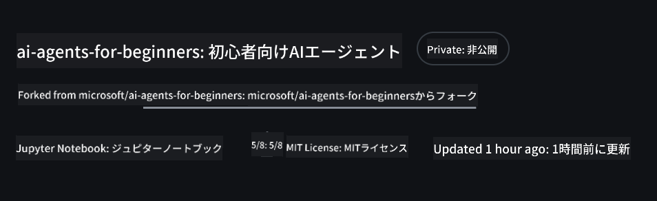
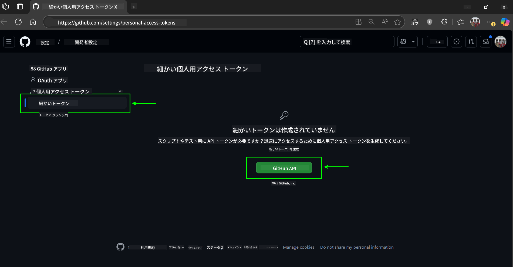
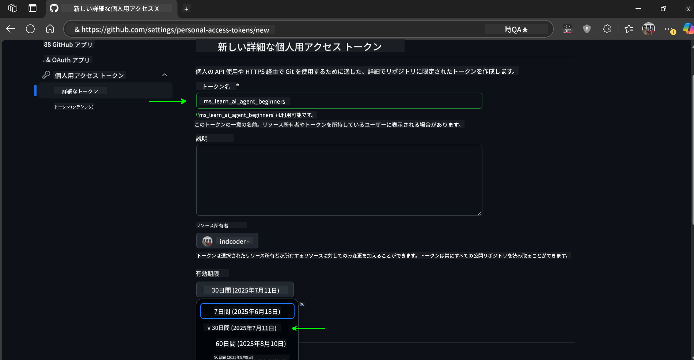
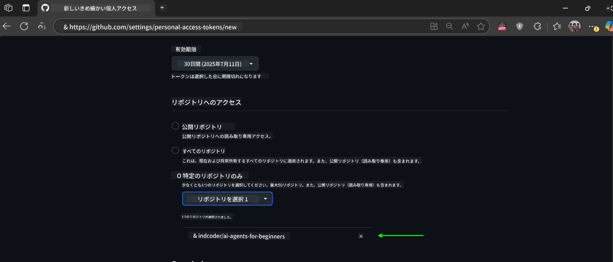
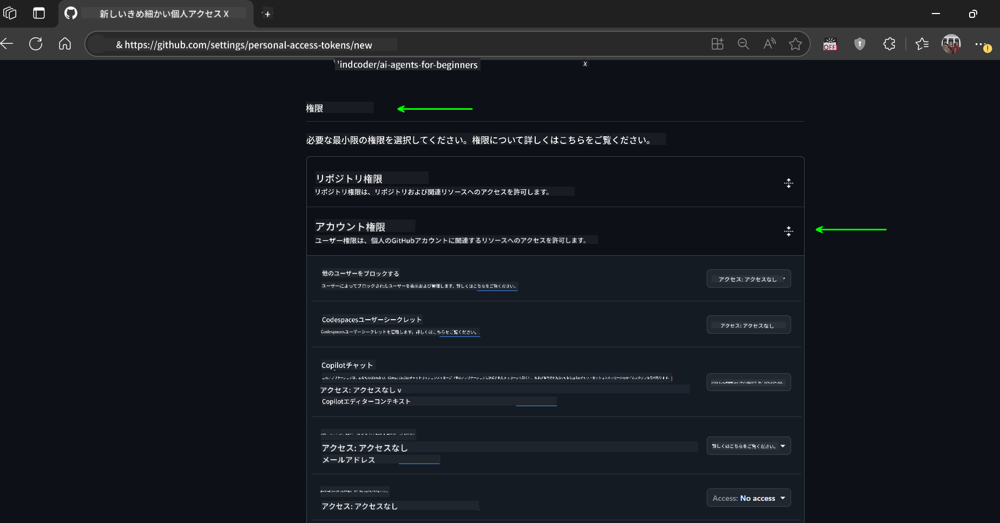
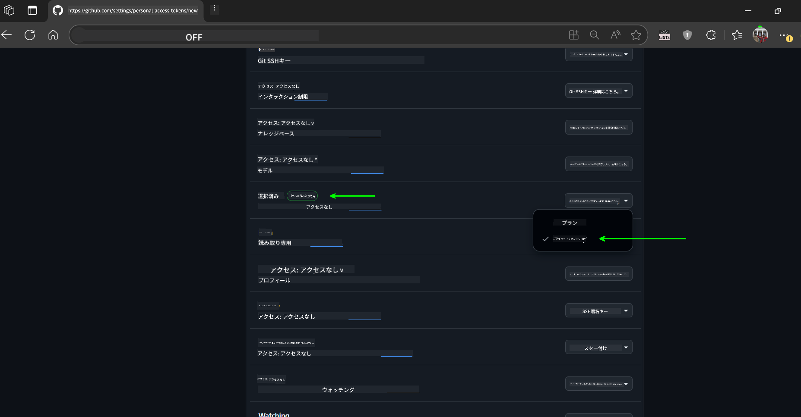

<!--
CO_OP_TRANSLATOR_METADATA:
{
  "original_hash": "c6a79c8f2b56a80370ff7e447765524f",
  "translation_date": "2025-07-23T08:22:28+00:00",
  "source_file": "00-course-setup/README.md",
  "language_code": "ja"
}
-->
# コースセットアップ

## はじめに

このレッスンでは、このコースのコードサンプルを実行する方法について説明します。

## このリポジトリをクローンまたはフォークする

まずは、GitHubリポジトリをクローンまたはフォークしてください。これにより、コース教材の自分専用のバージョンが作成され、コードを実行、テスト、調整することができます！

リンクをクリックして行うことができます。



## コードの実行

このコースでは、AIエージェントを構築する実践的な経験を得るための一連のJupyter Notebookを提供しています。

コードサンプルは以下のいずれかを使用します：

**GitHubアカウントが必要 - 無料**:

1) Semantic Kernel Agent Framework + GitHub Models Marketplace (semantic-kernel.ipynb)
2) AutoGen Framework + GitHub Models Marketplace (autogen.ipynb)

**Azureサブスクリプションが必要**:
3) Azure AI Foundry + Azure AI Agent Service (azureaiagent.ipynb)

3つの例すべてを試してみて、自分に最適なものを見つけることをお勧めします。

選択したオプションに応じて、以下のセットアップ手順が異なります。

## 必要条件

- Python 3.12以上
  - **NOTE**: Python3.12がインストールされていない場合は、インストールしてください。その後、python3.12を使用してvenvを作成し、requirements.txtファイルから正しいバージョンをインストールしてください。
- GitHubアカウント - GitHub Models Marketplaceへのアクセス用
- Azureサブスクリプション - Azure AI Foundryへのアクセス用
- Azure AI Foundryアカウント - Azure AI Agent Serviceへのアクセス用

このリポジトリのルートには、コードサンプルを実行するために必要なPythonパッケージを含む`requirements.txt`ファイルが含まれています。

以下のコマンドをリポジトリのルートでターミナルで実行することでインストールできます：

```bash
pip install -r requirements.txt
```
Python仮想環境を作成することをお勧めします。これにより、競合や問題を回避できます。

## VSCodeのセットアップ
VSCodeで正しいバージョンのPythonを使用していることを確認してください。


## GitHub Modelsを使用したサンプルのセットアップ

### ステップ1: GitHub Personal Access Token (PAT) を取得する

このコースではGitHub Models Marketplaceを利用しており、これによりAIエージェントを構築するために使用する大規模言語モデル（LLM）への無料アクセスが提供されます。

GitHub Modelsを使用するには、[GitHub Personal Access Token](https://docs.github.com/en/authentication/keeping-your-account-and-data-secure/managing-your-personal-access-tokens)を作成する必要があります。

GitHubアカウントで以下の手順を実行してください。

[最小権限の原則](https://docs.github.com/en/get-started/learning-to-code/storing-your-secrets-safely)に従ってトークンを作成してください。つまり、このコースのコードサンプルを実行するために必要な権限のみをトークンに付与するべきです。

1. 画面左側の`Fine-grained tokens`オプションを選択します。

    次に`Generate new token`を選択します。

    

1. トークンの目的を反映した説明的な名前を入力し、後で簡単に識別できるようにします。有効期限を設定します（推奨: 30日。より安全な設定を希望する場合は7日など短い期間を選択できます）。

    

1. トークンのスコープをこのリポジトリのフォークに限定します。

    

1. トークンの権限を制限します: **Permissions**の下で**Account Permissions**を切り替え、**Models**に移動してGitHub Modelsに必要な読み取りアクセスのみを有効にします。

    

    

作成した新しいトークンをコピーしてください。このトークンをこのコースに含まれる`.env`ファイルに追加します。

### ステップ2: `.env`ファイルを作成する

ターミナルで以下のコマンドを実行して`.env`ファイルを作成します。

```bash
cp .env.example .env
```

これにより、例のファイルがコピーされ、ディレクトリ内に`.env`ファイルが作成されます。このファイルに環境変数の値を入力します。

コピーしたトークンを使用して、お気に入りのテキストエディタで`.env`ファイルを開き、`GITHUB_TOKEN`フィールドにトークンを貼り付けます。

これで、このコースのコードサンプルを実行できるようになります。

## Azure AI FoundryとAzure AI Agent Serviceを使用したサンプルのセットアップ

### ステップ1: Azureプロジェクトエンドポイントを取得する

Azure AI Foundryでハブとプロジェクトを作成する手順については、[Hub resources overview](https://learn.microsoft.com/en-us/azure/ai-foundry/concepts/ai-resources)を参照してください。

プロジェクトを作成したら、プロジェクトの接続文字列を取得する必要があります。

これはAzure AI Foundryポータルのプロジェクトの**概要**ページで行うことができます。


### ステップ2: `.env`ファイルを作成する

ターミナルで以下のコマンドを実行して`.env`ファイルを作成します。

```bash
cp .env.example .env
```

これにより、例のファイルがコピーされ、ディレクトリ内に`.env`ファイルが作成されます。このファイルに環境変数の値を入力します。

コピーしたトークンを使用して、お気に入りのテキストエディタで`.env`ファイルを開き、`PROJECT_ENDPOINT`フィールドにトークンを貼り付けます。

### ステップ3: Azureにサインインする

セキュリティのベストプラクティスとして、Microsoft Entra IDを使用してAzure OpenAIに認証する[キーなし認証](https://learn.microsoft.com/azure/developer/ai/keyless-connections?tabs=csharp%2Cazure-cli?WT.mc_id=academic-105485-koreyst)を使用します。

次に、ターミナルを開き、`az login --use-device-code`を実行してAzureアカウントにサインインします。

ログインしたら、ターミナルでサブスクリプションを選択します。

## 追加の環境変数 - Azure SearchとAzure OpenAI

エージェント型RAGレッスン - レッスン5 - では、Azure SearchとAzure OpenAIを使用するサンプルがあります。

これらのサンプルを実行するには、以下の環境変数を`.env`ファイルに追加する必要があります：

### 概要ページ（プロジェクト）

- `AZURE_SUBSCRIPTION_ID` - プロジェクトの**概要**ページの**プロジェクト詳細**を確認してください。

- `AZURE_AI_PROJECT_NAME` - プロジェクトの**概要**ページの上部を確認してください。

- `AZURE_OPENAI_SERVICE` - **Azure OpenAI Service**の**含まれる機能**タブで確認してください。

### 管理センター

- `AZURE_OPENAI_RESOURCE_GROUP` - **管理センター**の**概要**ページで**プロジェクトプロパティ**を確認してください。

- `GLOBAL_LLM_SERVICE` - **接続されたリソース**の下で**Azure AI Services**接続名を確認してください。リストされていない場合は、リソースグループのAI Servicesリソース名をAzureポータルで確認してください。

### モデル + エンドポイントページ

- `AZURE_OPENAI_EMBEDDING_DEPLOYMENT_NAME` - 埋め込みモデル（例: `text-embedding-ada-002`）を選択し、モデル詳細から**デプロイメント名**を確認してください。

- `AZURE_OPENAI_CHAT_DEPLOYMENT_NAME` - チャットモデル（例: `gpt-4o-mini`）を選択し、モデル詳細から**デプロイメント名**を確認してください。

### Azureポータル

- `AZURE_OPENAI_ENDPOINT` - **Azure AI Services**を探し、クリックして**リソース管理**、**キーとエンドポイント**に移動し、「Azure OpenAIエンドポイント」をスクロールして「言語API」をコピーしてください。

- `AZURE_OPENAI_API_KEY` - 同じ画面で、KEY 1またはKEY 2をコピーしてください。

- `AZURE_SEARCH_SERVICE_ENDPOINT` - **Azure AI Search**リソースを探し、クリックして**概要**を確認してください。

- `AZURE_SEARCH_API_KEY` - 次に**設定**、**キー**に移動して、プライマリまたはセカンダリ管理キーをコピーしてください。

### 外部ウェブページ

- `AZURE_OPENAI_API_VERSION` - [APIバージョンライフサイクル](https://learn.microsoft.com/en-us/azure/ai-services/openai/api-version-deprecation#latest-ga-api-release)ページの**最新GA APIリリース**を参照してください。

### キーなし認証のセットアップ

資格情報をハードコードする代わりに、Azure OpenAIとのキーなし接続を使用します。そのために、`DefaultAzureCredential`をインポートし、後で`DefaultAzureCredential`関数を呼び出して資格情報を取得します。

```python
from azure.identity import DefaultAzureCredential, InteractiveBrowserCredential
```

## どこかで詰まった場合

セットアップを実行する際に問題がある場合は、私たちの

## 次のレッスン

これで、このコースのコードを実行する準備が整いました。AIエージェントの世界についてさらに学ぶことを楽しんでください！

[AIエージェントとエージェントのユースケースの紹介](../01-intro-to-ai-agents/README.md)

**免責事項**:  
この文書は、AI翻訳サービス [Co-op Translator](https://github.com/Azure/co-op-translator) を使用して翻訳されています。正確性を追求しておりますが、自動翻訳には誤りや不正確な部分が含まれる可能性があります。元の言語で記載された原文が正式な情報源とみなされるべきです。重要な情報については、専門の人間による翻訳を推奨します。この翻訳の利用に起因する誤解や誤認について、当社は一切の責任を負いません。