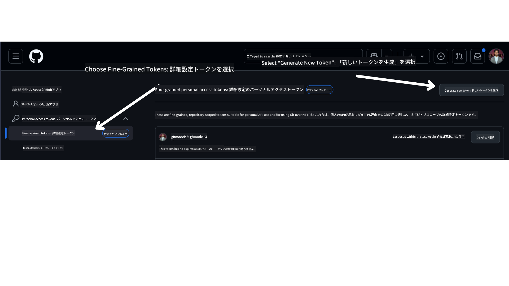

<!--
CO_OP_TRANSLATOR_METADATA:
{
  "original_hash": "76945069b52a49cd0432ae3e0b0ba22e",
  "translation_date": "2025-07-12T07:46:18+00:00",
  "source_file": "00-course-setup/README.md",
  "language_code": "ja"
}
-->
GitHubアカウントでログインしてください。

画面左側の「Fine-grained tokens」オプションを選択します。

次に「Generate new token」を選択します。



トークンの名前を入力し、有効期限を選択します（推奨：30日）。トークンのスコープは「Public Repositories」を選択してください。

また、このトークンの権限を編集する必要があります：Permissions -> Models -> GitHub Modelsへのアクセスを許可

作成した新しいトークンをコピーしてください。このトークンを本コースに含まれる `.env` ファイルに追加します。

### ステップ2: `.env` ファイルの作成

ターミナルで以下のコマンドを実行して `.env` ファイルを作成します。

```bash
cp .env.example .env
```

これにより、例のファイルがコピーされ、環境変数の値を入力するための `.env` ファイルがディレクトリに作成されます。

コピーしたトークンを使い、お気に入りのテキストエディタで `.env` ファイルを開き、`GITHUB_TOKEN` フィールドにトークンを貼り付けてください。

これで本コースのコードサンプルを実行できるようになります。

## Azure AI Foundry と Azure AI Agent Service を使ったサンプルのセットアップ

### ステップ1: Azureプロジェクトのエンドポイントを取得

Azure AI Foundryでハブとプロジェクトを作成する手順は、こちらをご覧ください：[Hub resources overview](https://learn.microsoft.com/en-us/azure/ai-foundry/concepts/ai-resources)

プロジェクトを作成したら、プロジェクトの接続文字列を取得する必要があります。

Azure AI Foundryポータルのプロジェクトの **Overview** ページで確認できます。


### ステップ2: `.env` ファイルの作成

ターミナルで以下のコマンドを実行して `.env` ファイルを作成します。

```bash
cp .env.example .env
```

これにより、例のファイルがコピーされ、環境変数の値を入力するための `.env` ファイルがディレクトリに作成されます。

コピーした接続文字列を使い、お気に入りのテキストエディタで `.env` ファイルを開き、`PROJECT_ENDPOINT` フィールドに貼り付けてください。

### ステップ3: Azureにサインイン

セキュリティのベストプラクティスとして、Microsoft Entra IDを使ったAzure OpenAIへの[キー不要認証](https://learn.microsoft.com/azure/developer/ai/keyless-connections?tabs=csharp%2Cazure-cli?WT.mc_id=academic-105485-koreyst)を利用します。これを行うには、まずお使いのOSに合わせて[Azure CLI](https://learn.microsoft.com/cli/azure/install-azure-cli?WT.mc_id=academic-105485-koreyst)をインストールしてください。

次にターミナルを開き、`az login --use-device-code` を実行してAzureアカウントにサインインします。

ログイン後、ターミナルでサブスクリプションを選択してください。

## 追加の環境変数 - Azure Search と Azure OpenAI

Agentic RAG レッスン（レッスン5）では、Azure Search と Azure OpenAI を使ったサンプルがあります。

これらのサンプルを実行する場合は、以下の環境変数を `.env` ファイルに追加してください。

### Overviewページ（プロジェクト）

- `AZURE_SUBSCRIPTION_ID` - プロジェクトの **Overview** ページの **Project details** で確認

- `AZURE_AI_PROJECT_NAME` - プロジェクトの **Overview** ページの上部で確認

- `AZURE_OPENAI_SERVICE` - **Overview** ページの **Included capabilities** タブの **Azure OpenAI Service** で確認

### Management Center

- `AZURE_OPENAI_RESOURCE_GROUP` - **Management Center** の **Overview** ページの **Project properties** で確認

- `GLOBAL_LLM_SERVICE` - **Connected resources** の中の **Azure AI Services** 接続名。リストにない場合は、Azureポータルのリソースグループ内のAI Servicesリソース名を確認

### Models + Endpointsページ

- `AZURE_OPENAI_EMBEDDING_DEPLOYMENT_NAME` - 埋め込みモデル（例：`text-embedding-ada-002`）を選択し、モデル詳細の **Deployment name** を確認

- `AZURE_OPENAI_CHAT_DEPLOYMENT_NAME` - チャットモデル（例：`gpt-4o-mini`）を選択し、モデル詳細の **Deployment name** を確認

### Azureポータル

- `AZURE_OPENAI_ENDPOINT` - **Azure AI services** をクリックし、**Resource Management**、**Keys and Endpoint** に進み、「Azure OpenAI endpoints」までスクロールして「Language APIs」と書かれたエンドポイントをコピー

- `AZURE_OPENAI_API_KEY` - 同じ画面でKEY 1またはKEY 2をコピー

- `AZURE_SEARCH_SERVICE_ENDPOINT` - **Azure AI Search** リソースを選択し、**Overview** を確認

- `AZURE_SEARCH_API_KEY` - **Settings** の **Keys** でプライマリまたはセカンダリ管理キーをコピー

### 外部ウェブページ

- `AZURE_OPENAI_API_VERSION` - [API version lifecycle](https://learn.microsoft.com/en-us/azure/ai-services/openai/api-version-deprecation#latest-ga-api-release) ページの **Latest GA API release** を参照

### キー不要認証のセットアップ

資格情報をハードコードする代わりに、Azure OpenAIでキー不要接続を使用します。そのために `DefaultAzureCredential` をインポートし、後で `DefaultAzureCredential` 関数を呼び出して資格情報を取得します。

```python
from azure.identity import DefaultAzureCredential, InteractiveBrowserCredential
```

## どこかで詰まったら？

セットアップの実行で問題があれば、ぜひ私たちの

または

に参加してください。

## 次のレッスン

これで本コースのコードを実行する準備が整いました。AIエージェントの世界をさらに学び、楽しんでください！

[AIエージェントの紹介とユースケース](../01-intro-to-ai-agents/README.md)

**免責事項**：  
本書類はAI翻訳サービス「[Co-op Translator](https://github.com/Azure/co-op-translator)」を使用して翻訳されました。正確性を期しておりますが、自動翻訳には誤りや不正確な部分が含まれる可能性があります。原文の言語による文書が正式な情報源とみなされるべきです。重要な情報については、専門の人間による翻訳を推奨します。本翻訳の利用により生じた誤解や誤訳について、当方は一切の責任を負いかねます。