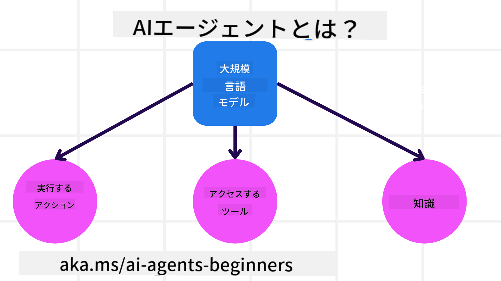
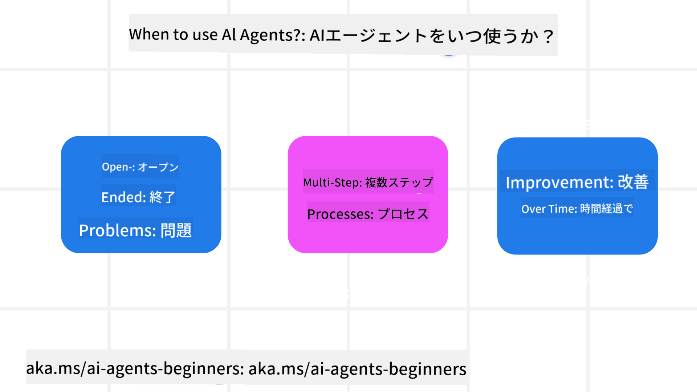

<!--
CO_OP_TRANSLATOR_METADATA:
{
  "original_hash": "d84943abc8f001ad4670418d32c2d899",
  "translation_date": "2025-07-12T08:03:11+00:00",
  "source_file": "01-intro-to-ai-agents/README.md",
  "language_code": "ja"
}
-->
他の学習者やAIエージェントビルダーと交流し、このコースに関する質問を自由にしてください。

このコースを始めるにあたり、まずAIエージェントとは何か、そして私たちが構築するアプリケーションやワークフローでどのように活用できるかを理解していきます。

## はじめに

このレッスンでは以下を扱います：

- AIエージェントとは何か、そしてエージェントの種類にはどんなものがあるか？
- AIエージェントに最適なユースケースは何か、どのように役立つのか？
- エージェントソリューションを設計する際の基本的な構成要素とは？

## 学習目標
このレッスンを終えた後、以下ができるようになります：

- AIエージェントの概念を理解し、他のAIソリューションとの違いを把握する。
- AIエージェントを最も効果的に活用する。
- ユーザーと顧客の両方にとって生産的なエージェントソリューションを設計する。

## AIエージェントの定義と種類

### AIエージェントとは？

AIエージェントは、**大規模言語モデル（LLM）**に**ツールや知識へのアクセス権を与え**、その能力を拡張して**行動を実行できる**ようにする**システム**です。

この定義を細かく分解してみましょう：

- **システム** - エージェントは単一のコンポーネントではなく、多くのコンポーネントからなるシステムとして考えることが重要です。基本的なAIエージェントの構成要素は以下の通りです：
  - **環境** - AIエージェントが動作する定義された空間。例えば、旅行予約AIエージェントの場合、環境はエージェントがタスクを完了するために使う旅行予約システムです。
  - **センサー** - 環境は情報を持ち、フィードバックを提供します。AIエージェントはセンサーを使って環境の現在の状態に関する情報を収集し解釈します。旅行予約エージェントの例では、予約システムがホテルの空室状況や航空券の価格情報を提供します。
  - **アクチュエーター** - AIエージェントは環境の現在の状態を受け取った後、タスクに応じて環境を変えるためにどの行動を取るかを決定します。旅行予約エージェントの場合、利用可能な部屋をユーザーのために予約することが該当します。

**大規模言語モデル** - エージェントの概念はLLMが登場する前から存在していました。LLMを使ってAIエージェントを構築する利点は、人間の言語やデータを解釈できる能力にあります。この能力により、LLMは環境情報を解釈し、環境を変えるための計画を立てることができます。

**行動の実行** - AIエージェントシステムの外では、LLMはユーザーのプロンプトに基づいてコンテンツや情報を生成することに限定されます。AIエージェントシステム内では、LLMはユーザーの要求を解釈し、環境内で利用可能なツールを使ってタスクを達成できます。

**ツールへのアクセス** - LLMがアクセスできるツールは、1) 動作している環境、2) AIエージェントの開発者によって定義されます。旅行代理店の例では、エージェントのツールは予約システムで利用可能な操作に制限されており、開発者はエージェントのツールアクセスを航空券のみに制限することも可能です。

**メモリ＋知識** - メモリはユーザーとエージェント間の会話の文脈で短期的なものとなる場合があります。長期的には、環境から提供される情報以外にも、AIエージェントは他のシステム、サービス、ツール、さらには他のエージェントから知識を取得できます。旅行代理店の例では、顧客データベースにあるユーザーの旅行嗜好情報が該当します。

### エージェントの種類

AIエージェントの一般的な定義を理解したところで、旅行予約AIエージェントに適用した場合の具体的なエージェントタイプを見てみましょう。

| **エージェントタイプ**           | **説明**                                                                                                                        | **例**                                                                                                                                                                                                                      |
| ----------------------------- | ----------------------------------------------------------------------------------------------------------------------------- | --------------------------------------------------------------------------------------------------------------------------------------------------------------------------------------------------------------------------- |
| **単純反射エージェント**         | 事前定義されたルールに基づいて即時に行動を実行する。                                                                             | 旅行代理店がメールの内容を解釈し、旅行に関する苦情をカスタマーサービスに転送する。                                                                                                                                          |
| **モデルベース反射エージェント** | 世界のモデルとその変化に基づいて行動を実行する。                                                                                 | 旅行代理店が過去の価格データにアクセスし、価格変動が大きいルートを優先的に案内する。                                                                                                                                       |
| **目標指向エージェント**         | 目標を解釈し、その目標を達成するための行動を決定して計画を立てる。                                                               | 旅行代理店が現在地から目的地までの移動手段（車、公共交通機関、飛行機）を判断し、旅程を予約する。                                                                                                                           |
| **効用ベースエージェント**       | 好みを考慮し、トレードオフを数値的に評価して目標達成方法を決定する。                                                             | 旅行代理店が利便性とコストを比較検討し、最適な旅行予約を行う。                                                                                                                                                             |
| **学習エージェント**             | フィードバックに応じて行動を調整し、時間とともに改善する。                                                                       | 旅行代理店が旅行後のアンケートから顧客のフィードバックを活用し、将来の予約を改善する。                                                                                                                                     |
| **階層型エージェント**           | 複数のエージェントが階層的に構成され、高位のエージェントがタスクを下位のエージェントに分割して完了させる。                     | 旅行代理店が旅行キャンセルを複数のサブタスク（例えば、特定の予約のキャンセル）に分割し、下位エージェントに実行させ、結果を上位エージェントに報告する。                                                               |
| **マルチエージェントシステム（MAS）** | エージェントが独立してタスクを完了し、協力的または競合的に動作する。                                                             | 協力的：複数のエージェントがホテル、航空券、エンターテインメントなどの特定サービスを予約する。競合的：複数のエージェントが共有のホテル予約カレンダーを管理し、顧客の予約を競い合う。                                   |

## AIエージェントを使うべき場面

前のセクションでは、旅行代理店のユースケースを使って、異なるタイプのエージェントが旅行予約の様々なシナリオでどのように使われるかを説明しました。このアプリケーションはコース全体で引き続き使用します。

AIエージェントが最も適しているユースケースの種類を見てみましょう：

- **オープンエンドな問題** - ワークフローにハードコードできないため、LLMがタスク完了に必要なステップを判断する必要がある場合。
- **複数ステップのプロセス** - AIエージェントが単発の情報取得ではなく、複数回にわたりツールや情報を活用する複雑なタスク。
- **時間をかけた改善** - エージェントが環境やユーザーからのフィードバックを受けて、より良い効用を提供するために時間をかけて改善できるタスク。

AIエージェントの利用に関するさらなる考慮点は、「信頼できるAIエージェントの構築」レッスンで扱います。

## エージェントソリューションの基本

### エージェント開発

AIエージェントシステムを設計する最初のステップは、ツール、行動、振る舞いを定義することです。このコースでは、**Azure AI Agent Service**を使ってエージェントを定義することに焦点を当てます。主な特徴は：

- OpenAI、Mistral、Llamaなどのオープンモデルの選択
- Tripadvisorなどのプロバイダーを通じたライセンスデータの利用
- 標準化されたOpenAPI 3.0ツールの利用

### エージェントパターン

LLMとのコミュニケーションはプロンプトを通じて行われます。AIエージェントは半自律的であるため、環境の変化後に必ずしも手動で再プロンプトする必要はありません。複数ステップにわたりLLMを効率的にプロンプトするために、**エージェントパターン**を使用します。

このコースは、現在人気のあるいくつかのエージェントパターンに分かれています。

### エージェントフレームワーク

エージェントフレームワークは、開発者がコードを通じてエージェントパターンを実装できるようにします。これらのフレームワークはテンプレート、プラグイン、ツールを提供し、AIエージェントの協調を促進します。これにより、AIエージェントシステムの可観測性やトラブルシューティングが向上します。

このコースでは、研究主導のAutoGenフレームワークと、実運用に適したSemantic KernelのAgentフレームワークを探ります。

## 前のレッスン

[コースセットアップ](../00-course-setup/README.md)

## 次のレッスン

[エージェントフレームワークの探求](../02-explore-agentic-frameworks/README.md)

**免責事項**：  
本書類はAI翻訳サービス「[Co-op Translator](https://github.com/Azure/co-op-translator)」を使用して翻訳されました。正確性の向上に努めておりますが、自動翻訳には誤りや不正確な部分が含まれる可能性があります。原文の言語によるオリジナル文書が正式な情報源とみなされるべきです。重要な情報については、専門の人間による翻訳を推奨します。本翻訳の利用により生じたいかなる誤解や誤訳についても、当方は一切の責任を負いかねます。