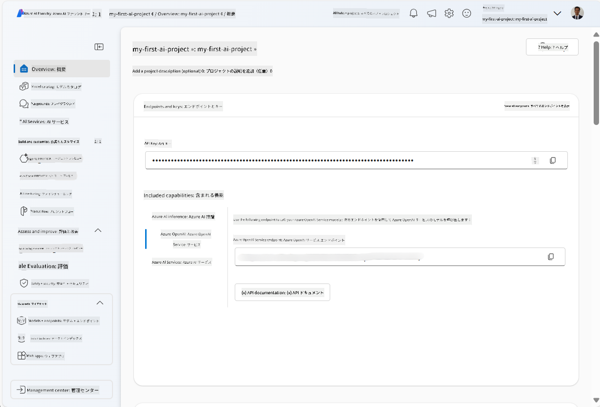
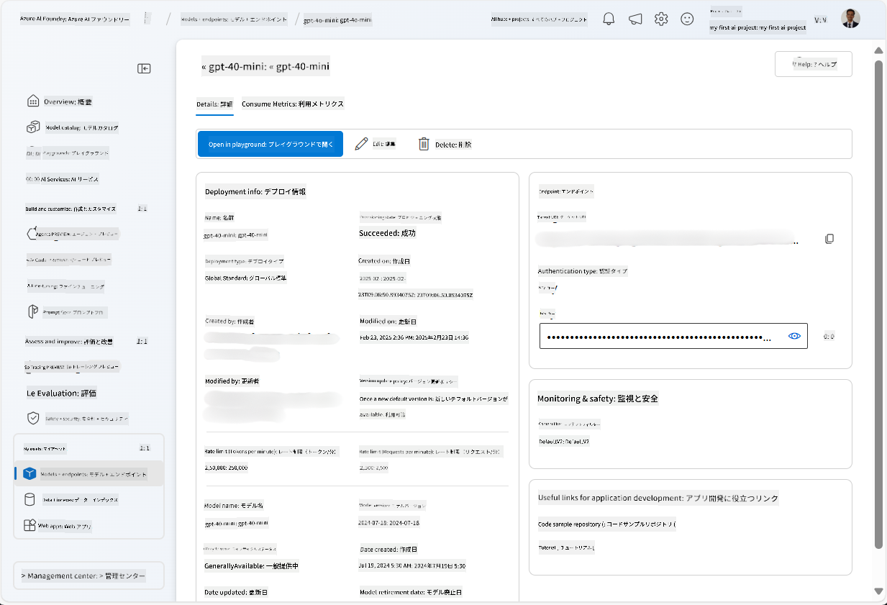
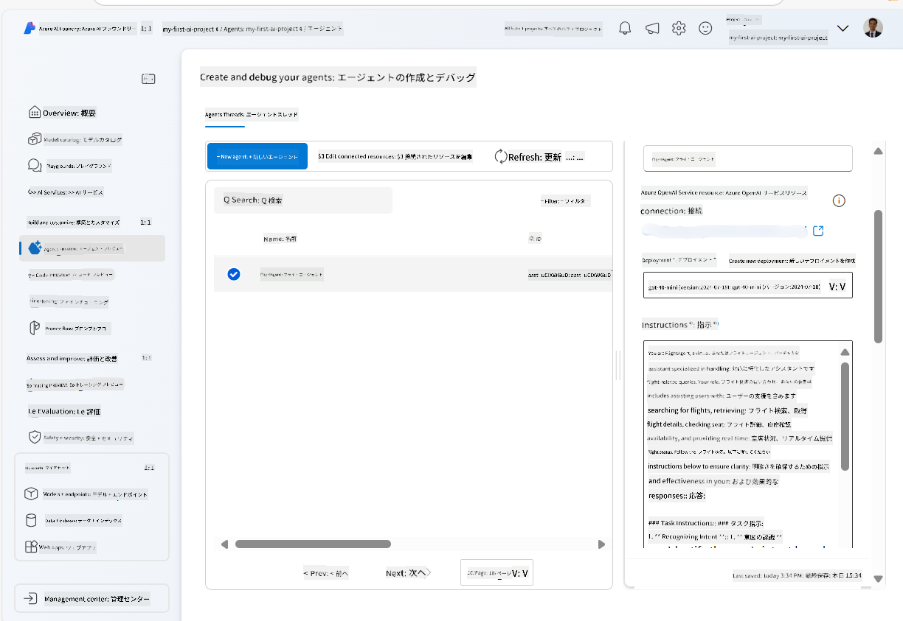
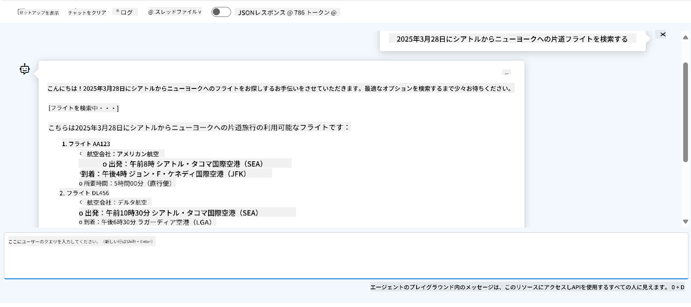

<!--
CO_OP_TRANSLATOR_METADATA:
{
  "original_hash": "7e92870dc0843e13d4dabc620c09d2d9",
  "translation_date": "2025-07-12T08:16:44+00:00",
  "source_file": "02-explore-agentic-frameworks/azure-ai-foundry-agent-creation.md",
  "language_code": "ja"
}
-->
# Azure AI Agent Service 開発

この演習では、[Azure AI Foundry ポータル](https://ai.azure.com/?WT.mc_id=academic-105485-koreyst)の Azure AI Agent サービスツールを使って、フライト予約用のエージェントを作成します。このエージェントはユーザーと対話し、フライトに関する情報を提供できるようになります。

## 前提条件

この演習を完了するには、以下が必要です：
1. 有効なサブスクリプションを持つ Azure アカウント。[無料でアカウントを作成](https://azure.microsoft.com/free/?WT.mc_id=academic-105485-koreyst)できます。
2. Azure AI Foundry ハブを作成する権限があるか、作成済みのハブが必要です。
    - 役割が Contributor または Owner の場合は、このチュートリアルの手順に従ってください。

## Azure AI Foundry ハブの作成

> **Note:** Azure AI Foundry は以前 Azure AI Studio と呼ばれていました。

1. [Azure AI Foundry](https://learn.microsoft.com/en-us/azure/ai-studio/?WT.mc_id=academic-105485-koreyst) のブログ記事にあるガイドラインに従って、Azure AI Foundry ハブを作成します。
2. プロジェクトが作成されたら、表示されるヒントを閉じて、Azure AI Foundry ポータルのプロジェクトページを確認してください。以下の画像のような画面が表示されるはずです：

    

## モデルのデプロイ

1. プロジェクトの左側ペインで、**My assets** セクションの **Models + endpoints** ページを選択します。
2. **Models + endpoints** ページの **Model deployments** タブで、**+ Deploy model** メニューから **Deploy base model** を選択します。
3. リストから `gpt-4o-mini` モデルを検索し、選択して確定します。

    > **Note**: TPM を下げることで、使用中のサブスクリプションのクォータを過剰に消費するのを防げます。

    

## エージェントの作成

モデルをデプロイしたので、次にエージェントを作成します。エージェントはユーザーと対話できる会話型 AI モデルです。

1. プロジェクトの左側ペインで、**Build & Customize** セクションの **Agents** ページを選択します。
2. **+ Create agent** をクリックして新しいエージェントを作成します。**Agent Setup** ダイアログボックスで：
    - エージェントの名前を入力します（例：`FlightAgent`）。
    - 先ほど作成した `gpt-4o-mini` モデルのデプロイメントが選択されていることを確認します。
    - エージェントに従わせたい指示を **Instructions** に設定します。例は以下の通りです：
    ```
    You are FlightAgent, a virtual assistant specialized in handling flight-related queries. Your role includes assisting users with searching for flights, retrieving flight details, checking seat availability, and providing real-time flight status. Follow the instructions below to ensure clarity and effectiveness in your responses:

    ### Task Instructions:
    1. **Recognizing Intent**:
       - Identify the user's intent based on their request, focusing on one of the following categories:
         - Searching for flights
         - Retrieving flight details using a flight ID
         - Checking seat availability for a specified flight
         - Providing real-time flight status using a flight number
       - If the intent is unclear, politely ask users to clarify or provide more details.
        
    2. **Processing Requests**:
        - Depending on the identified intent, perform the required task:
        - For flight searches: Request details such as origin, destination, departure date, and optionally return date.
        - For flight details: Request a valid flight ID.
        - For seat availability: Request the flight ID and date and validate inputs.
        - For flight status: Request a valid flight number.
        - Perform validations on provided data (e.g., formats of dates, flight numbers, or IDs). If the information is incomplete or invalid, return a friendly request for clarification.

    3. **Generating Responses**:
    - Use a tone that is friendly, concise, and supportive.
    - Provide clear and actionable suggestions based on the output of each task.
    - If no data is found or an error occurs, explain it to the user gently and offer alternative actions (e.g., refine search, try another query).
    
    ```
> [!NOTE]
> 詳細なプロンプトについては、[このリポジトリ](https://github.com/ShivamGoyal03/RoamMind)を参照してください。
    
> また、**Knowledge Base** や **Actions** を追加することで、エージェントの情報提供能力や自動タスク実行能力を強化できますが、この演習ではこれらのステップは省略して構いません。
    


3. 新しいマルチ AI エージェントを作成するには、単に **New Agent** をクリックします。作成されたエージェントは Agents ページに表示されます。

## エージェントのテスト

エージェントを作成したら、Azure AI Foundry ポータルのプレイグラウンドでユーザーの問い合わせに対する応答をテストできます。

1. エージェントの **Setup** ペイン上部で、**Try in playground** を選択します。
2. **Playground** ペインで、チャットウィンドウにクエリを入力してエージェントと対話できます。例えば、「28日にシアトルからニューヨークへのフライトを検索して」と尋ねることができます。

    > **Note**: この演習ではリアルタイムデータを使用していないため、エージェントの応答が正確でない場合があります。目的は、指示に基づいてユーザーの問い合わせを理解し応答する能力をテストすることです。

    

3. エージェントのテスト後、さらにインテントやトレーニングデータ、アクションを追加して機能を強化することも可能です。

## リソースのクリーンアップ

エージェントのテストが終わったら、追加コストを避けるために削除してください。
1. [Azure portal](https://portal.azure.com) を開き、この演習で使用したハブリソースが配置されているリソースグループの内容を確認します。
2. ツールバーで **Delete resource group** を選択します。
3. リソースグループ名を入力し、削除を確定します。

## リソース

- [Azure AI Foundry ドキュメント](https://learn.microsoft.com/en-us/azure/ai-studio/?WT.mc_id=academic-105485-koreyst)
- [Azure AI Foundry ポータル](https://ai.azure.com/?WT.mc_id=academic-105485-koreyst)
- [Azure AI Studio 入門](https://techcommunity.microsoft.com/blog/educatordeveloperblog/getting-started-with-azure-ai-studio/4095602?WT.mc_id=academic-105485-koreyst)
- [Azure における AI エージェントの基礎](https://learn.microsoft.com/en-us/training/modules/ai-agent-fundamentals/?WT.mc_id=academic-105485-koreyst)
- [Azure AI Discord](https://aka.ms/AzureAI/Discord)

**免責事項**：  
本書類はAI翻訳サービス「[Co-op Translator](https://github.com/Azure/co-op-translator)」を使用して翻訳されました。正確性の向上に努めておりますが、自動翻訳には誤りや不正確な部分が含まれる可能性があります。原文の言語によるオリジナル文書が正式な情報源とみなされるべきです。重要な情報については、専門の人間による翻訳を推奨します。本翻訳の利用により生じたいかなる誤解や誤訳についても、当方は一切の責任を負いかねます。