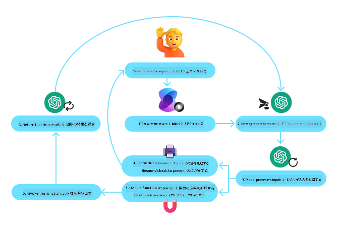
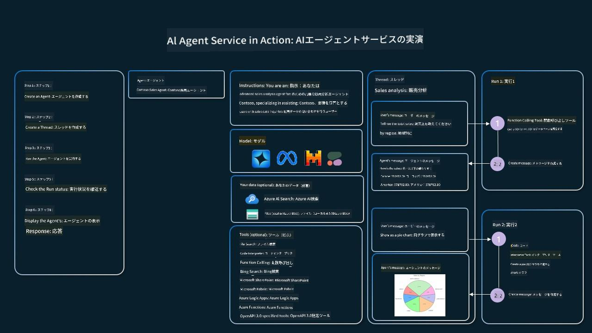

<!--
CO_OP_TRANSLATOR_METADATA:
{
  "original_hash": "4a5ccc4ad1dba85fbc2087cf3b986544",
  "translation_date": "2025-08-29T23:29:24+00:00",
  "source_file": "04-tool-use/README.md",
  "language_code": "ja"
}
-->
[](https://youtu.be/vieRiPRx-gI?si=cEZ8ApnT6Sus9rhn)

> _(上の画像をクリックすると、このレッスンの動画をご覧いただけます)_

# ツール利用デザインパターン

ツールは、AIエージェントに幅広い能力を与えるため、非常に興味深い存在です。エージェントが実行できるアクションが限られている代わりに、ツールを追加することで、エージェントは多様なアクションを実行できるようになります。この章では、ツール利用デザインパターンについて学び、AIエージェントが特定のツールを使用して目標を達成する方法を説明します。

## はじめに

このレッスンでは、以下の質問に答えることを目指します：

- ツール利用デザインパターンとは何か？
- 適用可能なユースケースは何か？
- デザインパターンを実装するために必要な要素/構成要素は何か？
- 信頼性の高いAIエージェントを構築するためにツール利用デザインパターンを使用する際の特別な考慮事項は何か？

## 学習目標

このレッスンを完了すると、以下ができるようになります：

- ツール利用デザインパターンとその目的を定義する。
- ツール利用デザインパターンが適用可能なユースケースを特定する。
- デザインパターンを実装するために必要な主要な要素を理解する。
- このデザインパターンを使用するAIエージェントの信頼性を確保するための考慮事項を認識する。

## ツール利用デザインパターンとは？

**ツール利用デザインパターン**は、LLMが外部ツールと連携して特定の目標を達成する能力を与えることに焦点を当てています。ツールとは、エージェントがアクションを実行するために使用できるコードのことです。ツールは、電卓のような単純な関数や、株価検索や天気予報などのサードパーティサービスへのAPI呼び出しなどがあります。AIエージェントの文脈では、ツールは**モデル生成関数呼び出し**に応じてエージェントによって実行されるように設計されています。

## 適用可能なユースケースは何か？

AIエージェントはツールを活用して複雑なタスクを完了したり、情報を取得したり、意思決定を行ったりすることができます。ツール利用デザインパターンは、データベース、Webサービス、コードインタープリターなどの外部システムとの動的なやり取りが必要なシナリオでよく使用されます。この能力は、以下のようなさまざまなユースケースに役立ちます：

- **動的情報取得**：エージェントは外部APIやデータベースをクエリして最新のデータを取得できます（例：SQLiteデータベースをクエリしてデータ分析を行う、株価や天気情報を取得する）。
- **コードの実行と解釈**：エージェントはコードやスクリプトを実行して数学的問題を解決したり、レポートを生成したり、シミュレーションを行ったりできます。
- **ワークフローの自動化**：タスクスケジューラー、メールサービス、データパイプラインなどのツールを統合して、繰り返し作業や複数ステップのワークフローを自動化します。
- **カスタマーサポート**：エージェントはCRMシステム、チケットプラットフォーム、ナレッジベースと連携してユーザーの問い合わせを解決します。
- **コンテンツ生成と編集**：エージェントは文法チェッカー、テキスト要約ツール、コンテンツ安全性評価ツールなどを活用してコンテンツ作成タスクを支援します。

## ツール利用デザインパターンを実装するために必要な要素/構成要素は何か？

これらの構成要素により、AIエージェントは幅広いタスクを実行できるようになります。ツール利用デザインパターンを実装するために必要な主要な要素を見てみましょう：

- **関数/ツールスキーマ**：利用可能なツールの詳細な定義（関数名、目的、必要なパラメータ、期待される出力など）。これらのスキーマにより、LLMは利用可能なツールと有効なリクエストの構築方法を理解できます。
- **関数実行ロジック**：ユーザーの意図や会話のコンテキストに基づいてツールがどのように、いつ呼び出されるかを管理します。これには、プランナーモジュール、ルーティングメカニズム、またはツール使用を動的に決定する条件フローが含まれる場合があります。
- **メッセージ処理システム**：ユーザー入力、LLM応答、ツール呼び出し、ツール出力間の会話の流れを管理するコンポーネント。
- **ツール統合フレームワーク**：エージェントを単純な関数や複雑な外部サービスに接続するインフラストラクチャ。
- **エラーハンドリングと検証**：ツール実行の失敗を処理し、パラメータを検証し、予期しない応答を管理するメカニズム。
- **状態管理**：会話のコンテキスト、以前のツールとのやり取り、永続的なデータを追跡し、マルチターンのやり取りで一貫性を確保します。

次に、関数/ツール呼び出しについて詳しく見ていきましょう。

### 関数/ツール呼び出し

関数呼び出しは、LLMがツールと連携するための主要な方法です。「関数」と「ツール」はしばしば同義で使用されます。なぜなら、「関数」（再利用可能なコードのブロック）がエージェントがタスクを実行するために使用する「ツール」だからです。関数のコードを呼び出すためには、LLMがユーザーのリクエストを関数の説明と比較する必要があります。このため、利用可能なすべての関数の説明を含むスキーマがLLMに送信されます。LLMはタスクに最も適した関数を選択し、その名前と引数を返します。選択された関数が呼び出され、その応答がLLMに送られ、ユーザーのリクエストに応答するために使用されます。

エージェントの関数呼び出しを実装するために、開発者が必要とするもの：

1. 関数呼び出しをサポートするLLMモデル
2. 関数の説明を含むスキーマ
3. 説明された各関数のコード

サンフランシスコの現在時刻を取得する例を使って説明します：

1. **関数呼び出しをサポートするLLMを初期化する：**

    すべてのモデルが関数呼び出しをサポートしているわけではないため、使用しているLLMが対応しているか確認することが重要です。<a href="https://learn.microsoft.com/azure/ai-services/openai/how-to/function-calling" target="_blank">Azure OpenAI</a>は関数呼び出しをサポートしています。Azure OpenAIクライアントを初期化することから始めます。

    ```python
    # Initialize the Azure OpenAI client
    client = AzureOpenAI(
        azure_endpoint = os.getenv("AZURE_OPENAI_ENDPOINT"), 
        api_key=os.getenv("AZURE_OPENAI_API_KEY"),  
        api_version="2024-05-01-preview"
    )
    ```

1. **関数スキーマを作成する：**

    次に、関数名、関数の目的、関数パラメータの名前と説明を含むJSONスキーマを定義します。このスキーマを、サンフランシスコの時刻を見つけるためのユーザーリクエストとともに、先ほど作成したクライアントに渡します。重要なのは、**ツール呼び出し**が返されることであり、質問への最終的な答えではないことです。前述のように、LLMはタスクに選択した関数の名前と渡される引数を返します。

    ```python
    # Function description for the model to read
    tools = [
        {
            "type": "function",
            "function": {
                "name": "get_current_time",
                "description": "Get the current time in a given location",
                "parameters": {
                    "type": "object",
                    "properties": {
                        "location": {
                            "type": "string",
                            "description": "The city name, e.g. San Francisco",
                        },
                    },
                    "required": ["location"],
                },
            }
        }
    ]
    ```
   
    ```python
  
    # Initial user message
    messages = [{"role": "user", "content": "What's the current time in San Francisco"}] 
  
    # First API call: Ask the model to use the function
      response = client.chat.completions.create(
          model=deployment_name,
          messages=messages,
          tools=tools,
          tool_choice="auto",
      )
  
      # Process the model's response
      response_message = response.choices[0].message
      messages.append(response_message)
  
      print("Model's response:")  

      print(response_message)
  
    ```

    ```bash
    Model's response:
    ChatCompletionMessage(content=None, role='assistant', function_call=None, tool_calls=[ChatCompletionMessageToolCall(id='call_pOsKdUlqvdyttYB67MOj434b', function=Function(arguments='{"location":"San Francisco"}', name='get_current_time'), type='function')])
    ```
  
1. **タスクを実行するために必要な関数コード：**

    LLMが実行する必要がある関数を選択した後、タスクを実行するコードを実装して実行する必要があります。Pythonで現在時刻を取得するコードを実装できます。また、response_messageから名前と引数を抽出して最終結果を取得するコードも記述する必要があります。

    ```python
      def get_current_time(location):
        """Get the current time for a given location"""
        print(f"get_current_time called with location: {location}")  
        location_lower = location.lower()
        
        for key, timezone in TIMEZONE_DATA.items():
            if key in location_lower:
                print(f"Timezone found for {key}")  
                current_time = datetime.now(ZoneInfo(timezone)).strftime("%I:%M %p")
                return json.dumps({
                    "location": location,
                    "current_time": current_time
                })
      
        print(f"No timezone data found for {location_lower}")  
        return json.dumps({"location": location, "current_time": "unknown"})
    ```

     ```python
     # Handle function calls
      if response_message.tool_calls:
          for tool_call in response_message.tool_calls:
              if tool_call.function.name == "get_current_time":
     
                  function_args = json.loads(tool_call.function.arguments)
     
                  time_response = get_current_time(
                      location=function_args.get("location")
                  )
     
                  messages.append({
                      "tool_call_id": tool_call.id,
                      "role": "tool",
                      "name": "get_current_time",
                      "content": time_response,
                  })
      else:
          print("No tool calls were made by the model.")  
  
      # Second API call: Get the final response from the model
      final_response = client.chat.completions.create(
          model=deployment_name,
          messages=messages,
      )
  
      return final_response.choices[0].message.content
     ```

     ```bash
      get_current_time called with location: San Francisco
      Timezone found for san francisco
      The current time in San Francisco is 09:24 AM.
     ```

関数呼び出しは、ほとんどすべてのエージェントツール利用設計の中心にありますが、ゼロから実装するのは時に困難です。[レッスン2](../../../02-explore-agentic-frameworks)で学んだように、エージェントフレームワークはツール利用を実装するための事前構築された構成要素を提供してくれます。

## エージェントフレームワークを使用したツール利用の例

以下は、異なるエージェントフレームワークを使用してツール利用デザインパターンを実装する方法の例です：

### Semantic Kernel

<a href="https://learn.microsoft.com/azure/ai-services/agents/overview" target="_blank">Semantic Kernel</a>は、LLMを使用する.NET、Python、Java開発者向けのオープンソースAIフレームワークです。関数呼び出しを簡素化し、関数とそのパラメータをモデルに自動的に説明する<a href="https://learn.microsoft.com/semantic-kernel/concepts/ai-services/chat-completion/function-calling/?pivots=programming-language-python#1-serializing-the-functions" target="_blank">シリアル化</a>プロセスを通じて実現します。また、モデルとコード間のやり取りを処理します。Semantic Kernelのようなエージェントフレームワークを使用するもう一つの利点は、<a href="https://github.com/microsoft/semantic-kernel/blob/main/python/samples/getting_started_with_agents/openai_assistant/step4_assistant_tool_file_search.py" target="_blank">ファイル検索</a>や<a href="https://github.com/microsoft/semantic-kernel/blob/main/python/samples/getting_started_with_agents/openai_assistant/step3_assistant_tool_code_interpreter.py" target="_blank">コードインタープリター</a>などの事前構築されたツールにアクセスできることです。

以下の図は、Semantic Kernelを使用した関数呼び出しのプロセスを示しています：



Semantic Kernelでは、関数/ツールは<a href="https://learn.microsoft.com/semantic-kernel/concepts/plugins/?pivots=programming-language-python" target="_blank">プラグイン</a>と呼ばれます。先ほど見た`get_current_time`関数をクラスに変換し、その中に関数を含めることでプラグインに変換できます。また、関数の説明を受け取る`kernel_function`デコレーターをインポートすることができます。その後、GetCurrentTimePluginを使用してカーネルを作成すると、カーネルは関数とそのパラメータを自動的にシリアル化し、スキーマを作成してLLMに送信します。

```python
from semantic_kernel.functions import kernel_function

class GetCurrentTimePlugin:
    async def __init__(self, location):
        self.location = location

    @kernel_function(
        description="Get the current time for a given location"
    )
    def get_current_time(location: str = ""):
        ...

```

```python 
from semantic_kernel import Kernel

# Create the kernel
kernel = Kernel()

# Create the plugin
get_current_time_plugin = GetCurrentTimePlugin(location)

# Add the plugin to the kernel
kernel.add_plugin(get_current_time_plugin)
```
  
### Azure AI Agent Service

<a href="https://learn.microsoft.com/azure/ai-services/agents/overview" target="_blank">Azure AI Agent Service</a>は、開発者が高品質で拡張性のあるAIエージェントを安全に構築、展開、スケールできるように設計された新しいエージェントフレームワークです。基盤となるコンピュートやストレージリソースを管理する必要がないため、特にエンタープライズアプリケーションに役立ちます。完全に管理されたサービスであり、エンタープライズグレードのセキュリティを備えています。

LLM APIを直接使用して開発する場合と比較して、Azure AI Agent Serviceは以下の利点を提供します：

- 自動ツール呼び出し – ツール呼び出しを解析し、ツールを呼び出し、応答を処理する必要がなく、これらすべてがサーバー側で行われます。
- 安全に管理されたデータ – 会話状態を管理する代わりに、スレッドを使用して必要な情報をすべて保存できます。
- すぐに使えるツール – Bing、Azure AI Search、Azure Functionsなどのデータソースと連携するためのツールを利用できます。

Azure AI Agent Serviceで利用可能なツールは、以下の2つのカテゴリに分けられます：

1. 知識ツール：
    - <a href="https://learn.microsoft.com/azure/ai-services/agents/how-to/tools/bing-grounding?tabs=python&pivots=overview" target="_blank">Bing検索によるグラウンディング</a>
    - <a href="https://learn.microsoft.com/azure/ai-services/agents/how-to/tools/file-search?tabs=python&pivots=overview" target="_blank">ファイル検索</a>
    - <a href="https://learn.microsoft.com/azure/ai-services/agents/how-to/tools/azure-ai-search?tabs=azurecli%2Cpython&pivots=overview-azure-ai-search" target="_blank">Azure AI Search</a>

2. アクションツール：
    - <a href="https://learn.microsoft.com/azure/ai-services/agents/how-to/tools/function-calling?tabs=python&pivots=overview" target="_blank">関数呼び出し</a>
    - <a href="https://learn.microsoft.com/azure/ai-services/agents/how-to/tools/code-interpreter?tabs=python&pivots=overview" target="_blank">コードインタープリター</a>
    - <a href="https://learn.microsoft.com/azure/ai-services/agents/how-to/tools/openapi-spec?tabs=python&pivots=overview" target="_blank">OpenAI定義ツール</a>
    - <a href="https://learn.microsoft.com/azure/ai-services/agents/how-to/tools/azure-functions?pivots=overview" target="_blank">Azure Functions</a>

Agent Serviceを使用すると、これらのツールを`toolset`として一緒に使用できます。また、特定の会話のメッセージ履歴を追跡する`threads`を利用します。

例えば、Contosoという会社の営業担当者であると仮定します。営業データに関する質問に答える会話型エージェントを開発したいとします。

以下の画像は、Azure AI Agent Serviceを使用して営業データを分析する方法を示しています：



このサービスでツールを使用するには、クライアントを作成し、ツールまたはツールセットを定義します。これを実際に実装するには、以下のPythonコードを使用できます。LLMはツールセットを確認し、ユーザーが作成した関数`fetch_sales_data_using_sqlite_query`を使用するか、事前構築されたコードインタープリターを使用するかをユーザーリクエストに応じて判断します。

```python 
import os
from azure.ai.projects import AIProjectClient
from azure.identity import DefaultAzureCredential
from fetch_sales_data_functions import fetch_sales_data_using_sqlite_query # fetch_sales_data_using_sqlite_query function which can be found in a fetch_sales_data_functions.py file.
from azure.ai.projects.models import ToolSet, FunctionTool, CodeInterpreterTool

project_client = AIProjectClient.from_connection_string(
    credential=DefaultAzureCredential(),
    conn_str=os.environ["PROJECT_CONNECTION_STRING"],
)

# Initialize function calling agent with the fetch_sales_data_using_sqlite_query function and adding it to the toolset
fetch_data_function = FunctionTool(fetch_sales_data_using_sqlite_query)
toolset = ToolSet()
toolset.add(fetch_data_function)

# Initialize Code Interpreter tool and adding it to the toolset. 
code_interpreter = code_interpreter = CodeInterpreterTool()
toolset = ToolSet()
toolset.add(code_interpreter)

agent = project_client.agents.create_agent(
    model="gpt-4o-mini", name="my-agent", instructions="You are helpful agent", 
    toolset=toolset
)
```

## 信頼性の高いAIエージェントを構築するためにツール利用デザインパターンを使用する際の特別な考慮事項は何か？

LLMによって動的に生成されるSQLに関する一般的な懸念は、セキュリティ、特にSQLインジェクションやデータベースの削除や改ざんなどの悪意ある行動のリスクです。これらの懸念は有効ですが、データベースアクセス権限を適切に設定することで効果的に軽減できます。ほとんどのデータベースでは、データベースを読み取り専用に設定することが含まれます。PostgreSQLやAzure SQLのようなデータベースサービスでは、アプリに読み取り専用（SELECT）ロールを割り当てる必要があります。

アプリを安全な環境で実行することで、さらに保護が強化されます。エンタープライズシナリオでは、データは通常、運用システムから抽出され、読み取り専用データベースまたはデータウェア
[Azure AI Foundry Discord](https://aka.ms/ai-agents/discord)に参加して、他の学習者と交流したり、オフィスアワーに参加したり、AI Agentsに関する質問に答えてもらいましょう。

## 追加リソース

## 前のレッスン

[エージェントデザインパターンの理解](../03-agentic-design-patterns/README.md)

## 次のレッスン

[Agentic RAG](../05-agentic-rag/README.md)

---

**免責事項**:  
この文書は、AI翻訳サービス [Co-op Translator](https://github.com/Azure/co-op-translator) を使用して翻訳されています。正確性を追求しておりますが、自動翻訳には誤りや不正確な部分が含まれる可能性があることをご承知ください。元の言語で記載された文書が正式な情報源とみなされるべきです。重要な情報については、専門の人間による翻訳を推奨します。この翻訳の使用に起因する誤解や誤解釈について、当社は責任を負いません。