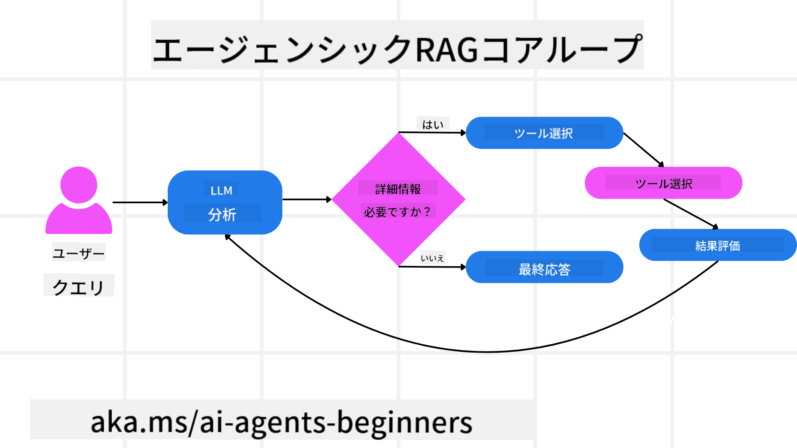
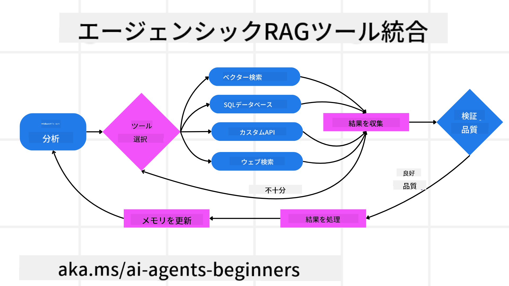
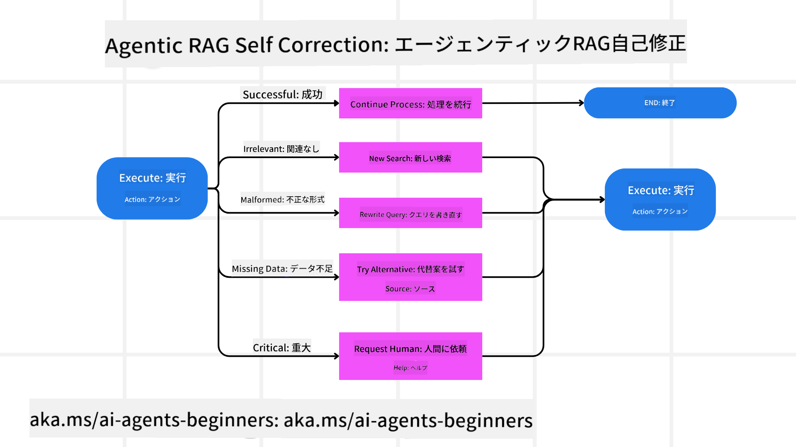
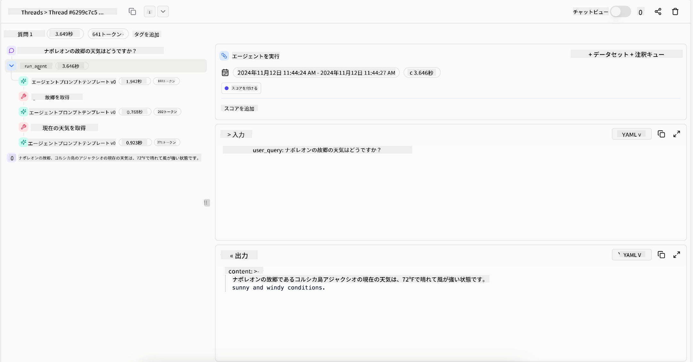
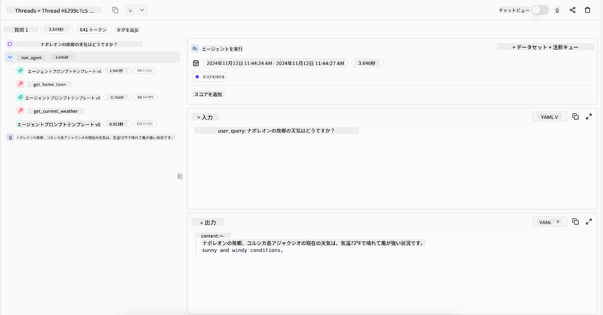

<!--
CO_OP_TRANSLATOR_METADATA:
{
  "original_hash": "7622aa72f9e676e593339f5f694ecd7d",
  "translation_date": "2025-07-12T09:55:01+00:00",
  "source_file": "05-agentic-rag/README.md",
  "language_code": "ja"
}
-->

> _(上の画像をクリックすると、このレッスンの動画が視聴できます)_

# Agentic RAG

このレッスンでは、Agentic Retrieval-Augmented Generation（Agentic RAG）について包括的に解説します。Agentic RAGは、大規模言語モデル（LLM）が外部情報を取り込みながら自律的に次のステップを計画する新しいAIのパラダイムです。静的な「検索して読む」パターンとは異なり、Agentic RAGはLLMへの反復的な呼び出しとツールや関数の呼び出し、構造化された出力を組み合わせて進行します。システムは結果を評価し、クエリを洗練し、必要に応じて追加のツールを呼び出し、満足のいく解決策が得られるまでこのサイクルを繰り返します。

## はじめに

このレッスンで学ぶ内容は以下の通りです。

- **Agentic RAGの理解:** 大規模言語モデル（LLM）が外部データソースから情報を引き出しながら自律的に次のステップを計画する新しいAIパラダイムについて学びます。
- **反復的なメーカー・チェッカー方式の把握:** LLMへの反復呼び出しとツールや関数の呼び出し、構造化された出力を組み合わせたループの仕組みを理解し、正確性の向上や不正確なクエリの処理方法を学びます。
- **実践的な応用例の探求:** Agentic RAGが特に効果を発揮する、正確性重視の環境、複雑なデータベース操作、長期的なワークフローなどのシナリオを特定します。

## 学習目標

このレッスンを終えた後、以下のことができるようになります／理解できます。

- **Agentic RAGの理解:** 大規模言語モデル（LLM）が外部データソースから情報を引き出しながら自律的に次のステップを計画する新しいAIパラダイムについて学びます。
- **反復的なメーカー・チェッカー方式:** LLMへの反復呼び出しとツールや関数の呼び出し、構造化された出力を組み合わせたループの概念を理解し、正確性の向上や不正確なクエリの処理方法を把握します。
- **推論プロセスの自律的管理:** システムが事前に定義された経路に依存せず、自ら問題へのアプローチ方法を決定する能力を理解します。
- **ワークフローの理解:** エージェントモデルが市場動向レポートの取得、競合データの特定、内部販売指標の相関分析、結果の統合、戦略の評価を自律的に行う仕組みを学びます。
- **反復ループ、ツール統合、メモリ:** システムが状態とメモリを保持しながら反復的にやり取りを行い、無駄なループを避けつつ情報に基づいた判断を下す方法を理解します。
- **失敗モードの処理と自己修正:** システムの堅牢な自己修正メカニズム（反復や再クエリ、診断ツールの活用、人間の監督へのフォールバック）について学びます。
- **エージェンシーの限界:** Agentic RAGの制約（ドメイン固有の自律性、インフラ依存、ガードレールの尊重）を理解します。
- **実用的なユースケースと価値:** 正確性重視の環境、複雑なデータベース操作、長期的なワークフローなど、Agentic RAGが特に有効なシナリオを特定します。
- **ガバナンス、透明性、信頼:** 説明可能な推論、バイアス制御、人間の監督など、ガバナンスと透明性の重要性を学びます。

## Agentic RAGとは？

Agentic Retrieval-Augmented Generation（Agentic RAG）は、大規模言語モデル（LLM）が外部情報を取り込みながら自律的に次のステップを計画する新しいAIパラダイムです。静的な「検索して読む」パターンとは異なり、Agentic RAGはLLMへの反復的な呼び出しとツールや関数の呼び出し、構造化された出力を組み合わせて進行します。システムは結果を評価し、クエリを洗練し、必要に応じて追加のツールを呼び出し、満足のいく解決策が得られるまでこのサイクルを繰り返します。この反復的な「メーカー・チェッカー」方式により、正確性が向上し、不正確なクエリの処理や高品質な結果の保証が可能になります。

システムは自らの推論プロセスを積極的に管理し、失敗したクエリを書き換え、異なる検索方法を選択し、Azure AI Searchのベクトル検索、SQLデータベース、カスタムAPIなど複数のツールを統合して最終回答を導き出します。Agenticシステムの特徴は、自らの推論プロセスを所有する能力にあります。従来のRAGは事前定義された経路に依存しますが、Agenticシステムは得られた情報の質に基づいて自律的にステップの順序を決定します。

## Agentic Retrieval-Augmented Generation（Agentic RAG）の定義

Agentic Retrieval-Augmented Generation（Agentic RAG）は、LLMが外部データソースから情報を引き出すだけでなく、自律的に次のステップを計画するAI開発の新しいパラダイムです。静的な「検索して読む」パターンや厳密にスクリプト化されたプロンプトシーケンスとは異なり、Agentic RAGはLLMへの反復的な呼び出しとツールや関数の呼び出し、構造化された出力を組み合わせたループで構成されます。システムは得られた結果を評価し、クエリを洗練し、必要に応じて追加のツールを呼び出し、満足のいく解決策が得られるまでこのサイクルを繰り返します。

この反復的な「メーカー・チェッカー」方式は、正確性の向上、不正確なクエリの処理（例：NL2SQL）、バランスの取れた高品質な結果の保証を目的としています。単に精巧に設計されたプロンプトチェーンに頼るのではなく、システムは自らの推論プロセスを所有します。失敗したクエリを書き換え、異なる検索方法を選択し、Azure AI Searchのベクトル検索、SQLデータベース、カスタムAPIなど複数のツールを統合して最終回答を導き出します。これにより、過度に複雑なオーケストレーションフレームワークは不要となり、「LLM呼び出し → ツール使用 → LLM呼び出し → …」という比較的シンプルなループで高度かつ根拠のある出力が得られます。

## 推論プロセスの自律的管理

システムを「Agentic」とする特徴は、自らの推論プロセスを所有する能力にあります。従来のRAGは、人間がモデルのために取得すべき情報やタイミングを示す思考の連鎖（chain-of-thought）を事前に定義することに依存していました。
しかし、本当にAgenticなシステムは、問題へのアプローチ方法を内部で決定します。単にスクリプトを実行するのではなく、得られた情報の質に基づいてステップの順序を自律的に決定します。
例えば、製品発売戦略の作成を依頼された場合、全ての調査や意思決定のワークフローを詳細に示すプロンプトに頼るのではなく、Agenticモデルは以下のように独自に判断します。

1. Bing Web Groundingを使って最新の市場動向レポートを取得する
2. Azure AI Searchを使って関連する競合データを特定する
3. Azure SQL Databaseを使って過去の内部販売指標を相関分析する
4. Azure OpenAI Serviceを通じて調査結果を統合し、一貫した戦略を構築する
5. 戦略のギャップや矛盾を評価し、必要に応じて再度情報を取得する

これらのステップはすべて、クエリの洗練、情報源の選択、回答に満足するまでの反復を含め、モデル自身が決定し、人間が事前にスクリプト化したものではありません。

## 反復ループ、ツール統合、メモリ

Agenticシステムはループ状のインタラクションパターンに依存しています。

- **初回呼び出し:** ユーザーの目標（ユーザープロンプト）がLLMに提示されます。
- **ツール呼び出し:** モデルが情報不足や曖昧な指示を検出した場合、ベクトルデータベースクエリ（例：Azure AI Searchのハイブリッド検索）や構造化されたSQL呼び出しなどのツールや検索方法を選択して追加情報を収集します。
- **評価と洗練:** 返されたデータをレビューし、情報が十分かどうかを判断します。不十分な場合はクエリを洗練し、別のツールを試すかアプローチを調整します。
- **満足するまで繰り返し:** モデルが最終的に十分な明確さと根拠を得て、よく考えられた回答を提供できると判断するまでこのサイクルを続けます。
- **メモリと状態管理:** システムはステップ間で状態とメモリを保持するため、過去の試行や結果を記憶し、無駄なループを避けつつより賢明な判断を下せます。

これにより、モデルは進化する理解を持つかのように複雑で多段階のタスクを、人間の介入やプロンプトの再構築なしに進められるようになります。

## 失敗モードの処理と自己修正

Agentic RAGの自律性には堅牢な自己修正メカニズムも含まれます。システムが行き詰まった場合（例えば、無関係な文書を取得したり、不正確なクエリに遭遇した場合）には以下の対応を行います。

- **反復と再クエリ:** 低品質な回答を返す代わりに、新しい検索戦略を試したり、データベースクエリを書き換えたり、別のデータセットを参照します。
- **診断ツールの活用:** 推論ステップのデバッグや取得データの正確性確認を支援する追加機能を呼び出すことがあります。Azure AI Tracingのようなツールは堅牢な可観測性とモニタリングを可能にします。
- **人間の監督へのフォールバック:** 重要度が高い、または繰り返し失敗するケースでは、不確実性を示し人間の指導を求めることがあります。人間からの修正フィードバックを受けて、モデルは以降の処理に反映させます。

この反復的かつ動的なアプローチにより、モデルは単発のシステムではなく、セッション中の誤りから学習し続ける能力を持ちます。

## エージェンシーの限界

Agentic RAGはタスク内での自律性を持つものの、人工汎用知能（AGI）とは異なります。その「Agentic」な能力は、人間の開発者が提供したツール、データソース、ポリシーの範囲内に限定されます。独自にツールを発明したり、設定されたドメインの枠を超えたりすることはできません。むしろ、手元のリソースを動的にオーケストレーションすることに優れています。
より高度なAI形態との主な違いは以下の通りです。

1. **ドメイン固有の自律性:** Agentic RAGシステムは既知のドメイン内でユーザー定義の目標達成に集中し、クエリの書き換えやツール選択などの戦略を用いて成果を向上させます。
2. **インフラ依存:** システムの能力は開発者が統合したツールやデータに依存し、人間の介入なしにこれらの境界を超えることはできません。
3. **ガードレールの尊重:** 倫理ガイドライン、コンプライアンス規則、ビジネスポリシーは非常に重要であり、エージェントの自由は常に安全対策や監督メカニズムによって制約されます（願わくば）。

## 実用的なユースケースと価値

Agentic RAGは反復的な洗練と精度が求められるシナリオで特に効果を発揮します。

1. **正確性重視の環境:** コンプライアンスチェック、規制分析、法務調査などで、エージェントモデルは事実を繰り返し検証し、複数の情報源を参照し、クエリを書き換えながら徹底的に検証された回答を生成します。
2. **複雑なデータベース操作:** クエリが失敗しやすい、または調整が必要な構造化データを扱う場合、システムはAzure SQLやMicrosoft Fabric OneLakeを使って自律的にクエリを洗練し、最終的な取得結果がユーザーの意図に合致するようにします。
3. **長期的なワークフロー:** 新しい情報が出てくるにつれてセッションが進化する場合、Agentic RAGは継続的に新データを取り込み、問題領域の理解を深めながら戦略を変化させます。

## ガバナンス、透明性、信頼

これらのシステムが推論においてより自律的になるにつれ、ガバナンスと透明性が重要になります。

- **説明可能な推論:** モデルは実行したクエリ、参照した情報源、結論に至る推論ステップの監査証跡を提供できます。Azure AI Content SafetyやAzure AI Tracing / GenAIOpsのようなツールが透明性の維持とリスク軽減に役立ちます。
- **バイアス制御とバランスの取れた検索:** 開発者は検索戦略を調整し、代表性のあるデータソースを考慮するようにし、Azure Machine Learningを使った高度なデータサイエンス組織向けのカスタムモデルで出力のバイアスや偏りを定期的に監査します。
- **人間の監督とコンプライアンス:** 敏感なタスクでは人間のレビューが不可欠です。Agentic RAGは高リスクの意思決定において人間の判断を置き換えるのではなく、より徹底的に検証された選択肢を提供して補完します。

行動の明確な記録を提供するツールが不可欠です。これがなければ、多段階プロセスのデバッグは非常に困難になります。以下はLiteral AI（Chainlitの開発元）によるAgent実行例です。

## まとめ

Agentic RAGは、AIシステムが複雑でデータ集約的なタスクを扱う方法の自然な進化を示しています。ループ状のインタラクションパターンを採用し、自律的にツールを選択し、クエリを洗練して高品質な結果を得るまで繰

- <a href="https://learn.microsoft.com/azure/ai-studio/concepts/evaluation-approach-gen-ai" target="_blank">Azure AI Foundryによる生成AIアプリケーションの評価：この資料では、Agentic AIアプリケーションやRAGアーキテクチャを含む、公開データセット上でのモデルの評価と比較について解説しています</a>
- <a href="https://weaviate.io/blog/what-is-agentic-rag" target="_blank">Agentic RAGとは | Weaviate</a>
- <a href="https://ragaboutit.com/agentic-rag-a-complete-guide-to-agent-based-retrieval-augmented-generation/" target="_blank">Agentic RAG：エージェントベースのRetrieval Augmented Generation完全ガイド – generation RAGからの最新情報</a>
- <a href="https://huggingface.co/learn/cookbook/agent_rag" target="_blank">Agentic RAG：クエリの再構成と自己クエリでRAGを強化！Hugging FaceオープンソースAIクックブック</a>
- <a href="https://youtu.be/aQ4yQXeB1Ss?si=2HUqBzHoeB5tR04U" target="_blank">RAGにAgenticレイヤーを追加する方法</a>
- <a href="https://www.youtube.com/watch?v=zeAyuLc_f3Q&t=244s" target="_blank">知識アシスタントの未来：Jerry Liu</a>
- <a href="https://www.youtube.com/watch?v=AOSjiXP1jmQ" target="_blank">Agentic RAGシステムの構築方法</a>
- <a href="https://ignite.microsoft.com/sessions/BRK102?source=sessions" target="_blank">Azure AI Foundry Agent Serviceを使ってAIエージェントをスケールさせる方法</a>

### 学術論文

- <a href="https://arxiv.org/abs/2303.17651" target="_blank">2303.17651 Self-Refine：自己フィードバックによる反復的な改善</a>
- <a href="https://arxiv.org/abs/2303.11366" target="_blank">2303.11366 Reflexion：言語エージェントと口頭強化学習</a>
- <a href="https://arxiv.org/abs/2305.11738" target="_blank">2305.11738 CRITIC：大規模言語モデルはツールを使った対話的批評で自己修正可能</a>
- <a href="https://arxiv.org/abs/2501.09136" target="_blank">2501.09136 Agentic Retrieval-Augmented Generation：Agentic RAGに関する調査</a>

## 前のレッスン

[Tool Use Design Pattern](../04-tool-use/README.md)

## 次のレッスン

[Building Trustworthy AI Agents](../06-building-trustworthy-agents/README.md)

**免責事項**：  
本書類はAI翻訳サービス「[Co-op Translator](https://github.com/Azure/co-op-translator)」を使用して翻訳されました。正確性を期しておりますが、自動翻訳には誤りや不正確な部分が含まれる可能性があります。原文の言語によるオリジナル文書が正式な情報源とみなされるべきです。重要な情報については、専門の人間による翻訳を推奨します。本翻訳の利用により生じた誤解や誤訳について、当方は一切の責任を負いかねます。