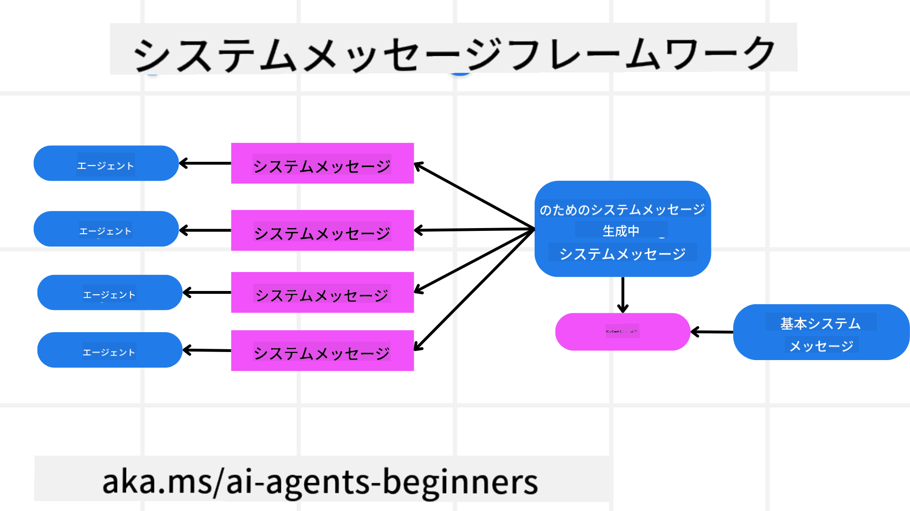
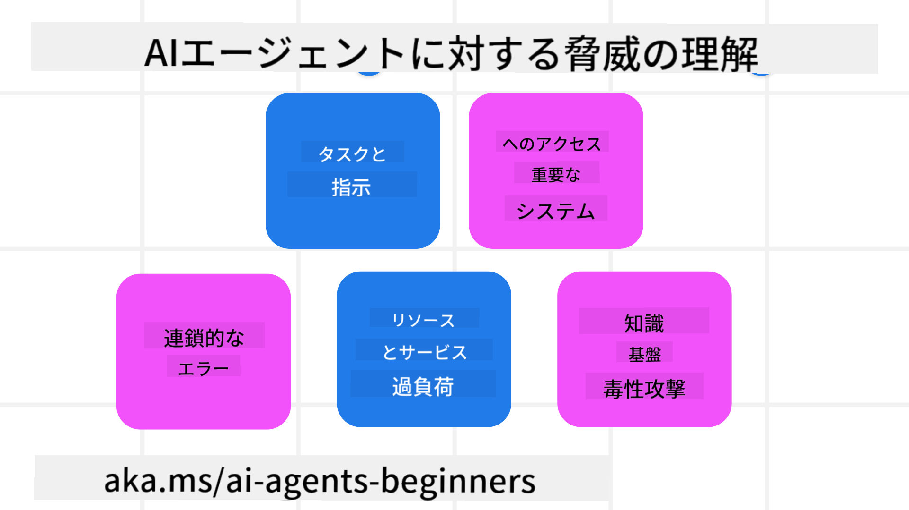
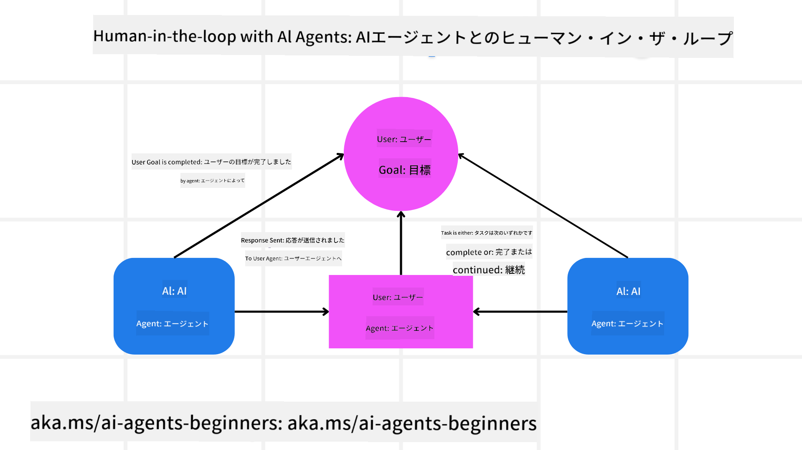

<!--
CO_OP_TRANSLATOR_METADATA:
{
  "original_hash": "f57852cac3a86c4a5ef47f793cc12178",
  "translation_date": "2025-07-12T10:23:48+00:00",
  "source_file": "06-building-trustworthy-agents/README.md",
  "language_code": "ja"
}
-->
[](https://youtu.be/iZKkMEGBCUQ?si=Q-kEbcyHUMPoHp8L)

> _(上の画像をクリックすると、このレッスンの動画が視聴できます)_

# 信頼できるAIエージェントの構築

## はじめに

このレッスンでは以下を扱います：

- 安全で効果的なAIエージェントの構築と展開方法
- AIエージェント開発時の重要なセキュリティ上の考慮点
- AIエージェント開発におけるデータとユーザープライバシーの維持方法

## 学習目標

このレッスンを終えた後、以下のことができるようになります：

- AIエージェント作成時のリスクを特定し、軽減する方法
- データとアクセスを適切に管理するためのセキュリティ対策の実装
- データプライバシーを守りつつ、質の高いユーザー体験を提供するAIエージェントの作成

## 安全性

まずは安全なエージェントアプリケーションの構築について見ていきましょう。安全性とは、AIエージェントが設計通りに動作することを意味します。エージェントアプリケーションの開発者として、安全性を最大化するための方法やツールがあります。

### システムメッセージフレームワークの構築

もしこれまでに大規模言語モデル（LLM）を使ったAIアプリケーションを作ったことがあれば、堅牢なシステムプロンプトやシステムメッセージの設計がいかに重要かご存知でしょう。これらのプロンプトは、LLMがユーザーやデータとどのようにやり取りするかのメタルールや指示、ガイドラインを定めます。

AIエージェントの場合、システムプロンプトはさらに重要です。なぜなら、AIエージェントは私たちが設計したタスクを完遂するために、非常に具体的な指示が必要だからです。

スケーラブルなシステムプロンプトを作成するために、アプリケーション内で1つ以上のエージェントを構築するためのシステムメッセージフレームワークを使うことができます：



#### ステップ1: メタシステムメッセージの作成

メタプロンプトは、LLMが作成するエージェント用のシステムプロンプトを生成するために使います。テンプレートとして設計することで、必要に応じて複数のエージェントを効率的に作成できます。

以下はLLMに与えるメタシステムメッセージの例です：

```plaintext
You are an expert at creating AI agent assistants. 
You will be provided a company name, role, responsibilities and other
information that you will use to provide a system prompt for.
To create the system prompt, be descriptive as possible and provide a structure that a system using an LLM can better understand the role and responsibilities of the AI assistant. 
```

#### ステップ2: 基本プロンプトの作成

次に、AIエージェントを説明する基本的なプロンプトを作成します。エージェントの役割、完了するタスク、その他の責任を含めるべきです。

例はこちら：

```plaintext
You are a travel agent for Contoso Travel that is great at booking flights for customers. To help customers you can perform the following tasks: lookup available flights, book flights, ask for preferences in seating and times for flights, cancel any previously booked flights and alert customers on any delays or cancellations of flights.  
```

#### ステップ3: 基本システムメッセージをLLMに提供

ここで、メタシステムメッセージをシステムメッセージとして、基本システムメッセージと共に提供し、このシステムメッセージを最適化します。

これにより、AIエージェントをより適切に導くシステムメッセージが生成されます：

```markdown
**Company Name:** Contoso Travel  
**Role:** Travel Agent Assistant

**Objective:**  
You are an AI-powered travel agent assistant for Contoso Travel, specializing in booking flights and providing exceptional customer service. Your main goal is to assist customers in finding, booking, and managing their flights, all while ensuring that their preferences and needs are met efficiently.

**Key Responsibilities:**

1. **Flight Lookup:**
    
    - Assist customers in searching for available flights based on their specified destination, dates, and any other relevant preferences.
    - Provide a list of options, including flight times, airlines, layovers, and pricing.
2. **Flight Booking:**
    
    - Facilitate the booking of flights for customers, ensuring that all details are correctly entered into the system.
    - Confirm bookings and provide customers with their itinerary, including confirmation numbers and any other pertinent information.
3. **Customer Preference Inquiry:**
    
    - Actively ask customers for their preferences regarding seating (e.g., aisle, window, extra legroom) and preferred times for flights (e.g., morning, afternoon, evening).
    - Record these preferences for future reference and tailor suggestions accordingly.
4. **Flight Cancellation:**
    
    - Assist customers in canceling previously booked flights if needed, following company policies and procedures.
    - Notify customers of any necessary refunds or additional steps that may be required for cancellations.
5. **Flight Monitoring:**
    
    - Monitor the status of booked flights and alert customers in real-time about any delays, cancellations, or changes to their flight schedule.
    - Provide updates through preferred communication channels (e.g., email, SMS) as needed.

**Tone and Style:**

- Maintain a friendly, professional, and approachable demeanor in all interactions with customers.
- Ensure that all communication is clear, informative, and tailored to the customer's specific needs and inquiries.

**User Interaction Instructions:**

- Respond to customer queries promptly and accurately.
- Use a conversational style while ensuring professionalism.
- Prioritize customer satisfaction by being attentive, empathetic, and proactive in all assistance provided.

**Additional Notes:**

- Stay updated on any changes to airline policies, travel restrictions, and other relevant information that could impact flight bookings and customer experience.
- Use clear and concise language to explain options and processes, avoiding jargon where possible for better customer understanding.

This AI assistant is designed to streamline the flight booking process for customers of Contoso Travel, ensuring that all their travel needs are met efficiently and effectively.

```

#### ステップ4: 繰り返し改善する

このシステムメッセージフレームワークの価値は、複数のエージェントのシステムメッセージ作成をスケールしやすくし、時間をかけてシステムメッセージを改善できる点にあります。最初から完全なユースケースに合うシステムメッセージができることは稀です。基本システムメッセージを変更してシステムにかけることで、小さな調整や改善を行い、結果を比較・評価できます。

## 脅威の理解

信頼できるAIエージェントを構築するには、AIエージェントに対するリスクや脅威を理解し、軽減することが重要です。ここではAIエージェントに対するいくつかの脅威と、それにどう備えるかを見ていきます。



### タスクと指示の改ざん

**説明:** 攻撃者がプロンプトや入力を操作して、AIエージェントの指示や目標を変更しようとします。

**軽減策:** AIエージェントが処理する前に、危険なプロンプトを検出するための検証チェックや入力フィルターを実行します。これらの攻撃は通常、エージェントとの頻繁なやり取りを必要とするため、会話のターン数を制限することも有効です。

### 重要システムへのアクセス

**説明:** AIエージェントが機密データを保存するシステムやサービスにアクセスできる場合、攻撃者はエージェントとこれらのサービス間の通信を侵害する可能性があります。これは直接的な攻撃や、エージェントを通じてシステム情報を得ようとする間接的な試みも含みます。

**軽減策:** AIエージェントには必要最低限のシステムアクセスのみを許可し、通信は安全に行うべきです。認証やアクセス制御の実装も情報保護に役立ちます。

### リソースやサービスの過負荷

**説明:** AIエージェントはタスク完了のために様々なツールやサービスにアクセスします。攻撃者はこれを利用し、AIエージェント経由で大量のリクエストを送信し、システム障害や高額なコストを引き起こす可能性があります。

**軽減策:** AIエージェントがサービスに送信できるリクエスト数を制限するポリシーを実装します。会話のターン数やリクエスト数の制限もこの種の攻撃を防ぐ手段です。

### ナレッジベースの汚染

**説明:** この攻撃はAIエージェント自体を直接狙うのではなく、エージェントが利用するナレッジベースや他のサービスを標的にします。データや情報を汚染することで、偏ったり意図しない応答をユーザーに返す原因となります。

**軽減策:** AIエージェントがワークフローで使用するデータを定期的に検証し、アクセスは信頼できる人物のみに限定して安全を確保します。

### 連鎖的なエラー

**説明:** AIエージェントは複数のツールやサービスにアクセスしてタスクを完了します。攻撃者によるエラーが他の接続されたシステムの障害を引き起こし、攻撃が広範囲に及び、トラブルシューティングが困難になることがあります。

**軽減策:** AIエージェントをDockerコンテナなどの限定された環境で動作させ、直接的なシステム攻撃を防ぐ方法があります。また、特定のシステムがエラーを返した際のフォールバック機構やリトライロジックを作成することも大規模な障害を防ぐ手段です。

## ヒューマン・イン・ザ・ループ

信頼できるAIエージェントシステムを構築するもう一つの効果的な方法は、ヒューマン・イン・ザ・ループを活用することです。これにより、ユーザーが実行中のエージェントにフィードバックを提供できるフローが生まれます。ユーザーはマルチエージェントシステムの一員として、実行プロセスの承認や終了を行います。



以下はAutoGenを使ってこの概念を実装したコードスニペットです：

```python

# Create the agents.
model_client = OpenAIChatCompletionClient(model="gpt-4o-mini")
assistant = AssistantAgent("assistant", model_client=model_client)
user_proxy = UserProxyAgent("user_proxy", input_func=input)  # Use input() to get user input from console.

# Create the termination condition which will end the conversation when the user says "APPROVE".
termination = TextMentionTermination("APPROVE")

# Create the team.
team = RoundRobinGroupChat([assistant, user_proxy], termination_condition=termination)

# Run the conversation and stream to the console.
stream = team.run_stream(task="Write a 4-line poem about the ocean.")
# Use asyncio.run(...) when running in a script.
await Console(stream)

```

## まとめ

信頼できるAIエージェントを構築するには、慎重な設計、堅牢なセキュリティ対策、継続的な改善が必要です。構造化されたメタプロンプトシステムの導入、潜在的な脅威の理解と軽減策の適用により、安全かつ効果的なAIエージェントを開発できます。さらに、ヒューマン・イン・ザ・ループのアプローチを取り入れることで、ユーザーのニーズに沿いながらリスクを最小限に抑えたAIエージェントの運用が可能になります。AIが進化し続ける中で、セキュリティ、プライバシー、倫理的配慮に積極的に取り組むことが、AI駆動システムの信頼性と信頼を築く鍵となります。

## 追加リソース

- <a href="https://learn.microsoft.com/azure/ai-studio/responsible-use-of-ai-overview" target="_blank">Responsible AI overview</a>
- <a href="https://learn.microsoft.com/azure/ai-studio/concepts/evaluation-approach-gen-ai" target="_blank">Evaluation of generative AI models and AI applications</a>
- <a href="https://learn.microsoft.com/azure/ai-services/openai/concepts/system-message?context=%2Fazure%2Fai-studio%2Fcontext%2Fcontext&tabs=top-techniques" target="_blank">Safety system messages</a>
- <a href="https://blogs.microsoft.com/wp-content/uploads/prod/sites/5/2022/06/Microsoft-RAI-Impact-Assessment-Template.pdf?culture=en-us&country=us" target="_blank">Risk Assessment Template</a>

## 前のレッスン

[Agentic RAG](../05-agentic-rag/README.md)

## 次のレッスン

[Planning Design Pattern](../07-planning-design/README.md)

**免責事項**：  
本書類はAI翻訳サービス「[Co-op Translator](https://github.com/Azure/co-op-translator)」を使用して翻訳されました。正確性を期しておりますが、自動翻訳には誤りや不正確な部分が含まれる可能性があります。原文の言語によるオリジナル文書が正式な情報源とみなされるべきです。重要な情報については、専門の人間による翻訳を推奨します。本翻訳の利用により生じた誤解や誤訳について、当方は一切の責任を負いかねます。