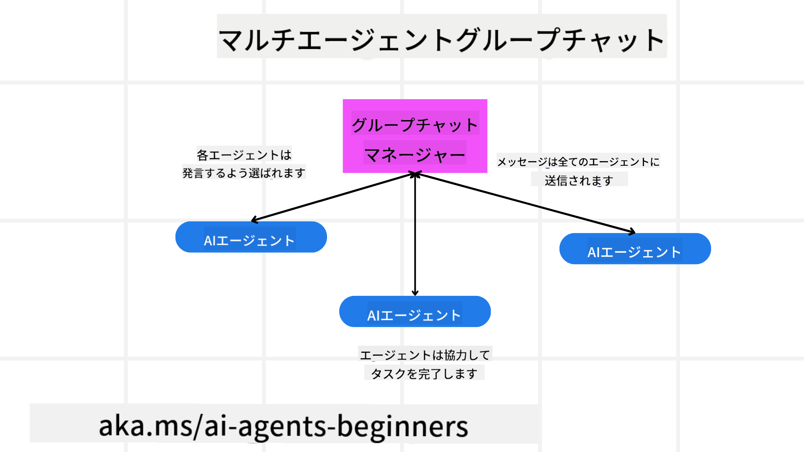
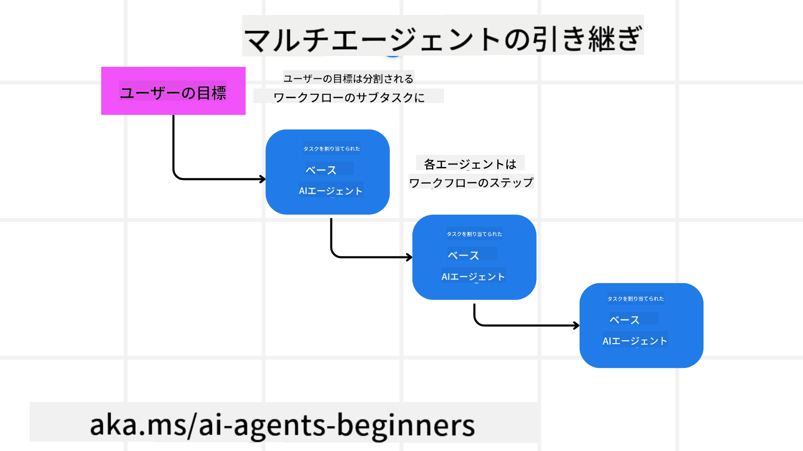
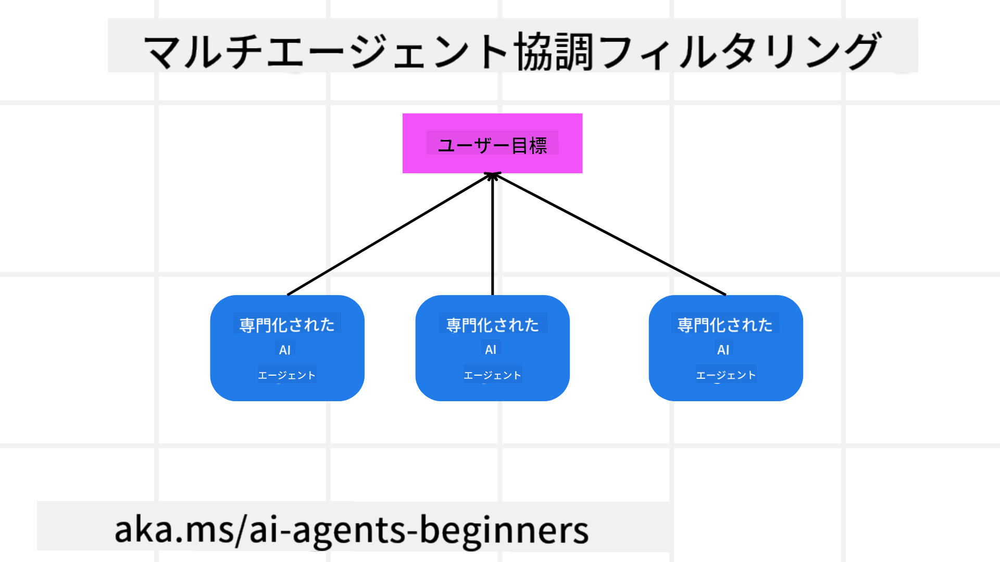

<!--
CO_OP_TRANSLATOR_METADATA:
{
  "original_hash": "c692a8975d7d5b99575a553de1c5e8a7",
  "translation_date": "2025-07-12T10:59:01+00:00",
  "source_file": "08-multi-agent/README.md",
  "language_code": "ja"
}
-->

> _(上の画像をクリックすると、このレッスンの動画が視聴できます)_

# マルチエージェント設計パターン

複数のエージェントが関わるプロジェクトに取り組み始めると、マルチエージェント設計パターンを考慮する必要があります。しかし、いつマルチエージェントに切り替えるべきか、その利点は何かがすぐには明確でないこともあります。

## はじめに

このレッスンでは、以下の疑問に答えます：

- マルチエージェントが適用されるシナリオとは？
- 複数のエージェントを使うことの、単一エージェントで複数のタスクをこなす場合との違いは？
- マルチエージェント設計パターンを実装するための基本要素は何か？
- 複数のエージェントがどのように相互作用しているかをどう可視化するか？

## 学習目標

このレッスンを終えた後、あなたは以下ができるようになります：

- マルチエージェントが適用されるシナリオを特定できる
- 単一エージェントよりマルチエージェントを使う利点を理解できる
- マルチエージェント設計パターンの基本要素を理解できる

全体像は？

*マルチエージェントは、複数のエージェントが協力して共通の目標を達成するための設計パターンです*。

このパターンは、ロボティクス、自律システム、分散コンピューティングなど、さまざまな分野で広く使われています。

## マルチエージェントが適用されるシナリオ

では、どんなシナリオでマルチエージェントの利用が適しているのでしょうか？答えは、多くのシナリオで複数のエージェントを使うことが有効で、特に以下のような場合です：

- **大規模な作業負荷**：大きな作業負荷は小さなタスクに分割して異なるエージェントに割り当てることができ、並列処理でより速く完了できます。例えば、大量のデータ処理タスクがこれに当たります。
- **複雑なタスク**：複雑なタスクも小さなサブタスクに分けて、それぞれ特定の分野に特化したエージェントに割り当てられます。自律走行車の例では、ナビゲーション、障害物検知、他車両との通信を担当するエージェントがそれぞれ存在します。
- **多様な専門知識**：異なるエージェントが多様な専門知識を持つことで、単一のエージェントよりも効果的にタスクの異なる側面を処理できます。医療分野の例では、診断、治療計画、患者モニタリングを担当するエージェントがいます。

## 単一エージェントよりマルチエージェントを使う利点

単一エージェントシステムは単純なタスクには適していますが、より複雑なタスクでは複数のエージェントを使うことで以下のような利点があります：

- **専門化**：各エージェントが特定のタスクに特化できます。単一エージェントはすべてをこなそうとしますが、複雑なタスクに直面すると何をすべきか混乱し、最適でないタスクを行うこともあります。
- **スケーラビリティ**：システムの拡張は、単一エージェントに負荷をかけるよりも、エージェントを追加する方が容易です。
- **フォールトトレランス**：一つのエージェントが故障しても、他のエージェントが機能を継続できるため、システムの信頼性が高まります。

例として、ユーザーの旅行予約を考えてみましょう。単一エージェントシステムでは、フライト検索からホテルやレンタカーの予約まで全てを担当しなければなりません。これには多くのツールが必要で、複雑で保守や拡張が難しいモノリシックなシステムになりがちです。一方、マルチエージェントシステムでは、フライト検索、ホテル予約、レンタカー予約をそれぞれ専門とするエージェントが存在し、システムはよりモジュール化され、保守や拡張が容易になります。

これは、家族経営の旅行代理店とフランチャイズの旅行代理店を比較するようなものです。家族経営の店は単一のエージェントが全てを担当し、フランチャイズは異なるエージェントがそれぞれの役割を担います。

## マルチエージェント設計パターンの基本要素

マルチエージェント設計パターンを実装する前に、その基本要素を理解する必要があります。

再び旅行予約の例で具体的に見てみましょう。この場合、基本要素には以下が含まれます：

- **エージェント間通信**：フライト検索、ホテル予約、レンタカー予約のエージェントは、ユーザーの希望や制約に関する情報を共有し合う必要があります。具体的には、フライト検索エージェントがホテル予約エージェントと連携し、同じ日程でホテルを予約できるようにする必要があります。つまり、どのエージェントがどの情報をどのように共有するかを決める必要があります。
- **調整メカニズム**：エージェントはユーザーの希望や制約を満たすために行動を調整しなければなりません。例えば、ユーザーが空港近くのホテルを希望し、レンタカーは空港でしか借りられない場合、ホテル予約エージェントとレンタカー予約エージェントが連携して調整する必要があります。つまり、エージェントがどのように行動を調整するかを決める必要があります。
- **エージェントアーキテクチャ**：エージェントは意思決定し、ユーザーとのやり取りから学習する内部構造を持つ必要があります。例えば、フライト検索エージェントは過去のユーザーの好みに基づいて推奨フライトを決定するために機械学習モデルを使うことがあります。つまり、エージェントがどのように意思決定し、学習するかを決める必要があります。
- **マルチエージェント間の可視性**：複数のエージェントがどのように相互作用しているかを把握できる必要があります。これには、エージェントの活動や相互作用を追跡するためのツールや技術が必要です。ログやモニタリングツール、可視化ツール、パフォーマンス指標などが該当します。
- **マルチエージェントパターン**：集中型、分散型、ハイブリッド型など、マルチエージェントシステムを実装するためのさまざまなパターンがあります。ユースケースに最適なパターンを選択する必要があります。
- **ヒューマン・イン・ザ・ループ**：多くの場合、人間が介在し、エージェントが人間の介入を求めるタイミングを指示する必要があります。例えば、ユーザーがエージェントが推奨しなかった特定のホテルやフライトを要求したり、予約前に確認を求めたりする場合です。

## マルチエージェント間の可視性

複数のエージェントがどのように相互作用しているかを把握することは非常に重要です。この可視性は、デバッグや最適化、システム全体の効果を確保するために不可欠です。そのために、エージェントの活動や相互作用を追跡するツールや技術が必要です。ログやモニタリングツール、可視化ツール、パフォーマンス指標などがこれに該当します。

例えば、ユーザーの旅行予約の場合、各エージェントの状態、ユーザーの希望や制約、エージェント間のやり取りを表示するダッシュボードを用意できます。このダッシュボードでは、ユーザーの旅行日程、フライトエージェントが推奨するフライト、ホテルエージェントが推奨するホテル、レンタカーエージェントが推奨するレンタカーが表示されます。これにより、エージェント同士の相互作用やユーザーの希望・制約が満たされているかを明確に把握できます。

それぞれの要素を詳しく見てみましょう。

- **ログとモニタリングツール**：エージェントが行った各アクションをログに記録したいです。ログには、アクションを行ったエージェント、アクション内容、実行時間、結果などの情報が含まれます。この情報はデバッグや最適化に役立ちます。
- **可視化ツール**：エージェント間の相互作用を直感的に理解するために役立ちます。例えば、エージェント間の情報の流れを示すグラフなどがあり、ボトルネックや非効率、問題点を特定できます。
- **パフォーマンス指標**：マルチエージェントシステムの効果を追跡するために使います。例えば、タスク完了までの時間、単位時間あたりの完了タスク数、エージェントの推奨の正確さなどを測定し、改善点を見つけてシステムを最適化します。

## マルチエージェントパターン

マルチエージェントアプリを作る際に使える具体的なパターンを見ていきましょう。以下は注目すべき興味深いパターンです：

### グループチャット

このパターンは、複数のエージェントが互いにコミュニケーションできるグループチャットアプリを作りたい場合に有効です。典型的なユースケースは、チームコラボレーション、カスタマーサポート、ソーシャルネットワーキングなどです。

このパターンでは、各エージェントがグループチャット内のユーザーを表し、メッセージはメッセージングプロトコルを使ってエージェント間で交換されます。エージェントはグループチャットにメッセージを送信し、受信し、他のエージェントからのメッセージに応答します。

このパターンは、すべてのメッセージが中央サーバーを経由する集中型アーキテクチャか、メッセージが直接交換される分散型アーキテクチャで実装できます。

### ハンドオフ

このパターンは、複数のエージェントがタスクを互いに引き継ぐアプリを作りたい場合に有効です。

典型的なユースケースは、カスタマーサポート、タスク管理、ワークフロー自動化などです。

このパターンでは、各エージェントがタスクやワークフローのステップを表し、事前定義されたルールに基づいてタスクを他のエージェントに引き継ぎます。

### 協調フィルタリング

このパターンは、複数のエージェントが協力してユーザーに推薦を行うアプリを作りたい場合に有効です。

複数のエージェントが協力する理由は、それぞれ異なる専門知識を持ち、推薦プロセスに異なる形で貢献できるからです。

例えば、ユーザーが株式市場で買うべき最適な株を推薦してほしい場合を考えます。

- **業界専門家**：あるエージェントは特定の業界の専門家です。
- **テクニカル分析**：別のエージェントはテクニカル分析の専門家です。
- **ファンダメンタル分析**：さらに別のエージェントはファンダメンタル分析の専門家です。これらのエージェントが協力することで、より包括的な推薦が可能になります。

## シナリオ：返金プロセス

顧客が商品の返金を求めるシナリオを考えてみましょう。このプロセスには多くのエージェントが関わる可能性がありますが、返金プロセス専用のエージェントと、他のプロセスでも使える汎用エージェントに分けてみます。

**返金プロセス専用のエージェント**：

返金プロセスに関わる可能性のあるエージェントは以下の通りです：

- **Customer agent**：顧客を表し、返金プロセスの開始を担当します。
- **Seller agent**：販売者を表し、返金処理を担当します。
- **Payment agent**：支払い処理を表し、顧客への返金を担当します。
- **Resolution agent**：問題解決プロセスを表し、返金中に発生する問題の解決を担当します。
- **Compliance agent**：規制遵守プロセスを表し、返金処理が規則や方針に準拠しているかを確認します。

**汎用エージェント**：

これらのエージェントはビジネスの他の部分でも使えます。

- **Shipping agent**：配送プロセスを表し、商品を販売者に返送する手配を担当します。返金プロセスだけでなく、購入時の配送にも使えます。
- **Feedback agent**：フィードバック収集を担当し、返金プロセス中だけでなくいつでも顧客からの意見を集めます。
- **Escalation agent**：問題のエスカレーションを担当し、より高いレベルのサポートに問題を引き上げます。どのプロセスでも問題をエスカレーションする際に使えます。
- **Notification agent**：返金プロセスの各段階で顧客に通知を送る役割を担います。
- **Analytics agent**：返金プロセスに関するデータ分析を担当します。
- **Audit agent**：返金プロセスが正しく実施されているか監査します。
- **Reporting agent**：返金プロセスに関するレポート作成を担当します。
- **Knowledge agent**：返金プロセスやビジネスの他の部分に関する知識ベースを管理します。
- **Security agent**：返金プロセスのセキュリティを確保します。
- **Quality agent**：返金プロセスの品質を保証します。

返金プロセス専用のエージェントと、ビジネスの他の部分でも使える汎用エージェントがかなり多く挙げられました。これにより、マルチエージェントシステムでどのエージェントを使うかの判断材料になるでしょう。

## 課題
## 前のレッスン

[設計の計画](../07-planning-design/README.md)

## 次のレッスン

[AIエージェントにおけるメタ認知](../09-metacognition/README.md)

**免責事項**：  
本書類はAI翻訳サービス「[Co-op Translator](https://github.com/Azure/co-op-translator)」を使用して翻訳されました。正確性を期しておりますが、自動翻訳には誤りや不正確な部分が含まれる可能性があります。原文の言語による文書が正式な情報源とみなされるべきです。重要な情報については、専門の人間による翻訳を推奨します。本翻訳の利用により生じた誤解や誤訳について、当方は一切の責任を負いかねます。