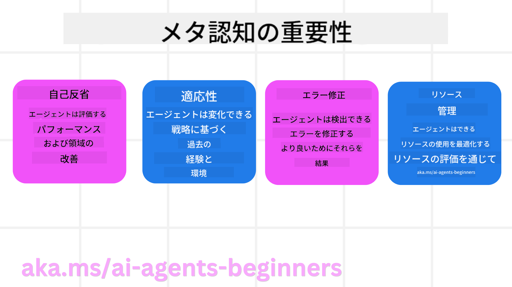
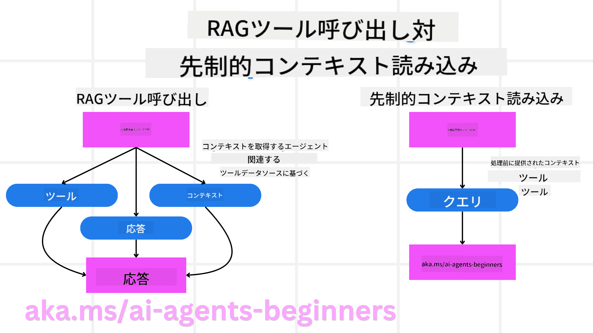

<!--
CO_OP_TRANSLATOR_METADATA:
{
  "original_hash": "8cbf460468c802c7994aa62e0e0779c9",
  "translation_date": "2025-07-12T12:08:15+00:00",
  "source_file": "09-metacognition/README.md",
  "language_code": "ja"
}
-->
[](https://youtu.be/His9R6gw6Ec?si=3_RMb8VprNvdLRhX)

> _(上の画像をクリックすると、このレッスンの動画が視聴できます)_
# AIエージェントにおけるメタ認知

## はじめに

AIエージェントのメタ認知に関するレッスンへようこそ！この章は、自分自身の思考過程について考えるAIエージェントの仕組みに興味がある初心者向けに作られています。このレッスンを終える頃には、重要な概念を理解し、メタ認知をAIエージェント設計に応用するための実践的な例を身につけることができます。

## 学習目標

このレッスンを修了すると、以下のことができるようになります：

1. エージェント定義における推論ループの意味を理解する。
2. 自己修正型エージェントを支援するための計画と評価の手法を使う。
3. タスクを達成するためにコードを操作できるエージェントを自分で作成する。

## メタ認知の紹介

メタ認知とは、自分の思考について考える高次の認知プロセスを指します。AIエージェントにとっては、自己認識や過去の経験に基づいて自分の行動を評価し調整できることを意味します。メタ認知、つまり「思考について考えること」は、エージェント型AIシステムの開発において重要な概念です。これは、AIシステムが自分自身の内部プロセスを認識し、それに基づいて行動を監視・調整・適応できることを含みます。私たちが場の空気を読んだり問題を見つめたりするのと同じように。この自己認識は、AIシステムがより良い意思決定を行い、誤りを特定し、時間とともにパフォーマンスを向上させるのに役立ちます。これはチューリングテストやAIが支配するかどうかの議論にもつながります。

エージェント型AIシステムの文脈では、メタ認知は以下のような課題に対処するのに役立ちます：
- 透明性：AIシステムが自分の推論や決定を説明できるようにする。
- 推論：情報を統合し、適切な判断を下す能力を高める。
- 適応：新しい環境や変化する条件に対応できるようにする。
- 知覚：環境からのデータを正確に認識・解釈する能力を向上させる。

### メタ認知とは何か？

メタ認知、つまり「思考について考えること」とは、自分の認知プロセスに対する自己認識と自己調整を含む高次の認知プロセスです。AIの領域では、メタ認知はエージェントが自分の戦略や行動を評価し適応する力を与え、問題解決や意思決定能力の向上につながります。メタ認知を理解することで、より知的で適応性が高く効率的なAIエージェントを設計できます。真のメタ認知では、AIが自分の推論について明示的に考えている様子が見られます。

例：「安いフライトを優先したけど…直行便を見逃しているかもしれないから、もう一度確認しよう。」
どのように、なぜ特定のルートを選んだかを追跡する。
- 前回のユーザーの好みに過度に依存してミスをしたことに気づき、最終的な提案だけでなく意思決定の戦略自体を修正する。
- 「ユーザーが『混雑しすぎ』と言ったら、特定の観光地を外すだけでなく、人気順で『トップ観光地』を選ぶ方法自体が問題だ」とパターンを診断する。

### AIエージェントにおけるメタ認知の重要性

メタ認知はAIエージェント設計において以下の理由で重要な役割を果たします：



- 自己反省：エージェントが自分のパフォーマンスを評価し、改善点を見つけることができる。
- 適応性：過去の経験や変化する環境に基づいて戦略を修正できる。
- エラー修正：誤りを自律的に検出し修正できるため、より正確な結果をもたらす。
- リソース管理：時間や計算資源などのリソースを計画・評価して最適化できる。

## AIエージェントの構成要素

メタ認知プロセスに入る前に、AIエージェントの基本的な構成要素を理解することが重要です。AIエージェントは通常、以下で構成されます：

- ペルソナ：エージェントの性格や特徴で、ユーザーとのやり取りの仕方を定義する。
- ツール：エージェントが実行できる機能や能力。
- スキル：エージェントが持つ知識や専門性。

これらの要素が連携して、特定のタスクを実行できる「専門ユニット」を形成します。

**例**：
旅行代理店を考えてみましょう。単に旅行計画を立てるだけでなく、リアルタイムのデータや過去の顧客の旅の経験に基づいてプランを調整するサービスです。

### 例：旅行代理店サービスにおけるメタ認知

AIによって動く旅行代理店サービスを設計するとします。このエージェント「Travel Agent」はユーザーの休暇計画を支援します。メタ認知を組み込むには、Travel Agentが自己認識と過去の経験に基づいて行動を評価・調整する必要があります。メタ認知がどのように役立つか見てみましょう。

#### 現在のタスク

ユーザーのパリ旅行計画を手伝うこと。

#### タスク完了のステップ

1. **ユーザーの好みを収集**：旅行日程、予算、興味（例：博物館、料理、ショッピング）、特別な要望を聞く。
2. **情報収集**：ユーザーの好みに合うフライト、宿泊施設、観光地、レストランを検索。
3. **提案作成**：フライト情報、ホテル予約、推奨アクティビティを含むパーソナライズされた旅程を提供。
4. **フィードバックに基づく調整**：提案に対するユーザーの意見を聞き、必要に応じて修正。

#### 必要なリソース

- フライト・ホテル予約データベースへのアクセス。
- パリの観光地やレストラン情報。
- 過去のユーザーフィードバックデータ。

#### 経験と自己反省

Travel Agentはメタ認知を使って自分のパフォーマンスを評価し、過去の経験から学びます。例えば：

1. **ユーザーフィードバックの分析**：どの提案が好評でどれがそうでなかったかをレビューし、今後の提案に反映。
2. **適応性**：ユーザーが混雑を嫌うと以前に言っていた場合、ピーク時間の人気観光地を避けるようにする。
3. **エラー修正**：過去に満室のホテルを提案してしまった場合、予約前に空室確認をより厳密に行うよう学習。

#### 開発者向け実例

Travel Agentのコードにメタ認知を組み込んだ簡単な例は以下の通りです：

```python
class Travel_Agent:
    def __init__(self):
        self.user_preferences = {}
        self.experience_data = []

    def gather_preferences(self, preferences):
        self.user_preferences = preferences

    def retrieve_information(self):
        # Search for flights, hotels, and attractions based on preferences
        flights = search_flights(self.user_preferences)
        hotels = search_hotels(self.user_preferences)
        attractions = search_attractions(self.user_preferences)
        return flights, hotels, attractions

    def generate_recommendations(self):
        flights, hotels, attractions = self.retrieve_information()
        itinerary = create_itinerary(flights, hotels, attractions)
        return itinerary

    def adjust_based_on_feedback(self, feedback):
        self.experience_data.append(feedback)
        # Analyze feedback and adjust future recommendations
        self.user_preferences = adjust_preferences(self.user_preferences, feedback)

# Example usage
travel_agent = Travel_Agent()
preferences = {
    "destination": "Paris",
    "dates": "2025-04-01 to 2025-04-10",
    "budget": "moderate",
    "interests": ["museums", "cuisine"]
}
travel_agent.gather_preferences(preferences)
itinerary = travel_agent.generate_recommendations()
print("Suggested Itinerary:", itinerary)
feedback = {"liked": ["Louvre Museum"], "disliked": ["Eiffel Tower (too crowded)"]}
travel_agent.adjust_based_on_feedback(feedback)
```

#### メタ認知が重要な理由

- **自己反省**：エージェントが自分のパフォーマンスを分析し、改善点を特定できる。
- **適応性**：フィードバックや変化に応じて戦略を修正できる。
- **エラー修正**：誤りを自律的に検出・修正できる。
- **リソース管理**：時間や計算資源の使用を最適化できる。

メタ認知を取り入れることで、Travel Agentはよりパーソナライズされ正確な旅行提案を提供し、ユーザー体験を向上させます。

---

## 2. エージェントにおける計画

計画はAIエージェントの行動において重要な要素です。目標達成のために必要なステップを、現在の状況、リソース、障害の可能性を考慮しながら整理します。

### 計画の要素

- **現在のタスク**：タスクを明確に定義する。
- **タスク完了のステップ**：タスクを管理しやすいステップに分解する。
- **必要なリソース**：必要なリソースを特定する。
- **経験**：過去の経験を活用して計画に反映する。

**例**：
Travel Agentがユーザーの旅行計画を効果的に支援するために取るべきステップは以下の通りです。

### Travel Agentのステップ

1. **ユーザーの好みを収集**
   - 旅行日程、予算、興味、特別な要望をユーザーに尋ねる。
   - 例：「旅行予定日はいつですか？」「予算はどのくらいですか？」「どんなアクティビティが好きですか？」

2. **情報収集**
   - ユーザーの好みに基づいて関連する旅行オプションを検索。
   - **フライト**：予算と希望日程に合うフライトを探す。
   - **宿泊施設**：場所、価格、設備の好みに合うホテルやレンタル物件を探す。
   - **観光地・レストラン**：ユーザーの興味に合う人気の観光地や飲食店を特定。

3. **提案作成**
   - 収集した情報をもとにパーソナライズされた旅程を作成。
   - フライト情報、ホテル予約、推奨アクティビティを含め、ユーザーの好みに合わせて提案。

4. **旅程をユーザーに提示**
   - 提案した旅程をユーザーに共有し、確認してもらう。
   - 例：「パリ旅行の提案旅程です。フライト情報、ホテル予約、推奨アクティビティとレストランのリストを含んでいます。ご意見をお聞かせください。」

5. **フィードバック収集**
   - 提案に対するユーザーの意見を聞く。
   - 例：「フライトの選択はいかがですか？」「ホテルはご希望に合っていますか？」「追加や削除したいアクティビティはありますか？」

6. **フィードバックに基づく調整**
   - ユーザーの意見を反映して旅程を修正。
   - フライト、宿泊、アクティビティの提案をユーザーの好みに合わせて変更。

7. **最終確認**
   - 修正後の旅程をユーザーに提示し、最終確認を行う。
   - 例：「ご意見を反映しました。こちらが更新された旅程です。問題なければお知らせください。」

8. **予約と確認**
   - ユーザーの承認後、フライト、宿泊、事前予約が必要なアクティビティを手配。
   - 確認情報をユーザーに送信。

9. **継続的なサポート提供**
   - 旅行前後や旅行中の変更や追加要望に対応。
   - 例：「旅行中に何かお困りのことがあれば、いつでもご連絡ください。」

### 例：対話例

```python
class Travel_Agent:
    def __init__(self):
        self.user_preferences = {}
        self.experience_data = []

    def gather_preferences(self, preferences):
        self.user_preferences = preferences

    def retrieve_information(self):
        flights = search_flights(self.user_preferences)
        hotels = search_hotels(self.user_preferences)
        attractions = search_attractions(self.user_preferences)
        return flights, hotels, attractions

    def generate_recommendations(self):
        flights, hotels, attractions = self.retrieve_information()
        itinerary = create_itinerary(flights, hotels, attractions)
        return itinerary

    def adjust_based_on_feedback(self, feedback):
        self.experience_data.append(feedback)
        self.user_preferences = adjust_preferences(self.user_preferences, feedback)

# Example usage within a booing request
travel_agent = Travel_Agent()
preferences = {
    "destination": "Paris",
    "dates": "2025-04-01 to 2025-04-10",
    "budget": "moderate",
    "interests": ["museums", "cuisine"]
}
travel_agent.gather_preferences(preferences)
itinerary = travel_agent.generate_recommendations()
print("Suggested Itinerary:", itinerary)
feedback = {"liked": ["Louvre Museum"], "disliked": ["Eiffel Tower (too crowded)"]}
travel_agent.adjust_based_on_feedback(feedback)
```

## 3. 修正型RAGシステム

まずはRAGツールと事前コンテキスト読み込みの違いを理解しましょう。



### Retrieval-Augmented Generation (RAG)

RAGは検索システムと生成モデルを組み合わせたものです。クエリが入力されると、検索システムが外部ソースから関連文書やデータを取得し、その情報を生成モデルの入力に加えます。これにより、モデルはより正確で文脈に合った応答を生成できます。

RAGシステムでは、エージェントが知識ベースから関連情報を取得し、それを使って適切な応答や行動を生成します。

### 修正型RAGアプローチ

修正型RAGアプローチは、RAG技術を使って誤りを修正し、AIエージェントの精度を向上させることに焦点を当てています。これには以下が含まれます：

1. **プロンプト技術**：エージェントが関連情報を取得するための特定のプロンプトを使用。
2. **ツール**：取得情報の関連性を評価し、正確な応答を生成するアルゴリズムや仕組みの実装。
3. **評価**：エージェントのパフォーマンスを継続的に評価し、精度と効率を改善するための調整。

#### 例：検索エージェントにおける修正型RAG

ウェブから情報を取得してユーザーの質問に答える検索エージェントを考えます。修正型RAGアプローチは以下のように使われます：

1. **プロンプト技術**：ユーザーの入力に基づいて検索クエリを作成。
2. **ツール**：自然言語処理や機械学習アルゴリズムで検索結果をランク付け・フィルタリング。
3. **評価**：ユーザーフィードバックを分析し、取得情報の誤りを特定・修正。

### 旅行代理店における修正型RAG

修正型RAG（Retrieval-Augmented Generation）は、AIが情報を取得・生成する能力を高めつつ、誤りを修正する手法です。Travel Agentがより正確で関連性の高い旅行提案を行うために修正型RAGを活用する方法を見てみましょう。

これには以下が含まれます：

- **プロンプト技術**：エージェントが関連情報を取得するための特定のプロンプトを使用。
- **ツール**：取得情報の関連性を評価し、正確な応答を生成するアルゴリズムや仕組みの実装。
- **評価**：エージェントのパフォーマンスを継続的に評価し、精度と効率を改善するための調整。

#### Travel Agentに修正型RAGを実装するステップ

1. **初期ユーザーインタラクション**
   - Travel Agentが目的地、旅行日程、予算、興味などの初期情報を収集。
   - 例：

     ```python
     preferences = {
         "destination": "Paris",
         "dates": "2025-04-01 to 2025-04-10",
         "budget": "moderate",
         "interests": ["museums", "cuisine"]
     }
     ```

2. **情報の取得**
   - Travel Agentがユーザーの好みに基づいてフライト、宿泊、観光地、レストランの情報を取得。
   - 例：

     ```python
     flights = search_flights(preferences)
     hotels = search_hotels(preferences)
     attractions = search_attractions(preferences)
     ```

3. **初期提案の生成**
   - 取得した情報を使ってパーソナライズされた旅程を作成。
   - 例：

     ```python
     itinerary = create_itinerary(flights, hotels, attractions)
     print("Suggested Itinerary:", itinerary)
     ```

4. **ユーザーフィードバックの収集**
   - 初期提案に対するユーザーの意見を聞く。
   - 例：

     ```python
     feedback = {
         "liked": ["Louvre Museum"],
         "disliked": ["Eiffel Tower (too crowded)"]
     }
     ```

5. **修正型RAGプロセス**
   - **プロンプト技術**：ユーザーフィードバックに基づいて新たな検索クエリを作成。
     - 例：

       ```python
       if "disliked" in feedback:
           preferences["avoid"] = feedback["disliked"]
       ```

   - **ツール**：新しい検索結果をランク付け・フィルタリングし、ユーザーのフィードバックに基づく関連性を重視。
     - 例：

       ```python
       new_attractions = search_attractions(preferences)
       new_itinerary = create_itinerary(flights, hotels, new_attractions)
       print("Updated Itinerary:", new_itinerary)
       ```

   - **評価**：ユーザーフィードバックを分析し、提案の関連性と正確性を継続的に評価・調整。
     - 例：

       ```python
       def adjust_preferences(preferences, feedback):
           if "liked" in feedback:
               preferences["favorites"] = feedback["liked"]
           if "disliked" in feedback:
               preferences["avoid"] = feedback["disliked"]
           return preferences

       preferences = adjust_preferences(preferences, feedback)
       ```

#### 実践例

Travel Agentに修正型RAGアプローチを組み込んだ簡単なPythonコード例は以下の通りです：
### 先読みコンテキストロード

先読みコンテキストロードとは、クエリを処理する前に関連するコンテキストや背景情報をモデルに読み込ませることを指します。これにより、モデルは最初からその情報にアクセスできるため、処理中に追加のデータを取得する必要がなく、より的確な応答を生成しやすくなります。

以下は、旅行代理店アプリケーションにおける先読みコンテキストロードの簡単な例（Python）です。

```python
class TravelAgent:
    def __init__(self):
        # Pre-load popular destinations and their information
        self.context = {
            "Paris": {"country": "France", "currency": "Euro", "language": "French", "attractions": ["Eiffel Tower", "Louvre Museum"]},
            "Tokyo": {"country": "Japan", "currency": "Yen", "language": "Japanese", "attractions": ["Tokyo Tower", "Shibuya Crossing"]},
            "New York": {"country": "USA", "currency": "Dollar", "language": "English", "attractions": ["Statue of Liberty", "Times Square"]},
            "Sydney": {"country": "Australia", "currency": "Dollar", "language": "English", "attractions": ["Sydney Opera House", "Bondi Beach"]}
        }

    def get_destination_info(self, destination):
        # Fetch destination information from pre-loaded context
        info = self.context.get(destination)
        if info:
            return f"{destination}:\nCountry: {info['country']}\nCurrency: {info['currency']}\nLanguage: {info['language']}\nAttractions: {', '.join(info['attractions'])}"
        else:
            return f"Sorry, we don't have information on {destination}."

# Example usage
travel_agent = TravelAgent()
print(travel_agent.get_destination_info("Paris"))
print(travel_agent.get_destination_info("Tokyo"))
```

#### 解説

1. **初期化（`__init__` メソッド）**: `TravelAgent` クラスは、パリ、東京、ニューヨーク、シドニーなどの人気の旅行先に関する情報を含む辞書を事前に読み込みます。この辞書には、各旅行先の国、通貨、言語、主要な観光地などの詳細が含まれています。

2. **情報取得（`get_destination_info` メソッド）**: ユーザーが特定の旅行先について問い合わせた際に、`get_destination_info` メソッドが事前に読み込んだコンテキスト辞書から該当情報を取得します。

コンテキストを事前に読み込むことで、旅行代理店アプリはリアルタイムで外部ソースから情報を取得することなく、迅速にユーザーの問い合わせに応答できるようになります。これにより、アプリの効率性と応答性が向上します。

### 目標を設定してから計画をブートストラップし、反復する

目標を設定して計画をブートストラップするとは、最初に明確な目的や達成したい結果を定めることを意味します。この目標を指針として反復プロセスを進めることで、各ステップが目標達成に向かって効率的かつ集中して進むようになります。

以下は、旅行代理店がPythonで目標を設定してから旅行計画をブートストラップし、反復する例です。

### シナリオ

旅行代理店がクライアントの好みと予算に基づいて、満足度を最大化するカスタマイズされた旅行日程を計画したいと考えています。

### 手順

1. クライアントの好みと予算を定義する。
2. これらの好みに基づいて初期計画をブートストラップする。
3. クライアントの満足度を最適化するために計画を反復して洗練する。

#### Pythonコード

```python
class TravelAgent:
    def __init__(self, destinations):
        self.destinations = destinations

    def bootstrap_plan(self, preferences, budget):
        plan = []
        total_cost = 0

        for destination in self.destinations:
            if total_cost + destination['cost'] <= budget and self.match_preferences(destination, preferences):
                plan.append(destination)
                total_cost += destination['cost']

        return plan

    def match_preferences(self, destination, preferences):
        for key, value in preferences.items():
            if destination.get(key) != value:
                return False
        return True

    def iterate_plan(self, plan, preferences, budget):
        for i in range(len(plan)):
            for destination in self.destinations:
                if destination not in plan and self.match_preferences(destination, preferences) and self.calculate_cost(plan, destination) <= budget:
                    plan[i] = destination
                    break
        return plan

    def calculate_cost(self, plan, new_destination):
        return sum(destination['cost'] for destination in plan) + new_destination['cost']

# Example usage
destinations = [
    {"name": "Paris", "cost": 1000, "activity": "sightseeing"},
    {"name": "Tokyo", "cost": 1200, "activity": "shopping"},
    {"name": "New York", "cost": 900, "activity": "sightseeing"},
    {"name": "Sydney", "cost": 1100, "activity": "beach"},
]

preferences = {"activity": "sightseeing"}
budget = 2000

travel_agent = TravelAgent(destinations)
initial_plan = travel_agent.bootstrap_plan(preferences, budget)
print("Initial Plan:", initial_plan)

refined_plan = travel_agent.iterate_plan(initial_plan, preferences, budget)
print("Refined Plan:", refined_plan)
```

#### コード解説

1. **初期化（`__init__` メソッド）**: `TravelAgent` クラスは、名前、費用、アクティビティタイプなどの属性を持つ複数の旅行先のリストで初期化されます。

2. **計画のブートストラップ（`bootstrap_plan` メソッド）**: クライアントの好みと予算に基づいて初期の旅行計画を作成します。旅行先リストを順にチェックし、好みに合い予算内であれば計画に追加します。

3. **好みのマッチング（`match_preferences` メソッド）**: 旅行先がクライアントの好みに合致するかどうかを判定します。

4. **計画の反復（`iterate_plan` メソッド）**: 初期計画を洗練させるため、計画内の各旅行先をより良いマッチに置き換えられないか検討し、クライアントの好みと予算制約を考慮して最適化します。

5. **費用計算（`calculate_cost` メソッド）**: 現在の計画の合計費用を計算し、新たな旅行先を加えた場合の費用も評価します。

#### 使用例

- **初期計画**: 旅行代理店は、観光を好むクライアントの好みと2000ドルの予算に基づいて初期計画を作成します。
- **洗練された計画**: 旅行代理店は計画を反復し、クライアントの好みと予算に最適化します。

明確な目標（例：クライアント満足度の最大化）を設定して計画をブートストラップし、反復で洗練することで、旅行代理店はクライアントの好みと予算に合ったカスタマイズされた最適な旅行日程を作成できます。この方法により、計画は最初からクライアントのニーズに沿い、反復ごとに改善されます。

### LLMを活用した再ランキングとスコアリング

大規模言語モデル（LLM）は、取得したドキュメントや生成した応答の関連性や品質を評価して再ランキングやスコアリングに利用できます。仕組みは以下の通りです。

**取得:** 最初の取得ステップで、クエリに基づく候補ドキュメントや応答のセットを取得します。

**再ランキング:** LLMがこれらの候補を評価し、関連性と品質に基づいて順位を付け直します。これにより、最も関連性が高く質の良い情報が優先的に提示されます。

**スコアリング:** LLMは各候補にスコアを割り当て、関連性と品質を数値化します。これにより、最適な応答やドキュメントを選択しやすくなります。

LLMを再ランキングとスコアリングに活用することで、より正確で文脈に即した情報提供が可能となり、ユーザー体験が向上します。

以下は、旅行代理店がユーザーの好みに基づいて旅行先をLLMで再ランキング・スコアリングする例（Python）です。

#### シナリオ - 好みに基づく旅行

旅行代理店がクライアントの好みに応じて最適な旅行先を推薦したいと考えています。LLMは旅行先の再ランキングとスコアリングを行い、最も関連性の高い選択肢を提示します。

#### 手順

1. ユーザーの好みを収集する。
2. 旅行先の候補リストを取得する。
3. LLMを使って好みに基づき旅行先を再ランキング・スコアリングする。

Azure OpenAIサービスを使う場合の更新例は以下の通りです。

#### 必要条件

1. Azureサブスクリプションが必要です。
2. Azure OpenAIリソースを作成し、APIキーを取得してください。

#### Pythonコード例

```python
import requests
import json

class TravelAgent:
    def __init__(self, destinations):
        self.destinations = destinations

    def get_recommendations(self, preferences, api_key, endpoint):
        # Generate a prompt for the Azure OpenAI
        prompt = self.generate_prompt(preferences)
        
        # Define headers and payload for the request
        headers = {
            'Content-Type': 'application/json',
            'Authorization': f'Bearer {api_key}'
        }
        payload = {
            "prompt": prompt,
            "max_tokens": 150,
            "temperature": 0.7
        }
        
        # Call the Azure OpenAI API to get the re-ranked and scored destinations
        response = requests.post(endpoint, headers=headers, json=payload)
        response_data = response.json()
        
        # Extract and return the recommendations
        recommendations = response_data['choices'][0]['text'].strip().split('\n')
        return recommendations

    def generate_prompt(self, preferences):
        prompt = "Here are the travel destinations ranked and scored based on the following user preferences:\n"
        for key, value in preferences.items():
            prompt += f"{key}: {value}\n"
        prompt += "\nDestinations:\n"
        for destination in self.destinations:
            prompt += f"- {destination['name']}: {destination['description']}\n"
        return prompt

# Example usage
destinations = [
    {"name": "Paris", "description": "City of lights, known for its art, fashion, and culture."},
    {"name": "Tokyo", "description": "Vibrant city, famous for its modernity and traditional temples."},
    {"name": "New York", "description": "The city that never sleeps, with iconic landmarks and diverse culture."},
    {"name": "Sydney", "description": "Beautiful harbour city, known for its opera house and stunning beaches."},
]

preferences = {"activity": "sightseeing", "culture": "diverse"}
api_key = 'your_azure_openai_api_key'
endpoint = 'https://your-endpoint.com/openai/deployments/your-deployment-name/completions?api-version=2022-12-01'

travel_agent = TravelAgent(destinations)
recommendations = travel_agent.get_recommendations(preferences, api_key, endpoint)
print("Recommended Destinations:")
for rec in recommendations:
    print(rec)
```

#### コード解説 - Preference Booker

1. **初期化**: `TravelAgent` クラスは、名前や説明などの属性を持つ複数の旅行先リストで初期化されます。

2. **推薦取得（`get_recommendations` メソッド）**: ユーザーの好みに基づいてAzure OpenAIサービス用のプロンプトを生成し、HTTP POSTリクエストでAPIに送信して再ランキング・スコアリングされた旅行先を取得します。

3. **プロンプト生成（`generate_prompt` メソッド）**: ユーザーの好みと旅行先リストを含むプロンプトを作成し、モデルに再ランキングとスコアリングを指示します。

4. **API呼び出し**: `requests` ライブラリを使ってAzure OpenAI APIエンドポイントにPOSTリクエストを送信し、応答から再ランキング・スコアリング結果を取得します。

5. **使用例**: 旅行代理店は、観光や多様な文化への関心といったユーザーの好みを収集し、Azure OpenAIサービスを使って再ランキング・スコアリングされた旅行先の推薦を得ます。

`your_azure_openai_api_key` は実際のAzure OpenAI APIキーに、`https://your-endpoint.com/...` はAzure OpenAIの実際のエンドポイントURLに置き換えてください。

LLMを再ランキングとスコアリングに活用することで、旅行代理店はよりパーソナライズされ関連性の高い旅行推薦をクライアントに提供でき、全体の体験を向上させられます。

### RAG：プロンプト技術とツールの違い

Retrieval-Augmented Generation（RAG）は、AIエージェント開発においてプロンプト技術としてもツールとしても利用できます。この二つの違いを理解することで、RAGをより効果的に活用できます。

#### プロンプト技術としてのRAG

**概要**

- プロンプト技術としてのRAGは、大規模なコーパスやデータベースから関連情報を取得するための特定のクエリやプロンプトを作成し、その情報を用いて応答やアクションを生成する手法です。

**仕組み**

1. **プロンプト作成**: タスクやユーザー入力に基づき、適切な構造のプロンプトやクエリを作成する。
2. **情報取得**: 作成したプロンプトを使って、既存の知識ベースやデータセットから関連情報を検索する。
3. **応答生成**: 取得した情報を生成AIモデルと組み合わせて、包括的で一貫した応答を作成する。

**旅行代理店の例**

- ユーザー入力: 「パリの博物館を訪れたい」
- プロンプト: 「パリの主要な博物館を探してください」
- 取得情報: ルーブル美術館、オルセー美術館などの詳細
- 生成応答: 「パリのおすすめ博物館は、ルーブル美術館、オルセー美術館、ポンピドゥーセンターです。」

#### ツールとしてのRAG

**概要**

- ツールとしてのRAGは、取得と生成のプロセスを自動化した統合システムで、開発者が各クエリに対して手動でプロンプトを作成することなく複雑なAI機能を実装できるようにします。

**仕組み**

1. **統合**: AIエージェントのアーキテクチャにRAGを組み込み、取得と生成のタスクを自動的に処理させる。
2. **自動化**: ユーザー入力の受け取りから最終応答の生成までを自動で行い、各ステップで明示的なプロンプト作成を不要にする。
3. **効率化**: 取得と生成のプロセスを効率化し、より迅速かつ正確な応答を可能にする。

**旅行代理店の例**

- ユーザー入力: 「パリの博物館を訪れたい」
- RAGツール: 自動的に博物館情報を取得し応答を生成
- 生成応答: 「パリのおすすめ博物館は、ルーブル美術館、オルセー美術館、ポンピドゥーセンターです。」

### 比較表

| 項目                   | プロンプト技術                                         | ツール                                               |
|------------------------|-------------------------------------------------------|-----------------------------------------------------|
| **手動 vs 自動**       | 各クエリに対して手動でプロンプトを作成                 | 取得と生成を自動化                                   |
| **制御性**             | 取得プロセスを細かく制御可能                           | 取得と生成を効率化し自動化                           |
| **柔軟性**             | 特定のニーズに応じたカスタムプロンプトが可能           | 大規模実装に適し効率的                               |
| **複雑さ**             | プロンプトの作成・調整が必要                           | AIエージェントのアーキテクチャに組み込みやすい     |

### 実践例

**プロンプト技術の例:**

```python
def search_museums_in_paris():
    prompt = "Find top museums in Paris"
    search_results = search_web(prompt)
    return search_results

museums = search_museums_in_paris()
print("Top Museums in Paris:", museums)
```

**ツールの例:**

```python
class Travel_Agent:
    def __init__(self):
        self.rag_tool = RAGTool()

    def get_museums_in_paris(self):
        user_input = "I want to visit museums in Paris."
        response = self.rag_tool.retrieve_and_generate(user_input)
        return response

travel_agent = Travel_Agent()
museums = travel_agent.get_museums_in_paris()
print("Top Museums in Paris:", museums)
```

### 関連性の評価

関連性の評価は、AIエージェントの性能において重要な要素です。エージェントが取得・生成する情報が適切で正確かつユーザーにとって有用であることを保証します。ここでは、関連性評価の方法や実践例を紹介します。

#### 関連性評価の重要な概念

1. **コンテキスト認識**:
   - ユーザーのクエリの文脈を理解し、関連情報を取得・生成する必要があります。
   - 例: 「パリのおすすめレストラン」と聞かれた場合、料理の種類や予算などユーザーの好みを考慮する。

2. **正確性**:
   - 提供される情報は事実に基づき、最新であるべきです。
   - 例: 現在営業中で評価の高いレストランを推薦し、閉店した店は除外する。

3. **ユーザー意図**:
   - クエリの背後にあるユーザーの意図を推測し、最も関連性の高い情報を提供する。
   - 例: 「予算に優しいホテル」と言われたら、手頃な価格帯のホテルを優先する。

4. **フィードバックループ**:
   - ユーザーのフィードバックを継続的に収集・分析し、関連性評価の精度を向上させる。
   - 例: 過去の推薦に対する評価を反映し、今後の応答を改善する。

#### 関連性評価の実践的手法

1. **関連度スコアリング**:
   - 取得した各アイテムに対し、クエリやユーザーの好みとの一致度に基づくスコアを割り当てる。
   - 例:

     ```python
     def relevance_score(item, query):
         score = 0
         if item['category'] in query['interests']:
             score += 1
         if item['price'] <= query['budget']:
             score += 1
         if item['location'] == query['destination']:
             score += 1
         return score
     ```

2. **フィルタリングとランキング**:
   - 関連性の低いアイテムを除外し、残りをスコア順に並べる。
   - 例:

     ```python
     def filter_and_rank(items, query):
         ranked_items = sorted(items, key=lambda item: relevance_score(item, query), reverse=True)
         return ranked_items[:10]  # Return top 10 relevant items
     ```

3. **自然言語処理（NLP）**:
   - NLP技術を用いてユーザーのクエリを理解し、関連情報を取得する。
   - 例:

     ```python
     def process_query(query):
         # Use NLP to extract key information from the user's query
         processed_query = nlp(query)
         return processed_query
     ```

4. **ユーザーフィードバック統合**:
   - 提供した推薦に対するユーザーのフィードバックを収集し、今後の関連性評価に反映させる。
   - 例:

     ```python
     def adjust_based_on_feedback(feedback, items):
         for item in items:
             if item['name'] in feedback['liked']:
                 item['relevance'] += 1
             if item['name'] in feedback['disliked']:
                 item['relevance'] -= 1
         return items
     ```

#### 例：旅行代理店における関連性評価

以下は、旅行代理店が旅行推薦の関連性を評価する実践例です。

```python
class Travel_Agent:
    def __init__(self):
        self.user_preferences = {}
        self.experience_data = []

    def gather_preferences(self, preferences):
        self.user_preferences = preferences

    def retrieve_information(self):
        flights = search_flights(self.user_preferences)
        hotels = search_hotels(self.user_preferences)
        attractions = search_attractions(self.user_preferences)
        return flights, hotels, attractions

    def generate_recommendations(self):
        flights, hotels, attractions = self.retrieve_information()
        ranked_hotels = self.filter_and_rank(hotels, self.user_preferences)
        itinerary = create_itinerary(flights, ranked_hotels, attractions)
        return itinerary

    def filter_and_rank(self, items, query):
        ranked_items = sorted(items, key=lambda item: self.relevance_score(item, query), reverse=True)
        return ranked_items[:10]  # Return top 10 relevant items

    def relevance_score(self, item, query):
        score = 0
        if item['category'] in query['interests']:
            score += 1
        if item['price'] <= query['budget']:
            score += 1
        if item['location'] == query['destination']:
            score += 1
        return score

    def adjust_based_on_feedback(self, feedback, items):
        for item in items:
            if item['name'] in feedback['liked']:
                item['relevance'] += 1
            if item['name'] in feedback['disliked']:
                item['relevance'] -= 1
        return items

# Example usage
travel_agent = Travel_Agent()
preferences = {
    "destination": "Paris",
    "dates": "2025-04-01 to 2025-04-10",
    "budget": "moderate",
    "interests": ["museums", "cuisine"]
}
travel_agent.gather_preferences(preferences)
itinerary = travel_agent.generate_recommendations()
print("Suggested Itinerary:", itinerary)
feedback = {"liked": ["Louvre Museum"], "disliked": ["Eiffel Tower (too crowded)"]}
updated_items = travel_agent.adjust_based_on_feedback(feedback, itinerary['hotels'])
print("Updated Itinerary with Feedback:", updated_items)
```

### 意図を考慮した検索

意図を考慮した検索とは、ユーザーのクエリの背後にある目的や目標を理解・解釈し、最も関連性が高く有用な情報を取得・生成する手法です。単なるキーワードマッチングを超え、ユーザーの真のニーズや文脈を把握することに重点を置きます。

#### 意図を考慮した検索の重要な概念

1. **ユーザー意図の理解**:
   - ユーザーの意図は主に3種類に分類されます：情報取得型、ナビゲーション型、取引型。
     - **情報取得型**: トピックに関する情報を求める（例：「パリのおすすめ博物館は？」）。
     - **ナビゲーション型**: 特定のウェブサイトやページにアクセスしたい（例：「ルーブル美術館公式サイト」）。
     - **取引型**: 予約や購入などの取引を行いたい（例：「パリ行きの航空券を予約」）。

2. **コンテキスト認識**:
   - ユーザーの過去のやり取りや好み、現在のクエリの詳細を考慮して意図を正確に特定する。

3. **自然言語処理（NLP）**:
   - ユーザーの自然言語クエリを理解・解釈するために、エンティティ認識、感情分析、クエリ解析などのNLP技術を活用する。

4. **パーソナライズ**:
   - ユーザーの履歴や好み、フィードバックに基づいて検索結果を個別化し、関連性を高める。
#### 実践例：Travel Agentにおける意図を考慮した検索

Travel Agentを例に、意図を考慮した検索がどのように実装できるか見てみましょう。

1. **ユーザーの好みを収集する**

   ```python
   class Travel_Agent:
       def __init__(self):
           self.user_preferences = {}

       def gather_preferences(self, preferences):
           self.user_preferences = preferences
   ```

2. **ユーザーの意図を理解する**

   ```python
   def identify_intent(query):
       if "book" in query or "purchase" in query:
           return "transactional"
       elif "website" in query or "official" in query:
           return "navigational"
       else:
           return "informational"
   ```

3. **コンテキストの把握**

   ```python
   def analyze_context(query, user_history):
       # Combine current query with user history to understand context
       context = {
           "current_query": query,
           "user_history": user_history
       }
       return context
   ```

4. **検索と結果のパーソナライズ**

   ```python
   def search_with_intent(query, preferences, user_history):
       intent = identify_intent(query)
       context = analyze_context(query, user_history)
       if intent == "informational":
           search_results = search_information(query, preferences)
       elif intent == "navigational":
           search_results = search_navigation(query)
       elif intent == "transactional":
           search_results = search_transaction(query, preferences)
       personalized_results = personalize_results(search_results, user_history)
       return personalized_results

   def search_information(query, preferences):
       # Example search logic for informational intent
       results = search_web(f"best {preferences['interests']} in {preferences['destination']}")
       return results

   def search_navigation(query):
       # Example search logic for navigational intent
       results = search_web(query)
       return results

   def search_transaction(query, preferences):
       # Example search logic for transactional intent
       results = search_web(f"book {query} to {preferences['destination']}")
       return results

   def personalize_results(results, user_history):
       # Example personalization logic
       personalized = [result for result in results if result not in user_history]
       return personalized[:10]  # Return top 10 personalized results
   ```

5. **使用例**

   ```python
   travel_agent = Travel_Agent()
   preferences = {
       "destination": "Paris",
       "interests": ["museums", "cuisine"]
   }
   travel_agent.gather_preferences(preferences)
   user_history = ["Louvre Museum website", "Book flight to Paris"]
   query = "best museums in Paris"
   results = search_with_intent(query, preferences, user_history)
   print("Search Results:", results)
   ```

---

## 4. ツールとしてのコード生成

コード生成エージェントはAIモデルを使ってコードを書き、実行することで複雑な問題を解決し、タスクを自動化します。

### コード生成エージェント

コード生成エージェントは生成AIモデルを活用してコードを書き、実行します。これにより複雑な問題の解決やタスクの自動化、さまざまなプログラミング言語でのコード生成と実行を通じて有益な洞察を提供します。

#### 実用例

1. **自動コード生成**：データ分析、ウェブスクレイピング、機械学習など特定のタスク向けのコードスニペットを生成。
2. **SQLをRAGとして活用**：データベースからデータを取得・操作するためのSQLクエリを使用。
3. **問題解決**：アルゴリズムの最適化やデータ分析など、特定の問題を解決するコードを作成・実行。

#### 例：データ分析向けコード生成エージェント

コード生成エージェントを設計するとしたら、以下のように動作します：

1. **タスク**：データセットを分析し、傾向やパターンを特定する。
2. **手順**：
   - データセットをデータ分析ツールに読み込む。
   - データをフィルタリング・集計するSQLクエリを生成。
   - クエリを実行し結果を取得。
   - 結果をもとに可視化や洞察を生成。
3. **必要なリソース**：データセットへのアクセス、データ分析ツール、SQL機能。
4. **経験**：過去の分析結果を活用し、将来の分析の精度と関連性を向上。

### 例：Travel Agent向けコード生成エージェント

この例では、Travel Agentというコード生成エージェントを設計し、ユーザーの旅行計画を支援するためにコードを生成・実行します。このエージェントは旅行オプションの取得、結果のフィルタリング、旅程の作成などを生成AIで行います。

#### コード生成エージェントの概要

1. **ユーザーの好みを収集**：目的地、旅行日程、予算、興味などのユーザー入力を集める。
2. **データ取得用コードの生成**：フライト、ホテル、観光地の情報を取得するコードスニペットを生成。
3. **生成コードの実行**：リアルタイム情報を取得するためにコードを実行。
4. **旅程の作成**：取得したデータをもとにパーソナライズされた旅行プランを作成。
5. **フィードバックに基づく調整**：ユーザーのフィードバックを受け取り、必要に応じてコードを再生成し結果を改善。

#### ステップごとの実装

1. **ユーザーの好みを収集**

   ```python
   class Travel_Agent:
       def __init__(self):
           self.user_preferences = {}

       def gather_preferences(self, preferences):
           self.user_preferences = preferences
   ```

2. **データ取得用コードの生成**

   ```python
   def generate_code_to_fetch_data(preferences):
       # Example: Generate code to search for flights based on user preferences
       code = f"""
       def search_flights():
           import requests
           response = requests.get('https://api.example.com/flights', params={preferences})
           return response.json()
       """
       return code

   def generate_code_to_fetch_hotels(preferences):
       # Example: Generate code to search for hotels
       code = f"""
       def search_hotels():
           import requests
           response = requests.get('https://api.example.com/hotels', params={preferences})
           return response.json()
       """
       return code
   ```

3. **生成コードの実行**

   ```python
   def execute_code(code):
       # Execute the generated code using exec
       exec(code)
       result = locals()
       return result

   travel_agent = Travel_Agent()
   preferences = {
       "destination": "Paris",
       "dates": "2025-04-01 to 2025-04-10",
       "budget": "moderate",
       "interests": ["museums", "cuisine"]
   }
   travel_agent.gather_preferences(preferences)
   
   flight_code = generate_code_to_fetch_data(preferences)
   hotel_code = generate_code_to_fetch_hotels(preferences)
   
   flights = execute_code(flight_code)
   hotels = execute_code(hotel_code)

   print("Flight Options:", flights)
   print("Hotel Options:", hotels)
   ```

4. **旅程の作成**

   ```python
   def generate_itinerary(flights, hotels, attractions):
       itinerary = {
           "flights": flights,
           "hotels": hotels,
           "attractions": attractions
       }
       return itinerary

   attractions = search_attractions(preferences)
   itinerary = generate_itinerary(flights, hotels, attractions)
   print("Suggested Itinerary:", itinerary)
   ```

5. **フィードバックに基づく調整**

   ```python
   def adjust_based_on_feedback(feedback, preferences):
       # Adjust preferences based on user feedback
       if "liked" in feedback:
           preferences["favorites"] = feedback["liked"]
       if "disliked" in feedback:
           preferences["avoid"] = feedback["disliked"]
       return preferences

   feedback = {"liked": ["Louvre Museum"], "disliked": ["Eiffel Tower (too crowded)"]}
   updated_preferences = adjust_based_on_feedback(feedback, preferences)
   
   # Regenerate and execute code with updated preferences
   updated_flight_code = generate_code_to_fetch_data(updated_preferences)
   updated_hotel_code = generate_code_to_fetch_hotels(updated_preferences)
   
   updated_flights = execute_code(updated_flight_code)
   updated_hotels = execute_code(updated_hotel_code)
   
   updated_itinerary = generate_itinerary(updated_flights, updated_hotels, attractions)
   print("Updated Itinerary:", updated_itinerary)
   ```

### 環境認識と推論の活用

テーブルのスキーマを理解することで、クエリ生成プロセスを環境認識と推論を活用して強化できます。

以下はその例です：

1. **スキーマの理解**：システムはテーブルのスキーマを把握し、その情報をもとにクエリ生成を行う。
2. **フィードバックに基づく調整**：ユーザーのフィードバックをもとに好みを調整し、スキーマのどのフィールドを更新すべきか推論する。
3. **クエリの生成と実行**：新しい好みに基づき、フライトやホテルのデータを取得するクエリを生成・実行。

以下はこれらの概念を取り入れたPythonコードの例です：

```python
def adjust_based_on_feedback(feedback, preferences, schema):
    # Adjust preferences based on user feedback
    if "liked" in feedback:
        preferences["favorites"] = feedback["liked"]
    if "disliked" in feedback:
        preferences["avoid"] = feedback["disliked"]
    # Reasoning based on schema to adjust other related preferences
    for field in schema:
        if field in preferences:
            preferences[field] = adjust_based_on_environment(feedback, field, schema)
    return preferences

def adjust_based_on_environment(feedback, field, schema):
    # Custom logic to adjust preferences based on schema and feedback
    if field in feedback["liked"]:
        return schema[field]["positive_adjustment"]
    elif field in feedback["disliked"]:
        return schema[field]["negative_adjustment"]
    return schema[field]["default"]

def generate_code_to_fetch_data(preferences):
    # Generate code to fetch flight data based on updated preferences
    return f"fetch_flights(preferences={preferences})"

def generate_code_to_fetch_hotels(preferences):
    # Generate code to fetch hotel data based on updated preferences
    return f"fetch_hotels(preferences={preferences})"

def execute_code(code):
    # Simulate execution of code and return mock data
    return {"data": f"Executed: {code}"}

def generate_itinerary(flights, hotels, attractions):
    # Generate itinerary based on flights, hotels, and attractions
    return {"flights": flights, "hotels": hotels, "attractions": attractions}

# Example schema
schema = {
    "favorites": {"positive_adjustment": "increase", "negative_adjustment": "decrease", "default": "neutral"},
    "avoid": {"positive_adjustment": "decrease", "negative_adjustment": "increase", "default": "neutral"}
}

# Example usage
preferences = {"favorites": "sightseeing", "avoid": "crowded places"}
feedback = {"liked": ["Louvre Museum"], "disliked": ["Eiffel Tower (too crowded)"]}
updated_preferences = adjust_based_on_feedback(feedback, preferences, schema)

# Regenerate and execute code with updated preferences
updated_flight_code = generate_code_to_fetch_data(updated_preferences)
updated_hotel_code = generate_code_to_fetch_hotels(updated_preferences)

updated_flights = execute_code(updated_flight_code)
updated_hotels = execute_code(updated_hotel_code)

updated_itinerary = generate_itinerary(updated_flights, updated_hotels, feedback["liked"])
print("Updated Itinerary:", updated_itinerary)
```

#### 解説 - フィードバックに基づく予約

1. **スキーマ認識**：`schema`辞書はフィードバックに基づく好みの調整方法を定義しています。`favorites`や`avoid`などのフィールドと対応する調整内容が含まれます。
2. **好みの調整（`adjust_based_on_feedback`メソッド）**：ユーザーのフィードバックとスキーマに基づいて好みを調整します。
3. **環境に基づく調整（`adjust_based_on_environment`メソッド）**：スキーマとフィードバックに応じて調整内容をカスタマイズします。
4. **クエリの生成と実行**：調整された好みに基づき、フライトやホテルのデータを取得するコードを生成し、これらのクエリの実行をシミュレートします。
5. **旅程の生成**：新しいフライト、ホテル、観光地のデータをもとに更新された旅程を作成します。

システムを環境認識型にし、スキーマに基づく推論を取り入れることで、より正確で関連性の高いクエリを生成でき、より良い旅行提案とパーソナライズされたユーザー体験を実現します。

### SQLをRetrieval-Augmented Generation (RAG)技術として活用する

SQL（Structured Query Language）はデータベースとやり取りする強力なツールです。RAGの一部としてSQLを使うことで、AIエージェントはデータベースから関連情報を取得し、応答や行動の生成に活用できます。Travel Agentの文脈でSQLをRAG技術として使う方法を見てみましょう。

#### 主要な概念

1. **データベースとのやり取り**：
   - SQLはデータベースにクエリを送り、関連情報を取得・操作します。
   - 例：旅行データベースからフライト情報、ホテル情報、観光地情報を取得。

2. **RAGとの統合**：
   - ユーザーの入力や好みに基づいてSQLクエリを生成。
   - 取得したデータを使ってパーソナライズされた提案や行動を生成。

3. **動的クエリ生成**：
   - AIエージェントはコンテキストやユーザーのニーズに応じて動的にSQLクエリを生成。
   - 例：予算、日程、興味に基づいて結果を絞り込むSQLクエリのカスタマイズ。

#### 応用例

- **自動コード生成**：特定タスク向けのコードスニペットを生成。
- **SQLをRAGとして活用**：データ操作のためのSQLクエリを使用。
- **問題解決**：問題解決のためのコードを作成・実行。

**例**：データ分析エージェント

1. **タスク**：データセットの傾向を分析。
2. **手順**：
   - データセットを読み込む。
   - データをフィルタリングするSQLクエリを生成。
   - クエリを実行し結果を取得。
   - 可視化や洞察を生成。
3. **リソース**：データセットアクセス、SQL機能。
4. **経験**：過去の結果を活用し将来の分析を改善。

#### 実践例：Travel AgentでのSQL活用

1. **ユーザーの好みを収集**

   ```python
   class Travel_Agent:
       def __init__(self):
           self.user_preferences = {}

       def gather_preferences(self, preferences):
           self.user_preferences = preferences
   ```

2. **SQLクエリの生成**

   ```python
   def generate_sql_query(table, preferences):
       query = f"SELECT * FROM {table} WHERE "
       conditions = []
       for key, value in preferences.items():
           conditions.append(f"{key}='{value}'")
       query += " AND ".join(conditions)
       return query
   ```

3. **SQLクエリの実行**

   ```python
   import sqlite3

   def execute_sql_query(query, database="travel.db"):
       connection = sqlite3.connect(database)
       cursor = connection.cursor()
       cursor.execute(query)
       results = cursor.fetchall()
       connection.close()
       return results
   ```

4. **推奨の生成**

   ```python
   def generate_recommendations(preferences):
       flight_query = generate_sql_query("flights", preferences)
       hotel_query = generate_sql_query("hotels", preferences)
       attraction_query = generate_sql_query("attractions", preferences)
       
       flights = execute_sql_query(flight_query)
       hotels = execute_sql_query(hotel_query)
       attractions = execute_sql_query(attraction_query)
       
       itinerary = {
           "flights": flights,
           "hotels": hotels,
           "attractions": attractions
       }
       return itinerary

   travel_agent = Travel_Agent()
   preferences = {
       "destination": "Paris",
       "dates": "2025-04-01 to 2025-04-10",
       "budget": "moderate",
       "interests": ["museums", "cuisine"]
   }
   travel_agent.gather_preferences(preferences)
   itinerary = generate_recommendations(preferences)
   print("Suggested Itinerary:", itinerary)
   ```

#### SQLクエリの例

1. **フライトクエリ**

   ```sql
   SELECT * FROM flights WHERE destination='Paris' AND dates='2025-04-01 to 2025-04-10' AND budget='moderate';
   ```

2. **ホテルクエリ**

   ```sql
   SELECT * FROM hotels WHERE destination='Paris' AND budget='moderate';
   ```

3. **観光地クエリ**

   ```sql
   SELECT * FROM attractions WHERE destination='Paris' AND interests='museums, cuisine';
   ```

SQLをRetrieval-Augmented Generation (RAG)技術の一部として活用することで、Travel AgentのようなAIエージェントは関連データを動的に取得し、正確でパーソナライズされた提案を提供できます。

### メタ認知の例

メタ認知の実装例を示すために、問題解決中に*自身の意思決定プロセスを振り返る*シンプルなエージェントを作成しましょう。この例では、エージェントがホテル選択を価格と品質の組み合わせで最適化しようとしますが、誤った判断や最適でない選択をした際に自身の推論を評価し、戦略を調整します。

価格と品質のバランスでホテルを選びつつ、決定を「振り返り」必要に応じて調整する基本的な例をシミュレートします。

#### メタ認知の説明

1. **初期の決定**：エージェントは品質を考慮せず最も安いホテルを選択。
2. **振り返りと評価**：初期選択後、ユーザーのフィードバックを使ってホテルが「悪い」選択かどうかを確認。品質が低すぎる場合、推論を振り返る。
3. **戦略の調整**：振り返りに基づき戦略を「最安値」から「最高品質」へ切り替え、将来の意思決定を改善。

例を示します：

```python
class HotelRecommendationAgent:
    def __init__(self):
        self.previous_choices = []  # Stores the hotels chosen previously
        self.corrected_choices = []  # Stores the corrected choices
        self.recommendation_strategies = ['cheapest', 'highest_quality']  # Available strategies

    def recommend_hotel(self, hotels, strategy):
        """
        Recommend a hotel based on the chosen strategy.
        The strategy can either be 'cheapest' or 'highest_quality'.
        """
        if strategy == 'cheapest':
            recommended = min(hotels, key=lambda x: x['price'])
        elif strategy == 'highest_quality':
            recommended = max(hotels, key=lambda x: x['quality'])
        else:
            recommended = None
        self.previous_choices.append((strategy, recommended))
        return recommended

    def reflect_on_choice(self):
        """
        Reflect on the last choice made and decide if the agent should adjust its strategy.
        The agent considers if the previous choice led to a poor outcome.
        """
        if not self.previous_choices:
            return "No choices made yet."

        last_choice_strategy, last_choice = self.previous_choices[-1]
        # Let's assume we have some user feedback that tells us whether the last choice was good or not
        user_feedback = self.get_user_feedback(last_choice)

        if user_feedback == "bad":
            # Adjust strategy if the previous choice was unsatisfactory
            new_strategy = 'highest_quality' if last_choice_strategy == 'cheapest' else 'cheapest'
            self.corrected_choices.append((new_strategy, last_choice))
            return f"Reflecting on choice. Adjusting strategy to {new_strategy}."
        else:
            return "The choice was good. No need to adjust."

    def get_user_feedback(self, hotel):
        """
        Simulate user feedback based on hotel attributes.
        For simplicity, assume if the hotel is too cheap, the feedback is "bad".
        If the hotel has quality less than 7, feedback is "bad".
        """
        if hotel['price'] < 100 or hotel['quality'] < 7:
            return "bad"
        return "good"

# Simulate a list of hotels (price and quality)
hotels = [
    {'name': 'Budget Inn', 'price': 80, 'quality': 6},
    {'name': 'Comfort Suites', 'price': 120, 'quality': 8},
    {'name': 'Luxury Stay', 'price': 200, 'quality': 9}
]

# Create an agent
agent = HotelRecommendationAgent()

# Step 1: The agent recommends a hotel using the "cheapest" strategy
recommended_hotel = agent.recommend_hotel(hotels, 'cheapest')
print(f"Recommended hotel (cheapest): {recommended_hotel['name']}")

# Step 2: The agent reflects on the choice and adjusts strategy if necessary
reflection_result = agent.reflect_on_choice()
print(reflection_result)

# Step 3: The agent recommends again, this time using the adjusted strategy
adjusted_recommendation = agent.recommend_hotel(hotels, 'highest_quality')
print(f"Adjusted hotel recommendation (highest_quality): {adjusted_recommendation['name']}")
```

#### エージェントのメタ認知能力

ここで重要なのは、エージェントが以下を行えることです：
- 過去の選択や意思決定プロセスを評価する。
- その振り返りに基づいて戦略を調整する、つまりメタ認知を実践する。

これは、内部フィードバックに基づいて推論プロセスを調整できるシンプルなメタ認知の形態です。

### まとめ

メタ認知はAIエージェントの能力を大幅に向上させる強力な手法です。メタ認知プロセスを組み込むことで、より賢く、適応力があり、効率的なエージェントを設計できます。追加リソースを活用して、AIエージェントにおけるメタ認知の魅力的な世界をさらに探求してください。

## 前のレッスン

[Multi-Agent Design Pattern](../08-multi-agent/README.md)

## 次のレッスン

[AI Agents in Production](../10-ai-agents-production/README.md)

**免責事項**：  
本書類はAI翻訳サービス「[Co-op Translator](https://github.com/Azure/co-op-translator)」を使用して翻訳されました。正確性の向上に努めておりますが、自動翻訳には誤りや不正確な部分が含まれる可能性があります。原文の言語によるオリジナル文書が正式な情報源とみなされるべきです。重要な情報については、専門の人間による翻訳を推奨します。本翻訳の利用により生じたいかなる誤解や誤訳についても、当方は責任を負いかねます。