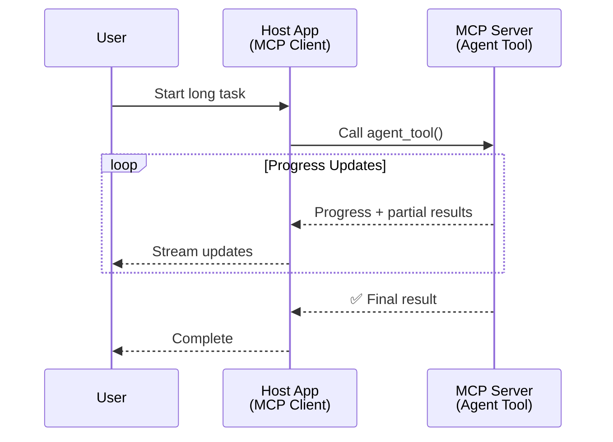
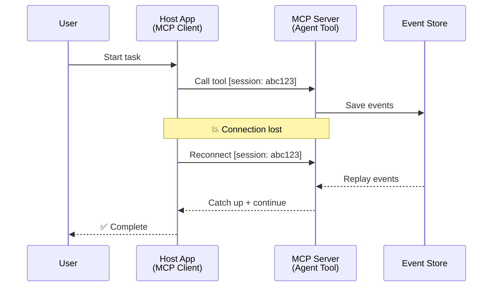
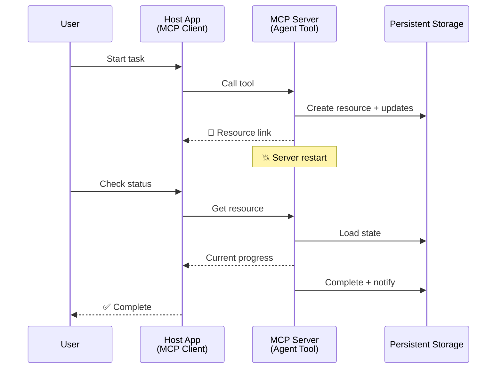
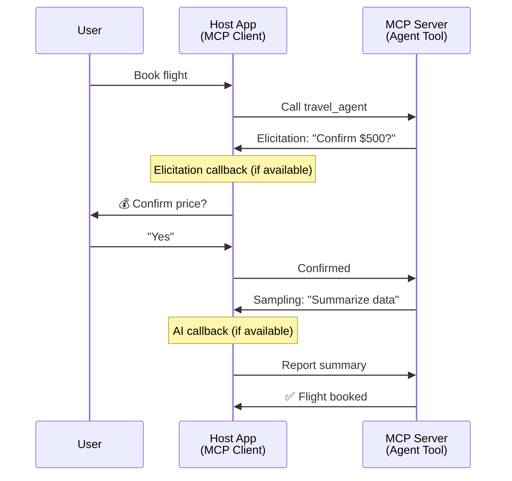
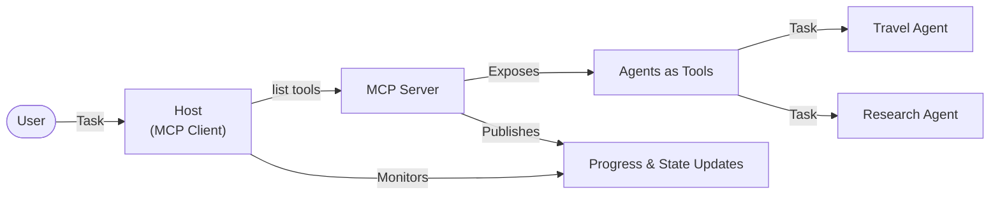

<!--
CO_OP_TRANSLATOR_METADATA:
{
  "original_hash": "5cc6836626047aa055e8960c8484a7d0",
  "translation_date": "2025-08-30T00:14:31+00:00",
  "source_file": "11-agentic-protocols/code_samples/mcp-agents/README.md",
  "language_code": "ja"
}
-->
# MCPを使ったエージェント間通信システムの構築

> TL;DR - MCPでエージェント間通信を構築できるか？答えは「はい」です！

MCPは、元々の「LLMにコンテキストを提供する」という目的を大きく超えて進化しました。最近の改良には、[再開可能なストリーム](https://modelcontextprotocol.io/docs/concepts/transports#resumability-and-redelivery)、[エリシテーション](https://modelcontextprotocol.io/specification/2025-06-18/client/elicitation)、[サンプリング](https://modelcontextprotocol.io/specification/2025-06-18/client/sampling)、および通知（[進捗](https://modelcontextprotocol.io/specification/2025-06-18/basic/utilities/progress)や[リソース](https://modelcontextprotocol.io/specification/2025-06-18/schema#resourceupdatednotification)）が含まれています。これにより、MCPは複雑なエージェント間通信システムを構築するための強力な基盤を提供します。

## エージェント/ツールに関する誤解

エージェント的な動作を持つツール（長時間実行される、実行中に追加の入力が必要になる場合があるなど）を探求する開発者が増える中で、MCPが不適切だという誤解が広まっています。これは、初期のツールの例が単純なリクエスト-レスポンスパターンに焦点を当てていたためです。

この認識は時代遅れです。MCP仕様は過去数か月で大幅に強化され、長時間実行されるエージェント的な動作を構築するためのギャップを埋める機能が追加されました：

- **ストリーミングと部分的な結果**：実行中のリアルタイム進捗更新
- **再開可能性**：クライアントが切断後に再接続して続行可能
- **耐久性**：サーバー再起動後も結果が保持される（例：リソースリンクを介して）
- **マルチターン**：エリシテーションやサンプリングを介した実行中のインタラクティブな入力

これらの機能を組み合わせることで、MCPプロトコル上で複雑なエージェント的およびマルチエージェントアプリケーションを構築できます。

参考として、MCPサーバー上で利用可能な「ツール」をエージェントと呼びます。これは、MCPクライアントを実装するホストアプリケーションが存在し、MCPサーバーとセッションを確立してエージェントを呼び出すことを意味します。

## MCPツールが「エージェント的」であるための条件

実装に進む前に、長時間実行されるエージェントをサポートするために必要なインフラストラクチャの能力を確認しましょう。

> エージェントとは、長期間にわたって自律的に動作し、複雑なタスクを処理し、リアルタイムのフィードバックに基づいて複数回のインタラクションや調整を必要とするエンティティと定義します。

### 1. ストリーミングと部分的な結果

従来のリクエスト-レスポンスパターンは、長時間実行されるタスクには適していません。エージェントは以下を提供する必要があります：

- リアルタイムの進捗更新
- 中間結果

**MCPのサポート**：リソース更新通知により部分的な結果のストリーミングが可能ですが、JSON-RPCの1:1リクエスト/レスポンスモデルとの競合を避けるための慎重な設計が必要です。

| 機能                      | ユースケース                                                                                                                                                                       | MCPのサポート                                                                                |
| -------------------------- | ------------------------------------------------------------------------------------------------------------------------------------------------------------------------------ | ------------------------------------------------------------------------------------------ |
| リアルタイム進捗更新       | ユーザーがコードベース移行タスクをリクエスト。エージェントが進捗をストリーム配信：「10% - 依存関係を分析中... 25% - TypeScriptファイルを変換中... 50% - インポートを更新中...」          | ✅ 進捗通知                                                                                  |
| 部分的な結果              | 「本を生成する」タスクが部分的な結果をストリーム配信。例：1) ストーリーアークの概要、2) 章のリスト、3) 完成した各章。ホストは任意の段階で検査、キャンセル、またはリダイレクト可能。 | ✅ 通知は部分的な結果を含むように「拡張」可能。PR 383, 776の提案を参照。                     |

<div align="center" style="font-style: italic; font-size: 0.95em; margin-bottom: 0.5em;">
<strong>図1:</strong> この図は、MCPエージェントが長時間実行されるタスク中にホストアプリケーションにリアルタイム進捗更新と部分的な結果をストリーム配信する方法を示しています。これにより、ユーザーは実行状況をリアルタイムで監視できます。
</div>



### 2. 再開可能性

エージェントはネットワークの中断を適切に処理する必要があります：

- （クライアントの）切断後に再接続
- 中断した場所から続行（メッセージの再配信）

**MCPのサポート**：MCPのStreamableHTTPトランスポートは現在、セッションIDと最後のイベントIDを使用してセッションの再開とメッセージの再配信をサポートしています。ここで重要なのは、サーバーがクライアント再接続時にイベントを再生できるEventStoreを実装する必要があることです。  
なお、トランスポートに依存しない再開可能なストリームを探るコミュニティ提案（PR #975）があります。

| 機能          | ユースケース                                                                                                                                                   | MCPのサポート                                                                |
| ------------ | ---------------------------------------------------------------------------------------------------------------------------------------------------------- | -------------------------------------------------------------------------- |
| 再開可能性   | 長時間実行されるタスク中にクライアントが切断。再接続時にセッションが再開され、失われたイベントが再生され、シームレスに続行可能。                                 | ✅ StreamableHTTPトランスポート（セッションID、イベント再生、EventStore）     |

<div align="center" style="font-style: italic; font-size: 0.95em; margin-bottom: 0.5em;">
<strong>図2:</strong> この図は、MCPのStreamableHTTPトランスポートとイベントストアがどのようにシームレスなセッション再開を可能にするかを示しています。クライアントが切断した場合でも、再接続して失われたイベントを再生し、進捗を失うことなくタスクを続行できます。
</div>



### 3. 耐久性

長時間実行されるエージェントには永続的な状態が必要です：

- サーバー再起動後も結果が保持される
- 状態を外部から取得可能
- セッションをまたいだ進捗追跡

**MCPのサポート**：MCPは現在、ツール呼び出しに対してリソースリンクの戻り値タイプをサポートしています。今日の可能なパターンとして、リソースを作成し、すぐにリソースリンクを返すツールを設計することが挙げられます。ツールはバックグラウンドでタスクを処理し、リソースを更新します。一方、クライアントはこのリソースの状態をポーリングして部分的または完全な結果を取得する（サーバーが提供するリソース更新に基づく）か、リソースの更新通知を購読することができます。

ここでの制限は、リソースのポーリングや更新通知の購読がリソースを消費し、スケールに影響を与える可能性があることです。サーバーがクライアント/ホストアプリケーションに更新を通知するためのWebhookやトリガーを含む可能性を探るコミュニティ提案（#992を含む）があります。

| 機能        | ユースケース                                                                                                                                        | MCPのサポート                                                        |
| ---------- | ----------------------------------------------------------------------------------------------------------------------------------------------- | ------------------------------------------------------------------ |
| 耐久性     | データ移行タスク中にサーバーがクラッシュ。結果と進捗が再起動後も保持され、クライアントが状態を確認して永続的なリソースから続行可能。                     | ✅ リソースリンク（永続的なストレージと状態通知）                     |

今日の一般的なパターンとして、リソースを作成し、すぐにリソースリンクを返すツールを設計することが挙げられます。ツールはバックグラウンドでタスクを処理し、進捗更新や部分的な結果として機能するリソース通知を発行し、必要に応じてリソースの内容を更新します。

<div align="center" style="font-style: italic; font-size: 0.95em; margin-bottom: 0.5em;">
<strong>図3:</strong> この図は、MCPエージェントが永続的なリソースと状態通知を使用して、長時間実行されるタスクがサーバー再起動後も保持される方法を示しています。これにより、クライアントは進捗を確認し、障害後でも結果を取得できます。
</div>



### 4. マルチターンインタラクション

エージェントは実行中に追加の入力を必要とする場合があります：

- 人間による確認や承認
- 複雑な決定のためのAI支援
- 動的なパラメータ調整

**MCPのサポート**：サンプリング（AI入力用）とエリシテーション（人間入力用）を介して完全にサポートされています。

| 機能                 | ユースケース                                                                                                                                     | MCPのサポート                                           |
| ------------------- | -------------------------------------------------------------------------------------------------------------------------------------------- | ----------------------------------------------------- |
| マルチターンインタラクション | 旅行予約エージェントがユーザーに価格確認を求め、その後AIに旅行データを要約させて予約取引を完了する。                                         | ✅ エリシテーション（人間入力）、サンプリング（AI入力） |

<div align="center" style="font-style: italic; font-size: 0.95em; margin-bottom: 0.5em;">
<strong>図4:</strong> この図は、MCPエージェントが実行中に人間の入力をインタラクティブに引き出したり、AI支援を要求したりする方法を示しています。これにより、確認や動的な意思決定を含む複雑なマルチターンワークフローをサポートします。
</div>



## MCPで長時間実行されるエージェントを実装する - コード概要

この記事の一環として、[コードリポジトリ](https://github.com/victordibia/ai-tutorials/tree/main/MCP%20Agents)を提供します。このリポジトリには、MCP Python SDKを使用してStreamableHTTPトランスポートでセッション再開とメッセージ再配信を実現する長時間実行されるエージェントの完全な実装が含まれています。この実装は、MCPの機能を組み合わせて高度なエージェント的な動作を可能にする方法を示しています。

具体的には、以下の2つの主要なエージェントツールを備えたサーバーを実装します：

- **旅行エージェント** - エリシテーションを介した価格確認をシミュレートする旅行予約サービス
- **リサーチエージェント** - サンプリングを介したAI支援の要約を伴うリサーチタスク

両エージェントはリアルタイム進捗更新、インタラクティブな確認、完全なセッション再開機能を示します。

### 主要な実装コンセプト

以下のセクションでは、各機能に対するサーバー側エージェントの実装とクライアント側ホストの処理を示します：

#### ストリーミングと進捗更新 - リアルタイムタスクステータス

ストリーミングにより、エージェントは長時間実行されるタスク中にリアルタイムの進捗更新を提供し、ユーザーにタスクの状態と中間結果を通知します。

**サーバー実装（エージェントが進捗通知を送信）：**

```python
# From server/server.py - Travel agent sending progress updates
for i, step in enumerate(steps):
    await ctx.session.send_progress_notification(
        progress_token=ctx.request_id,
        progress=i * 25,
        total=100,
        message=step,
        related_request_id=str(ctx.request_id)
    )
    await anyio.sleep(2)  # Simulate work

# Alternative: Log messages for detailed step-by-step updates
await ctx.session.send_log_message(
    level="info",
    data=f"Processing step {current_step}/{steps} ({progress_percent}%)",
    logger="long_running_agent",
    related_request_id=ctx.request_id,
)
```

**クライアント実装（ホストが進捗更新を受信）：**

```python
# From client/client.py - Client handling real-time notifications
async def message_handler(message) -> None:
    if isinstance(message, types.ServerNotification):
        if isinstance(message.root, types.LoggingMessageNotification):
            console.print(f"📡 [dim]{message.root.params.data}[/dim]")
        elif isinstance(message.root, types.ProgressNotification):
            progress = message.root.params
            console.print(f"🔄 [yellow]{progress.message} ({progress.progress}/{progress.total})[/yellow]")

# Register message handler when creating session
async with ClientSession(
    read_stream, write_stream,
    message_handler=message_handler
) as session:
```

#### エリシテーション - ユーザー入力の要求

エリシテーションにより、エージェントは実行中にユーザー入力を要求できます。これは、長時間実行されるタスク中の確認、明確化、または承認に不可欠です。

**サーバー実装（エージェントが確認を要求）：**

```python
# From server/server.py - Travel agent requesting price confirmation
elicit_result = await ctx.session.elicit(
    message=f"Please confirm the estimated price of $1200 for your trip to {destination}",
    requestedSchema=PriceConfirmationSchema.model_json_schema(),
    related_request_id=ctx.request_id,
)

if elicit_result and elicit_result.action == "accept":
    # Continue with booking
    logger.info(f"User confirmed price: {elicit_result.content}")
elif elicit_result and elicit_result.action == "decline":
    # Cancel the booking
    booking_cancelled = True
```

**クライアント実装（ホストがエリシテーションコールバックを提供）：**

```python
# From client/client.py - Client handling elicitation requests
async def elicitation_callback(context, params):
    console.print(f"💬 Server is asking for confirmation:")
    console.print(f"   {params.message}")

    response = console.input("Do you accept? (y/n): ").strip().lower()

    if response in ['y', 'yes']:
        return types.ElicitResult(
            action="accept",
            content={"confirm": True, "notes": "Confirmed by user"}
        )
    else:
        return types.ElicitResult(
            action="decline",
            content={"confirm": False, "notes": "Declined by user"}
        )

# Register the callback when creating the session
async with ClientSession(
    read_stream, write_stream,
    elicitation_callback=elicitation_callback
) as session:
```

#### サンプリング - AI支援の要求

サンプリングにより、エージェントは実行中に複雑な決定やコンテンツ生成のためにLLM支援を要求できます。これにより、人間とAIのハイブリッドワークフローが可能になります。

**サーバー実装（エージェントがAI支援を要求）：**

```python
# From server/server.py - Research agent requesting AI summary
sampling_result = await ctx.session.create_message(
    messages=[
        SamplingMessage(
            role="user",
            content=TextContent(type="text", text=f"Please summarize the key findings for research on: {topic}")
        )
    ],
    max_tokens=100,
    related_request_id=ctx.request_id,
)

if sampling_result and sampling_result.content:
    if sampling_result.content.type == "text":
        sampling_summary = sampling_result.content.text
        logger.info(f"Received sampling summary: {sampling_summary}")
```

**クライアント実装（ホストがサンプリングコールバックを提供）：**

```python
# From client/client.py - Client handling sampling requests
async def sampling_callback(context, params):
    message_text = params.messages[0].content.text if params.messages else 'No message'
    console.print(f"🧠 Server requested sampling: {message_text}")

    # In a real application, this could call an LLM API
    # For demo purposes, we provide a mock response
    mock_response = "Based on current research, MCP has evolved significantly..."

    return types.CreateMessageResult(
        role="assistant",
        content=types.TextContent(type="text", text=mock_response),
        model="interactive-client",
        stopReason="endTurn"
    )

# Register the callback when creating the session
async with ClientSession(
    read_stream, write_stream,
    sampling_callback=sampling_callback,
    elicitation_callback=elicitation_callback
) as session:
```

#### 再開可能性 - 切断後のセッション継続

再開可能性により、長時間実行されるエージェントタスクがクライアントの切断を生き延び、再接続時にシームレスに続行できます。これはイベントストアと再開トークンを通じて実装されます。

**イベントストア実装（サーバーがセッション状態を保持）：**

```python
# From server/event_store.py - Simple in-memory event store
class SimpleEventStore(EventStore):
    def __init__(self):
        self._events: list[tuple[StreamId, EventId, JSONRPCMessage]] = []
        self._event_id_counter = 0

    async def store_event(self, stream_id: StreamId, message: JSONRPCMessage) -> EventId:
        """Store an event and return its ID."""
        self._event_id_counter += 1
        event_id = str(self._event_id_counter)
        self._events.append((stream_id, event_id, message))
        return event_id

    async def replay_events_after(self, last_event_id: EventId, send_callback: EventCallback) -> StreamId | None:
        """Replay events after the specified ID for resumption."""
        # Find events after the last known event and replay them
        for _, event_id, message in self._events[start_index:]:
            await send_callback(EventMessage(message, event_id))

# From server/server.py - Passing event store to session manager
def create_server_app(event_store: Optional[EventStore] = None) -> Starlette:
    server = ResumableServer()

    # Create session manager with event store for resumption
    session_manager = StreamableHTTPSessionManager(
        app=server,
        event_store=event_store,  # Event store enables session resumption
        json_response=False,
        security_settings=security_settings,
    )

    return Starlette(routes=[Mount("/mcp", app=session_manager.handle_request)])

# Usage: Initialize with event store
event_store = SimpleEventStore()
app = create_server_app(event_store)
```

**クライアントメタデータと再開トークン（クライアントが保存された状態を使用して再接続）：**

```python
# From client/client.py - Client resumption with metadata
if existing_tokens and existing_tokens.get("resumption_token"):
    # Use existing resumption token to continue where we left off
    metadata = ClientMessageMetadata(
        resumption_token=existing_tokens["resumption_token"],
    )
else:
    # Create callback to save resumption token when received
    def enhanced_callback(token: str):
        protocol_version = getattr(session, 'protocol_version', None)
        token_manager.save_tokens(session_id, token, protocol_version, command, args)

    metadata = ClientMessageMetadata(
        on_resumption_token_update=enhanced_callback,
    )

# Send request with resumption metadata
result = await session.send_request(
    types.ClientRequest(
        types.CallToolRequest(
            method="tools/call",
            params=types.CallToolRequestParams(name=command, arguments=args)
        )
    ),
    types.CallToolResult,
    metadata=metadata,
)
```

ホストアプリケーションはセッションIDと再開トークンをローカルに保持し、進捗や状態を失うことなく既存のセッションに再接続できます。

### コード構成

<div align="center" style="font-style: italic; font-size: 0.95em; margin-bottom: 0.5em;">
<strong>図5:</strong> MCPベースのエージェントシステムアーキテクチャ
</div>



**主要ファイル：**

- **`server/server.py`** - 旅行およびリサーチエージェントを備えた再開可能なMCPサーバー。エリシテーション、サンプリング、進捗更新を示します。
- **`client/client.py`** - 再開サポート、コールバックハンドラ、トークン管理を備えたインタラクティブなホストアプリケーション
- **`server/event_store.py`** - セッション再開とメッセージ再配信を可能にするイベントストア実装

## MCPでのマルチエージェント通信への拡張

上記の実装は、ホストアプリケーションの知能と範囲を拡張することでマルチエージェントシステムに拡張できます：

- **インテリジェントなタスク分解**：ホストが複雑なユーザーリクエストを分析し、異なる専門エージェント向けにサブタスクに分解
- **マルチサーバー調整**：ホストが複数のMCPサーバーに接続し、それぞれ異なるエージェント機能を公開
- **タスク状態管理**：ホストが複数の同時エージェントタスク間の進捗を追跡し、依存関係とシーケンシングを処理
- **回復力とリトライ**：ホストが障害を管理し、リトライロジックを実装し、エージェントが利用できなくなった場合にタスクを再ルート
- **結果の統合**：ホストが複数のエージェントからの出力

---

**免責事項**:  
この文書は、AI翻訳サービス [Co-op Translator](https://github.com/Azure/co-op-translator) を使用して翻訳されています。正確性を追求しておりますが、自動翻訳には誤りや不正確な部分が含まれる可能性があることをご承知ください。元の言語で記載された文書が正式な情報源とみなされるべきです。重要な情報については、専門の人間による翻訳を推奨します。この翻訳の使用に起因する誤解や誤った解釈について、当方は一切の責任を負いません。