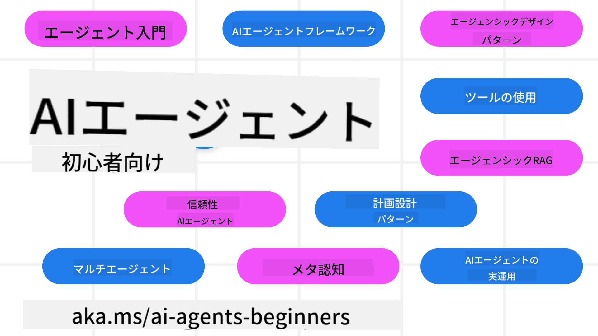

<!--
CO_OP_TRANSLATOR_METADATA:
{
  "original_hash": "6b07046397366e6f6f4524c9ddeba1e1",
  "translation_date": "2025-07-12T14:45:06+00:00",
  "source_file": "README.md",
  "language_code": "ja"
}
-->
# 初心者向けAIエージェント講座

## AIエージェント構築に必要な知識を学べる11のレッスン

  
  
  
  

### 🌐 多言語対応

#### GitHub Actionによるサポート（自動化＆常に最新）

[フランス語](../fr/README.md) | [スペイン語](../es/README.md) | [ドイツ語](../de/README.md) | [ロシア語](../ru/README.md) | [アラビア語](../ar/README.md) | [ペルシャ語（ファルシ）](../fa/README.md) | [ウルドゥー語](../ur/README.md) | [中国語（簡体字）](../zh/README.md) | [中国語（繁体字・マカオ）](../mo/README.md) | [中国語（繁体字・香港）](../hk/README.md) | [中国語（繁体字・台湾）](../tw/README.md) | [日本語](./README.md) | [韓国語](../ko/README.md) | [ヒンディー語](../hi/README.md) | [ベンガル語](../bn/README.md) | [マラーティー語](../mr/README.md) | [ネパール語](../ne/README.md) | [パンジャブ語（グルムキー）](../pa/README.md) | [ポルトガル語（ポルトガル）](../pt/README.md) | [ポルトガル語（ブラジル）](../br/README.md) | [イタリア語](../it/README.md) | [ポーランド語](../pl/README.md) | [トルコ語](../tr/README.md) | [ギリシャ語](../el/README.md) | [タイ語](../th/README.md) | [スウェーデン語](../sv/README.md) | [デンマーク語](../da/README.md) | [ノルウェー語](../no/README.md) | [フィンランド語](../fi/README.md) | [オランダ語](../nl/README.md) | [ヘブライ語](../he/README.md) | [ベトナム語](../vi/README.md) | [インドネシア語](../id/README.md) | [マレー語](../ms/README.md) | [タガログ語（フィリピン）](../tl/README.md) | [スワヒリ語](../sw/README.md) | [ハンガリー語](../hu/README.md) | [チェコ語](../cs/README.md) | [スロバキア語](../sk/README.md) | [ルーマニア語](../ro/README.md) | [ブルガリア語](../bg/README.md) | [セルビア語（キリル）](../sr/README.md) | [クロアチア語](../hr/README.md) | [スロベニア語](../sl/README.md) | [ウクライナ語](../uk/README.md) | [ビルマ語（ミャンマー）](../my/README.md)

**追加の翻訳言語をご希望の場合は、[こちら](https://github.com/Azure/co-op-translator/blob/main/getting_started/supported-languages.md)をご覧ください。**

  
  

## 🌱 はじめに

この講座は、AIエージェント構築の基礎を学べる11のレッスンで構成されています。各レッスンは独立したテーマなので、好きなところから始めてください！

多言語対応もしています。対応言語は[こちら](../..)からご確認ください。

もしGenerative AIモデルを使った開発が初めてなら、21のレッスンでGenAIの基礎を学べる[Generative AI For Beginners](https://aka.ms/genai-beginners)講座もおすすめです。

このリポジトリに[スター（🌟）を付ける](https://docs.github.com/en/get-started/exploring-projects-on-github/saving-repositories-with-stars?WT.mc_id=academic-105485-koreyst)ことと、[フォークして](https://github.com/microsoft/ai-agents-for-beginners/fork)コードを実行するのを忘れないでください。

### 必要なもの

各レッスンにはコード例が含まれており、code_samplesフォルダーにあります。自分のコピーを作るには[このリポジトリをフォーク](https://github.com/microsoft/ai-agents-for-beginners/fork)してください。

これらの演習で使うコード例は、Azure AI FoundryとGitHub Model Catalogsを利用して言語モデルとやり取りしています：

- [Github Models](https://aka.ms/ai-agents-beginners/github-models) - 無料／制限あり  
- [Azure AI Foundry](https://aka.ms/ai-agents-beginners/ai-foundry) - Azureアカウントが必要

また、この講座ではMicrosoftの以下のAIエージェントフレームワークやサービスも使用しています：

- [Azure AI Agent Service](https://aka.ms/ai-agents-beginners/ai-agent-service)  
- [Semantic Kernel](https://aka.ms/ai-agents-beginners/semantic-kernel)  
- [AutoGen](https://aka.ms/ai-agents/autogen)

コードの実行方法については、[Course Setup](./00-course-setup/README.md)をご覧ください。

## 🙏 ご協力ください

提案やスペルミス、コードの誤りを見つけたら、[Issueを投稿](https://github.com/microsoft/ai-agents-for-beginners/issues?WT.mc_id=academic-105485-koreyst)するか、[プルリクエストを作成](https://github.com/microsoft/ai-agents-for-beginners/pulls?WT.mc_id=academic-105485-koreyst)してください。

AIエージェントの構築で困ったり質問があれば、[Azure AI Foundry Community Discord](https://discord.gg/kzRShWzttr)に参加してください。

製品のフィードバックやエラー報告は、[Azure AI Foundry Developer Forum](https://aka.ms/azureaifoundry/forum)をご利用ください。

## 📂 各レッスンに含まれるもの

- READMEにあるテキストレッスンと短い動画  
- Azure AI FoundryとGithub Models（無料）をサポートするPythonコードサンプル  
- 学習を続けるための追加リソースへのリンク  

## 🗃️ レッスン一覧

| **レッスン**                             | **テキスト＆コード**                                | **動画**                                                    | **追加学習**                                                                           |
|------------------------------------------|----------------------------------------------------|------------------------------------------------------------|----------------------------------------------------------------------------------------|
| AIエージェント入門とユースケース         | [リンク](./01-intro-to-ai-agents/README.md)          | [動画](https://youtu.be/3zgm60bXmQk?si=z8QygFvYQv-9WtO1)    | [リンク](https://aka.ms/ai-agents-beginners/collection?WT.mc_id=academic-105485-koreyst) |
| AIエージェントフレームワークの探求       | [リンク](./02-explore-agentic-frameworks/README.md)  | [動画](https://youtu.be/ODwF-EZo_O8?si=Vawth4hzVaHv-u0H)    | [リンク](https://aka.ms/ai-agents-beginners/collection?WT.mc_id=academic-105485-koreyst) |
| AIエージェント設計パターンの理解         | [リンク](./03-agentic-design-patterns/README.md)     | [動画](https://youtu.be/m9lM8qqoOEA?si=BIzHwzstTPL8o9GF)    | [リンク](https://aka.ms/ai-agents-beginners/collection?WT.mc_id=academic-105485-koreyst) |
| ツール利用設計パターン                   | [リンク](./04-tool-use/README.md)                    | [動画](https://youtu.be/vieRiPRx-gI?si=2z6O2Xu2cu_Jz46N)    | [リンク](https://aka.ms/ai-agents-beginners/collection?WT.mc_id=academic-105485-koreyst) |
| Agentic RAG                             | [リンク](./05-agentic-rag/README.md)                 | [動画](https://youtu.be/WcjAARvdL7I?si=gKPWsQpKiIlDH9A3)    | [リンク](https://aka.ms/ai-agents-beginners/collection?WT.mc_id=academic-105485-koreyst) |
| 信頼できるAIエージェントの構築           | [リンク](./06-building-trustworthy-agents/README.md) | [動画](https://youtu.be/iZKkMEGBCUQ?si=jZjpiMnGFOE9L8OK )   | [リンク](https://aka.ms/ai-agents-beginners/collection?WT.mc_id=academic-105485-koreyst) |
| 計画設計パターン                         | [リンク](./07-planning-design/README.md)             | [動画](https://youtu.be/kPfJ2BrBCMY?si=6SC_iv_E5-mzucnC)    | [リンク](https://aka.ms/ai-agents-beginners/collection?WT.mc_id=academic-105485-koreyst) |
| マルチエージェント設計パターン           | [リンク](./08-multi-agent/README.md)                 | [動画](https://youtu.be/V6HpE9hZEx0?si=rMgDhEu7wXo2uo6g)    | [リンク](https://aka.ms/ai-agents-beginners/collection?WT.mc_id=academic-105485-koreyst) |
| メタ認知設計パターン                     | [リンク](./09-metacognition/README.md)               | [動画](https://youtu.be/His9R6gw6Ec?si=8gck6vvdSNCt6OcF)    | [リンク](https://aka.ms/ai-agents-beginners/collection?WT.mc_id=academic-105485-koreyst) |
| 本番環境でのAIエージェント               | [リンク](./10-ai-agents-production/README.md)        | [動画](https://youtu.be/l4TP6IyJxmQ?si=31dnhexRo6yLRJDl)    | [リンク](https://aka.ms/ai-agents-beginners/collection?WT.mc_id=academic-105485-koreyst) |
| MCPを使ったAIエージェント                | [リンク](./11-mcp/README.md)                         |                                                            | [リンク](https://aka.ms/mcp-for-beginners)                                             |

## 🎒 その他の講座

私たちのチームは他にも講座を制作しています！ぜひご覧ください：
- [**NEW** Model Context Protocol (MCP) For Beginners](https://github.com/microsoft/mcp-for-beginners?WT.mc_id=academic-105485-koreyst)
- [.NETを使った初心者向け生成AI](https://github.com/microsoft/Generative-AI-for-beginners-dotnet?WT.mc_id=academic-105485-koreyst)
- [初心者向け生成AI](https://github.com/microsoft/generative-ai-for-beginners?WT.mc_id=academic-105485-koreyst)
- [初心者向け機械学習](https://aka.ms/ml-beginners?WT.mc_id=academic-105485-koreyst)
- [初心者向けデータサイエンス](https://aka.ms/datascience-beginners?WT.mc_id=academic-105485-koreyst)
- [初心者向けAI](https://aka.ms/ai-beginners?WT.mc_id=academic-105485-koreyst)
- [初心者向けサイバーセキュリティ](https://github.com/microsoft/Security-101??WT.mc_id=academic-96948-sayoung)
- [初心者向けWeb開発](https://aka.ms/webdev-beginners?WT.mc_id=academic-105485-koreyst)
- [初心者向けIoT](https://aka.ms/iot-beginners?WT.mc_id=academic-105485-koreyst)
- [初心者向けXR開発](https://github.com/microsoft/xr-development-for-beginners?WT.mc_id=academic-105485-koreyst)
- [AIペアプログラミングのためのGitHub Copilotマスターガイド](https://aka.ms/GitHubCopilotAI?WT.mc_id=academic-105485-koreyst)
- [C#/.NET開発者向けGitHub Copilotマスターガイド](https://github.com/microsoft/mastering-github-copilot-for-dotnet-csharp-developers?WT.mc_id=academic-105485-koreyst)
- [自分だけのCopilotアドベンチャーを選ぼう](https://github.com/microsoft/CopilotAdventures?WT.mc_id=academic-105485-koreyst)

## 🌟 コミュニティへの感謝

Agentic RAGを示す重要なコードサンプルを提供してくれた[Shivam Goyal](https://www.linkedin.com/in/shivam2003/)に感謝します。

## 貢献について

このプロジェクトは貢献や提案を歓迎します。ほとんどの貢献には、あなたが貢献物の使用権を持ち、実際に当社にその権利を付与することを宣言する
Contributor License Agreement (CLA)への同意が必要です。詳細は
<https://cla.opensource.microsoft.com>をご覧ください。

プルリクエストを提出すると、CLAボットが自動的にCLAの提出が必要かどうかを判断し、PRに適切な装飾（ステータスチェックやコメントなど）を行います。
ボットの指示に従うだけでOKです。CLAは当社のCLAを使用しているすべてのリポジトリで一度だけ行えば十分です。

このプロジェクトは[Microsoft Open Source Code of Conduct](https://opensource.microsoft.com/codeofconduct/)を採用しています。
詳細は[Code of Conduct FAQ](https://opensource.microsoft.com/codeofconduct/faq/)をご覧いただくか、
ご質問やご意見があれば[opencode@microsoft.com](mailto:opencode@microsoft.com)までご連絡ください。

## 商標について

このプロジェクトにはプロジェクト、製品、サービスの商標やロゴが含まれている場合があります。Microsoftの商標やロゴの正当な使用は
[Microsoftの商標およびブランドガイドライン](https://www.microsoft.com/legal/intellectualproperty/trademarks/usage/general)に従う必要があります。
このプロジェクトの改変版でMicrosoftの商標やロゴを使用する場合、混乱を招いたりMicrosoftの後援を示唆したりしてはいけません。
第三者の商標やロゴの使用は、それら第三者のポリシーに従う必要があります。

**免責事項**：  
本書類はAI翻訳サービス「[Co-op Translator](https://github.com/Azure/co-op-translator)」を使用して翻訳されました。正確性の向上に努めておりますが、自動翻訳には誤りや不正確な部分が含まれる可能性があります。原文の言語によるオリジナル文書が正式な情報源とみなされるべきです。重要な情報については、専門の人間による翻訳を推奨します。本翻訳の利用により生じたいかなる誤解や誤訳についても、当方は一切の責任を負いかねます。