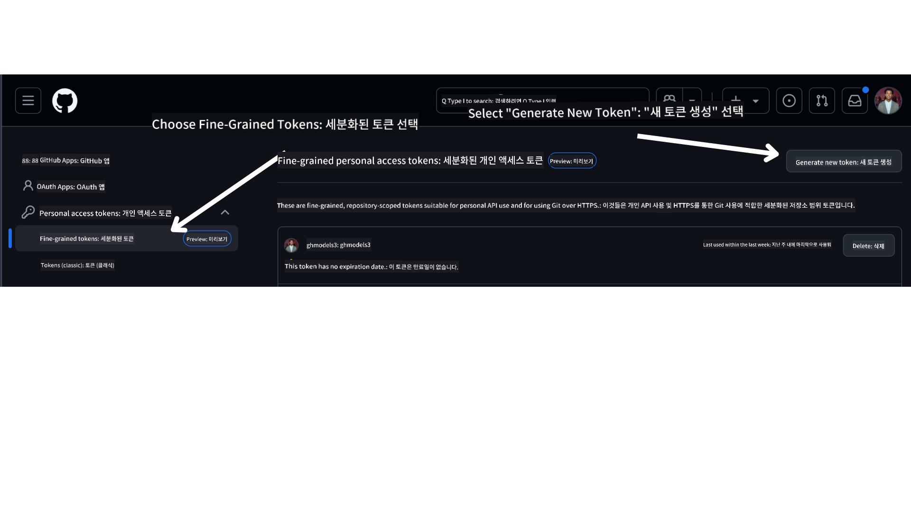

<!--
CO_OP_TRANSLATOR_METADATA:
{
  "original_hash": "76945069b52a49cd0432ae3e0b0ba22e",
  "translation_date": "2025-07-12T07:46:30+00:00",
  "source_file": "00-course-setup/README.md",
  "language_code": "ko"
}
-->
이제 다음 링크에서 이 과정의 포크된 버전을 확인할 수 있습니다:


## 코드 실행하기

이 과정에서는 AI 에이전트를 직접 만들어보며 실습할 수 있는 일련의 Jupyter 노트북을 제공합니다.

코드 샘플은 다음 중 하나를 사용합니다:

**GitHub 계정 필요 - 무료**:

1) Semantic Kernel Agent Framework + GitHub Models Marketplace. (semantic-kernel.ipynb)
2) AutoGen Framework + GitHub Models Marketplace. (autogen.ipynb)

**Azure 구독 필요**:
3) Azure AI Foundry + Azure AI Agent Service. (azureaiagent.ipynb)

세 가지 예제를 모두 시도해 보시고 자신에게 가장 잘 맞는 방법을 찾아보시길 권장합니다.

어떤 옵션을 선택하든 아래의 설정 단계를 따라야 합니다:

## 요구 사항

- Python 3.12 이상
  - **NOTE**: Python 3.12가 설치되어 있지 않다면 반드시 설치하세요. 그런 다음 python3.12로 가상환경을 만들어 requirements.txt 파일에 명시된 올바른 버전의 패키지를 설치하세요.
- GitHub 계정 - GitHub Models Marketplace 접근용
- Azure 구독 - Azure AI Foundry 접근용
- Azure AI Foundry 계정 - Azure AI Agent Service 접근용

이 저장소 루트에 `requirements.txt` 파일이 포함되어 있으며, 코드 샘플 실행에 필요한 모든 Python 패키지가 명시되어 있습니다.

터미널에서 저장소 루트 위치로 이동한 후 다음 명령어로 설치할 수 있습니다:

```bash
pip install -r requirements.txt
```

패키지 충돌과 문제를 방지하기 위해 Python 가상환경을 만드는 것을 권장합니다.

## VSCode 설정하기
VSCode에서 올바른 Python 버전을 사용하고 있는지 확인하세요.


## GitHub Models를 사용하는 샘플 설정하기

### 1단계: GitHub 개인 액세스 토큰(PAT) 받기

현재 이 과정은 GitHub Models Marketplace를 사용하여 AI 에이전트 생성에 필요한 대형 언어 모델(LLM)을 무료로 제공합니다.

이 서비스를 이용하려면 GitHub 개인 액세스 토큰을 생성해야 합니다.

GitHub 계정에서

화면 왼쪽에서 `Fine-grained tokens` 옵션을 선택하세요.

그 다음 `Generate new token`을 선택합니다.



토큰 이름을 입력하고, 만료일(권장: 30일)을 선택한 후, 토큰 권한 범위(공개 저장소)를 선택하라는 메시지가 표시됩니다.

또한 이 토큰의 권한을 다음과 같이 수정해야 합니다: Permissions -> Models -> GitHub Models 접근 허용

생성한 토큰을 복사하세요. 이 토큰을 이 과정에 포함된 `.env` 파일에 추가할 것입니다.

### 2단계: `.env` 파일 생성하기

터미널에서 다음 명령어를 실행하여 `.env` 파일을 생성하세요.

```bash
cp .env.example .env
```

이 명령어는 예제 파일을 복사하여 `.env` 파일을 생성하며, 환경 변수 값을 입력할 수 있습니다.

복사한 토큰을 `.env` 파일의 `GITHUB_TOKEN` 필드에 붙여넣기 하세요.

이제 이 과정의 코드 샘플을 실행할 준비가 되었습니다.

## Azure AI Foundry 및 Azure AI Agent Service를 사용하는 샘플 설정하기

### 1단계: Azure 프로젝트 엔드포인트 가져오기

Azure AI Foundry에서 허브와 프로젝트를 생성하는 방법은 다음 링크를 참고하세요: [Hub resources overview](https://learn.microsoft.com/en-us/azure/ai-foundry/concepts/ai-resources)

프로젝트를 생성한 후, 프로젝트의 연결 문자열을 가져와야 합니다.

Azure AI Foundry 포털에서 프로젝트의 **개요(Overview)** 페이지로 이동하면 확인할 수 있습니다.


### 2단계: `.env` 파일 생성하기

터미널에서 다음 명령어를 실행하여 `.env` 파일을 생성하세요.

```bash
cp .env.example .env
```

예제 파일을 복사하여 `.env` 파일을 생성하고, 환경 변수 값을 입력할 수 있습니다.

복사한 연결 문자열을 `.env` 파일의 `PROJECT_ENDPOINT` 필드에 붙여넣기 하세요.

### 3단계: Azure 로그인

보안 모범 사례로, Microsoft Entra ID를 사용한 [키리스 인증](https://learn.microsoft.com/azure/developer/ai/keyless-connections?tabs=csharp%2Cazure-cli?WT.mc_id=academic-105485-koreyst)을 통해 Azure OpenAI에 인증합니다. 이를 위해 먼저 운영체제에 맞는 **Azure CLI**를 설치해야 합니다. 설치 방법은 [설치 안내](https://learn.microsoft.com/cli/azure/install-azure-cli?WT.mc_id=academic-105485-koreyst)를 참고하세요.

그 다음 터미널을 열고 `az login --use-device-code` 명령어를 실행하여 Azure 계정에 로그인하세요.

로그인 후 터미널에서 구독을 선택합니다.

## 추가 환경 변수 - Azure Search 및 Azure OpenAI

Agentic RAG 강의(5강)에서는 Azure Search와 Azure OpenAI를 사용하는 샘플이 있습니다.

이 샘플을 실행하려면 `.env` 파일에 다음 환경 변수를 추가해야 합니다:

### 개요 페이지 (프로젝트)

- `AZURE_SUBSCRIPTION_ID` - 프로젝트 **개요** 페이지의 **프로젝트 세부 정보**에서 확인
- `AZURE_AI_PROJECT_NAME` - 프로젝트 **개요** 페이지 상단에서 확인
- `AZURE_OPENAI_SERVICE` - 프로젝트 **개요** 페이지의 **포함된 기능(Included capabilities)** 탭에서 **Azure OpenAI Service** 확인

### 관리 센터

- `AZURE_OPENAI_RESOURCE_GROUP` - **관리 센터**의 **개요** 페이지 내 **프로젝트 속성**에서 확인
- `GLOBAL_LLM_SERVICE` - **연결된 리소스**에서 **Azure AI Services** 연결 이름 확인. 없으면 Azure 포털에서 리소스 그룹 내 AI Services 리소스 이름 확인

### 모델 및 엔드포인트 페이지

- `AZURE_OPENAI_EMBEDDING_DEPLOYMENT_NAME` - 임베딩 모델(예: `text-embedding-ada-002`) 선택 후 모델 세부 정보에서 **배포 이름** 확인
- `AZURE_OPENAI_CHAT_DEPLOYMENT_NAME` - 채팅 모델(예: `gpt-4o-mini`) 선택 후 모델 세부 정보에서 **배포 이름** 확인

### Azure 포털

- `AZURE_OPENAI_ENDPOINT` - **Azure AI 서비스** 클릭 후 **리소스 관리**, **키 및 엔드포인트**에서 "Azure OpenAI 엔드포인트" 중 "Language APIs" 복사
- `AZURE_OPENAI_API_KEY` - 같은 화면에서 KEY 1 또는 KEY 2 복사
- `AZURE_SEARCH_SERVICE_ENDPOINT` - **Azure AI Search** 리소스 클릭 후 **개요**에서 확인
- `AZURE_SEARCH_API_KEY` - **설정** > **키**에서 기본 또는 보조 관리자 키 복사

### 외부 웹페이지

- `AZURE_OPENAI_API_VERSION` - [API 버전 수명 주기](https://learn.microsoft.com/en-us/azure/ai-services/openai/api-version-deprecation#latest-ga-api-release) 페이지의 **최신 GA API 릴리스** 참고

### 키리스 인증 설정

자격 증명을 하드코딩하는 대신 Azure OpenAI와 키리스 연결을 사용합니다. 이를 위해 `DefaultAzureCredential`을 가져오고, 나중에 `DefaultAzureCredential` 함수를 호출하여 자격 증명을 얻습니다.

```python
from azure.identity import DefaultAzureCredential, InteractiveBrowserCredential
```

## 어디서 막혔나요?

설정 중 문제가 있으면 언제든지 우리의

또는

포럼에 참여해 도움을 받으세요.

## 다음 강의

이제 이 과정의 코드를 실행할 준비가 되었습니다. AI 에이전트의 세계를 더 깊이 배우며 즐거운 학습 되시길 바랍니다!

[AI 에이전트 소개 및 활용 사례](../01-intro-to-ai-agents/README.md)

**면책 조항**:  
이 문서는 AI 번역 서비스 [Co-op Translator](https://github.com/Azure/co-op-translator)를 사용하여 번역되었습니다. 정확성을 위해 노력하고 있으나, 자동 번역에는 오류나 부정확한 부분이 있을 수 있음을 유의하시기 바랍니다. 원문은 해당 언어의 원본 문서가 권위 있는 자료로 간주되어야 합니다. 중요한 정보의 경우 전문적인 인간 번역을 권장합니다. 본 번역의 사용으로 인해 발생하는 오해나 잘못된 해석에 대해 당사는 책임을 지지 않습니다.