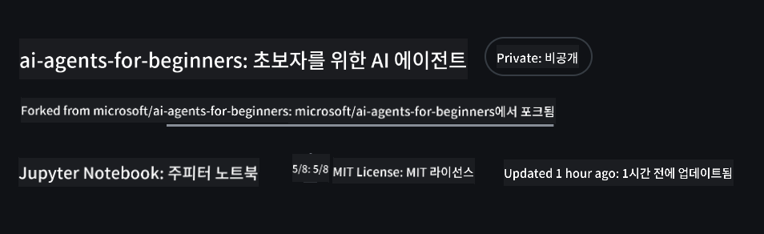
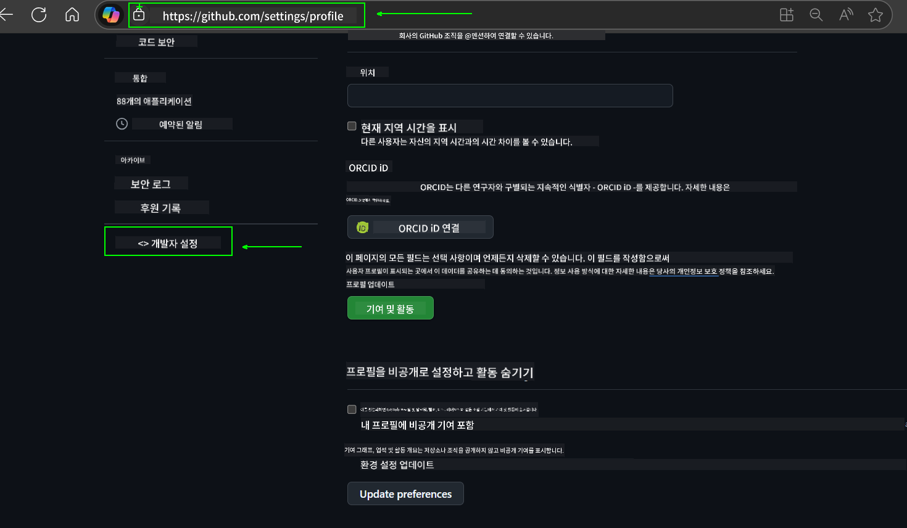
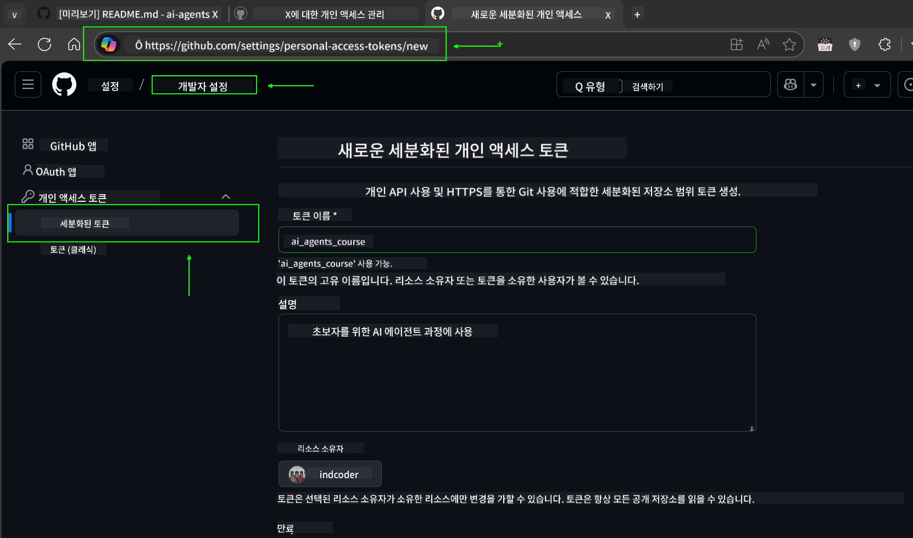
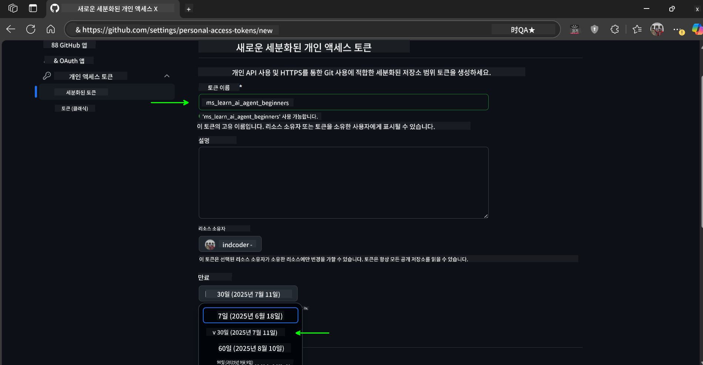
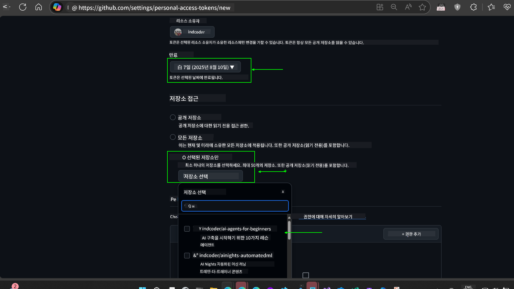
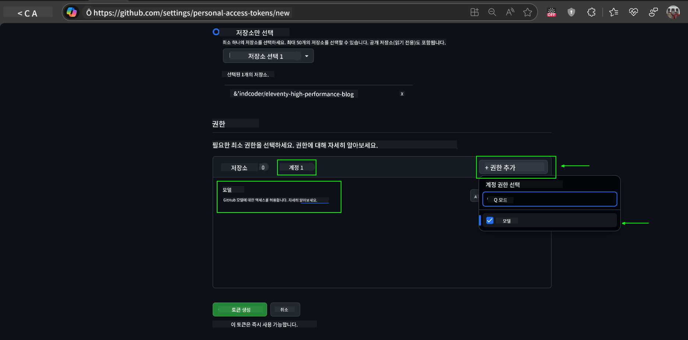
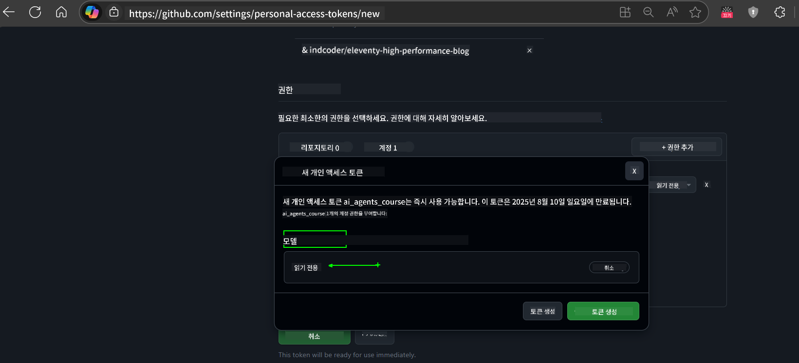
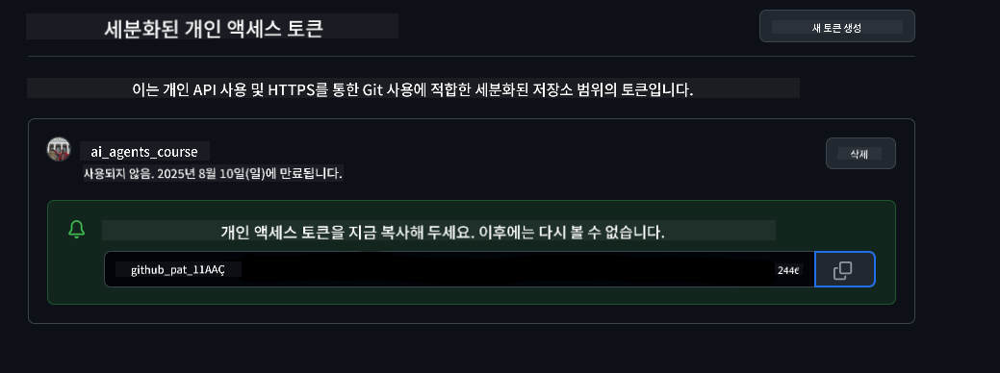
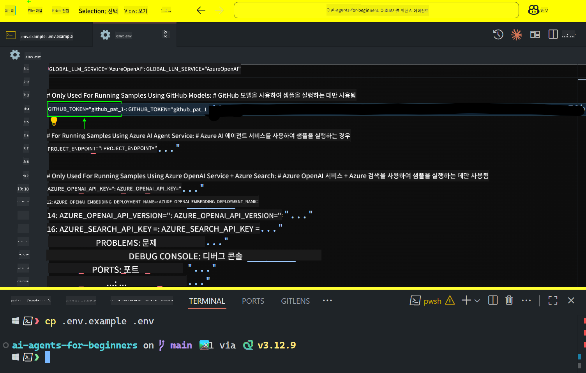
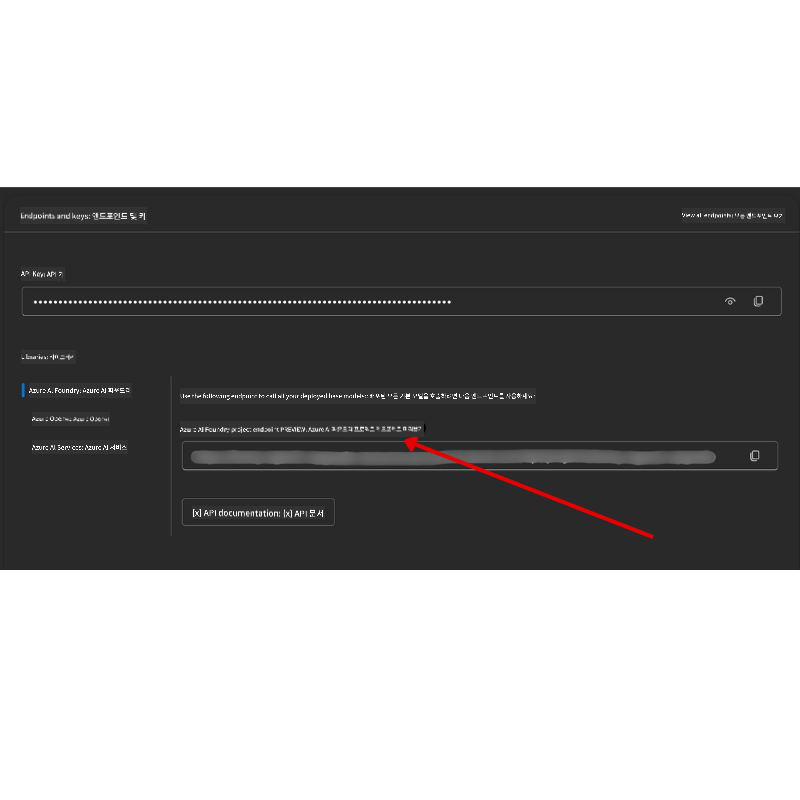

<!--
CO_OP_TRANSLATOR_METADATA:
{
  "original_hash": "8693a24942b670e3cb8def77f92513f9",
  "translation_date": "2025-08-21T12:34:04+00:00",
  "source_file": "00-course-setup/README.md",
  "language_code": "ko"
}
-->
# 코스 설정

## 소개

이 강의에서는 코스의 코드 샘플을 실행하는 방법을 다룹니다.

## 이 저장소를 클론하거나 포크하기

먼저 GitHub 저장소를 클론하거나 포크하세요. 이렇게 하면 코스 자료의 개인 버전을 만들어 코드 실행, 테스트 및 수정이 가능합니다!

이 작업은 링크를 클릭하여 수행할 수 있습니다.

이제 아래 링크에서 이 코스의 포크된 버전을 갖게 됩니다:



## 코드 실행하기

이 코스는 AI 에이전트를 직접 구축해보는 실습을 제공하는 여러 Jupyter Notebook을 제공합니다.

코드 샘플은 다음을 사용합니다:

**GitHub 계정 필요 - 무료**:

1) Semantic Kernel Agent Framework + GitHub Models Marketplace. (semantic-kernel.ipynb로 표시됨)
2) AutoGen Framework + GitHub Models Marketplace. (autogen.ipynb로 표시됨)

**Azure 구독 필요**:
3) Azure AI Foundry + Azure AI Agent Service. (azureaiagent.ipynb로 표시됨)

세 가지 예제를 모두 시도해보고 자신에게 가장 적합한 것을 찾아보길 권장합니다.

선택한 옵션에 따라 아래의 설정 단계가 결정됩니다:

## 요구 사항

- Python 3.12+
  - **NOTE**: Python 3.12이 설치되어 있지 않다면 설치하세요. 그런 다음 python3.12를 사용하여 가상 환경(venv)을 생성하여 requirements.txt 파일에서 올바른 버전을 설치하세요.
- GitHub 계정 - GitHub Models Marketplace에 액세스하기 위해 필요
- Azure 구독 - Azure AI Foundry에 액세스하기 위해 필요
- Azure AI Foundry 계정 - Azure AI Agent Service에 액세스하기 위해 필요

이 저장소의 루트에 있는 `requirements.txt` 파일에는 코드 샘플을 실행하는 데 필요한 모든 Python 패키지가 포함되어 있습니다.

다음 명령을 터미널에서 실행하여 패키지를 설치할 수 있습니다:

```bash
pip install -r requirements.txt
```
Python 가상 환경을 생성하여 충돌 및 문제를 방지하는 것을 권장합니다.

## VSCode 설정
VSCode에서 올바른 Python 버전을 사용하고 있는지 확인하세요.


## GitHub Models 샘플 설정

### 1단계: GitHub 개인 액세스 토큰(PAT) 가져오기

이 코스는 GitHub Models Marketplace를 활용하여 AI 에이전트를 구축하는 데 사용할 무료 대형 언어 모델(LLM)을 제공합니다.

GitHub Models를 사용하려면 [GitHub 개인 액세스 토큰](https://docs.github.com/en/authentication/keeping-your-account-and-data-secure/managing-your-personal-access-tokens)을 생성해야 합니다.

GitHub 계정에서 다음 단계를 따라주세요.

[최소 권한 원칙](https://docs.github.com/en/get-started/learning-to-code/storing-your-secrets-safely)을 준수하여 토큰을 생성하세요. 이는 이 코스의 코드 샘플을 실행하는 데 필요한 권한만 토큰에 부여해야 한다는 의미입니다.

1. **개발자 설정**으로 이동하여 화면 왼쪽에서 `세분화된 토큰` 옵션을 선택합니다.
   

   그런 다음 `새 토큰 생성`을 선택합니다.

   

2. 토큰의 목적을 반영하는 설명 이름을 입력하여 나중에 쉽게 식별할 수 있도록 합니다.

    🔐 토큰 기간 추천

    추천 기간: 30일  
    더 안전한 설정을 위해 7일과 같은 짧은 기간을 선택할 수 있습니다 🛡️  
    이는 학습 동력을 유지하며 코스를 완료하기 위한 개인 목표를 설정하는 좋은 방법입니다 🚀.

    

3. 토큰의 범위를 이 저장소의 포크로 제한합니다.

    

4. 토큰의 권한을 제한합니다: **Permissions** 탭에서 **Account**를 클릭하고 "+ Add permissions" 버튼을 클릭합니다. 드롭다운이 나타납니다. **Models**를 검색하고 해당 상자를 선택하세요.
    

5. 토큰을 생성하기 전에 필요한 권한을 확인하세요. 

6. 토큰을 생성하기 전에 암호 관리자 금고와 같은 안전한 장소에 토큰을 저장할 준비가 되었는지 확인하세요. 생성 후에는 다시 표시되지 않습니다. 

방금 생성한 새 토큰을 복사하세요. 이제 이 코스에 포함된 `.env` 파일에 추가합니다.

### 2단계: `.env` 파일 생성

터미널에서 다음 명령을 실행하여 `.env` 파일을 생성하세요.

```bash
cp .env.example .env
```

이 명령은 예제 파일을 복사하여 `.env` 파일을 생성하며, 환경 변수 값을 채울 수 있습니다.

복사한 토큰을 열고 `.env` 파일을 좋아하는 텍스트 편집기로 열어 `GITHUB_TOKEN` 필드에 토큰을 붙여넣으세요.


이제 이 코스의 코드 샘플을 실행할 수 있습니다.

## Azure AI Foundry 및 Azure AI Agent Service 샘플 설정

### 1단계: Azure 프로젝트 엔드포인트 가져오기

Azure AI Foundry에서 허브와 프로젝트를 생성하는 단계는 [허브 리소스 개요](https://learn.microsoft.com/en-us/azure/ai-foundry/concepts/ai-resources)를 참조하세요.

프로젝트를 생성한 후 프로젝트의 연결 문자열을 가져와야 합니다.

이는 Azure AI Foundry 포털에서 프로젝트의 **개요** 페이지로 이동하여 수행할 수 있습니다.



### 2단계: `.env` 파일 생성

터미널에서 다음 명령을 실행하여 `.env` 파일을 생성하세요.

```bash
cp .env.example .env
```

이 명령은 예제 파일을 복사하여 `.env` 파일을 생성하며, 환경 변수 값을 채울 수 있습니다.

복사한 토큰을 열고 `.env` 파일을 좋아하는 텍스트 편집기로 열어 `PROJECT_ENDPOINT` 필드에 토큰을 붙여넣으세요.

### 3단계: Azure 로그인

보안 모범 사례로 Microsoft Entra ID를 사용하여 Azure OpenAI에 [키 없는 인증](https://learn.microsoft.com/azure/developer/ai/keyless-connections?tabs=csharp%2Cazure-cli?WT.mc_id=academic-105485-koreyst)을 수행합니다.

다음으로 터미널을 열고 `az login --use-device-code`를 실행하여 Azure 계정에 로그인하세요.

로그인한 후 터미널에서 구독을 선택하세요.

## 추가 환경 변수 - Azure Search 및 Azure OpenAI

Agentic RAG Lesson - Lesson 5에서는 Azure Search 및 Azure OpenAI를 사용하는 샘플이 포함되어 있습니다.

이 샘플을 실행하려면 `.env` 파일에 다음 환경 변수를 추가해야 합니다:

### 개요 페이지 (프로젝트)

- `AZURE_SUBSCRIPTION_ID` - 프로젝트의 **개요** 페이지에서 **프로젝트 세부 정보**를 확인하세요.
- `AZURE_AI_PROJECT_NAME` - 프로젝트의 **개요** 페이지 상단을 확인하세요.
- `AZURE_OPENAI_SERVICE` - **Azure OpenAI Service**의 **포함된 기능** 탭에서 확인하세요.

### 관리 센터

- `AZURE_OPENAI_RESOURCE_GROUP` - **관리 센터**의 **개요** 페이지에서 **프로젝트 속성**으로 이동하세요.
- `GLOBAL_LLM_SERVICE` - **연결된 리소스**에서 **Azure AI Services** 연결 이름을 찾으세요. 나열되지 않은 경우 리소스 그룹의 AI Services 리소스 이름을 확인하세요.

### 모델 + 엔드포인트 페이지

- `AZURE_OPENAI_EMBEDDING_DEPLOYMENT_NAME` - 임베딩 모델(예: `text-embedding-ada-002`)을 선택하고 모델 세부 정보에서 **배포 이름**을 확인하세요.
- `AZURE_OPENAI_CHAT_DEPLOYMENT_NAME` - 채팅 모델(예: `gpt-4o-mini`)을 선택하고 모델 세부 정보에서 **배포 이름**을 확인하세요.

### Azure 포털

- `AZURE_OPENAI_ENDPOINT` - **Azure AI Services**를 찾고 클릭한 후 **리소스 관리**, **키 및 엔드포인트**로 이동하여 "Azure OpenAI endpoints"에서 "Language APIs"를 복사하세요.
- `AZURE_OPENAI_API_KEY` - 동일한 화면에서 KEY 1 또는 KEY 2를 복사하세요.
- `AZURE_SEARCH_SERVICE_ENDPOINT` - **Azure AI Search** 리소스를 찾고 클릭한 후 **개요**를 확인하세요.
- `AZURE_SEARCH_API_KEY` - 그런 다음 **설정**으로 이동하여 **키**에서 기본 또는 보조 관리자 키를 복사하세요.

### 외부 웹페이지

- `AZURE_OPENAI_API_VERSION` - [API 버전 수명 주기](https://learn.microsoft.com/en-us/azure/ai-services/openai/api-version-deprecation#latest-ga-api-release) 페이지의 **최신 GA API 릴리스**를 방문하세요.

### 키 없는 인증 설정

자격 증명을 하드코딩하는 대신 Azure OpenAI와 키 없는 연결을 사용합니다. 이를 위해 `DefaultAzureCredential`을 가져오고 나중에 `DefaultAzureCredential` 함수를 호출하여 자격 증명을 가져옵니다.

```python
from azure.identity import DefaultAzureCredential, InteractiveBrowserCredential
```

## 문제가 있나요?

설정 실행 중 문제가 발생하면, 우리의

## 다음 강의

이제 이 코스의 코드를 실행할 준비가 되었습니다. AI 에이전트의 세계를 더 배우며 즐거운 학습 되세요!

[AI 에이전트 소개 및 에이전트 사용 사례](../01-intro-to-ai-agents/README.md)

**면책 조항**:  
이 문서는 AI 번역 서비스 [Co-op Translator](https://github.com/Azure/co-op-translator)를 사용하여 번역되었습니다. 정확성을 위해 최선을 다하고 있지만, 자동 번역에는 오류나 부정확성이 포함될 수 있습니다. 원본 문서의 원어 버전이 권위 있는 출처로 간주되어야 합니다. 중요한 정보에 대해서는 전문적인 인간 번역을 권장합니다. 이 번역 사용으로 인해 발생하는 오해나 잘못된 해석에 대해 당사는 책임을 지지 않습니다.