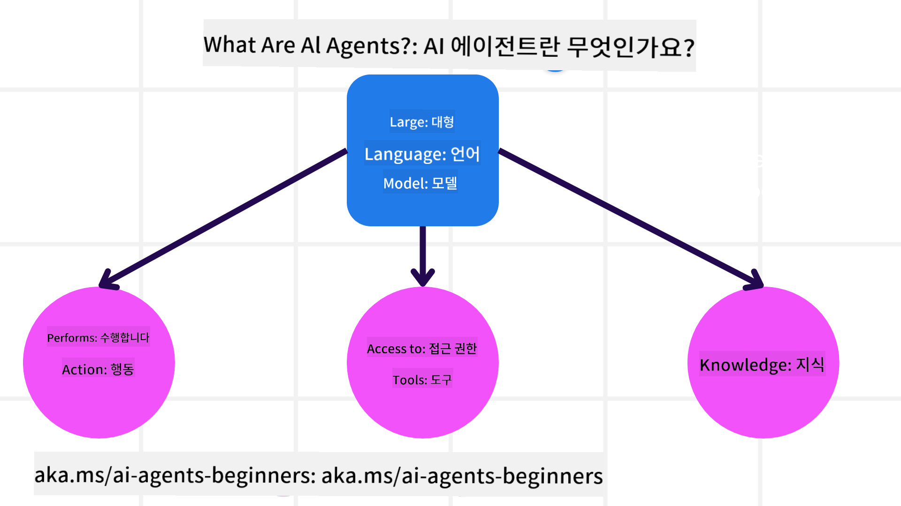
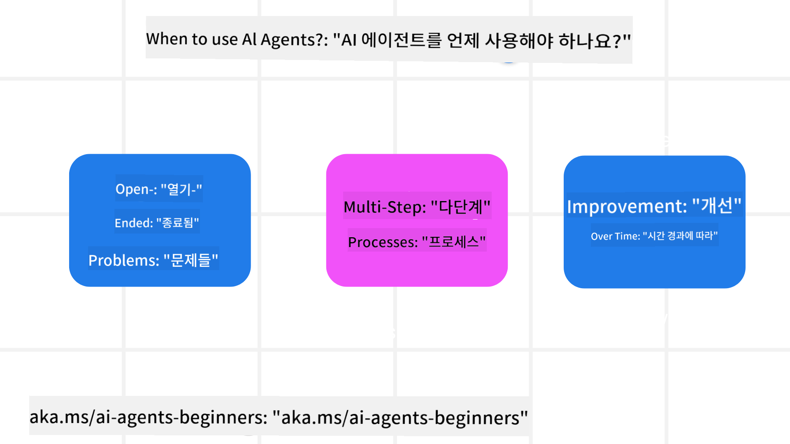

<!--
CO_OP_TRANSLATOR_METADATA:
{
  "original_hash": "d84943abc8f001ad4670418d32c2d899",
  "translation_date": "2025-07-12T08:03:32+00:00",
  "source_file": "01-intro-to-ai-agents/README.md",
  "language_code": "ko"
}
-->
다른 학습자 및 AI 에이전트 빌더들과 만나 이 과정에 대해 궁금한 점을 질문해 보세요.

이 과정을 시작하기 위해, 먼저 AI 에이전트가 무엇인지, 그리고 우리가 만드는 애플리케이션과 워크플로우에서 어떻게 활용할 수 있는지에 대해 더 깊이 이해해 보겠습니다.

## 소개

이번 수업에서는 다음 내용을 다룹니다:

- AI 에이전트란 무엇이며, 에이전트의 다양한 유형은 무엇인가?
- AI 에이전트에 가장 적합한 사용 사례는 무엇이며, 어떻게 도움이 되는가?
- 에이전트 솔루션을 설계할 때 기본적인 구성 요소는 무엇인가?

## 학습 목표
이 수업을 마치면 다음을 할 수 있어야 합니다:

- AI 에이전트 개념을 이해하고, 다른 AI 솔루션과 어떻게 다른지 알기
- AI 에이전트를 가장 효율적으로 적용하기
- 사용자와 고객 모두를 위해 생산적으로 에이전트 솔루션 설계하기

## AI 에이전트 정의 및 유형

### AI 에이전트란 무엇인가?

AI 에이전트는 **대형 언어 모델(LLM)**이 **도구와 지식에 접근**할 수 있도록 하여 그들의 능력을 확장하고, **행동을 수행**할 수 있게 하는 **시스템**입니다.

이 정의를 좀 더 세분화해 보겠습니다:

- **시스템** - 에이전트를 단일 구성 요소가 아닌 여러 구성 요소로 이루어진 시스템으로 생각하는 것이 중요합니다. 기본적으로 AI 에이전트의 구성 요소는 다음과 같습니다:
  - **환경** - AI 에이전트가 작동하는 정의된 공간입니다. 예를 들어, 여행 예약 AI 에이전트라면, 환경은 에이전트가 작업을 수행하는 여행 예약 시스템일 수 있습니다.
  - **센서** - 환경은 정보를 가지고 있으며 피드백을 제공합니다. AI 에이전트는 센서를 사용해 환경의 현재 상태에 대한 정보를 수집하고 해석합니다. 여행 예약 에이전트 예시에서, 예약 시스템은 호텔 예약 가능 여부나 항공권 가격 같은 정보를 제공합니다.
  - **액추에이터** - AI 에이전트가 환경의 현재 상태를 받으면, 현재 작업에 대해 환경을 변경하기 위해 어떤 행동을 할지 결정합니다. 여행 예약 에이전트라면 사용자를 위해 가능한 객실을 예약하는 행동이 될 수 있습니다.

**대형 언어 모델** - 에이전트 개념은 LLM이 등장하기 전부터 존재했습니다. LLM으로 AI 에이전트를 구축하는 장점은 인간 언어와 데이터를 해석할 수 있다는 점입니다. 이 능력 덕분에 LLM은 환경 정보를 해석하고 환경을 변경할 계획을 세울 수 있습니다.

**행동 수행** - AI 에이전트 시스템 밖에서 LLM은 사용자의 프롬프트에 기반해 콘텐츠나 정보를 생성하는 작업에 제한됩니다. AI 에이전트 시스템 내에서는 LLM이 사용자의 요청을 해석하고 환경 내에서 사용할 수 있는 도구를 활용해 작업을 수행할 수 있습니다.

**도구 접근** - LLM이 접근할 수 있는 도구는 1) 작동하는 환경과 2) AI 에이전트 개발자가 정의합니다. 여행 에이전트 예시에서, 에이전트의 도구는 예약 시스템에서 가능한 작업으로 제한되며, 개발자가 항공편 도구 접근을 제한할 수도 있습니다.

**메모리+지식** - 메모리는 사용자와 에이전트 간 대화 맥락에서 단기적일 수 있습니다. 장기적으로는 환경에서 제공하는 정보 외에도 AI 에이전트는 다른 시스템, 서비스, 도구, 심지어 다른 에이전트로부터 지식을 가져올 수 있습니다. 여행 에이전트 예시에서는 고객 데이터베이스에 저장된 사용자의 여행 선호 정보가 이에 해당합니다.

### AI 에이전트의 다양한 유형

이제 AI 에이전트의 일반적인 정의를 알았으니, 여행 예약 AI 에이전트에 적용할 수 있는 구체적인 에이전트 유형을 살펴보겠습니다.

| **에이전트 유형**             | **설명**                                                                                                                           | **예시**                                                                                                                                                                                                                     |
| ----------------------------- | --------------------------------------------------------------------------------------------------------------------------------- | ----------------------------------------------------------------------------------------------------------------------------------------------------------------------------------------------------------------------------- |
| **단순 반사 에이전트**        | 미리 정의된 규칙에 따라 즉각적인 행동을 수행합니다.                                                                              | 여행 에이전트가 이메일의 내용을 해석해 여행 불만 사항을 고객 서비스로 전달합니다.                                                                                                                                             |
| **모델 기반 반사 에이전트**   | 세계 모델과 그 모델의 변화를 기반으로 행동을 수행합니다.                                                                          | 여행 에이전트가 과거 가격 데이터를 바탕으로 큰 가격 변동이 있는 경로를 우선시합니다.                                                                                                                                          |
| **목표 기반 에이전트**        | 목표를 해석하고 목표 달성을 위한 행동을 결정하여 계획을 세웁니다.                                                                | 여행 에이전트가 현재 위치에서 목적지까지 필요한 여행 수단(차량, 대중교통, 항공편)을 결정해 여정을 예약합니다.                                                                                                                  |
| **효용 기반 에이전트**        | 선호도를 고려하고 수치적으로 절충안을 평가해 목표 달성 방법을 결정합니다.                                                        | 여행 에이전트가 편리함과 비용을 저울질해 여행 예약 시 최대 효용을 추구합니다.                                                                                                                                                 |
| **학습 에이전트**             | 피드백에 반응해 시간이 지남에 따라 행동을 조정하며 개선합니다.                                                                    | 여행 에이전트가 여행 후 설문조사에서 받은 고객 피드백을 활용해 미래 예약을 개선합니다.                                                                                                                                         |
| **계층적 에이전트**           | 여러 에이전트가 계층 구조로 구성되어 상위 에이전트가 작업을 하위 에이전트의 하위 작업으로 분할해 완료하게 합니다.                 | 여행 에이전트가 여행 취소 작업을 여러 하위 작업(예: 특정 예약 취소)으로 나누고 하위 에이전트가 이를 수행한 후 상위 에이전트에 보고합니다.                                                                                     |
| **다중 에이전트 시스템(MAS)** | 에이전트들이 독립적으로 작업을 수행하며 협력하거나 경쟁합니다.                                                                    | 협력: 여러 에이전트가 호텔, 항공편, 엔터테인먼트 등 특정 여행 서비스를 예약합니다. 경쟁: 여러 에이전트가 공유 호텔 예약 캘린더를 관리하며 고객 예약을 위해 경쟁합니다.                                                     |

## AI 에이전트를 언제 사용해야 할까?

앞서 여행 에이전트 사례를 통해 다양한 에이전트 유형이 여행 예약의 여러 시나리오에 어떻게 적용되는지 설명했습니다. 이 애플리케이션을 코스 전반에 걸쳐 계속 사용할 것입니다.

AI 에이전트가 가장 적합한 사용 사례 유형을 살펴보겠습니다:

- **개방형 문제** - 작업 완료에 필요한 단계를 LLM이 스스로 결정하도록 허용하는 경우, 워크플로우에 하드코딩하기 어려운 상황에 적합합니다.
- **다단계 프로세스** - AI 에이전트가 단일 조회가 아닌 여러 단계에 걸쳐 도구나 정보를 사용해야 하는 복잡한 작업에 적합합니다.
- **시간에 따른 개선** - 에이전트가 환경이나 사용자로부터 피드백을 받아 시간이 지남에 따라 더 나은 효용을 제공하도록 개선할 수 있는 작업에 적합합니다.

AI 에이전트 사용 시 고려사항은 '신뢰할 수 있는 AI 에이전트 구축' 수업에서 더 다룹니다.

## 에이전트 솔루션의 기본

### 에이전트 개발

AI 에이전트 시스템을 설계하는 첫 단계는 도구, 행동, 그리고 동작을 정의하는 것입니다. 이 과정에서는 **Azure AI Agent Service**를 사용해 에이전트를 정의하는 데 중점을 둡니다. 이 서비스는 다음과 같은 기능을 제공합니다:

- OpenAI, Mistral, Llama 같은 오픈 모델 선택
- Tripadvisor 같은 공급자를 통한 라이선스 데이터 사용
- 표준화된 OpenAPI 3.0 도구 사용

### 에이전트 패턴

LLM과의 소통은 프롬프트를 통해 이루어집니다. AI 에이전트가 반자율적으로 작동하기 때문에 환경 변화 후에 항상 수동으로 LLM에 재프롬프트를 하는 것이 불가능하거나 필요하지 않을 수 있습니다. 우리는 여러 단계에 걸쳐 LLM에 프롬프트를 보다 확장성 있게 전달할 수 있는 **에이전트 패턴**을 사용합니다.

이 과정은 현재 인기 있는 에이전트 패턴 몇 가지로 나누어 진행됩니다.

### 에이전트 프레임워크

에이전트 프레임워크는 개발자가 코드로 에이전트 패턴을 구현할 수 있게 해줍니다. 이 프레임워크들은 템플릿, 플러그인, 도구를 제공해 AI 에이전트 간 협업을 향상시킵니다. 이를 통해 AI 에이전트 시스템의 관찰 가능성과 문제 해결 능력이 개선됩니다.

이 과정에서는 연구 중심의 AutoGen 프레임워크와 실무에 적합한 Semantic Kernel의 Agent 프레임워크를 탐구할 것입니다.

## 이전 수업

[Course Setup](../00-course-setup/README.md)

## 다음 수업

[Exploring Agentic Frameworks](../02-explore-agentic-frameworks/README.md)

**면책 조항**:  
이 문서는 AI 번역 서비스 [Co-op Translator](https://github.com/Azure/co-op-translator)를 사용하여 번역되었습니다. 정확성을 위해 최선을 다하고 있으나, 자동 번역에는 오류나 부정확한 부분이 있을 수 있음을 유의하시기 바랍니다. 원문은 해당 언어의 원본 문서가 권위 있는 출처로 간주되어야 합니다. 중요한 정보의 경우 전문적인 인간 번역을 권장합니다. 본 번역 사용으로 인해 발생하는 오해나 잘못된 해석에 대해 당사는 책임을 지지 않습니다.