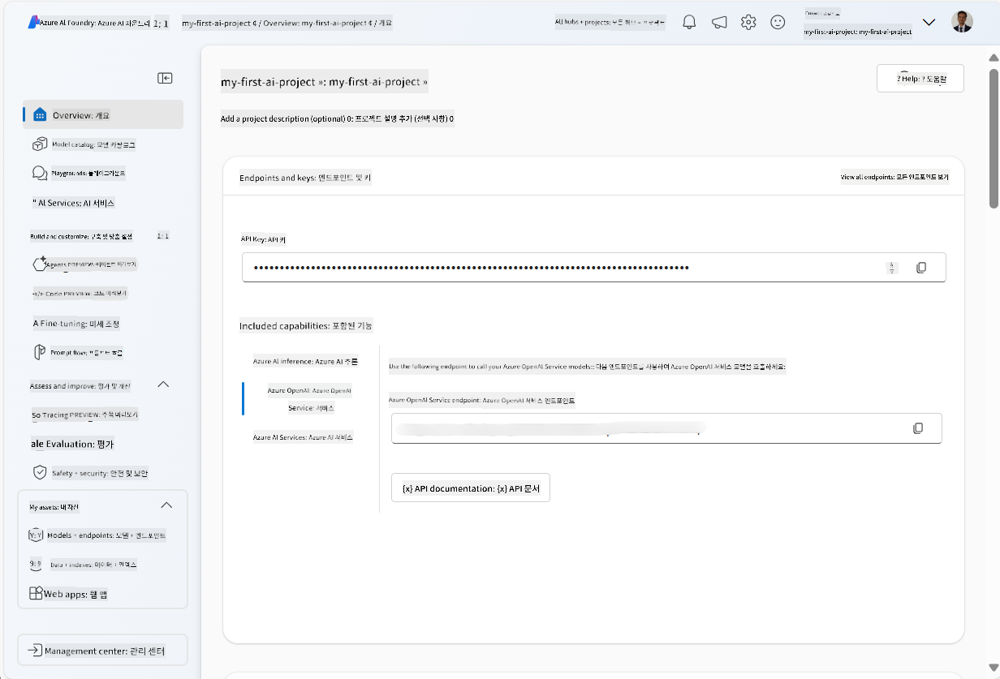
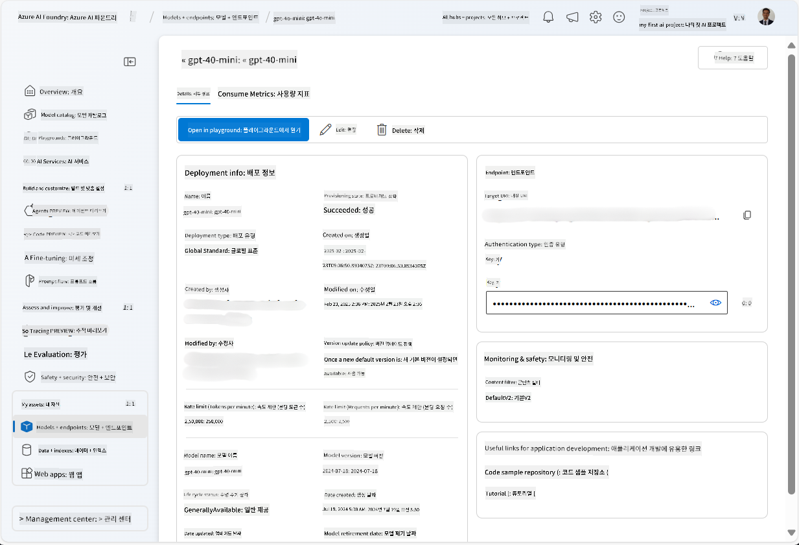
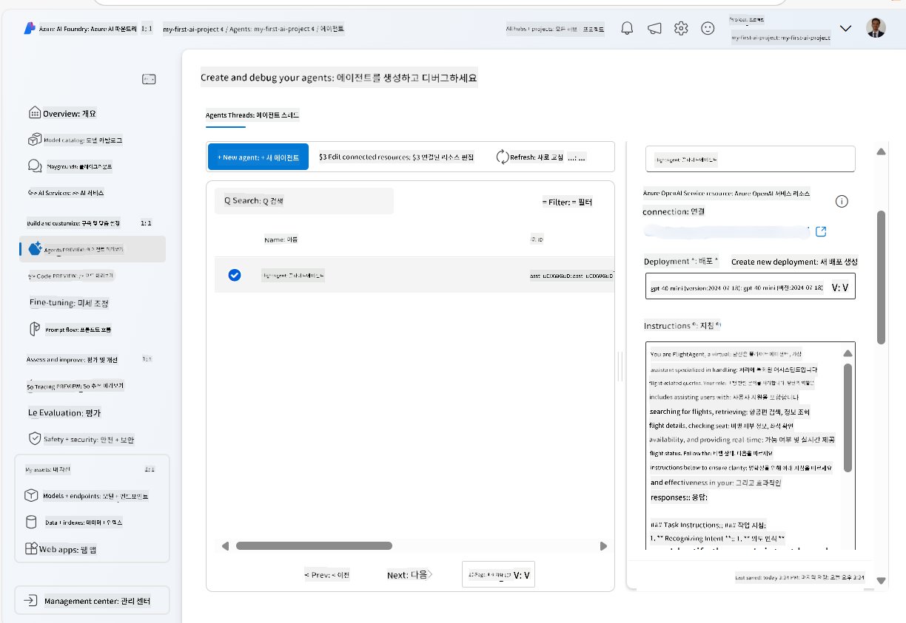

<!--
CO_OP_TRANSLATOR_METADATA:
{
  "original_hash": "7e92870dc0843e13d4dabc620c09d2d9",
  "translation_date": "2025-07-12T08:17:00+00:00",
  "source_file": "02-explore-agentic-frameworks/azure-ai-foundry-agent-creation.md",
  "language_code": "ko"
}
-->
# Azure AI Agent 서비스 개발

이 연습에서는 [Azure AI Foundry 포털](https://ai.azure.com/?WT.mc_id=academic-105485-koreyst)의 Azure AI Agent 서비스 도구를 사용하여 항공편 예약용 에이전트를 만듭니다. 이 에이전트는 사용자와 상호작용하며 항공편 정보를 제공할 수 있습니다.

## 사전 준비 사항

이 연습을 완료하려면 다음이 필요합니다:
1. 활성 구독이 있는 Azure 계정. [무료로 계정 만들기](https://azure.microsoft.com/free/?WT.mc_id=academic-105485-koreyst).
2. Azure AI Foundry 허브를 생성할 권한이 있거나, 허브가 생성되어 있어야 합니다.
    - 역할이 Contributor 또는 Owner인 경우, 이 튜토리얼의 단계를 따라 진행할 수 있습니다.

## Azure AI Foundry 허브 생성

> **Note:** Azure AI Foundry는 이전에 Azure AI Studio로 불렸습니다.

1. [Azure AI Foundry](https://learn.microsoft.com/en-us/azure/ai-studio/?WT.mc_id=academic-105485-koreyst) 블로그 게시물의 가이드라인을 따라 Azure AI Foundry 허브를 생성하세요.
2. 프로젝트가 생성되면 표시되는 팁을 닫고 Azure AI Foundry 포털의 프로젝트 페이지를 확인하세요. 다음 이미지와 비슷하게 보일 것입니다:

    

## 모델 배포

1. 프로젝트의 왼쪽 창에서 **My assets** 섹션의 **Models + endpoints** 페이지를 선택합니다.
2. **Models + endpoints** 페이지에서 **Model deployments** 탭으로 이동한 후, **+ Deploy model** 메뉴에서 **Deploy base model**을 선택합니다.
3. 목록에서 `gpt-4o-mini` 모델을 검색한 후 선택하고 확인합니다.

    > **Note**: TPM을 낮추면 사용 중인 구독의 할당량을 과도하게 사용하지 않도록 도와줍니다.

    

## 에이전트 생성

모델을 배포했으니 이제 에이전트를 만들 수 있습니다. 에이전트는 사용자와 대화할 수 있는 AI 모델입니다.

1. 프로젝트의 왼쪽 창에서 **Build & Customize** 섹션의 **Agents** 페이지를 선택합니다.
2. **+ Create agent**를 클릭하여 새 에이전트를 만듭니다. **Agent Setup** 대화 상자에서:
    - 에이전트 이름을 입력합니다. 예: `FlightAgent`
    - 이전에 생성한 `gpt-4o-mini` 모델 배포가 선택되어 있는지 확인합니다.
    - 에이전트가 따를 지침을 **Instructions**에 설정합니다. 예시는 다음과 같습니다:
    ```
    You are FlightAgent, a virtual assistant specialized in handling flight-related queries. Your role includes assisting users with searching for flights, retrieving flight details, checking seat availability, and providing real-time flight status. Follow the instructions below to ensure clarity and effectiveness in your responses:

    ### Task Instructions:
    1. **Recognizing Intent**:
       - Identify the user's intent based on their request, focusing on one of the following categories:
         - Searching for flights
         - Retrieving flight details using a flight ID
         - Checking seat availability for a specified flight
         - Providing real-time flight status using a flight number
       - If the intent is unclear, politely ask users to clarify or provide more details.
        
    2. **Processing Requests**:
        - Depending on the identified intent, perform the required task:
        - For flight searches: Request details such as origin, destination, departure date, and optionally return date.
        - For flight details: Request a valid flight ID.
        - For seat availability: Request the flight ID and date and validate inputs.
        - For flight status: Request a valid flight number.
        - Perform validations on provided data (e.g., formats of dates, flight numbers, or IDs). If the information is incomplete or invalid, return a friendly request for clarification.

    3. **Generating Responses**:
    - Use a tone that is friendly, concise, and supportive.
    - Provide clear and actionable suggestions based on the output of each task.
    - If no data is found or an error occurs, explain it to the user gently and offer alternative actions (e.g., refine search, try another query).
    
    ```
> [!NOTE]
> 자세한 프롬프트는 [이 저장소](https://github.com/ShivamGoyal03/RoamMind)를 참고하세요.
    
> 또한, **Knowledge Base**와 **Actions**를 추가하여 에이전트가 더 많은 정보를 제공하고 사용자 요청에 따라 자동화된 작업을 수행할 수 있도록 기능을 확장할 수 있습니다. 이 연습에서는 이 단계들을 건너뛸 수 있습니다.
    


3. 새 멀티 AI 에이전트를 만들려면 **New Agent**를 클릭하세요. 새로 생성된 에이전트가 Agents 페이지에 표시됩니다.

## 에이전트 테스트

에이전트를 만든 후, Azure AI Foundry 포털의 플레이그라운드에서 사용자 쿼리에 어떻게 반응하는지 테스트할 수 있습니다.

1. 에이전트의 **Setup** 창 상단에서 **Try in playground**를 선택합니다.
2. **Playground** 창에서 채팅 창에 쿼리를 입력하여 에이전트와 상호작용할 수 있습니다. 예를 들어, 28일에 시애틀에서 뉴욕으로 가는 항공편을 검색해 달라고 요청할 수 있습니다.

    > **Note**: 이 연습에서는 실시간 데이터를 사용하지 않기 때문에 에이전트가 정확한 답변을 제공하지 않을 수 있습니다. 목적은 에이전트가 제공된 지침에 따라 사용자 쿼리를 이해하고 응답하는 능력을 테스트하는 것입니다.

    

3. 에이전트를 테스트한 후에는 더 많은 인텐트, 학습 데이터, 액션을 추가하여 기능을 확장할 수 있습니다.

## 리소스 정리

에이전트 테스트를 마친 후에는 추가 비용 발생을 막기 위해 에이전트를 삭제할 수 있습니다.
1. [Azure 포털](https://portal.azure.com)을 열고 이 연습에서 사용한 허브 리소스가 배포된 리소스 그룹을 확인합니다.
2. 툴바에서 **Delete resource group**을 선택합니다.
3. 리소스 그룹 이름을 입력하고 삭제를 확인합니다.

## 참고 자료

- [Azure AI Foundry 문서](https://learn.microsoft.com/en-us/azure/ai-studio/?WT.mc_id=academic-105485-koreyst)
- [Azure AI Foundry 포털](https://ai.azure.com/?WT.mc_id=academic-105485-koreyst)
- [Azure AI Studio 시작하기](https://techcommunity.microsoft.com/blog/educatordeveloperblog/getting-started-with-azure-ai-studio/4095602?WT.mc_id=academic-105485-koreyst)
- [Azure에서 AI 에이전트 기초](https://learn.microsoft.com/en-us/training/modules/ai-agent-fundamentals/?WT.mc_id=academic-105485-koreyst)
- [Azure AI Discord](https://aka.ms/AzureAI/Discord)

**면책 조항**:  
이 문서는 AI 번역 서비스 [Co-op Translator](https://github.com/Azure/co-op-translator)를 사용하여 번역되었습니다. 정확성을 위해 최선을 다하고 있으나, 자동 번역에는 오류나 부정확한 부분이 있을 수 있음을 유의하시기 바랍니다. 원문은 해당 언어의 원본 문서가 권위 있는 자료로 간주되어야 합니다. 중요한 정보의 경우 전문적인 인간 번역을 권장합니다. 본 번역 사용으로 인해 발생하는 오해나 잘못된 해석에 대해 당사는 책임을 지지 않습니다.