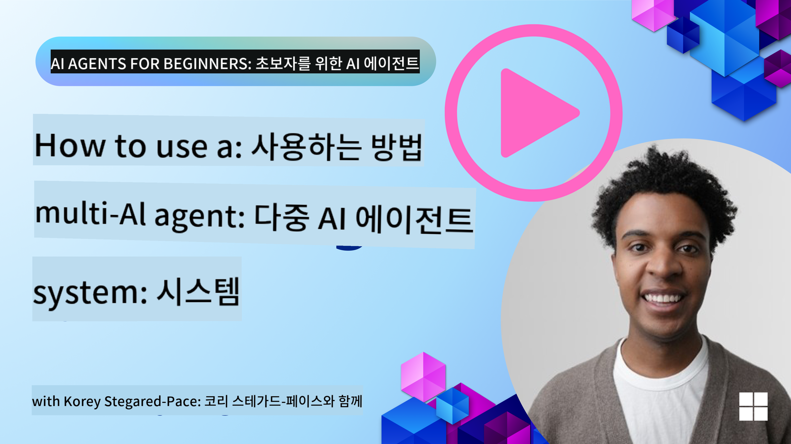
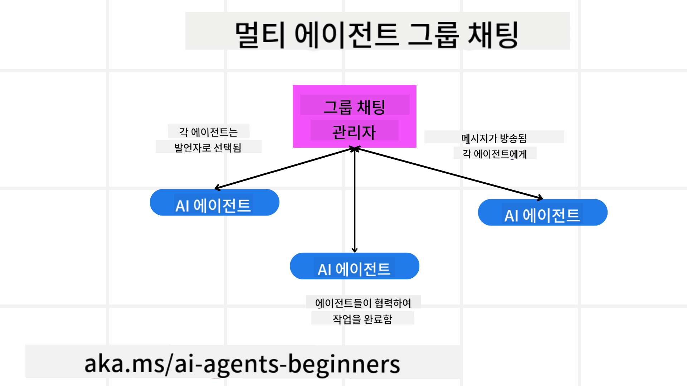
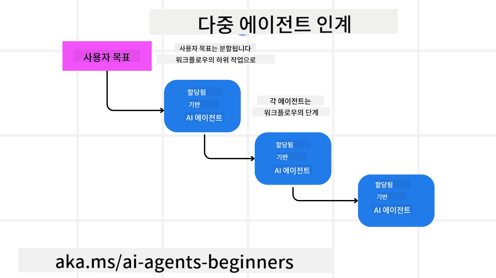
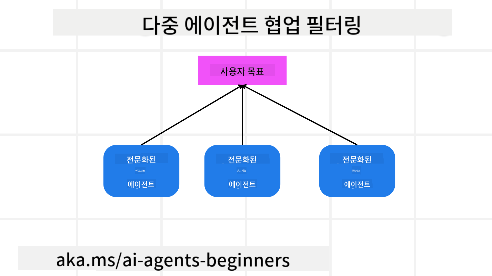

<!--
CO_OP_TRANSLATOR_METADATA:
{
  "original_hash": "1a008c204051cba8d0e253b75f261c41",
  "translation_date": "2025-08-30T13:46:24+00:00",
  "source_file": "08-multi-agent/README.md",
  "language_code": "ko"
}
-->

> _(위 이미지를 클릭하면 이 강의의 영상을 볼 수 있습니다)_

# 다중 에이전트 설계 패턴

여러 에이전트를 포함하는 프로젝트를 시작하면 다중 에이전트 설계 패턴을 고려해야 합니다. 하지만 언제 다중 에이전트로 전환해야 하는지, 그리고 그 장점이 무엇인지 바로 알기 어려울 수 있습니다.

## 소개

이 강의에서는 다음 질문에 답하고자 합니다:

- 다중 에이전트가 적용 가능한 시나리오는 무엇인가요?
- 단일 에이전트가 여러 작업을 수행하는 것보다 다중 에이전트를 사용하는 것이 어떤 장점이 있나요?
- 다중 에이전트 설계 패턴을 구현하기 위한 구성 요소는 무엇인가요?
- 여러 에이전트가 서로 어떻게 상호작용하는지 가시성을 확보하려면 어떻게 해야 하나요?

## 학습 목표

이 강의를 마친 후, 여러분은 다음을 할 수 있어야 합니다:

- 다중 에이전트가 적용 가능한 시나리오를 식별할 수 있다.
- 단일 에이전트보다 다중 에이전트를 사용하는 장점을 인식할 수 있다.
- 다중 에이전트 설계 패턴을 구현하기 위한 구성 요소를 이해할 수 있다.

큰 그림은 무엇인가요?

*다중 에이전트는 여러 에이전트가 협력하여 공통 목표를 달성할 수 있도록 하는 설계 패턴입니다.*

이 패턴은 로봇공학, 자율 시스템, 분산 컴퓨팅 등 다양한 분야에서 널리 사용됩니다.

## 다중 에이전트가 적용 가능한 시나리오

그렇다면 다중 에이전트를 사용하는 데 적합한 시나리오는 무엇일까요? 답은 많습니다. 특히 다음과 같은 경우에 다중 에이전트를 사용하는 것이 유리합니다:

- **대규모 작업량**: 대규모 작업량은 더 작은 작업으로 나누어 여러 에이전트에 할당할 수 있어 병렬 처리와 더 빠른 완료가 가능합니다. 예를 들어, 대규모 데이터 처리 작업이 이에 해당합니다.
- **복잡한 작업**: 대규모 작업량과 마찬가지로 복잡한 작업도 더 작은 하위 작업으로 나누어 각 작업을 특정 측면에 전문화된 에이전트에 할당할 수 있습니다. 예를 들어, 자율 주행 차량의 경우, 각 에이전트가 내비게이션, 장애물 감지, 다른 차량과의 통신을 관리합니다.
- **다양한 전문성**: 서로 다른 에이전트가 다양한 전문성을 가지고 있어 단일 에이전트보다 작업의 다양한 측면을 더 효과적으로 처리할 수 있습니다. 예를 들어, 의료 분야에서는 에이전트가 진단, 치료 계획, 환자 모니터링을 관리할 수 있습니다.

## 단일 에이전트보다 다중 에이전트를 사용하는 장점

단일 에이전트 시스템은 간단한 작업에는 적합할 수 있지만, 더 복잡한 작업에서는 다중 에이전트를 사용하는 것이 여러 가지 장점을 제공합니다:

- **전문화**: 각 에이전트는 특정 작업에 특화될 수 있습니다. 단일 에이전트의 경우 모든 작업을 처리할 수 있지만, 복잡한 작업에 직면했을 때 혼란스러워질 수 있습니다. 예를 들어, 적합하지 않은 작업을 수행할 가능성이 있습니다.
- **확장성**: 단일 에이전트를 과부하시키는 것보다 시스템에 더 많은 에이전트를 추가하는 것이 더 쉽습니다.
- **내결함성**: 한 에이전트가 실패하더라도 다른 에이전트가 계속 작동하여 시스템의 신뢰성을 보장합니다.

예를 들어, 사용자의 여행을 예약한다고 가정해 봅시다. 단일 에이전트 시스템은 항공편 검색부터 호텔 및 렌터카 예약까지 모든 과정을 처리해야 합니다. 이를 단일 에이전트로 구현하려면 모든 작업을 처리할 수 있는 도구가 필요합니다. 이는 유지보수와 확장이 어려운 복잡하고 단일화된 시스템으로 이어질 수 있습니다. 반면, 다중 에이전트 시스템은 항공편 검색, 호텔 예약, 렌터카 예약에 특화된 서로 다른 에이전트를 가질 수 있습니다. 이는 시스템을 더 모듈화하고, 유지보수가 용이하며, 확장 가능하게 만듭니다.

이를 소규모 가족 운영 여행사와 프랜차이즈 여행사를 비교하는 것으로 생각해 볼 수 있습니다. 소규모 가족 운영 여행사는 단일 에이전트가 모든 여행 예약 과정을 처리하는 반면, 프랜차이즈 여행사는 각 과정에 특화된 서로 다른 에이전트를 보유합니다.

## 다중 에이전트 설계 패턴 구현의 구성 요소

다중 에이전트 설계 패턴을 구현하기 전에, 패턴을 구성하는 요소를 이해해야 합니다.

사용자의 여행 예약 예제를 다시 살펴보겠습니다. 이 경우, 구성 요소는 다음과 같습니다:

- **에이전트 간 통신**: 항공편 검색, 호텔 예약, 렌터카 예약 에이전트는 사용자의 선호도와 제약 조건에 대한 정보를 공유하고 소통해야 합니다. 이를 위해 통신 프로토콜과 방법을 결정해야 합니다. 구체적으로, 항공편 검색 에이전트는 호텔 예약 에이전트와 소통하여 호텔이 항공편 날짜와 일치하도록 예약되었는지 확인해야 합니다. 즉, *어떤 에이전트가 정보를 공유하고 어떻게 공유할지*를 결정해야 합니다.
- **조정 메커니즘**: 에이전트는 사용자의 선호도와 제약 조건을 충족하기 위해 행동을 조정해야 합니다. 예를 들어, 사용자가 공항 근처 호텔을 선호하는 경우, 렌터카는 공항에서만 이용 가능하다는 제약 조건이 있을 수 있습니다. 이 경우, 호텔 예약 에이전트는 렌터카 예약 에이전트와 조정하여 사용자의 선호도와 제약 조건을 충족해야 합니다. 즉, *에이전트가 어떻게 행동을 조정할지*를 결정해야 합니다.
- **에이전트 아키텍처**: 에이전트는 사용자와의 상호작용에서 학습하고 결정을 내릴 수 있는 내부 구조를 가져야 합니다. 예를 들어, 항공편 검색 에이전트는 사용자에게 추천할 항공편을 결정할 수 있는 내부 구조를 가져야 합니다. 이는 *에이전트가 어떻게 결정을 내리고 학습할지*를 결정해야 함을 의미합니다. 예를 들어, 항공편 검색 에이전트는 사용자의 과거 선호도를 기반으로 항공편을 추천하기 위해 머신러닝 모델을 사용할 수 있습니다.
- **다중 에이전트 상호작용 가시성**: 여러 에이전트가 서로 어떻게 상호작용하는지 가시성을 확보해야 합니다. 이를 위해 에이전트 활동과 상호작용을 추적할 수 있는 도구와 기술이 필요합니다. 이는 로깅 및 모니터링 도구, 시각화 도구, 성능 지표의 형태로 제공될 수 있습니다.
- **다중 에이전트 패턴**: 다중 에이전트 시스템을 구현하기 위한 다양한 패턴이 있습니다. 예를 들어, 중앙 집중식, 분산형, 하이브리드 아키텍처 등이 있습니다. 사용 사례에 가장 적합한 패턴을 선택해야 합니다.
- **사람의 개입**: 대부분의 경우, 사람의 개입이 필요하며, 에이전트가 언제 사람의 개입을 요청해야 하는지 지침을 제공해야 합니다. 예를 들어, 사용자가 에이전트가 추천하지 않은 특정 호텔이나 항공편을 요청하거나 예약 전에 확인을 요청할 수 있습니다.

## 다중 에이전트 상호작용 가시성

여러 에이전트가 서로 어떻게 상호작용하는지 가시성을 확보하는 것은 매우 중요합니다. 이는 디버깅, 최적화, 전체 시스템의 효과성을 보장하는 데 필수적입니다. 이를 위해 에이전트 활동과 상호작용을 추적할 수 있는 도구와 기술이 필요합니다. 이는 로깅 및 모니터링 도구, 시각화 도구, 성능 지표의 형태로 제공될 수 있습니다.

예를 들어, 사용자의 여행 예약의 경우, 각 에이전트의 상태, 사용자의 선호도와 제약 조건, 에이전트 간 상호작용을 보여주는 대시보드를 가질 수 있습니다. 이 대시보드는 사용자의 여행 날짜, 항공편 검색 에이전트가 추천한 항공편, 호텔 예약 에이전트가 추천한 호텔, 렌터카 예약 에이전트가 추천한 렌터카를 보여줄 수 있습니다. 이를 통해 에이전트가 서로 어떻게 상호작용하고 있는지, 사용자의 선호도와 제약 조건이 충족되고 있는지 명확히 파악할 수 있습니다.

각 측면을 자세히 살펴보겠습니다:

- **로깅 및 모니터링 도구**: 각 에이전트가 수행한 작업을 로깅해야 합니다. 로그 항목에는 작업을 수행한 에이전트, 수행된 작업, 작업이 수행된 시간, 작업 결과에 대한 정보가 포함될 수 있습니다. 이 정보는 디버깅, 최적화 등에 사용될 수 있습니다.
- **시각화 도구**: 시각화 도구는 에이전트 간 상호작용을 더 직관적으로 볼 수 있도록 도와줍니다. 예를 들어, 에이전트 간 정보 흐름을 보여주는 그래프를 가질 수 있습니다. 이를 통해 병목 현상, 비효율성, 기타 문제를 식별할 수 있습니다.
- **성능 지표**: 성능 지표는 다중 에이전트 시스템의 효과성을 추적하는 데 도움이 됩니다. 예를 들어, 작업 완료에 걸린 시간, 단위 시간당 완료된 작업 수, 에이전트가 제공한 추천의 정확도를 추적할 수 있습니다. 이 정보는 개선 영역을 식별하고 시스템을 최적화하는 데 도움이 됩니다.

## 다중 에이전트 패턴

다중 에이전트 애플리케이션을 만들기 위해 사용할 수 있는 몇 가지 구체적인 패턴을 살펴보겠습니다. 다음은 고려할 만한 흥미로운 패턴들입니다:

### 그룹 채팅

이 패턴은 여러 에이전트가 서로 소통할 수 있는 그룹 채팅 애플리케이션을 만들고자 할 때 유용합니다. 이 패턴의 일반적인 사용 사례로는 팀 협업, 고객 지원, 소셜 네트워킹 등이 있습니다.

이 패턴에서 각 에이전트는 그룹 채팅의 사용자를 나타내며, 메시지는 메시징 프로토콜을 사용하여 에이전트 간에 교환됩니다. 에이전트는 그룹 채팅에 메시지를 보내고, 그룹 채팅에서 메시지를 받고, 다른 에이전트의 메시지에 응답할 수 있습니다.

이 패턴은 모든 메시지가 중앙 서버를 통해 라우팅되는 중앙 집중식 아키텍처나 메시지가 직접 교환되는 분산형 아키텍처로 구현할 수 있습니다.

### 작업 전달

이 패턴은 여러 에이전트가 서로 작업을 전달할 수 있는 애플리케이션을 만들고자 할 때 유용합니다.

이 패턴의 일반적인 사용 사례로는 고객 지원, 작업 관리, 워크플로 자동화 등이 있습니다.

이 패턴에서 각 에이전트는 작업 또는 워크플로의 단계를 나타내며, 에이전트는 사전 정의된 규칙에 따라 작업을 다른 에이전트에 전달할 수 있습니다.

### 협업 필터링

이 패턴은 여러 에이전트가 협력하여 사용자에게 추천을 제공할 수 있는 애플리케이션을 만들고자 할 때 유용합니다.

여러 에이전트가 협력하는 이유는 각 에이전트가 서로 다른 전문성을 가지고 있어 추천 과정에 다양한 방식으로 기여할 수 있기 때문입니다.

예를 들어, 사용자가 주식 시장에서 가장 좋은 주식을 추천받고 싶어한다고 가정해 봅시다.

- **산업 전문가**: 한 에이전트는 특정 산업에 대한 전문가일 수 있습니다.
- **기술적 분석**: 다른 에이전트는 기술적 분석에 대한 전문가일 수 있습니다.
- **기본적 분석**: 또 다른 에이전트는 기본적 분석에 대한 전문가일 수 있습니다. 이러한 에이전트들이 협력함으로써 사용자에게 더 포괄적인 추천을 제공할 수 있습니다.

## 시나리오: 환불 프로세스

고객이 제품 환불을 요청하는 시나리오를 고려해 봅시다. 이 과정에는 여러 에이전트가 관여할 수 있지만, 이를 환불 프로세스에 특화된 에이전트와 다른 프로세스에서도 사용할 수 있는 일반 에이전트로 나눌 수 있습니다.

**환불 프로세스에 특화된 에이전트**:

다음은 환불 프로세스에 관여할 수 있는 에이전트들입니다:

- **고객 에이전트**: 고객을 나타내며 환불 프로세스를 시작하는 역할을 합니다.
- **판매자 에이전트**: 판매자를 나타내며 환불을 처리하는 역할을 합니다.
- **결제 에이전트**: 결제 과정을 나타내며 고객의 결제를 환불하는 역할을 합니다.
- **해결 에이전트**: 해결 과정을 나타내며 환불 과정에서 발생하는 문제를 해결하는 역할을 합니다.
- **준수 에이전트**: 준수 과정을 나타내며 환불 과정이 규정과 정책을 준수하도록 보장하는 역할을 합니다.

**일반 에이전트**:

이 에이전트들은 비즈니스의 다른 부분에서도 사용할 수 있습니다.

- **배송 에이전트**: 배송 과정을 나타내며 제품을 판매자에게 다시 배송하는 역할을 합니다. 이 에이전트는 환불 프로세스뿐만 아니라 일반적인 제품 배송에도 사용할 수 있습니다.
- **피드백 에이전트**: 피드백 과정을 나타내며 고객의 피드백을 수집하는 역할을 합니다. 피드백은 환불 과정뿐만 아니라 언제든지 수집할 수 있습니다.
- **에스컬레이션 에이전트**: 에스컬레이션 과정을 나타내며 문제를 더 높은 수준의 지원으로 에스컬레이션하는 역할을 합니다. 이 에이전트는 문제를 에스컬레이션해야 하는 모든 프로세스에서 사용할 수 있습니다.
- **알림 에이전트**: 알림 과정을 나타내며 환불 과정의 다양한 단계에서 고객에게 알림을 보내는 역할을 합니다.
- **분석 에이전트**: 분석 과정을 나타내며 환불 과정과 관련된 데이터를 분석하는 역할을 합니다.
- **감사 에이전트**: 감사 과정을 나타내며 환불 과정이 올바르게 수행되고 있는지 감사하는 역할을 합니다.
- **보고 에이전트**: 보고 과정을 나타내며 환불 과정에 대한 보고서를 생성하는 역할을 합니다.
- **지식 에이전트**: 지식 과정을 나타내며 환불 과정과 관련된 정보의 지식 기반을 유지하는 역할을 합니다. 이 에이전트는 환불뿐만 아니라 비즈니스의 다른 부분에 대한 지식도 보유할 수 있습니다.
- **보안 에이전트**: 보안 과정을 나타내며 환불 과정의 보안을 보장하는 역할을 합니다.
- **품질 에이전트**: 품질 과정을 나타내며 환불 과정의 품질을 보장하는 역할을 합니다.

위에서 언급한 에이전트들은 환불 프로세스에 특화된 에이전트와 비즈니스의 다른 부분에서도 사용할 수 있는 일반 에이전트로 나뉩니다. 이를 통해 다중 에이전트 시스템에서 어떤 에이전트를 사용할지 결정하는 데 도움이 되기를 바랍니다.

## 과제
## 다중 에이전트 시스템 설계

고객 지원 프로세스를 위한 다중 에이전트 시스템을 설계하세요. 프로세스에 포함된 에이전트, 그들의 역할과 책임, 그리고 서로 어떻게 상호작용하는지 식별하세요. 고객 지원 프로세스에 특화된 에이전트뿐만 아니라 비즈니스의 다른 부분에서도 사용할 수 있는 일반적인 에이전트도 고려하세요.

> 아래 솔루션을 읽기 전에 잠시 생각해 보세요. 예상보다 더 많은 에이전트가 필요할 수 있습니다.

> TIP: 고객 지원 프로세스의 다양한 단계를 생각해 보고, 시스템에 필요한 에이전트도 고려하세요.

## 솔루션

[솔루션](./solution/solution.md)

## 지식 점검

질문: 언제 다중 에이전트를 사용하는 것을 고려해야 하나요?

- [ ] A1: 작업량이 적고 작업이 간단할 때
- [ ] A2: 작업량이 많을 때
- [ ] A3: 작업이 간단할 때

[퀴즈 솔루션](./solution/solution-quiz.md)

## 요약

이번 강의에서는 다중 에이전트 설계 패턴에 대해 살펴보았습니다. 다중 에이전트가 적용 가능한 시나리오, 단일 에이전트보다 다중 에이전트를 사용하는 장점, 다중 에이전트 설계 패턴을 구현하기 위한 구성 요소, 그리고 여러 에이전트가 서로 어떻게 상호작용하는지에 대한 가시성을 확보하는 방법을 다루었습니다.

### 다중 에이전트 설계 패턴에 대해 더 궁금한 점이 있나요?

[Azure AI Foundry Discord](https://aka.ms/ai-agents/discord)에 참여하여 다른 학습자들과 만나고, 오피스 아워에 참석하며, AI 에이전트에 대한 질문에 답을 얻으세요.

## 추가 자료

- 

## 이전 강의

[설계 계획](../07-planning-design/README.md)

## 다음 강의

[AI 에이전트의 메타인지](../09-metacognition/README.md)

---

**면책 조항**:  
이 문서는 AI 번역 서비스 [Co-op Translator](https://github.com/Azure/co-op-translator)를 사용하여 번역되었습니다. 정확성을 위해 최선을 다하고 있으나, 자동 번역에는 오류나 부정확성이 포함될 수 있습니다. 원본 문서를 해당 언어로 작성된 상태에서 권위 있는 자료로 간주해야 합니다. 중요한 정보의 경우, 전문적인 인간 번역을 권장합니다. 이 번역 사용으로 인해 발생할 수 있는 오해나 잘못된 해석에 대해 당사는 책임을 지지 않습니다.  