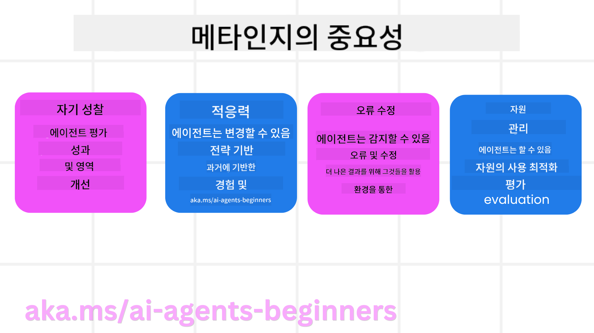
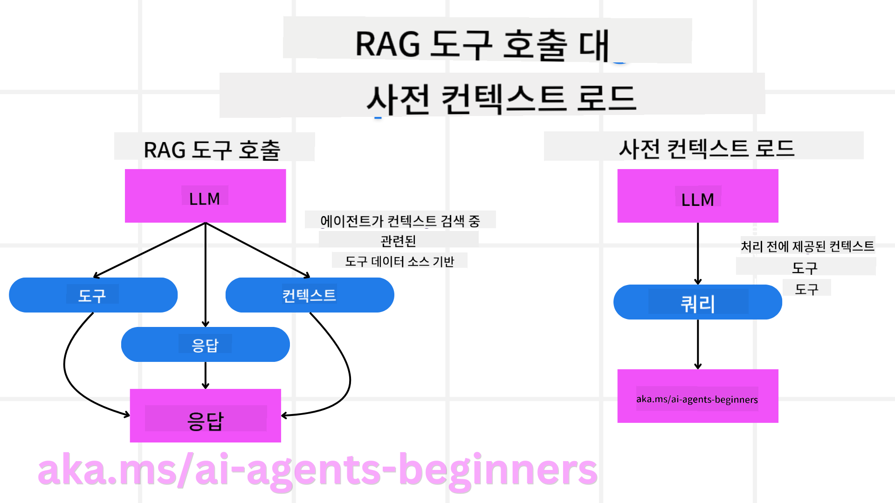

<!--
CO_OP_TRANSLATOR_METADATA:
{
  "original_hash": "5f0deef171fc3a68d5d3d770a8bfb03d",
  "translation_date": "2025-08-30T13:42:37+00:00",
  "source_file": "09-metacognition/README.md",
  "language_code": "ko"
}
-->
[](https://youtu.be/His9R6gw6Ec?si=3_RMb8VprNvdLRhX)

> _(위 이미지를 클릭하면 이 강의의 동영상을 볼 수 있습니다)_
# AI 에이전트의 메타인지

## 소개

AI 에이전트의 메타인지에 대한 강의에 오신 것을 환영합니다! 이 장은 AI 에이전트가 자신의 사고 과정을 어떻게 생각할 수 있는지 궁금해하는 초보자를 위해 설계되었습니다. 이 강의를 마치면 주요 개념을 이해하고 AI 에이전트 설계에서 메타인지를 적용할 수 있는 실용적인 예제를 익힐 수 있습니다.

## 학습 목표

이 강의를 완료한 후, 여러분은 다음을 할 수 있습니다:

1. 에이전트 정의에서 추론 루프의 영향을 이해합니다.
2. 자기 교정 에이전트를 돕기 위한 계획 및 평가 기술을 사용합니다.
3. 작업을 수행하기 위해 코드를 조작할 수 있는 에이전트를 직접 만듭니다.

## 메타인지 소개

메타인지는 자신의 사고를 생각하는 고차원적인 인지 과정을 의미합니다. AI 에이전트의 경우, 이는 자기 인식과 과거 경험을 바탕으로 자신의 행동을 평가하고 조정할 수 있는 능력을 의미합니다. 메타인지, 즉 "생각에 대한 생각"은 에이전트형 AI 시스템 개발에서 중요한 개념입니다. 이는 AI 시스템이 자신의 내부 과정을 인식하고, 행동을 모니터링, 조절, 적응할 수 있도록 합니다. 우리가 상황을 파악하거나 문제를 분석할 때처럼 말이죠. 이러한 자기 인식은 AI 시스템이 더 나은 결정을 내리고, 오류를 식별하며, 시간이 지남에 따라 성능을 향상시키는 데 도움을 줄 수 있습니다. 이는 다시 튜링 테스트와 AI가 세상을 지배할 것인지에 대한 논쟁으로 연결됩니다.

에이전트형 AI 시스템의 맥락에서 메타인지는 다음과 같은 여러 과제를 해결하는 데 도움을 줄 수 있습니다:
- 투명성: AI 시스템이 자신의 추론과 결정을 설명할 수 있도록 보장합니다.
- 추론: AI 시스템이 정보를 종합하고 합리적인 결정을 내리는 능력을 향상시킵니다.
- 적응성: AI 시스템이 새로운 환경과 변화하는 조건에 적응할 수 있도록 합니다.
- 인식: AI 시스템이 환경에서 데이터를 인식하고 해석하는 정확성을 향상시킵니다.

### 메타인지란 무엇인가?

메타인지, 즉 "생각에 대한 생각"은 자기 인식과 자신의 인지 과정을 자기 조절하는 고차원적인 인지 과정입니다. AI의 영역에서 메타인지는 에이전트가 자신의 전략과 행동을 평가하고 조정할 수 있는 능력을 부여하여 문제 해결 및 의사 결정 능력을 향상시킵니다. 메타인지를 이해함으로써, 여러분은 더 지능적이고 적응력이 뛰어나며 효율적인 AI 에이전트를 설계할 수 있습니다. 진정한 메타인지에서는 AI가 자신의 추론에 대해 명시적으로 추론하는 모습을 볼 수 있습니다.

예: “저렴한 항공편을 우선시했는데... 직항 항공편을 놓쳤을 수도 있으니 다시 확인해 보자.”
- 특정 경로를 선택한 이유를 추적합니다.
- 이전에 사용자 선호도를 과도하게 신뢰하여 실수를 했음을 인지하고, 최종 추천뿐만 아니라 의사 결정 전략 자체를 수정합니다.
- “사용자가 ‘너무 붐빈다’고 언급할 때마다 특정 명소를 제외할 뿐만 아니라, 항상 인기도로 순위를 매기는 내 방법이 잘못되었음을 반영해야 한다”와 같은 패턴을 진단합니다.

### AI 에이전트에서 메타인지의 중요성

메타인지는 여러 가지 이유로 AI 에이전트 설계에서 중요한 역할을 합니다:



- 자기 성찰: 에이전트가 자신의 성과를 평가하고 개선이 필요한 영역을 식별할 수 있습니다.
- 적응성: 에이전트가 과거 경험과 변화하는 환경에 따라 전략을 수정할 수 있습니다.
- 오류 수정: 에이전트가 자율적으로 오류를 감지하고 수정하여 더 정확한 결과를 제공합니다.
- 자원 관리: 에이전트가 행동을 계획하고 평가함으로써 시간과 계산 능력 같은 자원을 최적화할 수 있습니다.

## AI 에이전트의 구성 요소

메타인지 과정을 다루기 전에, AI 에이전트의 기본 구성 요소를 이해하는 것이 중요합니다. AI 에이전트는 일반적으로 다음으로 구성됩니다:

- 페르소나: 사용자와 상호작용하는 방식을 정의하는 에이전트의 성격과 특성.
- 도구: 에이전트가 수행할 수 있는 기능과 능력.
- 기술: 에이전트가 보유한 지식과 전문성.

이러한 구성 요소는 특정 작업을 수행할 수 있는 "전문성 단위"를 만듭니다.

**예시**:
여행 에이전트를 생각해 보세요. 이 에이전트는 단순히 휴가를 계획하는 것뿐만 아니라, 실시간 데이터와 과거 고객 경험을 바탕으로 경로를 조정합니다.

### 예시: 여행 에이전트 서비스에서의 메타인지

여러분이 AI로 구동되는 여행 에이전트 서비스를 설계한다고 상상해 보세요. 이 에이전트, "여행 에이전트"는 사용자가 휴가를 계획하는 데 도움을 줍니다. 메타인지를 통합하려면, 여행 에이전트는 자기 인식과 과거 경험을 바탕으로 자신의 행동을 평가하고 조정해야 합니다. 메타인지가 어떻게 작용할 수 있는지 살펴보겠습니다:

#### 현재 작업

현재 작업은 사용자가 파리 여행을 계획하도록 돕는 것입니다.

#### 작업 완료 단계

1. **사용자 선호도 수집**: 여행 날짜, 예산, 관심사(예: 박물관, 요리, 쇼핑) 및 특정 요구 사항에 대해 사용자에게 묻습니다.
2. **정보 검색**: 사용자 선호도에 맞는 항공편, 숙박 시설, 명소 및 레스토랑을 검색합니다.
3. **추천 생성**: 항공편 세부 정보, 호텔 예약 및 제안된 활동이 포함된 맞춤형 일정을 제공합니다.
4. **피드백에 따라 조정**: 추천에 대한 사용자 피드백을 요청하고 필요한 조정을 합니다.

#### 필요한 자원

- 항공편 및 호텔 예약 데이터베이스에 대한 액세스.
- 파리의 명소 및 레스토랑 정보.
- 이전 상호작용에서의 사용자 피드백 데이터.

#### 경험과 자기 성찰

여행 에이전트는 메타인지를 사용하여 자신의 성과를 평가하고 과거 경험에서 학습합니다. 예를 들어:

1. **사용자 피드백 분석**: 여행 에이전트는 사용자 피드백을 검토하여 어떤 추천이 잘 받아들여졌고 그렇지 않았는지 확인합니다. 이를 바탕으로 향후 제안을 조정합니다.
2. **적응성**: 사용자가 이전에 붐비는 장소를 싫어한다고 언급한 경우, 여행 에이전트는 향후 혼잡한 관광지를 피하도록 추천합니다.
3. **오류 수정**: 여행 에이전트가 과거 예약에서 오류를 범한 경우(예: 예약이 꽉 찬 호텔을 추천한 경우), 향후 추천 전에 가용성을 더 철저히 확인하도록 학습합니다.

#### 실용적인 개발자 예시

다음은 메타인지를 통합한 여행 에이전트의 코드가 어떻게 보일 수 있는지에 대한 간단한 예입니다:

```python
class Travel_Agent:
    def __init__(self):
        self.user_preferences = {}
        self.experience_data = []

    def gather_preferences(self, preferences):
        self.user_preferences = preferences

    def retrieve_information(self):
        # Search for flights, hotels, and attractions based on preferences
        flights = search_flights(self.user_preferences)
        hotels = search_hotels(self.user_preferences)
        attractions = search_attractions(self.user_preferences)
        return flights, hotels, attractions

    def generate_recommendations(self):
        flights, hotels, attractions = self.retrieve_information()
        itinerary = create_itinerary(flights, hotels, attractions)
        return itinerary

    def adjust_based_on_feedback(self, feedback):
        self.experience_data.append(feedback)
        # Analyze feedback and adjust future recommendations
        self.user_preferences = adjust_preferences(self.user_preferences, feedback)

# Example usage
travel_agent = Travel_Agent()
preferences = {
    "destination": "Paris",
    "dates": "2025-04-01 to 2025-04-10",
    "budget": "moderate",
    "interests": ["museums", "cuisine"]
}
travel_agent.gather_preferences(preferences)
itinerary = travel_agent.generate_recommendations()
print("Suggested Itinerary:", itinerary)
feedback = {"liked": ["Louvre Museum"], "disliked": ["Eiffel Tower (too crowded)"]}
travel_agent.adjust_based_on_feedback(feedback)
```

#### 메타인지가 중요한 이유

- **자기 성찰**: 에이전트가 자신의 성과를 분석하고 개선이 필요한 영역을 식별할 수 있습니다.
- **적응성**: 에이전트가 피드백과 변화하는 조건에 따라 전략을 수정할 수 있습니다.
- **오류 수정**: 에이전트가 자율적으로 실수를 감지하고 수정할 수 있습니다.
- **자원 관리**: 에이전트가 시간과 계산 능력 같은 자원을 최적화할 수 있습니다.

메타인지를 통합함으로써, 여행 에이전트는 더 개인화되고 정확한 여행 추천을 제공하여 전체 사용자 경험을 향상시킬 수 있습니다.

---

## 2. 에이전트의 계획

계획은 AI 에이전트 행동의 중요한 구성 요소입니다. 이는 현재 상태, 자원, 가능한 장애물을 고려하여 목표를 달성하기 위한 단계를 개략적으로 설명하는 것을 포함합니다.

### 계획의 요소

- **현재 작업**: 작업을 명확히 정의합니다.
- **작업 완료 단계**: 작업을 관리 가능한 단계로 나눕니다.
- **필요한 자원**: 필요한 자원을 식별합니다.
- **경험**: 계획에 과거 경험을 활용합니다.

**예시**:
다음은 여행 에이전트가 사용자의 여행 계획을 효과적으로 돕기 위해 수행해야 할 단계입니다:

### 여행 에이전트를 위한 단계

1. **사용자 선호도 수집**
   - 사용자에게 여행 날짜, 예산, 관심사 및 특정 요구 사항에 대해 묻습니다.
   - 예: "여행 날짜는 언제인가요?" "예산 범위는 어떻게 되나요?" "휴가 중 어떤 활동을 즐기시나요?"

2. **정보 검색**
   - 사용자 선호도에 따라 관련 여행 옵션을 검색합니다.
   - **항공편**: 사용자의 예산과 선호 여행 날짜에 맞는 항공편을 찾습니다.
   - **숙박 시설**: 위치, 가격, 편의 시설에 대한 사용자의 선호도에 맞는 호텔이나 렌탈 숙소를 찾습니다.
   - **명소 및 레스토랑**: 사용자의 관심사에 맞는 인기 명소, 활동 및 식사 옵션을 식별합니다.

3. **추천 생성**
   - 검색한 정보를 맞춤형 일정으로 컴파일합니다.
   - 사용자 선호도에 맞게 추천을 조정하면서 항공편 옵션, 호텔 예약 및 제안된 활동의 세부 정보를 제공합니다.

4. **일정 사용자에게 제시**
   - 제안된 일정을 사용자에게 공유하여 검토를 요청합니다.
   - 예: "파리 여행을 위한 제안된 일정입니다. 항공편 세부 정보, 호텔 예약, 추천 활동 및 레스토랑이 포함되어 있습니다. 의견을 알려주세요!"

5. **피드백 수집**
   - 제안된 일정에 대한 사용자 피드백을 요청합니다.
   - 예: "항공편 옵션이 마음에 드시나요?" "호텔이 필요에 적합한가요?" "추가하거나 제거하고 싶은 활동이 있나요?"

6. **피드백에 따라 조정**
   - 사용자 피드백에 따라 일정을 수정합니다.
   - 항공편, 숙박 시설 및 활동 추천을 사용자의 선호도에 더 잘 맞도록 필요한 변경을 합니다.

7. **최종 확인**
   - 수정된 일정을 사용자에게 최종 확인을 위해 제시합니다.
   - 예: "피드백을 바탕으로 조정을 완료했습니다. 수정된 일정입니다. 모두 괜찮으신가요?"

8. **예약 및 확인**
   - 사용자가 일정을 승인하면 항공편, 숙박 시설 및 사전 계획된 활동을 예약합니다.
   - 확인 세부 정보를 사용자에게 보냅니다.

9. **지속적인 지원 제공**
   - 여행 전후로 사용자의 변경 요청이나 추가 요청을 지원합니다.
   - 예: "여행 중 추가 지원이 필요하시면 언제든지 연락주세요!"

### 예시 상호작용

```python
class Travel_Agent:
    def __init__(self):
        self.user_preferences = {}
        self.experience_data = []

    def gather_preferences(self, preferences):
        self.user_preferences = preferences

    def retrieve_information(self):
        flights = search_flights(self.user_preferences)
        hotels = search_hotels(self.user_preferences)
        attractions = search_attractions(self.user_preferences)
        return flights, hotels, attractions

    def generate_recommendations(self):
        flights, hotels, attractions = self.retrieve_information()
        itinerary = create_itinerary(flights, hotels, attractions)
        return itinerary

    def adjust_based_on_feedback(self, feedback):
        self.experience_data.append(feedback)
        self.user_preferences = adjust_preferences(self.user_preferences, feedback)

# Example usage within a booing request
travel_agent = Travel_Agent()
preferences = {
    "destination": "Paris",
    "dates": "2025-04-01 to 2025-04-10",
    "budget": "moderate",
    "interests": ["museums", "cuisine"]
}
travel_agent.gather_preferences(preferences)
itinerary = travel_agent.generate_recommendations()
print("Suggested Itinerary:", itinerary)
feedback = {"liked": ["Louvre Museum"], "disliked": ["Eiffel Tower (too crowded)"]}
travel_agent.adjust_based_on_feedback(feedback)
```

## 3. 교정 RAG 시스템

우선 RAG 도구와 사전 컨텍스트 로드의 차이를 이해해 봅시다.



### Retrieval-Augmented Generation (RAG)

RAG는 검색 시스템과 생성 모델을 결합합니다. 쿼리가 이루어지면, 검색 시스템이 외부 소스에서 관련 문서나 데이터를 가져오고, 이 검색된 정보는 생성 모델의 입력을 보강하는 데 사용됩니다. 이를 통해 모델이 더 정확하고 맥락에 맞는 응답을 생성할 수 있습니다.

RAG 시스템에서는 에이전트가 지식 기반에서 관련 정보를 검색하고 이를 사용하여 적절한 응답이나 행동을 생성합니다.

### 교정 RAG 접근법

교정 RAG 접근법은 RAG 기술을 사용하여 오류를 수정하고 AI 에이전트의 정확성을 향상시키는 데 중점을 둡니다. 이는 다음을 포함합니다:

1. **프롬프트 기술**: 에이전트가 관련 정보를 검색하도록 유도하는 특정 프롬프트를 사용합니다.
2. **도구**: 검색된 정보의 관련성을 평가하고 정확한 응답을 생성할 수 있는 알고리즘과 메커니즘을 구현합니다.
3. **평가**: 에이전트의 성능을 지속적으로 평가하고 정확성과 효율성을 향상시키기 위해 조정을 합니다.

#### 예시: 검색 에이전트에서의 교정 RAG

웹에서 정보를 검색하여 사용자 쿼리에 답변하는 검색 에이전트를 생각해 보세요. 교정 RAG 접근법은 다음을 포함할 수 있습니다:

1. **프롬프트 기술**: 사용자의 입력을 기반으로 검색 쿼리를 작성합니다.
2. **도구**: 자연어 처리 및 기계 학습 알고리즘을 사용하여 검색 결과를 순위 매기고 필터링합니다.
3. **평가**: 사용자 피드백을 분석하여 검색된 정보의 부정확성을 식별하고 수정합니다.

### 여행 에이전트에서의 교정 RAG

교정 RAG (Retrieval-Augmented Generation)는 AI가 정보를 검색하고 생성하는 능력을 향상시키면서 부정확성을 수정합니다. 여행 에이전트가 교정 RAG 접근법을 사용하여 더 정확하고 관련성 높은 여행 추천을 제공하는 방법을 살펴보겠습니다.

이는 다음을 포함합니다:

- **프롬프트 기술**: 에이전트가 관련 정보를 검색하도록 유도하는 특정 프롬프트를 사용합니다.
- **도구**: 검색된 정보의 관련성을 평가하고 정확한 응답을 생성할 수 있는 알고리즘과 메커니즘을 구현합니다.
- **평가**: 에이전트의 성능을 지속적으로 평가하고 정확성과 효율성을 향상시키기 위해 조정을 합니다.

#### 여행 에이전트에서 교정 RAG 구현 단계

1. **초기 사용자 상호작용**
   - 여행 에이전트는 사용자로부터 목적지, 여행 날짜, 예산, 관심사 등 초기 선호도를 수집합니다.
   - 예:

     ```python
     preferences = {
         "destination": "Paris",
         "dates": "2025-04-01 to 2025-04-10",
         "budget": "moderate",
         "interests": ["museums", "cuisine"]
     }
     ```

2. **정보 검색**
   - 여행 에이전트는 사용자 선호도에 따라 항공편, 숙박 시설, 명소 및 레스토랑에 대한 정보를 검색합니다.
   - 예:

     ```python
     flights = search_flights(preferences)
     hotels = search_hotels(preferences)
     attractions = search_attractions(preferences)
     ```

3. **초기 추천 생성**
   - 여행 에이전트는 검색된 정보를 사용하여 맞춤형 일정을 생성합니다.
   - 예:

     ```python
     itinerary = create_itinerary(flights, hotels, attractions)
     print("Suggested Itinerary:", itinerary)
     ```

4. **사용자 피드백 수집**
   - 여행 에이전트는 초기 추천에 대한 사용자 피드백을 요청합니다.
   - 예:

     ```python
     feedback = {
         "liked": ["Louvre Museum"],
         "disliked": ["Eiffel Tower (too crowded)"]
     }
     ```

5. **교정 RAG 프로세스**
   - **프롬프트 기술**: 여행 에이전트는 사용자 피드백을 기반으로 새로운 검색 쿼리를 작성합니다.
     - 예:

       ```python
       if "disliked" in feedback:
           preferences["avoid"] = feedback["disliked"]
       ```

   - **도구**: 여행 에이전트는 알고리즘을 사용하여 새로운 검색 결과를 순위 매기고 필터링하며, 사용자 피드백을 기반으로 관련성을 강조합니다.
     - 예:

       ```python
       new_attractions = search_attractions(preferences)
       new_itinerary = create_itinerary(flights, hotels, new_attractions)
       print("Updated Itinerary:", new_itinerary)
       ```

   - **평가**: 여행 에이전트는 사용자 피드백을 분석하여 추천의 관련성과 정확성을 지속적으로 평가하고 필요한 조정을 합니다.
     - 예:

       ```python
       def adjust_preferences(preferences, feedback):
           if "liked" in feedback:
               preferences["favorites"] = feedback["liked"]
           if "disliked" in feedback:
               preferences["avoid"] = feedback["disliked"]
           return preferences

       preferences = adjust_preferences(preferences, feedback)
       ```

#### 실용적인 예시

다음은 여행 에이전트에서 교정 RAG 접근법을 통합한 간단한 Python 코드 예시입니다:
```python
class Travel_Agent:
    def __init__(self):
        self.user_preferences = {}
        self.experience_data = []

    def gather_preferences(self, preferences):
        self.user_preferences = preferences

    def retrieve_information(self):
        flights = search_flights(self.user_preferences)
        hotels = search_hotels(self.user_preferences)
        attractions = search_attractions(self.user_preferences)
        return flights, hotels, attractions

    def generate_recommendations(self):
        flights, hotels, attractions = self.retrieve_information()
        itinerary = create_itinerary(flights, hotels, attractions)
        return itinerary

    def adjust_based_on_feedback(self, feedback):
        self.experience_data.append(feedback)
        self.user_preferences = adjust_preferences(self.user_preferences, feedback)
        new_itinerary = self.generate_recommendations()
        return new_itinerary

# Example usage
travel_agent = Travel_Agent()
preferences = {
    "destination": "Paris",
    "dates": "2025-04-01 to 2025-04-10",
    "budget": "moderate",
    "interests": ["museums", "cuisine"]
}
travel_agent.gather_preferences(preferences)
itinerary = travel_agent.generate_recommendations()
print("Suggested Itinerary:", itinerary)
feedback = {"liked": ["Louvre Museum"], "disliked": ["Eiffel Tower (too crowded)"]}
new_itinerary = travel_agent.adjust_based_on_feedback(feedback)
print("Updated Itinerary:", new_itinerary)
```

### 사전 컨텍스트 로드

사전 컨텍스트 로드는 쿼리를 처리하기 전에 관련된 컨텍스트나 배경 정보를 모델에 미리 로드하는 것을 의미합니다. 이를 통해 모델은 처음부터 이 정보를 활용할 수 있어, 추가 데이터를 실시간으로 검색하지 않고도 더 유익한 응답을 생성할 수 있습니다.

다음은 Python으로 작성된 여행사 애플리케이션에서 사전 컨텍스트 로드가 어떻게 작동하는지 보여주는 간단한 예입니다:

```python
class TravelAgent:
    def __init__(self):
        # Pre-load popular destinations and their information
        self.context = {
            "Paris": {"country": "France", "currency": "Euro", "language": "French", "attractions": ["Eiffel Tower", "Louvre Museum"]},
            "Tokyo": {"country": "Japan", "currency": "Yen", "language": "Japanese", "attractions": ["Tokyo Tower", "Shibuya Crossing"]},
            "New York": {"country": "USA", "currency": "Dollar", "language": "English", "attractions": ["Statue of Liberty", "Times Square"]},
            "Sydney": {"country": "Australia", "currency": "Dollar", "language": "English", "attractions": ["Sydney Opera House", "Bondi Beach"]}
        }

    def get_destination_info(self, destination):
        # Fetch destination information from pre-loaded context
        info = self.context.get(destination)
        if info:
            return f"{destination}:\nCountry: {info['country']}\nCurrency: {info['currency']}\nLanguage: {info['language']}\nAttractions: {', '.join(info['attractions'])}"
        else:
            return f"Sorry, we don't have information on {destination}."

# Example usage
travel_agent = TravelAgent()
print(travel_agent.get_destination_info("Paris"))
print(travel_agent.get_destination_info("Tokyo"))
```

#### 설명

1. **초기화 (`__init__` 메서드)**: `TravelAgent` 클래스는 파리, 도쿄, 뉴욕, 시드니와 같은 인기 여행지에 대한 정보를 포함한 딕셔너리를 미리 로드합니다. 이 딕셔너리에는 각 여행지의 국가, 통화, 언어, 주요 명소와 같은 세부 정보가 포함되어 있습니다.

2. **정보 검색 (`get_destination_info` 메서드)**: 사용자가 특정 여행지에 대해 문의하면, `get_destination_info` 메서드는 미리 로드된 컨텍스트 딕셔너리에서 관련 정보를 가져옵니다.

컨텍스트를 미리 로드함으로써, 여행사 애플리케이션은 실시간으로 외부 소스에서 정보를 검색하지 않고도 사용자 쿼리에 빠르게 응답할 수 있습니다. 이는 애플리케이션을 더 효율적이고 반응적으로 만듭니다.

### 목표를 설정한 후 반복적으로 계획 개선하기

목표를 설정한 후 계획을 시작하는 것은 명확한 목표나 원하는 결과를 염두에 두고 작업을 시작하는 것을 의미합니다. 이 목표를 사전에 정의함으로써, 모델은 이를 반복 과정 동안 지침으로 사용할 수 있습니다. 이는 각 반복이 원하는 결과에 더 가까워지도록 하여 과정을 더 효율적이고 집중되게 만듭니다.

다음은 Python으로 작성된 여행사 애플리케이션에서 목표를 설정한 후 반복적으로 여행 계획을 개선하는 방법의 예입니다:

### 시나리오

여행사가 고객을 위해 맞춤형 휴가를 계획하려고 합니다. 목표는 고객의 선호도와 예산에 따라 만족도를 극대화하는 여행 일정을 만드는 것입니다.

### 단계

1. 고객의 선호도와 예산을 정의합니다.
2. 이 선호도를 기반으로 초기 계획을 수립합니다.
3. 계획을 반복적으로 개선하여 고객 만족도를 최적화합니다.

#### Python 코드

```python
class TravelAgent:
    def __init__(self, destinations):
        self.destinations = destinations

    def bootstrap_plan(self, preferences, budget):
        plan = []
        total_cost = 0

        for destination in self.destinations:
            if total_cost + destination['cost'] <= budget and self.match_preferences(destination, preferences):
                plan.append(destination)
                total_cost += destination['cost']

        return plan

    def match_preferences(self, destination, preferences):
        for key, value in preferences.items():
            if destination.get(key) != value:
                return False
        return True

    def iterate_plan(self, plan, preferences, budget):
        for i in range(len(plan)):
            for destination in self.destinations:
                if destination not in plan and self.match_preferences(destination, preferences) and self.calculate_cost(plan, destination) <= budget:
                    plan[i] = destination
                    break
        return plan

    def calculate_cost(self, plan, new_destination):
        return sum(destination['cost'] for destination in plan) + new_destination['cost']

# Example usage
destinations = [
    {"name": "Paris", "cost": 1000, "activity": "sightseeing"},
    {"name": "Tokyo", "cost": 1200, "activity": "shopping"},
    {"name": "New York", "cost": 900, "activity": "sightseeing"},
    {"name": "Sydney", "cost": 1100, "activity": "beach"},
]

preferences = {"activity": "sightseeing"}
budget = 2000

travel_agent = TravelAgent(destinations)
initial_plan = travel_agent.bootstrap_plan(preferences, budget)
print("Initial Plan:", initial_plan)

refined_plan = travel_agent.iterate_plan(initial_plan, preferences, budget)
print("Refined Plan:", refined_plan)
```

#### 코드 설명

1. **초기화 (`__init__` 메서드)**: `TravelAgent` 클래스는 이름, 비용, 활동 유형과 같은 속성을 가진 잠재적인 여행지 목록으로 초기화됩니다.

2. **계획 부트스트래핑 (`bootstrap_plan` 메서드)**: 이 메서드는 고객의 선호도와 예산을 기반으로 초기 여행 계획을 생성합니다. 여행지 목록을 순회하며, 고객의 선호도와 예산에 맞는 여행지를 계획에 추가합니다.

3. **선호도 매칭 (`match_preferences` 메서드)**: 이 메서드는 특정 여행지가 고객의 선호도와 일치하는지 확인합니다.

4. **계획 반복 (`iterate_plan` 메서드)**: 이 메서드는 초기 계획을 개선하기 위해 계획에 포함된 각 여행지를 더 나은 선택지로 교체하려고 시도합니다. 이 과정에서 고객의 선호도와 예산 제약을 고려합니다.

5. **비용 계산 (`calculate_cost` 메서드)**: 이 메서드는 현재 계획의 총 비용을 계산하며, 새로운 여행지를 포함한 경우도 고려합니다.

#### 사용 예시

- **초기 계획**: 여행사는 고객의 관광 선호도와 $2000의 예산을 기반으로 초기 계획을 수립합니다.
- **개선된 계획**: 여행사는 계획을 반복적으로 개선하여 고객의 선호도와 예산에 최적화된 결과를 도출합니다.

목표(예: 고객 만족도 극대화)를 명확히 설정하고 이를 반복적으로 개선함으로써, 여행사는 고객의 선호도와 예산에 맞는 맞춤형 최적화된 여행 일정을 만들 수 있습니다. 이 접근법은 여행 계획이 처음부터 고객의 요구에 부합하도록 하고, 반복을 통해 점점 더 개선되도록 보장합니다.

### LLM을 활용한 재정렬 및 점수 매기기

대규모 언어 모델(LLM)은 검색된 문서나 생성된 응답의 관련성과 품질을 평가하여 재정렬 및 점수 매기기에 활용될 수 있습니다. 작동 방식은 다음과 같습니다:

**검색**: 초기 검색 단계에서 쿼리에 따라 후보 문서나 응답 세트를 가져옵니다.

**재정렬**: LLM은 이 후보들을 평가하고, 관련성과 품질에 따라 순위를 다시 매깁니다. 이 단계는 가장 관련성이 높고 품질이 좋은 정보가 먼저 제공되도록 보장합니다.

**점수 매기기**: LLM은 각 후보에 점수를 부여하여 관련성과 품질을 반영합니다. 이를 통해 사용자에게 가장 적합한 응답이나 문서를 선택할 수 있습니다.

LLM을 활용한 재정렬 및 점수 매기기를 통해 시스템은 더 정확하고 맥락적으로 적합한 정보를 제공하여 전체 사용자 경험을 향상시킬 수 있습니다.

다음은 Python으로 작성된 여행사 애플리케이션에서 사용자 선호도에 따라 여행지를 재정렬하고 점수를 매기는 방법의 예입니다:

#### 시나리오 - 선호도 기반 여행

여행사가 고객의 선호도에 따라 최고의 여행지를 추천하려고 합니다. LLM은 여행지를 재정렬하고 점수를 매겨 가장 관련성 높은 옵션이 제공되도록 도와줍니다.

#### 단계:

1. 사용자 선호도를 수집합니다.
2. 잠재적인 여행지 목록을 검색합니다.
3. LLM을 사용하여 여행지를 재정렬하고 점수를 매깁니다.

다음은 Azure OpenAI 서비스를 사용하는 예제입니다:

#### 요구 사항

1. Azure 구독이 필요합니다.
2. Azure OpenAI 리소스를 생성하고 API 키를 가져옵니다.

#### Python 코드 예제

```python
import requests
import json

class TravelAgent:
    def __init__(self, destinations):
        self.destinations = destinations

    def get_recommendations(self, preferences, api_key, endpoint):
        # Generate a prompt for the Azure OpenAI
        prompt = self.generate_prompt(preferences)
        
        # Define headers and payload for the request
        headers = {
            'Content-Type': 'application/json',
            'Authorization': f'Bearer {api_key}'
        }
        payload = {
            "prompt": prompt,
            "max_tokens": 150,
            "temperature": 0.7
        }
        
        # Call the Azure OpenAI API to get the re-ranked and scored destinations
        response = requests.post(endpoint, headers=headers, json=payload)
        response_data = response.json()
        
        # Extract and return the recommendations
        recommendations = response_data['choices'][0]['text'].strip().split('\n')
        return recommendations

    def generate_prompt(self, preferences):
        prompt = "Here are the travel destinations ranked and scored based on the following user preferences:\n"
        for key, value in preferences.items():
            prompt += f"{key}: {value}\n"
        prompt += "\nDestinations:\n"
        for destination in self.destinations:
            prompt += f"- {destination['name']}: {destination['description']}\n"
        return prompt

# Example usage
destinations = [
    {"name": "Paris", "description": "City of lights, known for its art, fashion, and culture."},
    {"name": "Tokyo", "description": "Vibrant city, famous for its modernity and traditional temples."},
    {"name": "New York", "description": "The city that never sleeps, with iconic landmarks and diverse culture."},
    {"name": "Sydney", "description": "Beautiful harbour city, known for its opera house and stunning beaches."},
]

preferences = {"activity": "sightseeing", "culture": "diverse"}
api_key = 'your_azure_openai_api_key'
endpoint = 'https://your-endpoint.com/openai/deployments/your-deployment-name/completions?api-version=2022-12-01'

travel_agent = TravelAgent(destinations)
recommendations = travel_agent.get_recommendations(preferences, api_key, endpoint)
print("Recommended Destinations:")
for rec in recommendations:
    print(rec)
```

#### 코드 설명 - 선호도 기반 추천

1. **초기화**: `TravelAgent` 클래스는 이름과 설명과 같은 속성을 가진 잠재적인 여행지 목록으로 초기화됩니다.

2. **추천 받기 (`get_recommendations` 메서드)**: 이 메서드는 사용자의 선호도를 기반으로 Azure OpenAI 서비스에 보낼 프롬프트를 생성하고, Azure OpenAI API에 HTTP POST 요청을 보냅니다. 응답에는 재정렬되고 점수가 매겨진 여행지가 포함됩니다.

3. **프롬프트 생성 (`generate_prompt` 메서드)**: 이 메서드는 사용자의 선호도와 여행지 목록을 포함한 Azure OpenAI 프롬프트를 구성합니다. 프롬프트는 모델이 제공된 선호도를 기반으로 여행지를 재정렬하고 점수를 매기도록 안내합니다.

4. **API 호출**: `requests` 라이브러리를 사용하여 Azure OpenAI API 엔드포인트에 HTTP POST 요청을 보냅니다. 응답에는 재정렬되고 점수가 매겨진 여행지가 포함됩니다.

5. **사용 예시**: 여행사는 사용자 선호도(예: 관광 및 다양한 문화에 대한 관심)를 수집하고, Azure OpenAI 서비스를 사용하여 재정렬되고 점수가 매겨진 여행지 추천을 받습니다.

`your_azure_openai_api_key`를 실제 Azure OpenAI API 키로, `https://your-endpoint.com/...`을 Azure OpenAI 배포의 실제 엔드포인트 URL로 교체하세요.

LLM을 활용한 재정렬 및 점수 매기기를 통해, 여행사는 고객에게 더 개인화되고 관련성 높은 여행 추천을 제공하여 전체 경험을 향상시킬 수 있습니다.

### RAG: 프롬프트 기법 vs 도구

정보 검색 기반 생성(RAG)은 AI 에이전트 개발에서 프롬프트 기법과 도구로 모두 활용될 수 있습니다. RAG의 차이를 이해하면 프로젝트에서 이를 더 효과적으로 활용할 수 있습니다.

#### RAG 프롬프트 기법

**정의**:

- 프롬프트 기법으로서 RAG는 대규모 데이터베이스나 코퍼스에서 관련 정보를 검색하도록 특정 쿼리나 프롬프트를 작성하는 것을 포함합니다. 검색된 정보는 응답 생성에 사용됩니다.

**작동 방식**:

1. **프롬프트 작성**: 작업이나 사용자 입력에 따라 잘 구조화된 프롬프트나 쿼리를 작성합니다.
2. **정보 검색**: 프롬프트를 사용해 사전 지식 베이스나 데이터셋에서 관련 데이터를 검색합니다.
3. **응답 생성**: 검색된 정보를 생성형 AI 모델과 결합하여 포괄적이고 일관된 응답을 생성합니다.

**여행사 예시**:

- 사용자 입력: "파리에서 갈 만한 박물관을 추천해주세요."
- 프롬프트: "파리의 주요 박물관을 찾아주세요."
- 검색된 정보: 루브르 박물관, 오르세 미술관 등.
- 생성된 응답: "파리에서 추천하는 박물관은 루브르 박물관, 오르세 미술관, 퐁피두 센터입니다."

#### RAG 도구

**정의**:

- 도구로서 RAG는 검색 및 생성 프로세스를 자동화하는 통합 시스템으로, 개발자가 각 쿼리에 대해 프롬프트를 수동으로 작성하지 않아도 복잡한 AI 기능을 구현할 수 있도록 합니다.

**작동 방식**:

1. **통합**: RAG를 AI 에이전트의 아키텍처에 내장하여 검색 및 생성 작업을 자동으로 처리합니다.
2. **자동화**: 도구는 사용자 입력을 받는 것부터 최종 응답을 생성하는 것까지 전체 프로세스를 관리합니다.
3. **효율성**: 검색 및 생성 프로세스를 간소화하여 더 빠르고 정확한 응답을 가능하게 합니다.

**여행사 예시**:

- 사용자 입력: "파리에서 갈 만한 박물관을 추천해주세요."
- RAG 도구: 자동으로 박물관 정보를 검색하고 응답을 생성합니다.
- 생성된 응답: "파리에서 추천하는 박물관은 루브르 박물관, 오르세 미술관, 퐁피두 센터입니다."

### 비교

| 측면                  | 프롬프트 기법                                              | 도구                                                   |
|-----------------------|-----------------------------------------------------------|-------------------------------------------------------|
| **수동 vs 자동**      | 각 쿼리에 대해 프롬프트를 수동으로 작성.                   | 검색 및 생성을 자동화.                                 |
| **제어**              | 검색 프로세스에 대한 더 많은 제어 제공.                     | 검색 및 생성 프로세스를 간소화하고 자동화.             |
| **유연성**            | 특정 요구에 따라 맞춤형 프롬프트 작성 가능.                 | 대규모 구현에 더 효율적.                               |
| **복잡성**            | 프롬프트 작성 및 조정 필요.                                 | AI 에이전트 아키텍처에 쉽게 통합 가능.                 |

### 실용적 예시

**프롬프트 기법 예시**:

```python
def search_museums_in_paris():
    prompt = "Find top museums in Paris"
    search_results = search_web(prompt)
    return search_results

museums = search_museums_in_paris()
print("Top Museums in Paris:", museums)
```

**도구 예시**:

```python
class Travel_Agent:
    def __init__(self):
        self.rag_tool = RAGTool()

    def get_museums_in_paris(self):
        user_input = "I want to visit museums in Paris."
        response = self.rag_tool.retrieve_and_generate(user_input)
        return response

travel_agent = Travel_Agent()
museums = travel_agent.get_museums_in_paris()
print("Top Museums in Paris:", museums)
```

### 관련성 평가

관련성 평가는 AI 에이전트 성능의 중요한 측면입니다. 이는 에이전트가 검색하고 생성한 정보가 사용자에게 적합하고 정확하며 유용한지 확인하는 데 도움을 줍니다. 관련성을 평가하는 방법과 실용적인 예시를 살펴보겠습니다.

#### 관련성 평가의 주요 개념

1. **맥락 인식**:
   - 에이전트는 사용자 쿼리의 맥락을 이해하여 관련 정보를 검색하고 생성해야 합니다.
   - 예시: 사용자가 "파리의 최고의 레스토랑"을 요청하면, 에이전트는 사용자의 선호도(예: 요리 유형, 예산)를 고려해야 합니다.

2. **정확성**:
   - 에이전트가 제공하는 정보는 사실에 기반하고 최신이어야 합니다.
   - 예시: 폐업한 레스토랑이 아닌 현재 운영 중인 레스토랑을 추천.

3. **사용자 의도**:
   - 에이전트는 쿼리 뒤에 숨겨진 사용자의 의도를 파악하여 가장 관련성 높은 정보를 제공해야 합니다.
   - 예시: 사용자가 "저렴한 호텔"을 요청하면, 저렴한 옵션을 우선적으로 추천.

4. **피드백 루프**:
   - 사용자 피드백을 지속적으로 수집하고 분석하여 에이전트가 관련성 평가 프로세스를 개선하도록 합니다.
   - 예시: 이전 추천에 대한 사용자 평가를 통합하여 향후 응답을 개선.

#### 관련성 평가를 위한 실용적 기법

1. **관련성 점수 매기기**:
   - 사용자 쿼리와 선호도에 얼마나 잘 맞는지에 따라 각 검색 항목에 점수를 부여합니다.
   - 예시:

     ```python
     def relevance_score(item, query):
         score = 0
         if item['category'] in query['interests']:
             score += 1
         if item['price'] <= query['budget']:
             score += 1
         if item['location'] == query['destination']:
             score += 1
         return score
     ```

2. **필터링 및 순위 매기기**:
   - 관련 없는 항목을 필터링하고, 남은 항목을 관련성 점수에 따라 순위를 매깁니다.
   - 예시:

     ```python
     def filter_and_rank(items, query):
         ranked_items = sorted(items, key=lambda item: relevance_score(item, query), reverse=True)
         return ranked_items[:10]  # Return top 10 relevant items
     ```

3. **자연어 처리 (NLP)**:
   - NLP 기술을 사용하여 사용자 쿼리를 이해하고 관련 정보를 검색합니다.
   - 예시:

     ```python
     def process_query(query):
         # Use NLP to extract key information from the user's query
         processed_query = nlp(query)
         return processed_query
     ```

4. **사용자 피드백 통합**:
   - 제공된 추천에 대한 사용자 피드백을 수집하고 이를 사용해 향후 관련성 평가를 조정합니다.
   - 예시:

     ```python
     def adjust_based_on_feedback(feedback, items):
         for item in items:
             if item['name'] in feedback['liked']:
                 item['relevance'] += 1
             if item['name'] in feedback['disliked']:
                 item['relevance'] -= 1
         return items
     ```

#### 예시: 여행사에서의 관련성 평가

다음은 여행사가 여행 추천의 관련성을 평가하는 방법에 대한 실용적 예시입니다:

```python
class Travel_Agent:
    def __init__(self):
        self.user_preferences = {}
        self.experience_data = []

    def gather_preferences(self, preferences):
        self.user_preferences = preferences

    def retrieve_information(self):
        flights = search_flights(self.user_preferences)
        hotels = search_hotels(self.user_preferences)
        attractions = search_attractions(self.user_preferences)
        return flights, hotels, attractions

    def generate_recommendations(self):
        flights, hotels, attractions = self.retrieve_information()
        ranked_hotels = self.filter_and_rank(hotels, self.user_preferences)
        itinerary = create_itinerary(flights, ranked_hotels, attractions)
        return itinerary

    def filter_and_rank(self, items, query):
        ranked_items = sorted(items, key=lambda item: self.relevance_score(item, query), reverse=True)
        return ranked_items[:10]  # Return top 10 relevant items

    def relevance_score(self, item, query):
        score = 0
        if item['category'] in query['interests']:
            score += 1
        if item['price'] <= query['budget']:
            score += 1
        if item['location'] == query['destination']:
            score += 1
        return score

    def adjust_based_on_feedback(self, feedback, items):
        for item in items:
            if item['name'] in feedback['liked']:
                item['relevance'] += 1
            if item['name'] in feedback['disliked']:
                item['relevance'] -= 1
        return items

# Example usage
travel_agent = Travel_Agent()
preferences = {
    "destination": "Paris",
    "dates": "2025-04-01 to 2025-04-10",
    "budget": "moderate",
    "interests": ["museums", "cuisine"]
}
travel_agent.gather_preferences(preferences)
itinerary = travel_agent.generate_recommendations()
print("Suggested Itinerary:", itinerary)
feedback = {"liked": ["Louvre Museum"], "disliked": ["Eiffel Tower (too crowded)"]}
updated_items = travel_agent.adjust_based_on_feedback(feedback, itinerary['hotels'])
print("Updated Itinerary with Feedback:", updated_items)
```

### 의도 기반 검색

의도 기반 검색은 사용자의 쿼리 뒤에 숨겨진 목적이나 목표를 이해하고 해석하여 가장 관련성 높고 유용한 정보를 검색하고 생성하는 것을 의미합니다. 이 접근법은 단순히 키워드를 일치시키는 것을 넘어 사용자의 실제 요구와 맥락을 파악하는 데 중점을 둡니다.

#### 의도 기반 검색의 주요 개념

1. **사용자 의도 이해**:
   - 사용자 의도는 크게 세 가지로 분류할 수 있습니다: 정보성, 탐색성, 거래성.
     - **정보성 의도**: 사용자가 특정 주제에 대한 정보를 찾고자 함 (예: "파리의 최고의 박물관은 어디인가요?").
     - **탐색성 의도**: 사용자가 특정 웹사이트나 페이지로 이동하려고 함 (예: "루브르 박물관 공식 웹사이트").
     - **거래성 의도**: 사용자가 항공권 예약이나 구매와 같은 거래를 수행하려고 함 (예: "파리행 항공권 예약").

2. **맥락 인식**:
   - 사용자 쿼리의 맥락을 분석하여 의도를 정확히 파악합니다. 여기에는 이전 상호작용, 사용자 선호도, 현재 쿼리의 구체적인 세부 사항을 고려하는 것이 포함됩니다.

3. **자연어 처리 (NLP)**:
   - NLP 기술을 활용하여 사용자가 제공한 자연어 쿼리를 이해하고 해석합니다. 여기에는 엔터티 인식, 감정 분석, 쿼리 파싱과 같은 작업이 포함됩니다.

4. **개인화**:
   - 사용자의 이력, 선호도, 피드백을 기반으로 검색 결과를 개인화하여 검색된 정보의 관련성을 높입니다.
#### 실용 예제: 여행 에이전트에서 의도를 활용한 검색

여행 에이전트를 예로 들어, 의도를 활용한 검색이 어떻게 구현될 수 있는지 살펴보겠습니다.

1. **사용자 선호도 수집**

   ```python
   class Travel_Agent:
       def __init__(self):
           self.user_preferences = {}

       def gather_preferences(self, preferences):
           self.user_preferences = preferences
   ```

2. **사용자 의도 이해**

   ```python
   def identify_intent(query):
       if "book" in query or "purchase" in query:
           return "transactional"
       elif "website" in query or "official" in query:
           return "navigational"
       else:
           return "informational"
   ```

3. **상황 인식**

   ```python
   def analyze_context(query, user_history):
       # Combine current query with user history to understand context
       context = {
           "current_query": query,
           "user_history": user_history
       }
       return context
   ```

4. **검색 및 결과 개인화**

   ```python
   def search_with_intent(query, preferences, user_history):
       intent = identify_intent(query)
       context = analyze_context(query, user_history)
       if intent == "informational":
           search_results = search_information(query, preferences)
       elif intent == "navigational":
           search_results = search_navigation(query)
       elif intent == "transactional":
           search_results = search_transaction(query, preferences)
       personalized_results = personalize_results(search_results, user_history)
       return personalized_results

   def search_information(query, preferences):
       # Example search logic for informational intent
       results = search_web(f"best {preferences['interests']} in {preferences['destination']}")
       return results

   def search_navigation(query):
       # Example search logic for navigational intent
       results = search_web(query)
       return results

   def search_transaction(query, preferences):
       # Example search logic for transactional intent
       results = search_web(f"book {query} to {preferences['destination']}")
       return results

   def personalize_results(results, user_history):
       # Example personalization logic
       personalized = [result for result in results if result not in user_history]
       return personalized[:10]  # Return top 10 personalized results
   ```

5. **사용 예시**

   ```python
   travel_agent = Travel_Agent()
   preferences = {
       "destination": "Paris",
       "interests": ["museums", "cuisine"]
   }
   travel_agent.gather_preferences(preferences)
   user_history = ["Louvre Museum website", "Book flight to Paris"]
   query = "best museums in Paris"
   results = search_with_intent(query, preferences, user_history)
   print("Search Results:", results)
   ```

---

## 4. 도구로서의 코드 생성

코드 생성 에이전트는 AI 모델을 사용해 코드를 작성하고 실행하여 복잡한 문제를 해결하고 작업을 자동화합니다.

### 코드 생성 에이전트

코드 생성 에이전트는 생성형 AI 모델을 사용해 코드를 작성하고 실행합니다. 이 에이전트는 복잡한 문제를 해결하고 작업을 자동화하며, 다양한 프로그래밍 언어로 코드를 생성하고 실행하여 유용한 통찰을 제공합니다.

#### 실용적인 활용 사례

1. **자동 코드 생성**: 데이터 분석, 웹 스크래핑, 머신러닝과 같은 특정 작업을 위한 코드 스니펫 생성.
2. **SQL을 RAG로 활용**: 데이터베이스에서 데이터를 검색하고 조작하기 위해 SQL 쿼리 사용.
3. **문제 해결**: 알고리즘 최적화나 데이터 분석과 같은 특정 문제를 해결하기 위해 코드 생성 및 실행.

#### 예제: 데이터 분석을 위한 코드 생성 에이전트

코드 생성 에이전트를 설계한다고 가정해 봅시다. 다음은 그 작동 방식입니다:

1. **작업**: 데이터셋을 분석하여 트렌드와 패턴을 식별.
2. **단계**:
   - 데이터셋을 데이터 분석 도구에 로드.
   - 데이터를 필터링하고 집계하기 위한 SQL 쿼리 생성.
   - 쿼리를 실행하고 결과를 가져옴.
   - 결과를 사용해 시각화 및 통찰 생성.
3. **필요한 자원**: 데이터셋 접근 권한, 데이터 분석 도구, SQL 기능.
4. **경험**: 과거 분석 결과를 활용해 향후 분석의 정확성과 관련성을 향상.

### 예제: 여행 에이전트를 위한 코드 생성 에이전트

이번 예제에서는 여행 계획을 돕기 위해 코드 생성 및 실행을 수행하는 여행 에이전트를 설계합니다. 이 에이전트는 여행 옵션 검색, 결과 필터링, 생성형 AI를 활용한 일정 작성 등의 작업을 처리할 수 있습니다.

#### 코드 생성 에이전트 개요

1. **사용자 선호도 수집**: 목적지, 여행 날짜, 예산, 관심사 등 사용자 입력 수집.
2. **데이터 검색을 위한 코드 생성**: 항공편, 호텔, 관광지 정보를 검색하기 위한 코드 스니펫 생성.
3. **생성된 코드 실행**: 실시간 정보를 검색하기 위해 생성된 코드 실행.
4. **일정 생성**: 검색된 데이터를 개인화된 여행 계획으로 컴파일.
5. **피드백 기반 조정**: 사용자 피드백을 받아 결과를 개선하기 위해 코드를 재생성.

#### 단계별 구현

1. **사용자 선호도 수집**

   ```python
   class Travel_Agent:
       def __init__(self):
           self.user_preferences = {}

       def gather_preferences(self, preferences):
           self.user_preferences = preferences
   ```

2. **데이터 검색을 위한 코드 생성**

   ```python
   def generate_code_to_fetch_data(preferences):
       # Example: Generate code to search for flights based on user preferences
       code = f"""
       def search_flights():
           import requests
           response = requests.get('https://api.example.com/flights', params={preferences})
           return response.json()
       """
       return code

   def generate_code_to_fetch_hotels(preferences):
       # Example: Generate code to search for hotels
       code = f"""
       def search_hotels():
           import requests
           response = requests.get('https://api.example.com/hotels', params={preferences})
           return response.json()
       """
       return code
   ```

3. **생성된 코드 실행**

   ```python
   def execute_code(code):
       # Execute the generated code using exec
       exec(code)
       result = locals()
       return result

   travel_agent = Travel_Agent()
   preferences = {
       "destination": "Paris",
       "dates": "2025-04-01 to 2025-04-10",
       "budget": "moderate",
       "interests": ["museums", "cuisine"]
   }
   travel_agent.gather_preferences(preferences)
   
   flight_code = generate_code_to_fetch_data(preferences)
   hotel_code = generate_code_to_fetch_hotels(preferences)
   
   flights = execute_code(flight_code)
   hotels = execute_code(hotel_code)

   print("Flight Options:", flights)
   print("Hotel Options:", hotels)
   ```

4. **일정 생성**

   ```python
   def generate_itinerary(flights, hotels, attractions):
       itinerary = {
           "flights": flights,
           "hotels": hotels,
           "attractions": attractions
       }
       return itinerary

   attractions = search_attractions(preferences)
   itinerary = generate_itinerary(flights, hotels, attractions)
   print("Suggested Itinerary:", itinerary)
   ```

5. **피드백 기반 조정**

   ```python
   def adjust_based_on_feedback(feedback, preferences):
       # Adjust preferences based on user feedback
       if "liked" in feedback:
           preferences["favorites"] = feedback["liked"]
       if "disliked" in feedback:
           preferences["avoid"] = feedback["disliked"]
       return preferences

   feedback = {"liked": ["Louvre Museum"], "disliked": ["Eiffel Tower (too crowded)"]}
   updated_preferences = adjust_based_on_feedback(feedback, preferences)
   
   # Regenerate and execute code with updated preferences
   updated_flight_code = generate_code_to_fetch_data(updated_preferences)
   updated_hotel_code = generate_code_to_fetch_hotels(updated_preferences)
   
   updated_flights = execute_code(updated_flight_code)
   updated_hotels = execute_code(updated_hotel_code)
   
   updated_itinerary = generate_itinerary(updated_flights, updated_hotels, attractions)
   print("Updated Itinerary:", updated_itinerary)
   ```

### 환경 인식 및 추론 활용

테이블 스키마를 기반으로 쿼리 생성 프로세스를 개선하기 위해 환경 인식 및 추론을 활용할 수 있습니다.

다음은 이를 구현하는 방법의 예입니다:

1. **스키마 이해**: 시스템이 테이블의 스키마를 이해하고 이를 기반으로 쿼리 생성을 수행.
2. **피드백 기반 조정**: 시스템이 피드백을 기반으로 사용자 선호도를 조정하고, 스키마의 어떤 필드를 업데이트해야 하는지 추론.
3. **쿼리 생성 및 실행**: 새로운 선호도를 기반으로 업데이트된 항공편 및 호텔 데이터를 검색하기 위해 쿼리를 생성하고 실행.

다음은 이러한 개념을 통합한 Python 코드 예제입니다:

```python
def adjust_based_on_feedback(feedback, preferences, schema):
    # Adjust preferences based on user feedback
    if "liked" in feedback:
        preferences["favorites"] = feedback["liked"]
    if "disliked" in feedback:
        preferences["avoid"] = feedback["disliked"]
    # Reasoning based on schema to adjust other related preferences
    for field in schema:
        if field in preferences:
            preferences[field] = adjust_based_on_environment(feedback, field, schema)
    return preferences

def adjust_based_on_environment(feedback, field, schema):
    # Custom logic to adjust preferences based on schema and feedback
    if field in feedback["liked"]:
        return schema[field]["positive_adjustment"]
    elif field in feedback["disliked"]:
        return schema[field]["negative_adjustment"]
    return schema[field]["default"]

def generate_code_to_fetch_data(preferences):
    # Generate code to fetch flight data based on updated preferences
    return f"fetch_flights(preferences={preferences})"

def generate_code_to_fetch_hotels(preferences):
    # Generate code to fetch hotel data based on updated preferences
    return f"fetch_hotels(preferences={preferences})"

def execute_code(code):
    # Simulate execution of code and return mock data
    return {"data": f"Executed: {code}"}

def generate_itinerary(flights, hotels, attractions):
    # Generate itinerary based on flights, hotels, and attractions
    return {"flights": flights, "hotels": hotels, "attractions": attractions}

# Example schema
schema = {
    "favorites": {"positive_adjustment": "increase", "negative_adjustment": "decrease", "default": "neutral"},
    "avoid": {"positive_adjustment": "decrease", "negative_adjustment": "increase", "default": "neutral"}
}

# Example usage
preferences = {"favorites": "sightseeing", "avoid": "crowded places"}
feedback = {"liked": ["Louvre Museum"], "disliked": ["Eiffel Tower (too crowded)"]}
updated_preferences = adjust_based_on_feedback(feedback, preferences, schema)

# Regenerate and execute code with updated preferences
updated_flight_code = generate_code_to_fetch_data(updated_preferences)
updated_hotel_code = generate_code_to_fetch_hotels(updated_preferences)

updated_flights = execute_code(updated_flight_code)
updated_hotels = execute_code(updated_hotel_code)

updated_itinerary = generate_itinerary(updated_flights, updated_hotels, feedback["liked"])
print("Updated Itinerary:", updated_itinerary)
```

#### 설명 - 피드백 기반 예약

1. **스키마 인식**: `schema` 딕셔너리는 피드백을 기반으로 선호도를 어떻게 조정해야 하는지 정의합니다. 여기에는 `favorites`와 `avoid` 같은 필드와 해당 조정이 포함됩니다.
2. **선호도 조정 (`adjust_based_on_feedback` 메서드)**: 이 메서드는 사용자 피드백과 스키마를 기반으로 선호도를 조정합니다.
3. **환경 기반 조정 (`adjust_based_on_environment` 메서드)**: 이 메서드는 스키마와 피드백을 기반으로 조정을 맞춤화합니다.
4. **쿼리 생성 및 실행**: 조정된 선호도를 기반으로 업데이트된 항공편 및 호텔 데이터를 검색하기 위한 코드를 생성하고, 이러한 쿼리 실행을 시뮬레이션합니다.
5. **일정 생성**: 새로운 항공편, 호텔, 관광지 데이터를 기반으로 업데이트된 일정을 생성합니다.

시스템이 환경을 인식하고 스키마를 기반으로 추론함으로써, 더 정확하고 관련성 높은 쿼리를 생성할 수 있어, 더 나은 여행 추천과 개인화된 사용자 경험을 제공합니다.

### SQL을 Retrieval-Augmented Generation (RAG) 기법으로 활용

SQL(구조적 질의 언어)은 데이터베이스와 상호작용하기 위한 강력한 도구입니다. Retrieval-Augmented Generation (RAG) 접근 방식의 일부로 SQL을 사용하면, 데이터베이스에서 관련 데이터를 검색하여 AI 에이전트의 응답이나 작업을 생성하는 데 활용할 수 있습니다. 여행 에이전트의 맥락에서 SQL을 RAG 기법으로 사용하는 방법을 살펴보겠습니다.

#### 주요 개념

1. **데이터베이스 상호작용**:
   - SQL을 사용해 데이터베이스를 쿼리하고, 관련 정보를 검색하며 데이터를 조작.
   - 예: 항공편 세부 정보, 호텔 정보, 관광지 데이터를 여행 데이터베이스에서 검색.

2. **RAG와의 통합**:
   - SQL 쿼리는 사용자 입력과 선호도를 기반으로 생성.
   - 검색된 데이터는 개인화된 추천이나 작업을 생성하는 데 사용.

3. **동적 쿼리 생성**:
   - AI 에이전트는 맥락과 사용자 요구에 따라 동적으로 SQL 쿼리를 생성.
   - 예: 예산, 날짜, 관심사를 기반으로 결과를 필터링하기 위해 SQL 쿼리 맞춤화.

#### 활용 사례

- **자동 코드 생성**: 특정 작업을 위한 코드 스니펫 생성.
- **SQL을 RAG로 활용**: SQL 쿼리를 사용해 데이터를 조작.
- **문제 해결**: 문제를 해결하기 위해 코드 생성 및 실행.

**예제**:
데이터 분석 에이전트:

1. **작업**: 데이터셋을 분석하여 트렌드 찾기.
2. **단계**:
   - 데이터셋 로드.
   - 데이터를 필터링하기 위한 SQL 쿼리 생성.
   - 쿼리 실행 및 결과 검색.
   - 시각화 및 통찰 생성.
3. **자원**: 데이터셋 접근 권한, SQL 기능.
4. **경험**: 과거 결과를 활용해 향후 분석 개선.

#### 실용 예제: 여행 에이전트에서 SQL 활용

1. **사용자 선호도 수집**

   ```python
   class Travel_Agent:
       def __init__(self):
           self.user_preferences = {}

       def gather_preferences(self, preferences):
           self.user_preferences = preferences
   ```

2. **SQL 쿼리 생성**

   ```python
   def generate_sql_query(table, preferences):
       query = f"SELECT * FROM {table} WHERE "
       conditions = []
       for key, value in preferences.items():
           conditions.append(f"{key}='{value}'")
       query += " AND ".join(conditions)
       return query
   ```

3. **SQL 쿼리 실행**

   ```python
   import sqlite3

   def execute_sql_query(query, database="travel.db"):
       connection = sqlite3.connect(database)
       cursor = connection.cursor()
       cursor.execute(query)
       results = cursor.fetchall()
       connection.close()
       return results
   ```

4. **추천 생성**

   ```python
   def generate_recommendations(preferences):
       flight_query = generate_sql_query("flights", preferences)
       hotel_query = generate_sql_query("hotels", preferences)
       attraction_query = generate_sql_query("attractions", preferences)
       
       flights = execute_sql_query(flight_query)
       hotels = execute_sql_query(hotel_query)
       attractions = execute_sql_query(attraction_query)
       
       itinerary = {
           "flights": flights,
           "hotels": hotels,
           "attractions": attractions
       }
       return itinerary

   travel_agent = Travel_Agent()
   preferences = {
       "destination": "Paris",
       "dates": "2025-04-01 to 2025-04-10",
       "budget": "moderate",
       "interests": ["museums", "cuisine"]
   }
   travel_agent.gather_preferences(preferences)
   itinerary = generate_recommendations(preferences)
   print("Suggested Itinerary:", itinerary)
   ```

#### SQL 쿼리 예시

1. **항공편 쿼리**

   ```sql
   SELECT * FROM flights WHERE destination='Paris' AND dates='2025-04-01 to 2025-04-10' AND budget='moderate';
   ```

2. **호텔 쿼리**

   ```sql
   SELECT * FROM hotels WHERE destination='Paris' AND budget='moderate';
   ```

3. **관광지 쿼리**

   ```sql
   SELECT * FROM attractions WHERE destination='Paris' AND interests='museums, cuisine';
   ```

SQL을 Retrieval-Augmented Generation (RAG) 기법의 일부로 활용함으로써, 여행 에이전트와 같은 AI 에이전트는 관련 데이터를 동적으로 검색하고 활용하여 정확하고 개인화된 추천을 제공할 수 있습니다.

### 메타인지의 예제

메타인지 구현을 보여주기 위해, 문제를 해결하는 동안 *자신의 의사결정 과정을 반성*하는 간단한 에이전트를 만들어 보겠습니다. 이번 예제에서는 에이전트가 호텔 선택을 최적화하려고 하지만, 오류나 비효율적인 선택을 할 경우 자신의 전략을 평가하고 조정하는 시스템을 구축합니다.

#### 메타인지를 보여주는 방식:

1. **초기 결정**: 에이전트는 품질 영향을 고려하지 않고 가장 저렴한 호텔을 선택.
2. **반성 및 평가**: 초기 선택 후, 에이전트는 사용자 피드백을 통해 호텔이 "나쁜" 선택인지 확인. 호텔 품질이 너무 낮다고 판단되면 자신의 추론을 반성.
3. **전략 조정**: 에이전트는 반성을 기반으로 전략을 조정하여 "가장 저렴한" 기준에서 "가장 높은 품질" 기준으로 전환, 이후 반복에서 의사결정 과정을 개선.

다음은 예제입니다:

```python
class HotelRecommendationAgent:
    def __init__(self):
        self.previous_choices = []  # Stores the hotels chosen previously
        self.corrected_choices = []  # Stores the corrected choices
        self.recommendation_strategies = ['cheapest', 'highest_quality']  # Available strategies

    def recommend_hotel(self, hotels, strategy):
        """
        Recommend a hotel based on the chosen strategy.
        The strategy can either be 'cheapest' or 'highest_quality'.
        """
        if strategy == 'cheapest':
            recommended = min(hotels, key=lambda x: x['price'])
        elif strategy == 'highest_quality':
            recommended = max(hotels, key=lambda x: x['quality'])
        else:
            recommended = None
        self.previous_choices.append((strategy, recommended))
        return recommended

    def reflect_on_choice(self):
        """
        Reflect on the last choice made and decide if the agent should adjust its strategy.
        The agent considers if the previous choice led to a poor outcome.
        """
        if not self.previous_choices:
            return "No choices made yet."

        last_choice_strategy, last_choice = self.previous_choices[-1]
        # Let's assume we have some user feedback that tells us whether the last choice was good or not
        user_feedback = self.get_user_feedback(last_choice)

        if user_feedback == "bad":
            # Adjust strategy if the previous choice was unsatisfactory
            new_strategy = 'highest_quality' if last_choice_strategy == 'cheapest' else 'cheapest'
            self.corrected_choices.append((new_strategy, last_choice))
            return f"Reflecting on choice. Adjusting strategy to {new_strategy}."
        else:
            return "The choice was good. No need to adjust."

    def get_user_feedback(self, hotel):
        """
        Simulate user feedback based on hotel attributes.
        For simplicity, assume if the hotel is too cheap, the feedback is "bad".
        If the hotel has quality less than 7, feedback is "bad".
        """
        if hotel['price'] < 100 or hotel['quality'] < 7:
            return "bad"
        return "good"

# Simulate a list of hotels (price and quality)
hotels = [
    {'name': 'Budget Inn', 'price': 80, 'quality': 6},
    {'name': 'Comfort Suites', 'price': 120, 'quality': 8},
    {'name': 'Luxury Stay', 'price': 200, 'quality': 9}
]

# Create an agent
agent = HotelRecommendationAgent()

# Step 1: The agent recommends a hotel using the "cheapest" strategy
recommended_hotel = agent.recommend_hotel(hotels, 'cheapest')
print(f"Recommended hotel (cheapest): {recommended_hotel['name']}")

# Step 2: The agent reflects on the choice and adjusts strategy if necessary
reflection_result = agent.reflect_on_choice()
print(reflection_result)

# Step 3: The agent recommends again, this time using the adjusted strategy
adjusted_recommendation = agent.recommend_hotel(hotels, 'highest_quality')
print(f"Adjusted hotel recommendation (highest_quality): {adjusted_recommendation['name']}")
```

#### 에이전트의 메타인지 능력

이 예제의 핵심은 에이전트가:
- 이전 선택과 의사결정 과정을 평가.
- 그 반성을 기반으로 전략을 조정하는 능력, 즉 메타인지의 구현.

이는 시스템이 내부 피드백을 기반으로 추론 과정을 조정할 수 있는 간단한 형태의 메타인지입니다.

### 결론

메타인지는 AI 에이전트의 능력을 크게 향상시킬 수 있는 강력한 도구입니다. 메타인지 프로세스를 통합함으로써, 더 지능적이고 적응력이 뛰어나며 효율적인 에이전트를 설계할 수 있습니다. 추가 자료를 활용해 AI 에이전트에서 메타인지의 흥미로운 세계를 더 탐구해 보세요.

### 메타인지 설계 패턴에 대해 더 궁금한 점이 있나요?

[Azure AI Foundry Discord](https://aka.ms/ai-agents/discord)에 참여하여 다른 학습자들과 만나고, 오피스 아워에 참석하며 AI 에이전트에 대한 질문에 답을 얻으세요.

## 이전 강의

[멀티 에이전트 설계 패턴](../08-multi-agent/README.md)

## 다음 강의

[프로덕션 환경의 AI 에이전트](../10-ai-agents-production/README.md)

---

**면책 조항**:  
이 문서는 AI 번역 서비스 [Co-op Translator](https://github.com/Azure/co-op-translator)를 사용하여 번역되었습니다. 정확성을 위해 최선을 다하고 있으나, 자동 번역에는 오류나 부정확성이 포함될 수 있습니다. 원본 문서를 해당 언어로 작성된 상태에서 권위 있는 자료로 간주해야 합니다. 중요한 정보의 경우, 전문적인 인간 번역을 권장합니다. 이 번역 사용으로 인해 발생하는 오해나 잘못된 해석에 대해 당사는 책임을 지지 않습니다.  