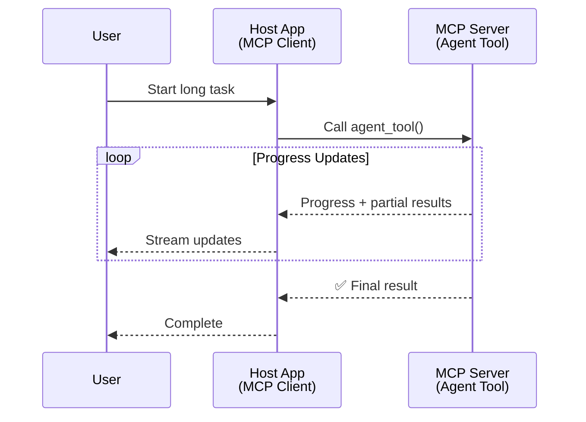
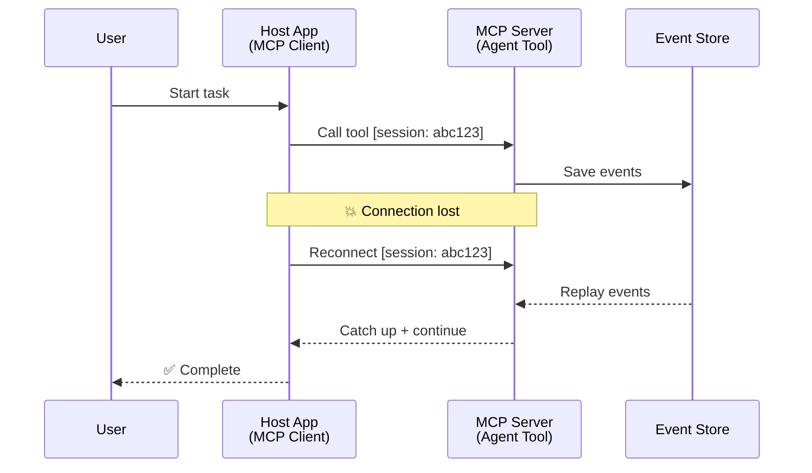
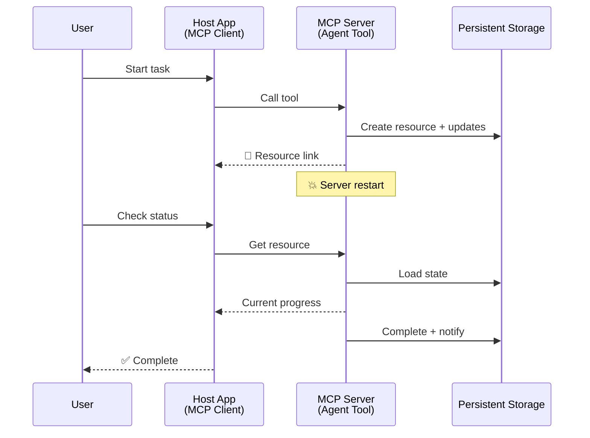
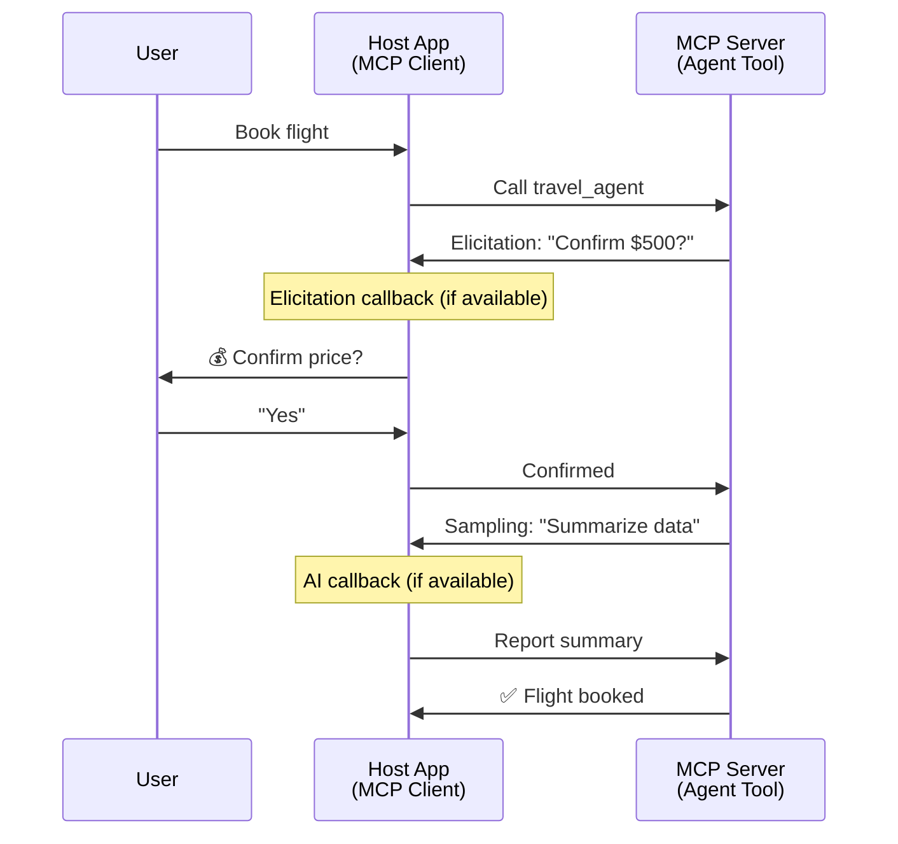
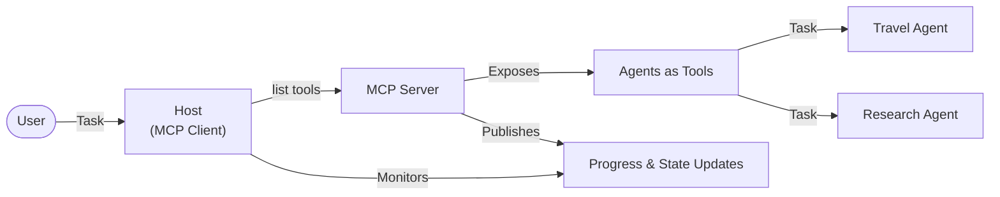

<!--
CO_OP_TRANSLATOR_METADATA:
{
  "original_hash": "5cc6836626047aa055e8960c8484a7d0",
  "translation_date": "2025-08-30T14:46:21+00:00",
  "source_file": "11-agentic-protocols/code_samples/mcp-agents/README.md",
  "language_code": "ko"
}
-->
# MCP를 활용한 에이전트 간 통신 시스템 구축

> TL;DR - MCP에서 Agent2Agent 통신을 구축할 수 있을까요? 네, 가능합니다!

MCP는 초기 목표였던 "LLM에 컨텍스트 제공"을 넘어 크게 발전했습니다. 최근 추가된 [재개 가능한 스트림](https://modelcontextprotocol.io/docs/concepts/transports#resumability-and-redelivery), [유도](https://modelcontextprotocol.io/specification/2025-06-18/client/elicitation), [샘플링](https://modelcontextprotocol.io/specification/2025-06-18/client/sampling), 그리고 알림 ([진행 상황](https://modelcontextprotocol.io/specification/2025-06-18/basic/utilities/progress) 및 [리소스](https://modelcontextprotocol.io/specification/2025-06-18/schema#resourceupdatednotification)) 기능을 통해 MCP는 복잡한 에이전트 간 통신 시스템을 구축할 수 있는 강력한 기반을 제공합니다.

## 에이전트/도구에 대한 오해

에이전트적 행동을 가진 도구를 탐구하는 개발자가 늘어나면서 (오랜 시간 실행되거나 실행 중 추가 입력이 필요한 경우 등), MCP가 부적합하다는 오해가 생겼습니다. 이는 초기 도구 원형이 단순한 요청-응답 패턴에 초점을 맞췄기 때문입니다.

이러한 인식은 이제 시대에 뒤떨어졌습니다. MCP 사양은 지난 몇 달 동안 크게 개선되어 장기 실행 에이전트 행동을 구축하는 데 필요한 기능을 제공합니다:

- **스트리밍 및 부분 결과**: 실행 중 실시간 진행 상황 업데이트
- **재개 가능성**: 클라이언트가 연결을 끊었다가 다시 연결하여 작업을 계속할 수 있음
- **내구성**: 서버 재시작 후에도 결과가 유지됨 (예: 리소스 링크를 통해)
- **다중 턴**: 실행 중간에 상호작용 입력 가능 (유도 및 샘플링)

이러한 기능은 MCP 프로토콜을 기반으로 복잡한 에이전트 및 다중 에이전트 애플리케이션을 가능하게 합니다.

참고로, 우리는 MCP 서버에서 사용할 수 있는 "도구"를 에이전트로 지칭할 것입니다. 이는 MCP 클라이언트를 구현하는 호스트 애플리케이션이 MCP 서버와 세션을 설정하고 에이전트를 호출할 수 있음을 의미합니다.

## MCP 도구가 "에이전트적"인 이유는 무엇인가?

구현에 들어가기 전에, 장기 실행 에이전트를 지원하기 위해 필요한 인프라 기능을 정의해 보겠습니다.

> 에이전트를 독립적으로 오랜 시간 동안 작동할 수 있으며, 실시간 피드백에 따라 여러 상호작용이나 조정을 필요로 하는 복잡한 작업을 처리할 수 있는 엔티티로 정의하겠습니다.

### 1. 스트리밍 및 부분 결과

전통적인 요청-응답 패턴은 장기 실행 작업에 적합하지 않습니다. 에이전트는 다음을 제공해야 합니다:

- 실시간 진행 상황 업데이트
- 중간 결과

**MCP 지원**: 리소스 업데이트 알림은 스트리밍 부분 결과를 가능하게 하지만, JSON-RPC의 1:1 요청/응답 모델과의 충돌을 피하기 위해 신중한 설계가 필요합니다.

| 기능                      | 사용 사례                                                                                                                                                                       | MCP 지원                                                                                   |
| -------------------------- | ------------------------------------------------------------------------------------------------------------------------------------------------------------------------------ | ------------------------------------------------------------------------------------------ |
| 실시간 진행 상황 업데이트 | 사용자가 코드베이스 마이그레이션 작업을 요청합니다. 에이전트가 진행 상황을 스트리밍합니다: "10% - 종속성 분석 중... 25% - TypeScript 파일 변환 중... 50% - 가져오기 업데이트 중..." | ✅ 진행 상황 알림                                                                           |
| 부분 결과                 | "책 생성" 작업이 부분 결과를 스트리밍합니다. 예: 1) 스토리 아크 개요, 2) 챕터 목록, 3) 각 챕터가 완료될 때마다. 호스트는 각 단계에서 검사, 취소 또는 리디렉션할 수 있습니다. | ✅ 알림은 부분 결과를 포함하도록 "확장"될 수 있음. PR 383, 776 제안 참조                     |

<div align="center" style="font-style: italic; font-size: 0.95em; margin-bottom: 0.5em;">
<strong>그림 1:</strong> 이 다이어그램은 MCP 에이전트가 장기 실행 작업 중 실시간 진행 상황 업데이트와 부분 결과를 호스트 애플리케이션에 스트리밍하여 사용자가 실행을 실시간으로 모니터링할 수 있도록 하는 방법을 보여줍니다.
</div>



### 2. 재개 가능성

에이전트는 네트워크 중단을 원활하게 처리해야 합니다:

- (클라이언트) 연결 끊김 후 다시 연결
- 중단된 지점에서 계속 진행 (메시지 재전송)

**MCP 지원**: MCP StreamableHTTP 전송은 현재 세션 ID와 마지막 이벤트 ID를 사용하여 세션 재개 및 메시지 재전송을 지원합니다. 여기서 중요한 점은 서버가 클라이언트 재연결 시 이벤트 재생을 가능하게 하는 EventStore를 구현해야 한다는 것입니다.  
커뮤니티 제안(PR #975)은 전송 방식에 구애받지 않는 재개 가능한 스트림을 탐구하고 있습니다.

| 기능          | 사용 사례                                                                                                                                                   | MCP 지원                                                                |
| ------------ | ---------------------------------------------------------------------------------------------------------------------------------------------------------- | -------------------------------------------------------------------------- |
| 재개 가능성   | 클라이언트가 장기 실행 작업 중 연결이 끊깁니다. 재연결 시, 세션이 재개되고 누락된 이벤트가 재생되어 중단된 지점에서 원활하게 계속됩니다. | ✅ StreamableHTTP 전송: 세션 ID, 이벤트 재생, EventStore 지원               |

<div align="center" style="font-style: italic; font-size: 0.95em; margin-bottom: 0.5em;">
<strong>그림 2:</strong> 이 다이어그램은 MCP의 StreamableHTTP 전송과 이벤트 저장소가 어떻게 원활한 세션 재개를 가능하게 하는지 보여줍니다: 클라이언트가 연결을 끊으면 다시 연결하여 누락된 이벤트를 재생하고 작업을 진행합니다.
</div>



### 3. 내구성

장기 실행 에이전트는 지속적인 상태가 필요합니다:

- 서버 재시작 후에도 결과가 유지됨
- 상태를 외부에서 조회 가능
- 세션 간 진행 상황 추적

**MCP 지원**: MCP는 이제 도구 호출에 대해 리소스 링크 반환 유형을 지원합니다. 현재 가능한 패턴은 리소스를 생성하고 즉시 리소스 링크를 반환하는 도구를 설계하는 것입니다. 도구는 백그라운드에서 작업을 계속 처리하고 리소스를 업데이트할 수 있습니다. 클라이언트는 이 리소스의 상태를 폴링하여 부분 또는 전체 결과를 얻거나 리소스 업데이트 알림을 구독할 수 있습니다.

여기서 한 가지 제한은 리소스를 폴링하거나 업데이트를 구독하는 것이 리소스를 소비할 수 있으며, 이는 확장성에 영향을 미칠 수 있다는 점입니다. 커뮤니티 제안(#992 포함)은 서버가 클라이언트/호스트 애플리케이션에 업데이트를 알리기 위해 호출할 수 있는 웹훅 또는 트리거를 포함할 가능성을 탐구하고 있습니다.

| 기능        | 사용 사례                                                                                                                                        | MCP 지원                                                        |
| ---------- | ----------------------------------------------------------------------------------------------------------------------------------------------- | ------------------------------------------------------------------ |
| 내구성     | 데이터 마이그레이션 작업 중 서버가 충돌합니다. 결과와 진행 상황이 재시작 후에도 유지되며, 클라이언트는 상태를 확인하고 지속적인 리소스를 통해 작업을 계속할 수 있습니다. | ✅ 리소스 링크: 지속적인 저장소 및 상태 알림 지원                   |

현재 일반적인 패턴은 리소스를 생성하고 즉시 리소스 링크를 반환하는 도구를 설계하는 것입니다. 도구는 백그라운드에서 작업을 처리하고, 진행 상황 업데이트로 작용하는 리소스 알림을 발행하거나 부분 결과를 포함할 수 있으며, 필요에 따라 리소스의 내용을 업데이트합니다.

<div align="center" style="font-style: italic; font-size: 0.95em; margin-bottom: 0.5em;">
<strong>그림 3:</strong> 이 다이어그램은 MCP 에이전트가 지속적인 리소스와 상태 알림을 사용하여 장기 실행 작업이 서버 재시작 후에도 유지되도록 하여 클라이언트가 진행 상황을 확인하고 실패 후에도 결과를 검색할 수 있도록 하는 방법을 보여줍니다.
</div>



### 4. 다중 턴 상호작용

에이전트는 실행 중 추가 입력이 필요할 수 있습니다:

- 사용자 확인 또는 승인
- 복잡한 결정에 대한 AI 지원
- 동적 매개변수 조정

**MCP 지원**: 샘플링(AI 입력) 및 유도(사용자 입력)를 통해 완전히 지원됩니다.

| 기능                 | 사용 사례                                                                                                                                     | MCP 지원                                           |
| ------------------- | -------------------------------------------------------------------------------------------------------------------------------------------- | ----------------------------------------------------- |
| 다중 턴 상호작용     | 여행 예약 에이전트가 사용자에게 가격 확인을 요청한 후, AI에게 여행 데이터를 요약하도록 요청한 다음 예약 거래를 완료합니다. | ✅ 유도: 사용자 입력, 샘플링: AI 입력 지원              |

<div align="center" style="font-style: italic; font-size: 0.95em; margin-bottom: 0.5em;">
<strong>그림 4:</strong> 이 다이어그램은 MCP 에이전트가 실행 중 사용자 입력을 유도하거나 AI 지원을 요청하여 확인 및 동적 의사결정과 같은 복잡한 다중 턴 워크플로를 지원하는 방법을 보여줍니다.
</div>



## MCP에서 장기 실행 에이전트 구현 - 코드 개요

이 기사에서는 [코드 저장소](https://github.com/victordibia/ai-tutorials/tree/main/MCP%20Agents)를 제공하며, StreamableHTTP 전송을 사용하여 세션 재개 및 메시지 재전송을 구현한 MCP Python SDK를 활용한 장기 실행 에이전트의 완전한 구현을 포함합니다. 이 구현은 MCP 기능을 조합하여 정교한 에이전트 행동을 가능하게 하는 방법을 보여줍니다.

구체적으로, 우리는 두 가지 주요 에이전트 도구를 가진 서버를 구현합니다:

- **여행 에이전트** - 가격 확인을 유도하는 여행 예약 서비스를 시뮬레이션
- **연구 에이전트** - 샘플링을 통해 AI 지원 요약을 수행하는 연구 작업

두 에이전트는 실시간 진행 상황 업데이트, 상호작용 확인, 완전한 세션 재개 기능을 보여줍니다.

### 주요 구현 개념

다음 섹션에서는 각 기능에 대한 서버 측 에이전트 구현과 클라이언트 측 호스트 처리 방법을 보여줍니다:

#### 스트리밍 및 진행 상황 업데이트 - 실시간 작업 상태

스트리밍은 에이전트가 장기 실행 작업 중 실시간 진행 상황 업데이트를 제공하여 사용자에게 작업 상태와 중간 결과를 알릴 수 있도록 합니다.

**서버 구현 (에이전트가 진행 상황 알림을 보냄):**

```python
# From server/server.py - Travel agent sending progress updates
for i, step in enumerate(steps):
    await ctx.session.send_progress_notification(
        progress_token=ctx.request_id,
        progress=i * 25,
        total=100,
        message=step,
        related_request_id=str(ctx.request_id)
    )
    await anyio.sleep(2)  # Simulate work

# Alternative: Log messages for detailed step-by-step updates
await ctx.session.send_log_message(
    level="info",
    data=f"Processing step {current_step}/{steps} ({progress_percent}%)",
    logger="long_running_agent",
    related_request_id=ctx.request_id,
)
```

**클라이언트 구현 (호스트가 진행 상황 업데이트를 수신):**

```python
# From client/client.py - Client handling real-time notifications
async def message_handler(message) -> None:
    if isinstance(message, types.ServerNotification):
        if isinstance(message.root, types.LoggingMessageNotification):
            console.print(f"📡 [dim]{message.root.params.data}[/dim]")
        elif isinstance(message.root, types.ProgressNotification):
            progress = message.root.params
            console.print(f"🔄 [yellow]{progress.message} ({progress.progress}/{progress.total})[/yellow]")

# Register message handler when creating session
async with ClientSession(
    read_stream, write_stream,
    message_handler=message_handler
) as session:
```

#### 유도 - 사용자 입력 요청

유도는 에이전트가 실행 중 사용자 입력을 요청할 수 있도록 합니다. 이는 장기 실행 작업 중 확인, 명확화 또는 승인을 위해 필수적입니다.

**서버 구현 (에이전트가 확인 요청):**

```python
# From server/server.py - Travel agent requesting price confirmation
elicit_result = await ctx.session.elicit(
    message=f"Please confirm the estimated price of $1200 for your trip to {destination}",
    requestedSchema=PriceConfirmationSchema.model_json_schema(),
    related_request_id=ctx.request_id,
)

if elicit_result and elicit_result.action == "accept":
    # Continue with booking
    logger.info(f"User confirmed price: {elicit_result.content}")
elif elicit_result and elicit_result.action == "decline":
    # Cancel the booking
    booking_cancelled = True
```

**클라이언트 구현 (호스트가 유도 콜백 제공):**

```python
# From client/client.py - Client handling elicitation requests
async def elicitation_callback(context, params):
    console.print(f"💬 Server is asking for confirmation:")
    console.print(f"   {params.message}")

    response = console.input("Do you accept? (y/n): ").strip().lower()

    if response in ['y', 'yes']:
        return types.ElicitResult(
            action="accept",
            content={"confirm": True, "notes": "Confirmed by user"}
        )
    else:
        return types.ElicitResult(
            action="decline",
            content={"confirm": False, "notes": "Declined by user"}
        )

# Register the callback when creating the session
async with ClientSession(
    read_stream, write_stream,
    elicitation_callback=elicitation_callback
) as session:
```

#### 샘플링 - AI 지원 요청

샘플링은 에이전트가 실행 중 복잡한 결정이나 콘텐츠 생성을 위해 LLM 지원을 요청할 수 있도록 합니다. 이는 인간-AI 하이브리드 워크플로를 가능하게 합니다.

**서버 구현 (에이전트가 AI 지원 요청):**

```python
# From server/server.py - Research agent requesting AI summary
sampling_result = await ctx.session.create_message(
    messages=[
        SamplingMessage(
            role="user",
            content=TextContent(type="text", text=f"Please summarize the key findings for research on: {topic}")
        )
    ],
    max_tokens=100,
    related_request_id=ctx.request_id,
)

if sampling_result and sampling_result.content:
    if sampling_result.content.type == "text":
        sampling_summary = sampling_result.content.text
        logger.info(f"Received sampling summary: {sampling_summary}")
```

**클라이언트 구현 (호스트가 샘플링 콜백 제공):**

```python
# From client/client.py - Client handling sampling requests
async def sampling_callback(context, params):
    message_text = params.messages[0].content.text if params.messages else 'No message'
    console.print(f"🧠 Server requested sampling: {message_text}")

    # In a real application, this could call an LLM API
    # For demo purposes, we provide a mock response
    mock_response = "Based on current research, MCP has evolved significantly..."

    return types.CreateMessageResult(
        role="assistant",
        content=types.TextContent(type="text", text=mock_response),
        model="interactive-client",
        stopReason="endTurn"
    )

# Register the callback when creating the session
async with ClientSession(
    read_stream, write_stream,
    sampling_callback=sampling_callback,
    elicitation_callback=elicitation_callback
) as session:
```

#### 재개 가능성 - 연결 끊김 후 세션 연속성

재개 가능성은 장기 실행 에이전트 작업이 클라이언트 연결 끊김을 견디고 재연결 시 원활하게 계속 진행할 수 있도록 합니다. 이는 이벤트 저장소와 재개 토큰을 통해 구현됩니다.

**이벤트 저장소 구현 (서버가 세션 상태 유지):**

```python
# From server/event_store.py - Simple in-memory event store
class SimpleEventStore(EventStore):
    def __init__(self):
        self._events: list[tuple[StreamId, EventId, JSONRPCMessage]] = []
        self._event_id_counter = 0

    async def store_event(self, stream_id: StreamId, message: JSONRPCMessage) -> EventId:
        """Store an event and return its ID."""
        self._event_id_counter += 1
        event_id = str(self._event_id_counter)
        self._events.append((stream_id, event_id, message))
        return event_id

    async def replay_events_after(self, last_event_id: EventId, send_callback: EventCallback) -> StreamId | None:
        """Replay events after the specified ID for resumption."""
        # Find events after the last known event and replay them
        for _, event_id, message in self._events[start_index:]:
            await send_callback(EventMessage(message, event_id))

# From server/server.py - Passing event store to session manager
def create_server_app(event_store: Optional[EventStore] = None) -> Starlette:
    server = ResumableServer()

    # Create session manager with event store for resumption
    session_manager = StreamableHTTPSessionManager(
        app=server,
        event_store=event_store,  # Event store enables session resumption
        json_response=False,
        security_settings=security_settings,
    )

    return Starlette(routes=[Mount("/mcp", app=session_manager.handle_request)])

# Usage: Initialize with event store
event_store = SimpleEventStore()
app = create_server_app(event_store)
```

**클라이언트 메타데이터와 재개 토큰 (클라이언트가 저장된 상태를 사용하여 재연결):**

```python
# From client/client.py - Client resumption with metadata
if existing_tokens and existing_tokens.get("resumption_token"):
    # Use existing resumption token to continue where we left off
    metadata = ClientMessageMetadata(
        resumption_token=existing_tokens["resumption_token"],
    )
else:
    # Create callback to save resumption token when received
    def enhanced_callback(token: str):
        protocol_version = getattr(session, 'protocol_version', None)
        token_manager.save_tokens(session_id, token, protocol_version, command, args)

    metadata = ClientMessageMetadata(
        on_resumption_token_update=enhanced_callback,
    )

# Send request with resumption metadata
result = await session.send_request(
    types.ClientRequest(
        types.CallToolRequest(
            method="tools/call",
            params=types.CallToolRequestParams(name=command, arguments=args)
        )
    ),
    types.CallToolResult,
    metadata=metadata,
)
```

호스트 애플리케이션은 세션 ID와 재개 토큰을 로컬로 유지하여 기존 세션에 다시 연결할 수 있도록 하며, 진행 상황이나 상태를 잃지 않습니다.

### 코드 구성

<div align="center" style="font-style: italic; font-size: 0.95em; margin-bottom: 0.5em;">
<strong>그림 5:</strong> MCP 기반 에이전트 시스템 아키텍처
</div>



**주요 파일:**

- **`server/server.py`** - 여행 및 연구 에이전트를 포함한 재개 가능한 MCP 서버. 유도, 샘플링, 진행 상황 업데이트를 시연
- **`client/client.py`** - 재개 지원, 콜백 핸들러, 토큰 관리를 포함한 대화형 호스트 애플리케이션
- **`server/event_store.py`** - 세션 재개 및 메시지 재전송을 가능하게 하는 이벤트 저장소 구현

## MCP에서 다중 에이전트 통신으로 확장

위 구현은 호스트 애플리케이션의 지능과 범위를 확장하여 다중 에이전트 시스템으로 확장할 수 있습니다:

- **지능형 작업 분해**: 호스트가 복잡한 사용자 요청을 분석하고 이를 다양한 전문 에이전트의 하위 작업으로 분해
- **다중 서버 조정**: 호스트가 여러 MCP 서버에 연결을 유지하며, 각 서버는 다양한 에이전트 기능을 제공
- **작업 상태 관리**: 호스트가 여러 동시 에이전트 작업의 진행 상황을 추적하며, 종속성과 순서를 처리
- **복원력 및 재시도**: 호스트가 실패를 관리하고, 재시도 로직을 구현하며, 에이전트가 사용 불가능할 때 작업을 재라우팅
- **결과 합성**: 호스트가 여러 에이전트의 출력을 결합하여 일관된 최종 결과 생성

호스트는 단순한 클라이언트에서 지능형 오케스트레이터로 발전하며, 분산된 에이전트 기능을 조정하면서 동일한 MCP 프로토콜 기반을 유지합니다.

## 결론

MCP의 향상된 기능 - 리소스 알림, 유도/샘플링, 재개 가능한 스트림, 지속적인 리소스 -은 복잡한 에이전트 간 상호작용을 가능하게 하면서도 프로토콜의 단순성을 유지합니다.

## 시작하기

자신만의 Agent2Agent 시스템을 구축할 준비가 되셨나요? 다음 단계를 따라보세요:

### 1. 데모 실행

```bash
# Start the server with event store for resumption
python -m server.server --port 8006

# In another terminal, run the interactive client
python -m client.client --url http://127.0.0.1:8006/mcp
```

**대화형 모드에서 사용 가능한 명령:**

- `travel_agent` - 유도를 통해 가격 확인을 포함한 여행 예약
- `research_agent` - 샘플링을 통해 AI 지원 요약을 포함한 연구 주제
- `list` - 사용 가능한 모든 도구 표시
- `clean-tokens` - 재개 토큰 삭제
- `help` - 자세한 명령 도움말 표시
- `quit` - 클라이언트 종료

### 2. 재개 기능 테스트

- 장기 실행 에이전트 시작 (예: `travel_agent`)
- 실행 중 클라이언트 중단 (Ctrl+C)
- 클라이언트 재시작 - 중단된 지점에서 자동으로 재개

### 3. 탐구 및 확장

- **예제 탐구**: [mcp-agents](https://github.com/victordibia/ai-tutorials/tree/main/MCP%20Agents)를 확인하세요
- **커뮤니티 참여**: GitHub에서 MCP 논의에 참여하세요
- **실험**: 간단한 장기 실행 작업으로 시작하여 스트리밍, 재개 가능성, 다중 에이전트 조정을 점진적으로 추가하세요

이것은 MCP가 도구 기반의 단순성을 유지하면서 지능형 에이전트 행동을 가능하게 하는 방법을 보여줍니다.

전반적으로 MCP 프로토콜 사양은 빠르게 발전하고 있습니다. 독자는 최신 업데이트를 위해 공식 문서 웹사이트를 검토할 것을 권장합니다 - https://modelcontextprotocol.io/introduction

---

**면책 조항**:  
이 문서는 AI 번역 서비스 [Co-op Translator](https://github.com/Azure/co-op-translator)를 사용하여 번역되었습니다. 정확성을 위해 최선을 다하고 있으나, 자동 번역에는 오류나 부정확성이 포함될 수 있습니다. 원본 문서를 해당 언어로 작성된 상태에서 권위 있는 자료로 간주해야 합니다. 중요한 정보의 경우, 전문적인 인간 번역을 권장합니다. 이 번역 사용으로 인해 발생하는 오해나 잘못된 해석에 대해 당사는 책임을 지지 않습니다.  