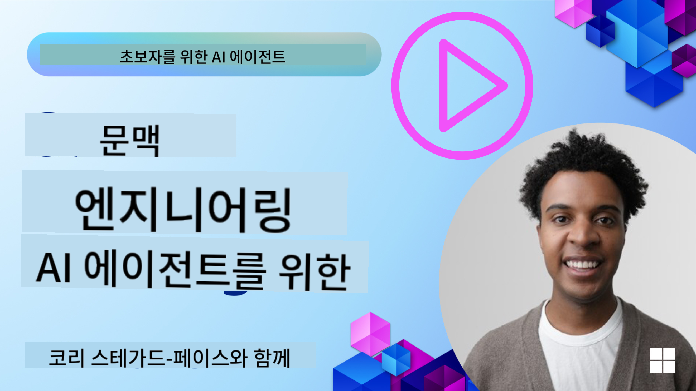
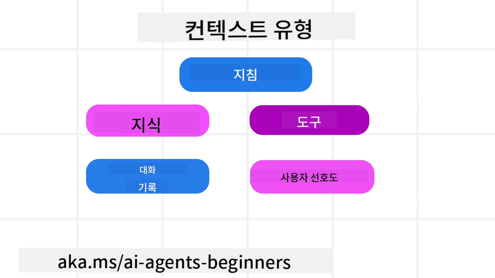

<!--
CO_OP_TRANSLATOR_METADATA:
{
  "original_hash": "cb7e50f471905ce6fdb92a30269a7a98",
  "translation_date": "2025-09-04T09:54:48+00:00",
  "source_file": "12-context-engineering/README.md",
  "language_code": "ko"
}
-->
# AI 에이전트를 위한 컨텍스트 엔지니어링

> _(위 이미지를 클릭하면 이 강의의 영상을 볼 수 있습니다)_

AI 에이전트를 구축하려는 애플리케이션의 복잡성을 이해하는 것은 신뢰할 수 있는 에이전트를 만드는 데 중요합니다. 우리는 프롬프트 엔지니어링을 넘어 복잡한 요구를 해결하기 위해 정보를 효과적으로 관리하는 AI 에이전트를 구축해야 합니다.

이번 강의에서는 컨텍스트 엔지니어링이 무엇인지, 그리고 AI 에이전트를 구축하는 데 있어 그 역할에 대해 알아보겠습니다.

## 소개

이 강의에서는 다음을 다룹니다:

• **컨텍스트 엔지니어링이란 무엇인가** 그리고 프롬프트 엔지니어링과 어떻게 다른지.

• **효과적인 컨텍스트 엔지니어링 전략**, 정보를 작성, 선택, 압축, 분리하는 방법을 포함하여.

• **일반적인 컨텍스트 실패 사례**와 이를 수정하는 방법.

## 학습 목표

이 강의를 완료한 후, 여러분은 다음을 이해하게 됩니다:

• **컨텍스트 엔지니어링 정의**와 프롬프트 엔지니어링과의 차이점.

• **대규모 언어 모델(LLM) 애플리케이션에서 컨텍스트의 주요 구성 요소 식별**.

• **컨텍스트 작성, 선택, 압축, 분리 전략 적용**을 통해 에이전트 성능 개선.

• **컨텍스트 실패 사례 인식** (예: 오염, 산만함, 혼란, 충돌) 및 이를 완화하는 기술 구현.

## 컨텍스트 엔지니어링이란?

AI 에이전트의 경우, 컨텍스트는 에이전트가 특정 행동을 계획하도록 유도하는 핵심 요소입니다. 컨텍스트 엔지니어링은 AI 에이전트가 작업의 다음 단계를 완료하는 데 필요한 올바른 정보를 갖추도록 하는 실천입니다. 컨텍스트 윈도우는 크기가 제한되어 있으므로, 에이전트 개발자로서 우리는 컨텍스트 윈도우에 정보를 추가, 제거, 압축하는 시스템과 프로세스를 구축해야 합니다.

### 프롬프트 엔지니어링 vs 컨텍스트 엔지니어링

프롬프트 엔지니어링은 AI 에이전트를 효과적으로 안내하기 위한 정적 지침 세트에 초점을 맞춥니다. 컨텍스트 엔지니어링은 초기 프롬프트를 포함하여 동적인 정보 세트를 관리하여 시간이 지나도 AI 에이전트가 필요한 정보를 갖추도록 하는 것입니다. 컨텍스트 엔지니어링의 핵심 아이디어는 이 과정을 반복 가능하고 신뢰할 수 있게 만드는 것입니다.

### 컨텍스트의 유형

컨텍스트는 단일 요소가 아니라는 점을 기억하는 것이 중요합니다. AI 에이전트가 필요로 하는 정보는 다양한 출처에서 올 수 있으며, 에이전트가 이러한 출처에 접근할 수 있도록 하는 것은 우리의 책임입니다:

AI 에이전트가 관리해야 할 컨텍스트 유형은 다음과 같습니다:

• **지침:** 에이전트의 "규칙"과 같은 것으로, 프롬프트, 시스템 메시지, few-shot 예제(에이전트에게 작업 방법을 보여주는 것), 사용할 수 있는 도구의 설명 등이 포함됩니다. 이는 프롬프트 엔지니어링과 컨텍스트 엔지니어링이 결합되는 부분입니다.

• **지식:** 데이터베이스에서 검색된 정보, 또는 에이전트가 축적한 장기 기억을 포함합니다. 에이전트가 다양한 지식 저장소와 데이터베이스에 접근해야 하는 경우 Retrieval Augmented Generation (RAG) 시스템을 통합할 수 있습니다.

• **도구:** 에이전트가 호출할 수 있는 외부 함수, API 및 MCP 서버의 정의와 이를 사용하여 얻은 피드백(결과)을 포함합니다.

• **대화 기록:** 사용자와의 진행 중인 대화. 시간이 지남에 따라 대화가 길어지고 복잡해지며, 이는 컨텍스트 윈도우의 공간을 차지하게 됩니다.

• **사용자 선호도:** 시간이 지나면서 사용자의 선호도(좋아하는 것 또는 싫어하는 것)에 대한 정보를 학습합니다. 이는 주요 결정을 내릴 때 사용자에게 도움을 줄 수 있도록 저장되고 호출될 수 있습니다.

## 효과적인 컨텍스트 엔지니어링 전략

### 계획 전략

좋은 컨텍스트 엔지니어링은 좋은 계획에서 시작됩니다. 다음은 컨텍스트 엔지니어링 개념을 적용하는 방법에 대해 생각해볼 수 있는 접근 방식입니다:

1. **명확한 결과 정의** - AI 에이전트가 수행할 작업의 결과를 명확히 정의해야 합니다. "AI 에이전트가 작업을 완료했을 때 세상이 어떻게 변할 것인가?"라는 질문에 답하십시오. 즉, 사용자와의 상호작용 후에 어떤 변화, 정보 또는 응답이 있어야 하는지 정의합니다.

2. **컨텍스트 매핑** - AI 에이전트의 결과를 정의한 후, "AI 에이전트가 이 작업을 완료하기 위해 어떤 정보가 필요한가?"라는 질문에 답해야 합니다. 이를 통해 해당 정보가 어디에 위치할 수 있는지 컨텍스트를 매핑할 수 있습니다.

3. **컨텍스트 파이프라인 생성** - 정보를 어디에서 찾을 수 있는지 알게 되면, "에이전트가 이 정보를 어떻게 얻을 것인가?"라는 질문에 답해야 합니다. 이는 RAG, MCP 서버 및 기타 도구를 사용하는 다양한 방법으로 수행할 수 있습니다.

### 실용적인 전략

계획은 중요하지만, 정보가 에이전트의 컨텍스트 윈도우로 들어오기 시작하면 이를 관리하기 위한 실용적인 전략이 필요합니다:

#### 컨텍스트 관리

일부 정보는 컨텍스트 윈도우에 자동으로 추가되지만, 컨텍스트 엔지니어링은 이 정보를 더 적극적으로 관리하는 것을 목표로 합니다. 이를 위한 몇 가지 전략은 다음과 같습니다:

1. **에이전트 스크래치패드**
   에이전트가 현재 작업과 사용자 상호작용에 대한 관련 정보를 기록할 수 있도록 합니다. 이는 컨텍스트 윈도우 외부에 파일이나 런타임 객체로 존재해야 하며, 필요할 때 해당 세션 동안 다시 가져올 수 있습니다.

2. **기억**
   스크래치패드는 단일 세션의 컨텍스트 윈도우 외부에서 정보를 관리하는 데 유용합니다. 기억은 에이전트가 여러 세션에 걸쳐 관련 정보를 저장하고 검색할 수 있도록 합니다. 여기에는 요약, 사용자 선호도 및 향후 개선을 위한 피드백이 포함될 수 있습니다.

3. **컨텍스트 압축**
   컨텍스트 윈도우가 커지고 한계에 가까워지면 요약 및 트리밍과 같은 기술을 사용할 수 있습니다. 이는 가장 관련성이 높은 정보만 유지하거나 오래된 메시지를 제거하는 것을 포함합니다.

4. **멀티 에이전트 시스템**
   멀티 에이전트 시스템을 개발하는 것은 컨텍스트 엔지니어링의 한 형태입니다. 각 에이전트는 고유한 컨텍스트 윈도우를 가지며, 이 컨텍스트를 공유하고 다른 에이전트에 전달하는 방법을 계획하는 것이 중요합니다.

5. **샌드박스 환경**
   에이전트가 코드를 실행하거나 문서의 많은 정보를 처리해야 하는 경우, 결과를 처리하는 데 많은 토큰이 필요할 수 있습니다. 이를 컨텍스트 윈도우에 모두 저장하는 대신, 에이전트는 샌드박스 환경을 사용하여 코드를 실행하고 결과 및 기타 관련 정보만 읽을 수 있습니다.

6. **런타임 상태 객체**
   에이전트가 특정 정보에 접근해야 하는 상황을 관리하기 위해 정보 컨테이너를 생성합니다. 복잡한 작업의 경우, 에이전트가 각 하위 작업의 결과를 단계별로 저장할 수 있어 컨텍스트가 특정 하위 작업에만 연결되도록 합니다.

### 컨텍스트 엔지니어링 예시

예를 들어, AI 에이전트에게 **"파리 여행을 예약해줘."**라고 요청한다고 가정해봅시다.

• 프롬프트 엔지니어링만 사용하는 간단한 에이전트는 **"좋아요, 언제 파리에 가고 싶으신가요?"**라고 응답할 것입니다. 이는 사용자가 요청한 시점의 직접적인 질문만 처리합니다.

• 컨텍스트 엔지니어링 전략을 사용하는 에이전트는 훨씬 더 많은 작업을 수행합니다. 응답하기 전에 시스템은 다음을 수행할 수 있습니다:

  ◦ **실시간 데이터 검색**을 통해 사용자의 캘린더를 확인하여 가능한 날짜를 찾습니다.

 ◦ **장기 기억에서 과거 여행 선호도**를 회상하여 선호하는 항공사, 예산, 직항 여부를 확인합니다.

 ◦ **항공 및 호텔 예약을 위한 사용 가능한 도구 식별**.

- 그런 다음, 예시 응답은 다음과 같을 수 있습니다: "안녕하세요 [사용자 이름]! 첫째 주에 시간이 비어 있는 것을 확인했습니다. [선호 항공사]의 직항편을 [예산] 내에서 찾아볼까요?" 이처럼 풍부하고 컨텍스트를 고려한 응답은 컨텍스트 엔지니어링의 힘을 보여줍니다.

## 일반적인 컨텍스트 실패 사례

### 컨텍스트 오염

**문제:** LLM이 생성한 잘못된 정보(환각) 또는 오류가 컨텍스트에 들어가 반복적으로 참조되면서 에이전트가 불가능한 목표를 추구하거나 엉뚱한 전략을 개발하게 되는 경우.

**해결 방법:** **컨텍스트 검증** 및 **격리**를 구현합니다. 장기 기억에 추가되기 전에 정보를 검증합니다. 오염 가능성이 감지되면 새로운 컨텍스트 스레드를 시작하여 잘못된 정보가 확산되지 않도록 합니다.

**여행 예약 예시:** 에이전트가 **작은 지역 공항에서 먼 국제 도시로 가는 직항편**을 환각으로 생성했는데, 실제로는 해당 공항이 국제선을 제공하지 않습니다. 이 잘못된 비행 정보가 컨텍스트에 저장됩니다. 이후 에이전트에게 예약을 요청하면, 이 불가능한 경로를 계속 찾으려 하여 반복적인 오류가 발생합니다.

**해결책:** **실시간 API를 사용하여 비행 존재 여부와 경로를 검증**하는 단계를 구현합니다. 검증이 실패하면 잘못된 정보는 "격리"되어 더 이상 사용되지 않습니다.

### 컨텍스트 산만함

**문제:** 컨텍스트가 너무 커져 모델이 축적된 기록에 지나치게 집중하고, 훈련 중 학습한 내용을 제대로 활용하지 못해 반복적이거나 도움이 되지 않는 행동을 하게 되는 경우. 컨텍스트 윈도우가 가득 차기 전에 모델이 실수를 시작할 수 있습니다.

**해결 방법:** **컨텍스트 요약**을 사용합니다. 축적된 정보를 주기적으로 짧은 요약으로 압축하여 중요한 세부 사항을 유지하면서 중복된 기록을 제거합니다. 이를 통해 "초점"을 재설정할 수 있습니다.

**여행 예약 예시:** 다양한 여행지에 대한 꿈을 오랫동안 논의하며, 2년 전 배낭여행에 대한 상세한 이야기를 포함합니다. 결국 **"다음 달에 저렴한 항공편을 찾아줘"**라고 요청했을 때, 에이전트가 오래된 관련 없는 세부 사항에 얽매여 배낭 장비나 과거 일정에 대해 계속 묻고 현재 요청을 소홀히 합니다.

**해결책:** 일정 횟수의 대화 후 또는 컨텍스트가 너무 커질 때, 에이전트는 **가장 최근의 관련 대화 부분을 요약**하여 현재 여행 날짜와 목적지에 집중하고, 덜 중요한 과거 대화는 버립니다.

### 컨텍스트 혼란

**문제:** 너무 많은 도구가 사용 가능할 때 불필요한 컨텍스트가 모델을 혼란스럽게 하여 잘못된 응답을 생성하거나 관련 없는 도구를 호출하게 되는 경우. 특히 작은 모델에서 이러한 문제가 두드러집니다.

**해결 방법:** RAG 기술을 사용하여 **도구 로드아웃 관리**를 구현합니다. 도구 설명을 벡터 데이터베이스에 저장하고, 특정 작업에 가장 관련성이 높은 도구만 선택합니다. 연구에 따르면 도구 선택을 30개 이하로 제한하는 것이 효과적입니다.

**여행 예약 예시:** 에이전트가 수십 개의 도구를 사용할 수 있습니다: `book_flight`, `book_hotel`, `rent_car`, `find_tours`, `currency_converter`, `weather_forecast`, `restaurant_reservations` 등. 사용자가 **"파리에서 이동하는 가장 좋은 방법은 무엇인가요?"**라고 묻자, 너무 많은 도구로 인해 에이전트가 파리 내에서 `book_flight`를 호출하거나, 대중교통을 선호하는 사용자를 위해 `rent_car`를 호출하는 등 혼란스러운 행동을 보일 수 있습니다.

**해결책:** **도구 설명에 대한 RAG 사용**. 사용자가 파리에서 이동 방법을 묻는 경우, 시스템은 `rent_car` 또는 `public_transport_info`와 같은 가장 관련성이 높은 도구만 동적으로 검색하여 LLM에 집중된 "로드아웃"을 제공합니다.

### 컨텍스트 충돌

**문제:** 컨텍스트 내에 상충되는 정보가 존재하여 일관성 없는 추론이나 잘못된 최종 응답을 초래하는 경우. 정보가 단계적으로 도착할 때 초기의 잘못된 가정이 컨텍스트에 남아 있을 때 발생합니다.

**해결 방법:** **컨텍스트 가지치기** 및 **오프로드**를 사용합니다. 가지치기는 새로운 세부 사항이 도착할 때 오래되거나 상충되는 정보를 제거하는 것을 의미합니다. 오프로드는 모델이 주요 컨텍스트를 어지럽히지 않고 정보를 처리할 별도의 "스크래치패드" 작업 공간을 제공하는 것입니다.

**여행 예약 예시:** 처음에 에이전트에게 **"이코노미 클래스에서 비행하고 싶다."**라고 말합니다. 이후 대화에서 마음을 바꿔 **"이번 여행은 비즈니스 클래스로 가자."**라고 말합니다. 두 지침이 모두 컨텍스트에 남아 있으면, 에이전트가 상충되는 검색 결과를 받거나 어떤 선호도를 우선시해야 할지 혼란스러워할 수 있습니다.

**해결책:** **컨텍스트 가지치기**를 구현합니다. 새로운 지침이 이전 지침과 상충될 때, 이전 지침은 제거되거나 명시적으로 컨텍스트에서 덮어씌워집니다. 또는 에이전트가 **스크래치패드**를 사용하여 상충되는 선호도를 조정한 후 결정하여 최종적으로 일관된 지침만 행동을 안내하도록 합니다.

## 컨텍스트 엔지니어링에 대한 추가 질문이 있나요?

[Azure AI Foundry Discord](https://aka.ms/ai-agents/discord)에 참여하여 다른 학습자들과 만나고, 오피스 아워에 참석하며 AI 에이전트에 대한 질문을 해결하세요.

---

**면책 조항**:  
이 문서는 AI 번역 서비스 [Co-op Translator](https://github.com/Azure/co-op-translator)를 사용하여 번역되었습니다. 정확성을 위해 최선을 다하고 있지만, 자동 번역에는 오류나 부정확성이 포함될 수 있습니다. 원본 문서의 원어 버전을 권위 있는 출처로 간주해야 합니다. 중요한 정보의 경우, 전문적인 인간 번역을 권장합니다. 이 번역 사용으로 인해 발생하는 오해나 잘못된 해석에 대해 책임을 지지 않습니다.