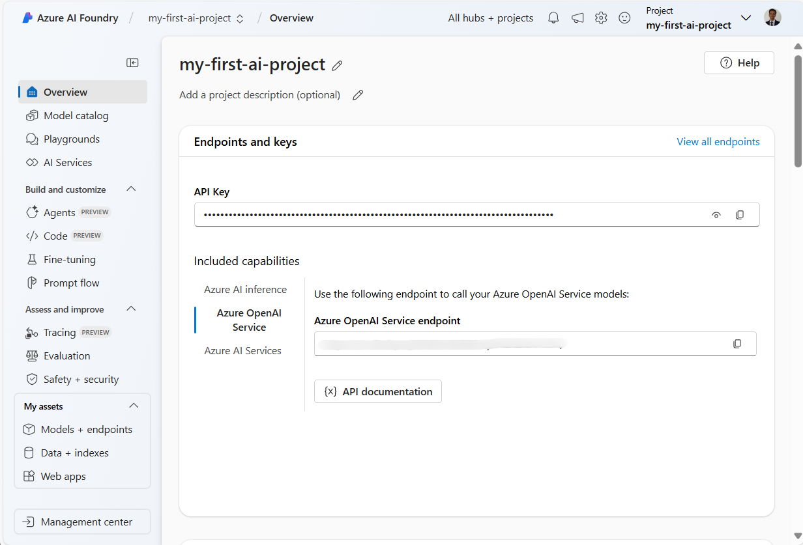
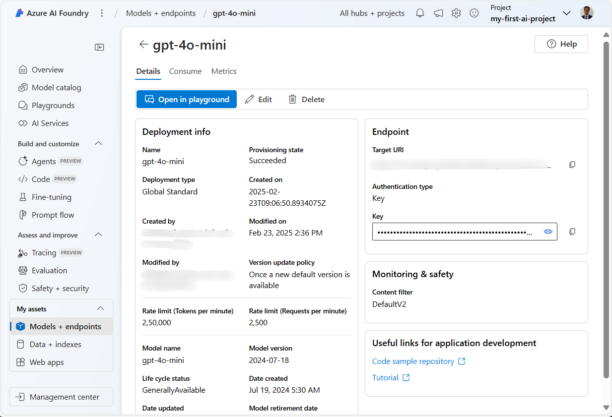
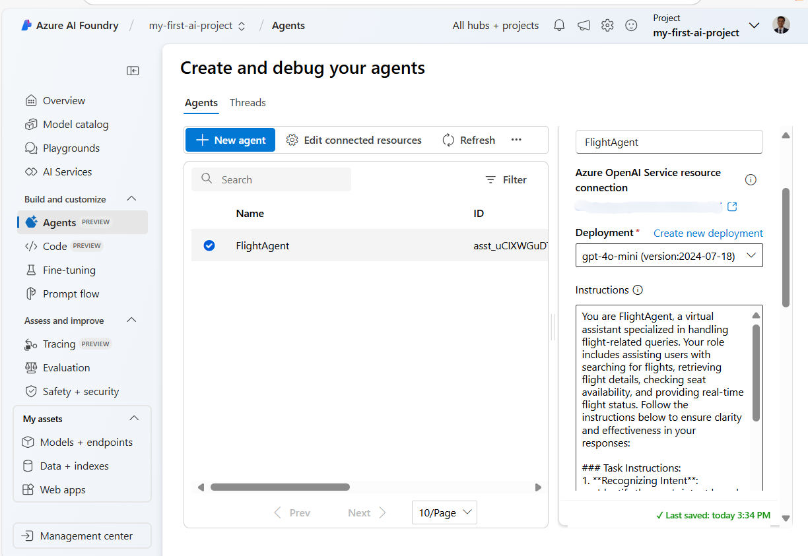

<!--
CO_OP_TRANSLATOR_METADATA:
{
  "original_hash": "7e92870dc0843e13d4dabc620c09d2d9",
  "translation_date": "2025-08-30T15:07:59+00:00",
  "source_file": "02-explore-agentic-frameworks/azure-ai-foundry-agent-creation.md",
  "language_code": "lt"
}
-->
# Azure AI Agent Service Development

Šiame pratime naudosite Azure AI Agent paslaugos įrankius [Azure AI Foundry portale](https://ai.azure.com/?WT.mc_id=academic-105485-koreyst), kad sukurtumėte agentą skrydžių rezervacijai. Agentas galės bendrauti su vartotojais ir teikti informaciją apie skrydžius.

## Būtinos sąlygos

Norint atlikti šį pratimą, jums reikės:
1. Azure paskyros su aktyvia prenumerata. [Sukurkite paskyrą nemokamai](https://azure.microsoft.com/free/?WT.mc_id=academic-105485-koreyst).
2. Leidimų sukurti Azure AI Foundry centrą arba jau sukurtą centrą.
    - Jei jūsų rolė yra Contributor arba Owner, galite sekti šio vadovo žingsnius.

## Sukurkite Azure AI Foundry centrą

> **Note:** Azure AI Foundry anksčiau buvo žinomas kaip Azure AI Studio.

1. Sekite šias gaires iš [Azure AI Foundry](https://learn.microsoft.com/en-us/azure/ai-studio/?WT.mc_id=academic-105485-koreyst) tinklaraščio įrašo, kad sukurtumėte Azure AI Foundry centrą.
2. Kai jūsų projektas bus sukurtas, uždarykite bet kokius rodomus patarimus ir peržiūrėkite projekto puslapį Azure AI Foundry portale, kuris turėtų atrodyti panašiai kaip šiame paveikslėlyje:

    

## Modelio diegimas

1. Kairiajame projekto skydelyje, **My assets** skiltyje, pasirinkite **Models + endpoints** puslapį.
2. **Models + endpoints** puslapyje, **Model deployments** skirtuke, **+ Deploy model** meniu pasirinkite **Deploy base model**.
3. Sąraše suraskite `gpt-4o-mini` modelį, tada pasirinkite ir patvirtinkite jį.

    > **Note**: TPM mažinimas padeda išvengti per didelio prenumeratos kvotos naudojimo.

    

## Sukurkite agentą

Kai modelis jau yra įdiegtas, galite sukurti agentą. Agentas yra pokalbių AI modelis, kuris gali bendrauti su vartotojais.

1. Kairiajame projekto skydelyje, **Build & Customize** skiltyje, pasirinkite **Agents** puslapį.
2. Spustelėkite **+ Create agent**, kad sukurtumėte naują agentą. **Agent Setup** dialogo lange:
    - Įveskite agento pavadinimą, pvz., `FlightAgent`.
    - Įsitikinkite, kad pasirinktas anksčiau sukurtas `gpt-4o-mini` modelio diegimas.
    - Nustatykite **Instructions** pagal nurodymus, kuriuos norite, kad agentas vykdytų. Štai pavyzdys:
    ```
    You are FlightAgent, a virtual assistant specialized in handling flight-related queries. Your role includes assisting users with searching for flights, retrieving flight details, checking seat availability, and providing real-time flight status. Follow the instructions below to ensure clarity and effectiveness in your responses:

    ### Task Instructions:
    1. **Recognizing Intent**:
       - Identify the user's intent based on their request, focusing on one of the following categories:
         - Searching for flights
         - Retrieving flight details using a flight ID
         - Checking seat availability for a specified flight
         - Providing real-time flight status using a flight number
       - If the intent is unclear, politely ask users to clarify or provide more details.
        
    2. **Processing Requests**:
        - Depending on the identified intent, perform the required task:
        - For flight searches: Request details such as origin, destination, departure date, and optionally return date.
        - For flight details: Request a valid flight ID.
        - For seat availability: Request the flight ID and date and validate inputs.
        - For flight status: Request a valid flight number.
        - Perform validations on provided data (e.g., formats of dates, flight numbers, or IDs). If the information is incomplete or invalid, return a friendly request for clarification.

    3. **Generating Responses**:
    - Use a tone that is friendly, concise, and supportive.
    - Provide clear and actionable suggestions based on the output of each task.
    - If no data is found or an error occurs, explain it to the user gently and offer alternative actions (e.g., refine search, try another query).
    
    ```
> [!NOTE]
> Dėl detalesnio nurodymo galite peržiūrėti [šį saugyklą](https://github.com/ShivamGoyal03/RoamMind) daugiau informacijos.

> Be to, galite pridėti **Knowledge Base** ir **Actions**, kad pagerintumėte agento galimybes teikti daugiau informacijos ir atlikti automatizuotas užduotis pagal vartotojo užklausas. Šiame pratime galite praleisti šiuos žingsnius.



3. Norėdami sukurti naują multi-AI agentą, tiesiog spustelėkite **New Agent**. Naujas agentas bus rodomas Agents puslapyje.

## Testuokite agentą

Sukūrę agentą, galite jį išbandyti, kad pamatytumėte, kaip jis reaguoja į vartotojo užklausas Azure AI Foundry portalo žaidimų aikštelėje.

1. Agentui skirtame **Setup** skydelyje viršuje pasirinkite **Try in playground**.
2. **Playground** skydelyje galite bendrauti su agentu, įvesdami užklausas pokalbių lange. Pavyzdžiui, galite paprašyti agento surasti skrydžius iš Sietlo į Niujorką 28 dieną.

    > **Note**: Agentas gali pateikti netikslius atsakymus, nes šiame pratime nenaudojami realaus laiko duomenys. Tikslas yra išbandyti agento gebėjimą suprasti ir atsakyti į vartotojo užklausas pagal pateiktus nurodymus.

    

3. Po agento testavimo galite jį toliau pritaikyti, pridėdami daugiau ketinimų, mokymo duomenų ir veiksmų, kad pagerintumėte jo galimybes.

## Išteklių išvalymas

Baigę testuoti agentą, galite jį ištrinti, kad išvengtumėte papildomų išlaidų.
1. Atidarykite [Azure portalą](https://portal.azure.com) ir peržiūrėkite išteklių grupės, kurioje buvo įdiegti centro ištekliai, turinį.
2. Įrankių juostoje pasirinkite **Delete resource group**.
3. Įveskite išteklių grupės pavadinimą ir patvirtinkite, kad norite ją ištrinti.

## Ištekliai

- [Azure AI Foundry dokumentacija](https://learn.microsoft.com/en-us/azure/ai-studio/?WT.mc_id=academic-105485-koreyst)
- [Azure AI Foundry portalas](https://ai.azure.com/?WT.mc_id=academic-105485-koreyst)
- [Pradžia su Azure AI Studio](https://techcommunity.microsoft.com/blog/educatordeveloperblog/getting-started-with-azure-ai-studio/4095602?WT.mc_id=academic-105485-koreyst)
- [AI agentų pagrindai Azure platformoje](https://learn.microsoft.com/en-us/training/modules/ai-agent-fundamentals/?WT.mc_id=academic-105485-koreyst)
- [Azure AI Discord](https://aka.ms/AzureAI/Discord)

---

**Atsakomybės apribojimas**:  
Šis dokumentas buvo išverstas naudojant AI vertimo paslaugą [Co-op Translator](https://github.com/Azure/co-op-translator). Nors siekiame tikslumo, prašome atkreipti dėmesį, kad automatiniai vertimai gali turėti klaidų ar netikslumų. Originalus dokumentas jo gimtąja kalba turėtų būti laikomas autoritetingu šaltiniu. Kritinei informacijai rekomenduojama profesionali žmogaus vertimo paslauga. Mes neprisiimame atsakomybės už nesusipratimus ar klaidingus interpretavimus, atsiradusius naudojant šį vertimą.