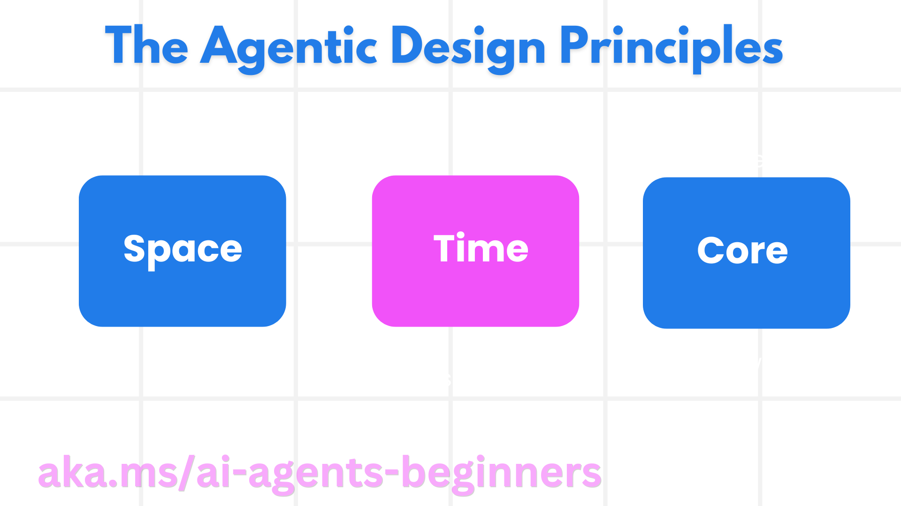

<!--
CO_OP_TRANSLATOR_METADATA:
{
  "original_hash": "4c46e4ff9e349c521e2b0b17f51afa64",
  "translation_date": "2025-08-30T15:09:11+00:00",
  "source_file": "03-agentic-design-patterns/README.md",
  "language_code": "lt"
}
-->

> _(Spustelėkite aukščiau esančią nuotrauką, kad peržiūrėtumėte šios pamokos vaizdo įrašą)_
# AI agentų dizaino principai

## Įvadas

Yra daugybė būdų, kaip kurti AI agentų sistemas. Kadangi neapibrėžtumas yra Generatyvinio AI dizaino ypatybė, o ne trūkumas, inžinieriams kartais sunku suprasti, nuo ko pradėti. Mes sukūrėme žmogui orientuotus UX dizaino principus, kurie padės kūrėjams kurti klientui orientuotas agentų sistemas, skirtas verslo poreikiams spręsti. Šie dizaino principai nėra griežta architektūra, o veikiau atspirties taškas komandoms, kurios apibrėžia ir kuria agentų patirtis.

Apskritai, agentai turėtų:

- Plėsti ir didinti žmogaus gebėjimus (idėjų generavimas, problemų sprendimas, automatizavimas ir kt.)
- Užpildyti žinių spragas (padėti susipažinti su žinių sritimis, vertimas ir kt.)
- Palengvinti ir palaikyti bendradarbiavimą taip, kaip mes, kaip individai, mėgstame dirbti su kitais
- Padėti mums tapti geresnėmis savo versijomis (pvz., gyvenimo treneris/užduočių vadovas, padedantis išmokti emocinio reguliavimo ir sąmoningumo įgūdžių, ugdyti atsparumą ir kt.)

## Šioje pamokoje aptarsime

- Kas yra agentų dizaino principai
- Kokias gaires reikėtų laikytis įgyvendinant šiuos dizaino principus
- Pavyzdžiai, kaip naudoti dizaino principus

## Mokymosi tikslai

Baigę šią pamoką, galėsite:

1. Paaiškinti, kas yra agentų dizaino principai
2. Paaiškinti gaires, kaip naudoti agentų dizaino principus
3. Suprasti, kaip sukurti agentą, naudojant agentų dizaino principus

## Agentų dizaino principai

### Agentas (Erdvė)

Tai aplinka, kurioje veikia agentas. Šie principai padeda mums kurti agentus, kurie veikia fiziniuose ir skaitmeniniuose pasauliuose.

- **Jungimas, o ne griovimas** – padėti žmonėms susisiekti su kitais žmonėmis, įvykiais ir veiksmingomis žiniomis, kad būtų skatinamas bendradarbiavimas ir ryšys.
- Agentai padeda susieti įvykius, žinias ir žmones.
- Agentai suartina žmones. Jie nėra sukurti tam, kad pakeistų ar sumenkintų žmones.
- **Lengvai pasiekiami, bet kartais nematomi** – agentas daugiausia veikia fone ir tik tada, kai tai yra aktualu ir tinkama, pateikia priminimus.
  - Agentas lengvai randamas ir pasiekiamas įgaliotiems vartotojams bet kuriame įrenginyje ar platformoje.
  - Agentas palaiko įvairius įvesties ir išvesties būdus (garsas, balsas, tekstas ir kt.).
  - Agentas gali sklandžiai pereiti iš pirmojo plano į foną; iš proaktyvaus į reaktyvų, priklausomai nuo vartotojo poreikių.
  - Agentas gali veikti nematoma forma, tačiau jo fono procesai ir bendradarbiavimas su kitais agentais yra skaidrūs ir kontroliuojami vartotojo.

### Agentas (Laikas)

Tai, kaip agentas veikia laikui bėgant. Šie principai padeda mums kurti agentus, kurie sąveikauja su praeitimi, dabartimi ir ateitimi.

- **Praeitis**: Atsižvelgimas į istoriją, apimančią tiek būseną, tiek kontekstą.
  - Agentas pateikia aktualesnius rezultatus, remdamasis turtingesnių istorinių duomenų analize, neapsiribojant tik įvykiais, žmonėmis ar būsenomis.
  - Agentas sukuria ryšius iš praeities įvykių ir aktyviai remiasi atmintimi, kad įsitrauktų į dabartines situacijas.
- **Dabar**: Skatinimas, o ne tik pranešimas.
  - Agentas įkūnija visapusišką požiūrį į sąveiką su žmonėmis. Kai įvyksta įvykis, agentas neapsiriboja statiniu pranešimu ar kita statine formalumu. Agentas gali supaprastinti procesus arba dinamiškai generuoti užuominas, kad nukreiptų vartotojo dėmesį tinkamu momentu.
  - Agentas pateikia informaciją, atsižvelgdamas į kontekstinę aplinką, socialinius ir kultūrinius pokyčius, pritaikytą vartotojo ketinimams.
  - Agentų sąveika gali būti laipsniška, evoliucionuojanti/auganti sudėtingumu, kad ilgainiui įgalintų vartotojus.
- **Ateitis**: Prisitaikymas ir evoliucija.
  - Agentas prisitaiko prie įvairių įrenginių, platformų ir modalumų.
  - Agentas prisitaiko prie vartotojo elgesio, prieinamumo poreikių ir yra laisvai pritaikomas.
  - Agentas formuojamas ir evoliucionuoja per nuolatinę vartotojo sąveiką.

### Agentas (Šerdis)

Tai pagrindiniai elementai, esantys agento dizaino šerdyje.

- **Priimti neapibrėžtumą, bet užtikrinti pasitikėjimą**.
  - Tam tikras agento neapibrėžtumo lygis yra tikėtinas. Neapibrėžtumas yra pagrindinis agento dizaino elementas.
  - Pasitikėjimas ir skaidrumas yra pagrindiniai agento dizaino sluoksniai.
  - Žmonės kontroliuoja, kada agentas yra įjungtas/išjungtas, o agento būsena visada aiškiai matoma.

## Gairės, kaip įgyvendinti šiuos principus

Naudodami ankstesnius dizaino principus, laikykitės šių gairių:

1. **Skaidrumas**: Informuokite vartotoją, kad naudojamas AI, kaip jis veikia (įskaitant ankstesnius veiksmus), kaip pateikti atsiliepimus ir modifikuoti sistemą.
2. **Kontrolė**: Leiskite vartotojui pritaikyti, nurodyti pageidavimus ir personalizuoti, bei turėti kontrolę sistemos ir jos atributų atžvilgiu (įskaitant galimybę pamiršti).
3. **Nuoseklumas**: Siekite nuoseklios, daugiarūšės patirties įvairiuose įrenginiuose ir galiniuose taškuose. Naudokite pažįstamus UI/UX elementus, kur įmanoma (pvz., mikrofono piktogramą balso sąveikai) ir kiek įmanoma sumažinkite vartotojo kognityvinę apkrovą (pvz., siekite glaustų atsakymų, vizualinių pagalbinių priemonių ir „Sužinokite daugiau“ turinio).

## Kaip sukurti kelionių agentą, naudojant šiuos principus ir gaires

Įsivaizduokite, kad kuriate kelionių agentą, štai kaip galėtumėte panaudoti dizaino principus ir gaires:

1. **Skaidrumas** – Informuokite vartotoją, kad kelionių agentas yra AI pagrindu veikiantis agentas. Pateikite keletą pagrindinių instrukcijų, kaip pradėti (pvz., „Sveiki“ žinutė, pavyzdiniai raginimai). Aiškiai dokumentuokite tai produkto puslapyje. Parodykite vartotojo anksčiau pateiktų raginimų sąrašą. Aiškiai nurodykite, kaip pateikti atsiliepimus (pvz., nykščio aukštyn ir žemyn, mygtukas „Siųsti atsiliepimą“ ir kt.). Aiškiai išdėstykite, jei agentas turi naudojimo ar temų apribojimų.
2. **Kontrolė** – Užtikrinkite, kad vartotojui būtų aišku, kaip modifikuoti agentą po jo sukūrimo, pvz., naudojant sistemos raginimą. Leiskite vartotojui pasirinkti, kaip išsamiai agentas turėtų atsakyti, jo rašymo stilių ir bet kokius apribojimus, apie ką agentas neturėtų kalbėti. Leiskite vartotojui peržiūrėti ir ištrinti susijusius failus ar duomenis, raginimus ir ankstesnius pokalbius.
3. **Nuoseklumas** – Užtikrinkite, kad piktogramos, skirtos dalintis raginimu, pridėti failą ar nuotrauką ir pažymėti ką nors ar kažką, būtų standartinės ir atpažįstamos. Naudokite sąvaržėlės piktogramą, kad nurodytumėte failų įkėlimą/dalinimąsi su agentu, ir vaizdo piktogramą, kad nurodytumėte grafikos įkėlimą.

### Turite daugiau klausimų apie AI agentų dizaino modelius?

Prisijunkite prie [Azure AI Foundry Discord](https://aka.ms/ai-agents/discord), kad susitiktumėte su kitais besimokančiais, dalyvautumėte konsultacijų valandose ir gautumėte atsakymus į savo klausimus apie AI agentus.

## Papildomi ištekliai

## Ankstesnė pamoka

[Agentų sistemų tyrinėjimas](../02-explore-agentic-frameworks/README.md)

## Kita pamoka

[Įrankių naudojimo dizaino modelis](../04-tool-use/README.md)

---

**Atsakomybės apribojimas**:  
Šis dokumentas buvo išverstas naudojant AI vertimo paslaugą [Co-op Translator](https://github.com/Azure/co-op-translator). Nors siekiame tikslumo, prašome atkreipti dėmesį, kad automatiniai vertimai gali turėti klaidų ar netikslumų. Originalus dokumentas jo gimtąja kalba turėtų būti laikomas autoritetingu šaltiniu. Kritinei informacijai rekomenduojama profesionali žmogaus vertimo paslauga. Mes neprisiimame atsakomybės už nesusipratimus ar klaidingus aiškinimus, kylančius dėl šio vertimo naudojimo.