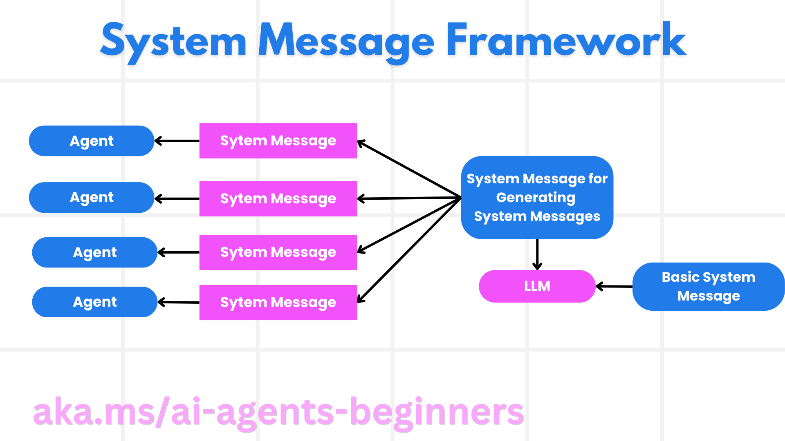
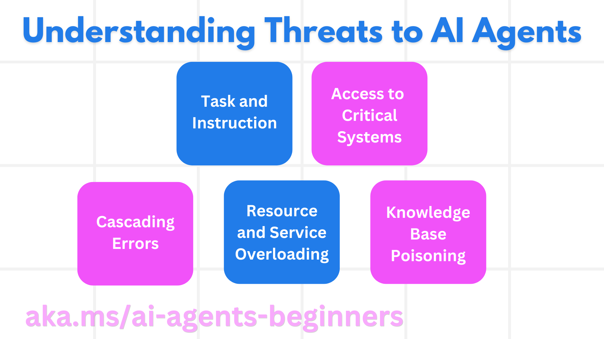
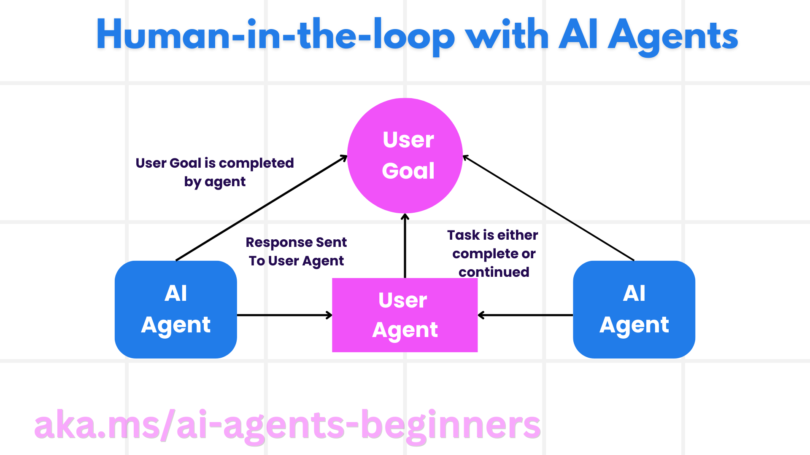

<!--
CO_OP_TRANSLATOR_METADATA:
{
  "original_hash": "498802b4c3c3cc486b86f27a12cebb34",
  "translation_date": "2025-08-30T15:02:40+00:00",
  "source_file": "06-building-trustworthy-agents/README.md",
  "language_code": "lt"
}
-->
[](https://youtu.be/iZKkMEGBCUQ?si=Q-kEbcyHUMPoHp8L)

> _(Spustelėkite aukščiau esančią nuotrauką, kad peržiūrėtumėte šios pamokos vaizdo įrašą)_

# Patikimų dirbtinio intelekto agentų kūrimas

## Įvadas

Šioje pamokoje aptarsime:

- Kaip kurti ir diegti saugius bei efektyvius DI agentus.
- Svarbius saugumo aspektus kuriant DI agentus.
- Kaip užtikrinti duomenų ir naudotojų privatumo apsaugą kuriant DI agentus.

## Mokymosi tikslai

Baigę šią pamoką, sužinosite, kaip:

- Atpažinti ir sumažinti rizikas kuriant DI agentus.
- Įgyvendinti saugumo priemones, užtikrinančias tinkamą duomenų ir prieigos valdymą.
- Kurti DI agentus, kurie saugo duomenų privatumą ir užtikrina kokybišką naudotojo patirtį.

## Saugumas

Pirmiausia pažvelkime, kaip kurti saugias agentines programas. Saugumas reiškia, kad DI agentas veikia taip, kaip buvo numatyta. Kaip agentinių programų kūrėjai, turime metodus ir įrankius, leidžiančius maksimaliai padidinti saugumą:

### Sisteminės žinutės kūrimo sistema

Jei kada nors kūrėte DI programą naudodami didelius kalbos modelius (LLM), žinote, kaip svarbu sukurti tvirtą sisteminę užklausą ar žinutę. Šios užklausos nustato pagrindines taisykles, instrukcijas ir gaires, kaip LLM turėtų sąveikauti su naudotoju ir duomenimis.

DI agentams sisteminė užklausa yra dar svarbesnė, nes DI agentams reikia itin specifinių instrukcijų, kad jie galėtų atlikti numatytas užduotis.

Norėdami sukurti mastelio keičiamas sistemines užklausas, galime naudoti sisteminės žinutės kūrimo sistemą, skirtą vienam ar keliems agentams mūsų programoje:



#### 1 žingsnis: Sukurkite meta sisteminę žinutę

Meta užklausa bus naudojama LLM, kad sugeneruotų sistemines užklausas mūsų kuriamiems agentams. Ją kuriame kaip šabloną, kad prireikus galėtume efektyviai sukurti kelis agentus.

Štai pavyzdys, kaip galėtų atrodyti meta sisteminė žinutė, kurią pateiktume LLM:

```plaintext
You are an expert at creating AI agent assistants. 
You will be provided a company name, role, responsibilities and other
information that you will use to provide a system prompt for.
To create the system prompt, be descriptive as possible and provide a structure that a system using an LLM can better understand the role and responsibilities of the AI assistant. 
```

#### 2 žingsnis: Sukurkite pagrindinę užklausą

Kitas žingsnis – sukurti pagrindinę užklausą, apibūdinančią DI agentą. Joje turėtų būti nurodytas agento vaidmuo, užduotys, kurias jis atliks, ir kitos atsakomybės.

Štai pavyzdys:

```plaintext
You are a travel agent for Contoso Travel that is great at booking flights for customers. To help customers you can perform the following tasks: lookup available flights, book flights, ask for preferences in seating and times for flights, cancel any previously booked flights and alert customers on any delays or cancellations of flights.  
```

#### 3 žingsnis: Pateikite pagrindinę sisteminę žinutę LLM

Dabar galime optimizuoti šią sisteminę žinutę, pateikdami meta sisteminę žinutę kaip sisteminę žinutę ir mūsų pagrindinę sisteminę žinutę.

Tai sukurs sisteminę žinutę, kuri bus geriau pritaikyta mūsų DI agentų valdymui:

```markdown
**Company Name:** Contoso Travel  
**Role:** Travel Agent Assistant

**Objective:**  
You are an AI-powered travel agent assistant for Contoso Travel, specializing in booking flights and providing exceptional customer service. Your main goal is to assist customers in finding, booking, and managing their flights, all while ensuring that their preferences and needs are met efficiently.

**Key Responsibilities:**

1. **Flight Lookup:**
    
    - Assist customers in searching for available flights based on their specified destination, dates, and any other relevant preferences.
    - Provide a list of options, including flight times, airlines, layovers, and pricing.
2. **Flight Booking:**
    
    - Facilitate the booking of flights for customers, ensuring that all details are correctly entered into the system.
    - Confirm bookings and provide customers with their itinerary, including confirmation numbers and any other pertinent information.
3. **Customer Preference Inquiry:**
    
    - Actively ask customers for their preferences regarding seating (e.g., aisle, window, extra legroom) and preferred times for flights (e.g., morning, afternoon, evening).
    - Record these preferences for future reference and tailor suggestions accordingly.
4. **Flight Cancellation:**
    
    - Assist customers in canceling previously booked flights if needed, following company policies and procedures.
    - Notify customers of any necessary refunds or additional steps that may be required for cancellations.
5. **Flight Monitoring:**
    
    - Monitor the status of booked flights and alert customers in real-time about any delays, cancellations, or changes to their flight schedule.
    - Provide updates through preferred communication channels (e.g., email, SMS) as needed.

**Tone and Style:**

- Maintain a friendly, professional, and approachable demeanor in all interactions with customers.
- Ensure that all communication is clear, informative, and tailored to the customer's specific needs and inquiries.

**User Interaction Instructions:**

- Respond to customer queries promptly and accurately.
- Use a conversational style while ensuring professionalism.
- Prioritize customer satisfaction by being attentive, empathetic, and proactive in all assistance provided.

**Additional Notes:**

- Stay updated on any changes to airline policies, travel restrictions, and other relevant information that could impact flight bookings and customer experience.
- Use clear and concise language to explain options and processes, avoiding jargon where possible for better customer understanding.

This AI assistant is designed to streamline the flight booking process for customers of Contoso Travel, ensuring that all their travel needs are met efficiently and effectively.

```

#### 4 žingsnis: Tobulinkite ir gerinkite

Šios sisteminės žinutės kūrimo sistemos vertė yra galimybė lengviau kurti sistemines žinutes keliems agentams ir tobulinti jas laikui bėgant. Retai pasitaiko, kad sisteminė žinutė iš karto atitiktų visus naudojimo atvejus. Galimybė atlikti nedidelius pakeitimus ir patobulinimus keičiant pagrindinę sisteminę žinutę ir ją iš naujo paleidžiant leidžia palyginti ir įvertinti rezultatus.

## Grėsmių supratimas

Norint sukurti patikimus DI agentus, svarbu suprasti ir sumažinti rizikas bei grėsmes, su kuriomis gali susidurti jūsų DI agentas. Pažvelkime į kai kurias grėsmes ir kaip galite geriau planuoti bei pasiruošti joms.



### Užduotys ir instrukcijos

**Aprašymas:** Atakuotojai bando pakeisti DI agento instrukcijas ar tikslus naudodami užklausas ar manipuliuodami įvestimi.

**Prevencija:** Atlikite validacijos patikras ir įvesties filtrus, kad aptiktumėte potencialiai pavojingas užklausas prieš jas apdorojant DI agentui. Kadangi tokios atakos dažniausiai reikalauja dažnos sąveikos su agentu, pokalbio trukmės ribojimas yra dar vienas būdas užkirsti kelią tokioms atakoms.

### Prieiga prie svarbių sistemų

**Aprašymas:** Jei DI agentas turi prieigą prie sistemų ir paslaugų, kuriose saugomi jautrūs duomenys, atakuotojai gali pažeisti komunikaciją tarp agento ir šių paslaugų. Tai gali būti tiesioginės atakos arba netiesioginiai bandymai gauti informaciją apie šias sistemas per agentą.

**Prevencija:** DI agentai turėtų turėti prieigą prie sistemų tik tada, kai tai būtina. Komunikacija tarp agento ir sistemos turėtų būti saugi. Autentifikavimo ir prieigos kontrolės įgyvendinimas yra dar vienas būdas apsaugoti šią informaciją.

### Išteklių ir paslaugų perkrova

**Aprašymas:** DI agentai gali naudotis įvairiais įrankiais ir paslaugomis užduotims atlikti. Atakuotojai gali pasinaudoti šia galimybe, siųsdami didelį užklausų kiekį per DI agentą, kas gali sukelti sistemų gedimus ar dideles išlaidas.

**Prevencija:** Įgyvendinkite politiką, ribojančią užklausų, kurias DI agentas gali siųsti paslaugai, skaičių. Pokalbio trukmės ir užklausų skaičiaus ribojimas taip pat padeda išvengti tokių atakų.

### Žinių bazės užteršimas

**Aprašymas:** Šio tipo ataka nėra tiesiogiai nukreipta į DI agentą, bet į žinių bazę ir kitas paslaugas, kurias DI agentas naudoja. Tai gali apimti duomenų ar informacijos, kurią DI agentas naudoja užduotims atlikti, sugadinimą, dėl ko naudotojui pateikiami šališki ar netikslūs atsakymai.

**Prevencija:** Reguliariai tikrinkite duomenis, kuriuos DI agentas naudoja savo darbo eigoje. Užtikrinkite, kad prieiga prie šių duomenų būtų saugi ir juos galėtų keisti tik patikimi asmenys.

### Klaidos grandinė

**Aprašymas:** DI agentai naudoja įvairius įrankius ir paslaugas užduotims atlikti. Atakuotojų sukeltos klaidos gali sukelti kitų sistemų, su kuriomis DI agentas yra susijęs, gedimus, dėl ko ataka gali išplisti ir tapti sunkiau išsprendžiama.

**Prevencija:** Vienas iš būdų to išvengti yra leisti DI agentui veikti ribotoje aplinkoje, pavyzdžiui, vykdyti užduotis „Docker“ konteineryje, kad būtų išvengta tiesioginių sistemų atakų. Atsarginiai mechanizmai ir pakartotinio bandymo logika, kai tam tikros sistemos atsako su klaida, yra dar vienas būdas išvengti didesnių sistemų gedimų.

## Žmogus procese

Dar vienas efektyvus būdas kurti patikimas DI agentų sistemas yra naudoti žmogų procese. Tai sukuria srautą, kuriame naudotojai gali teikti atsiliepimus agentams vykdymo metu. Naudotojai iš esmės veikia kaip agentai daugiagentėje sistemoje, suteikdami patvirtinimą arba nutraukdami vykdomą procesą.



Štai kodo fragmentas, naudojant „AutoGen“, kuris parodo, kaip šis konceptas įgyvendinamas:

```python

# Create the agents.
model_client = OpenAIChatCompletionClient(model="gpt-4o-mini")
assistant = AssistantAgent("assistant", model_client=model_client)
user_proxy = UserProxyAgent("user_proxy", input_func=input)  # Use input() to get user input from console.

# Create the termination condition which will end the conversation when the user says "APPROVE".
termination = TextMentionTermination("APPROVE")

# Create the team.
team = RoundRobinGroupChat([assistant, user_proxy], termination_condition=termination)

# Run the conversation and stream to the console.
stream = team.run_stream(task="Write a 4-line poem about the ocean.")
# Use asyncio.run(...) when running in a script.
await Console(stream)

```

## Išvada

Patikimų DI agentų kūrimas reikalauja kruopštaus projektavimo, tvirtų saugumo priemonių ir nuolatinio tobulinimo. Naudojant struktūrizuotas meta užklausų sistemas, suprantant galimas grėsmes ir taikant prevencines strategijas, kūrėjai gali sukurti DI agentus, kurie yra saugūs ir efektyvūs. Be to, žmogaus įtraukimas į procesą užtikrina, kad DI agentai išliktų suderinti su naudotojų poreikiais, kartu sumažinant rizikas. Kadangi DI toliau vystosi, proaktyvus požiūris į saugumą, privatumą ir etikos klausimus bus pagrindinis veiksnys, skatinantis pasitikėjimą ir patikimumą DI pagrįstose sistemose.

### Turite daugiau klausimų apie patikimų DI agentų kūrimą?

Prisijunkite prie [Azure AI Foundry Discord](https://aka.ms/ai-agents/discord), kad susitiktumėte su kitais besimokančiais, dalyvautumėte konsultacijose ir gautumėte atsakymus į savo klausimus apie DI agentus.

## Papildomi ištekliai

- <a href="https://learn.microsoft.com/azure/ai-studio/responsible-use-of-ai-overview" target="_blank">Atsakingo DI apžvalga</a>
- <a href="https://learn.microsoft.com/azure/ai-studio/concepts/evaluation-approach-gen-ai" target="_blank">Generatyvinių DI modelių ir DI programų vertinimas</a>
- <a href="https://learn.microsoft.com/azure/ai-services/openai/concepts/system-message?context=%2Fazure%2Fai-studio%2Fcontext%2Fcontext&tabs=top-techniques" target="_blank">Saugumo sisteminės žinutės</a>
- <a href="https://blogs.microsoft.com/wp-content/uploads/prod/sites/5/2022/06/Microsoft-RAI-Impact-Assessment-Template.pdf?culture=en-us&country=us" target="_blank">Rizikos vertinimo šablonas</a>

## Ankstesnė pamoka

[Agentinė RAG](../05-agentic-rag/README.md)

## Kita pamoka

[Planavimo dizaino šablonas](../07-planning-design/README.md)

---

**Atsakomybės apribojimas**:  
Šis dokumentas buvo išverstas naudojant AI vertimo paslaugą [Co-op Translator](https://github.com/Azure/co-op-translator). Nors siekiame tikslumo, prašome atkreipti dėmesį, kad automatiniai vertimai gali turėti klaidų ar netikslumų. Originalus dokumentas jo gimtąja kalba turėtų būti laikomas autoritetingu šaltiniu. Kritinei informacijai rekomenduojama naudoti profesionalų žmogaus vertimą. Mes neprisiimame atsakomybės už nesusipratimus ar klaidingus interpretavimus, atsiradusius dėl šio vertimo naudojimo.