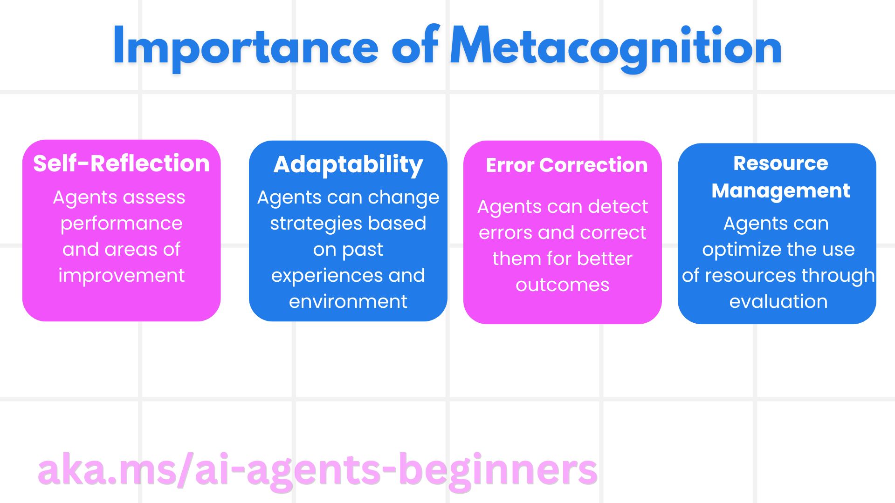

<!--
CO_OP_TRANSLATOR_METADATA:
{
  "original_hash": "5f0deef171fc3a68d5d3d770a8bfb03d",
  "translation_date": "2025-08-30T14:34:42+00:00",
  "source_file": "09-metacognition/README.md",
  "language_code": "lt"
}
-->
[](https://youtu.be/His9R6gw6Ec?si=3_RMb8VprNvdLRhX)

> _(Spustelėkite aukščiau esančią nuotrauką, kad peržiūrėtumėte šios pamokos vaizdo įrašą)_
# Metakognicija dirbtinio intelekto agentuose

## Įvadas

Sveiki atvykę į pamoką apie metakogniciją dirbtinio intelekto agentuose! Šis skyrius skirtas pradedantiesiems, kurie domisi, kaip DI agentai gali mąstyti apie savo mąstymo procesus. Pamokos pabaigoje suprasite pagrindines sąvokas ir turėsite praktinių pavyzdžių, kaip taikyti metakogniciją DI agentų kūrime.

## Mokymosi tikslai

Baigę šią pamoką, galėsite:

1. Suprasti mąstymo ciklų pasekmes agentų apibrėžimuose.
2. Naudoti planavimo ir vertinimo metodus, kad padėtumėte agentams patiems taisyti savo klaidas.
3. Kurti savo agentus, galinčius manipuliuoti kodu, kad atliktų užduotis.

## Įvadas į metakogniciją

Metakognicija reiškia aukštesnio lygio kognityvinius procesus, susijusius su mąstymu apie savo mąstymą. DI agentams tai reiškia gebėjimą įvertinti ir koreguoti savo veiksmus, remiantis savimonės ir ankstesnės patirties pagrindu. Metakognicija, arba „mąstymas apie mąstymą“, yra svarbi agentinių DI sistemų kūrimo sąvoka. Tai apima DI sistemų gebėjimą suvokti savo vidinius procesus, stebėti, reguliuoti ir pritaikyti savo elgesį. Panašiai kaip mes, kai analizuojame situaciją ar sprendžiame problemą. Ši savimonė gali padėti DI sistemoms priimti geresnius sprendimus, atpažinti klaidas ir laikui bėgant tobulinti savo veikimą – tai vėlgi siejasi su Turingo testu ir diskusijomis, ar DI perims kontrolę.

Agentinių DI sistemų kontekste metakognicija gali padėti spręsti kelias problemas, tokias kaip:
- Skaidrumas: Užtikrinti, kad DI sistemos galėtų paaiškinti savo mąstymą ir sprendimus.
- Mąstymas: Pagerinti DI sistemų gebėjimą sintezuoti informaciją ir priimti pagrįstus sprendimus.
- Prisitaikymas: Leisti DI sistemoms prisitaikyti prie naujų aplinkų ir besikeičiančių sąlygų.
- Percepcija: Pagerinti DI sistemų tikslumą atpažįstant ir interpretuojant duomenis iš aplinkos.

### Kas yra metakognicija?

Metakognicija, arba „mąstymas apie mąstymą“, yra aukštesnio lygio kognityvinis procesas, apimantis savimonę ir savo kognityvinių procesų savireguliaciją. DI srityje metakognicija suteikia agentams galimybę įvertinti ir pritaikyti savo strategijas bei veiksmus, taip pagerinant problemų sprendimo ir sprendimų priėmimo gebėjimus. Suprasdami metakogniciją, galite kurti DI agentus, kurie yra ne tik protingesni, bet ir labiau prisitaikantys bei efektyvesni. Tikroje metakognicijoje DI aiškiai mąstytų apie savo mąstymą.

Pavyzdys: „Aš prioritetą teikiau pigesniems skrydžiams, nes... galbūt praleidau tiesioginius skrydžius, todėl dar kartą patikrinsiu.“
Sekti, kaip ar kodėl buvo pasirinktas tam tikras maršrutas.
- Pastebėti, kad buvo padaryta klaidų dėl per didelio pasitikėjimo ankstesniais vartotojo pageidavimais, todėl pakeičiamas ne tik galutinis pasiūlymas, bet ir sprendimų priėmimo strategija.
- Diagnozuoti modelius, pavyzdžiui: „Kai tik vartotojas pamini „per daug žmonių“, turėčiau ne tik pašalinti tam tikras lankytinas vietas, bet ir suprasti, kad mano metodas, kai „populiariausios vietos“ reitinguojamos pagal populiarumą, yra klaidingas.“

### Metakognicijos svarba DI agentuose

Metakognicija atlieka svarbų vaidmenį DI agentų kūrime dėl kelių priežasčių:



- Savirefleksija: Agentai gali įvertinti savo veikimą ir nustatyti tobulintinas sritis.
- Prisitaikymas: Agentai gali keisti savo strategijas, remdamiesi ankstesne patirtimi ir besikeičiančiomis aplinkybėmis.
- Klaidos taisymas: Agentai gali savarankiškai aptikti ir ištaisyti klaidas, taip pasiekiant tikslesnius rezultatus.
- Išteklių valdymas: Agentai gali optimizuoti išteklių, tokių kaip laikas ir skaičiavimo galia, naudojimą, planuodami ir vertindami savo veiksmus.

## DI agento komponentai

Prieš gilindamiesi į metakognicinius procesus, svarbu suprasti pagrindinius DI agento komponentus. DI agentą paprastai sudaro:

- Persona: Agentų asmenybė ir savybės, kurios apibrėžia, kaip jie bendrauja su vartotojais.
- Įrankiai: Gebėjimai ir funkcijos, kurias agentas gali atlikti.
- Įgūdžiai: Žinios ir kompetencijos, kurias agentas turi.

Šie komponentai veikia kartu, kad sukurtų „kompetencijos vienetą“, galintį atlikti specifines užduotis.

**Pavyzdys**:
Įsivaizduokite kelionių agentą, kuris ne tik planuoja jūsų atostogas, bet ir koreguoja savo veiksmus, remdamasis realaus laiko duomenimis ir ankstesne klientų patirtimi.

### Pavyzdys: Metakognicija kelionių agento paslaugoje

Įsivaizduokite, kad kuriate DI valdomą kelionių agento paslaugą. Šis agentas, „Kelionių agentas“, padeda vartotojams planuoti jų atostogas. Norint įtraukti metakogniciją, Kelionių agentas turi įvertinti ir koreguoti savo veiksmus, remdamasis savimonės ir ankstesnės patirties pagrindu. Štai kaip metakognicija galėtų būti pritaikyta:

#### Dabartinė užduotis

Dabartinė užduotis – padėti vartotojui suplanuoti kelionę į Paryžių.

#### Užduoties atlikimo žingsniai

1. **Surinkti vartotojo pageidavimus**: Paklausti vartotojo apie jo kelionės datas, biudžetą, pomėgius (pvz., muziejai, virtuvė, apsipirkimas) ir specifinius reikalavimus.
2. **Surinkti informaciją**: Ieškoti skrydžių, apgyvendinimo, lankytinų vietų ir restoranų, atitinkančių vartotojo pageidavimus.
3. **Sukurti rekomendacijas**: Pateikti suasmenintą maršrutą su skrydžių detalėmis, viešbučių rezervacijomis ir siūlomomis veiklomis.
4. **Koreguoti pagal atsiliepimus**: Paprašyti vartotojo atsiliepimų apie rekomendacijas ir atlikti reikiamus pakeitimus.

#### Reikalingi ištekliai

- Prieiga prie skrydžių ir viešbučių rezervavimo duomenų bazių.
- Informacija apie Paryžiaus lankytinas vietas ir restoranus.
- Vartotojo atsiliepimų duomenys iš ankstesnių sąveikų.

#### Patirtis ir savirefleksija

Kelionių agentas naudoja metakogniciją, kad įvertintų savo veikimą ir mokytųsi iš ankstesnės patirties. Pavyzdžiui:

1. **Vartotojo atsiliepimų analizė**: Kelionių agentas peržiūri vartotojo atsiliepimus, kad nustatytų, kurios rekomendacijos buvo gerai įvertintos, o kurios – ne. Jis atitinkamai koreguoja savo būsimus pasiūlymus.
2. **Prisitaikymas**: Jei vartotojas anksčiau paminėjo, kad nemėgsta perpildytų vietų, Kelionių agentas ateityje vengs siūlyti populiarias turistines vietas piko valandomis.
3. **Klaidos taisymas**: Jei Kelionių agentas anksčiau padarė klaidą, pvz., pasiūlė viešbutį, kuris buvo pilnai užsakytas, jis išmoksta griežčiau tikrinti prieinamumą prieš pateikdamas rekomendacijas.

#### Praktinis kūrėjo pavyzdys

Štai supaprastintas Kelionių agento kodo pavyzdys, įtraukiantis metakogniciją:

```python
class Travel_Agent:
    def __init__(self):
        self.user_preferences = {}
        self.experience_data = []

    def gather_preferences(self, preferences):
        self.user_preferences = preferences

    def retrieve_information(self):
        # Search for flights, hotels, and attractions based on preferences
        flights = search_flights(self.user_preferences)
        hotels = search_hotels(self.user_preferences)
        attractions = search_attractions(self.user_preferences)
        return flights, hotels, attractions

    def generate_recommendations(self):
        flights, hotels, attractions = self.retrieve_information()
        itinerary = create_itinerary(flights, hotels, attractions)
        return itinerary

    def adjust_based_on_feedback(self, feedback):
        self.experience_data.append(feedback)
        # Analyze feedback and adjust future recommendations
        self.user_preferences = adjust_preferences(self.user_preferences, feedback)

# Example usage
travel_agent = Travel_Agent()
preferences = {
    "destination": "Paris",
    "dates": "2025-04-01 to 2025-04-10",
    "budget": "moderate",
    "interests": ["museums", "cuisine"]
}
travel_agent.gather_preferences(preferences)
itinerary = travel_agent.generate_recommendations()
print("Suggested Itinerary:", itinerary)
feedback = {"liked": ["Louvre Museum"], "disliked": ["Eiffel Tower (too crowded)"]}
travel_agent.adjust_based_on_feedback(feedback)
```

#### Kodėl metakognicija svarbi

- **Savirefleksija**: Agentai gali analizuoti savo veikimą ir nustatyti tobulintinas sritis.
- **Prisitaikymas**: Agentai gali keisti strategijas, remdamiesi atsiliepimais ir besikeičiančiomis sąlygomis.
- **Klaidos taisymas**: Agentai gali savarankiškai aptikti ir ištaisyti klaidas.
- **Išteklių valdymas**: Agentai gali optimizuoti išteklių naudojimą, pvz., laiką ir skaičiavimo galią.

Įtraukdami metakogniciją, Kelionių agentas gali pateikti suasmenintas ir tikslesnes kelionių rekomendacijas, taip pagerindamas bendrą vartotojo patirtį.

---

## 2. Planavimas agentuose

Planavimas yra esminė DI agentų elgesio dalis. Tai apima veiksmų, reikalingų tikslui pasiekti, planavimą, atsižvelgiant į dabartinę būseną, išteklius ir galimas kliūtis.

### Planavimo elementai

- **Dabartinė užduotis**: Aiškiai apibrėžti užduotį.
- **Užduoties atlikimo žingsniai**: Suskaidyti užduotį į valdomus žingsnius.
- **Reikalingi ištekliai**: Nustatyti reikalingus išteklius.
- **Patirtis**: Naudoti ankstesnę patirtį planavimui.

**Pavyzdys**:
Štai žingsniai, kuriuos Kelionių agentas turi atlikti, kad efektyviai padėtų vartotojui planuoti kelionę:

### Kelionių agento žingsniai

1. **Surinkti vartotojo pageidavimus**
   - Paklausti vartotojo apie kelionės datas, biudžetą, pomėgius ir specifinius reikalavimus.
   - Pavyzdžiai: „Kada planuojate keliauti?“ „Koks jūsų biudžeto diapazonas?“ „Kokios veiklos jums patinka atostogų metu?“

2. **Surinkti informaciją**
   - Ieškoti atitinkamų kelionės variantų, remiantis vartotojo pageidavimais.
   - **Skrydžiai**: Ieškoti galimų skrydžių, atitinkančių vartotojo biudžetą ir pageidaujamas kelionės datas.
   - **Apgyvendinimas**: Rasti viešbučius ar nuomojamas patalpas, atitinkančias vartotojo pageidavimus dėl vietos, kainos ir patogumų.
   - **Lankytinos vietos ir restoranai**: Nustatyti populiarias lankytinas vietas, veiklas ir maitinimo vietas, atitinkančias vartotojo pomėgius.

3. **Sukurti rekomendacijas**
   - Surinktą informaciją sudėti į suasmenintą maršrutą.
   - Pateikti detales, tokias kaip skrydžių variantai, viešbučių rezervacijos ir siūlomos veiklos, pritaikant rekomendacijas pagal vartotojo pageidavimus.

4. **Pateikti maršrutą vartotojui**
   - Pasidalinti siūlomu maršrutu su vartotoju peržiūrai.
   - Pavyzdys: „Štai siūlomas maršrutas jūsų kelionei į Paryžių. Jame yra skrydžių detalės, viešbučių rezervacijos ir rekomenduojamų veiklų bei restoranų sąrašas. Praneškite, ką manote!“

5. **Surinkti atsiliepimus**
   - Paprašyti vartotojo atsiliepimų apie siūlomą maršrutą.
   - Pavyzdžiai: „Ar jums patinka skrydžių variantai?“ „Ar viešbutis atitinka jūsų poreikius?“ „Ar yra veiklų, kurias norėtumėte pridėti ar pašalinti?“

6. **Koreguoti pagal atsiliepimus**
   - Pakeisti maršrutą pagal vartotojo atsiliepimus.
   - Atlikti reikiamus pakeitimus skrydžių, apgyvendinimo ir veiklų rekomendacijose, kad jos geriau atitiktų vartotojo pageidavimus.

7. **Galutinis patvirtinimas**
   - Pateikti atnaujintą maršrutą vartotojui galutiniam patvirtinimui.
   - Pavyzdys: „Atlikau pakeitimus pagal jūsų atsiliepimus. Štai atnaujintas maršrutas. Ar viskas jums tinka?“

8. **Rezervuoti ir patvirtinti užsakymus**
   - Kai vartotojas patvirtina maršrutą, atlikti skrydžių, apgyvendinimo ir iš anksto suplanuotų veiklų rezervacijas.
   - Išsiųsti patvirtinimo detales vartotojui.

9. **Teikti nuolatinę pagalbą**
   - Likti pasiekiamam, kad padėtumėte vartotojui su bet kokiais pakeitimais ar papildomais prašymais prieš kelionę ir jos metu.
   - Pavyzdys: „Jei jums reikės papildomos pagalbos kelionės metu, bet kada kreipkitės į mane!“

### Pavyzdinė sąveika

```python
class Travel_Agent:
    def __init__(self):
        self.user_preferences = {}
        self.experience_data = []

    def gather_preferences(self, preferences):
        self.user_preferences = preferences

    def retrieve_information(self):
        flights = search_flights(self.user_preferences)
        hotels = search_hotels(self.user_preferences)
        attractions = search_attractions(self.user_preferences)
        return flights, hotels, attractions

    def generate_recommendations(self):
        flights, hotels, attractions = self.retrieve_information()
        itinerary = create_itinerary(flights, hotels, attractions)
        return itinerary

    def adjust_based_on_feedback(self, feedback):
        self.experience_data.append(feedback)
        self.user_preferences = adjust_preferences(self.user_preferences, feedback)

# Example usage within a booing request
travel_agent = Travel_Agent()
preferences = {
    "destination": "Paris",
    "dates": "2025-04-01 to 2025-04-10",
    "budget": "moderate",
    "interests": ["museums", "cuisine"]
}
travel_agent.gather_preferences(preferences)
itinerary = travel_agent.generate_recommendations()
print("Suggested Itinerary:", itinerary)
feedback = {"liked": ["Louvre Museum"], "disliked": ["Eiffel Tower (too crowded)"]}
travel_agent.adjust_based_on_feedback(feedback)
```

## 3. Korekcinė RAG sistema

Pirmiausia pradėkime nuo skirtumo tarp RAG įrankio ir išankstinio konteksto įkėlimo supratimo.


### Informacijos paieška su generavimu (RAG)

RAG sujungia paieškos sistemą su generavimo modeliu. Kai pateikiamas užklausimas, paieškos sistema surenka atitinkamus dokumentus ar duomenis iš išorinio šaltinio, o ši surinkta informacija naudojama generavimo modelio įvestyje. Tai padeda modeliui generuoti tikslesnius ir kontekstualiai tinkamus atsakymus.

RAG sistemoje agentas surenka atitinkamą informaciją iš žinių bazės ir naudoja ją tinkamiems atsakymams ar veiksmams generuoti.

### Korekcinis RAG metodas

Korekcinis RAG metodas orientuojasi į RAG technikų naudojimą klaidoms taisyti ir DI agentų tikslumui gerinti. Tai apima:

1. **Užklausų formulavimas**: Naudojant specifines užklausas, kad agentas surinktų tinkamą informaciją.
2. **Įrankis**: Algoritmų ir mechanizmų įgyvendinimas, leidžiantis agentui įvertinti surinktos informacijos tinkamumą ir generuoti tikslius atsakymus.
3. **Vertinimas**: Nuolatinis agento veikimo vertinimas ir koregavimas, siekiant pagerinti tikslumą ir efektyvumą.

#### Pavyzdys: Korekcinis RAG paieškos agente

Įsivaizduokite paieškos agentą, kuris surenka informaciją iš interneto, kad atsakytų į vartotojo užklausas. Korekcinis RAG metodas galėtų apimti:

1. **Užklausų formulavimas**: Užklausų formavimas pagal vartotojo įvestį.
2. **Įrankis**: Natūralios kalbos apdorojimo ir mašininio mokymosi algoritmų naudojimas paieškos rezultatų reitingavimui ir filtravimui.
3. **Vertinimas**: Vartotojo atsiliepimų analizė, siekiant nustaty
```python
class Travel_Agent:
    def __init__(self):
        self.user_preferences = {}
        self.experience_data = []

    def gather_preferences(self, preferences):
        self.user_preferences = preferences

    def retrieve_information(self):
        flights = search_flights(self.user_preferences)
        hotels = search_hotels(self.user_preferences)
        attractions = search_attractions(self.user_preferences)
        return flights, hotels, attractions

    def generate_recommendations(self):
        flights, hotels, attractions = self.retrieve_information()
        itinerary = create_itinerary(flights, hotels, attractions)
        return itinerary

    def adjust_based_on_feedback(self, feedback):
        self.experience_data.append(feedback)
        self.user_preferences = adjust_preferences(self.user_preferences, feedback)
        new_itinerary = self.generate_recommendations()
        return new_itinerary

# Example usage
travel_agent = Travel_Agent()
preferences = {
    "destination": "Paris",
    "dates": "2025-04-01 to 2025-04-10",
    "budget": "moderate",
    "interests": ["museums", "cuisine"]
}
travel_agent.gather_preferences(preferences)
itinerary = travel_agent.generate_recommendations()
print("Suggested Itinerary:", itinerary)
feedback = {"liked": ["Louvre Museum"], "disliked": ["Eiffel Tower (too crowded)"]}
new_itinerary = travel_agent.adjust_based_on_feedback(feedback)
print("Updated Itinerary:", new_itinerary)
```

### Išankstinis konteksto įkėlimas

Išankstinis konteksto įkėlimas apima svarbios informacijos ar konteksto įkėlimą į modelį prieš apdorojant užklausą. Tai reiškia, kad modelis nuo pat pradžių turi prieigą prie šios informacijos, kas padeda jam generuoti labiau pagrįstus atsakymus, nereikalaujant papildomų duomenų paieškos proceso metu.

Štai supaprastintas pavyzdys, kaip išankstinis konteksto įkėlimas gali atrodyti kelionių agento programoje, parašytoje Python kalba:

```python
class TravelAgent:
    def __init__(self):
        # Pre-load popular destinations and their information
        self.context = {
            "Paris": {"country": "France", "currency": "Euro", "language": "French", "attractions": ["Eiffel Tower", "Louvre Museum"]},
            "Tokyo": {"country": "Japan", "currency": "Yen", "language": "Japanese", "attractions": ["Tokyo Tower", "Shibuya Crossing"]},
            "New York": {"country": "USA", "currency": "Dollar", "language": "English", "attractions": ["Statue of Liberty", "Times Square"]},
            "Sydney": {"country": "Australia", "currency": "Dollar", "language": "English", "attractions": ["Sydney Opera House", "Bondi Beach"]}
        }

    def get_destination_info(self, destination):
        # Fetch destination information from pre-loaded context
        info = self.context.get(destination)
        if info:
            return f"{destination}:\nCountry: {info['country']}\nCurrency: {info['currency']}\nLanguage: {info['language']}\nAttractions: {', '.join(info['attractions'])}"
        else:
            return f"Sorry, we don't have information on {destination}."

# Example usage
travel_agent = TravelAgent()
print(travel_agent.get_destination_info("Paris"))
print(travel_agent.get_destination_info("Tokyo"))
```

#### Paaiškinimas

1. **Inicijavimas (`__init__` metodas)**: `TravelAgent` klasė iš anksto įkelia žodyną, kuriame yra informacija apie populiarias kelionių vietas, tokias kaip Paryžius, Tokijas, Niujorkas ir Sidnėjus. Šiame žodyne pateikiama informacija apie šalį, valiutą, kalbą ir pagrindines lankytinas vietas.

2. **Informacijos gavimas (`get_destination_info` metodas)**: Kai vartotojas teiraujasi apie konkrečią vietą, `get_destination_info` metodas iš anksto įkelto žodyno gauna atitinkamą informaciją.

Iš anksto įkėlus kontekstą, kelionių agento programa gali greitai atsakyti į vartotojo užklausas, nereikalaudama realiuoju laiku gauti šios informacijos iš išorinio šaltinio. Tai daro programą efektyvesnę ir greitesnę.

### Plano kūrimas su tikslu prieš iteraciją

Plano kūrimas su aiškiu tikslu reiškia pradėti nuo aiškiai apibrėžto tikslo ar norimo rezultato. Apibrėžus šį tikslą iš anksto, modelis gali naudoti jį kaip orientyrą viso iteracinio proceso metu. Tai padeda užtikrinti, kad kiekviena iteracija priartintų prie norimo rezultato, padarydama procesą efektyvesnį ir labiau orientuotą.

Štai pavyzdys, kaip galima sukurti kelionių planą su tikslu prieš pradedant iteraciją kelionių agento programoje, parašytoje Python kalba:

### Scenarijus

Kelionių agentas nori suplanuoti individualią atostogų kelionę klientui. Tikslas – sukurti kelionės maršrutą, kuris maksimaliai atitiktų kliento poreikius ir biudžetą.

### Žingsniai

1. Apibrėžti kliento poreikius ir biudžetą.
2. Sukurti pradinį planą, remiantis šiais poreikiais.
3. Iteruoti, kad planas būtų patobulintas, optimizuojant kliento pasitenkinimą.

#### Python kodas

```python
class TravelAgent:
    def __init__(self, destinations):
        self.destinations = destinations

    def bootstrap_plan(self, preferences, budget):
        plan = []
        total_cost = 0

        for destination in self.destinations:
            if total_cost + destination['cost'] <= budget and self.match_preferences(destination, preferences):
                plan.append(destination)
                total_cost += destination['cost']

        return plan

    def match_preferences(self, destination, preferences):
        for key, value in preferences.items():
            if destination.get(key) != value:
                return False
        return True

    def iterate_plan(self, plan, preferences, budget):
        for i in range(len(plan)):
            for destination in self.destinations:
                if destination not in plan and self.match_preferences(destination, preferences) and self.calculate_cost(plan, destination) <= budget:
                    plan[i] = destination
                    break
        return plan

    def calculate_cost(self, plan, new_destination):
        return sum(destination['cost'] for destination in plan) + new_destination['cost']

# Example usage
destinations = [
    {"name": "Paris", "cost": 1000, "activity": "sightseeing"},
    {"name": "Tokyo", "cost": 1200, "activity": "shopping"},
    {"name": "New York", "cost": 900, "activity": "sightseeing"},
    {"name": "Sydney", "cost": 1100, "activity": "beach"},
]

preferences = {"activity": "sightseeing"}
budget = 2000

travel_agent = TravelAgent(destinations)
initial_plan = travel_agent.bootstrap_plan(preferences, budget)
print("Initial Plan:", initial_plan)

refined_plan = travel_agent.iterate_plan(initial_plan, preferences, budget)
print("Refined Plan:", refined_plan)
```

#### Kodo paaiškinimas

1. **Inicijavimas (`__init__` metodas)**: `TravelAgent` klasė inicijuojama su galimų kelionių vietų sąrašu, kuriame pateikiami tokie atributai kaip pavadinimas, kaina ir veiklos tipas.

2. **Plano kūrimas (`bootstrap_plan` metodas)**: Šis metodas sukuria pradinį kelionės planą, remdamasis kliento poreikiais ir biudžetu. Jis peržiūri vietų sąrašą ir prideda jas į planą, jei jos atitinka kliento poreikius ir telpa į biudžetą.

3. **Poreikių atitikimas (`match_preferences` metodas)**: Šis metodas tikrina, ar vieta atitinka kliento poreikius.

4. **Plano iteravimas (`iterate_plan` metodas)**: Šis metodas tobulina pradinį planą, bandydamas pakeisti kiekvieną vietą plane geresne alternatyva, atsižvelgiant į kliento poreikius ir biudžeto apribojimus.

5. **Kainos skaičiavimas (`calculate_cost` metodas)**: Šis metodas apskaičiuoja dabartinio plano, įskaitant galimą naują vietą, bendrą kainą.

#### Naudojimo pavyzdys

- **Pradinis planas**: Kelionių agentas sukuria pradinį planą, remdamasis kliento poreikiais dėl lankytinų vietų ir biudžeto iki 2000 USD.
- **Patobulintas planas**: Kelionių agentas iteruoja planą, optimizuodamas pagal kliento poreikius ir biudžetą.

Sukūrus planą su aiškiu tikslu (pvz., maksimaliai padidinti kliento pasitenkinimą) ir iteruojant, kad planas būtų patobulintas, kelionių agentas gali sukurti individualų ir optimizuotą kelionės maršrutą klientui. Šis požiūris užtikrina, kad kelionės planas nuo pat pradžių atitiktų kliento poreikius ir biudžetą bei gerėtų su kiekviena iteracija.

### LLM panaudojimas reitingavimui ir vertinimui

Dideli kalbos modeliai (LLM) gali būti naudojami reitingavimui ir vertinimui, įvertinant gautų dokumentų ar sugeneruotų atsakymų aktualumą ir kokybę. Štai kaip tai veikia:

**Gavimas:** Pradiniame etape pagal užklausą surenkamas kandidatų dokumentų ar atsakymų rinkinys.

**Reitingavimas:** LLM įvertina šiuos kandidatus ir perrikiuoja juos pagal aktualumą ir kokybę. Šis žingsnis užtikrina, kad pirmiausia būtų pateikta aktualiausia ir aukščiausios kokybės informacija.

**Vertinimas:** LLM priskiria kiekvienam kandidatui balą, atspindintį jų aktualumą ir kokybę. Tai padeda pasirinkti geriausią atsakymą ar dokumentą vartotojui.

Naudojant LLM reitingavimui ir vertinimui, sistema gali pateikti tikslesnę ir kontekstualiai tinkamesnę informaciją, pagerindama bendrą vartotojo patirtį.

Štai pavyzdys, kaip kelionių agentas gali naudoti didelį kalbos modelį (LLM), kad reitinguotų ir vertintų kelionių vietas pagal vartotojo poreikius, parašytas Python kalba:

#### Scenarijus – Kelionės pagal poreikius

Kelionių agentas nori rekomenduoti geriausias kelionių vietas klientui pagal jo poreikius. LLM padės perrikiuoti ir įvertinti vietas, kad būtų pateiktos tinkamiausios parinktys.

#### Žingsniai:

1. Surinkti vartotojo poreikius.
2. Gauti galimų kelionių vietų sąrašą.
3. Naudoti LLM, kad perrikiuotų ir įvertintų vietas pagal vartotojo poreikius.

Štai kaip galima atnaujinti ankstesnį pavyzdį, naudojant Azure OpenAI paslaugas:

#### Reikalavimai

1. Turėti Azure prenumeratą.
2. Sukurti Azure OpenAI išteklių ir gauti API raktą.

#### Python kodo pavyzdys

```python
import requests
import json

class TravelAgent:
    def __init__(self, destinations):
        self.destinations = destinations

    def get_recommendations(self, preferences, api_key, endpoint):
        # Generate a prompt for the Azure OpenAI
        prompt = self.generate_prompt(preferences)
        
        # Define headers and payload for the request
        headers = {
            'Content-Type': 'application/json',
            'Authorization': f'Bearer {api_key}'
        }
        payload = {
            "prompt": prompt,
            "max_tokens": 150,
            "temperature": 0.7
        }
        
        # Call the Azure OpenAI API to get the re-ranked and scored destinations
        response = requests.post(endpoint, headers=headers, json=payload)
        response_data = response.json()
        
        # Extract and return the recommendations
        recommendations = response_data['choices'][0]['text'].strip().split('\n')
        return recommendations

    def generate_prompt(self, preferences):
        prompt = "Here are the travel destinations ranked and scored based on the following user preferences:\n"
        for key, value in preferences.items():
            prompt += f"{key}: {value}\n"
        prompt += "\nDestinations:\n"
        for destination in self.destinations:
            prompt += f"- {destination['name']}: {destination['description']}\n"
        return prompt

# Example usage
destinations = [
    {"name": "Paris", "description": "City of lights, known for its art, fashion, and culture."},
    {"name": "Tokyo", "description": "Vibrant city, famous for its modernity and traditional temples."},
    {"name": "New York", "description": "The city that never sleeps, with iconic landmarks and diverse culture."},
    {"name": "Sydney", "description": "Beautiful harbour city, known for its opera house and stunning beaches."},
]

preferences = {"activity": "sightseeing", "culture": "diverse"}
api_key = 'your_azure_openai_api_key'
endpoint = 'https://your-endpoint.com/openai/deployments/your-deployment-name/completions?api-version=2022-12-01'

travel_agent = TravelAgent(destinations)
recommendations = travel_agent.get_recommendations(preferences, api_key, endpoint)
print("Recommended Destinations:")
for rec in recommendations:
    print(rec)
```

#### Kodo paaiškinimas – Poreikių atitikimo įrankis

1. **Inicijavimas**: `TravelAgent` klasė inicijuojama su galimų kelionių vietų sąrašu, kuriame pateikiami tokie atributai kaip pavadinimas ir aprašymas.

2. **Rekomendacijų gavimas (`get_recommendations` metodas)**: Šis metodas sugeneruoja užklausą Azure OpenAI paslaugai, remdamasis vartotojo poreikiais, ir siunčia HTTP POST užklausą į Azure OpenAI API, kad gautų perrikiuotas ir įvertintas vietas.

3. **Užklausos generavimas (`generate_prompt` metodas)**: Šis metodas sukuria užklausą Azure OpenAI, įtraukiant vartotojo poreikius ir vietų sąrašą. Užklausa nukreipia modelį perrikiuoti ir įvertinti vietas pagal pateiktus poreikius.

4. **API užklausa**: Naudojama `requests` biblioteka HTTP POST užklausai į Azure OpenAI API galinį tašką. Atsakyme pateikiamos perrikiuotos ir įvertintos vietos.

5. **Naudojimo pavyzdys**: Kelionių agentas surenka vartotojo poreikius (pvz., susidomėjimą lankytinomis vietomis ir įvairia kultūra) ir naudoja Azure OpenAI paslaugą, kad gautų perrikiuotas ir įvertintas kelionių rekomendacijas.

Nepamirškite pakeisti `your_azure_openai_api_key` savo tikruoju Azure OpenAI API raktu ir `https://your-endpoint.com/...` tikruoju Azure OpenAI diegimo galiniu tašku.

Naudojant LLM reitingavimui ir vertinimui, kelionių agentas gali pateikti labiau suasmenintas ir tinkamesnes kelionių rekomendacijas klientams, pagerindamas jų bendrą patirtį.
#### Praktinis pavyzdys: paieška su ketinimu kelionių agentūroje

Pažvelkime į Kelionių agentūrą kaip pavyzdį, kad suprastume, kaip galima įgyvendinti paiešką su ketinimu.

1. **Vartotojo pageidavimų rinkimas**

   ```python
   class Travel_Agent:
       def __init__(self):
           self.user_preferences = {}

       def gather_preferences(self, preferences):
           self.user_preferences = preferences
   ```

2. **Vartotojo ketinimų supratimas**

   ```python
   def identify_intent(query):
       if "book" in query or "purchase" in query:
           return "transactional"
       elif "website" in query or "official" in query:
           return "navigational"
       else:
           return "informational"
   ```

3. **Konteksto suvokimas**

   ```python
   def analyze_context(query, user_history):
       # Combine current query with user history to understand context
       context = {
           "current_query": query,
           "user_history": user_history
       }
       return context
   ```

4. **Paieška ir rezultatų personalizavimas**

   ```python
   def search_with_intent(query, preferences, user_history):
       intent = identify_intent(query)
       context = analyze_context(query, user_history)
       if intent == "informational":
           search_results = search_information(query, preferences)
       elif intent == "navigational":
           search_results = search_navigation(query)
       elif intent == "transactional":
           search_results = search_transaction(query, preferences)
       personalized_results = personalize_results(search_results, user_history)
       return personalized_results

   def search_information(query, preferences):
       # Example search logic for informational intent
       results = search_web(f"best {preferences['interests']} in {preferences['destination']}")
       return results

   def search_navigation(query):
       # Example search logic for navigational intent
       results = search_web(query)
       return results

   def search_transaction(query, preferences):
       # Example search logic for transactional intent
       results = search_web(f"book {query} to {preferences['destination']}")
       return results

   def personalize_results(results, user_history):
       # Example personalization logic
       personalized = [result for result in results if result not in user_history]
       return personalized[:10]  # Return top 10 personalized results
   ```

5. **Naudojimo pavyzdys**

   ```python
   travel_agent = Travel_Agent()
   preferences = {
       "destination": "Paris",
       "interests": ["museums", "cuisine"]
   }
   travel_agent.gather_preferences(preferences)
   user_history = ["Louvre Museum website", "Book flight to Paris"]
   query = "best museums in Paris"
   results = search_with_intent(query, preferences, user_history)
   print("Search Results:", results)
   ```

---

## 4. Kodo generavimas kaip įrankis

Kodo generavimo agentai naudoja AI modelius, kad rašytų ir vykdytų kodą, spręstų sudėtingas problemas ir automatizuotų užduotis.

### Kodo generavimo agentai

Kodo generavimo agentai naudoja generatyvinius AI modelius, kad rašytų ir vykdytų kodą. Šie agentai gali spręsti sudėtingas problemas, automatizuoti užduotis ir teikti vertingas įžvalgas, generuodami ir vykdydami kodą įvairiomis programavimo kalbomis.

#### Praktinės taikymo sritys

1. **Automatinis kodo generavimas**: Generuoti kodo fragmentus specifinėms užduotims, tokioms kaip duomenų analizė, interneto duomenų rinkimas ar mašininis mokymasis.
2. **SQL kaip RAG**: Naudoti SQL užklausas duomenų gavimui ir manipuliavimui duomenų bazėse.
3. **Problemų sprendimas**: Kurti ir vykdyti kodą specifinėms problemoms spręsti, tokioms kaip algoritmų optimizavimas ar duomenų analizė.

#### Pavyzdys: kodo generavimo agentas duomenų analizei

Įsivaizduokite, kad kuriate kodo generavimo agentą. Štai kaip jis galėtų veikti:

1. **Užduotis**: Analizuoti duomenų rinkinį, kad būtų nustatytos tendencijos ir modeliai.
2. **Žingsniai**:
   - Įkelti duomenų rinkinį į analizės įrankį.
   - Generuoti SQL užklausas duomenų filtravimui ir agregavimui.
   - Vykdyti užklausas ir gauti rezultatus.
   - Naudoti rezultatus vizualizacijoms ir įžvalgoms generuoti.
3. **Reikalingi ištekliai**: Prieiga prie duomenų rinkinio, duomenų analizės įrankiai ir SQL galimybės.
4. **Patirtis**: Naudoti ankstesnių analizių rezultatus, kad būtų pagerintas būsimų analizių tikslumas ir aktualumas.

### Pavyzdys: kodo generavimo agentas kelionių agentūrai

Šiame pavyzdyje sukursime kodo generavimo agentą, Kelionių agentą, kuris padės vartotojams planuoti keliones, generuodamas ir vykdydamas kodą. Šis agentas gali atlikti užduotis, tokias kaip kelionių pasirinkimų paieška, rezultatų filtravimas ir maršruto sudarymas naudojant generatyvinį AI.

#### Kodo generavimo agento apžvalga

1. **Vartotojo pageidavimų rinkimas**: Surenka vartotojo įvestį, tokią kaip kelionės tikslas, datos, biudžetas ir interesai.
2. **Kodo generavimas duomenų gavimui**: Generuoja kodo fragmentus, kad gautų informaciją apie skrydžius, viešbučius ir lankytinas vietas.
3. **Generuoto kodo vykdymas**: Vykdo generuotą kodą, kad gautų realaus laiko informaciją.
4. **Maršruto sudarymas**: Sudaro asmeninį kelionės planą iš gautų duomenų.
5. **Tobulinimas pagal atsiliepimus**: Priima vartotojo atsiliepimus ir, jei reikia, generuoja kodą iš naujo, kad patobulintų rezultatus.

#### Žingsnis po žingsnio įgyvendinimas

1. **Vartotojo pageidavimų rinkimas**

   ```python
   class Travel_Agent:
       def __init__(self):
           self.user_preferences = {}

       def gather_preferences(self, preferences):
           self.user_preferences = preferences
   ```

2. **Kodo generavimas duomenų gavimui**

   ```python
   def generate_code_to_fetch_data(preferences):
       # Example: Generate code to search for flights based on user preferences
       code = f"""
       def search_flights():
           import requests
           response = requests.get('https://api.example.com/flights', params={preferences})
           return response.json()
       """
       return code

   def generate_code_to_fetch_hotels(preferences):
       # Example: Generate code to search for hotels
       code = f"""
       def search_hotels():
           import requests
           response = requests.get('https://api.example.com/hotels', params={preferences})
           return response.json()
       """
       return code
   ```

3. **Generuoto kodo vykdymas**

   ```python
   def execute_code(code):
       # Execute the generated code using exec
       exec(code)
       result = locals()
       return result

   travel_agent = Travel_Agent()
   preferences = {
       "destination": "Paris",
       "dates": "2025-04-01 to 2025-04-10",
       "budget": "moderate",
       "interests": ["museums", "cuisine"]
   }
   travel_agent.gather_preferences(preferences)
   
   flight_code = generate_code_to_fetch_data(preferences)
   hotel_code = generate_code_to_fetch_hotels(preferences)
   
   flights = execute_code(flight_code)
   hotels = execute_code(hotel_code)

   print("Flight Options:", flights)
   print("Hotel Options:", hotels)
   ```

4. **Maršruto sudarymas**

   ```python
   def generate_itinerary(flights, hotels, attractions):
       itinerary = {
           "flights": flights,
           "hotels": hotels,
           "attractions": attractions
       }
       return itinerary

   attractions = search_attractions(preferences)
   itinerary = generate_itinerary(flights, hotels, attractions)
   print("Suggested Itinerary:", itinerary)
   ```

5. **Tobulinimas pagal atsiliepimus**

   ```python
   def adjust_based_on_feedback(feedback, preferences):
       # Adjust preferences based on user feedback
       if "liked" in feedback:
           preferences["favorites"] = feedback["liked"]
       if "disliked" in feedback:
           preferences["avoid"] = feedback["disliked"]
       return preferences

   feedback = {"liked": ["Louvre Museum"], "disliked": ["Eiffel Tower (too crowded)"]}
   updated_preferences = adjust_based_on_feedback(feedback, preferences)
   
   # Regenerate and execute code with updated preferences
   updated_flight_code = generate_code_to_fetch_data(updated_preferences)
   updated_hotel_code = generate_code_to_fetch_hotels(updated_preferences)
   
   updated_flights = execute_code(updated_flight_code)
   updated_hotels = execute_code(updated_hotel_code)
   
   updated_itinerary = generate_itinerary(updated_flights, updated_hotels, attractions)
   print("Updated Itinerary:", updated_itinerary)
   ```

### Aplinkos suvokimo ir samprotavimo panaudojimas

Lentelės schemos supratimas gali pagerinti užklausų generavimo procesą, pasitelkiant aplinkos suvokimą ir samprotavimą.

Štai pavyzdys, kaip tai galima padaryti:

1. **Schemos supratimas**: Sistema supras lentelės schemą ir naudos šią informaciją užklausų generavimui.
2. **Tobulinimas pagal atsiliepimus**: Sistema koreguos vartotojo pageidavimus pagal atsiliepimus ir samprotaus, kuriuos schemos laukus reikia atnaujinti.
3. **Užklausų generavimas ir vykdymas**: Sistema generuos ir vykdys užklausas, kad gautų atnaujintus skrydžių ir viešbučių duomenis pagal naujus pageidavimus.

Štai atnaujintas Python kodo pavyzdys, kuris įtraukia šias koncepcijas:

```python
def adjust_based_on_feedback(feedback, preferences, schema):
    # Adjust preferences based on user feedback
    if "liked" in feedback:
        preferences["favorites"] = feedback["liked"]
    if "disliked" in feedback:
        preferences["avoid"] = feedback["disliked"]
    # Reasoning based on schema to adjust other related preferences
    for field in schema:
        if field in preferences:
            preferences[field] = adjust_based_on_environment(feedback, field, schema)
    return preferences

def adjust_based_on_environment(feedback, field, schema):
    # Custom logic to adjust preferences based on schema and feedback
    if field in feedback["liked"]:
        return schema[field]["positive_adjustment"]
    elif field in feedback["disliked"]:
        return schema[field]["negative_adjustment"]
    return schema[field]["default"]

def generate_code_to_fetch_data(preferences):
    # Generate code to fetch flight data based on updated preferences
    return f"fetch_flights(preferences={preferences})"

def generate_code_to_fetch_hotels(preferences):
    # Generate code to fetch hotel data based on updated preferences
    return f"fetch_hotels(preferences={preferences})"

def execute_code(code):
    # Simulate execution of code and return mock data
    return {"data": f"Executed: {code}"}

def generate_itinerary(flights, hotels, attractions):
    # Generate itinerary based on flights, hotels, and attractions
    return {"flights": flights, "hotels": hotels, "attractions": attractions}

# Example schema
schema = {
    "favorites": {"positive_adjustment": "increase", "negative_adjustment": "decrease", "default": "neutral"},
    "avoid": {"positive_adjustment": "decrease", "negative_adjustment": "increase", "default": "neutral"}
}

# Example usage
preferences = {"favorites": "sightseeing", "avoid": "crowded places"}
feedback = {"liked": ["Louvre Museum"], "disliked": ["Eiffel Tower (too crowded)"]}
updated_preferences = adjust_based_on_feedback(feedback, preferences, schema)

# Regenerate and execute code with updated preferences
updated_flight_code = generate_code_to_fetch_data(updated_preferences)
updated_hotel_code = generate_code_to_fetch_hotels(updated_preferences)

updated_flights = execute_code(updated_flight_code)
updated_hotels = execute_code(updated_hotel_code)

updated_itinerary = generate_itinerary(updated_flights, updated_hotels, feedback["liked"])
print("Updated Itinerary:", updated_itinerary)
```

#### Paaiškinimas - rezervavimas pagal atsiliepimus

1. **Schemos suvokimas**: `schema` žodynas apibrėžia, kaip pageidavimai turėtų būti koreguojami pagal atsiliepimus. Jame yra tokie laukai kaip `favorites` ir `avoid`, su atitinkamais koregavimais.
2. **Pageidavimų koregavimas (`adjust_based_on_feedback` metodas)**: Šis metodas koreguoja pageidavimus pagal vartotojo atsiliepimus ir schemą.
3. **Aplinkos pagrindu atliekami koregavimai (`adjust_based_on_environment` metodas)**: Šis metodas pritaiko koregavimus pagal schemą ir atsiliepimus.
4. **Užklausų generavimas ir vykdymas**: Sistema generuoja kodą, kad gautų atnaujintus skrydžių ir viešbučių duomenis pagal koreguotus pageidavimus, ir simuliuoja šių užklausų vykdymą.
5. **Maršruto sudarymas**: Sistema sukuria atnaujintą maršrutą pagal naujus skrydžių, viešbučių ir lankytinų vietų duomenis.

Padarydama sistemą aplinkos suvokiančią ir samprotaujančią pagal schemą, ji gali generuoti tikslesnes ir aktualesnes užklausas, taip užtikrindama geresnes kelionių rekomendacijas ir labiau personalizuotą vartotojo patirtį.

### SQL naudojimas kaip Retrieval-Augmented Generation (RAG) technika

SQL (struktūrinė užklausų kalba) yra galingas įrankis darbui su duomenų bazėmis. Naudojant SQL kaip Retrieval-Augmented Generation (RAG) metodą, galima gauti aktualius duomenis iš duomenų bazių, kad būtų informuojami ir generuojami atsakymai ar veiksmai AI agentuose. Pažvelkime, kaip SQL gali būti naudojamas kaip RAG technika Kelionių agentūros kontekste.

#### Pagrindinės sąvokos

1. **Darbas su duomenų bazėmis**:
   - SQL naudojamas užklausoms duomenų bazėse, informacijos gavimui ir duomenų manipuliavimui.
   - Pavyzdys: Skrydžių detalių, viešbučių informacijos ir lankytinų vietų gavimas iš kelionių duomenų bazės.

2. **Integracija su RAG**:
   - SQL užklausos generuojamos pagal vartotojo įvestį ir pageidavimus.
   - Gauti duomenys naudojami personalizuotoms rekomendacijoms ar veiksmams generuoti.

3. **Dinaminis užklausų generavimas**:
   - AI agentas generuoja dinamiškas SQL užklausas pagal kontekstą ir vartotojo poreikius.
   - Pavyzdys: SQL užklausų pritaikymas rezultatų filtravimui pagal biudžetą, datas ir interesus.

#### Taikymo sritys

- **Automatinis kodo generavimas**: Generuoti kodo fragmentus specifinėms užduotims.
- **SQL kaip RAG**: Naudoti SQL užklausas duomenų manipuliavimui.
- **Problemų sprendimas**: Kurti ir vykdyti kodą problemoms spręsti.

**Pavyzdys**:
Duomenų analizės agentas:

1. **Užduotis**: Analizuoti duomenų rinkinį, kad būtų nustatytos tendencijos.
2. **Žingsniai**:
   - Įkelti duomenų rinkinį.
   - Generuoti SQL užklausas duomenų filtravimui.
   - Vykdyti užklausas ir gauti rezultatus.
   - Generuoti vizualizacijas ir įžvalgas.
3. **Ištekliai**: Prieiga prie duomenų rinkinio, SQL galimybės.
4. **Patirtis**: Naudoti ankstesnių rezultatų įžvalgas, kad būtų pagerintos būsimų analizių kokybė.

#### Praktinis pavyzdys: SQL naudojimas Kelionių agentūroje

1. **Vartotojo pageidavimų rinkimas**

   ```python
   class Travel_Agent:
       def __init__(self):
           self.user_preferences = {}

       def gather_preferences(self, preferences):
           self.user_preferences = preferences
   ```

2. **SQL užklausų generavimas**

   ```python
   def generate_sql_query(table, preferences):
       query = f"SELECT * FROM {table} WHERE "
       conditions = []
       for key, value in preferences.items():
           conditions.append(f"{key}='{value}'")
       query += " AND ".join(conditions)
       return query
   ```

3. **SQL užklausų vykdymas**

   ```python
   import sqlite3

   def execute_sql_query(query, database="travel.db"):
       connection = sqlite3.connect(database)
       cursor = connection.cursor()
       cursor.execute(query)
       results = cursor.fetchall()
       connection.close()
       return results
   ```

4. **Rekomendacijų generavimas**

   ```python
   def generate_recommendations(preferences):
       flight_query = generate_sql_query("flights", preferences)
       hotel_query = generate_sql_query("hotels", preferences)
       attraction_query = generate_sql_query("attractions", preferences)
       
       flights = execute_sql_query(flight_query)
       hotels = execute_sql_query(hotel_query)
       attractions = execute_sql_query(attraction_query)
       
       itinerary = {
           "flights": flights,
           "hotels": hotels,
           "attractions": attractions
       }
       return itinerary

   travel_agent = Travel_Agent()
   preferences = {
       "destination": "Paris",
       "dates": "2025-04-01 to 2025-04-10",
       "budget": "moderate",
       "interests": ["museums", "cuisine"]
   }
   travel_agent.gather_preferences(preferences)
   itinerary = generate_recommendations(preferences)
   print("Suggested Itinerary:", itinerary)
   ```

#### SQL užklausų pavyzdžiai

1. **Skrydžių užklausa**

   ```sql
   SELECT * FROM flights WHERE destination='Paris' AND dates='2025-04-01 to 2025-04-10' AND budget='moderate';
   ```

2. **Viešbučių užklausa**

   ```sql
   SELECT * FROM hotels WHERE destination='Paris' AND budget='moderate';
   ```

3. **Lankytinų vietų užklausa**

   ```sql
   SELECT * FROM attractions WHERE destination='Paris' AND interests='museums, cuisine';
   ```

Naudojant SQL kaip Retrieval-Augmented Generation (RAG) metodą, AI agentai, tokie kaip Kelionių agentas, gali dinamiškai gauti ir panaudoti aktualius duomenis, kad pateiktų tikslias ir personalizuotas rekomendacijas.

### Metakognicijos pavyzdys

Norėdami pademonstruoti metakognicijos įgyvendinimą, sukursime paprastą agentą, kuris *apmąsto savo sprendimų priėmimo procesą* spręsdamas problemą. Šiame pavyzdyje sukursime sistemą, kurioje agentas bando optimizuoti viešbučio pasirinkimą, tačiau įvertina savo sprendimus ir koreguoja strategiją, jei padaro klaidų ar suboptimalių pasirinkimų.

Simuliuosime tai paprastu pavyzdžiu, kur agentas pasirenka viešbučius pagal kainos ir kokybės derinį, tačiau "apmąsto" savo sprendimus ir atitinkamai koreguoja.

#### Kaip tai iliustruoja metakogniciją:

1. **Pradinis sprendimas**: Agentas pasirinks pigiausią viešbutį, nesuvokdamas kokybės poveikio.
2. **Apmąstymas ir vertinimas**: Po pradinio pasirinkimo agentas patikrins, ar viešbutis yra "blogas" pasirinkimas pagal vartotojo atsiliepimus. Jei kokybė per žema, jis apmąstys savo sprendimą.
3. **Strategijos koregavimas**: Agentas koreguos savo strategiją, pereis nuo "pigiausio" prie "aukščiausios kokybės", taip pagerindamas savo sprendimų priėmimo procesą ateityje.

Štai pavyzdys:

```python
class HotelRecommendationAgent:
    def __init__(self):
        self.previous_choices = []  # Stores the hotels chosen previously
        self.corrected_choices = []  # Stores the corrected choices
        self.recommendation_strategies = ['cheapest', 'highest_quality']  # Available strategies

    def recommend_hotel(self, hotels, strategy):
        """
        Recommend a hotel based on the chosen strategy.
        The strategy can either be 'cheapest' or 'highest_quality'.
        """
        if strategy == 'cheapest':
            recommended = min(hotels, key=lambda x: x['price'])
        elif strategy == 'highest_quality':
            recommended = max(hotels, key=lambda x: x['quality'])
        else:
            recommended = None
        self.previous_choices.append((strategy, recommended))
        return recommended

    def reflect_on_choice(self):
        """
        Reflect on the last choice made and decide if the agent should adjust its strategy.
        The agent considers if the previous choice led to a poor outcome.
        """
        if not self.previous_choices:
            return "No choices made yet."

        last_choice_strategy, last_choice = self.previous_choices[-1]
        # Let's assume we have some user feedback that tells us whether the last choice was good or not
        user_feedback = self.get_user_feedback(last_choice)

        if user_feedback == "bad":
            # Adjust strategy if the previous choice was unsatisfactory
            new_strategy = 'highest_quality' if last_choice_strategy == 'cheapest' else 'cheapest'
            self.corrected_choices.append((new_strategy, last_choice))
            return f"Reflecting on choice. Adjusting strategy to {new_strategy}."
        else:
            return "The choice was good. No need to adjust."

    def get_user_feedback(self, hotel):
        """
        Simulate user feedback based on hotel attributes.
        For simplicity, assume if the hotel is too cheap, the feedback is "bad".
        If the hotel has quality less than 7, feedback is "bad".
        """
        if hotel['price'] < 100 or hotel['quality'] < 7:
            return "bad"
        return "good"

# Simulate a list of hotels (price and quality)
hotels = [
    {'name': 'Budget Inn', 'price': 80, 'quality': 6},
    {'name': 'Comfort Suites', 'price': 120, 'quality': 8},
    {'name': 'Luxury Stay', 'price': 200, 'quality': 9}
]

# Create an agent
agent = HotelRecommendationAgent()

# Step 1: The agent recommends a hotel using the "cheapest" strategy
recommended_hotel = agent.recommend_hotel(hotels, 'cheapest')
print(f"Recommended hotel (cheapest): {recommended_hotel['name']}")

# Step 2: The agent reflects on the choice and adjusts strategy if necessary
reflection_result = agent.reflect_on_choice()
print(reflection_result)

# Step 3: The agent recommends again, this time using the adjusted strategy
adjusted_recommendation = agent.recommend_hotel(hotels, 'highest_quality')
print(f"Adjusted hotel recommendation (highest_quality): {adjusted_recommendation['name']}")
```

#### Agentų metakognicijos gebėjimai

Svarbiausia čia yra agento gebėjimas:
- Įvertinti savo ankstesnius pasirinkimus ir sprendimų priėmimo procesą.
- Koreguoti strategiją remiantis apmąstymais, t. y. metakognicija veiksme.

Tai paprasta metakognicijos forma, kur sistema gali koreguoti savo samprotavimo procesą remdamasi vidiniu grįžtamuoju ryšiu.

### Išvada

Metakognicija yra galingas įrankis, kuris gali žymiai pagerinti AI agentų galimybes. Įtraukdami metakognicinius procesus, galite sukurti agentus, kurie yra protingesni, prisitaikantys ir efektyvesni. Naudokite papildomus išteklius, kad toliau tyrinėtumėte įdomų metakognicijos pasaulį AI agentuose.

### Turite daugiau klausimų apie metakognicijos dizaino modelį?

Prisijunkite prie [Azure AI Foundry Discord](https://aka.ms/ai-agents/discord), kad susipažintumėte su kitais besimokančiais, dalyvautumėte konsultacijose ir gautumėte atsakymus į savo klausimus apie AI agentus.

## Ankstesnė pamoka

[Multi-Agent dizaino modelis](../08-multi-agent/README.md)

## Kitoji pamoka

[AI agentai gamyboje](../10-ai-agents-production/README.md)

---

**Atsakomybės apribojimas**:  
Šis dokumentas buvo išverstas naudojant dirbtinio intelekto vertimo paslaugą [Co-op Translator](https://github.com/Azure/co-op-translator). Nors siekiame tikslumo, atkreipiame dėmesį, kad automatiniai vertimai gali turėti klaidų ar netikslumų. Originalus dokumentas jo gimtąja kalba turėtų būti laikomas autoritetingu šaltiniu. Kritinei informacijai rekomenduojama naudotis profesionalių vertėjų paslaugomis. Mes neprisiimame atsakomybės už nesusipratimus ar klaidingus aiškinimus, kylančius dėl šio vertimo naudojimo.