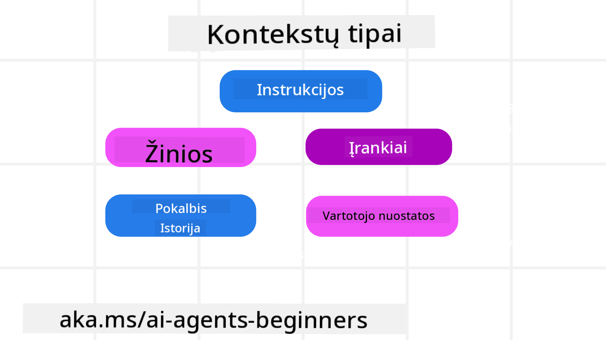
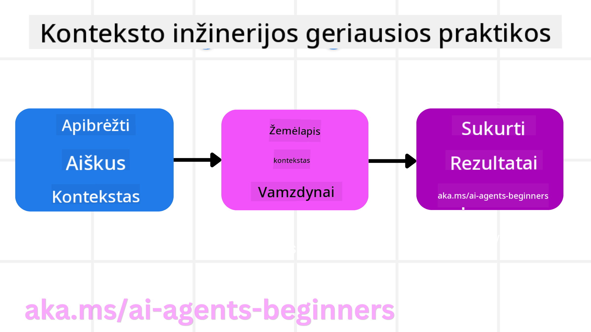

<!--
CO_OP_TRANSLATOR_METADATA:
{
  "original_hash": "cb7e50f471905ce6fdb92a30269a7a98",
  "translation_date": "2025-09-04T10:35:05+00:00",
  "source_file": "12-context-engineering/README.md",
  "language_code": "lt"
}
-->
# Kontekstų inžinerija dirbtinio intelekto agentams

> _(Spustelėkite aukščiau esančią nuotrauką, kad peržiūrėtumėte šios pamokos vaizdo įrašą)_

Suprasti sudėtingumą programos, kuriai kuriate dirbtinio intelekto agentą, yra svarbu norint sukurti patikimą sistemą. Turime kurti DI agentus, kurie efektyviai valdo informaciją, kad galėtų spręsti sudėtingus poreikius, viršijančius paprasto užklausų inžinerijos ribas.

Šioje pamokoje aptarsime, kas yra kontekstų inžinerija ir kokį vaidmenį ji atlieka kuriant DI agentus.

## Įvadas

Šioje pamokoje aptarsime:

• **Kas yra kontekstų inžinerija** ir kuo ji skiriasi nuo užklausų inžinerijos.

• **Efektyvios kontekstų inžinerijos strategijas**, įskaitant informacijos rašymą, atranką, suspaudimą ir izoliavimą.

• **Dažniausias konteksto klaidas**, kurios gali sutrikdyti DI agento veikimą, ir kaip jas ištaisyti.

## Mokymosi tikslai

Baigę šią pamoką, jūs suprasite, kaip:

• **Apibrėžti kontekstų inžineriją** ir atskirti ją nuo užklausų inžinerijos.

• **Identifikuoti pagrindinius konteksto komponentus** didelių kalbos modelių (LLM) programose.

• **Taikyti strategijas konteksto rašymui, atrankai, suspaudimui ir izoliavimui**, kad pagerintumėte agento veikimą.

• **Atpažinti dažniausias konteksto klaidas**, tokias kaip užteršimas, išsiblaškymas, painiava ir konfliktai, bei įgyvendinti jų sprendimo būdus.

## Kas yra kontekstų inžinerija?

DI agentams kontekstas yra tai, kas lemia jų planavimą ir veiksmų pasirinkimą. Kontekstų inžinerija – tai praktika, užtikrinanti, kad DI agentas turėtų tinkamą informaciją, reikalingą atlikti kitą užduoties žingsnį. Konteksto langas yra riboto dydžio, todėl kaip agentų kūrėjai turime kurti sistemas ir procesus, kurie padėtų pridėti, pašalinti ir suspausti informaciją šiame lange.

### Užklausų inžinerija vs Kontekstų inžinerija

Užklausų inžinerija orientuota į vieną statinių instrukcijų rinkinį, kuris efektyviai nukreipia DI agentus pagal taisykles. Kontekstų inžinerija apima dinamiškos informacijos valdymą, įskaitant pradinę užklausą, kad būtų užtikrinta, jog DI agentas ilgainiui turės reikiamą informaciją. Pagrindinė kontekstų inžinerijos idėja – padaryti šį procesą pakartojamą ir patikimą.

### Konteksto tipai

Svarbu prisiminti, kad kontekstas nėra vienalytis. Informacija, kurios DI agentui reikia, gali būti gaunama iš įvairių šaltinių, ir mūsų užduotis yra užtikrinti, kad agentas turėtų prieigą prie šių šaltinių:

DI agentui reikalingi konteksto tipai gali apimti:

• **Instrukcijas:** Tai tarsi agento „taisyklių rinkinys“ – užklausos, sistemos pranešimai, kelių pavyzdžių demonstracijos (parodant DI, kaip atlikti užduotį) ir įrankių aprašymai, kuriuos jis gali naudoti. Čia užklausų inžinerija susijungia su kontekstų inžinerija.

• **Žinias:** Tai faktai, informacija, gauta iš duomenų bazių, arba ilgalaikės agento sukauptos atmintys. Tai apima RAG (Retrieval Augmented Generation) sistemos integravimą, jei agentui reikia prieigos prie skirtingų žinių saugyklų ir duomenų bazių.

• **Įrankius:** Tai išorinių funkcijų, API ir MCP serverių apibrėžimai, kuriuos agentas gali iškviesti, kartu su grįžtamuoju ryšiu (rezultatais), gautu juos naudojant.

• **Pokalbių istoriją:** Vykstantį dialogą su vartotoju. Laikui bėgant šie pokalbiai tampa ilgesni ir sudėtingesni, todėl užima daugiau vietos konteksto lange.

• **Vartotojo pageidavimus:** Informaciją apie vartotojo pomėgius ar nemėgstamus dalykus, sukauptą laikui bėgant. Tai gali būti saugoma ir naudojama priimant svarbius sprendimus, padedančius vartotojui.

## Efektyvios kontekstų inžinerijos strategijos

### Planavimo strategijos

Gera kontekstų inžinerija prasideda nuo gero planavimo. Štai požiūris, kuris padės jums pradėti taikyti kontekstų inžinerijos koncepciją:

1. **Aiškiai apibrėžkite rezultatus** – užduočių, kurias DI agentai atliks, rezultatai turėtų būti aiškiai apibrėžti. Atsakykite į klausimą – „Kaip pasaulis atrodys, kai DI agentas baigs savo užduotį?“ Kitaip tariant, kokį pokytį, informaciją ar atsakymą vartotojas turėtų gauti po sąveikos su DI agentu.

2. **Sukurkite konteksto žemėlapį** – kai apibrėžėte DI agento užduoties rezultatus, turite atsakyti į klausimą „Kokią informaciją DI agentui reikia turėti, kad atliktų šią užduotį?“. Taip galite pradėti kurti konteksto žemėlapį, kuriame nurodoma, kur ta informacija gali būti randama.

3. **Sukurkite konteksto kanalus** – dabar, kai žinote, kur yra informacija, turite atsakyti į klausimą „Kaip agentas gaus šią informaciją?“. Tai galima padaryti įvairiais būdais, įskaitant RAG, MCP serverių ir kitų įrankių naudojimą.

### Praktinės strategijos

Planavimas yra svarbus, tačiau kai informacija pradeda patekti į agento konteksto langą, turime taikyti praktines strategijas, kad ją valdytume:

#### Konteksto valdymas

Nors dalis informacijos automatiškai bus pridėta į konteksto langą, kontekstų inžinerija apima aktyvesnį šios informacijos valdymą, kurį galima atlikti keliais būdais:

1. **Agentų užrašų knygelė**  
Tai leidžia DI agentui užsirašyti svarbią informaciją apie dabartines užduotis ir vartotojo sąveikas per vieną sesiją. Tai turėtų egzistuoti už konteksto lango ribų, faile arba vykdymo objekte, kurį agentas vėliau galėtų pasiekti šios sesijos metu, jei reikia.

2. **Atmintys**  
Užrašų knygelės yra naudingos informacijai valdyti už vienos sesijos konteksto lango ribų. Atmintys leidžia agentams saugoti ir pasiekti svarbią informaciją per kelias sesijas. Tai gali apimti santraukas, vartotojo pageidavimus ir grįžtamąjį ryšį, kad ateityje būtų galima tobulėti.

3. **Konteksto suspaudimas**  
Kai konteksto langas tampa pilnas, galima taikyti tokias technikas kaip santraukų sudarymas ir apkarpymas. Tai apima tik svarbiausios informacijos išsaugojimą arba senesnių pranešimų pašalinimą.

4. **Daugiagentės sistemos**  
Daugiagentės sistemos kūrimas yra kontekstų inžinerijos forma, nes kiekvienas agentas turi savo konteksto langą. Kaip tas kontekstas dalijamas ir perduodamas skirtingiems agentams, yra dar vienas aspektas, kurį reikia suplanuoti kuriant šias sistemas.

5. **Smėlio dėžės aplinkos**  
Jei agentui reikia vykdyti kodą arba apdoroti didelius informacijos kiekius dokumente, tai gali užimti daug vietos konteksto lange. Vietoj to, kad visa tai būtų saugoma konteksto lange, agentas gali naudoti smėlio dėžės aplinką, kurioje vykdomas kodas, o agentas skaito tik rezultatus ir kitą svarbią informaciją.

6. **Vykdymo būsenos objektai**  
Tai atliekama sukuriant informacijos konteinerius, kurie padeda valdyti situacijas, kai agentui reikia prieigos prie tam tikros informacijos. Sudėtingai užduočiai tai leistų agentui saugoti kiekvieno subtikslo rezultatus žingsnis po žingsnio, leidžiant kontekstui išlikti susijusiam tik su konkrečiu subtikslu.

### Kontekstų inžinerijos pavyzdys

Tarkime, norime, kad DI agentas **„Užsakytų kelionę į Paryžių.“**

• Paprastas agentas, naudojantis tik užklausų inžineriją, galėtų tiesiog atsakyti: **„Gerai, kada norėtumėte vykti į Paryžių?“**. Jis apdorotų tik jūsų tiesioginį klausimą tuo metu, kai vartotojas jį užduoda.

• Agentas, naudojantis kontekstų inžinerijos strategijas, padarytų daug daugiau. Prieš atsakydamas, jo sistema galėtų:

  ◦ **Patikrinti jūsų kalendorių** dėl laisvų datų (realiojo laiko duomenų gavimas).

 ◦ **Prisiminti ankstesnius kelionių pageidavimus** (iš ilgalaikės atminties), pvz., jūsų mėgstamą oro liniją, biudžetą ar tai, ar teikiate pirmenybę tiesioginiams skrydžiams.

 ◦ **Identifikuoti galimus įrankius** skrydžių ir viešbučių užsakymui.

- Tada atsakymas galėtų būti: **„Sveiki, [Jūsų vardas]! Matau, kad pirmąją spalio savaitę esate laisvas. Ar turėčiau ieškoti tiesioginių skrydžių į Paryžių su [Mėgstama oro linija] jūsų įprastame biudžete [Biudžetas]?“**. Šis turtingesnis, konteksto suvokimu pagrįstas atsakymas parodo kontekstų inžinerijos galią.

## Dažniausios konteksto klaidos

### Konteksto užteršimas

**Kas tai yra:** Kai haliucinacija (klaidinga informacija, sugeneruota LLM) arba klaida patenka į kontekstą ir nuolat cituojama, sukeldama agentui neįmanomus tikslus arba nesąmoningas strategijas.

**Ką daryti:** Įgyvendinkite **konteksto validaciją** ir **karantiną**. Patikrinkite informaciją prieš ją įtraukdami į ilgalaikę atmintį. Jei aptinkamas galimas užteršimas, pradėkite naujas konteksto gijas, kad bloga informacija neplistų.

**Kelionių užsakymo pavyzdys:** Jūsų agentas haliucinuoja **tiesioginį skrydį iš mažo vietinio oro uosto į tolimą tarptautinį miestą**, kuris iš tikrųjų neteikia tarptautinių skrydžių. Ši neegzistuojanti skrydžio detalė išsaugoma kontekste. Vėliau, kai paprašote agento užsakyti, jis nuolat bando rasti bilietus šiam neįmanomam maršrutui, sukeldamas pasikartojančias klaidas.

**Sprendimas:** Įgyvendinkite žingsnį, kuris **patvirtina skrydžio egzistavimą ir maršrutus naudojant realiojo laiko API** _prieš_ įtraukiant skrydžio detalę į agento darbo kontekstą. Jei validacija nepavyksta, klaidinga informacija „karantinuojama“ ir toliau nenaudojama.

### Konteksto išsiblaškymas

**Kas tai yra:** Kai kontekstas tampa toks didelis, kad modelis per daug susitelkia į sukauptą istoriją, užuot naudojęs tai, ką išmoko mokymo metu, sukeldamas pasikartojančius ar nenaudingus veiksmus. Modeliai gali pradėti daryti klaidas dar prieš užpildant konteksto langą.

**Ką daryti:** Naudokite **konteksto santraukas**. Periodiškai suspauskite sukauptą informaciją į trumpesnes santraukas, išsaugodami svarbias detales ir pašalindami nereikalingą istoriją. Tai padeda „atnaujinti“ dėmesį.

**Kelionių užsakymo pavyzdys:** Jūs ilgai diskutavote apie įvairias svajonių kelionių vietas, įskaitant išsamų pasakojimą apie savo žygį prieš dvejus metus. Kai pagaliau paprašote **„surasti man pigų skrydį kitam mėnesiui“**, agentas pasimeta senose, nesvarbiose detalėse ir nuolat klausinėja apie jūsų žygio įrangą ar ankstesnius maršrutus, ignoruodamas jūsų dabartinį prašymą.

**Sprendimas:** Po tam tikro pokalbio posūkių skaičiaus arba kai kontekstas tampa per didelis, agentas turėtų **sutrumpinti naujausią ir svarbiausią pokalbio dalį** – sutelkiant dėmesį į jūsų dabartines kelionės datas ir vietą – ir naudoti tą sutrumpintą santrauką kitam LLM kvietimui, atsisakant mažiau svarbios istorijos.

### Konteksto painiava

**Kas tai yra:** Kai nereikalingas kontekstas, dažnai per daug prieinamų įrankių forma, sukelia modelio blogus atsakymus arba netinkamų įrankių naudojimą. Mažesni modeliai ypač linkę į tai.

**Ką daryti:** Įgyvendinkite **įrankių valdymą** naudojant RAG technikas. Įrankių aprašymus saugokite vektorinėje duomenų bazėje ir pasirinkite _tik_ svarbiausius įrankius kiekvienai konkrečiai užduočiai. Tyrimai rodo, kad įrankių pasirinkimą reikėtų apriboti iki mažiau nei 30.

**Kelionių užsakymo pavyzdys:** Jūsų agentas turi prieigą prie daugybės įrankių: `book_flight`, `book_hotel`, `rent_car`, `find_tours`, `currency_converter`, `weather_forecast`, `restaurant_reservations` ir kt. Jūs paklausiate, **„Koks geriausias būdas keliauti po Paryžių?“** Dėl daugybės įrankių agentas pasimeta ir bando iškviesti `book_flight` _Paryžiaus viduje_ arba `rent_car`, nors jūs teikiate pirmenybę viešajam transportui, nes įrankių aprašymai gali persidengti arba agentas tiesiog negali pasirinkti geriausio.

**Sprendimas:** Naudokite **RAG įrankių aprašymams**. Kai paklausiate apie kelionę po Paryžių, sistema dinamiškai surenka _tik_ svarbiausius įrankius, pvz., `rent_car` arba `public_transport_info`, pagal jūsų užklausą, pateikdama sutelktą „įrankių rinkinį“ LLM.

### Konteksto konfliktas

**Kas tai yra:** Kai kontekste egzistuoja prieštaringa informacija, sukelianti nenuoseklų mąstymą arba blogus galutinius atsakymus. Tai dažnai nutinka, kai informacija pateikiama etapais, o ankstyvos, neteisingos prielaidos lieka kontekste.

**Ką daryti:** Naudokite **konteksto apkarpymą** ir **perkėlimą**. Apkarpymas reiškia pasenusios arba prieštaringos informacijos pašalinimą, kai atsiranda naujų detalių. Perkėlimas suteikia modeliui atskirą „užrašų knygelės“ darbo vietą informacijai apdoroti, neapkraunant pagrindinio kontek

---

**Atsakomybės apribojimas**:  
Šis dokumentas buvo išverstas naudojant dirbtinio intelekto vertimo paslaugą [Co-op Translator](https://github.com/Azure/co-op-translator). Nors siekiame tikslumo, atkreipiame dėmesį, kad automatiniai vertimai gali turėti klaidų ar netikslumų. Originalus dokumentas jo gimtąja kalba turėtų būti laikomas autoritetingu šaltiniu. Dėl svarbios informacijos rekomenduojame kreiptis į profesionalius vertėjus. Mes neprisiimame atsakomybės už nesusipratimus ar klaidingus aiškinimus, kylančius dėl šio vertimo naudojimo.