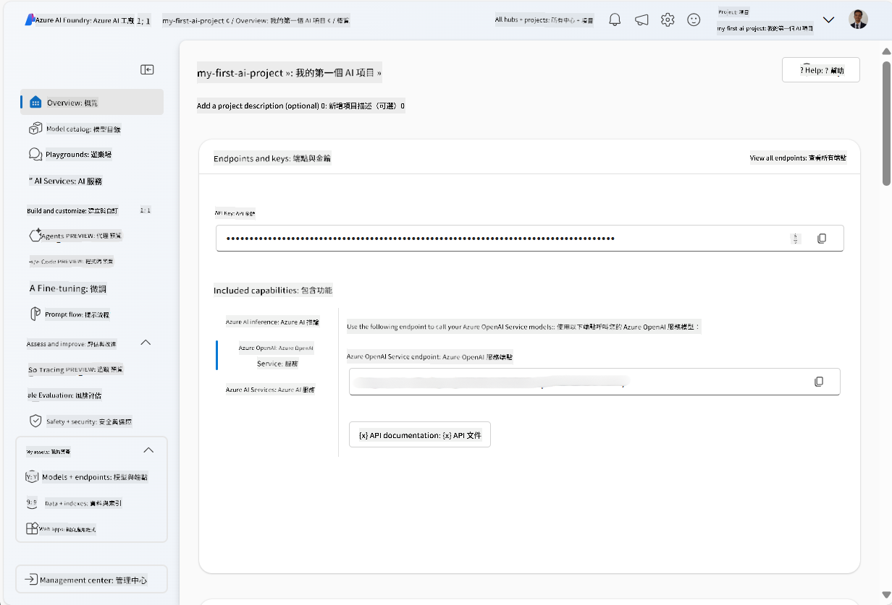
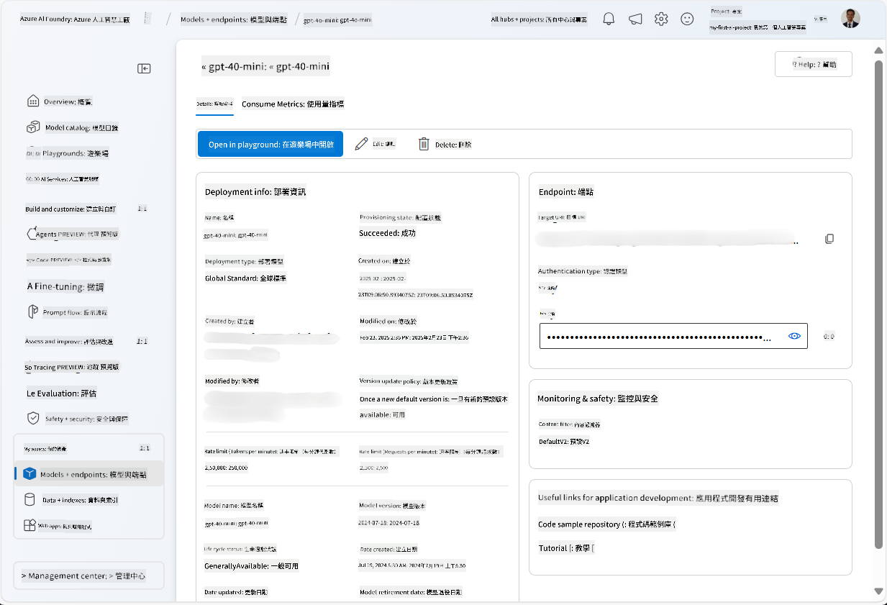
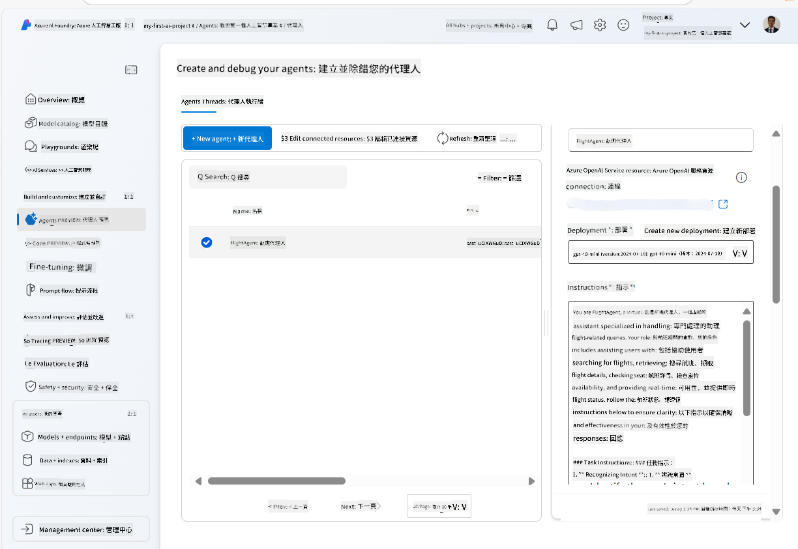
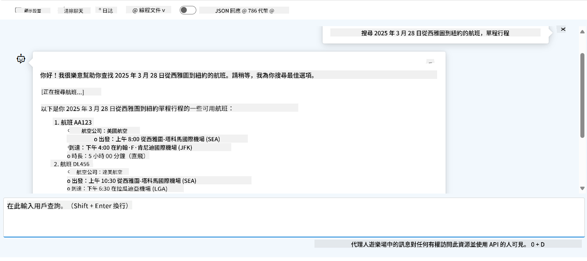

<!--
CO_OP_TRANSLATOR_METADATA:
{
  "original_hash": "7e92870dc0843e13d4dabc620c09d2d9",
  "translation_date": "2025-07-12T08:16:09+00:00",
  "source_file": "02-explore-agentic-frameworks/azure-ai-foundry-agent-creation.md",
  "language_code": "mo"
}
-->
# Azure AI Agent Service 開發

在本練習中，您將使用 [Azure AI Foundry 入口網站](https://ai.azure.com/?WT.mc_id=academic-105485-koreyst) 中的 Azure AI Agent 服務工具，建立一個航班預訂代理。該代理能與使用者互動並提供航班相關資訊。

## 先決條件

完成本練習，您需要具備以下條件：
1. 擁有一個具有有效訂閱的 Azure 帳戶。[免費建立帳戶](https://azure.microsoft.com/free/?WT.mc_id=academic-105485-koreyst)。
2. 您需要有權限建立 Azure AI Foundry 中心，或已有中心為您建立。
    - 如果您的角色是 Contributor 或 Owner，您可以依照本教學的步驟操作。

## 建立 Azure AI Foundry 中心

> **Note:** Azure AI Foundry 之前稱為 Azure AI Studio。

1. 請參考 [Azure AI Foundry](https://learn.microsoft.com/en-us/azure/ai-studio/?WT.mc_id=academic-105485-koreyst) 部落格文章中的指引，建立 Azure AI Foundry 中心。
2. 專案建立完成後，關閉任何顯示的提示，並檢視 Azure AI Foundry 入口網站中的專案頁面，畫面應類似下圖：

    

## 部署模型

1. 在專案左側窗格的 **My assets** 區段，選擇 **Models + endpoints** 頁面。
2. 在 **Models + endpoints** 頁面中，切換到 **Model deployments** 標籤，點選 **+ Deploy model** 選單，選擇 **Deploy base model**。
3. 在列表中搜尋 `gpt-4o-mini` 模型，選擇並確認部署。

    > **Note**: 降低 TPM 有助於避免超出您訂閱中可用的配額。

    

## 建立代理

模型部署完成後，即可建立代理。代理是一種對話式 AI 模型，可用來與使用者互動。

1. 在專案左側窗格的 **Build & Customize** 區段，選擇 **Agents** 頁面。
2. 點選 **+ Create agent** 建立新代理。在 **Agent Setup** 對話框中：
    - 輸入代理名稱，例如 `FlightAgent`。
    - 確認先前建立的 `gpt-4o-mini` 模型部署已被選取。
    - 根據您希望代理遵循的提示設定 **Instructions**。以下為範例：
    ```
    You are FlightAgent, a virtual assistant specialized in handling flight-related queries. Your role includes assisting users with searching for flights, retrieving flight details, checking seat availability, and providing real-time flight status. Follow the instructions below to ensure clarity and effectiveness in your responses:

    ### Task Instructions:
    1. **Recognizing Intent**:
       - Identify the user's intent based on their request, focusing on one of the following categories:
         - Searching for flights
         - Retrieving flight details using a flight ID
         - Checking seat availability for a specified flight
         - Providing real-time flight status using a flight number
       - If the intent is unclear, politely ask users to clarify or provide more details.
        
    2. **Processing Requests**:
        - Depending on the identified intent, perform the required task:
        - For flight searches: Request details such as origin, destination, departure date, and optionally return date.
        - For flight details: Request a valid flight ID.
        - For seat availability: Request the flight ID and date and validate inputs.
        - For flight status: Request a valid flight number.
        - Perform validations on provided data (e.g., formats of dates, flight numbers, or IDs). If the information is incomplete or invalid, return a friendly request for clarification.

    3. **Generating Responses**:
    - Use a tone that is friendly, concise, and supportive.
    - Provide clear and actionable suggestions based on the output of each task.
    - If no data is found or an error occurs, explain it to the user gently and offer alternative actions (e.g., refine search, try another query).
    
    ```
> [!NOTE]
> 若需更詳細的提示，您可以參考 [此儲存庫](https://github.com/ShivamGoyal03/RoamMind) 以獲取更多資訊。
    
> 此外，您也可以加入 **Knowledge Base** 和 **Actions**，以增強代理的能力，提供更多資訊並根據使用者請求執行自動化任務。本練習中可跳過這些步驟。
    


3. 若要建立新的多 AI 代理，只需點選 **New Agent**。新建立的代理將顯示在 Agents 頁面上。

## 測試代理

建立代理後，您可以在 Azure AI Foundry 入口網站的 playground 中測試代理對使用者查詢的回應。

1. 在代理的 **Setup** 窗格頂端，選擇 **Try in playground**。
2. 在 **Playground** 窗格中，您可以透過聊天視窗輸入查詢與代理互動。例如，您可以請代理搜尋 28 日從西雅圖飛往紐約的航班。

    > **Note**: 由於本練習未使用即時資料，代理可能無法提供準確回應。此練習目的是測試代理根據指示理解並回應使用者查詢的能力。

    

3. 測試完成後，您可以進一步自訂代理，加入更多意圖、訓練資料和動作，以提升其功能。

## 清理資源

測試完成後，您可以刪除代理以避免產生額外費用。
1. 開啟 [Azure 入口網站](https://portal.azure.com)，檢視您在本練習中部署中心資源的資源群組內容。
2. 在工具列上，選擇 **Delete resource group**。
3. 輸入資源群組名稱，並確認刪除。

## 資源

- [Azure AI Foundry 文件](https://learn.microsoft.com/en-us/azure/ai-studio/?WT.mc_id=academic-105485-koreyst)
- [Azure AI Foundry 入口網站](https://ai.azure.com/?WT.mc_id=academic-105485-koreyst)
- [Azure AI Studio 入門](https://techcommunity.microsoft.com/blog/educatordeveloperblog/getting-started-with-azure-ai-studio/4095602?WT.mc_id=academic-105485-koreyst)
- [Azure 上 AI 代理基礎](https://learn.microsoft.com/en-us/training/modules/ai-agent-fundamentals/?WT.mc_id=academic-105485-koreyst)
- [Azure AI Discord](https://aka.ms/AzureAI/Discord)

**免責聲明**：  
本文件係使用 AI 翻譯服務 [Co-op Translator](https://github.com/Azure/co-op-translator) 進行翻譯。雖然我們致力於確保準確性，但請注意，自動翻譯可能包含錯誤或不準確之處。原始文件的母語版本應視為權威來源。對於重要資訊，建議採用專業人工翻譯。我們不對因使用本翻譯而產生的任何誤解或誤釋負責。