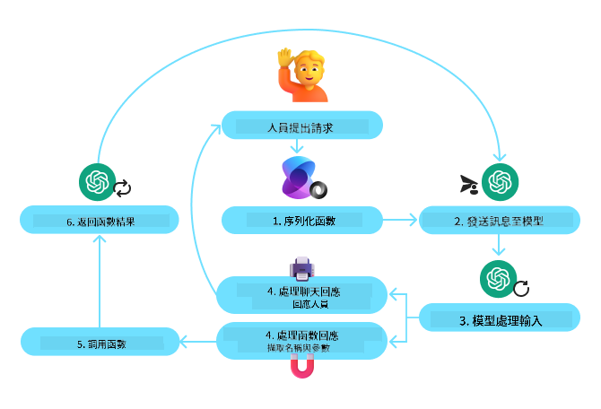
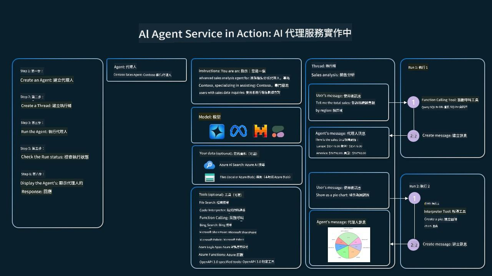

<!--
CO_OP_TRANSLATOR_METADATA:
{
  "original_hash": "88258b03f2893aa2e69eb8fb24baabbc",
  "translation_date": "2025-07-12T09:25:59+00:00",
  "source_file": "04-tool-use/README.md",
  "language_code": "mo"
}
-->
[](https://youtu.be/vieRiPRx-gI?si=cEZ8ApnT6Sus9rhn)

> _(點擊上方圖片觀看本課程影片)_

# 工具使用設計模式

工具很有趣，因為它們讓 AI 代理能擁有更廣泛的能力。代理不再只有有限的動作集合，透過加入工具，代理現在可以執行各種不同的動作。在本章中，我們將探討工具使用設計模式，說明 AI 代理如何利用特定工具來達成目標。

## 介紹

在本課程中，我們將回答以下問題：

- 什麼是工具使用設計模式？
- 它適用於哪些使用案例？
- 實作此設計模式需要哪些元素／組件？
- 使用工具使用設計模式來打造值得信賴的 AI 代理時，有哪些特別的考量？

## 學習目標

完成本課程後，您將能夠：

- 定義工具使用設計模式及其目的。
- 辨識適用工具使用設計模式的使用案例。
- 理解實作此設計模式所需的關鍵元素。
- 了解使用此設計模式打造值得信賴 AI 代理的注意事項。

## 什麼是工具使用設計模式？

**工具使用設計模式**著重於賦予大型語言模型（LLM）與外部工具互動的能力，以達成特定目標。工具是代理可執行的程式碼，用來執行動作。工具可以是簡單的函式，例如計算機，或是呼叫第三方服務的 API，例如查詢股價或天氣預報。在 AI 代理的情境中，工具設計成由代理根據**模型產生的函式呼叫**來執行。

## 它適用於哪些使用案例？

AI 代理可以利用工具完成複雜任務、檢索資訊或做出決策。工具使用設計模式常用於需要與外部系統動態互動的場景，例如資料庫、網路服務或程式碼解譯器。這種能力適用於多種使用案例，包括：

- **動態資訊檢索：**代理可查詢外部 API 或資料庫以取得最新資料（例如查詢 SQLite 資料庫進行資料分析、取得股價或天氣資訊）。
- **程式碼執行與解譯：**代理可執行程式碼或腳本來解決數學問題、產生報告或進行模擬。
- **工作流程自動化：**透過整合任務排程器、電子郵件服務或資料管線，自動化重複或多步驟的工作流程。
- **客戶支援：**代理可與 CRM 系統、工單平台或知識庫互動，解決使用者問題。
- **內容產生與編輯：**代理可利用文法檢查器、文字摘要器或內容安全評估工具，協助內容創作。

## 實作工具使用設計模式需要哪些元素／組件？

這些組件讓 AI 代理能執行多樣任務。以下是實作工具使用設計模式的關鍵元素：

- **函式／工具結構（Schemas）：**詳細定義可用工具，包括函式名稱、用途、必要參數及預期輸出。這些結構讓 LLM 理解有哪些工具可用，以及如何構造有效請求。

- **函式執行邏輯：**決定何時及如何根據使用者意圖與對話上下文呼叫工具。可能包含規劃模組、路由機制或條件流程，動態決定工具使用。

- **訊息處理系統：**管理使用者輸入、LLM 回應、工具呼叫及工具輸出之間的對話流程。

- **工具整合框架：**連接代理與各種工具的基礎設施，無論是簡單函式或複雜外部服務。

- **錯誤處理與驗證：**處理工具執行失敗、驗證參數及管理意外回應的機制。

- **狀態管理：**追蹤對話上下文、先前工具互動及持久資料，確保多輪互動的一致性。

接下來，我們將更詳細探討函式／工具呼叫。

### 函式／工具呼叫

函式呼叫是讓大型語言模型（LLM）與工具互動的主要方式。您會發現「函式」與「工具」常被交替使用，因為「函式」（可重複使用的程式碼區塊）就是代理用來執行任務的「工具」。為了呼叫函式的程式碼，LLM 必須將使用者的請求與函式描述進行比對。為此，我們會將所有可用函式的描述結構（schema）傳給 LLM，LLM 會選擇最適合該任務的函式，並回傳其名稱與參數。接著執行該函式，將回應傳回 LLM，LLM 再利用這些資訊回應使用者請求。

開發者要實作代理的函式呼叫，需要：

1. 支援函式呼叫的 LLM 模型
2. 包含函式描述的結構（schema）
3. 每個函式的程式碼

以下以取得某城市當前時間為例說明：

1. **初始化支援函式呼叫的 LLM：**

    並非所有模型都支援函式呼叫，因此需確認所用 LLM 是否支援。<a href="https://learn.microsoft.com/azure/ai-services/openai/how-to/function-calling" target="_blank">Azure OpenAI</a> 支援函式呼叫。我們可以先啟動 Azure OpenAI 用戶端。

    ```python
    # Initialize the Azure OpenAI client
    client = AzureOpenAI(
        azure_endpoint = os.getenv("AZURE_OPENAI_ENDPOINT"), 
        api_key=os.getenv("AZURE_OPENAI_API_KEY"),  
        api_version="2024-05-01-preview"
    )
    ```

1. **建立函式結構（Function Schema）：**

    接著定義一個 JSON 結構，包含函式名稱、功能描述，以及函式參數的名稱與說明。
    將此結構與使用者請求（例如查詢舊金山時間）一併傳給先前建立的用戶端。重要的是，回傳的是**工具呼叫**，**不是**問題的最終答案。如前所述，LLM 回傳它選擇的函式名稱及將傳入的參數。

    ```python
    # Function description for the model to read
    tools = [
        {
            "type": "function",
            "function": {
                "name": "get_current_time",
                "description": "Get the current time in a given location",
                "parameters": {
                    "type": "object",
                    "properties": {
                        "location": {
                            "type": "string",
                            "description": "The city name, e.g. San Francisco",
                        },
                    },
                    "required": ["location"],
                },
            }
        }
    ]
    ```
   
    ```python
  
    # Initial user message
    messages = [{"role": "user", "content": "What's the current time in San Francisco"}] 
  
    # First API call: Ask the model to use the function
      response = client.chat.completions.create(
          model=deployment_name,
          messages=messages,
          tools=tools,
          tool_choice="auto",
      )
  
      # Process the model's response
      response_message = response.choices[0].message
      messages.append(response_message)
  
      print("Model's response:")  

      print(response_message)
  
    ```

    ```bash
    Model's response:
    ChatCompletionMessage(content=None, role='assistant', function_call=None, tool_calls=[ChatCompletionMessageToolCall(id='call_pOsKdUlqvdyttYB67MOj434b', function=Function(arguments='{"location":"San Francisco"}', name='get_current_time'), type='function')])
    ```
  
1. **執行任務所需的函式程式碼：**

    LLM 選擇要執行的函式後，需實作並執行該函式的程式碼。
    我們可以用 Python 實作取得當前時間的程式碼，並撰寫程式碼從 response_message 中擷取函式名稱與參數，取得最終結果。

    ```python
      def get_current_time(location):
        """Get the current time for a given location"""
        print(f"get_current_time called with location: {location}")  
        location_lower = location.lower()
        
        for key, timezone in TIMEZONE_DATA.items():
            if key in location_lower:
                print(f"Timezone found for {key}")  
                current_time = datetime.now(ZoneInfo(timezone)).strftime("%I:%M %p")
                return json.dumps({
                    "location": location,
                    "current_time": current_time
                })
      
        print(f"No timezone data found for {location_lower}")  
        return json.dumps({"location": location, "current_time": "unknown"})
    ```

    ```python
     # Handle function calls
      if response_message.tool_calls:
          for tool_call in response_message.tool_calls:
              if tool_call.function.name == "get_current_time":
     
                  function_args = json.loads(tool_call.function.arguments)
     
                  time_response = get_current_time(
                      location=function_args.get("location")
                  )
     
                  messages.append({
                      "tool_call_id": tool_call.id,
                      "role": "tool",
                      "name": "get_current_time",
                      "content": time_response,
                  })
      else:
          print("No tool calls were made by the model.")  
  
      # Second API call: Get the final response from the model
      final_response = client.chat.completions.create(
          model=deployment_name,
          messages=messages,
      )
  
      return final_response.choices[0].message.content
     ```

    ```bash
      get_current_time called with location: San Francisco
      Timezone found for san francisco
      The current time in San Francisco is 09:24 AM.
     ```

函式呼叫是大多數（若非全部）代理工具使用設計的核心，但從零開始實作有時會有挑戰。
正如我們在[課程 2](../../../02-explore-agentic-frameworks)中學到的，代理框架提供了預先建置的組件來實作工具使用。

## 使用代理框架的工具使用範例

以下是使用不同代理框架實作工具使用設計模式的範例：

### Semantic Kernel

<a href="https://learn.microsoft.com/azure/ai-services/agents/overview" target="_blank">Semantic Kernel</a> 是一個開源 AI 框架，支援 .NET、Python 和 Java 開發者使用大型語言模型（LLM）。它透過一種稱為<a href="https://learn.microsoft.com/semantic-kernel/concepts/ai-services/chat-completion/function-calling/?pivots=programming-language-python#1-serializing-the-functions" target="_blank">序列化</a>的過程，自動將您的函式及其參數描述傳給模型，簡化函式呼叫的使用。它也處理模型與程式碼之間的雙向通訊。使用像 Semantic Kernel 這樣的代理框架的另一個優點是，您可以使用預建工具，例如<a href="https://github.com/microsoft/semantic-kernel/blob/main/python/samples/getting_started_with_agents/openai_assistant/step4_assistant_tool_file_search.py" target="_blank">檔案搜尋</a>和<a href="https://github.com/microsoft/semantic-kernel/blob/main/python/samples/getting_started_with_agents/openai_assistant/step3_assistant_tool_code_interpreter.py" target="_blank">程式碼解譯器</a>。

下圖說明了 Semantic Kernel 中函式呼叫的流程：



在 Semantic Kernel 中，函式／工具稱為<a href="https://learn.microsoft.com/semantic-kernel/concepts/plugins/?pivots=programming-language-python" target="_blank">插件（Plugins）</a>。我們可以將先前的 `get_current_time` 函式轉換成插件，方法是將其包裝成一個類別，並將函式放入其中。我們也可以匯入 `kernel_function` 裝飾器，該裝飾器會接收函式描述。當您使用 GetCurrentTimePlugin 建立 kernel 時，kernel 會自動序列化函式及其參數，並在過程中建立傳給 LLM 的結構。

```python
from semantic_kernel.functions import kernel_function

class GetCurrentTimePlugin:
    async def __init__(self, location):
        self.location = location

    @kernel_function(
        description="Get the current time for a given location"
    )
    def get_current_time(location: str = ""):
        ...

```

```python 
from semantic_kernel import Kernel

# Create the kernel
kernel = Kernel()

# Create the plugin
get_current_time_plugin = GetCurrentTimePlugin(location)

# Add the plugin to the kernel
kernel.add_plugin(get_current_time_plugin)
```
  
### Azure AI Agent Service

<a href="https://learn.microsoft.com/azure/ai-services/agents/overview" target="_blank">Azure AI Agent Service</a> 是一個較新的代理框架，旨在幫助開發者安全地建立、部署及擴展高品質且可擴充的 AI 代理，無需管理底層的運算與儲存資源。它特別適合企業應用，因為它是全託管服務，具備企業級安全性。

與直接使用 LLM API 相比，Azure AI Agent Service 提供以下優勢：

- 自動工具呼叫 — 無需自行解析工具呼叫、執行工具及處理回應，這些都由伺服器端完成
- 安全管理資料 — 不必自行管理對話狀態，可依賴 threads 儲存所有所需資訊
- 現成工具 — 可用於與資料來源互動的工具，如 Bing、Azure AI Search 和 Azure Functions

Azure AI Agent Service 中的工具可分為兩類：

1. 知識工具：
    - <a href="https://learn.microsoft.com/azure/ai-services/agents/how-to/tools/bing-grounding?tabs=python&pivots=overview" target="_blank">Bing 搜尋基礎</a>
    - <a href="https://learn.microsoft.com/azure/ai-services/agents/how-to/tools/file-search?tabs=python&pivots=overview" target="_blank">檔案搜尋</a>
    - <a href="https://learn.microsoft.com/azure/ai-services/agents/how-to/tools/azure-ai-search?tabs=azurecli%2Cpython&pivots=overview-azure-ai-search" target="_blank">Azure AI 搜尋</a>

2. 動作工具：
    - <a href="https://learn.microsoft.com/azure/ai-services/agents/how-to/tools/function-calling?tabs=python&pivots=overview" target="_blank">函式呼叫</a>
    - <a href="https://learn.microsoft.com/azure/ai-services/agents/how-to/tools/code-interpreter?tabs=python&pivots=overview" target="_blank">程式碼解譯器</a>
    - <a href="https://learn.microsoft.com/azure/ai-services/agents/how-to/tools/openapi-spec?tabs=python&pivots=overview" target="_blank">OpenAI 定義工具</a>
    - <a href="https://learn.microsoft.com/azure/ai-services/agents/how-to/tools/azure-functions?pivots=overview" target="_blank">Azure Functions</a>

Agent Service 允許我們將這些工具組合成一個 `toolset`，並利用 `threads` 追蹤特定對話的訊息歷史。

假設您是 Contoso 公司的銷售代理，想開發一個能回答銷售數據問題的對話代理。

下圖說明如何使用 Azure AI Agent Service 分析銷售數據：



要使用服務中的任一工具，我們可以建立用戶端並定義工具或工具集。以下 Python 程式碼示範實作。LLM 將能根據使用者請求，決定使用自訂函式 `fetch_sales_data_using_sqlite_query`，或是預建的程式碼解譯器。

```python 
import os
from azure.ai.projects import AIProjectClient
from azure.identity import DefaultAzureCredential
from fecth_sales_data_functions import fetch_sales_data_using_sqlite_query # fetch_sales_data_using_sqlite_query function which can be found in a fetch_sales_data_functions.py file.
from azure.ai.projects.models import ToolSet, FunctionTool, CodeInterpreterTool

project_client = AIProjectClient.from_connection_string(
    credential=DefaultAzureCredential(),
    conn_str=os.environ["PROJECT_CONNECTION_STRING"],
)

# Initialize function calling agent with the fetch_sales_data_using_sqlite_query function and adding it to the toolset
fetch_data_function = FunctionTool(fetch_sales_data_using_sqlite_query)
toolset = ToolSet()
toolset.add(fetch_data_function)

# Initialize Code Interpreter tool and adding it to the toolset. 
code_interpreter = code_interpreter = CodeInterpreterTool()
toolset = ToolSet()
toolset.add(code_interpreter)

agent = project_client.agents.create_agent(
    model="gpt-4o-mini", name="my-agent", instructions="You are helpful agent", 
    toolset=toolset
)
```

## 使用工具使用設計模式打造值得信賴 AI 代理的特別考量？

LLM 動態產生的 SQL 常見的安全疑慮是 SQL 注入攻擊或惡意行為，例如刪除或竄改資料庫。這些疑慮雖然合理，但可透過妥善設定資料庫存取權限有效降低風險。大多數資料庫可設定為唯讀模式。對於 PostgreSQL 或 Azure SQL 等資料庫服務，應為應用程式指派唯讀（SELECT）角色。

在安全環境中執行應用程式更能提升保護。在企業場景中，資料通常會從營運系統抽取並轉換至唯讀資料庫或資料倉儲，且使用者友善的結構。此做法確保資料安全、優化效能與可用性，且應用程式僅有受限的唯讀存取權。

## 其他資源

-

Azure AI Agents Service 工作坊</a>
- <a href="https://github.com/Azure-Samples/contoso-creative-writer/tree/main/docs/workshop" target="_blank">Contoso 創意寫作多代理工作坊</a>
- <a href="https://learn.microsoft.com/semantic-kernel/concepts/ai-services/chat-completion/function-calling/?pivots=programming-language-python#1-serializing-the-functions" target="_blank">Semantic Kernel 函數調用教學</a>
- <a href="https://github.com/microsoft/semantic-kernel/blob/main/python/samples/getting_started_with_agents/openai_assistant/step3_assistant_tool_code_interpreter.py" target="_blank">Semantic Kernel 程式碼解譯器</a>
- <a href="https://microsoft.github.io/autogen/dev/user-guide/core-user-guide/components/tools.html" target="_blank">Autogen 工具</a>

## 上一課

[理解 Agentic 設計模式](../03-agentic-design-patterns/README.md)

## 下一課

[Agentic RAG](../05-agentic-rag/README.md)

**免責聲明**：  
本文件係使用 AI 翻譯服務 [Co-op Translator](https://github.com/Azure/co-op-translator) 進行翻譯。雖然我們致力於確保準確性，但請注意，自動翻譯可能包含錯誤或不準確之處。原始文件的母語版本應視為權威來源。對於重要資訊，建議採用專業人工翻譯。我們不對因使用本翻譯而產生的任何誤解或誤釋負責。