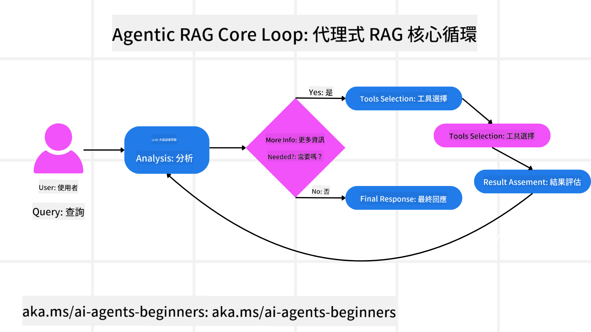
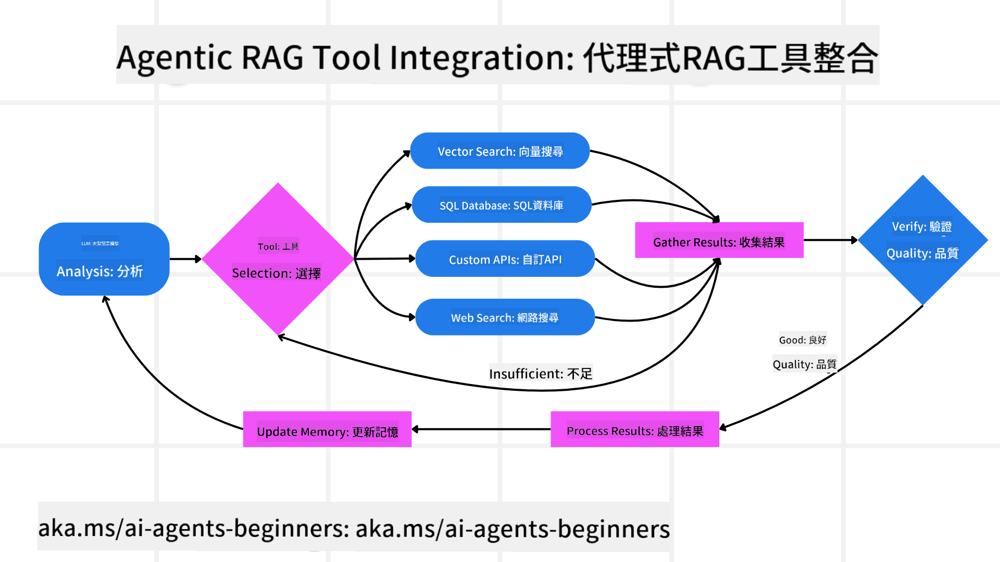
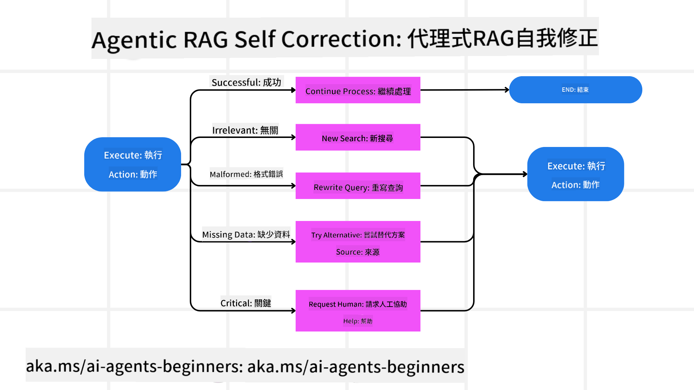
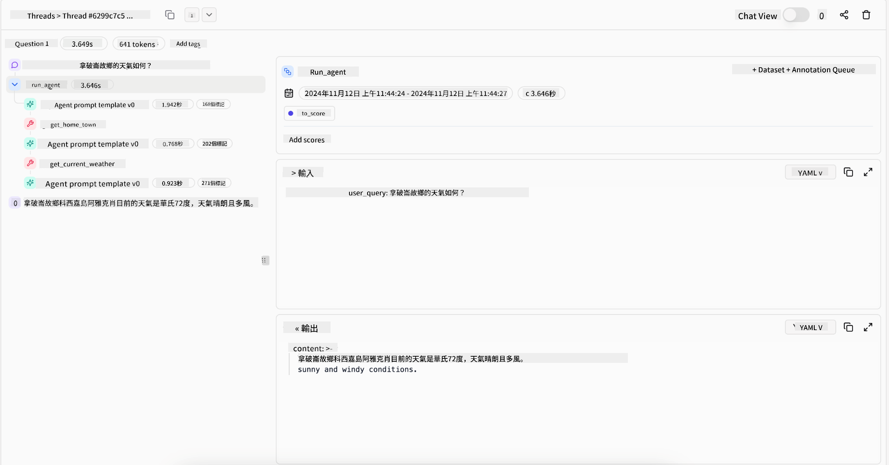
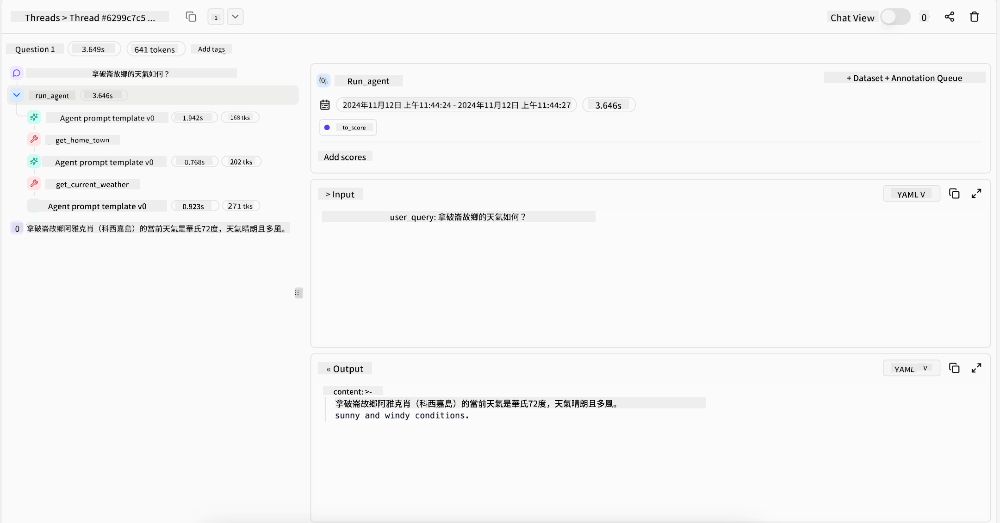

<!--
CO_OP_TRANSLATOR_METADATA:
{
  "original_hash": "7622aa72f9e676e593339f5f694ecd7d",
  "translation_date": "2025-07-12T09:53:23+00:00",
  "source_file": "05-agentic-rag/README.md",
  "language_code": "mo"
}
-->

> _(點擊上方圖片觀看本課程影片)_

# Agentic RAG

本課程全面介紹 Agentic Retrieval-Augmented Generation（Agentic RAG），這是一種新興的 AI 範式，讓大型語言模型（LLM）能自主規劃下一步行動，同時從外部來源擷取資訊。與靜態的先檢索後閱讀模式不同，Agentic RAG 採用迭代呼叫 LLM，並穿插工具或函式呼叫及結構化輸出。系統會評估結果、優化查詢、必要時調用更多工具，並持續循環直到達成滿意的解決方案。

## 介紹

本課程將涵蓋

- **理解 Agentic RAG：** 了解這種新興的 AI 範式，讓大型語言模型（LLM）能自主規劃下一步，同時從外部資料來源擷取資訊。
- **掌握迭代的製造者-檢查者模式：** 理解迭代呼叫 LLM 的循環，穿插工具或函式呼叫及結構化輸出，旨在提升正確性並處理格式錯誤的查詢。
- **探索實際應用場景：** 辨識 Agentic RAG 發揮優勢的情境，如以正確性為先的環境、複雜資料庫互動及延伸工作流程。

## 學習目標

完成本課程後，您將能夠/理解：

- **理解 Agentic RAG：** 了解這種新興的 AI 範式，讓大型語言模型（LLM）能自主規劃下一步，同時從外部資料來源擷取資訊。
- **迭代的製造者-檢查者模式：** 掌握迭代呼叫 LLM 的循環，穿插工具或函式呼叫及結構化輸出，旨在提升正確性並處理格式錯誤的查詢。
- **掌握推理過程：** 理解系統能自主掌控推理流程，決定如何解決問題，而非依賴預先定義的路徑。
- **工作流程：** 了解 agentic 模型如何獨立決定擷取市場趨勢報告、識別競爭者資料、關聯內部銷售指標、綜合分析結果並評估策略。
- **迭代循環、工具整合與記憶：** 了解系統依賴循環互動模式，跨步驟維持狀態與記憶，避免重複循環並做出更明智決策。
- **處理失敗模式與自我修正：** 探索系統強大的自我修正機制，包括迭代重查詢、使用診斷工具及依賴人工監督。
- **代理範圍界限：** 了解 Agentic RAG 的限制，聚焦於特定領域的自主性、基礎設施依賴及遵守安全規範。
- **實際應用與價值：** 辨識 Agentic RAG 發揮優勢的場景，如以正確性為先的環境、複雜資料庫互動及延伸工作流程。
- **治理、透明度與信任：** 了解治理與透明度的重要性，包括可解釋的推理、偏見控制及人工監督。

## 什麼是 Agentic RAG？

Agentic Retrieval-Augmented Generation（Agentic RAG）是一種新興的 AI 範式，讓大型語言模型（LLM）能自主規劃下一步，同時從外部來源擷取資訊。與靜態的先檢索後閱讀模式不同，Agentic RAG 採用迭代呼叫 LLM，穿插工具或函式呼叫及結構化輸出。系統會評估結果、優化查詢、必要時調用更多工具，並持續循環直到達成滿意的解決方案。這種迭代的「製造者-檢查者」模式提升了正確性，能處理格式錯誤的查詢，確保高品質結果。

系統積極掌控推理過程，重寫失敗的查詢、選擇不同的檢索方法，並整合多種工具，例如 Azure AI Search 的向量搜尋、SQL 資料庫或自訂 API，然後才完成最終答案。agentic 系統的關鍵特質是能自主掌控推理流程。傳統 RAG 實作依賴預先定義的路徑，但 agentic 系統會根據所獲資訊的品質，自主決定步驟順序。

## 定義 Agentic Retrieval-Augmented Generation（Agentic RAG）

Agentic Retrieval-Augmented Generation（Agentic RAG）是 AI 發展中的新興範式，LLM 不僅從外部資料來源擷取資訊，還能自主規劃下一步。與靜態的先檢索後閱讀模式或精心設計的提示序列不同，Agentic RAG 採用迴圈式的迭代呼叫 LLM，穿插工具或函式呼叫及結構化輸出。每一步系統都會評估已獲結果，決定是否優化查詢，必要時調用更多工具，並持續循環直到達成滿意解決方案。

這種迭代的「製造者-檢查者」操作模式旨在提升正確性，處理格式錯誤的結構化資料庫查詢（如 NL2SQL），並確保結果均衡且高品質。系統不僅依賴精心設計的提示鏈，而是積極掌控推理流程。它能重寫失敗的查詢、選擇不同的檢索方法，並整合多種工具，例如 Azure AI Search 的向量搜尋、SQL 資料庫或自訂 API，然後才完成最終答案。這消除了過於複雜的協調框架需求。相反地，一個相對簡單的「LLM 呼叫 → 工具使用 → LLM 呼叫 → …」循環就能產生複雜且有根據的輸出。

## 掌控推理過程

使系統成為「agentic」的關鍵特質是其能掌控推理過程。傳統 RAG 實作通常依賴人類預先定義模型的路徑：一條說明何時檢索什麼的思考鏈。
但真正 agentic 的系統會在內部決定如何解決問題。它不只是執行腳本，而是根據所獲資訊的品質，自主決定步驟順序。
例如，當被要求制定產品上市策略時，它不會僅依賴一個詳述整個研究與決策流程的提示。相反地，agentic 模型會獨立決定：

1. 使用 Bing Web Grounding 擷取當前市場趨勢報告
2. 利用 Azure AI Search 識別相關競爭者資料
3. 使用 Azure SQL Database 關聯歷史內部銷售指標
4. 透過 Azure OpenAI Service 將發現綜合成一致策略
5. 評估策略是否有缺口或不一致，必要時再進行新一輪檢索

所有這些步驟——優化查詢、選擇資料來源、反覆迭代直到「滿意」答案——都是由模型決定，而非人類預先編寫腳本。

## 迭代循環、工具整合與記憶

agentic 系統依賴循環互動模式：

- **初始呼叫：** 將使用者目標（即使用者提示）呈現給 LLM。
- **工具調用：** 若模型發現資訊不足或指令模糊，會選擇工具或檢索方法，例如向量資料庫查詢（如 Azure AI Search 混合搜尋私有資料）或結構化 SQL 呼叫，以收集更多上下文。
- **評估與優化：** 在審查回傳資料後，模型判斷資訊是否足夠。若不足，會優化查詢、嘗試不同工具或調整策略。
- **持續迭代直到滿意：** 循環持續，直到模型認為已獲得足夠清晰且有根據的證據，能給出最終且合理的回應。
- **記憶與狀態：** 系統跨步驟維持狀態與記憶，能回憶先前嘗試及結果，避免重複循環，並在進行中做出更明智決策。

隨著時間推移，這創造出逐步演進的理解，使模型能駕馭複雜多步任務，而無需人類持續介入或重塑提示。

## 處理失敗模式與自我修正

Agentic RAG 的自主性也包含強大的自我修正機制。當系統遇到瓶頸——例如擷取到不相關文件或遭遇格式錯誤查詢時——它能：

- **迭代與重查詢：** 不會回傳低價值回應，而是嘗試新搜尋策略、重寫資料庫查詢或查看替代資料集。
- **使用診斷工具：** 系統可能調用額外函式，協助偵錯推理步驟或確認擷取資料的正確性。像 Azure AI Tracing 這類工具對於強化可觀察性與監控非常重要。
- **依賴人工監督：** 對於高風險或反覆失敗的情況，模型可能標示不確定性並請求人工指導。當人類提供修正回饋後，模型能將其納入後續學習。

這種迭代且動態的方式讓模型持續進步，確保它不只是一次性的系統，而是在同一會話中從錯誤中學習。

## 代理範圍界限

儘管在任務中具備自主性，Agentic RAG 並不等同於通用人工智慧。其「agentic」能力限於人類開發者提供的工具、資料來源與政策。它無法自行發明工具或超越既定領域界限。相反，它擅長動態協調現有資源。
與更先進 AI 形式的主要差異包括：

1. **特定領域自主性：** Agentic RAG 系統專注於在已知領域內達成使用者定義目標，透過查詢重寫或工具選擇等策略提升成果。
2. **基礎設施依賴：** 系統能力取決於開發者整合的工具與資料，無法在無人介入下突破這些界限。
3. **遵守安全規範：** 倫理指導、合規規則與商業政策依然非常重要。代理的自由始終受限於安全措施與監督機制（希望如此？）。

## 實際應用與價值

Agentic RAG 在需要反覆優化與精確度的場景中表現出色：

1. **以正確性為先的環境：** 在合規檢查、法規分析或法律研究中，agentic 模型能反覆驗證事實、查詢多個來源並重寫查詢，直到產出經過嚴格審核的答案。
2. **複雜資料庫互動：** 處理結構化資料時，查詢常失敗或需調整，系統能自主優化查詢，利用 Azure SQL 或 Microsoft Fabric OneLake，確保最終擷取符合使用者意圖。
3. **延伸工作流程：** 長時間運作的會話會隨新資訊浮現而演進。Agentic RAG 能持續整合新資料，隨著對問題領域的理解加深調整策略。

## 治理、透明度與信任

隨著系統推理越來越自主，治理與透明度變得至關重要：

- **可解釋的推理：** 模型能提供查詢紀錄、參考來源及推理步驟的審計軌跡。像 Azure AI Content Safety 與 Azure AI Tracing / GenAIOps 等工具有助維持透明度並降低風險。
- **偏見控制與均衡檢索：** 開發者可調整檢索策略，確保考慮均衡且具代表性的資料來源，並定期審核輸出，利用 Azure Machine Learning 的自訂模型偵測偏見或偏斜模式，特別適用於進階資料科學組織。
- **人工監督與合規：** 對於敏感任務，人工審查仍不可或缺。Agentic RAG 不取代高風險決策中的人類判斷，而是透過提供更嚴謹審核的選項來輔助。

擁有能清楚記錄行動的工具至關重要。缺乏這些工具，除錯多步驟流程將非常困難。以下為 Literal AI（Chainlit 背後公司）提供的 Agent 運行範例：

## 結論

Agentic RAG 代表 AI 系統處理複雜且資料密集任務的自然演進。透過採用迴圈互動模式、自主選擇工具並優化查詢直到達成高品質結果，系統超越靜態提示執行，成為更具適應性與情境感知的決策者。雖然仍受限於人類定義的基礎設施與倫理規範，這些 agentic 能力使 AI 互動更豐富、更動態，最終為企業與終端使用者帶來更大價值。

## 附加資源

- <a href="https://learn.microsoft.com/training/modules/use-own-data-azure-openai" target="_blank">使用 Azure OpenAI Service 實作 Retrieval Augmented Generation (RAG)：學習如何使用您自己的資料與 Azure OpenAI Service。本 Microsoft Learn 模組提供完整的 RAG 實作指南</a>

- <a href="https://learn.microsoft.com/azure/ai-studio/concepts/evaluation-approach-gen-ai" target="_blank">使用 Azure AI Foundry 評估生成式 AI 應用程式：本文涵蓋在公開資料集上對模型進行評估與比較，包括 Agentic AI 應用程式和 RAG 架構</a>
- <a href="https://weaviate.io/blog/what-is-agentic-rag" target="_blank">什麼是 Agentic RAG | Weaviate</a>
- <a href="https://ragaboutit.com/agentic-rag-a-complete-guide-to-agent-based-retrieval-augmented-generation/" target="_blank">Agentic RAG：基於代理的檢索增強生成完整指南 – 來自 generation RAG 的最新消息</a>
- <a href="https://huggingface.co/learn/cookbook/agent_rag" target="_blank">Agentic RAG：透過查詢重構與自我查詢提升你的 RAG！Hugging Face 開源 AI 食譜</a>
- <a href="https://youtu.be/aQ4yQXeB1Ss?si=2HUqBzHoeB5tR04U" target="_blank">為 RAG 添加 Agentic 層</a>
- <a href="https://www.youtube.com/watch?v=zeAyuLc_f3Q&t=244s" target="_blank">知識助理的未來：Jerry Liu</a>
- <a href="https://www.youtube.com/watch?v=AOSjiXP1jmQ" target="_blank">如何構建 Agentic RAG 系統</a>
- <a href="https://ignite.microsoft.com/sessions/BRK102?source=sessions" target="_blank">使用 Azure AI Foundry Agent 服務擴展你的 AI 代理</a>

### 學術論文

- <a href="https://arxiv.org/abs/2303.17651" target="_blank">2303.17651 Self-Refine：透過自我反饋進行迭代精煉</a>
- <a href="https://arxiv.org/abs/2303.11366" target="_blank">2303.11366 Reflexion：具語言強化學習的語言代理</a>
- <a href="https://arxiv.org/abs/2305.11738" target="_blank">2305.11738 CRITIC：大型語言模型可透過工具互動式批評自我修正</a>
- <a href="https://arxiv.org/abs/2501.09136" target="_blank">2501.09136 Agentic 檢索增強生成：Agentic RAG 調查報告</a>

## 上一課

[工具使用設計模式](../04-tool-use/README.md)

## 下一課

[建立值得信賴的 AI 代理](../06-building-trustworthy-agents/README.md)

**免責聲明**：  
本文件係使用 AI 翻譯服務 [Co-op Translator](https://github.com/Azure/co-op-translator) 進行翻譯。雖然我們致力於確保準確性，但請注意，自動翻譯可能包含錯誤或不準確之處。原始文件的母語版本應視為權威來源。對於重要資訊，建議採用專業人工翻譯。我們不對因使用本翻譯而產生的任何誤解或誤釋負責。