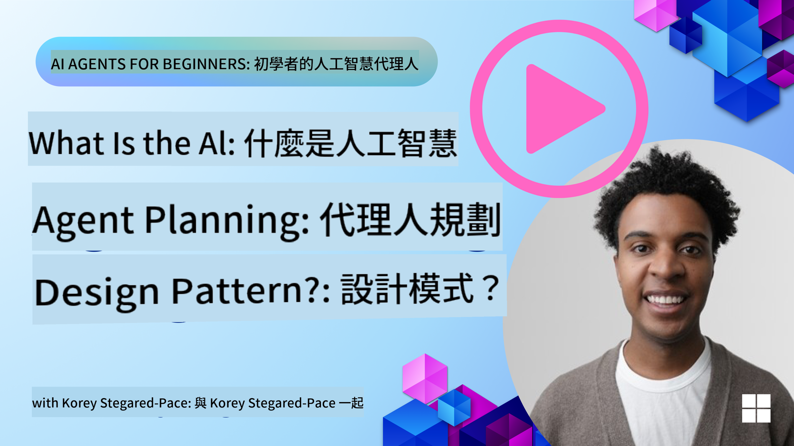
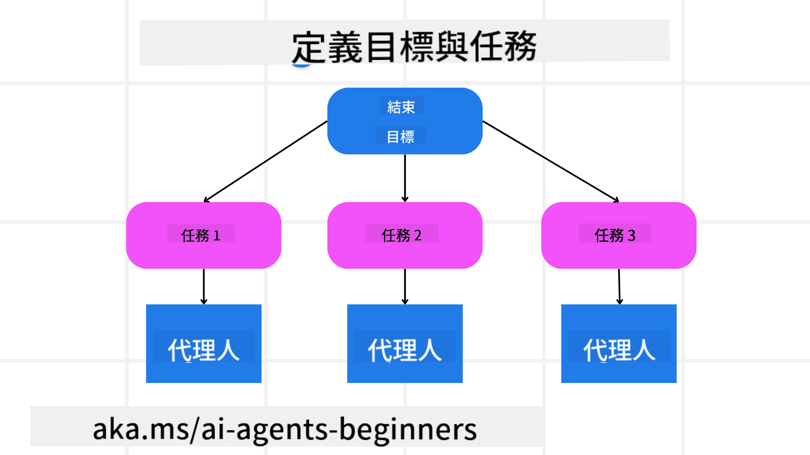

<!--
CO_OP_TRANSLATOR_METADATA:
{
  "original_hash": "a28d30590704ea13b6a08d4793cf9c2b",
  "translation_date": "2025-08-29T12:41:28+00:00",
  "source_file": "07-planning-design/README.md",
  "language_code": "mo"
}
-->
[](https://youtu.be/kPfJ2BrBCMY?si=9pYpPXp0sSbK91Dr)

> _(點擊上方圖片觀看本課程影片)_

# 規劃設計

## 簡介

本課程將涵蓋以下內容：

* 定義清晰的整體目標，並將複雜任務分解為可管理的子任務。
* 利用結構化輸出以獲得更可靠且機器可讀的回應。
* 採用事件驅動的方法來處理動態任務和意外輸入。

## 學習目標

完成本課程後，您將了解以下內容：

* 為 AI 代理設定並識別整體目標，確保其清楚知道需要完成的任務。
* 將複雜任務分解為可管理的子任務，並將它們組織成邏輯順序。
* 為代理配備合適的工具（例如搜索工具或數據分析工具），決定何時及如何使用這些工具，並處理出現的意外情況。
* 評估子任務的結果、衡量性能，並迭代行動以改進最終輸出。

## 定義整體目標並分解任務



大多數現實世界的任務過於複雜，無法在單一步驟中完成。AI 代理需要一個簡潔的目標來指導其規劃和行動。例如，考慮以下目標：

    "生成一個三天的旅行行程。"

雖然目標陳述簡單，但仍需要進一步細化。目標越清晰，代理（以及任何人類協作者）就越能專注於實現正確的結果，例如創建包含航班選項、酒店推薦和活動建議的完整行程。

### 任務分解

將大型或複雜任務分解為更小、更具目標性的子任務可以使其更易於管理。
以旅行行程為例，您可以將目標分解為：

* 航班預訂
* 酒店預訂
* 汽車租賃
* 個性化定制

每個子任務可以由專門的代理或流程來處理。一個代理可能專注於搜索最佳航班交易，另一個代理則專注於酒店預訂，依此類推。一個協調或“下游”代理可以將這些結果整合成一個完整的行程提供給最終用戶。

這種模塊化方法還允許逐步改進。例如，您可以添加專門的代理來提供餐飲推薦或當地活動建議，並隨時間推進進一步完善行程。

### 結構化輸出

大型語言模型（LLMs）可以生成結構化輸出（例如 JSON），這使得下游代理或服務更容易解析和處理。在多代理環境中，這尤其有用，因為我們可以在接收到規劃輸出後執行這些任務。請參考以下內容以快速了解。

以下 Python 代碼片段展示了一個簡單的規劃代理如何將目標分解為子任務並生成結構化計劃：

```python
from pydantic import BaseModel
from enum import Enum
from typing import List, Optional, Union
import json
import os
from typing import Optional
from pprint import pprint
from autogen_core.models import UserMessage, SystemMessage, AssistantMessage
from autogen_ext.models.azure import AzureAIChatCompletionClient
from azure.core.credentials import AzureKeyCredential

class AgentEnum(str, Enum):
    FlightBooking = "flight_booking"
    HotelBooking = "hotel_booking"
    CarRental = "car_rental"
    ActivitiesBooking = "activities_booking"
    DestinationInfo = "destination_info"
    DefaultAgent = "default_agent"
    GroupChatManager = "group_chat_manager"

# Travel SubTask Model
class TravelSubTask(BaseModel):
    task_details: str
    assigned_agent: AgentEnum  # we want to assign the task to the agent

class TravelPlan(BaseModel):
    main_task: str
    subtasks: List[TravelSubTask]
    is_greeting: bool

client = AzureAIChatCompletionClient(
    model="gpt-4o-mini",
    endpoint="https://models.inference.ai.azure.com",
    # To authenticate with the model you will need to generate a personal access token (PAT) in your GitHub settings.
    # Create your PAT token by following instructions here: https://docs.github.com/en/authentication/keeping-your-account-and-data-secure/managing-your-personal-access-tokens
    credential=AzureKeyCredential(os.environ["GITHUB_TOKEN"]),
    model_info={
        "json_output": False,
        "function_calling": True,
        "vision": True,
        "family": "unknown",
    },
)

# Define the user message
messages = [
    SystemMessage(content="""You are an planner agent.
    Your job is to decide which agents to run based on the user's request.
                      Provide your response in JSON format with the following structure:
{'main_task': 'Plan a family trip from Singapore to Melbourne.',
 'subtasks': [{'assigned_agent': 'flight_booking',
               'task_details': 'Book round-trip flights from Singapore to '
                               'Melbourne.'}
    Below are the available agents specialised in different tasks:
    - FlightBooking: For booking flights and providing flight information
    - HotelBooking: For booking hotels and providing hotel information
    - CarRental: For booking cars and providing car rental information
    - ActivitiesBooking: For booking activities and providing activity information
    - DestinationInfo: For providing information about destinations
    - DefaultAgent: For handling general requests""", source="system"),
    UserMessage(
        content="Create a travel plan for a family of 2 kids from Singapore to Melboune", source="user"),
]

response = await client.create(messages=messages, extra_create_args={"response_format": 'json_object'})

response_content: Optional[str] = response.content if isinstance(
    response.content, str) else None
if response_content is None:
    raise ValueError("Response content is not a valid JSON string" )

pprint(json.loads(response_content))

# # Ensure the response content is a valid JSON string before loading it
# response_content: Optional[str] = response.content if isinstance(
#     response.content, str) else None
# if response_content is None:
#     raise ValueError("Response content is not a valid JSON string")

# # Print the response content after loading it as JSON
# pprint(json.loads(response_content))

# Validate the response content with the MathReasoning model
# TravelPlan.model_validate(json.loads(response_content))
```

### 規劃代理與多代理協作

在此示例中，一個語義路由代理接收到用戶請求（例如，“我需要一個旅行的酒店計劃。”）。

規劃代理的工作流程如下：

* 接收酒店計劃：規劃代理接收用戶的消息，並根據系統提示（包括可用代理的詳細信息）生成結構化的旅行計劃。
* 列出代理及其工具：代理註冊表包含代理列表（例如航班、酒店、汽車租賃和活動）以及它們提供的功能或工具。
* 將計劃路由到相應的代理：根據子任務的數量，規劃代理要麼直接將消息發送給專門代理（針對單一任務場景），要麼通過群聊管理器協調多代理合作。
* 總結結果：最後，規劃代理總結生成的計劃以便清晰呈現。

以下 Python 代碼示例展示了這些步驟：

```python

from pydantic import BaseModel

from enum import Enum
from typing import List, Optional, Union

class AgentEnum(str, Enum):
    FlightBooking = "flight_booking"
    HotelBooking = "hotel_booking"
    CarRental = "car_rental"
    ActivitiesBooking = "activities_booking"
    DestinationInfo = "destination_info"
    DefaultAgent = "default_agent"
    GroupChatManager = "group_chat_manager"

# Travel SubTask Model

class TravelSubTask(BaseModel):
    task_details: str
    assigned_agent: AgentEnum # we want to assign the task to the agent

class TravelPlan(BaseModel):
    main_task: str
    subtasks: List[TravelSubTask]
    is_greeting: bool
import json
import os
from typing import Optional

from autogen_core.models import UserMessage, SystemMessage, AssistantMessage
from autogen_ext.models.openai import AzureOpenAIChatCompletionClient

# Create the client with type-checked environment variables

client = AzureOpenAIChatCompletionClient(
    azure_deployment=os.getenv("AZURE_OPENAI_DEPLOYMENT_NAME"),
    model=os.getenv("AZURE_OPENAI_DEPLOYMENT_NAME"),
    api_version=os.getenv("AZURE_OPENAI_API_VERSION"),
    azure_endpoint=os.getenv("AZURE_OPENAI_ENDPOINT"),
    api_key=os.getenv("AZURE_OPENAI_API_KEY"),
)

from pprint import pprint

# Define the user message

messages = [
    SystemMessage(content="""You are an planner agent.
    Your job is to decide which agents to run based on the user's request.
    Below are the available agents specialized in different tasks:
    - FlightBooking: For booking flights and providing flight information
    - HotelBooking: For booking hotels and providing hotel information
    - CarRental: For booking cars and providing car rental information
    - ActivitiesBooking: For booking activities and providing activity information
    - DestinationInfo: For providing information about destinations
    - DefaultAgent: For handling general requests""", source="system"),
    UserMessage(content="Create a travel plan for a family of 2 kids from Singapore to Melbourne", source="user"),
]

response = await client.create(messages=messages, extra_create_args={"response_format": TravelPlan})

# Ensure the response content is a valid JSON string before loading it

response_content: Optional[str] = response.content if isinstance(response.content, str) else None
if response_content is None:
    raise ValueError("Response content is not a valid JSON string")

# Print the response content after loading it as JSON

pprint(json.loads(response_content))
```

上述代碼的輸出示例如下，您可以使用此結構化輸出路由到 `assigned_agent`，並將旅行計劃摘要提供給最終用戶。

```json
{
    "is_greeting": "False",
    "main_task": "Plan a family trip from Singapore to Melbourne.",
    "subtasks": [
        {
            "assigned_agent": "flight_booking",
            "task_details": "Book round-trip flights from Singapore to Melbourne."
        },
        {
            "assigned_agent": "hotel_booking",
            "task_details": "Find family-friendly hotels in Melbourne."
        },
        {
            "assigned_agent": "car_rental",
            "task_details": "Arrange a car rental suitable for a family of four in Melbourne."
        },
        {
            "assigned_agent": "activities_booking",
            "task_details": "List family-friendly activities in Melbourne."
        },
        {
            "assigned_agent": "destination_info",
            "task_details": "Provide information about Melbourne as a travel destination."
        }
    ]
}
```

包含上述代碼示例的筆記本可在 [此處](07-autogen.ipynb) 找到。

### 迭代規劃

某些任務需要反覆進行或重新規劃，其中一個子任務的結果可能會影響下一步。例如，如果代理在預訂航班時發現意外的數據格式，它可能需要在繼續酒店預訂之前調整策略。

此外，用戶反饋（例如人類決定更喜歡早一點的航班）可能會觸發部分重新規劃。這種動態、迭代的方法確保最終解決方案符合現實世界的限制和不斷變化的用戶偏好。

例如，以下示例代碼：

```python
from autogen_core.models import UserMessage, SystemMessage, AssistantMessage
#.. same as previous code and pass on the user history, current plan
messages = [
    SystemMessage(content="""You are a planner agent to optimize the
    Your job is to decide which agents to run based on the user's request.
    Below are the available agents specialized in different tasks:
    - FlightBooking: For booking flights and providing flight information
    - HotelBooking: For booking hotels and providing hotel information
    - CarRental: For booking cars and providing car rental information
    - ActivitiesBooking: For booking activities and providing activity information
    - DestinationInfo: For providing information about destinations
    - DefaultAgent: For handling general requests""", source="system"),
    UserMessage(content="Create a travel plan for a family of 2 kids from Singapore to Melbourne", source="user"),
    AssistantMessage(content=f"Previous travel plan - {TravelPlan}", source="assistant")
]
# .. re-plan and send the tasks to respective agents
```

如需更全面的規劃，請查看 Magnetic One 用於解決複雜任務的工具。

## 總結

在本文中，我們探討了一個示例，展示如何創建一個規劃器，能夠動態選擇定義的可用代理。規劃器的輸出分解任務並分配代理以執行任務。假設代理可以訪問執行任務所需的功能/工具。除了代理之外，您還可以包括其他模式，例如反思、摘要器和輪詢聊天，以進一步定制。

## 其他資源

* AutoGen Magnetic One - 一個通用的多代理系統，用於解決複雜任務，並在多個具有挑戰性的代理基準測試中取得了令人印象深刻的成果。參考：

在此實現中，協調器創建特定任務計劃並將這些任務委派給可用代理。除了規劃之外，協調器還採用跟蹤機制來監控任務進度並根據需要重新規劃。

### 對規劃設計模式有更多疑問？

加入 [Azure AI Foundry Discord](https://aka.ms/ai-agents/discord)，與其他學習者交流，參加辦公時間並解答您的 AI 代理相關問題。

## 上一課程

[構建值得信賴的 AI 代理](../06-building-trustworthy-agents/README.md)

## 下一課程

[多代理設計模式](../08-multi-agent/README.md)

---

**免責聲明**：  
本文件已使用 AI 翻譯服務 [Co-op Translator](https://github.com/Azure/co-op-translator) 進行翻譯。儘管我們努力確保翻譯的準確性，但請注意，自動翻譯可能包含錯誤或不準確之處。原始文件的母語版本應被視為權威來源。對於關鍵信息，建議使用專業人工翻譯。我們對因使用此翻譯而引起的任何誤解或錯誤解釋不承擔責任。