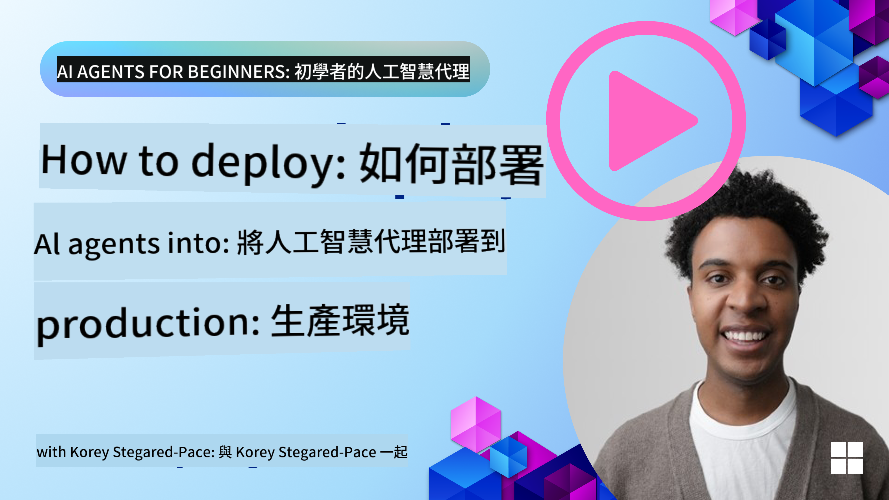

<!--
CO_OP_TRANSLATOR_METADATA:
{
  "original_hash": "cdfd0acc8592c1af14f8637833450375",
  "translation_date": "2025-08-29T12:35:09+00:00",
  "source_file": "10-ai-agents-production/README.md",
  "language_code": "mo"
}
-->
# AI 代理在生產環境中的觀察性與評估

[](https://youtu.be/l4TP6IyJxmQ?si=reGOyeqjxFevyDq9)

隨著 AI 代理從實驗性原型轉向真實世界的應用，理解其行為、監控其性能以及系統性地評估其輸出變得至關重要。

## 學習目標

完成本課程後，您將了解如何/能夠：
- 理解代理的觀察性與評估的核心概念
- 提升代理性能、成本效益與有效性的技術
- 系統性地評估您的 AI 代理的內容與方法
- 控制 AI 代理部署到生產環境中的成本
- 為使用 AutoGen 構建的代理進行儀表化

目標是讓您具備將“黑箱”代理轉變為透明、可管理且可靠系統的知識。

_**注意：** 部署安全且值得信賴的 AI 代理非常重要。請參考[構建值得信賴的 AI 代理](./06-building-trustworthy-agents/README.md)課程。_

## 跟蹤與跨度

觀察性工具（如 [Langfuse](https://langfuse.com/) 或 [Azure AI Foundry](https://learn.microsoft.com/en-us/azure/ai-foundry/what-is-azure-ai-foundry)）通常將代理的運行表示為跟蹤與跨度。

- **跟蹤** 代表從開始到結束的完整代理任務（例如處理用戶查詢）。
- **跨度** 是跟蹤中的單個步驟（例如調用語言模型或檢索數據）。


如果沒有觀察性，AI 代理就像一個“黑箱”——其內部狀態和推理過程不透明，難以診斷問題或優化性能。有了觀察性，代理就變成了“玻璃箱”，提供了透明性，這對於建立信任和確保其按預期運行至關重要。

## 為什麼觀察性在生產環境中很重要

將 AI 代理部署到生產環境中會帶來一系列新的挑戰和需求。觀察性不再是“可有可無”的功能，而是一項關鍵能力：

* **調試與根本原因分析**：當代理失敗或產生意外輸出時，觀察性工具提供的跟蹤數據可以幫助定位錯誤的來源。這對於涉及多次 LLM 調用、工具交互和條件邏輯的複雜代理尤為重要。
* **延遲與成本管理**：AI 代理通常依賴於按字元或調用次數計費的 LLM 和其他外部 API。觀察性允許精確跟蹤這些調用，幫助識別過於緩慢或昂貴的操作。這使團隊能夠優化提示、選擇更高效的模型或重新設計工作流程，以管理運營成本並確保良好的用戶體驗。
* **信任、安全與合規**：在許多應用中，確保代理行為安全且符合道德標準非常重要。觀察性提供了代理行動和決策的審計記錄。這可以用於檢測和緩解問題，例如提示注入、生成有害內容或處理個人身份信息（PII）不當。例如，您可以通過檢查跟蹤數據來了解代理為什麼提供某個回應或使用特定工具。
* **持續改進循環**：觀察性數據是迭代開發過程的基礎。通過監控代理在真實世界中的表現，團隊可以識別改進領域，收集數據以微調模型，並驗證更改的影響。這創造了一個反饋循環，通過在線評估的生產洞察來指導離線實驗和改進，從而逐步提升代理性能。

## 關鍵指標追蹤

為了監控和理解代理行為，需要追蹤一系列指標和信號。雖然具體指標可能因代理的用途而異，但有些是普遍重要的。

以下是觀察性工具通常監控的一些常見指標：

**延遲：** 代理的回應速度如何？長時間等待會對用戶體驗產生負面影響。您應該通過跟蹤代理運行來測量任務和單個步驟的延遲。例如，一個代理在所有模型調用上花費 20 秒，可以通過使用更快的模型或並行運行模型調用來加速。

**成本：** 每次代理運行的費用是多少？AI 代理依賴於按字元計費的 LLM 調用或外部 API。頻繁的工具使用或多次提示可能會迅速增加成本。例如，如果一個代理為了微小的質量提升調用了 LLM 五次，您需要評估這樣的成本是否合理，或者是否可以減少調用次數或使用更便宜的模型。實時監控還可以幫助識別意外的成本激增（例如，因錯誤導致的過多 API 循環）。

**請求錯誤：** 代理失敗的請求數量是多少？這可能包括 API 錯誤或工具調用失敗。為了使代理在生產環境中更具魯棒性，您可以設置回退或重試機制。例如，如果 LLM 提供商 A 無法使用，則切換到 LLM 提供商 B 作為備份。

**用戶反饋：** 實施直接的用戶評估提供了寶貴的見解。這可以包括明確的評分（👍/👎，⭐1-5 星）或文字評論。持續的負面反饋應引起警惕，因為這表明代理未按預期工作。

**隱性用戶反饋：** 用戶行為即使沒有明確評分也能提供間接反饋。例如，立即重新表述問題、重複查詢或點擊重試按鈕。如果您發現用戶反復提出相同的問題，這表明代理未按預期工作。

**準確性：** 代理生成正確或理想輸出的頻率如何？準確性的定義可能不同（例如，解決問題的正確性、信息檢索的準確性、用戶滿意度）。第一步是定義代理成功的標準。您可以通過自動檢查、評估分數或任務完成標籤來追蹤準確性。例如，將跟蹤數據標記為“成功”或“失敗”。

**自動評估指標：** 您還可以設置自動評估。例如，您可以使用 LLM 為代理的輸出打分，例如是否有幫助、準確或無害。還有一些開源庫可以幫助您評分代理的不同方面。例如，[RAGAS](https://docs.ragas.io/) 用於 RAG 代理，[LLM Guard](https://llm-guard.com/) 用於檢測有害語言或提示注入。

實際上，這些指標的組合能提供 AI 代理健康狀況的最佳覆蓋。在本章的[示例筆記本](./code_samples/10_autogen_evaluation.ipynb)中，我們將展示這些指標在實際案例中的樣子，但首先，我們將學習典型的評估工作流程。

## 為代理進行儀表化

為了收集跟蹤數據，您需要對代碼進行儀表化。目標是讓代理代碼發出可以被觀察性平台捕獲、處理和可視化的跟蹤和指標。

**OpenTelemetry (OTel)：** [OpenTelemetry](https://opentelemetry.io/) 已成為 LLM 觀察性的行業標準。它提供了一套 API、SDK 和工具，用於生成、收集和導出遙測數據。

有許多儀表化庫可以包裝現有的代理框架，並輕鬆將 OpenTelemetry 的跨度導出到觀察性工具。以下是使用 [OpenLit 儀表化庫](https://github.com/openlit/openlit) 為 AutoGen 代理進行儀表化的示例：

```python
import openlit

openlit.init(tracer = langfuse._otel_tracer, disable_batch = True)
```

本章的[示例筆記本](./code_samples/10_autogen_evaluation.ipynb)將演示如何為 AutoGen 代理進行儀表化。

**手動創建跨度：** 雖然儀表化庫提供了良好的基線，但在某些情況下可能需要更詳細或自定義的信息。您可以手動創建跨度以添加自定義應用邏輯。更重要的是，您可以使用自定義屬性（也稱為標籤或元數據）豐富自動或手動創建的跨度。這些屬性可以包括業務特定數據、中間計算或任何可能對調試或分析有用的上下文，例如 `user_id`、`session_id` 或 `model_version`。

以下是使用 [Langfuse Python SDK](https://langfuse.com/docs/sdk/python/sdk-v3) 手動創建跟蹤和跨度的示例：

```python
from langfuse import get_client
 
langfuse = get_client()
 
span = langfuse.start_span(name="my-span")
 
span.end()
```

## 代理評估

觀察性為我們提供了指標，而評估則是分析這些數據（並進行測試）以確定 AI 代理的表現如何以及如何改進的過程。換句話說，一旦您擁有這些跟蹤和指標，如何利用它們來評估代理並做出決策？

定期評估很重要，因為 AI 代理通常是非確定性的，並且可能會隨著更新或模型行為的漂移而演變——如果沒有評估，您無法知道您的“智能代理”是否真的在做好工作，或者是否出現了退化。

AI 代理的評估分為兩類：**線下評估**和**線上評估**。兩者都很有價值，並且相輔相成。我們通常從線下評估開始，因為這是部署任何代理的最低必要步驟。

### 線下評估


這涉及在受控環境中評估代理，通常使用測試數據集，而不是實時用戶查詢。您使用精心策劃的數據集，這些數據集中您知道期望的輸出或正確的行為，然後讓代理運行這些數據集。

例如，如果您構建了一個數學文字題代理，您可能擁有一個包含已知答案的 [測試數據集](https://huggingface.co/datasets/gsm8k)，其中有 100 道題目。線下評估通常在開發過程中進行（並且可以成為 CI/CD 管道的一部分），以檢查改進或防止退化。其優勢在於它是**可重複的，並且由於有真實答案，您可以獲得清晰的準確性指標**。您還可以模擬用戶查詢，並將代理的回應與理想答案進行比較，或者使用上述的自動指標。

線下評估的主要挑戰是確保您的測試數據集具有全面性並保持相關性——代理可能在固定的測試集上表現良好，但在生產中遇到完全不同的查詢。因此，您應該不斷更新測試集，加入新的邊界案例和反映真實場景的示例。小型“冒煙測試”案例和大型評估集的結合是有用的：小型集用於快速檢查，大型集用於更廣泛的性能指標。

### 線上評估


這是指在實時、真實環境中評估代理，即在生產中實際使用時進行評估。線上評估涉及監控代理在真實用戶交互中的表現，並持續分析結果。

例如，您可能會追蹤成功率、用戶滿意度分數或其他實時流量的指標。線上評估的優勢在於它**捕捉到實驗室環境中可能無法預見的情況**——您可以觀察模型隨時間的漂移（如果代理的有效性隨輸入模式的變化而下降），並捕捉測試數據中未包含的意外查詢或情況。它提供了代理在真實環境中行為的真實畫面。

線上評估通常涉及收集隱性和顯性用戶反饋（如前所述），並可能進行影子測試或 A/B 測試（新版本代理與舊版本並行運行以進行比較）。挑戰在於為實時交互獲得可靠的標籤或分數可能很困難——您可能需要依賴用戶反饋或下游指標（例如用戶是否點擊了結果）。

### 結合兩者

線上和線下評估並非互斥；它們高度互補。來自線上監控的洞察（例如代理在某些新類型用戶查詢中的表現不佳）可以用於擴充和改進線下測試數據集。反之，在線下測試中表現良好的代理可以更有信心地部署並在線上進行監控。

事實上，許多團隊採用一個循環：

_線下評估 -> 部署 -> 線上監控 -> 收集新的失敗案例 -> 添加到線下數據集 -> 優化代理 -> 重複_。

## 常見問題

當您將 AI 代理部署到生產環境時，可能會遇到各種挑戰。以下是一些常見問題及其潛在解決方案：

| **問題**    | **潛在解決方案**   |
| ------------- | ------------------ |
| AI 代理無法一致地執行任務 | - 優化給 AI 代理的提示；明確目標。<br>- 確定是否可以將任務分解為子任務，並由多個代理處理。 |
| AI 代理陷入連續循環 | - 確保設置了明確的終止條件，讓代理知道何時結束過程。 |

- 對於需要複雜推理和規劃的任務，使用專門針對推理任務的大型模型。  
| AI Agent 工具調用表現不佳 | - 在代理系統之外測試並驗證工具的輸出。<br>- 優化已定義的參數、提示和工具命名。  |  
| 多代理系統表現不一致 | - 優化每個代理接收到的提示，確保它們具體且彼此區分明確。<br>- 建立一個分層系統，使用「路由」或控制代理來判斷哪個代理是正確的選擇。 |  

許多這些問題可以通過建立可觀測性更有效地識別。我們之前討論的追蹤和指標有助於精確定位代理工作流程中問題發生的位置，使得調試和優化更加高效。

## 成本管理

以下是一些管理 AI Agent 部署到生產環境成本的策略：

**使用較小的模型：** 小型語言模型（SLMs）在某些代理用例中表現良好，並能顯著降低成本。如前所述，建立一個評估系統來確定並比較其與大型模型的性能，是了解 SLM 在您的用例中表現如何的最佳方式。考慮將 SLM 用於較簡單的任務，例如意圖分類或參數提取，而將大型模型保留給需要複雜推理的任務。

**使用路由模型：** 一個類似的策略是使用多樣化的模型和大小。您可以使用 LLM/SLM 或無伺服器函數根據複雜性將請求路由到最合適的模型。這不僅有助於降低成本，還能確保在正確的任務上保持性能。例如，將簡單的查詢路由到較小、較快的模型，僅在需要複雜推理的任務中使用昂貴的大型模型。

**緩存響應：** 識別常見的請求和任務，並在它們進入代理系統之前提供響應，是減少類似請求量的一種好方法。您甚至可以實現一個流程，使用更基礎的 AI 模型來識別請求與緩存請求的相似程度。這種策略可以顯著降低對於常見問題或工作流程的成本。

## 實踐中的應用

在[本節的示例筆記本](./code_samples/10_autogen_evaluation.ipynb)中，我們將看到如何使用可觀測性工具來監控和評估代理的示例。

### 對於 AI Agent 在生產中的應用還有疑問嗎？

加入 [Azure AI Foundry Discord](https://aka.ms/ai-agents/discord)，與其他學習者交流，參加辦公時間，並獲得有關 AI Agent 的問題解答。

## 上一課

[元認知設計模式](../09-metacognition/README.md)

## 下一課

[Agentic 協議](../11-agentic-protocols/README.md)

---

**免責聲明**：  
本文件已使用 AI 翻譯服務 [Co-op Translator](https://github.com/Azure/co-op-translator) 進行翻譯。儘管我們努力確保翻譯的準確性，但請注意，自動翻譯可能包含錯誤或不準確之處。原始文件的母語版本應被視為權威來源。對於關鍵資訊，建議尋求專業人工翻譯。我們對因使用此翻譯而引起的任何誤解或錯誤解釋不承擔責任。