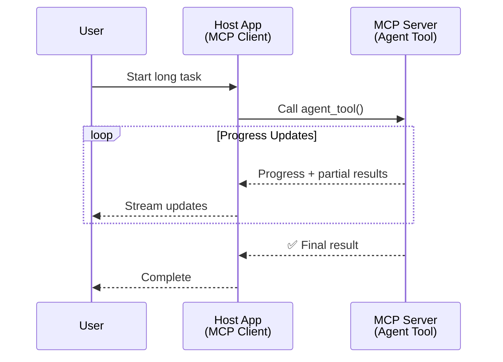
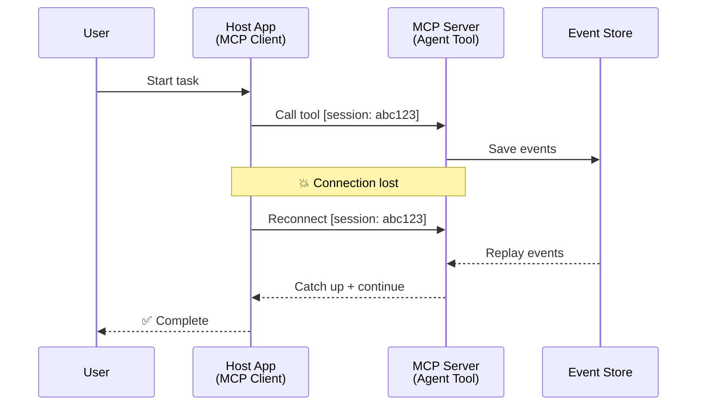
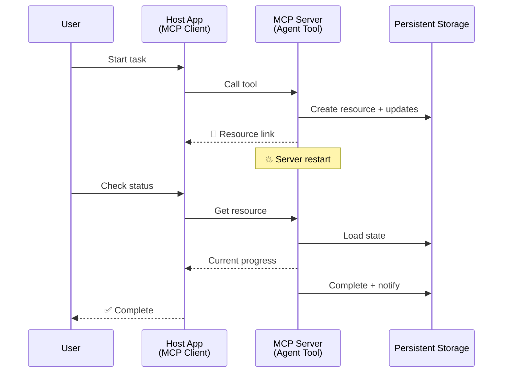
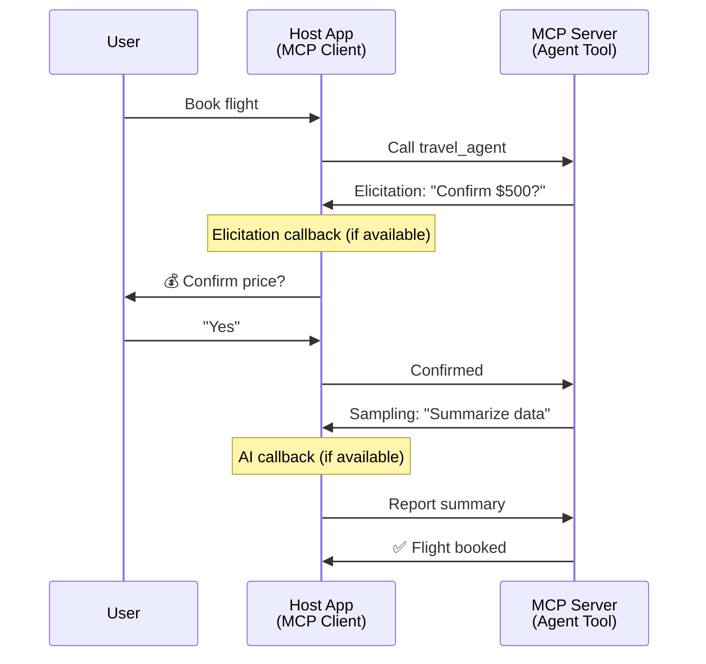
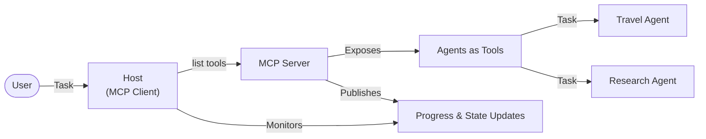

<!--
CO_OP_TRANSLATOR_METADATA:
{
  "original_hash": "5cc6836626047aa055e8960c8484a7d0",
  "translation_date": "2025-08-29T13:26:54+00:00",
  "source_file": "11-agentic-protocols/code_samples/mcp-agents/README.md",
  "language_code": "mo"
}
-->
# 使用 MCP 建立代理與代理之間的通信系統

> 簡而言之 - 可以在 MCP 上建立代理間通信嗎？答案是肯定的！

MCP 的功能已大幅超越其最初「為 LLM 提供上下文」的目標。隨著最近的增強功能，包括[可恢復的流](https://modelcontextprotocol.io/docs/concepts/transports#resumability-and-redelivery)、[引導](https://modelcontextprotocol.io/specification/2025-06-18/client/elicitation)、[採樣](https://modelcontextprotocol.io/specification/2025-06-18/client/sampling)以及通知（[進度](https://modelcontextprotocol.io/specification/2025-06-18/basic/utilities/progress)和[資源](https://modelcontextprotocol.io/specification/2025-06-18/schema#resourceupdatednotification)），MCP 現在提供了一個穩健的基礎，用於構建複雜的代理間通信系統。

## 代理/工具的誤解

隨著越來越多的開發者探索具有代理行為的工具（運行時間長，可能需要在執行過程中額外輸入等），一個常見的誤解是 MCP 不適合這些用途，主要是因為其早期工具範例集中於簡單的請求-響應模式。

這種看法已過時。MCP 規範在過去幾個月中已顯著增強，提供了支持長時間運行代理行為的能力：

- **流式傳輸與部分結果**：執行過程中的實時進度更新
- **可恢復性**：客戶端斷線後可重新連接並繼續
- **持久性**：結果在伺服器重啟後仍然存在（例如通過資源鏈接）
- **多輪交互**：執行過程中的交互式輸入（通過引導和採樣）

這些功能可以組合使用，以支持複雜的代理行為和多代理應用，所有這些都可以部署在 MCP 協議上。

在本文中，我們將把代理稱為 MCP 伺服器上可用的「工具」。這意味著存在一個主機應用程式，它實現了 MCP 客戶端，並與 MCP 伺服器建立會話以調用代理。

## MCP 工具如何具備「代理性」？

在深入實現之前，我們先來確定支持長時間運行代理所需的基礎設施能力。

> 我們將代理定義為一個能夠在長時間內自主運作的實體，能夠處理可能需要多次交互或根據實時反饋進行調整的複雜任務。

### 1. 流式傳輸與部分結果

傳統的請求-響應模式不適用於長時間運行的任務。代理需要提供：

- 實時進度更新
- 中間結果

**MCP 支持**：資源更新通知支持流式部分結果，但需要仔細設計以避免與 JSON-RPC 的 1:1 請求/響應模型衝突。

| 功能                     | 使用案例                                                                                                                                                                       | MCP 支持                                                                                  |
| ------------------------ | ------------------------------------------------------------------------------------------------------------------------------------------------------------------------------ | ------------------------------------------------------------------------------------------ |
| 實時進度更新             | 使用者請求代碼庫遷移任務。代理流式傳輸進度：「10% - 分析依賴項... 25% - 轉換 TypeScript 文件... 50% - 更新導入...」                                                          | ✅ 進度通知                                                                                 |
| 部分結果                 | 「生成一本書」任務流式傳輸部分結果，例如：1）故事情節大綱，2）章節列表，3）每個完成的章節。主機可以在任何階段檢查、取消或重定向。                                           | ✅ 通知可以「擴展」以包含部分結果，參見 PR 383、776 的提案                                  |

<div align="center" style="font-style: italic; font-size: 0.95em; margin-bottom: 0.5em;">
<strong>圖 1：</strong> 此圖展示了 MCP 代理如何在長時間運行的任務期間向主機應用程式流式傳輸實時進度更新和部分結果，使使用者能夠實時監控執行情況。
</div>



### 2. 可恢復性

代理必須能夠優雅地處理網絡中斷：

- 在（客戶端）斷線後重新連接
- 從中斷處繼續（消息重發）

**MCP 支持**：MCP StreamableHTTP 傳輸目前支持會話恢復和消息重發，通過會話 ID 和最後事件 ID 實現。需要注意的是，伺服器必須實現一個 EventStore，允許客戶端重新連接時重播事件。  
此外，社群提案（PR #975）正在探索與傳輸無關的可恢復流。

| 功能         | 使用案例                                                                                                                                                   | MCP 支持                                                                |
| ------------ | ---------------------------------------------------------------------------------------------------------------------------------------------------------- | -------------------------------------------------------------------------- |
| 可恢復性     | 客戶端在長時間運行的任務期間斷線。重新連接後，會話恢復，重播丟失的事件，無縫繼續執行。                                                                     | ✅ StreamableHTTP 傳輸支持會話 ID、事件重播和 EventStore                   |

<div align="center" style="font-style: italic; font-size: 0.95em; margin-bottom: 0.5em;">
<strong>圖 2：</strong> 此圖展示了 MCP 的 StreamableHTTP 傳輸和事件存儲如何實現無縫的會話恢復：如果客戶端斷線，它可以重新連接並重播丟失的事件，繼續任務而不丟失進度。
</div>



### 3. 持久性

長時間運行的代理需要持久的狀態：

- 結果在伺服器重啟後仍然存在
- 狀態可以通過外部方式檢索
- 跨會話的進度跟踪

**MCP 支持**：MCP 現在支持工具調用的資源鏈接返回類型。當前，一種可能的模式是設計一個工具，創建一個資源並立即返回資源鏈接。該工具可以在後台繼續處理任務並更新資源。客戶端可以選擇輪詢該資源的狀態以獲取部分或完整結果（基於伺服器提供的資源更新）或訂閱資源以接收更新通知。

需要注意的是，輪詢資源或訂閱更新可能會消耗資源，並在規模上產生影響。社群提案（包括 #992）正在探索伺服器可以調用的 webhook 或觸發器，以通知客戶端/主機應用程式更新。

| 功能         | 使用案例                                                                                                                                        | MCP 支持                                                        |
| ------------ | ----------------------------------------------------------------------------------------------------------------------------------------------- | ------------------------------------------------------------------ |
| 持久性       | 伺服器在數據遷移任務期間崩潰。結果和進度在重啟後仍然存在，客戶端可以檢查狀態並從持久資源繼續。                                                   | ✅ 資源鏈接支持持久存儲和狀態通知                                 |

目前，一種常見模式是設計一個工具，創建一個資源並立即返回資源鏈接。該工具可以在後台處理任務，發出資源通知作為進度更新或包含部分結果，並根據需要更新資源中的內容。

<div align="center" style="font-style: italic; font-size: 0.95em; margin-bottom: 0.5em;">
<strong>圖 3：</strong> 此圖展示了 MCP 代理如何使用持久資源和狀態通知，確保長時間運行的任務在伺服器重啟後仍然存在，允許客戶端檢查進度並檢索結果，即使發生故障。
</div>



### 4. 多輪交互

代理通常需要在執行過程中額外的輸入：

- 人類的澄清或批准
- AI 的協助以進行複雜決策
- 動態參數調整

**MCP 支持**：完全支持採樣（用於 AI 輸入）和引導（用於人類輸入）。

| 功能                 | 使用案例                                                                                                                                     | MCP 支持                                           |
| -------------------- | -------------------------------------------------------------------------------------------------------------------------------------------- | ----------------------------------------------------- |
| 多輪交互             | 旅行預訂代理請求使用者確認價格，然後要求 AI 總結旅行數據，最後完成預訂交易。                                                                 | ✅ 引導支持人類輸入，採樣支持 AI 輸入               |

<div align="center" style="font-style: italic; font-size: 0.95em; margin-bottom: 0.5em;">
<strong>圖 4：</strong> 此圖展示了 MCP 代理如何在執行過程中交互式地引導人類輸入或請求 AI 協助，支持複雜的多輪工作流程，例如確認和動態決策。
</div>



## 在 MCP 上實現長時間運行代理 - 代碼概述

作為本文的一部分，我們提供了一個[代碼庫](https://github.com/victordibia/ai-tutorials/tree/main/MCP%20Agents)，其中包含使用 MCP Python SDK 和 StreamableHTTP 傳輸實現的長時間運行代理的完整示例。該實現展示了如何組合 MCP 的功能以支持複雜的代理行為。

具體而言，我們實現了一個伺服器，包含兩個主要代理工具：

- **旅行代理** - 模擬旅行預訂服務，通過引導進行價格確認
- **研究代理** - 執行研究任務，通過採樣進行 AI 協助總結

這兩個代理展示了實時進度更新、交互式確認以及完整的會話恢復功能。

### 關鍵實現概念

以下部分展示了伺服器端代理實現和客戶端主機處理每項功能的方式：

#### 流式傳輸與進度更新 - 實時任務狀態

流式傳輸使代理能夠在長時間運行的任務期間提供實時進度更新，讓使用者了解任務狀態和中間結果。

**伺服器實現（代理發送進度通知）：**

```python
# From server/server.py - Travel agent sending progress updates
for i, step in enumerate(steps):
    await ctx.session.send_progress_notification(
        progress_token=ctx.request_id,
        progress=i * 25,
        total=100,
        message=step,
        related_request_id=str(ctx.request_id)
    )
    await anyio.sleep(2)  # Simulate work

# Alternative: Log messages for detailed step-by-step updates
await ctx.session.send_log_message(
    level="info",
    data=f"Processing step {current_step}/{steps} ({progress_percent}%)",
    logger="long_running_agent",
    related_request_id=ctx.request_id,
)
```

**客戶端實現（主機接收進度更新）：**

```python
# From client/client.py - Client handling real-time notifications
async def message_handler(message) -> None:
    if isinstance(message, types.ServerNotification):
        if isinstance(message.root, types.LoggingMessageNotification):
            console.print(f"📡 [dim]{message.root.params.data}[/dim]")
        elif isinstance(message.root, types.ProgressNotification):
            progress = message.root.params
            console.print(f"🔄 [yellow]{progress.message} ({progress.progress}/{progress.total})[/yellow]")

# Register message handler when creating session
async with ClientSession(
    read_stream, write_stream,
    message_handler=message_handler
) as session:
```

#### 引導 - 請求使用者輸入

引導使代理能夠在執行過程中請求使用者輸入。這對於長時間運行任務中的確認、澄清或批准至關重要。

**伺服器實現（代理請求確認）：**

```python
# From server/server.py - Travel agent requesting price confirmation
elicit_result = await ctx.session.elicit(
    message=f"Please confirm the estimated price of $1200 for your trip to {destination}",
    requestedSchema=PriceConfirmationSchema.model_json_schema(),
    related_request_id=ctx.request_id,
)

if elicit_result and elicit_result.action == "accept":
    # Continue with booking
    logger.info(f"User confirmed price: {elicit_result.content}")
elif elicit_result and elicit_result.action == "decline":
    # Cancel the booking
    booking_cancelled = True
```

**客戶端實現（主機提供引導回調）：**

```python
# From client/client.py - Client handling elicitation requests
async def elicitation_callback(context, params):
    console.print(f"💬 Server is asking for confirmation:")
    console.print(f"   {params.message}")

    response = console.input("Do you accept? (y/n): ").strip().lower()

    if response in ['y', 'yes']:
        return types.ElicitResult(
            action="accept",
            content={"confirm": True, "notes": "Confirmed by user"}
        )
    else:
        return types.ElicitResult(
            action="decline",
            content={"confirm": False, "notes": "Declined by user"}
        )

# Register the callback when creating the session
async with ClientSession(
    read_stream, write_stream,
    elicitation_callback=elicitation_callback
) as session:
```

#### 採樣 - 請求 AI 協助

採樣使代理能夠在執行過程中請求 LLM 協助進行複雜決策或內容生成。這支持人類與 AI 的混合工作流程。

**伺服器實現（代理請求 AI 協助）：**

```python
# From server/server.py - Research agent requesting AI summary
sampling_result = await ctx.session.create_message(
    messages=[
        SamplingMessage(
            role="user",
            content=TextContent(type="text", text=f"Please summarize the key findings for research on: {topic}")
        )
    ],
    max_tokens=100,
    related_request_id=ctx.request_id,
)

if sampling_result and sampling_result.content:
    if sampling_result.content.type == "text":
        sampling_summary = sampling_result.content.text
        logger.info(f"Received sampling summary: {sampling_summary}")
```

**客戶端實現（主機提供採樣回調）：**

```python
# From client/client.py - Client handling sampling requests
async def sampling_callback(context, params):
    message_text = params.messages[0].content.text if params.messages else 'No message'
    console.print(f"🧠 Server requested sampling: {message_text}")

    # In a real application, this could call an LLM API
    # For demo purposes, we provide a mock response
    mock_response = "Based on current research, MCP has evolved significantly..."

    return types.CreateMessageResult(
        role="assistant",
        content=types.TextContent(type="text", text=mock_response),
        model="interactive-client",
        stopReason="endTurn"
    )

# Register the callback when creating the session
async with ClientSession(
    read_stream, write_stream,
    sampling_callback=sampling_callback,
    elicitation_callback=elicitation_callback
) as session:
```

#### 可恢復性 - 跨斷線的會話連續性

可恢復性確保長時間運行的代理任務能夠在客戶端斷線後存活，並在重新連接時無縫繼續。這通過事件存儲和恢復令牌實現。

**事件存儲實現（伺服器保存會話狀態）：**

```python
# From server/event_store.py - Simple in-memory event store
class SimpleEventStore(EventStore):
    def __init__(self):
        self._events: list[tuple[StreamId, EventId, JSONRPCMessage]] = []
        self._event_id_counter = 0

    async def store_event(self, stream_id: StreamId, message: JSONRPCMessage) -> EventId:
        """Store an event and return its ID."""
        self._event_id_counter += 1
        event_id = str(self._event_id_counter)
        self._events.append((stream_id, event_id, message))
        return event_id

    async def replay_events_after(self, last_event_id: EventId, send_callback: EventCallback) -> StreamId | None:
        """Replay events after the specified ID for resumption."""
        # Find events after the last known event and replay them
        for _, event_id, message in self._events[start_index:]:
            await send_callback(EventMessage(message, event_id))

# From server/server.py - Passing event store to session manager
def create_server_app(event_store: Optional[EventStore] = None) -> Starlette:
    server = ResumableServer()

    # Create session manager with event store for resumption
    session_manager = StreamableHTTPSessionManager(
        app=server,
        event_store=event_store,  # Event store enables session resumption
        json_response=False,
        security_settings=security_settings,
    )

    return Starlette(routes=[Mount("/mcp", app=session_manager.handle_request)])

# Usage: Initialize with event store
event_store = SimpleEventStore()
app = create_server_app(event_store)
```

**客戶端元數據與恢復令牌（客戶端使用存儲的狀態重新連接）：**

```python
# From client/client.py - Client resumption with metadata
if existing_tokens and existing_tokens.get("resumption_token"):
    # Use existing resumption token to continue where we left off
    metadata = ClientMessageMetadata(
        resumption_token=existing_tokens["resumption_token"],
    )
else:
    # Create callback to save resumption token when received
    def enhanced_callback(token: str):
        protocol_version = getattr(session, 'protocol_version', None)
        token_manager.save_tokens(session_id, token, protocol_version, command, args)

    metadata = ClientMessageMetadata(
        on_resumption_token_update=enhanced_callback,
    )

# Send request with resumption metadata
result = await session.send_request(
    types.ClientRequest(
        types.CallToolRequest(
            method="tools/call",
            params=types.CallToolRequestParams(name=command, arguments=args)
        )
    ),
    types.CallToolResult,
    metadata=metadata,
)
```

主機應用程式在本地維護會話 ID 和恢復令牌，使其能夠重新連接到現有會話，而不丟失進度或狀態。

### 代碼組織

<div align="center" style="font-style: italic; font-size: 0.95em; margin-bottom: 0.5em;">
<strong>圖 5：</strong> 基於 MCP 的代理系統架構
</div>



**關鍵文件：**

- **`server/server.py`** - 支持恢復的 MCP 伺服器，包含展示引導、採樣和進度更新的旅行和研究代理
- **`client/client.py`** - 交互式主機應用程式，支持恢復功能、回調處理和令牌管理
- **`server/event_store.py`** - 事件存儲實現，支持會話恢復和消息重發

## 在 MCP 上擴展到多代理通信

上述實現可以通過增強主機應用程式的智能和範圍擴展到多代理系統：

- **智能任務分解**：主機分析複雜的使用者請求，並將其分解為不同專業代理的子任務
- **多伺服器協調**：主機維護與多個 MCP 伺服器的連接，每個伺服器提供不同的代理功能
- **任務狀態管理**：主機跟踪多個並行代理任務的進度，處理依賴關係和排序
- **韌性與重試**：主機管理故障，實現重試邏輯，並在代理不可用時重新路由任務
- **結果合成**：主機將多個代理的輸出結合成一致的最終結果

主機從簡單的客戶端演變為智能的協調者，協調分佈式代理功能，同時保持 MCP 協議的基礎。

## 結論

MCP 的增強功能——資源通知、引導/採樣、可恢復流和持久資源——在保持協議簡單性的同時，支持複雜的代理間交互。

## 開始使用

準備好建立自己的代理間通信系統了嗎？按照以下步驟操作：

### 1. 運行示例

```bash
# Start the server with event store for resumption
python -m server.server --port 8006

# In another terminal, run the interactive client
python -m client.client --url http://127.0.0.1:8006/mcp
```

**交互模式中的可用命令：**

- `travel_agent` - 通過引導進行價格確認的旅行預訂
- `research_agent` - 通過採樣進行 AI 協助總結的研究主題
- `list` - 顯示所有可用工具
- `clean-tokens` - 清除恢復令牌
- `help` - 顯示詳細命令幫助
- `quit` - 退出客戶端

### 2. 測試恢復功能

- 啟動一個長時間運行的代理（例如 `travel_agent`）
- 在執行過程中中斷客戶端（Ctrl+C）
- 重新啟動客戶端 - 它將自動從中斷處恢復

### 3. 探索與擴展

- **探索示例**：查看此[代碼庫](https://github.com/victordibia/ai-tutorials/tree/main/MCP%20Agents)
- **加入社群**：參與 GitHub 上的 MCP 討論
- **嘗試**：從一個簡單的長時間運行任務開始，逐步添加流式傳輸、可恢復性和多代理協調

這展示了 MCP 如何在保持工具簡單性的同時支持智能代理行為。

總體而言，MCP 協議規範正在快速發展；建議讀者查看官方文檔網站以獲取最新更新 - https://modelcontextprotocol.io/introduction

---

**免責聲明**：  
本文件已使用 AI 翻譯服務 [Co-op Translator](https://github.com/Azure/co-op-translator) 進行翻譯。我們致力於提供準確的翻譯，但請注意，自動翻譯可能包含錯誤或不準確之處。應以原始語言的文件作為權威來源。對於關鍵資訊，建議尋求專業人工翻譯。我們對因使用此翻譯而引起的任何誤解或錯誤解讀概不負責。