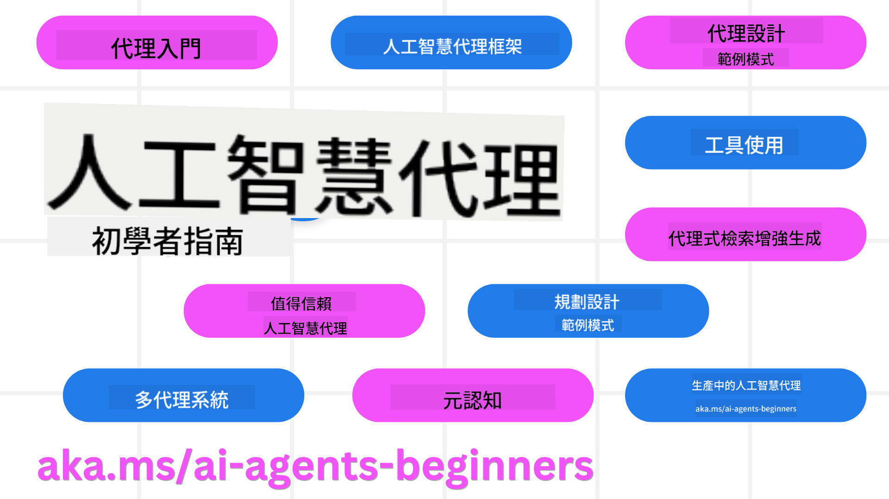

<!--
CO_OP_TRANSLATOR_METADATA:
{
  "original_hash": "6b07046397366e6f6f4524c9ddeba1e1",
  "translation_date": "2025-07-12T14:43:37+00:00",
  "source_file": "README.md",
  "language_code": "mo"
}
-->
# AI Agents for Beginners - 一門課程

## 11堂課教你從零開始打造AI Agents所需的一切知識

  
  
  
  

### 🌐 多語言支援

#### 透過 GitHub Action 支援（自動且隨時更新）

[French](../fr/README.md) | [Spanish](../es/README.md) | [German](../de/README.md) | [Russian](../ru/README.md) | [Arabic](../ar/README.md) | [Persian (Farsi)](../fa/README.md) | [Urdu](../ur/README.md) | [Chinese (Simplified)](../zh/README.md) | [Chinese (Traditional, Macau)](./README.md) | [Chinese (Traditional, Hong Kong)](../hk/README.md) | [Chinese (Traditional, Taiwan)](../tw/README.md) | [Japanese](../ja/README.md) | [Korean](../ko/README.md) | [Hindi](../hi/README.md) | [Bengali](../bn/README.md) | [Marathi](../mr/README.md) | [Nepali](../ne/README.md) | [Punjabi (Gurmukhi)](../pa/README.md) | [Portuguese (Portugal)](../pt/README.md) | [Portuguese (Brazil)](../br/README.md) | [Italian](../it/README.md) | [Polish](../pl/README.md) | [Turkish](../tr/README.md) | [Greek](../el/README.md) | [Thai](../th/README.md) | [Swedish](../sv/README.md) | [Danish](../da/README.md) | [Norwegian](../no/README.md) | [Finnish](../fi/README.md) | [Dutch](../nl/README.md) | [Hebrew](../he/README.md) | [Vietnamese](../vi/README.md) | [Indonesian](../id/README.md) | [Malay](../ms/README.md) | [Tagalog (Filipino)](../tl/README.md) | [Swahili](../sw/README.md) | [Hungarian](../hu/README.md) | [Czech](../cs/README.md) | [Slovak](../sk/README.md) | [Romanian](../ro/README.md) | [Bulgarian](../bg/README.md) | [Serbian (Cyrillic)](../sr/README.md) | [Croatian](../hr/README.md) | [Slovenian](../sl/README.md) | [Ukrainian](../uk/README.md) | [Burmese (Myanmar)](../my/README.md)

**如果你希望支援更多語言，請參考[這裡](https://github.com/Azure/co-op-translator/blob/main/getting_started/supported-languages.md)**

  
  

## 🌱 入門指南

本課程包含11堂課，涵蓋打造AI Agents的基礎知識。每堂課都有獨立主題，歡迎從任何一堂開始學習！

本課程支援多語言，請參考我們的[可用語言列表](../..)。

如果你是第一次使用生成式AI模型，建議先參考我們的[Generative AI For Beginners](https://aka.ms/genai-beginners)課程，內含21堂關於生成式AI的教學。

別忘了[為此倉庫點星 (🌟)](https://docs.github.com/en/get-started/exploring-projects-on-github/saving-repositories-with-stars?WT.mc_id=academic-105485-koreyst)並[Fork此倉庫](https://github.com/microsoft/ai-agents-for-beginners/fork)來執行程式碼。

### 你需要準備的東西

本課程每堂課都包含程式碼範例，位於 code_samples 資料夾。你可以[Fork此倉庫](https://github.com/microsoft/ai-agents-for-beginners/fork)來建立自己的副本。

這些練習中的程式碼範例，使用 Azure AI Foundry 和 GitHub Model Catalogs 來與語言模型互動：

- [Github Models](https://aka.ms/ai-agents-beginners/github-models) - 免費 / 有限制  
- [Azure AI Foundry](https://aka.ms/ai-agents-beginners/ai-foundry) - 需要 Azure 帳號

本課程也使用微軟的以下 AI Agent 框架與服務：

- [Azure AI Agent Service](https://aka.ms/ai-agents-beginners/ai-agent-service)  
- [Semantic Kernel](https://aka.ms/ai-agents-beginners/semantic-kernel)  
- [AutoGen](https://aka.ms/ai-agents/autogen)

想了解如何執行本課程的程式碼，請參考[課程設定](./00-course-setup/README.md)。

## 🙏 想幫忙嗎？

有建議或發現拼字或程式碼錯誤嗎？請[提出 issue](https://github.com/microsoft/ai-agents-for-beginners/issues?WT.mc_id=academic-105485-koreyst)或[送出 pull request](https://github.com/microsoft/ai-agents-for-beginners/pulls?WT.mc_id=academic-105485-koreyst)。

如果遇到困難或有任何關於打造 AI Agents 的問題，歡迎加入我們的[Azure AI Foundry 社群 Discord](https://discord.gg/kzRShWzttr)。

如果你有產品回饋或在開發過程中遇到錯誤，請造訪我們的[Azure AI Foundry 開發者論壇](https://aka.ms/azureaifoundry/forum)。

## 📂 每堂課包含

- 文字教學（位於 README）及短影片  
- 支援 Azure AI Foundry 和 Github Models（免費）的 Python 程式碼範例  
- 延伸學習資源連結  

## 🗃️ 課程列表

| **課程**                               | **文字與程式碼**                                    | **影片**                                                  | **延伸學習**                                                                     |
|------------------------------------------|----------------------------------------------------|------------------------------------------------------------|----------------------------------------------------------------------------------------|
| AI Agents 介紹與應用案例                 | [連結](./01-intro-to-ai-agents/README.md)          | [影片](https://youtu.be/3zgm60bXmQk?si=z8QygFvYQv-9WtO1)  | [連結](https://aka.ms/ai-agents-beginners/collection?WT.mc_id=academic-105485-koreyst) |
| 探索 AI Agentic 框架                    | [連結](./02-explore-agentic-frameworks/README.md)  | [影片](https://youtu.be/ODwF-EZo_O8?si=Vawth4hzVaHv-u0H)  | [連結](https://aka.ms/ai-agents-beginners/collection?WT.mc_id=academic-105485-koreyst) |
| 理解 AI Agentic 設計模式                | [連結](./03-agentic-design-patterns/README.md)     | [影片](https://youtu.be/m9lM8qqoOEA?si=BIzHwzstTPL8o9GF)  | [連結](https://aka.ms/ai-agents-beginners/collection?WT.mc_id=academic-105485-koreyst) |
| 工具使用設計模式                       | [連結](./04-tool-use/README.md)                    | [影片](https://youtu.be/vieRiPRx-gI?si=2z6O2Xu2cu_Jz46N)  | [連結](https://aka.ms/ai-agents-beginners/collection?WT.mc_id=academic-105485-koreyst) |
| Agentic RAG                            | [連結](./05-agentic-rag/README.md)                 | [影片](https://youtu.be/WcjAARvdL7I?si=gKPWsQpKiIlDH9A3)  | [連結](https://aka.ms/ai-agents-beginners/collection?WT.mc_id=academic-105485-koreyst) |
| 建立值得信賴的 AI Agents                | [連結](./06-building-trustworthy-agents/README.md) | [影片](https://youtu.be/iZKkMEGBCUQ?si=jZjpiMnGFOE9L8OK ) | [連結](https://aka.ms/ai-agents-beginners/collection?WT.mc_id=academic-105485-koreyst) |
| 規劃設計模式                          | [連結](./07-planning-design/README.md)             | [影片](https://youtu.be/kPfJ2BrBCMY?si=6SC_iv_E5-mzucnC)  | [連結](https://aka.ms/ai-agents-beginners/collection?WT.mc_id=academic-105485-koreyst) |
| 多代理設計模式                        | [連結](./08-multi-agent/README.md)                 | [影片](https://youtu.be/V6HpE9hZEx0?si=rMgDhEu7wXo2uo6g)  | [連結](https://aka.ms/ai-agents-beginners/collection?WT.mc_id=academic-105485-koreyst) |
| 元認知設計模式                        | [連結](./09-metacognition/README.md)               | [影片](https://youtu.be/His9R6gw6Ec?si=8gck6vvdSNCt6OcF)  | [連結](https://aka.ms/ai-agents-beginners/collection?WT.mc_id=academic-105485-koreyst) |
| AI Agents 在生產環境中的應用            | [連結](./10-ai-agents-production/README.md)        | [影片](https://youtu.be/l4TP6IyJxmQ?si=31dnhexRo6yLRJDl)  | [連結](https://aka.ms/ai-agents-beginners/collection?WT.mc_id=academic-105485-koreyst) |
| 使用 MCP 的 AI Agents                  | [連結](./11-mcp/README.md)                         |                                                            | [連結](https://aka.ms/mcp-for-beginners)                                               |

## 🎒 其他課程

我們團隊還有其他課程！歡迎參考：
- [**NEW** Model Context Protocol (MCP) For Beginners](https://github.com/microsoft/mcp-for-beginners?WT.mc_id=academic-105485-koreyst)
- [Generative AI for Beginners using .NET](https://github.com/microsoft/Generative-AI-for-beginners-dotnet?WT.mc_id=academic-105485-koreyst)
- [Generative AI for Beginners](https://github.com/microsoft/generative-ai-for-beginners?WT.mc_id=academic-105485-koreyst)
- [ML for Beginners](https://aka.ms/ml-beginners?WT.mc_id=academic-105485-koreyst)
- [Data Science for Beginners](https://aka.ms/datascience-beginners?WT.mc_id=academic-105485-koreyst)
- [AI for Beginners](https://aka.ms/ai-beginners?WT.mc_id=academic-105485-koreyst)
- [Cybersecurity for Beginners](https://github.com/microsoft/Security-101??WT.mc_id=academic-96948-sayoung)
- [Web Dev for Beginners](https://aka.ms/webdev-beginners?WT.mc_id=academic-105485-koreyst)
- [IoT for Beginners](https://aka.ms/iot-beginners?WT.mc_id=academic-105485-koreyst)
- [XR Development for Beginners](https://github.com/microsoft/xr-development-for-beginners?WT.mc_id=academic-105485-koreyst)
- [Mastering GitHub Copilot for AI Paired Programming](https://aka.ms/GitHubCopilotAI?WT.mc_id=academic-105485-koreyst)
- [Mastering GitHub Copilot for C#/.NET Developers](https://github.com/microsoft/mastering-github-copilot-for-dotnet-csharp-developers?WT.mc_id=academic-105485-koreyst)
- [Choose Your Own Copilot Adventure](https://github.com/microsoft/CopilotAdventures?WT.mc_id=academic-105485-koreyst)

## 🌟 社群感謝

感謝 [Shivam Goyal](https://www.linkedin.com/in/shivam2003/) 貢獻了展示 Agentic RAG 的重要程式碼範例。

## 貢獻指南

本專案歡迎各種貢獻與建議。大多數貢獻需要您同意一份
Contributor License Agreement (CLA)，聲明您有權利且確實授權我們
使用您的貢獻。詳細資訊請參閱
<https://cla.opensource.microsoft.com>。

當您提交 pull request 時，CLA 機器人會自動判斷您是否需要提供
CLA，並適當標註 PR（例如狀態檢查、留言）。只要依照機器人提供的指示操作即可。
您在所有使用我們 CLA 的倉庫中只需完成此程序一次。

本專案已採用 [Microsoft Open Source Code of Conduct](https://opensource.microsoft.com/codeofconduct/)。
更多資訊請參考 [Code of Conduct FAQ](https://opensource.microsoft.com/codeofconduct/faq/) 或
透過 [opencode@microsoft.com](mailto:opencode@microsoft.com) 聯絡我們，提出任何額外問題或意見。

## 商標

本專案可能包含專案、產品或服務的商標或標誌。授權使用 Microsoft
商標或標誌須遵守並依循
[Microsoft's Trademark & Brand Guidelines](https://www.microsoft.com/legal/intellectualproperty/trademarks/usage/general)。
在本專案修改版本中使用 Microsoft 商標或標誌，不得造成混淆或暗示 Microsoft 贊助。
任何第三方商標或標誌的使用，均須遵守該第三方的相關政策。

**免責聲明**：  
本文件係使用 AI 翻譯服務 [Co-op Translator](https://github.com/Azure/co-op-translator) 進行翻譯。雖然我們致力於確保準確性，但請注意，自動翻譯可能包含錯誤或不準確之處。原始文件的母語版本應視為權威來源。對於重要資訊，建議採用專業人工翻譯。我們不對因使用本翻譯而產生的任何誤解或誤釋負責。