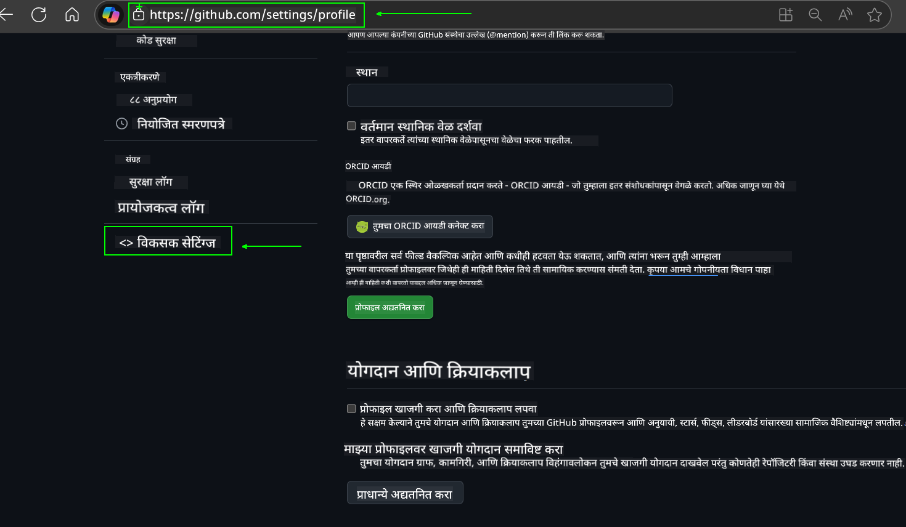
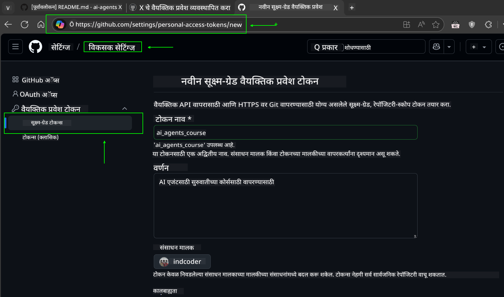
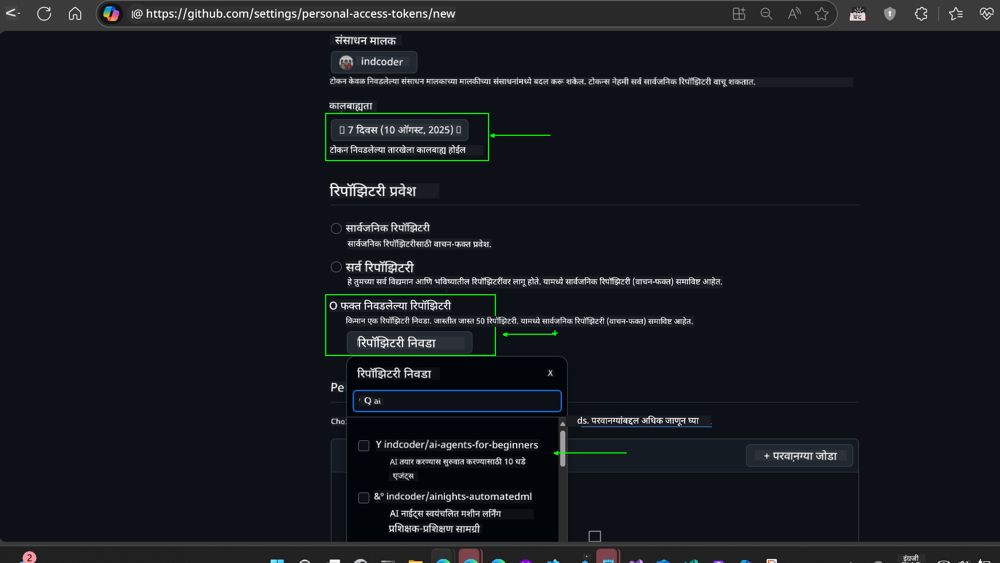
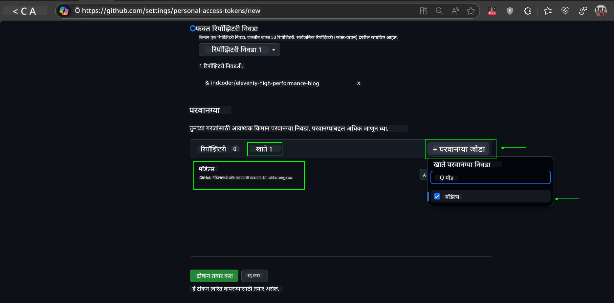
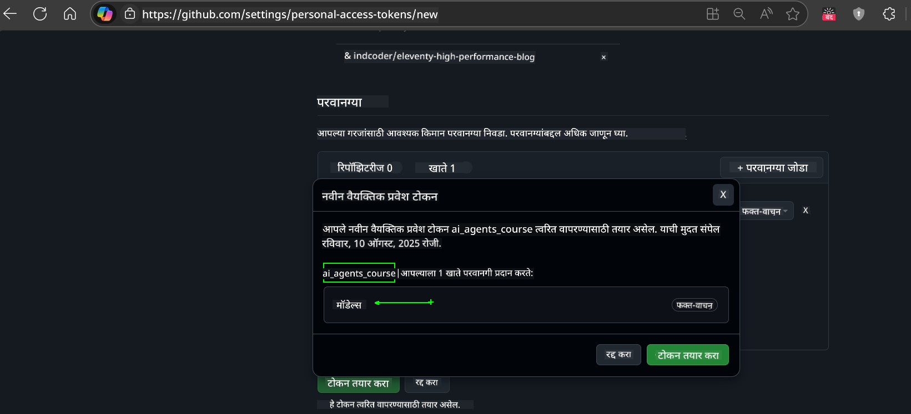
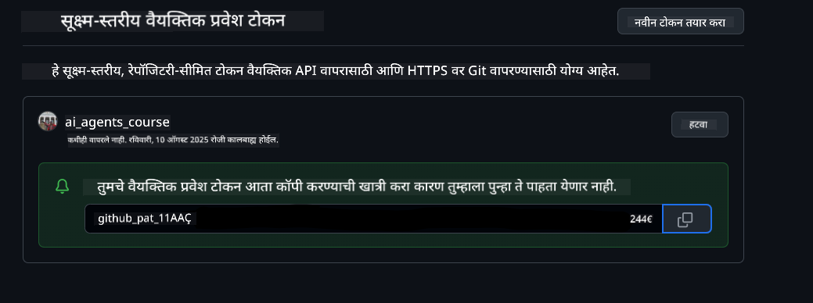
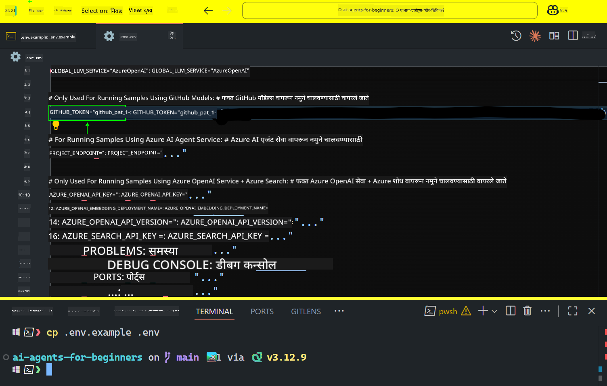

<!--
CO_OP_TRANSLATOR_METADATA:
{
  "original_hash": "8693a24942b670e3cb8def77f92513f9",
  "translation_date": "2025-08-21T12:44:03+00:00",
  "source_file": "00-course-setup/README.md",
  "language_code": "mr"
}
-->
# कोर्स सेटअप

## परिचय

या धड्यात आपण या कोर्समधील कोड नमुने कसे चालवायचे ते शिकणार आहोत.

## हे रेपो क्लोन किंवा फोर्क करा

सुरुवातीस, कृपया GitHub रेपॉजिटरी क्लोन किंवा फोर्क करा. यामुळे कोर्स मटेरियलची तुमची स्वतःची आवृत्ती तयार होईल, ज्यामुळे तुम्ही कोड चालवू, चाचणी करू आणि त्यात बदल करू शकाल!

हे खालील लिंकवर क्लिक करून करता येईल:


## कोड चालवणे

या कोर्समध्ये Jupyter Notebooks चा एक संच आहे, ज्याद्वारे तुम्हाला AI एजंट्स तयार करण्याचा प्रत्यक्ष अनुभव मिळेल.

कोड नमुने खालीलपैकी कोणत्याही प्रकारे चालवले जातात:

**GitHub खाते आवश्यक - मोफत**:

1) Semantic Kernel Agent Framework + GitHub Models Marketplace. (semantic-kernel.ipynb) म्हणून लेबल केलेले.
2) AutoGen Framework + GitHub Models Marketplace. (autogen.ipynb) म्हणून लेबल केलेले.

**Azure सदस्यता आवश्यक**:
3) Azure AI Foundry + Azure AI Agent Service. (azureaiagent.ipynb) म्हणून लेबल केलेले.

तुमच्यासाठी कोणता प्रकार चांगला आहे हे पाहण्यासाठी आम्ही तुम्हाला सर्व तीन प्रकारांचे उदाहरण वापरून पाहण्याची शिफारस करतो.

तुम्ही कोणताही पर्याय निवडला तरी, खालील सेटअप चरणांपैकी कोणते अनुसरण करायचे ते ठरवले जाईल:

## आवश्यकताः

- Python 3.12+
  - **NOTE**: जर तुमच्याकडे Python3.12 स्थापित नसेल, तर ते स्थापित करा. नंतर requirements.txt फाइलमधून योग्य आवृत्त्या स्थापित करण्यासाठी python3.12 वापरून तुमचे venv तयार करा.
- GitHub खाते - GitHub Models Marketplace मध्ये प्रवेशासाठी
- Azure सदस्यता - Azure AI Foundry मध्ये प्रवेशासाठी
- Azure AI Foundry खाते - Azure AI Agent Service मध्ये प्रवेशासाठी

या रेपॉजिटरीच्या मूळ फोल्डरमध्ये `requirements.txt` फाइल समाविष्ट आहे, ज्यामध्ये कोड नमुने चालवण्यासाठी आवश्यक असलेल्या सर्व Python पॅकेजेस आहेत.

तुम्ही ती खालील कमांड चालवून स्थापित करू शकता:

```bash
pip install -r requirements.txt
```
संघर्ष आणि समस्या टाळण्यासाठी Python वर्चुअल एन्व्हायर्नमेंट तयार करण्याची शिफारस केली जाते.

## VSCode सेटअप करा
VSCode मध्ये योग्य Python आवृत्ती वापरत असल्याची खात्री करा.


## GitHub Models वापरून नमुन्यांसाठी सेटअप 

### पायरी 1: तुमचा GitHub Personal Access Token (PAT) मिळवा

हा कोर्स GitHub Models Marketplace चा उपयोग करतो, जो तुम्हाला मोठ्या भाषा मॉडेल्स (LLMs) मोफत वापरण्याची परवानगी देतो, ज्याद्वारे तुम्ही AI एजंट्स तयार करू शकता.

GitHub Models वापरण्यासाठी, तुम्हाला [GitHub Personal Access Token](https://docs.github.com/en/authentication/keeping-your-account-and-data-secure/managing-your-personal-access-tokens) तयार करावा लागेल.

हे तुमच्या GitHub खात्यात जाऊन करता येईल.

कृपया [Principle of Least Privilege](https://docs.github.com/en/get-started/learning-to-code/storing-your-secrets-safely) चे अनुसरण करा. याचा अर्थ तुमच्या टोकनला फक्त कोर्समधील कोड नमुने चालवण्यासाठी आवश्यक असलेल्या परवानग्या द्या.

1. **Developer settings** मध्ये जाऊन डाव्या बाजूला `Fine-grained tokens` पर्याय निवडा.
   

    नंतर `Generate new token` निवडा.

    

2. तुमच्या टोकनसाठी एक वर्णनात्मक नाव द्या, जे त्याचा उद्देश स्पष्ट करते आणि नंतर ओळखणे सोपे होईल.

    🔐 टोकन कालावधी शिफारस

    शिफारस केलेला कालावधी: 30 दिवस  
    अधिक सुरक्षिततेसाठी, तुम्ही 7 दिवसांसारखा कमी कालावधी निवडू शकता 🛡️  
    हे कोर्स पूर्ण करण्यासाठी एक वैयक्तिक लक्ष्य सेट करण्याचा चांगला मार्ग आहे 🚀.

    

3. टोकनचा स्कोप या रेपॉजिटरीच्या फोर्कपुरता मर्यादित ठेवा.

    

4. टोकनच्या परवानग्या मर्यादित करा: **Permissions** अंतर्गत, **Account** टॅबवर क्लिक करा आणि "+ Add permissions" बटणावर क्लिक करा. एक ड्रॉपडाउन दिसेल. कृपया **Models** शोधा आणि त्यासाठी बॉक्स तपासा.
    

5. टोकन तयार करण्यापूर्वी आवश्यक परवानग्या सत्यापित करा. 

6. टोकन तयार करण्यापूर्वी, ते सुरक्षित ठिकाणी जसे की पासवर्ड मॅनेजर व्हॉल्टमध्ये साठवण्यासाठी तयार आहात याची खात्री करा, कारण ते तयार केल्यानंतर पुन्हा दाखवले जाणार नाही. 

तुम्ही नुकतेच तयार केलेले तुमचे नवीन टोकन कॉपी करा. आता तुम्ही ते या कोर्समध्ये समाविष्ट असलेल्या `.env` फाइलमध्ये जोडाल.

### पायरी 2: तुमची `.env` फाइल तयार करा

तुमची `.env` फाइल तयार करण्यासाठी, तुमच्या टर्मिनलमध्ये खालील कमांड चालवा.

```bash
cp .env.example .env
```

हे उदाहरण फाइल कॉपी करेल आणि तुमच्या डिरेक्टरीमध्ये `.env` तयार करेल, जिथे तुम्ही पर्यावरणीय चलांसाठी मूल्ये भरणे आवश्यक आहे.

तुमचे टोकन कॉपी केल्यानंतर, तुमच्या आवडत्या टेक्स्ट एडिटरमध्ये `.env` फाइल उघडा आणि `GITHUB_TOKEN` फील्डमध्ये तुमचे टोकन पेस्ट करा.  


आता तुम्ही या कोर्समधील कोड नमुने चालवू शकता.

## Azure AI Foundry आणि Azure AI Agent Service वापरून नमुन्यांसाठी सेटअप

### पायरी 1: तुमचा Azure प्रकल्प Endpoint मिळवा

Azure AI Foundry मध्ये हब आणि प्रकल्प तयार करण्यासाठी [Hub resources overview](https://learn.microsoft.com/en-us/azure/ai-foundry/concepts/ai-resources) येथे दिलेल्या चरणांचे अनुसरण करा.

तुमचा प्रकल्प तयार केल्यानंतर, तुम्हाला तुमच्या प्रकल्पासाठी कनेक्शन स्ट्रिंग मिळवणे आवश्यक आहे.

हे Azure AI Foundry पोर्टलमधील तुमच्या प्रकल्पाच्या **Overview** पृष्ठावर जाऊन करता येईल.


### पायरी 2: तुमची `.env` फाइल तयार करा

तुमची `.env` फाइल तयार करण्यासाठी, तुमच्या टर्मिनलमध्ये खालील कमांड चालवा.

```bash
cp .env.example .env
```

हे उदाहरण फाइल कॉपी करेल आणि तुमच्या डिरेक्टरीमध्ये `.env` तयार करेल, जिथे तुम्ही पर्यावरणीय चलांसाठी मूल्ये भरणे आवश्यक आहे.

तुमचे टोकन कॉपी केल्यानंतर, तुमच्या आवडत्या टेक्स्ट एडिटरमध्ये `.env` फाइल उघडा आणि `PROJECT_ENDPOINT` फील्डमध्ये तुमचे टोकन पेस्ट करा.

### पायरी 3: Azure मध्ये साइन इन करा

सुरक्षिततेसाठी सर्वोत्तम पद्धती म्हणून, आपण Microsoft Entra ID सह Azure OpenAI मध्ये प्रमाणीकरण करण्यासाठी [keyless authentication](https://learn.microsoft.com/azure/developer/ai/keyless-connections?tabs=csharp%2Cazure-cli?WT.mc_id=academic-105485-koreyst) वापरणार आहोत.

पुढे, टर्मिनल उघडा आणि `az login --use-device-code` चालवून तुमच्या Azure खात्यात साइन इन करा.

तुम्ही लॉग इन केल्यानंतर, टर्मिनलमध्ये तुमची सदस्यता निवडा.

## अतिरिक्त पर्यावरणीय चल - Azure Search आणि Azure OpenAI

Agentic RAG धडा - धडा 5 - मध्ये Azure Search आणि Azure OpenAI वापरणारे नमुने आहेत.

जर तुम्हाला हे नमुने चालवायचे असतील, तर तुम्हाला तुमच्या `.env` फाइलमध्ये खालील पर्यावरणीय चल जोडावे लागतील:

### Overview Page (Project)

- `AZURE_SUBSCRIPTION_ID` - तुमच्या प्रकल्पाच्या **Overview** पृष्ठावरील **Project details** तपासा.

- `AZURE_AI_PROJECT_NAME` - तुमच्या प्रकल्पाच्या **Overview** पृष्ठाच्या शीर्षस्थानी पहा.

- `AZURE_OPENAI_SERVICE` - **Overview** पृष्ठावरील **Azure OpenAI Service** साठी **Included capabilities** टॅबमध्ये शोधा.

### Management Center

- `AZURE_OPENAI_RESOURCE_GROUP` - **Management Center** च्या **Overview** पृष्ठावरील **Project properties** मध्ये जा.

- `GLOBAL_LLM_SERVICE` - **Connected resources** अंतर्गत, **Azure AI Services** कनेक्शन नाव शोधा. जर सूचीबद्ध नसेल, तर तुमच्या संसाधन गटातील AI Services संसाधन नावासाठी **Azure portal** तपासा.

### Models + Endpoints Page

- `AZURE_OPENAI_EMBEDDING_DEPLOYMENT_NAME` - तुमचा एम्बेडिंग मॉडेल निवडा (उदा., `text-embedding-ada-002`) आणि मॉडेल तपशीलांमधून **Deployment name** लक्षात ठेवा.

- `AZURE_OPENAI_CHAT_DEPLOYMENT_NAME` - तुमचा चॅट मॉडेल निवडा (उदा., `gpt-4o-mini`) आणि मॉडेल तपशीलांमधून **Deployment name** लक्षात ठेवा.

### Azure Portal

- `AZURE_OPENAI_ENDPOINT` - **Azure AI services** शोधा, त्यावर क्लिक करा, नंतर **Resource Management**, **Keys and Endpoint** वर जा, "Azure OpenAI endpoints" पर्यंत स्क्रोल करा आणि "Language APIs" म्हणणारे कॉपी करा.

- `AZURE_OPENAI_API_KEY` - त्याच स्क्रीनवरून, KEY 1 किंवा KEY 2 कॉपी करा.

- `AZURE_SEARCH_SERVICE_ENDPOINT` - तुमचा **Azure AI Search** संसाधन शोधा, त्यावर क्लिक करा आणि **Overview** पहा.

- `AZURE_SEARCH_API_KEY` - नंतर **Settings** आणि **Keys** वर जा आणि प्राथमिक किंवा दुय्यम प्रशासकीय की कॉपी करा.

### बाह्य वेबपृष्ठ

- `AZURE_OPENAI_API_VERSION` - [API version lifecycle](https://learn.microsoft.com/en-us/azure/ai-services/openai/api-version-deprecation#latest-ga-api-release) पृष्ठावर **Latest GA API release** अंतर्गत भेट द्या.

### Keyless Authentication सेटअप करा

तुमचे क्रेडेन्शियल्स हार्डकोड करण्याऐवजी, आपण Azure OpenAI सह keyless कनेक्शन वापरणार आहोत. यासाठी, आपण `DefaultAzureCredential` आयात करू आणि नंतर `DefaultAzureCredential` फंक्शन कॉल करून क्रेडेन्शियल मिळवू.

```python
from azure.identity import DefaultAzureCredential, InteractiveBrowserCredential
```

## कुठे अडकलात?

जर तुम्हाला या सेटअपमध्ये काही समस्या आल्या, तर आमच्या

## पुढील धडा

आता तुम्ही या कोर्ससाठी कोड चालवण्यासाठी तयार आहात. AI एजंट्सच्या जगाबद्दल अधिक शिकण्याचा आनंद घ्या!

[AI एजंट्स आणि एजंट वापर प्रकरणांची ओळख](../01-intro-to-ai-agents/README.md)

**अस्वीकरण**:  
हा दस्तऐवज AI भाषांतर सेवा [Co-op Translator](https://github.com/Azure/co-op-translator) चा वापर करून भाषांतरित करण्यात आला आहे. आम्ही अचूकतेसाठी प्रयत्नशील असलो तरी, कृपया लक्षात घ्या की स्वयंचलित भाषांतरांमध्ये त्रुटी किंवा अचूकतेचा अभाव असू शकतो. मूळ भाषेतील दस्तऐवज हा अधिकृत स्रोत मानला जावा. महत्त्वाच्या माहितीसाठी व्यावसायिक मानवी भाषांतराची शिफारस केली जाते. या भाषांतराचा वापर केल्यामुळे उद्भवणाऱ्या कोणत्याही गैरसमज किंवा चुकीच्या अर्थासाठी आम्ही जबाबदार राहणार नाही.