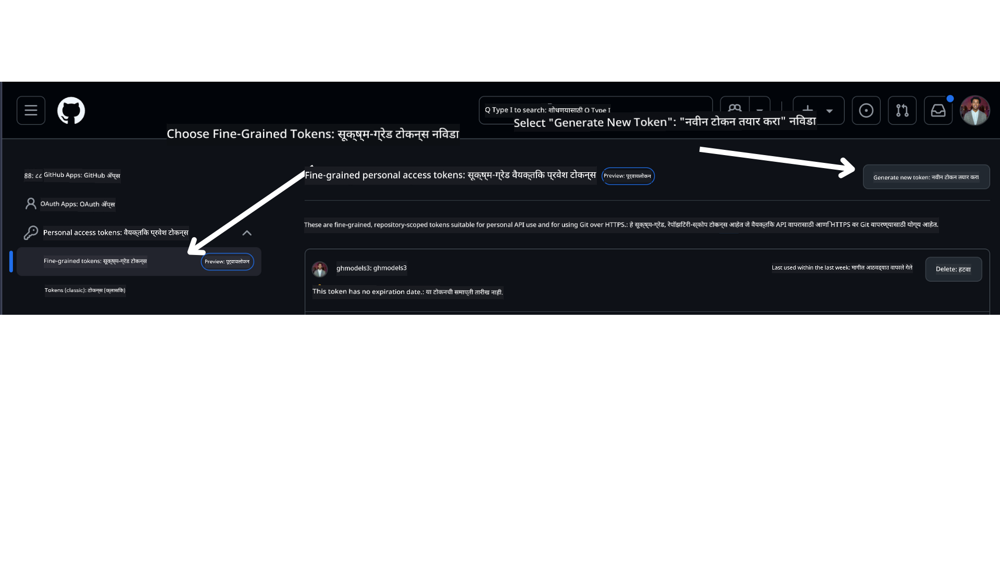

<!--
CO_OP_TRANSLATOR_METADATA:
{
  "original_hash": "76945069b52a49cd0432ae3e0b0ba22e",
  "translation_date": "2025-07-12T07:47:26+00:00",
  "source_file": "00-course-setup/README.md",
  "language_code": "mr"
}
-->
आपल्याकडे आता खालील लिंकवर या कोर्सची आपली स्वतःची फोर्क केलेली आवृत्ती असावी:


## कोड चालविणे

हा कोर्स Jupyter Notebooks ची एक मालिका ऑफर करतो ज्यांना आपण चालवू शकता आणि AI एजंट तयार करण्याचा प्रत्यक्ष अनुभव घेऊ शकता.

कोड नमुने खालीलपैकी कोणत्याही वापरतात:

**GitHub खाते आवश्यक - मोफत**:

1) Semantic Kernel Agent Framework + GitHub Models Marketplace. (semantic-kernel.ipynb) म्हणून लेबल केलेले
2) AutoGen Framework + GitHub Models Marketplace. (autogen.ipynb) म्हणून लेबल केलेले

**Azure सदस्यता आवश्यक**:
3) Azure AI Foundry + Azure AI Agent Service. (azureaiagent.ipynb) म्हणून लेबल केलेले

आपण कोणता प्रकार वापरायचा ते पाहण्यासाठी आम्ही आपल्याला सर्व तीन प्रकारांचे उदाहरणे वापरून पाहण्याचा सल्ला देतो.

आपण कोणता पर्याय निवडाल, त्यानुसार खालील सेटअप पायऱ्या अनुसरण कराव्या लागतील:

## आवश्यकताः

- Python 3.12+
  - **NOTE**: जर आपल्याकडे Python3.12 स्थापित नसेल, तर ते नक्की स्थापित करा. नंतर python3.12 वापरून आपले venv तयार करा जेणेकरून requirements.txt फाइलमधील योग्य आवृत्त्या स्थापित होतील.
- GitHub खाते - GitHub Models Marketplace मध्ये प्रवेशासाठी
- Azure सदस्यता - Azure AI Foundry मध्ये प्रवेशासाठी
- Azure AI Foundry खाते - Azure AI Agent Service मध्ये प्रवेशासाठी

या रिपॉझिटरीच्या मूळ फोल्डरमध्ये `requirements.txt` फाइल समाविष्ट केली आहे ज्यात कोड नमुने चालविण्यासाठी आवश्यक सर्व Python पॅकेजेस आहेत.

आपण टर्मिनलमध्ये खालील आदेश चालवून त्यांना स्थापित करू शकता:

```bash
pip install -r requirements.txt
```

कोणत्याही संघर्ष आणि समस्या टाळण्यासाठी Python वर्चुअल एन्व्हायर्नमेंट तयार करण्याचा सल्ला दिला जातो.

## VSCode सेटअप
VSCode मध्ये योग्य Python आवृत्ती वापरत असल्याची खात्री करा.


## GitHub Models वापरून नमुन्यांसाठी सेटअप

### पायरी 1: आपला GitHub Personal Access Token (PAT) मिळवा

सध्या, हा कोर्स GitHub Models Marketplace वापरतो जेथे Large Language Models (LLMs) मोफत उपलब्ध आहेत जे AI एजंट तयार करण्यासाठी वापरले जातील.

या सेवेचा वापर करण्यासाठी, आपल्याला GitHub Personal Access Token तयार करावा लागेल.

हे आपल्या GitHub खात्यात जाऊन करता येते.

आपल्या स्क्रीनच्या डाव्या बाजूला `Fine-grained tokens` पर्याय निवडा.

नंतर `Generate new token` निवडा.



आपल्याला टोकनसाठी नाव टाकण्यास, कालबाह्यता तारीख निवडण्यास (शिफारस: 30 दिवस) आणि टोकनसाठी स्कोप्स निवडण्यास (Public Repositories) सांगितले जाईल.

या टोकनच्या परवानग्यांमध्ये बदल करणे देखील आवश्यक आहे: Permissions -> Models -> GitHub Models साठी प्रवेश परवानगी द्या

आपण नुकताच तयार केलेला टोकन कॉपी करा. आता आपण हा टोकन या कोर्समध्ये समाविष्ट केलेल्या `.env` फाइलमध्ये जोडणार आहात.

### पायरी 2: आपली `.env` फाइल तयार करा

आपल्या टर्मिनलमध्ये खालील आदेश चालवा:

```bash
cp .env.example .env
```

हे उदाहरण फाइल कॉपी करून आपल्या डिरेक्टरीमध्ये `.env` फाइल तयार करेल जिथे आपण पर्यावरणीय चलांची मूल्ये भराल.

आपला टोकन कॉपी केल्यानंतर, आपल्या आवडत्या टेक्स्ट एडिटरमध्ये `.env` फाइल उघडा आणि `GITHUB_TOKEN` फील्डमध्ये आपला टोकन पेस्ट करा.

आता आपण या कोर्सचे कोड नमुने चालवू शकता.

## Azure AI Foundry आणि Azure AI Agent Service वापरून नमुन्यांसाठी सेटअप

### पायरी 1: आपला Azure प्रोजेक्ट एंडपॉइंट मिळवा

Azure AI Foundry मध्ये हब आणि प्रोजेक्ट तयार करण्याच्या पायऱ्या येथे पाहा: [Hub resources overview](https://learn.microsoft.com/en-us/azure/ai-foundry/concepts/ai-resources)

प्रोजेक्ट तयार केल्यानंतर, आपल्याला प्रोजेक्टसाठी कनेक्शन स्ट्रिंग मिळवावी लागेल.

हे Azure AI Foundry पोर्टलमधील आपल्या प्रोजेक्टच्या **Overview** पृष्ठावर जाऊन करता येते.


### पायरी 2: आपली `.env` फाइल तयार करा

आपल्या टर्मिनलमध्ये खालील आदेश चालवा:

```bash
cp .env.example .env
```

हे उदाहरण फाइल कॉपी करून आपल्या डिरेक्टरीमध्ये `.env` फाइल तयार करेल जिथे आपण पर्यावरणीय चलांची मूल्ये भराल.

आपला टोकन कॉपी केल्यानंतर, आपल्या आवडत्या टेक्स्ट एडिटरमध्ये `.env` फाइल उघडा आणि `PROJECT_ENDPOINT` फील्डमध्ये आपला टोकन पेस्ट करा.

### पायरी 3: Azure मध्ये साइन इन करा

सुरक्षा चांगल्या पद्धतीसाठी, आपण Microsoft Entra ID सह Azure OpenAI प्रमाणित करण्यासाठी [keyless authentication](https://learn.microsoft.com/azure/developer/ai/keyless-connections?tabs=csharp%2Cazure-cli?WT.mc_id=academic-105485-koreyst) वापरणार आहोत. यासाठी, प्रथम आपल्याला आपल्या ऑपरेटिंग सिस्टमसाठी **Azure CLI** स्थापित करावी लागेल, [इंस्टॉलेशन सूचना](https://learn.microsoft.com/cli/azure/install-azure-cli?WT.mc_id=academic-105485-koreyst) पहा.

नंतर, टर्मिनल उघडा आणि `az login --use-device-code` चालवा जेणेकरून आपण Azure खात्यात साइन इन करू शकता.

साइन इन केल्यानंतर, टर्मिनलमध्ये आपली सदस्यता निवडा.

## अतिरिक्त पर्यावरणीय चल - Azure Search आणि Azure OpenAI

Agentic RAG Lesson - Lesson 5 मध्ये Azure Search आणि Azure OpenAI वापरलेले नमुने आहेत.

हे नमुने चालवायचे असल्यास, आपल्याला खालील पर्यावरणीय चल `.env` फाइलमध्ये जोडावे लागतील:

### Overview पृष्ठ (प्रोजेक्ट)

- `AZURE_SUBSCRIPTION_ID` - आपल्या प्रोजेक्टच्या **Overview** पृष्ठावरील **Project details** मध्ये तपासा.

- `AZURE_AI_PROJECT_NAME` - आपल्या प्रोजेक्टच्या **Overview** पृष्ठाच्या वरच्या भागात पहा.

- `AZURE_OPENAI_SERVICE` - **Overview** पृष्ठावरील **Included capabilities** टॅबमध्ये **Azure OpenAI Service** साठी पहा.

### Management Center

- `AZURE_OPENAI_RESOURCE_GROUP` - **Management Center** च्या **Overview** पृष्ठावरील **Project properties** मध्ये पहा.

- `GLOBAL_LLM_SERVICE` - **Connected resources** अंतर्गत **Azure AI Services** कनेक्शन नाव पहा. जर नसेल तर, आपल्या रिसोर्स ग्रुपमध्ये Azure पोर्टलमध्ये AI Services रिसोर्स नाव तपासा.

### Models + Endpoints पृष्ठ

- `AZURE_OPENAI_EMBEDDING_DEPLOYMENT_NAME` - आपला embedding मॉडेल (उदा. `text-embedding-ada-002`) निवडा आणि मॉडेल तपशीलांमधून **Deployment name** लक्षात ठेवा.

- `AZURE_OPENAI_CHAT_DEPLOYMENT_NAME` - आपला chat मॉडेल (उदा. `gpt-4o-mini`) निवडा आणि मॉडेल तपशीलांमधून **Deployment name** लक्षात ठेवा.

### Azure पोर्टल

- `AZURE_OPENAI_ENDPOINT` - **Azure AI services** शोधा, त्यावर क्लिक करा, नंतर **Resource Management**, **Keys and Endpoint** मध्ये जा, खाली स्क्रोल करा "Azure OpenAI endpoints" पर्यंत आणि "Language APIs" असलेला कॉपी करा.

- `AZURE_OPENAI_API_KEY` - त्याच स्क्रीनवरून KEY 1 किंवा KEY 2 कॉपी करा.

- `AZURE_SEARCH_SERVICE_ENDPOINT` - आपला **Azure AI Search** रिसोर्स शोधा, त्यावर क्लिक करा आणि **Overview** पहा.

- `AZURE_SEARCH_API_KEY` - नंतर **Settings** मध्ये जाऊन **Keys** मध्ये प्राथमिक किंवा द्वितीयक अॅडमिन की कॉपी करा.

### बाह्य वेबपेज

- `AZURE_OPENAI_API_VERSION` - [API version lifecycle](https://learn.microsoft.com/en-us/azure/ai-services/openai/api-version-deprecation#latest-ga-api-release) पृष्ठावर **Latest GA API release** अंतर्गत पहा.

### keyless authentication सेटअप करा

आपले क्रेडेन्शियल्स हार्डकोड करण्याऐवजी, आपण Azure OpenAI सह keyless कनेक्शन वापरणार आहोत. यासाठी, आपण `DefaultAzureCredential` आयात करू आणि नंतर `DefaultAzureCredential` फंक्शन कॉल करून क्रेडेन्शियल मिळवू.

```python
from azure.identity import DefaultAzureCredential, InteractiveBrowserCredential
```

## कुठे अडकले आहात?

जर आपल्याला या सेटअपमध्ये काही अडचण येत असेल, तर आमच्या

or

.

## पुढील धडा

आपण आता या कोर्सचा कोड चालविण्यास तयार आहात. AI एजंट्सच्या जगाबद्दल अधिक शिकण्याचा आनंद घ्या!

[Introduction to AI Agents and Agent Use Cases](../01-intro-to-ai-agents/README.md)

**अस्वीकरण**:  
हा दस्तऐवज AI अनुवाद सेवा [Co-op Translator](https://github.com/Azure/co-op-translator) वापरून अनुवादित केला आहे. आम्ही अचूकतेसाठी प्रयत्नशील असलो तरी, कृपया लक्षात घ्या की स्वयंचलित अनुवादांमध्ये चुका किंवा अचूकतेची कमतरता असू शकते. मूळ दस्तऐवज त्याच्या स्थानिक भाषेत अधिकृत स्रोत मानला जावा. महत्त्वाच्या माहितीसाठी व्यावसायिक मानवी अनुवाद करण्याची शिफारस केली जाते. या अनुवादाच्या वापरामुळे उद्भवलेल्या कोणत्याही गैरसमजुती किंवा चुकीच्या अर्थलागी आम्ही जबाबदार नाही.